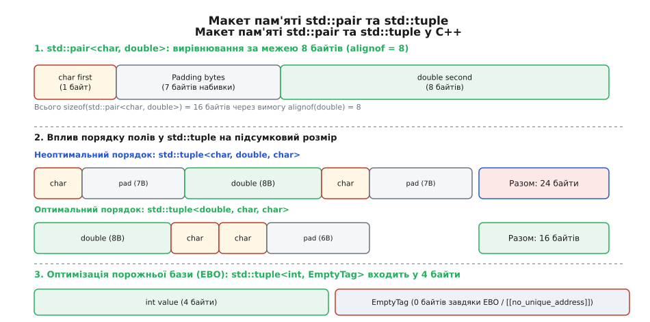
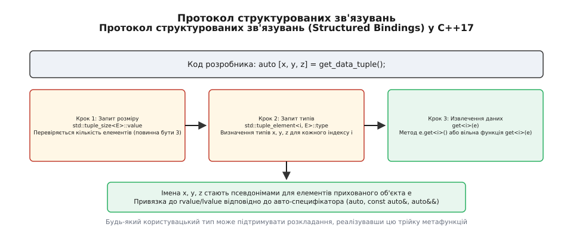
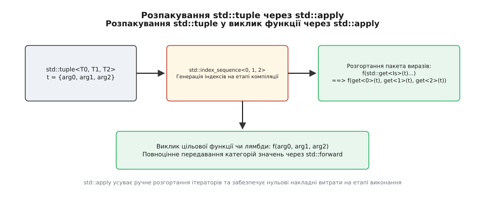

# std::tuple та std::pair: гетерогенні контейнери та агрегація даних без створення класичних структур

<preknowlist>
- [Категорії значень: lvalue, prvalue, xvalue](book:cpp-standards/value-categories) — семантика rvalue та тимчасових об'єктів у шаблонах.
- [Семантика переміщення і rvalue-посилання](book:cpp-standards/move-semantics) — передача ресурсів без додаткового копіювання.
- [Згортання посилань та ідеальне передавання](book:cpp-standards/perfect-forwarding) — збереження категорії значення аргументів за допомогою std::forward.
- [Шаблони зі змінною кількістю аргументів: variadic templates](book:cpp-standards/variadic-and-folds) — використання пакетів параметрів Args... та їх розгортання.
- [Структуровані зв'язування: auto [x, y]](book:cpp-standards/structured-bindings) — розкладання гетерогенних об'єктів на складові у C++17.
</preknowlist>

Під час розробки високопродуктивного сервера баз даних або виклику парсера мережевих пакетів функція обробки повинна повернути викликачу декілька різнотипних результатів: прапорець успішності операції `bool`, прочитаний об'єкт запису `Record` та кількість оброблених байтів `std::size_t`. Спроба передати ці значення через вихідні посилання-параметри (`Record& out_record, std::size_t& out_bytes`) руйнує незмінність об'єктів (const-correctness), змушує викликача виконувати попереднє конструювання порожніх об'єктів перед викликом та робить неможливим побудову чистих обчислювальних конвеєрів. Спроба ж створювати під кожну функцію окрему одноразову структуру `struct ParseResult` захаращує простір імен заголовків сотнями дрібних типів і позбавляє код можливості працювати з узагальненими алгоритмами стандартної бібліотеки.

Шаблонні класи `std::pair` (уведений у C++98) та `std::tuple` (стандартизований у C++11) розв'язують цю проблему на рівні системи типів компілятора. Вони виражають анонімну гетерогенну агрегацію фіксованої кількості об'єктів довільних типів у суцільному блоці пам'яті без жодної динамічної алокації у купі та забезпечують нульові накладні витрати під час виконання.

## 1. Проблема повернення кількох значень та роль гетерогенної агрегації

У системному програмуванні на C++ вибір способу об'єднання кількох значень визначає як продуктивність коду, так і його архітектурну чистоту. Розглянемо п'ять основних підходів до повернення результатів обчислень:

1. **Вихідні параметри за посиланням (`T&`)**: викликач змушений заздалегідь створювати змінні до виклику функції. Якщо збережений тип не має конструктора за замовчуванням або його конструювання коштує дорого (наприклад, відкриття файлового хендла чи мережевого сокета), цей підхід стає непридатним. Більше того, вихідні параметри блокують можливість використання `constexpr`-обчислень під час компіляції та унеможливлюють пряме повернення тимчасових rvalue-значень у ланцюжках викликів.
2. **Одноразові локальні структури (`struct Result`)**: створення іменованої структури є ідеальним рішенням для предметної області (domain model), де поля мають чіткі семантичні назви (`latitude`, `longitude`). Проте в абстрактному метапрограмуванні, шаблонах алгоритмів та внутрішніх утилітах створення сотень одноразових структур призводить до дублювання коду та ускладнює написання узагальнених шаблонних обгорток, які не можуть знати назви полів користувацьких типів.
3. **Обгортки опціонального стану (`std::optional<T>` та `std::expected<T, E>`)**: застосовуються тоді, коли функція повертає єдиний результат, який може бути відсутнім або супроводжуватися кодом помилки. Проте вони не розв'язують задачу повернення кількох успішно обчислених різнотипних значень одночасно.
4. **Динамічні контейнери (`std::vector<std::any>`)**: стирають типи на етапі виконання і вимагають алокації пам'яті у купі, що спричиняє провали у продуктивності на сотні тактів процесора і повністю знищує статичну типізацію.
5. **Стандартні гетерогенні контейнери (`std::pair` та `std::tuple`)**: виражають агрегацію типів на рівні метапрограмування. Вони дозволяють обробляти набори даних узагальненими алгоритмами, підтримують автовиведення типів і безпосередньо інтегруються у контейнери стандартної бібліотеки STL.

Контейнер `std::pair<T1, T2>` лежить в основі роботи асоціативних контейнерів `std::map<Key, Value>` та `std::unordered_map`, де кожен вузол дерева чи кошика хеш-таблиці зберігає пару `std::pair<const Key, Value>`. Операція вставки `std::map::insert` повертає пару `std::pair<iterator, bool>`, де ітератор вказує на елемент у дереві, а прапорець `bool` сигналізує, чи було елемент дійсно вставлено, чи такий ключ уже існував. Алгоритми пошуку на кшталт `std::equal_range` повертають пару ітераторів `std::pair<Iter, Iter>`, що позначає напіввідкритий діапазон знайдених елементів.

Розробку та поетапне розширення гетерогенних типів у стандартах C++ детально висвітлено у статті [Еволюція гетерогенних типів у C++: від std::pair до std::tuple та структурованих зв'язувань](book:cpp-standards/tuple-and-pair/hist-tuple-evolution.md).

Клас `std::tuple<Types...>` є узагальненням `std::pair` на довільну кількість елементів `N`, яке повністю зберігає категоризацію значень і дозволяє маніпулювати пакетами типів на етапі компіляції.

## 2. Анатомія макету пам'яті, вирівнювання та оптимізація порожньої бази (EBO)

Внутрішнє розміщення елементів `std::pair` та `std::tuple` у пам'яті підпорядковується загальним правилам розташування полів у структурах C++ (Alignment and Padding rules).

### Макет пам'яті std::pair<T1, T2>

Об'єкт `std::pair<T1, T2>` концептуально є звичайною C++-структурою з двома публічними полями `first` та `second`:

```cpp
template <typename T1, typename T2>
struct pair {
    T1 first;
    T2 second;
};
```

Порядок розташування полів у пам'яті фіксований: `first` завжди розміщується за молодшою адресою, а `second` — за старшою. Повний розмір `sizeof(std::pair<T1, T2>)` обчислюється з урахуванням вимог до вирівнювання обох типів:

```
sizeof(std::pair<T1, T2>) = align_up(sizeof(T1) + padding1 + sizeof(T2), max(alignof(T1), alignof(T2)))
```

Наприклад, у 64-бітній архітектурі x86-64 для `std::pair<char, double>`:
- `sizeof(char) = 1`, `alignof(char) = 1`.
- `sizeof(double) = 8`, `alignof(double) = 8`.
- Поле `first` займає 1 байт за зміщенням `0`. Далі компілятор змушений вставити **7 байтів набивки** (padding bytes), щоб адреса поля `second` була кратною 8.
- Поле `second` займає 8 байтів за зміщенням `8`.
- Підсумковий розмір `sizeof(std::pair<char, double>) = 16` байтів.

Якщо ж ми поміняємо типи місцями й створимо `std::pair<double, char>`, поле `first` розтягнеться від 0 до 7 байтів, `second` займе 1 байт за зміщенням 8, і ще 7 байтів набивки будуть додані наприкінці структури для збереження вирівнювання масиву `pair[]`. Загальний розмір залишиться 16 байтів.


*Макет пам'яті std::pair та std::tuple у C++: порівняння вирівнювання полів, байтів набивки та оптимізації порожньої бази (EBO).*

### Імплементація std::tuple: від рекурсивного успадкування до листової композиції

Оскільки в C++ не можна оголосити масив різнотипних елементів у вигляді `Types m_data[...]`, реалізації `std::tuple` використовують шаблони для побудови ієрархії збереження. У класичних реалізаціях (GCC libstdc++, LLVM libc++) застосовується один із двох підходів:

1. **Рекурсивне успадкування (Recursive Inheritance)**: `std::tuple<Head, Tail...>` успадковує `std::tuple<Tail...>` та містить одне поле `Head`.
2. **Листова композиція (Leaf-based implementation)**: `std::tuple` успадковує `N` окремих вузлів-листків `_Tuple_leaf<Index, Type>`, кожен з яких зберігає елемент з відповідним індексом.

Концептуальна схема рекурсивного успадкування виглядає наступним чином:

```cpp
// Базовий випадок рекурсії: порожній кортеж
template <std::size_t Index, typename... Types>
struct _Tuple_impl;

// Рекурсивна спеціалізація
template <std::size_t Index, typename Head, typename... Tail>
struct _Tuple_impl<Index, Head, Tail...> : public _Tuple_impl<Index + 1, Tail...> {
    Head m_head; // Збережений елемент поточного рівня
};
```

При такій імплементації елементи базових класів розміщуються в пам'яті послідовно. Порядок розташування полів у пам'яті для рекурсивного кортежу може бути зворотним або прямим залежно від реалізації стандартної бібліотеки. Наприклад, у GCC libstdc++ `std::get<0>(t)` знаходиться за наймолодшою адресою, оскільки листові класи розгортаються від початку списку типів.

### Вплив порядку полів у кортежі на підсумковий розмір пам'яті

Через наявність байтів набивки між різнотипними посиланнями порядок оголошення типів у `std::tuple` безпосередньо впливає на кількість споживаної пам'яті. Розглянемо два кортежі з однаковим набором типів:

```cpp
using BadTuple  = std::tuple<char, double, char>;
using GoodTuple = std::tuple<double, char, char>;
```

Детальний обчислювальний розклад байтів у 64-бітній системі:

1. **`BadTuple`**:
   - `char` (елемент 0): 1 байт за зміщенням 0.
   - Padding 1: 7 байтів набивки для вирівнювання `double` за межею 8 байтів.
   - `double` (елемент 1): 8 байтів за зміщенням 8.
   - `char` (елемент 2): 1 байт за зміщенням 16.
   - Padding 2: 7 байтів хвостової набивки для збереження кратності 8.
   - Підсумковий розмір дорівнює **24 байтам**.

2. **`GoodTuple`**:
   - `double` (елемент 0): 8 байтів за зміщенням 0.
   - `char` (елемент 1): 1 байт за зміщенням 8.
   - `char` (елемент 2): 1 байт за зміщенням 9 (не вимагає набивки, бо `alignof(char) = 1`).
   - Padding: 6 байтів хвостової набивки.
   - Підсумковий розмір дорівнює **16 байтам**.

Групування типів із більшим вирівнюванням (`alignof`) на початку кортежу дозволяє економити до 33% пам'яті на кожному екземплярі, що стає критичним при зберіганні мільйонів кортежів у векторах `std::vector<std::tuple<...>>`.

### Оптимізація порожньої бази (EBO) та атрибут [[no_unique_address]]

У C++ об'єкт будь-якого типу повинен мати розмір щонайменше 1 байт, щоб гарантувати унікальність його адреси в пам'яті. Якщо тип не має полів (наприклад, безстатусна лямбда, функтор `std::less<T>` або `std::allocator<T>`), його пряме збереження у структурі як поля займе 1 байт плюс байти вирівнювання.

**Оптимізація порожньої бази (Empty Base Optimization, EBO)** дозволяє компілятору виділяти **0 байтів** під базовий клас, якщо цей клас порожній і не збігається за типом з іншими базовими класами. Реалізації `std::tuple` успадковують порожні елементи від `_Tuple_leaf<Index, EmptyType>`, де унікальний індекс `Index` запобігає колізіям адрес однакових порожніх типів. Це дозволяє повністю усунути накладні витрати на збереження безстатусних об'єктів.

У C++20 з появою атрибута `[[no_unique_address]]` реалізації отримали можливість відмовитися від рекурсивного успадкування на користь прямої композиції:

```cpp
// Імплементація кортежу у C++20 із застосуванням no_unique_address
template <std::size_t Index, typename T>
struct _Tuple_member {
    [[no_unique_address]] T value; // Порожні типи T займають 0 байтів у пам'яті
};
```

Завдяки цьому `std::tuple<int, EmptyTag>` у C++20 має розмір рівно `4 байти` (розмір `int`), тоді як без EBO він займав би 8 байтів.

## 3. Спеціальні члени класу, виведення типів та конструювання

Конструювання `std::pair` та `std::tuple` розроблено так, щоб підтримувати три принципи: збереження категорій значень, умовна ініціалізація та захист від небажаних неявних перетворень.

### Умовна явність (conditional explicit) та SFINAE

Однією з найскладніших інженерних задач при створенні `std::pair` та `std::tuple` було забезпечення правильного добору перевантажень конструкторів. Розглянемо приклад:

```cpp
struct ExplicitType {
    explicit ExplicitType(int) {}
};

std::pair<ExplicitType, int> p1 = {1, 2}; // Помилка компіляції! Конструктор explicit.
std::pair<ExplicitType, int> p2(1, 2);    // Успіх. Явний виклик конструктора.
```

Щоб цей код працював коректно, конструктори `std::pair` та `std::tuple` позначаються специфікатором умовної явності (`explicit(condition)` у C++20 або через меташаблони `std::enable_if` у C++11/14):

```cpp
// Концептуальна схема конструктора std::pair у C++20
template <typename U1, typename U2>
requires std::is_constructible_v<T1, U1> && std::is_constructible_v<T2, U2>
constexpr explicit(!std::is_convertible_v<U1, T1> || !std::is_convertible_v<U2, T2>)
pair(U1&& x, U2&& y)
    : first(std::forward<U1>(x)), second(std::forward<U2>(y)) {}
```

Якщо обидва типи джерела неявно перетворюються на цільові типи (`std::is_convertible_v`), конструктор стає неявним (`implicit`). Якщо ж хоча б один тип вимагає явного перетворення (`explicit`), конструктор пари або кортежу також стає `explicit`.

Цей механізм захищає програму від непомітних помилок зведення типів при передачі кортежів у функції, що приймають сумісні за типом структури.

### Фабричні функції: std::make_pair, std::make_tuple та unwrap_ref_decay

До появі C++17 для створення кортежів без явного написання шаблонних параметрів використовувалися фабричні функції:

```cpp
auto p = std::make_pair(10, 3.14);               // std::pair<int, double>
auto t = std::make_tuple(1, "text", std::string()); // std::tuple<int, const char*, std::string>
```

Функція `std::make_tuple` застосовує до своїх аргументів трансформацію `std::unwrap_ref_decay_t`. Це означає, що значення звичайних типів розгортаються до їх базових форм (decay), але якщо аргумент передано через обгортку посилання `std::ref` або `std::cref`, фабрика створює елемент-посилання:

```cpp
int count = 0;
auto t = std::make_tuple(std::ref(count)); // Створює std::tuple<int&>
std::get<0>(t)++;                          // Змінює значення локальної змінної count!
```

Без механізму `unwrap_ref_decay` фабрика створила б `std::tuple<std::reference_wrapper<int>>`, що вимагало б додаткового виклику `.get()` при спробі модифікувати значення.

### Створення кортежів посилань: std::tie та std::forward_as_tuple

У C++ існує два спеціальні інструменти для створення кортежів, що містять посилання:

1. **`std::tie(args...)`**: створює `std::tuple<Args&...>`, що містить lvalue-посилання на передані змінні. Головне призначення `std::tie` до C++17 — розпакування результатів функцій та швидка реалізація операторів порівняння:

```cpp
struct Point {
    int x, y, z;

    // Лексикографічне порівняння двох точок за допомогою std::tie
    bool operator<(const Point& rhs) const {
        return std::tie(x, y, z) < std::tie(rhs.x, rhs.y, rhs.z);
    }
};
```

2. **`std::forward_as_tuple(args...)`**: створює `std::tuple<Args&&...>`, зберігаючи універсальні посилання (rvalue або lvalue) на аргументи.

> ⚠️ **Критичний ризик часу життя**: `std::forward_as_tuple` створює посилання на аргументи, але **не продовжує час життя тимчасових об'єктів**. Збереження результату `std::forward_as_tuple` у локальну змінну викликає невизначену поведінку (UB) через появу висячих посилань (dangling references)!

```cpp
// НЕБЕЗПЕЧНО: Тимчасовий рядок помирає наприкінці виразу!
auto bad_tuple = std::forward_as_tuple(10, std::string("temporary"));
// bad_tuple[1] дивиться на знищену пам'ять!

// БЕЗПЕЧНО: Пряма передача у функцію-обгортку у тому ж виразі
call_worker(std::forward_as_tuple(10, std::string("valid")));
```

### Посекційне конструювання (std::piecewise_construct)

При додаванні елемента у `std::map<std::string, ComplexClass>` за допомогою методів `emplace` виникає проблема: як передати окремі аргументи у конструктор ключа та конструктор значення?

Для цього `std::pair` надає конструктор з міткою `std::piecewise_construct`:

```cpp
std::map<std::string, ComplexClass> my_map;

// Конструювання ключа string("key") та значення ComplexClass(100, 3.14) за місцем у купі
my_map.emplace(
    std::piecewise_construct,
    std::forward_as_tuple("key"),
    std::forward_as_tuple(100, 3.14)
);
```

Цей механізм усуває створення проміжних тимчасових об'єктів `ComplexClass` на стеку, конструюючи поле безпосередньо у ноді червоно-чорного дерева.

### Виведення аргументів шаблонів класів (CTAD) у C++17

У C++17 завдяки гайдам виведення типів (Deduction Guides) потреби у викликах `std::make_pair` та `std::make_tuple` більше немає. Компілятор виводить типи безпосередньо з конструктора:

```cpp
std::pair p(10, 3.14);             // Виводить std::pair<int, double>
std::tuple t(1, "text", 42.0);     // Виводить std::tuple<int, const char*, double>
```

Гайди виведення для `std::pair` у стандартній бібліотеці реалізовані наступним чином:

```cpp
template <typename T1, typename T2>
pair(T1, T2) -> pair<T1, T2>;
```

## 4. Механізм доступу та протокол структурованих зв'язувань

Доступ до елементів `std::pair` та `std::tuple` здійснюється через статично контрольований інтерфейс `std::get`.

### Доступ за індексом та за типом

Доступ за індексом `std::get<I>(t)` перевіряє межі на етапі компіляції. Якщо індекс `I >= sizeof...(Types)`, компілятор видає помилку:

```cpp
std::tuple<int, double, std::string> t(1, 2.0, "test");

int x = std::get<0>(t);      // Повертає int&
double y = std::get<1>(t);   // Повертає double&

// std::get<3>(t);           // Помилка компіляції: Index out of bounds!
```

Функція `std::get<I>` має чотири перевантаження під різні категорії значень:
- `get<I>(tuple&)` -> повертає `T&`.
- `get<I>(const tuple&)` -> повертає `const T&`.
- `get<I>(tuple&&)` -> повертає `T&&` (дозволяє перемістити ресурс).
- `get<I>(const tuple&&)` -> повертає `const T&&`.

У C++14 з'явився доступ за типом `std::get<T>(t)`:

```cpp
std::tuple<int, double, std::string> t(1, 2.0, "test");

double val = std::get<double>(t); // Успіх: повертає елемент 2.0

// Якщо тип не є унікальним у кортежі, компілятор видає помилку:
std::tuple<int, int, double> t2(1, 2, 3.0);
// int v = std::get<int>(t2);     // Помилка компіляції: int зустрічається двічі!
```

### Метафункції інтроспекції: std::tuple_size та std::tuple_element

Стандартна бібліотека надає систему з двох інструментів для компіляційної інтроспекції гетерогенних типів:

1. **`std::tuple_size<T>::value`**: повертає кількість елементів у контейнері.
2. **`std::tuple_element<I, T>::type`**: повертає тип елемента за індексом `I`.

```cpp
using MyTuple = std::tuple<int, std::string, double>;

constexpr std::size_t N = std::tuple_size_v<MyTuple>; // N = 3
using SecondType = std::tuple_element_t<1, MyTuple>;   // SecondType = std::string
```

### Механіка роботи структурованих зв'язувань (C++17)

Синтаксичний цукор C++17 `auto [x, y, z] = tuple;` насправді перетворюється компілятором на трипослідовний метапротокол.


*Трикрокова декомпозиція структурованих зв'язувань C++17: перевірка tuple_size, виведення типів через tuple_element та звернення через get<i>().*

Коли компілятор обробляє вираз `auto [x, y] = expr;`, він виконує наступні дії:
1. Створює прихований анонімний об'єкт `e` і ініціалізує його виразом `expr`.
2. Запитує кількість елементів через `std::tuple_size<decltype(e)>::value`. Кількість імен у дужках `[x, y]` повинна точно дорівнювати цьому значенню.
3. Для кожного індексу `i` визначає тип через `std::tuple_element<i, decltype(e)>::type` та ініціалізує псевдоніми імен викликом `std::get<i>(e)`.

Будь-який користувацький тип даних може підтримувати синтаксис розкладання `auto [a, b]`, якщо для нього реалізовано спеціалізації `std::tuple_size`, `std::tuple_element` та метод або вільну функцію `get<i>()`.

Повний довідник усіх сигнатур функцій, операторів та гарантій `noexcept` зведено у документі [Довідник API: std::pair та std::tuple](book:cpp-standards/tuple-and-pair/api-tuple-and-pair.md).

## 5. Операнди та алгоритми над кортежами

Починаючи з C++17, стандартна бібліотека надає потужні алгоритми для маніпуляції та розпакування кортежів без написання ручних індексних послідовностей.

### Розпакування кортежу у виклик функції: std::apply

Функція `std::apply(fn, tuple)` розпаковує елементи кортежу та передає їх як окремі аргументи у цільову функцію чи лямбду:

```cpp
#include <tuple>
#include <iostream>

void print_sum(int a, double b, int c) {
    std::cout << a + b + c << std::endl;
}

int main() {
    std::tuple<int, double, int> data(10, 2.5, 5);

    // Розпаковує data у виклик print_sum(10, 2.5, 5)
    std::apply(print_sum, data);
}
```


*Механіка розпакування std::tuple у виклик функції за допомогою std::apply та компіляційної послідовності std::index_sequence.*

Внутрішньо `std::apply` створює послідовність індексів `std::make_index_sequence<N>{}` та викликає цільову функцію через пакетний вираз `std::invoke(fn, std::get<Is>(tuple)...)`.

### Конструювання об'єктів з кортежу: std::make_from_tuple

Функція `std::make_from_tuple<T>(tuple)` створює об'єкт типу `T`, передаючи елементи кортежу в його конструктор:

```cpp
struct Foo {
    Foo(int x, double y, std::string z) {}
};

std::tuple<int, double, std::string> args(1, 2.0, "hi");

// Еквівалентно: Foo obj(1, 2.0, "hi");
Foo obj = std::make_from_tuple<Foo>(args);
```

### Об'єднання кортежів: std::tuple_cat

Функція `std::tuple_cat` приймає довільну кількість кортежів, пар чи `std::array` і сплющує їх у єдиний плаский `std::tuple`:

```cpp
std::tuple<int, char> t1(1, 'a');
std::pair<double, const char*> p2(3.14, "str");

// Створює std::tuple<int, char, double, const char*>
auto merged = std::tuple_cat(t1, p2);
```

Практичні приклади реалізації власних метаутиліт над кортежами (серіалізація, елементна трансформація `tuple_transform` та адаптери типів) наведено у статті [Практична реалізація утиліт над кортежами у C++](book:cpp-standards/tuple-and-pair/proj-tuple-utilities.md).

## 6. Архітектурні компроміси, ціна компіляції та двійковий ABI

Використання `std::tuple` у системному програмуванні вимагає розуміння інженерних компромісів між гнучкістю метапрограмування та накладними витратами.

### Ціна компіляції (Compile-time Overhead)

На відміну від звичайних структур C++, `std::tuple` вимагає від компілятора створення десятки внутрішніх інстанціацій шаблонів на кожен об'єкт. При створенні кортежів із десятками елементів або при глибокій рекурсії `std::tuple_cat` час компіляції та споживання пам'яті компілятором (GCC/Clang) зростають за квадратичною залежністю.

У великих проєктах надмірне використання `std::tuple` у публічних заголовках призводить до сповільнення перезбірки файлів (clean build time).

### Двійковий ABI та передача через регістя процесора

У 64-бітній архітектурі System V AMD64 ABI (Linux/macOS) малі тривіальні структури розміром до 16 байтів передаються у регістрах процесора `RAX` та `RDX`.

Проте `std::tuple` у багатьох реалізаціях через наявність нетривіальних конструкторів копіювання чи деструкторів базових класів втрачає статус тривіально копійованого типу (Trivially Copyable). У результаті компілятор змушений передавати `std::tuple` через стек за посиланням, що спричиняє додаткові виклики пам'яті там, де звичайна C-структура передалася б повністю у регістрах процесора за 1 такт.

> 🔧 **Навіщо це.** 
> Використовуйте `std::pair` та `std::tuple` у внутрішніх обобщених алгоритмах, шаблонних бібліотеках, метафункціях та при швидкому розпакуванні результатів через структуровані зв'язування. Для публічних інтерфейсів модуля, предметних моделей (Domain Objects) та довгоживучих структур даних завжди віддавайте перевагу явно іменованим структурам `struct`: це покращує читабельність коду, прискорює компіляцію та гарантує оптимальну передачу даних через регістри процесора ABI.
