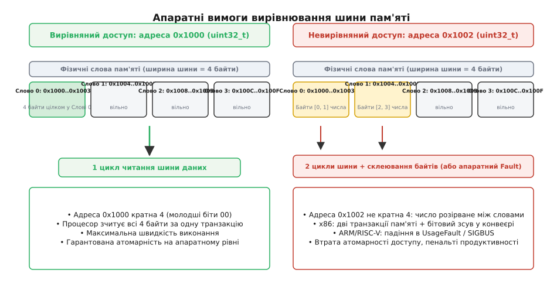
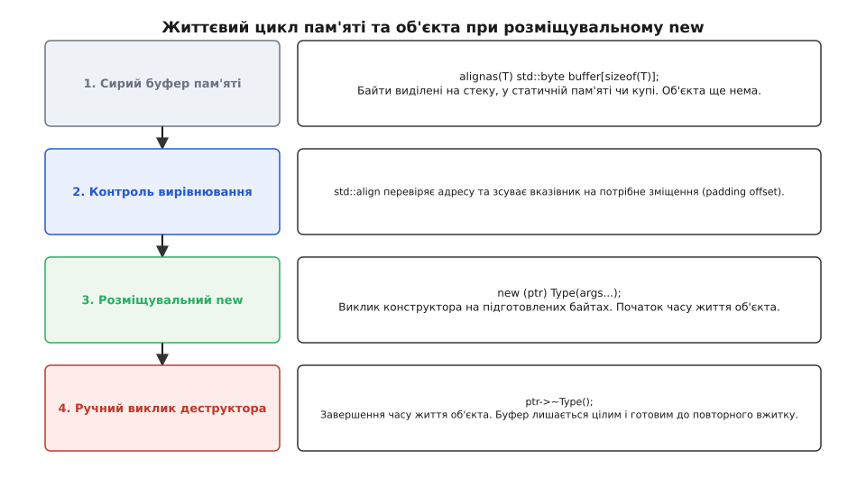
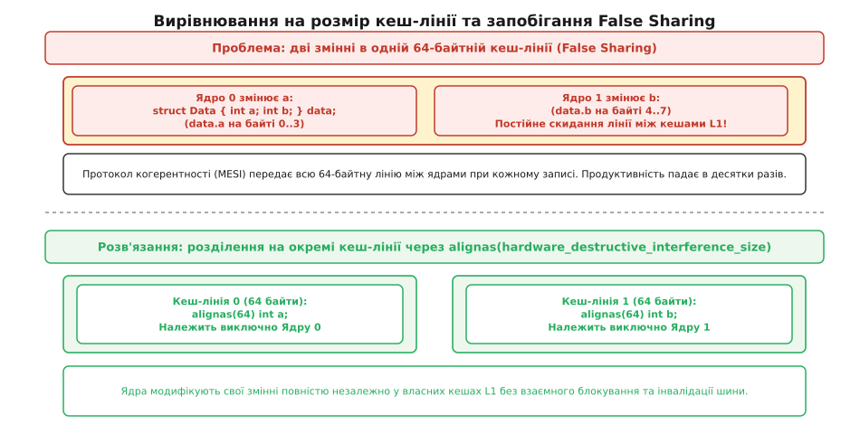

# Вирівнювання й розміщувальний new

<preknowlist>
- [Адреси й покажчики](book:programming/addresses-pointers) — що таке адреса комірки пам'яті, байтова адресація та розіменування вказівника.
- [Купа](book:programming/heap-dynamic-memory) — динамічне виділення неперервних блоків сирої пам'яті через системні алокатори.
- [Час життя об'єкта](book:cpp-standards/object-lifetime) — різниця між наявністю сирих байтів у пам'яті та активним періодом існування типізованого об'єкта.
- [Невизначена поведінка (UB)](book:programming/undefined-behavior) — чому порушення правил мови й вимог апаратури ламає оптимізації компілятора та стабільність програми.
- [RAII](book:programming/raii) — зв'язування життєвого циклу ресурсу з автоматичним викликом конструктора й деструктора.
</preknowlist>

Коли низькорівневий мережевий парсер або драйвер апаратного датчика зчитує потік сирих байтів, у вхідному буфері `uint8_t buffer[64]` різні поля повідомлення розташовуються безпосередньо одне за одним. Якщо 64-бітна мітка часу `uint64_t` знаходиться за непарним зміщенням 3 байти від початку пакета, наївне приведення вказівника `reinterpret_cast<const uint64_t*>(buffer + 3)` і його розіменування створюють критичну аварійну ситуацію. На 64-бітному процесорі x86 у режимі налагодження такий код може тимчасово прочитати число, але при увімкненні оптимізації `-O3` компілятор замінить скалярне завантаження векторною інструкцією `movaps` або `vmovdqa`, яка вимагає кратності адреси, і процес негайно впаде від апаратного виключення General Protection Fault (`#GP`). На мікроконтролерах ARM Cortex-M або процесорах RISC-V непідрівняне читання миттєво зупиняє систему апаратним виключенням `UsageFault` чи сигналом `SIGBUS`.

Ця проблема виникає тому, що адреса в комп'ютерній пам'яті — це не просто абстрактний числовий індекс. Фізична пам'ять об'єднана з процесором шиною даних фіксованої ширини, і читання багатобайтових значень за довільними адресами порушує базові закони роботи апаратного забезпечення. Крім того, якщо в сирому буфері пам'яті потрібно створити повноцінний типізований C++ об'єкт зі складним конструктором, таблицею віртуальних методів чи константними полями без виділення пам'яті в купі через повільний `malloc`, прямий запис у байти порушує модель часу життя мови.

Для розв'язання цих апаратних та архітектурних вимог у C++ використовуються дві тісно пов'язані концепції: **вирівнювання даних у пам'яті** (англ. *memory alignment*) через оператори `alignof` та `alignas`, і механізм **розміщувального new** (англ. *placement new*), що дозволяє конструювати об'єкти у заздалегідь виділених сирих буферах із подальшим ручним контролем деструкторів.

## Чому адреса має значення: фізика шини й природне вирівнювання

Щоб зрозуміти, чому процесор вимагає розміщення даних за строго визначеними адресами, слід розглянути фізичний інтерфейс між обчислювальним ядром, ієрархією кеш-пам'яті та оперативною пам'яттю (DRAM).

Процесор ніколи не зчитує з пам'яті окремі поодинокі байти для обчислень. Фізична шина даних має фіксовану розрядність: 32 біти (4 байти) на 32-бітних архітектурах або 64 біти (8 байтів) на 64-бітних платформах. Кожен цикл шини передає неподільний блок пам'яті — так зване «машинне слово». Лінії адресної шини найнижчого порядку (біти `A[0]` і `A[1]` для 32-бітних шин або `A[0]`, `A[1]`, `A[2]` для 64-бітних) апаратно не беруть участі у виборі рядка пам'яті — контролер пам'яті завжди вибирає блок, чия початкова адреса ділиться на 4 або на 8 без залишку.

Коли 4-байтне число типу `uint32_t` розташоване за адресою `0x1000`, усі його чотири байти цілком потрапляють в одне машинне слово. Процесор виставляє адресу на шину і зчитує число за **один-єдиний такт шини**.


*Зліва: вирівняне 32-бітне число зчитується за одну транзакцію шини. Справа: невирівняне число перетинає межу слів, вимагаючи двох транзакцій і склеювання байтів на x86 або спричиняючи апаратний збій на ARM.*

Якщо ж те саме 4-байтне число покласти за адресою `0x1002`, воно опиниться «розірваним» між двома сусідніми машинними словами: перші 2 байти потраплять у слово `0x1000..0x1003`, а наступні 2 байти — у слово `0x1004..0x1007`.

Наслідки такого розміщення залежать від цільової архітектури:

1. **Суворі архітектури (ARM Cortex-M0/M3, SPARC, MIPS, RISC-V):** Блок декодування інструкцій процесора апаратно фіксує ненульові молодші біти адреси при виконанні інструкції завантаження слова (`LDR`). Процесор відмовляється виконувати таку операцію й негайно генерує апаратне виключення Alignment Fault. На мікроконтролері це викликає безумовний стрибок у функцію обробки аварій `HardFault_Handler`, а в середовищі Linux/POSIX операційна система надсилає процесу сигнал аварійного завершення `SIGBUS`.
2. **Архітектури з апаратною підтримкою непідрівняного доступу (x86, x86-64, новітні ядра ARM Cortex-A):** Процесор містить спеціальні блоки апаратного злиття в конвеєрі завантаження. Він автоматично генерує **два послідовні цикли читання шини**, зчитує обидва слова, зсуває біти в регістрах і склеює їх в одне значення. Ця операція коштує у 2–3 рази більше тактів процесора. Якщо ж адреса перетинає межу 64-байтної кеш-лінії L1, конвеєр повністю зупиняється на час перезавантаження обох кеш-ліній з пам'яті.
3. **Втрата атомарності доступу:** Невирівняне звернення ніколи не може бути атомарним на рівні заліза. Якщо один потік записує 4 байти за адресою `0x1002`, а інший потік їх зчитує, читач може застати перші два байти новими, а останні два — старими (розірваний стан пам'яті або data tearing).
4. **Формальна модель стандарту C++:** Згідно зі стандартом мови, приведення покажчика до типу з суворішим вирівнюванням і його розіменування за непідрівняною адресою є **абсолютною невизначеною поведінкою (Undefined Behavior)**. Компілятор має законне право вважати, що будь-який вказівник `T*` завжди вирівняний по межі `alignof(T)`. На основі цього припущення оптимізатор генерує високошвидкісні векторні SIMD-інструкції (SSE, AVX, NEON), які вимагають кратності 16, 32 або 64 байтів і падають за найменшого відхилення.

Правило, згідно з яким адреса об'єкта повинна ділитися на його розмір для коректної та швидкої роботи процесора, називається **природним вирівнюванням** (англ. *natural alignment*).

## Мовні засоби: запит через alignof та наказ через alignas

До появи стандарту C++11 програмісти користувалися специфічними макросами компіляторів (`__attribute__((aligned(N)))` у GCC/Clang та `__declspec(align(N))` у Microsoft Visual C++). Стандарт C++11 стандартизував роботу з вирівнюванням, увівши два ключові слова: `alignof` та `alignas`.

### Оператор alignof

Оператор `alignof` приймає ім'я типу й повертає його вимогу вирівнювання в байтах як константу часу компіляції типу `std::size_t`:

```cpp
#include <cstddef>
#include <cstdint>

static_assert(alignof(char) == 1);
static_assert(alignof(int16_t) == 2);
static_assert(alignof(int32_t) == 4);
static_assert(alignof(double) == 8);
```

Значення `alignof` завжди є додатним степенем двійки (`1`, `2`, `4`, `8`, `16`, `32`, `64` тощо). Для складених типів (структур і класів) вирівнювання за замовчуванням визначається **найбільшим значенням `alignof` серед усіх його нестатичних членів**:

```cpp
struct Packet {
    char flag;       // 1 байт
    int id;          // 4 байти (вимагає вирівнювання 4)
    short length;    // 2 байти
};

static_assert(alignof(Packet) == 4);
static_assert(sizeof(Packet) == 12); // 1 + (3 padding) + 4 + 2 + (2 tail padding)
```

Компілятор автоматично вставляє 3 байти внутрішнього заповнення (padding) між полем `flag` та полем `id`, щоб поле `id` гарантовано розмістилося за адресою, кратною 4. Крім того, компілятор додає 2 байти хвостового заповнення наприкінці структури. Це хвостове заповнення гарантує, що якщо ми створимо масив `Packet array[10]`, кожен наступний елемент масиву розпочнеться з адреси, кратної 4.

Щоб мінімізувати втрати пам'яті на вирівнювальне заповнення всередині структур, інженери застосовують правило спадання розмірів: спочатку оголошуються найбільші поля (8-байтні покажчики та `double`), потім 4-байтні (`int`), потім 2-байтні (`short`) і наприкінці 1-байтні (`char`, `bool`). Таке перевпорядкування скорочує розмір структури без втрати даних. Прапорець компілятора GCC/Clang `-Wpadded` дозволяє автоматично виявляти структури, де виникають приховані байти заповнення.

У стандарті C++20 додатково введено атрибут `[[no_unique_address]]`. Якщо клас містить порожній stateless-член (наприклад, порожній користувацький алокатор або функтор-компаратор), за замовчуванням стандарту він зобов'язаний займати щонайменше 1 байт пам'яті для гарантії унікальності адреси, що часто додає від 3 до 7 байтів padding через вирівнювання наступного поля. Застосування `[[no_unique_address]] Alloc alloc;` дозволяє компілятору стиснути розмір цього члена до 0 байтів, усуваючи зайве вирівнювальне заповнення.

Крім того, вирівнювання безпосередньо впливає на можливості автовекторизації циклів компілятором. Прапорці оптимізації `-fopt-info-vec-optimized` та `-fopt-info-vec-missed` у GCC показують, що коли компілятор не впевнений у кратності вихідних адрес масиву межі 32 або 64 байтів, він генерує повільний скалярний пролог та епілог навколо циклу для вирівнювання адреси під час виконання. Явне задання вирівнювання дозволяє генерувати чистий векторний код без додаткових перевірок.

### Специфікатор alignas

Специфікатор `alignas` дозволяє явно підвищити вимогу вирівнювання для змінної, поля структури або визначення цілого типу:

```cpp
// 1. Змінна на стеку буде вирівняна по межі 64 байтів (початок кеш-лінії)
alignas(64) int aligned_counter = 0;

// 2. Буфер, вирівняний під суворі вимоги типу double
alignas(double) std::byte storage[sizeof(double)];

// 3. Структура, вирівняна для швидких векторних інструкцій AVX-512
struct alignas(64) AVXBlock {
    float values[16];
};
```

Специфікатор `alignas` підпорядковується суворим мовним правилам:

1. **Заборона послаблення:** `alignas` не може зменшити вирівнювання нижче природного вирівнювання типу. Оголошення `alignas(1) int x;` призведе до помилки компіляції, оскільки природне вирівнювання `int` дорівнює 4. Послабити вирівнювання можна лише через компіляторні директиви пакування (`#pragma pack(push, 1)` або `__attribute__((packed))`), які прибирають проміжне заповнення, але роблять взяття покажчика на непідрівняне поле джерелом Undefined Behavior.
2. **Ступінь двійки:** Значення вирівнювання обов'язково має бути степенем двійки. Значення `alignas(3)` чи `alignas(10)` є синтаксично некоректними.
3. **Вибір максимального:** Якщо до одного елемента застосовано кілька специфікаторів `alignas`, компілятор обирає найбільше значення: `alignas(8) alignas(32) int val;` встановить вирівнювання 32.

### Фундаментальне вирівнювання та std::max_align_t

Усі типи у C++ класифікуються за рівнем вимог до адреси:
- **Типи з фундаментальним вирівнюванням:** типи, для яких `alignof(T) <= alignof(std::max_align_t)`.
- **Типи з надмірним вирівнюванням (over-aligned types):** типи, вирівняні на більшу величину через явний `alignas(32)`, `alignas(64)` тощо (наприклад, типи SIMD-регістрів або структур, вирівняних на лінію кешу).

Тип `std::max_align_t` (визначений у заголовку `<cstddef>`) — це фундаментальний скалярний тип платформи, чиє вирівнювання є максимальним серед усіх скалярних типів за відсутності директив `alignas`. На 64-бітних системах x86-64 та ARM64 `alignof(std::max_align_t)` зазвичай становить **16 байтів** (вирівнювання типу `long double` або подвійного машинного слова).

Головна системна гарантія стандарту полягає в тому, що всі системні функції виділення динамічної пам'яті (`std::malloc`, `std::calloc`, стандартний глобальний `::operator new`) **завжди повертають адресу, вирівняну щонайменше за `alignof(std::max_align_t)`**.

Для динамічного виділення об'єктів із надмірним вирівнюванням (`alignof(T) > alignof(std::max_align_t)`) у стандарті C++17 введено переліковий тип `std::align_val_t` та перевантаження `operator new(size_t, std::align_val_t)`, які транслюються в системні виклики `posix_memalign` або `aligned_alloc`.

Повний перелік сигнатур функцій, операторів і правил взаємодії з компілятором наведено в окремій [довідковій вставці з API вирівнювання](book:cpp-standards/alignment-placement-new/api-alignment-utilities.md). Вона містить формальний опис `std::align`, `std::align_val_t`, `std::assume_aligned` та багатопотокових констант когерентності.

## Розділення виділення й народження: розміщувальний new

Коли в програмі C++ створюється об'єкт у динамічній пам'яті через звичайний вираз:

```cpp
Widget* w = new Widget(10, 20);
```

компілятор виконує дві принципово різні фази, об'єднані в один синтаксичний вираз:
1. **Виділення сховища (байти пам'яті):** викликається функція `void* raw = ::operator new(sizeof(Widget))`, яка звертається до алокатора купи за вільним блоком пам'яті.
2. **Ініціалізація об'єкта (початок часу життя):** компілятор генерує прямий виклик конструктора `Widget::Widget(10, 20)`, передаючи адресу `raw` як неявний покажчик `this`.

У багатьох критично важливих архітектурних задачах ці дві дії **необхідно розділити**:
- **Вбудовані системи реального часу (Embedded):** використання динамічної купи заборонено стандартами надійності (MISRA C++) через ризик фрагментації та повільний нефіксований час виділення. Об'єкти мають конструюватися у статично виділених буферах або на стеку.
- **Власні алокатори та монотонні арени:** програма виділяє один суцільний блок на 50 МБ наперед, а потім швидко нарізає його під тисячі дрібних об'єктів за декілька тактів процесора без системних викликів і блокувань м'ютексів.
- **Контейнери стандартної бібліотеки:** `std::vector<T>` виділяє сиру пам'ять наперед під час виклику `reserve(100)`, але не створює там 100 об'єктів одразу — нові елементи конструюються по одному в міру додавання через `push_back()` або `emplace_back()`.
- **Типи з опціональним збереженням:** `std::optional<T>` та `std::variant<Types...>` тримають внутрішній сирий буфер `alignas(T) std::byte storage[sizeof(T)]` і викликають конструктор об'єкта лише в той момент, коли значення дійсно з'являється.

Механізм, що дозволяє виконати виклик конструктора над уже готовою, попередньо виділеною адресою пам'яті, називається **розміщувальним new** (англ. *placement new*).

### Синтаксис та механізм дії

Для використання розміщувального new обов'язково підключається заголовок `<new>`. Синтаксис виклику передає цільову адресу в круглих дужках безпосередньо після ключового слова `new`:

```cpp
#include <new>
#include <cstddef>
#include <string>
#include <iostream>

int main() {
    // 1. Виділяємо сирий буфер пам'яті з ПРАВИЛЬНИМ вирівнюванням
    alignas(std::string) std::byte storage[sizeof(std::string)];

    // На цьому етапі в storage лежать неініціалізовані байти.
    // Об'єкта std::string ще НЕ існує. Викликати його методи — це грубе UB.

    // 2. Конструюємо об'єкт у підготовленому буфері через розміщувальний new
    std::string* str_ptr = ::new (storage) std::string("Привіт, розміщувальний new!");

    // Тепер час життя об'єкта почався. Використання методів законне.
    std::cout << *str_ptr << " (довжина: " << str_ptr->length() << ")\n";

    // 3. Завершення часу життя об'єкта
    str_ptr->~basic_string();
}
```


*Чотири послідовні фази: отримання сирих байтів потрібного розміру й вирівнювання, перевірка адреси, виклик конструктора на місці та ручний виклик деструктора зі збереженням пам'яті буфера.*

### Як працює розміщувальний operator new

У стандартній бібліотеці неалокуючий розміщувальний оператор `operator new` реалізований як гранично проста функція:

```cpp
void* operator new(std::size_t size, void* ptr) noexcept {
    return ptr;
}
```

Ця функція не виконує жодного виділення пам'яті і просто повертає переданий покажчик `ptr`. Коли компілятор обробляє вираз `new (storage) T(args...)`, він транслює його у три чіткі кроки:

1. Викликається функція `operator new(sizeof(T), storage)`, яка повертає адресу `storage`.
2. Компілятор генерує машинний код виклику конструктора `T::T(args...)`, де як неявний покажчик `this` передається повернута адреса. Якщо клас має віртуальні методи, конструктор записує покажчик на таблицю віртуальних методів (`vptr`) на самий початок виділеного блоку.
3. Вираз повертає строго типізований вказівник `T*`.

> ⚠️ **Пастка типу буфера та Strict Aliasing:** Ніколи не оголошуйте сирий буфер як звичайний масив `char buffer[sizeof(T)]` без явного `alignas`. Тип `char` має вимогу вирівнювання `1`. Компілятор має повне право розмістити такий масив на стеку за непарною адресою `0x7fff0003`. Спроба викликати `new (buffer) double(3.14)` створить об'єкт `double` за адресою, не кратній 8, що спричинить моментальне порушення апаратних вимог або скидання конвеєра. У сучасному C++ (починаючи з C++17) ідеальним типом для сирих буферів є `std::byte` (або `unsigned char`), оскільки вони явно позначають нетипізовану сиру пам'ять і мають спеціальний виняток у правилах псевдонімів типу (Strict Aliasing Rule).

### Спадкування та розміщення в пам'яті

При роботі з поліморфними класами та множинним успадкуванням розміщувальний new вимагає особливої уваги до адрес.

Якщо клас `Derived` успадковує `BaseA` та `BaseB`:
- Покажчик на `BaseA` зазвичай збігається з початком об'єкта `Derived` (зміщення 0).
- Покажчик на `BaseB` зміщений у пам'яті на розмір `BaseA` плюс внутрішній padding.

Якщо об'єкт створено через `Derived* d = new (storage) Derived();`, то неявне приведення до базового типу `BaseB* b = d;` автоматично додасть потрібне зміщення. Проте пряме приведення сирого покажчика `reinterpret_cast<BaseB*>(storage)` призведе до звернення за хибною адресою і краху при виклику методів, оскільки зміщення не буде враховано.

## Ручний виклик деструктора та повторний вжиток пам'яті

Для об'єктів, створених через звичайний куповий `new`, знищення виконується оператором `delete ptr`. Проте для об'єктів, створених через розміщувальний new, застосування `delete` є **катастрофічною помилкою**.

Оператор `delete ptr` виконує дві нерозривні дії:
1. Кличе деструктор `ptr->~T()`.
2. Кличе функцію `::operator delete(ptr)`, яка намагається повернути блок пам'яті назад у системну купу операційної системи.

Якщо об'єкт було розміщено у статичному буфері, на автоматичному стеку або всередині суцільної монотонної арени, системний алокатор отримає покажчик на чужу пам'ять і впаде з помилкою `free(): invalid pointer` або непоправно пошкодить структури пам'яті процесу.

### Правило явного виклику деструктора

Для коректного завершення часу життя об'єкта, створеного через розміщувальний new, його деструктор **завжди викликається явно вручну**:

```cpp
str_ptr->~basic_string();
```

Після завершення виконання тіла деструктора час життя об'єкта вважається закінченим. Будь-які спроби звернутися до полів або методів цього об'єкта стають Undefined Behavior.

Проте фізичний буфер пам'яті `storage` **залишається виділеним і неушкодженим**. Це дозволяє багаторазово використовувати ту саму ділянку пам'яті для створення нових об'єктів:

```cpp
alignas(Widget) std::byte buffer[sizeof(Widget)];

// Створюємо перший екземпляр
Widget* w1 = ::new (buffer) Widget("Перший об'єкт");
w1->process();
w1->~Widget(); // завершуємо час життя першого об'єкта

// У тому самому буфері конструюємо другий екземпляр
Widget* w2 = ::new (buffer) Widget("Другий об'єкт");
w2->process();
w2->~Widget(); // завершуємо час життя другого об'єкта
```

### Обробка винятків під час розміщувального new

Що відбувається, якщо конструктор `Widget::Widget(...)` під час розміщувального new викидає виняток?

1. Об'єкт не народився — його час життя не розпочався, тому його деструктор `Widget::~Widget()` не викликається.
2. Усі підоб'єкти та базові класи, які встигли ініціалізуватися до моменту винятку, автоматично знищуються у зворотному порядку.
3. Середовище виконання C++ шукає парний оператор звільнення `operator delete(void*, void*)` і викликає його. Оскільки стандартний розміщувальний `operator delete` порожній, пам'ять під буфер не звільняється.
4. Виняток летить далі у викликовий стек.

Якщо ви створюєте масив об'єктів у сирому буфері, використання виразу масивного розміщувального new `new (storage) T[N]` є **небезпечною антипатерною практикою**. Компілятори часто записують службовий заголовок із кількістю елементів (так зване array cookie розміром 4 або 8 байтів) перед першим елементом масиву. Це непередбачувано зсуває адресу першого елемента, порушує вирівнювання та призводить до виходу за межі буфера `storage`. Правильний спосіб створення масивів у сирій пам'яті — це послідовне створення елементів у циклі через звичайний одиничний розміщувальний new `new (ptr + i) T(...)`.

### Оптимізації компілятора та функція std::launder

При повторному конструюванні об'єктів в одному буфері виникає тонка оптимізаційна проблема. Якщо клас містить константні поля (`const int id`) або поля-посилання (`Target& ref`), компілятор під час агресивної оптимізації вважає, що значення `w1->id` ніколи не може змінитися за весь час виконання програми, і зберігає його значення в регістрі процесора.

Коли ви знищуєте `w1`, створюєте на його місці `w2` з новим константним `id`, а потім звертаєтеся до поля через старий вказівник, оптимізатор може використати застаріле значення з регістра, ігноруючи реальні байти в пам'яті.

Щоб розірвати оптимізаційні припущення компілятора та змусити його заново прочитати оновлені дані з пам'яті, у C++17 додано функцію `std::launder` (буквально — «відмити вказівник»):

```cpp
#include <new>

Widget* valid_w2 = std::launder(reinterpret_cast<Widget*>(buffer));
```

Детальний математичний та мовний аналіз цієї концепції розкрито в окремій темі про [std::launder](book:cpp-standards/std-launder).

## Пошук вирівняного зміщення: функція std::align

Поодинокий буфер `alignas(T) std::byte buffer[sizeof(T)]` створити нескладно, оскільки його вирівнювання задане статично під час компіляції. Але у власних пулах та алокаторах пам'яті виникає складніше завдання: у нас є один великий блок пам'яті (наприклад, 1 МБ), і в нього потрібно послідовно вкладати різнорідні об'єкти довільних розмірів і типів: спершу `int16_t` (2 байти), потім `double` (8 байтів), потім структуру з вирівнюванням 32 байти.

Кожне виділення зміщує вказівник вільного місця на довільну кількість байтів, тому поточна адреса майже ніколи не потрапляє на межу вирівнювання наступного об'єкта.

Стандартна бібліотека C++ надає функцію `std::align` (заголовок `<memory>`), яка автоматично виконує всі математичні розрахунки вирівнювання адрес:

```cpp
#include <memory>

void* std::align(
    std::size_t alignment, // потрібне вирівнювання (ступінь двійки)
    std::size_t size,      // розмір створюваного об'єкта
    void*& ptr,            // покажчик на початок вільної пам'яті (вхідний та вихідний)
    std::size_t& space     // залишок вільного місця в буфері (вхідний та вихідний)
) noexcept;
```

### Математика обчислення вирівняного відступу

Нехай поточна адреса вказівника дорівнює `ptr = 0x1003`, а нам потрібно розмістити об'єкт `double` (`alignment = 8`, `size = 8`) у буфері, де залишилося `space = 50` байтів.

1. **Розрахунок відступу (padding):** Адреса `0x1003` при діленні на 8 дає залишок 3 (`0x1003 % 8 = 3`). Щоб дійти до найближчого числа, кратного 8, потрібно додати відступ `offset = 8 - 3 = 5` байтів.
   У двійковій арифметиці для степенів двійки цей зсув обчислюється через бітову маску:
   ```
   aligned_address = (current_address + alignment - 1) & ~(alignment - 1)
   offset = aligned_address - current_address
   ```
   У нашому випадку: `(0x1003 + 7) & ~7 = 0x100A & 0xFFF8 = 0x1008`. Відступ складає: `0x1008 - 0x1003 = 5` байтів.
2. **Перевірка доступного простору:** Функція перевіряє, чи вистачає вільного місця: `size + offset <= space`. У нашому випадку: `8 + 5 = 13 <= 50`. Місця достатньо.
3. **Оновлення параметрів:**
   - Покажчик `ptr` модифікується на вирівняну адресу: `ptr = 0x1008`.
   - Залишок вільного місця зменшується на величину доданого відступу: `space = space - 5 = 45` байтів.
   - Функція повертає значення `ptr` (`0x1008`).
4. **Обробка браку пам'яті:** Якщо у буфері залишалося менше ніж 13 байтів, функція повертає `nullptr`, а початкові змінні `ptr` та `space` залишаються абсолютно незмінними.

### Приклад послідовного розміщення у сирому буфері

```cpp
#include <memory>
#include <cstddef>
#include <iostream>

int main() {
    alignas(std::max_align_t) std::byte arena[1024];
    
    void* current_ptr = arena;
    std::size_t space_left = sizeof(arena);

    // 1. Виділяємо місце під int16_t (alignof = 2, sizeof = 2)
    void* p1 = std::align(alignof(int16_t), sizeof(int16_t), current_ptr, space_left);
    int16_t* val1 = ::new (p1) int16_t(100);
    // Зсуваємо вказівник за зайнятий об'єкт
    current_ptr = static_cast<std::byte*>(p1) + sizeof(int16_t);
    space_left -= sizeof(int16_t);

    // 2. Виділяємо місце під double (alignof = 8, sizeof = 8)
    void* p2 = std::align(alignof(double), sizeof(double), current_ptr, space_left);
    double* val2 = ::new (p2) double(3.14159);
    current_ptr = static_cast<std::byte*>(p2) + sizeof(double);
    space_left -= sizeof(double);

    std::cout << "int16_t розміщено за адресою: " << val1 << "\n";
    std::cout << "double  розміщено за адресою: " << val2 << "\n";
    std::cout << "Відступ між об'єктами: " 
              << (reinterpret_cast<std::byte*>(val2) - reinterpret_cast<std::byte*>(val1)) 
              << " байтів\n";

    // Ручне звільнення
    val2->~double();
    val1->~int16_t();
}
```

Використання `std::align` виключає типові помилки переповнення цілих чисел при самостійній реалізації арифметики покажчиків і гарантує повну переносимість між компіляторами та архітектурами.

Для виявлення помилок вирівнювання під час розробки активно використовують компіляторний санітайзер `UBSan` з прапорцем `-fsanitize=alignment`, який перевіряє кожне розіменування покажчика в режимі реального часу. Для користувацьких алокаторів пам'яті застосовують також макроси AddressSanitizer `ASAN_POISON_MEMORY_REGION` та `ASAN_UNPOISON_MEMORY_REGION`, щоб відстежувати звернення до сирої пам'яті до виклику розміщувального new або після ручного виклику деструктора.

## Багатопотоковий аспект: кеш-лінії та False Sharing

Вирівнювання пам'яті безпосередньо впливає на масштабованість та швидкодію багатопотокових систем.

Кеш-пам'ять процесора (L1, L2, L3) оперує не окремими байтами, а неподільними блоками фіксованого розміру — **кеш-лініями** (англ. *cache lines*). На переважній більшості сучасних процесорів x86-64 та ARM64 розмір кеш-лінії становить **64 байти**.

Коли одне процесорне ядро змінює навіть один-єдиний байт усередині кеш-лінії, апаратний протокол когерентності кешів (MESI/MOESI) **змушений інвалідувати всю 64-байтну лінію** у кешах усіх інших процесорних ядер.


*Зверху: дві незалежні змінні потрапили в одну 64-байтну лінію — запис з одного ядра змушує інше перезавантажувати лінію. Знизу: alignas(64) розносить змінні на різні кеш-лінії, усуваючи конфлікт.*

Якщо два потоки виконуються на різних ядрах і паралельно оновлюють дві окремі змінні, які випадково опинилися в пам'яті в межах однієї 64-байтної кеш-лінії:

```cpp
struct Metrics {
    uint64_t core_0_counter; // байти 0..7
    uint64_t core_1_counter; // байти 8..15  <-- спільна 64-байтна кеш-лінія!
};
```

виникає ефект **False Sharing** (хибного спільного використання). Ядра не мають спільного стану логічно, але апаратно кеш-лінія безперервно пересилається між ядрами через системну шину («cache line bouncing»). Продуктивність такого коду падає у 10–50 разів порівняно з незалежною роботою.

### Усунення False Sharing у C++17

У стандарті C++17 у заголовку `<new>` стандартизовано константу `std::hardware_destructive_interference_size`, яка повертає розмір кеш-лінії платформи.

Застосовуючи її зі специфікатором `alignas`, ми примушуємо компілятор розмістити змінні у різних кеш-лініях:

```cpp
#include <new>
#include <atomic>

struct ThreadSafeMetrics {
    alignas(std::hardware_destructive_interference_size) std::atomic<uint64_t> core_0_counter{0};
    alignas(std::hardware_destructive_interference_size) std::atomic<uint64_t> core_1_counter{0};
};
```

Тепер кожен атомарний лічильник займає окрему 64-байтну лінію, що дозволяє ядрам виконувати паралельний запис на максимальній апаратній швидкості без взаємної інвалідації кешів.

Дзеркально до цього, константа `std::hardware_constructive_interference_size` вказує максимальний розмір даних, які вигідно тримати в одній кеш-лінії для спільного прискореного читання кількома ядрами.

## Практична інженерія: арени, пули та власні алокатори

Розуміння механізмів вирівнювання та розміщувального new формує основу високоефективного керування пам'яттю у сучасних додатках:

- **Монотонні арени (Bump Allocators):** пам'ять виділяється простим зсувом вказівника через `std::align`, а вся арена очищується за одну операцію.
- **Пули фіксованих блоків (Slab/Pool Allocators):** попередньо виділений буфер нарізається на вузли розміру `sizeof(T)` з вирівнюванням `alignof(T)`, що зводить накладні витрати на виділення до нуля.
- **Поліморфні ресурси пам'яті (`std::pmr`):** механізм C++17, де стандартні контейнери `std::pmr::vector` та `std::pmr::string` використовують переданий користувацький буфер замість звернення до глобальної купи. Під капотом `std::pmr::polymorphic_allocator` використовує розміщувальний new всередині свого методу `construct(T* p, Args&&... args)` для ініціалізації елементів контейнера за вирівняними адресами безпосередньо в арені.

Повна практична реалізація швидкого монотонного арена-алокатора на C++20 із підтримкою надмірного вирівнювання, безпечним відкатом при винятках та автоматичним розкручуванням деструкторів представлена в окремому практичному проєкті: [монотонний арена-алокатор із вирівнюванням та керуванням часом життя](book:cpp-standards/alignment-placement-new/proj-arena-allocator.md). Цей проєкт містить повністю робочий код з детальним аналізом швидкодії та тестів.

> 🔧 **Навіщо це.** Керування вирівнюванням та розміщувальний new дають розробнику повний контроль над пам'яттю та залізом:
> 1. **Швидкість:** Монотонні арени та розміщувальний new працюють у 20–30 разів швидше за стандартний `new`/`malloc`, ліквідуючи блокування м'ютексів купи та фрагментацію пам'яті.
> 2. **Надійність вбудованих систем:** Можливість створювати повноцінні C++ об'єкти на статичних буферах або пам'яті датчиків без звернення до динамічної купи робить прошивку передбачуваною та стійкою до вичерпання пам'яті.
> 3. **Апаратна безпека:** Суворе дотримання `alignof` та використання `std::align` унеможливлює падіння від апаратних збоїв шини (`SIGBUS`, `UsageFault`) та розкриває повний потенціал векторних інструкцій процесора (SIMD).
