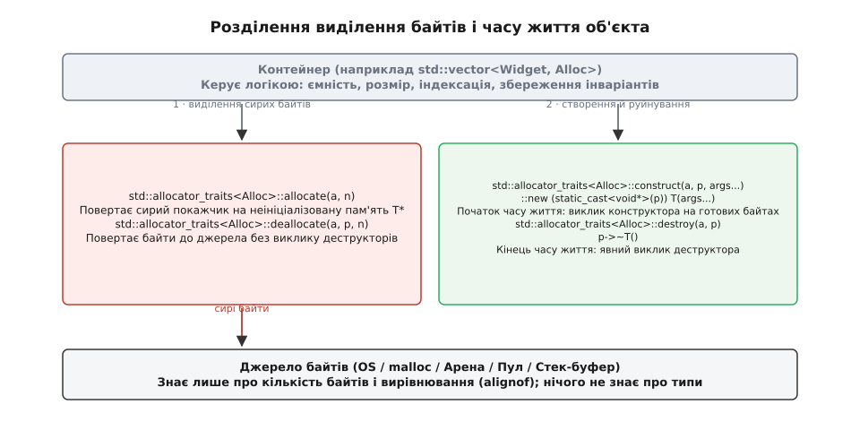
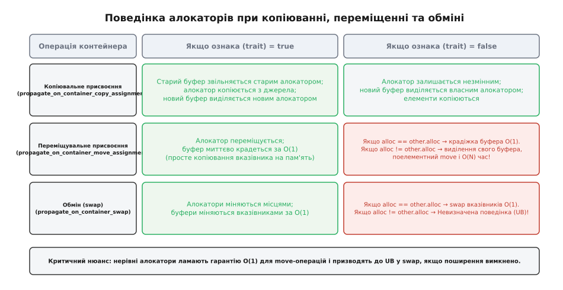
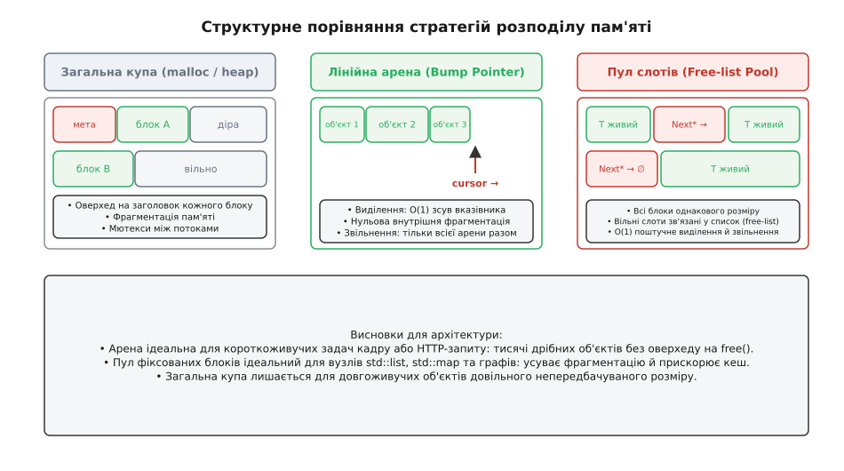
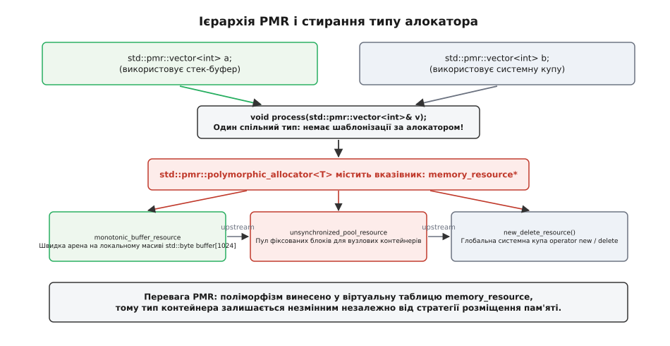

# Власні алокатори й пам'ять під контролем

<preknowlist>
- [Час життя об'єкта](topic:cpp-standards/object-lifetime) — створення байтів, виклик конструктора, завершення життя й деструкція.
- [Семантика переміщення і rvalue-посилання](topic:cpp-standards/move-semantics) — передавання володіння ресурсами та поведінка контейнерів.
- [Правило п'яти й правило нуля](topic:cpp-standards/rule-of-five-zero) — копіювання, переміщення стану та керування ресурсами.
- [new, delete й шляхи виділення пам'яті](topic:cpp-standards/new-delete-allocation) — глобальні оператори виділення, перевантаження та розміщувальний new.
</preknowlist>

Кожен виклик методу `push_back` у динамічному масиві `std::vector` за межі поточної ємності або додавання нового вузла у `std::list` змушує стандартний контейнер звертатися до системного виділювача пам'яті через дефолтний `std::allocator` та глобальний `operator new`. У високонавантажених серверах обробки сотень тисяч мережевих пакетів, торгових шлюзах із мікросекундними затримками (HFT) або ігрових рушіях із частотою 120 кадрів на секунду стандартний виділювач пам'яті стає головним джерелом непередбачуваних пауз. Системний виділювач здійснює системні виклики до ядра операційної системи, блокує потоки глобальними мютексами, додає службові заголовки розміром 8–16 байтів до кожного виділеного блока та неминуче призводить до фрагментації адресового простору процесу.

Модель алокаторів мови C++ надає інженеру механізм повного контролю над розміщенням даних, дозволяючи відокремити фізичне виділення пам'яті від життєвого циклу об'єктів та оптимізувати роботу з кешем процесора.

---

## Анатомія моделі алокаторів: розділення сховища та часу життя

У мові C++ звичайний вираз створення об'єкта в динамічній пам'яті `new Widget(arg)` нерозривно поєднує дві принципово різні операції, що належать до двох різних рівнів абстракції:
1. **Виділення нетипізованого сховища:** виклик функції `::operator new(sizeof(Widget))`, яка звертається до операційної системи або внутрішнього пулу середовища виконання і повертає покажчик `void*` на послідовність сирих неініціалізованих байтів потрібного розміру й вирівнювання.
2. **Ініціалізація та початок часу життя:** виконання коду конструктора `Widget::Widget(arg)` безпосередньо за отриманою адресою пам'яті, що перетворює сирі байти на живий об'єкт мови з визначеними інваріантами.

Аналогічно вираз `delete ptr` нерозривно пов'язує завершення часу життя об'єкта (виклик деструктора `ptr->~Widget()`) та фізичне повернення сирих байтів системі (виклик `::operator delete(ptr)`).

Для стандартних контейнерів така нерозривна зв'язка є абсолютно неприйнятною. Розглянемо поведінку динамічного масиву `std::vector<Widget>`. Під час виклику методу `reserve(1000)` контейнер повинен завчасно виділити неперервний блок пам'яті, достатній для зберігання 1000 екземплярів `Widget`. Проте в цей момент контейнер не має права викликати конструктори цих об'єктів: у масиві ще немає жодного корисного елемента, розмір контейнера `size()` дорівнює нулю, а конструктори за замовчуванням для типу `Widget` можуть бути взагалі видалені або мати суттєву ціну виконання. Конструктори окремих елементів повинні викликатися послідовно лише тоді, коли користувач фактично додає їх через методи `push_back` чи `emplace_back`.

```
Стандартний new Widget:      [ Виділення пам'яті ] ───нерозривно───► [ Конструктор Widget ]
Контейнер через алокатор:    [ allocate(1000) ]    ───пізніше────►   [ construct(&buf[i]) ]
```

Алокатор (від лат. *allocare* — виділяти, розподіляти) у C++ формалізує це розділення, розбиваючи роботу з пам'яттю на два незалежні функціональні шари:
* **Рівень сирої пам'яті:** методи `allocate(n)` та `deallocate(p, n)` оперують виключно адресами та кількістю байтів, нічого не знаючи про конструктори, деструктори та типи полів об'єктів.
* **Рівень життєвого циклу об'єкта:** методи `construct(p, args...)` та `destroy(p)` керують викликом конструкторів через розміщувальний new (placement new) та явним викликом деструкторів `p->~T()`, нічого не знаючи про те, як саме було виділено байти під об'єкт.


*Розділення виділення нетипізованих байтів і керування життєвим циклом типізованих об'єктів у std::allocator_traits.*

Початково концепція алокаторів створювалася для абстрагування сегментованої моделі покажчиків процесорів Intel 8086 у перших версіях STL, про що детально розповідає історичний нарис [Історія еволюції алокаторів](topic:cpp-standards/custom-allocators/hist-allocator-evolution.md).

---

## Системний `malloc` під мікроскопом: чому загальна купа не підходить для високої продуктивності

Щоб зрозуміти необхідність власних алокаторів, необхідно простежити шлях, який долає кожен запит на виділення пам'яті у типовому системному виділювачі (наприклад, `ptmalloc` у бібліотеці glibc GNU/Linux).

Коли виконується виклик `malloc(size)`:
1. **Обчислення розміру та заголовка:** Виділювач округлює запитаний розмір угору до кратності 8 або 16 байтів і додає службовий заголовок чанка (`chunk header`). Заголовок містить розмір попереднього чанка, розмір поточного чанка та три бітові прапорці стану: `A` (чи належить чанк до неосновної арени), `M` (чи було виділено блок через системний виклик `mmap`), `P` (чи зайнятий попередній сусідній чанк `PREV_INUSE`). Для дрібних об'єктів розміром 8–16 байтів цей заголовок подвоює фактичні витрати оперативної пам'яті.
2. **Вибір арени та блокування:** У багатопотоковій програмі `ptmalloc` підтримує пул арен (за замовчуванням до `8 * кількість ядер` арен). Потік намагається захопити мютекс своєї арени за допомогою `pthread_mutex_lock`. Якщо арена зайнята іншим потоком, потік блокується або витрачає цикли процесора на пошук іншої вільної арени.
3. **Пошук за списками вільних блоків (Bins):** Виділювач послідовно перевіряє кілька структур даних:
   * `fastbins` — масив однов'язних списків для дрібних блоків розміром до 80 байтів;
   * `unsorted bin` — двозв'язний список нещодавно звільнених блоків;
   * `small bins` — 62 двозв'язні списки фіксованого розміру з кроком 8 байтів;
   * `large bins` — двозв'язні списки блоків змінного розміру, відсортовані за спаданням величини;
   * `top chunk` — залишок нерозподіленого пулу арени.
4. **Системні виклики ядра:** Якщо `top chunk` вичерпано, виділювач виконує системний виклик `brk()` для зсуву межі сегмента даних процесу або `mmap()` для створення нового анонімного відображення сторінок пам'яті. Системний виклик вимагає перемикання контексту процесора з простору користувача в простір ядра (ring 3 -> ring 0), скидання конвеєра інструкцій та оновлення таблиць сторінок віртуальної пам'яті (TLB invalidation).

У результаті звичайне виділення пам'яті через `malloc` вимагає виконання від 50 до 200 машинних інструкцій у найкращому випадку і сотень тисяч тактів у разі конкуренції за мютекси чи звернення до ядра ОС.

### Багатопоточність, False Sharing та ізоляція потокових арен

У багатоядерних процесорах пам'ять переміщується між оперативною пам'яттю та кешем процесора квантами фіксованого розміру — рядками кешу (cache lines) величиною 64 байти.

Коли два незалежні потоки одночасно виділяють дрібні об'єкти через спільний `malloc`, системний виділювач нерідко розміщує ці об'єкти в суміжних адресах, які потрапляють в один і той самий 64-байтний рядок кешу. Коли перший потік записує дані у свій об'єкт, апаратний протокол узгодженості кешів (MESI або MOESI) змушений передати сигнал інвалідації на ядро другого процесора, навіть якщо другий потік працює з абсолютно іншою змінною.

Це явище називається хибним спільним використанням (False Sharing). Воно призводить до постійного перекидання рядків кешу між ядрами («пінг-понгу кешу») та зниження пропускної здатності шини пам'яті в десятки разів.

Власні потоково-локальні алокатори (наприклад, `thread_local std::pmr::monotonic_buffer_resource`) повністю усувають цю проблему: кожен потік виділяє дані у власному ізольованому блоці пам'яті, гарантуючи 100% потрапляння в локальний L1-кеш ядра та повну відсутність міжядерної конкуренції.

---

## Дефрагментація та обмеження компілятора: чому C++ не може переміщувати об'єкти

У керованих середовищах виконання (Java Virtual Machine, Microsoft .NET CLR) збирач сміття (Garbage Collector) регулярно виконує фазу компактифікації пам'яті (memory compaction): він переміщує живі об'єкти в один неперервний блок, усуваючи проміжки між ними, і автоматично оновлює всі посилання на ці об'єкти.

У мові C++ така автоматична дефрагментація в купі є фундаментально неможливою з кількох причин:
1. **Пряма адресна адресація:** Програма на C++ оперує безпосередніми числовими адресами `T*`, які можуть зберігатися в регістрах процесора, на стеку, у структурах C-бібліотек або бути перетвореними на цілі числа через `uintptr_t`. Середовище виконання не має засобів відстежити всі місця, де збережено адресу конкретного об'єкта.
2. **Інваріант стабільності адрес:** Стандарт C++ гарантує, що адреса об'єкта залишається абсолютно незмінною від моменту завершення конструктора до початку виконання деструктора. Самовільне переміщення байтів об'єкта середовищем виконання миттєво призвело б до появи висячих покажчиків і краху програми.

Через це єдиним інженерним засобом запобігання фрагментації пам'яті в C++ є архітектурне структурування виділень за допомогою спеціалізованих алокаторів:
* **Однорідні об'єкти однакового розміру** виділяються в пулах фіксованих слотів (`FixedPool`), де будь-який звільнений слот може бути негайно перевикористаний наступним об'єктом того самого типу з 0% фрагментації;
* **Короткоживучі об'єкти кадру чи запиту** виділяються в лінійних аренах (`Arena`), які періодично повністю звільняються, повертаючи весь простір пам'яті операційній системі без утворення дірок.

---

## Векторизація SIMD та втрати від перетину меж рядків кешу (Cache Line Split)

Сучасні високопродуктивні алгоритми обробки масивів широко використовують векторні інструкції SIMD (Single Instruction, Multiple Data): AVX2 (256 бітів = 32 байти) та AVX-512 (512 бітів = 64 байти).

Коли блок пам'яті виділяється без точного вирівнювання за межею 64 байтів, векторний регістр процесора неминуче перетинає межу між двома сусідніми рядками апаратного кешу L1 (явище Cache Line Split). У цей момент апаратний контролер пам'яті змушений зупинити конвеєр виконання, звернутися до двох незалежних кеш-ліній, об'єднати байти у внутрішньому буфері процесора і лише після цього передати дані у векторний регістр. Затримка такого читання зростає у 2–4 рази порівняно з ідеально вирівняним доступом.

Користувацькі алокатори дозволяють передавати явний параметр вирівнювання `std::align_val_t{64}`, гарантуючи, що кожен виділений блок пам'яті починається строго на початку рядка кешу L1.

---

## Шар абстракції `std::allocator_traits`

У стандарті C++98 контейнери зверталися до методів алокатора напряму. Через це розробник власного алокатора був змушений писати значний обсяг шаблонного службового коду: оголошувати типи `pointer`, `const_pointer`, `reference`, `const_reference`, `size_type`, `difference_type`, визначати вкладену структуру `rebind` та самостійно реалізовувати методи `construct` і `destroy`.

Починаючи з C++11, взаємодія контейнерів із виділювачами пам'яті була повністю реорганізована через введення уніфікованого адаптера метапрограмування `std::allocator_traits<Alloc>`, визначеного у заголовному файлі `<memory>`. Стандарт суворо забороняє контейнерам викликати методи алокатора напряму. Будь-який запит на виділення пам'яті або створення об'єкта проходить виключно через статичні методи `allocator_traits`.

```
[ Клієнтський контейнер: std::vector<T, Alloc> ]
                      │
                      ▼
[ Метапрограмний шар: std::allocator_traits<Alloc> ]
  (автоматичне виведення типів, rebind, SFINAE-підстановка дефолтів)
                      │
                      ▼
[ Користувацький алокатор: Alloc ]
  (мінімальний контракт: лише value_type, allocate та deallocate)
```

Завдяки посередництву `std::allocator_traits` мінімальний коректний алокатор у сучасному C++ скоротився до простої структури:

```cpp
template <typename T>
struct SimpleHeapAllocator {
    using value_type = T;

    SimpleHeapAllocator() noexcept = default;
    template <typename U>
    SimpleHeapAllocator(const SimpleHeapAllocator<U>&) noexcept {}

    [[nodiscard]] T* allocate(std::size_t n) {
        if (n > std::numeric_limits<std::size_t>::max() / sizeof(T)) {
            throw std::bad_alloc();
        }
        void* ptr = ::operator new(n * sizeof(T));
        return static_cast<T*>(ptr);
    }

    void deallocate(T* p, std::size_t /*n*/) noexcept {
        ::operator delete(p);
    }
};
```

Всі інші типи та операції `std::allocator_traits` автоматично генерує за допомогою підстановки значень за замовчуванням:
* якщо в класі `Alloc` не оголошено тип `pointer`, traits приймає значення `value_type*`;
* якщо не оголошено `size_type`, traits використовує `std::size_t`;
* якщо немає методу `construct(p, args...)`, traits виконує прямий виклик розміщувального new: `::new (static_cast<void*>(p)) T(std::forward<Args>(args)...)`;
* якщо немає методу `destroy(p)`, traits викликає явний деструктор `p->~T()`;
* якщо немає методу `max_size()`, traits обчислює теоретичну межу як `std::numeric_limits<size_type>::max() / sizeof(value_type)`.

### Механізм переприв'язки типів (`rebind`)

Коли користувач створює вузловий контейнер, наприклад `std::list<int, CustomAlloc<int>>`, здається, що контейнеру потрібен алокатор для цілих чисел `int`. Проте двозв'язний список фізично не виділяє пам'ять під окремі елементи `int`. Кожен елемент списку розміщується всередині внутрішнього службового вузла, який містить два адресні покажчики на попередній і наступний вузли та поле корисного навантаження:

```cpp
template <typename T>
struct __list_node {
    __list_node* prev;
    __list_node* next;
    T value;
};
```

Щоб виділити пам'ять під службовий вузол `__list_node<int>`, список повинен перетворити алокатор `CustomAlloc<int>` на алокатор `CustomAlloc<__list_node<int>>`. Ця трансформація цільового типу називається переприв'язкою (англ. *rebind*).

Шаблон `std::allocator_traits` надає зручний псевдонім типу `rebind_alloc<U>`, який автоматично знаходить або шаблонну спеціалізацію `Alloc<U>`, або вкладену структуру `Alloc::rebind<U>::other`:

```cpp
template <typename T, typename Alloc>
class MyList {
    using Node = __list_node<T>;
    using NodeAlloc = typename std::allocator_traits<Alloc>::template rebind_alloc<Node>;
    using NodeTraits = std::allocator_traits<NodeAlloc>;

    NodeAlloc node_allocator_;

    Node* create_node(const T& value) {
        Node* p = NodeTraits::allocate(node_allocator_, 1);
        try {
            std::allocator_traits<Alloc>::construct(node_allocator_, std::addressof(p->value), value);
        } catch (...) {
            NodeTraits::deallocate(node_allocator_, p, 1);
            throw;
        }
        return p;
    }
};
```

Повний довідковий перелік усіх типів, констант та методів наведено у документі [Довідка std::allocator_traits та memory_resource](topic:cpp-standards/custom-allocators/api-allocator-traits.md).

---

## Алокатори зі станом та правила поширення (Propagation Traits)

Алокатори в C++ поділяються на дві фундаментальні категорії:
1. **Безстатусні алокатори (Stateless Allocators):** не містять жодних нестатичних полів даних. Усі екземпляри безстатусного алокатора є абсолютно еквівалентними та взаємозамінними: блок пам'яті, виділений одним екземпляром, може бути без жодних наслідків звільнений іншим екземпляром того самого типу. Прикладом є стандартний `std::allocator<T>`.
2. **Алокатори зі станом (Stateful Allocators):** містять власні поля даних — покажчик на локальний буфер, посилання на екземпляр арени пам'яті, дескриптор відкритого сегмента пам'яті (shared memory) чи ідентифікатор пулу потоків. Два екземпляри такого алокатора можуть вказувати на різні області пам'яті і тому бути нерівними (`a1 != a2`).

Якщо два екземпляри алокатора не є рівними, передача пам'яті між ними призводить до катастрофічних наслідків: спроба звільнити пам'ять через чужий алокатор викличе аварійне завершення програми або пошкодження структури кучі.

```cpp
template <typename T>
class StatefulArenaAllocator {
public:
    using value_type = T;

    explicit StatefulArenaAllocator(Arena& arena) noexcept : arena_(&arena) {}

    template <typename U>
    StatefulArenaAllocator(const StatefulArenaAllocator<U>& other) noexcept : arena_(other.arena_) {}

    T* allocate(std::size_t n) {
        return static_cast<T*>(arena_->allocate(n * sizeof(T), alignof(T)));
    }

    void deallocate(T* p, std::size_t n) noexcept {
        arena_->deallocate(p, n * sizeof(T));
    }

    bool operator==(const StatefulArenaAllocator& other) const noexcept {
        return arena_ == other.arena_;
    }
    bool operator!=(const StatefulArenaAllocator& other) const noexcept {
        return arena_ != other.arena_;
    }

private:
    Arena* arena_;
    template <typename U> friend class StatefulArenaAllocator;
};
```

Щоб стандартні контейнери знали, як поводитися з внутрішнім алокатором під час виконання операцій копіювання, переміщення та обміну, `std::allocator_traits` визначає чотири спеціальні ознаки поширення (propagation traits):


*Матриця наслідків поширення стану алокатора під час копіювання, переміщення та обміну контейнерів.*

### 1. Копіювальне присвоєння (`propagate_on_container_copy_assignment`)

Розглянемо вираз копіювання `c1 = c2;`, де контейнери мають нерівні алокатори зі станом (`c1.get_allocator() != c2.get_allocator()`):
* **Якщо ознака встановлена у `std::true_type`:** контейнер `c1` спочатку деалокує власний масив за допомогою свого старого алокатора, потім копіює сам об'єкт алокатора з `c2`, і після цього виділяє новий буфер новим скопійованим алокатором, куди копіює значення елементів із `c2`.
* **Якщо ознака встановлена у `std::false_type` (дефолтна поведінка):** алокатор усередині `c1` залишається незмінним. `c1` звільняє старий буфер власним алокатором, виділяє новий буфер також власним алокатором і копіює туди значення елементів із `c2`.

### 2. Переміщувальне присвоєння (`propagate_on_container_move_assignment`)

Розглянемо операцію переміщення `c1 = std::move(c2);`:
* **Якщо ознака встановлена у `std::true_type`:** алокатор переміщується з `c2` у `c1`. `c1` звільняє свій старий буфер власним алокатором, після чого миттєво «краде» покажчик на буфер `c2` простим копіюванням адреси. Часова складність операції становить гарантовані `O(1)`.
* **Якщо ознака встановлена у `std::false_type`:** контейнер перевіряє рівність алокаторів під час виконання (`c1.get_allocator() == c2.get_allocator()`):
  * якщо алокатори **рівні** — `c1` безпечно забирає внутрішній буфер `c2` за константний час `O(1)`;
  * якщо алокатори **не рівні** — контейнер `c1` не має права забрати пам'ять `c2`, оскільки деструктор `c1` не зможе коректно повернути цю пам'ять чужому алокатору. У цьому разі контейнер `c1` виділяє власний новий буфер за допомогою свого алокатора, поелементно переміщує туди значення з `c2` через `std::move` і руйнує вихідні елементи в `c2`. У результаті операція переміщення деградує з `O(1)` до лінійного часу `O(N)`!

### 3. Операція обміну (`propagate_on_container_swap`)

Розглянемо виклик `std::swap(c1, c2);`:
* **Якщо ознака встановлена у `std::true_type`:** контейнери міняються своїми внутрішніми алокаторами та вказівниками на масиви за час `O(1)`.
* **Якщо ознака встановлена у `std::false_type`:** якщо алокатори рівні, обмін покажчиками виконується за `O(1)`. Якщо ж алокатори не рівні, виконання `std::swap(c1, c2)` призводить до **невизначеної поведінки (Undefined Behavior)**.

### 4. Конструктор копіювання (`select_on_container_copy_construction`)

Коли створюється копія контейнера `std::vector<T, Alloc> c2(c1);`, новий контейнер `c2` повинен отримати екземпляр алокатора. Статичний метод `std::allocator_traits<Alloc>::select_on_container_copy_construction(c1.get_allocator())` дозволяє алокатору вирішити: повернути точну копію поточного стану чи повернути новий чистий алокатор за замовчуванням.

---

## Вкладені контейнери та адаптери областей видимості (Scoped Allocators)

Однією з найпідступніших проблем статичної моделі алокаторів C++11 є поведінка вкладених структур даних, наприклад вектора динамічних рядків:

```cpp
using MyString = std::basic_string<char, std::char_traits<char>, ArenaAllocator<char>>;
using MyVector = std::vector<MyString, ArenaAllocator<MyString>>;
```

Якщо створити такий вектор `MyVector vec(arena_alloc)`, то масив покажчиків і ємність самого вектора будуть виділені в арені `arena_alloc`. Проте коли всередину вектора додається новий рядок через `vec.emplace_back("Long string exceeding SSO buffer")`, за замовчуванням конструктор `MyString` створюється з новим екземпляром алокатора за замовчуванням, що призводить до виділення динамічного буфера символів у системній купі!

Щоб розв'язати цю проблему і гарантувати, що зовнішній алокатор автоматично прокидається до всіх внутрішніх елементів, стандарт C++11 надав адаптер `std::scoped_allocator_adaptor`:

```cpp
#include <scoped_allocator>

template <typename T>
using ScopedArenaAlloc = std::scoped_allocator_adaptor<ArenaAllocator<T>>;

using ScopedString = std::basic_string<char, std::char_traits<char>, ArenaAllocator<char>>;
using ScopedVector = std::vector<ScopedString, ScopedArenaAlloc<ScopedString>>;

void test_scoped() {
    Arena arena(64 * 1024);
    ArenaAllocator<std::byte> byte_alloc(arena);
    ScopedArenaAlloc<ScopedString> alloc(byte_alloc);

    ScopedVector vec(alloc);
    // Тепер і буфер вектора, і буфери всіх рядків виділяються виключно в arena!
    vec.emplace_back("A very long text string that definitely exceeds Small String Optimization limit");
}
```

---

## Гарантії безпеки винятків при виділенні та конструюванні

Робота з пам'яттю завжди пов'язана з ризиком виникнення виняткових ситуацій:
1. Виняток `std::bad_alloc` під час виконання методу `allocate(n)` (пам'ять вичерпано).
2. Довільний виняток у конструкторі об'єкта під час виконання `construct(p, args...)`.

Стандартна модель алокаторів гарантує суворе дотримання базової та сильної гарантій безпеки винятків (Exception Safety Guarantees):

* **Якщо виняток кидає `allocate`:** Контейнер не змінює свій внутрішній стан. Оскільки жодного конструктора ще не було викликано, деструктори елементів не викликаються, а сам контейнер залишається у вихідному коректному стані (Strong Exception Guarantee).
* **Якщо виняток кидає конструктор елемента на індексі `k` під час заповнення діапазону:** Контейнер зобов'язаний негайно викликати деструктори для всіх раніше успішно сконструйованих об'єктів від індексу `k - 1` до `0` у зворотному порядку, після чого звільнити весь виділений блок сирої пам'яті через `deallocate(p, n)` і прокинути виняток далі. У такий спосіб унеможливлюється поява витоків пам'яті або напівживих об'єктів-зомбі.

---

## Спеціалізовані стратегії виділення пам'яті

Загальний системний виділювач пам'яті (`malloc`/`free`) змушений підтримувати універсальний інтерфейс. Спеціалізовані виділювачі пам'яті свідомо обмежують сценарії використання заради досягнення екстремальної продуктивності та усунення фрагментації.


*Порівняння структурної організації пам'яті: загальна купа з метаданими та фрагментацією, лінійна арена та інваріантний пул фіксованих блоків.*

### 1. Лінійний алокатор / Арена (Arena / Bump Allocator)

Лінійний алокатор (також відомий як bump pointer алокатор) резервує один суцільний неперервний блок пам'яті та підтримує єдиний лічильник зміщення (`offset`).

**Механіка роботи:**
* **Виділення (`allocate`):** обчислюється вирівняне зміщення, лічильник збільшується на потрібний розмір `offset += size`, і повертається вказівник на початок вільного сегмента. Швидкість виконання становить лічені такти процесора (`O(1)`).
* **Поштучне звільнення (`deallocate`):** не підтримується і є порожньою операцією (`no-op`).
* **Групове скидання (`reset`):** вся арена миттєво звільняється за один крок шляхом встановлення `offset = 0`.

**Сфери застосування:** генерація кадрів у графічних рушіях (ігрові сутності кадру), обробка поодиноких HTTP-запитів або парсинг пакетів протоколів, де всі тимчасові об'єкти мають спільний час життя і знищуються одночасно наприкінці обробки.

### 2. Пул фіксованих блоків (Pool / Free-list Allocator)

Пул фіксованих блоків призначений для частого створення та знищення об'єктів однакового розміру. Пам'ять пулу розбивається на сукупність однакових комірок (слотів).

**Механіка інтрузивного списку (Intrusive Free-list):**
У звичайному системному виділювачі пам'яті кожен блок містить службовий заголовок розміром 8–16 байтів перед корисними даними. Пул фіксованих блоків усуває цей оверхед за допомогою техніки інтрузивного зв'язування:
* коли комірка пам'яті є вільною, самі байти цієї комірки інтерпретуються як вказівник `FreeNode*`, який зберігає адресу наступної вільної комірки в списку;
* коли комірка виділяється, голова списку зміщується на наступний елемент, а в байти комірки записується створений об'єкт користувача;
* коли комірка звільняється, вона повертається в голову списку вільних слотів за `O(1)`.

**Сфери застосування:** вузлові контейнери (`std::list`, `std::map`, `std::set`), графи та дерева, де відсутність фрагментації та швидкість виділення вузлів мають вирішальне значення.

### 3. Стековий алокатор (Stack Allocator / Frame Allocator)

Стековий алокатор працює за принципом LIFO (Last In, First Out). Він дозволяє зберігати поточну мітку позиції (marker):
```cpp
using Marker = std::size_t;
Marker m = stack_alloc.get_marker();
// Виділяємо тимчасові об'єкти...
stack_alloc.free_to_marker(m); // Миттєво відкочуємо стек до збереженого стану
```

Повні працюючі реалізації арени та пулу з детальними тестами продуктивності наведено у практичній вставці [Практична реалізація Bump та Pool алокаторів](topic:cpp-standards/custom-allocators/proj-bump-pool-allocators.md).

---

## Поліморфні ресурси пам'яті C++17: `std::pmr`

Незважаючи на гнучкість `std::allocator_traits`, модель C++11 мала критичну ваду, зумовлену статичною системою типів: тип алокатора є параметром шаблону самого контейнера. Через це типи `std::vector<int, std::allocator<int>>` та `std::vector<int, ArenaAllocator<int>>` є абсолютно різними типами даних, що унеможливлювало створення спільних функцій без генерації надлишкових інстанціацій шаблонів (template code bloat).

У стандарті C++17 цю проблему було вирішено за допомогою бібліотеки поліморфних ресурсів пам'яті `std::pmr` (англ. *Polymorphic Memory Resources*).


*Стирання типу в std::pmr: контейнери спільного типу використовують різні поліморфні ресурси пам'яті через віртуальний диспетчер memory_resource.*

### Принцип стирання типів (Type Erasure)

Архітектура `std::pmr` базується на трьох компонентах:
1. **`std::pmr::memory_resource`:** абстрактний базовий клас, який оголошує чисті віртуальні методи виділення (`do_allocate`), звільнення (`do_deallocate`) та порівняння (`do_is_equal`).
2. **`std::pmr::polymorphic_allocator<T>`:** стандартний шаблонний алокатор, який зберігає всередині лише один покажчик `memory_resource*` на екземпляр поліморфного ресурсу.
3. **Псевдоніми типів PMR:** стандартні аліаси, такі як `std::pmr::vector<T>`, що еквівалентні `std::vector<T, std::pmr::polymorphic_allocator<T>>`.

Завдяки цьому всі контейнери `std::pmr::vector<int>` мають однаковий статичний тип, незалежно від того, яка стратегія пам'яті використовується під капотом!

```cpp
#include <vector>
#include <memory_resource>
#include <array>
#include <iostream>

void populate_data(std::pmr::vector<int>& vec) {
    for (int i = 0; i < 100; ++i) {
        vec.push_back(i * 2);
    }
}

void run_example() {
    // 1. Вектор на швидкому локальному буфері в стеку
    std::array<std::byte, 1024> stack_buffer;
    std::pmr::monotonic_buffer_resource stack_arena(stack_buffer.data(), stack_buffer.size());
    std::pmr::vector<int> stack_vec(&stack_arena);

    // 2. Вектор на системній купі
    std::pmr::vector<int> heap_vec(std::pmr::new_delete_resource());

    populate_data(stack_vec); // Працює без системних викликів malloc
    populate_data(heap_vec);  // Працює з купою — обидва вектори повністю сумісні!
}
```

### Стандартні ресурси пам'яті та ланцюжки (Chaining)

Бібліотека PMR надає багатий набір готових ресурсів пам'яті:
* **`std::pmr::new_delete_resource()`:** повертає синглтон, що використовує глобальні `::operator new` та `::operator delete`.
* **`std::pmr::null_memory_resource()`:** ресурс, будь-який виклик `allocate` якого негайно кидає виняток `std::bad_alloc`. Використовується для гарантії того, що критична секція коду не вийде за межі виділеного локального буфера.
* **`std::pmr::monotonic_buffer_resource`:** швидка неблокуюча арена над локальним масивом байтів.
* **`std::pmr::unsynchronized_pool_resource` та `synchronized_pool_resource`:** пули фіксованих розмірів (однопотоковий та потокобезпечний відповідно).

Ресурси PMR підтримують об'єднання у ланцюжки через концепцію батьківського ресурсу (upstream resource). Якщо локальний буфер вичерпується, він прозоро запитує новий великий сегмент пам'яті у свого upstream-ресурсу:

```cpp
std::array<std::byte, 512> local_buf;
std::pmr::unsynchronized_pool_resource pool(std::pmr::new_delete_resource());
std::pmr::monotonic_buffer_resource arena(local_buf.data(), local_buf.size(), &pool);

std::pmr::vector<int> numbers(&arena);
```

### Взаємодія з розумними покажчиками

Модель алокаторів тісно інтегрована з розумними покажчиками. Для `std::shared_ptr` функція `std::allocate_shared<T, Alloc>` виділяє один суцільний блок пам'яті, що вміщує блок керування (лічильники посилань), екземпляр алокатора та сам об'єкт `T`:

```cpp
Arena arena(4096);
ArenaAllocator<Widget> alloc(arena);

// Створює shared_ptr в один виклик allocate() всередині арени
auto sp = std::allocate_shared<Widget>(alloc, "sensor_data", 100);
```

---

## Інженерні підводні камені та практичні правила

> 🔧 **Навіщо це.**
> Правильно обраний алокатор здатен скоротити час виділення пам'яті з 50–200 наносекунд для системного `malloc` до 1–3 наносекунд для арени, одночасно гарантуючи повну відсутність фрагментації пам'яті та усуваючи промахи в L1/L2 кеші процесора.

### 1. Пастка нетривіальних деструкторів в аренах

Очищення лінійної арени викликом методу `reset()` або викликом `std::pmr::monotonic_buffer_resource::release()` просто переставляє зміщення пам'яті на початок. **При цьому деструктори об'єктів, які були створені в цій пам'яті, не викликаються.**

Якщо у виділеній пам'яті розміщувалися об'єкти, що володіють зовнішніми ресурсами (файлові дескриптори, мережеві сокети, мютекси, розумні покажчики `std::unique_ptr`), їхні деструктори не виконаються, і системні ресурси «потечуть».

**Правило безпеки:**
Арени слід застосовувати або для тривіально деструктованих типів (`std::is_trivially_destructible_v<T> == true`), або забезпечувати явний виклик деструкторів (наприклад, викликаючи `vec.clear()` перед очищенням арени).

### 2. Вимоги апаратного вирівнювання (Alignment Faults)

Під час реалізації власної адресної арифметики у методах `allocate` категорично неприпустимо просто додавати `sizeof(T)` до поточної адреси без урахування `alignof(T)`. 

На сучасних процесорах (особливо ARM64 або при роботі з векторними інструкціями SSE/AVX-512) спроба завантажити дані з непарної адреси, не кратної 16 чи 64 байтам, призводить до апаратного винятку `SIGBUS` або деградації швидкості доступу до пам'яті на порядок.

### 3. Час життя ресурсу проти часу життя контейнера

Оскільки алокатори зі станом зберігають вказівник на екземпляр ресурсу пам'яті, знищення об'єкта ресурсу до знищення контейнера є класичною помилкою висячого посилання (dangling reference):

```cpp
std::pmr::vector<int> global_data;
{
    std::array<std::byte, 128> local_buf;
    std::pmr::monotonic_buffer_resource local_res(local_buf.data(), local_buf.size());
    global_data = std::pmr::vector<int>(&local_res);
    global_data.push_back(1);
} // local_res та local_buf знищено на виході з блоку!

global_data.push_back(2); // КАТАСТРОФА: звернення до пам'яті знищеного стекового кадру!
```

---

## Підсумковий синтез

Сучасна модель керування пам'яттю мови C++ пропонує три взаємодоповнюючі рівні:
1. **Загальна купа (`std::allocator`):** універсальне рішення за замовчуванням для довгоживучих об'єктів непередбачуваного розміру.
2. **Статичні алокатори (`std::allocator_traits`):** бескомпромісна швидкодія без накладних витрат на віртуальні виклики та додаткові покажчики для внутрішніх обчислювальних ядер і структур даних.
3. **Поліморфні ресурси пам'яті (`std::pmr`):** гнучка компонентна архітектура, що усуває роздування шаблонів, забезпечує стабільні інтерфейси функцій і дозволяє вільно комбінувати стекові арени, пули блоків та системну купу в межах єдиної програми.
