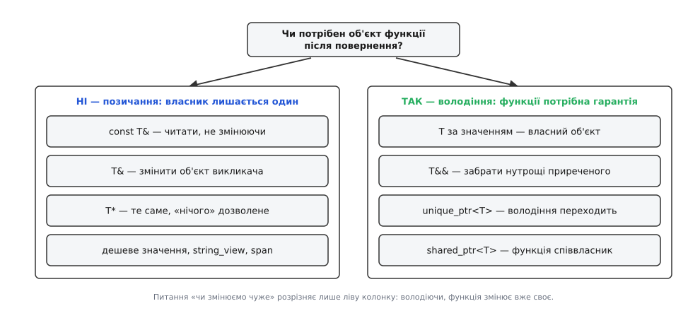
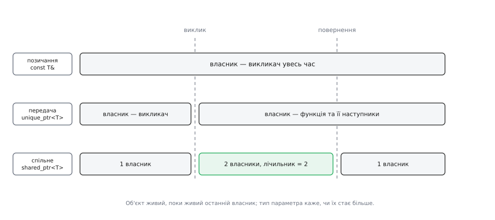
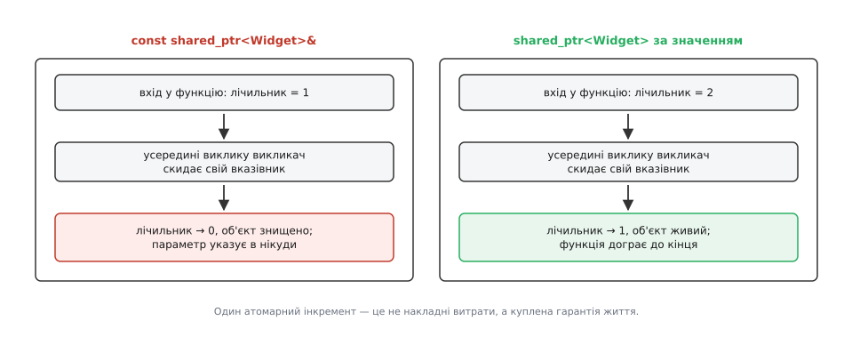

# Володіння в сигнатурі: що означає тип параметра

<preknowlist>
- [Час життя об'єкта](book:cpp-standards/object-lifetime) — коли об'єкт починає й перестає існувати і хто саме запускає деструктор.
- [RAII: ресурс прив'язаний до часу життя](book:programming/raii) — конструктор захоплює ресурс, деструктор звільняє його рівно один раз.
- [Адреси й покажчики](book:programming/addresses-pointers) — вказівник зберігає адресу і сам по собі нічого не знає про долю того, на що показує.
- [Посилання і правила зв'язування](book:cpp-standards/references-binding) — що з чим зв'язується: `T&`, `const T&`, `T&&`.
- [Семантика переміщення](book:cpp-standards/move-semantics) — як нутрощі приреченого об'єкта перекладаються в новий без копіювання.
- [unique_ptr: одноосібне володіння](book:cpp-standards/unique-ptr) — тип, який не копіюється й видаляє те, чим володіє.
- [shared_ptr і weak_ptr](book:cpp-standards/shared-weak-ptr) — лічильник посилань і спільне володіння одним об'єктом.
</preknowlist>

## Рядок, з якого не випливає головне

У заголовку чужої бібліотеки стоїть оголошення:

```cpp
void register_widget(Widget* w);
```

Його треба викликати — і одразу виявляється, що найпростішого з цього рядка не видно: що робити з `w` після повернення. Реалізацій, які оголошуються точно так само, є щонайменше три:

```cpp
// 1. Функція читає віджет і забуває про нього.
void register_widget(Widget* w) { log_line(w->name()); }

// 2. Функція запам'ятовує адресу й звертатиметься до неї потім.
void register_widget(Widget* w) { observers.push_back(w); }

// 3. Функція забирає віджет собі й сама його видалить.
//    owned — це std::vector<std::unique_ptr<Widget>>, тож видалення станеться в її деструкторі.
void register_widget(Widget* w) { owned.emplace_back(w); }
```

Обов'язки викликача в цих трьох світах несумісні. У першому він може знищити віджет одразу після виклику. У другому — мусить тримати його живим, поки реєстр не спорожніє. У третьому — не сміє чіпати його взагалі. Помилка в будь-який бік коштує однаково дорого: зайве видалення дає подвійне звільнення, забуте — витік, передчасне — звернення до вже мертвої пам'яті.

Жодного з цих трьох варіантів компілятор не розрізняє. Виклик `register_widget(w.get())` збирається однаково в усіх трьох випадках, а відмінність між ними живе в документації, у коментарі над оголошенням або взагалі лише в пам'яті автора бібліотеки.

## Обов'язок, якого немає де записати

У мові зі складальником сміття цього питання не існує: ніхто нічого не видаляє, об'єкт живе, доки до нього можна дотягнутися. У C++ автоматичний механізм рівно один — об'єкт з автоматичною тривалістю зберігання знищується наприкінці своєї області видимості, і тоді ж виконується його деструктор. Усе інше — те, що взяте з купи, відкриті файли, захоплені замки — зникає лише тому, що хтось написав код, який його прибирає.

Тому «хто видаляє» і «доки об'єкт живий» — це факти про програму, яких у самій програмі немає. Вони є в задумі, а в тексті їх треба десь закріпити. І бажано так, щоб їх читала не лише людина: домовленість, яку ніхто не перевіряє, ламається при першому ж рефакторингу.

У оголошенні функції місце для цього одне. Ім'я функції компілятор не тлумачить, коментар не читає, документацію не бачить. **Тип** параметра він читає, перевіряє на кожному місці виклику, за ним обирає перевантаження й за ним же відмовляється робити перетворення, яких не знає. Звідси єдиний хід, на якому тримається вся сучасна домовленість: обов'язок щодо часу життя вкладають у тип параметра. Сигнатура перестає бути описом «що подати» і стає контрактом «хто за що відповідає».

Цієї домовленості немає в тексті стандарту — стандарт описує, що кожна форма робить механічно, а не що вона означає. Значення закріпили пізніше й за межами стандарту: у [Core Guidelines](book:cpp-standards/core-guidelines) правила `F.15`–`F.21` описують передавання звичайних параметрів, а `R.30`–`R.37` — розумних вказівників. Як ці правила виборювалися — від провалу `auto_ptr` до суперечок про `const shared_ptr&` — розказано окремо: [Як склалася домовленість про володіння](book:cpp-standards/ownership-semantics/hist-ownership-conventions.md); там видно, що майже кожне нинішнє правило — наслідок конкретної пастки, у яку масово падали.

## Два питання, з яких постає весь словник

Замість того щоб запам'ятовувати перелік форм, його варто вивести. Обов'язок, який ми кодуємо, розпадається на два незалежні питання, і обидва ставляться на межі виклику:

1. **Чи потрібен функції об'єкт після того, як вона повернула керування?**
2. **Чи має функція змінити те, що належить викликачеві?**

Перше питання — про час життя, і саме воно вирішує все. Якщо відповідь «ні», функції достатньо, щоб об'єкт дожив до кінця виклику; володіти нею їй нема потреби, і викликач лишається єдиним господарем. Якщо «так» — самої лише обіцянки викликача замало: він може вийти зі своєї області видимості раніше, ніж об'єкт знадобиться. Тоді функції потрібна власна гарантія, а гарантія буває тільки трьох видів: власна копія, частка у спільному володінні або все володіння цілком.

Друге питання лише уточнює ліву половину. Коли функція володіє об'єктом, вона змінює вже своє, і питання про дозвіл не виникає.



*Ліва колонка — форми, у яких власником лишається викликач; права — ті, у яких функція здобуває власну гарантію життя об'єкта.*

## Позичання: об'єкт потрібен лише під час виклику

Це найчастіший випадок, і форми для нього найдешевші.

```cpp
void draw(const Canvas& c);      // читаємо чуже
void normalize(Vector& v);       // змінюємо чуже
void draw(const Canvas* c);      // те саме, але «нічого» — теж відповідь
```

`const T&` каже: мені потрібне значення, я його не змінюватиму і не триматиму. `T&` — те саме, але з правом змінити; це і є вхідно-вихідний параметр. Різниця між `T&` і `T*` не стосується володіння взагалі: обидва не володіють, а вибір між ними відповідає на третє, дрібніше питання — чи є відсутність об'єкта припустимим аргументом. Посилання зв'язати ні з чим не можна, тож `T&` означає «об'єкт точно є», а `T*` — «може бути, а може й ні». Саме тому `T*` у сучасному коді читається як необов'язкове позичання, а не як натяк на видалення (`F.7`).

Окремо стоять дешеві типи. `int`, `char`, дескриптор, ітератор копіюються не дорожче, ніж коштує зайва непряма адресація, тож їх передають за значенням — і це теж позичання, просто копія тут дешевша за посилання на неї. Груба межа з `F.16`: якщо об'єкт не більший за два-три машинні слова й копіюється тривіально — за значенням.

До тієї самої родини належать [`string_view`](book:cpp-standards/string-and-string-view) і [`span`](book:cpp-standards/span-contiguous). Вони передаються за значенням, бо всередині це пара «вказівник + довжина», але жодним байтом даних не володіють: це позичання, оформлене як маленький об'єкт-вид.

У позичанні є дві половини обіцянки, і обидві обов'язкові. Викликач гарантує, що об'єкт живий щонайменше до повернення з функції. Функція гарантує, що не збереже адресу нікуди назовні — ні в член класу, ні в глобальний реєстр, ні в лямбду, яку віддасть далі. Порушення другої половини — це тихе перетворення позичання на володіння без дозволу, і воно завжди закінчується однаково: [висячим посиланням](book:cpp-standards/dangling-references) через кілька шарів виклику, де знайти причину вже важко.

> 🔧 **Навіщо це.** Друга реалізація `register_widget` із початку статті — саме таке порушення. Якби її параметр був оголошений як `const Widget&`, читач сигнатури мав би право покласти віджет у тимчасовий об'єкт і забути про нього — і мав би рацію. Функція, що зберігає адресу, зобов'язана оголосити це типом: або `shared_ptr<Widget>`, якщо їй потрібне співволодіння, або `Widget*` з написаним у документації строком, або `unique_ptr<Widget>`, якщо вона забирає віджет назовсім.

## Володіння: об'єкт мусить пережити виклик

Коли функція потребує об'єкта після повернення, вона мусить отримати щось, що не залежить від подальших рішень викликача. Форм три, і вони різняться тим, скільки власників лишається.

**`T` за значенням** — функція дістає власний об'єкт. Це найпростіша й найчесніша форма приймача для типів-значень: `std::string`, `std::vector`, будь-який клас, що сам володіє своїми нутрощами. Викликач нічого не втрачає, функція нічим не зв'язана.

**`unique_ptr<T>` за значенням** — одноосібне володіння переходить цілком. Тут відбувається те, чого немає в жодній іншій формі: контракт перевіряє компілятор.

```cpp
void take(std::unique_ptr<Widget> w);        // сигнатура каже: я стаю власником

auto p = std::make_unique<Widget>();
take(p);                                     // ✗ не збирається — копії в unique_ptr немає
take(std::move(p));                          // ✓ передача написана в тексті виклику
```

`unique_ptr` не має конструктора копіювання, тож єдиний спосіб подати його за значенням — віддати. Наслідок важливіший, ніж здається: передавання володіння стає **видимим на місці виклику**. Читач чужого коду бачить `std::move` і без документації знає, що після цього рядка `p` порожній. Жоден коментар такої надійності не дає (`R.32`).

**`shared_ptr<T>` за значенням** — функція стає співвласником. Копія збільшує лічильник, і об'єкт гарантовано живий, доки живе ця копія, хоч би що зробив викликач (`R.34`). Ціна — один атомарний інкремент на вході й декремент на виході; ціна лічильника як механізму розібрана в [підрахунку посилань](book:programming/reference-counting).

**`T&&`** — окремий випадок приймача для типів-значень: функція забирає нутрощі об'єкта, який і так приречений. Формально `&&` лише *дозволяє* розібрати аргумент, але домовленість `F.18` жорсткіша: якщо параметр оголошено як `T&&`, функція зобов'язана його спожити, а викликач після виклику мусить вважати свій об'єкт спустошеним. Ця форма, як і `unique_ptr`, не зв'язується з іменованою змінною, тож `std::move` на місці виклику знову-таки видно очима.



*Тип параметра визначає, де на осі часу проходить межа відповідальності: у позичанні вона не проходить ніде, у передачі збігається з викликом, у спільному володінні розмита на час перекриття.*

## Скільки коштує форма приймача

Між `T` за значенням і парою перевантажень `const T&` / `T&&` доводиться вибирати щоразу, коли пишеш присвоювач чи конструктор. Вибір не смаковий — його видно на кількості виділень пам'яті.

**Клас зберігає рядок; аргумент приходить то іменованою змінною, то тимчасовим значенням.**

```cpp
// A. Пара перевантажень
struct Label {
    void set(const std::string& s) { text_ = s; }             // копіювальне присвоєння
    void set(std::string&& s)      { text_ = std::move(s); }  // переміщувальне
    std::string text_;
};

// B. Приймач за значенням + переміщення
struct Label2 {
    void set(std::string s) { text_ = std::move(s); }
    std::string text_;
};
```

```
аргумент — іменована змінна, у text_ уже є достатня ємність:
  A:  копіювальне присвоєння в text_        → 0 виділень (ємність перевикористано)
  B:  копія аргументу в параметр s           → 1 виділення
      переміщувальне присвоєння з s          → 0 виділень (стару ємність віддано)
      разом                                  → 1 виділення

аргумент — тимчасове значення:
  A:  переміщувальне присвоєння              → 0 виділень
  B:  s будується просто з аргументу         → 0 виділень (копію усунено)
      переміщувальне присвоєння з s          → 0 виділень
      разом                                  → 0 виділень
```

Для тимчасового значення форми рівноцінні — за це відповідає [гарантоване усунення копій](book:cpp-standards/copy-elision). Різниця виникає лише там, де ліворуч уже лежить рядок із придатною ємністю: пара перевантажень цю ємність перевикористовує, а приймач за значенням спершу виділяє нову пам'ять під параметр і аж потім міняє вказівники місцями.

Висновок звідси не «пара завжди краща». Пара подвоюється з кожним параметром: два параметри — чотири перевантаження, `n` — 2ⁿ, і кожне треба супроводжувати. Тому за замовчуванням пишуть приймач за значенням, а пару лишають для гарячих присвоювачів, де перевикористання ємності справді міряється. У конструкторах вибір ще простіший: там перевикористовувати нема чого, і приймач за значенням програє щонайбільше одне переміщення — кілька присвоєнь вказівників.

## Хибні друзі

Кілька форм виглядають як заява про володіння, а означають зовсім інше, і саме на них найчастіше спотикаються.

`const std::unique_ptr<T>&` майже завжди помилка. Функція, яка так оголошена, нічого не забирає — вона просто читає об'єкт, але вимагає, щоб викликач тримав його неодмінно в `unique_ptr`. Той, у кого об'єкт лежить на стеку або в контейнері, викликати її не зможе, хоч ніякої причини для цього немає. Правильна форма — `const T&` або `T*` (`F.7`, `R.30`).

`const std::shared_ptr<T>&` — форма з реальним, але вузьким значенням: «можливо, я збережу собі частку» (`R.36`). Пишуть же її здебільшого з іншого міркування — «shared_ptr, тільки без атомарного інкремента». І саме це міркування хибне, бо разом з інкрементом зникає гарантія, заради якої shared_ptr існує.



*Атомарний інкремент — не накладні витрати, а плата за те, що об'єкт переживе виклик незалежно від дій викликача.*

Сценарій, у якому це вибухає, звичний: функція викликає щось, що зрештою повертається в код викликача — обробник події, зворотний виклик, блокувальний виклик з обробкою черги — і той код скидає свій `shared_ptr`. Коли параметр був `const&`, лічильник падає до нуля, об'єкт знищується, а функція ще виконується й далі звертається до нього. Копія за значенням цього не допускає.

`std::unique_ptr<T>&` і `std::shared_ptr<T>&` без `const` означають третє: функція **перенацілює** вказівник викликача — тобто змінює не об'єкт, а сам вказівник, змушуючи його показувати на інше (`R.33`, `R.35`). Форма рідкісна й цілком законна; погано, коли її пишуть випадково, просто щоб «не копіювати».

Повний перелік форм разом із ціною, припустимістю порожнього значення й номерами правил зібрано окремо: [Форми передавання: таблиця контрактів](book:cpp-standards/ownership-semantics/api-parameter-passing.md) — туди зручно заглядати під час рев'ю, коли треба швидко звірити, що саме обіцяє чужа сигнатура.

## Повернення читається дзеркально

Той самий словник працює в інший бік, і питання ставиться те саме: чи стає викликач власником.

`T` за значенням — стає, і це форма за замовчуванням; коштує вона тепер майже нічого. `std::unique_ptr<T>` — стає одноосібним власником: канонічна сигнатура фабрики, яка створює поліморфний об'єкт. `std::shared_ptr<T>` — стає співвласником. `T&` і `T*` — не стає нічим: це позичання, віддане назовні, і функція зобов'язана сказати, доки воно чинне (типово — доки живий об'єкт, що його повернув).

Найнебезпечніша форма повернення — та, що виглядає як значення, а є позичанням. `std::string_view`, `std::span`, посилання на член тимчасового об'єкта: усе це вказівники, які переживають те, на що показують, якщо джерело було тимчасовим. Тип тут каже правду, просто читають його неуважно.

## Де компілятор мовчить

Варто чітко бачити межу перевіреного. Компілятор змушує писати `std::move` там, де тип не копіюється, — це `unique_ptr` і `T&&`; він же не дає передати `const` об'єкт туди, де його змінять. На цьому все.

Позичання не перевіряється ніяк. Функція з параметром `const T&`, що зберігає адресу в член класу, збирається без жодного попередження. Сирий `T*` не відрізняється від «власника» нічим, крім домовленості, — тому в проєктах, що беруть Core Guidelines серйозно, вживають розмітку `owner<T*>` і `not_null<T*>` з [бібліотеки підтримки настанов](book:cpp-standards/gsl-support-library): це порожні обгортки, які нічого не роблять у час виконання, зате дають статичному аналізаторові те, чого немає в мові. У тому ж напрямку працює перевірка часу життя в clang і MSVC — вона ловить найпростіші випадки збереженого позичання, але дає лише попередження й не бачить крізь межу трансляційної одиниці. Мова, у якій це питання перенесене в систему типів цілком, теж існує — [володіння в Rust](book:programming/rust-ownership) саме про цей компроміс, — але в C++ значна частина контракту лишається обіцянкою між людьми.

Практично це означає: сигнатури проєктують, а не пишуть на автоматі, і читають їх як текст домовленості. Розбір такого читання на живому інтерфейсі — [Переписати старий API під явне володіння](book:cpp-standards/ownership-semantics/proj-ownership-refactor.md): там показано, як набір функцій із сирими вказівниками перекладається на явні форми крок за кроком, які місця виклику ламаються при цьому навмисно і чому зламане місце виклику тут — вигода, а не збиток.

Словник форм малий не випадково: чотири способи позичити й чотири передати покривають практично все, що буває. Тому будь-яка сигнатура поза цим переліком — сигнал зупинитися й запитати автора, що він мав на увазі. Робоча перевірка проста: якщо про параметр не можна одним реченням сказати, що станеться з аргументом після повернення, то тип обрано неправильно, скільки б коментарів над ним не стояло.
