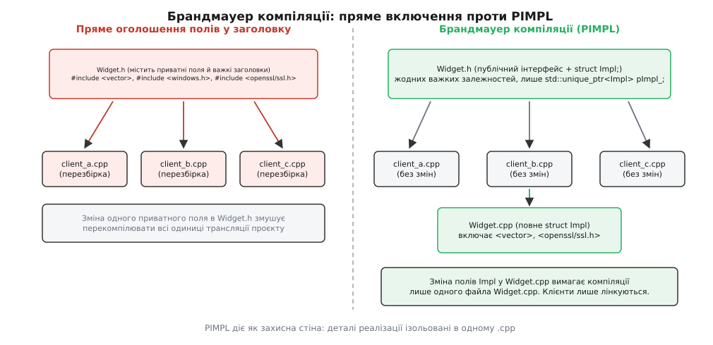
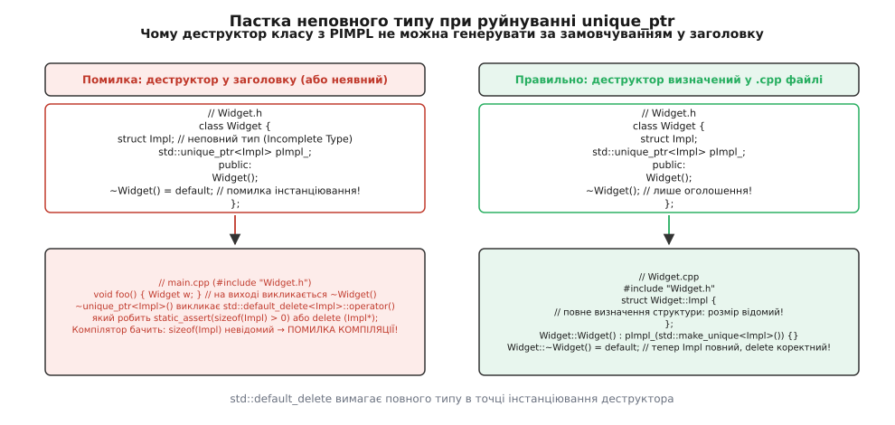
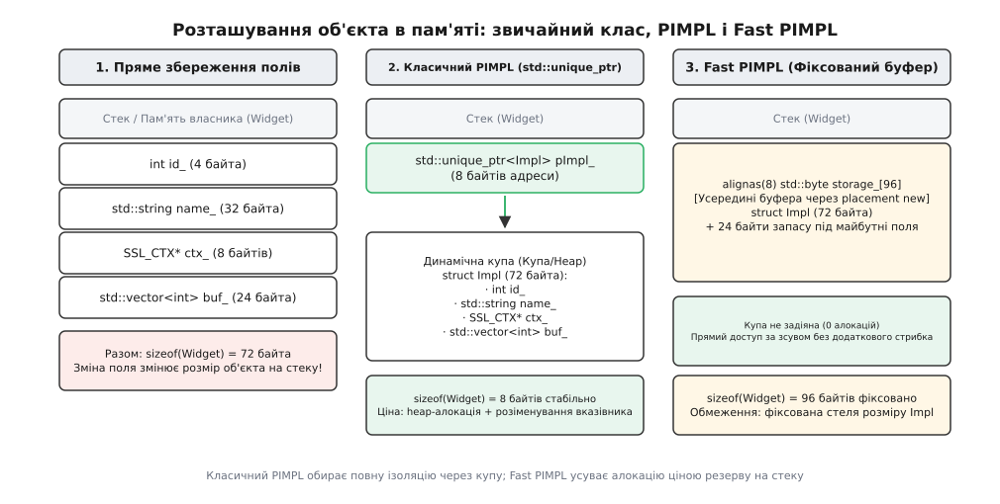

# PIMPL: сховати реалізацію за вказівником

<preknowlist>
- [Купа й динамічна пам'ять](book:programming/heap-dynamic-memory) — виділення пам'яті під час виконання програми через системний алокатор.
- [RAII: захоплення ресурсу](book:programming/raii) — прив'язування часу життя ресурсу до деструктора автоматичного об'єкта.
- [unique_ptr: одноосібне володіння](book:cpp-standards/unique-ptr) — розумний вказівник нульової вартості з автоматичним викликом `default_delete`.
- [Правило п'яти і правило нуля](book:cpp-standards/rule-of-five-zero) — узгоджене керування деструктором, копіюванням та переміщенням.
- [Бінарна сумісність бібліотек (ABI)](book:unix-linux/library-abi-compat) — стабільність розміру структури та зміщення полів у пам'яті при оновленні бінарних файлів.
</preknowlist>

У великому промисловому проєкті на сотні тисяч рядків коду інженер додає одне приватне поле `std::string cache_tag_` у заголовок базового класу `Widget.h`. Цей файл прямо чи опосередковано підключають 420 інших вихідних файлів (`.cpp`). Звичайна команда `ninja` чи `make`, яка досі виконувалася за дві секунди, раптом запускає повну перекомпіляцію всього дерева залежностей на двадцять хвилин. Жоден клієнтський клас не має і не може мати доступу до приватного поля `cache_tag_`, але компілятор змушений перечитати кожен рядок, побудувати нові абстрактні синтаксичні дерева та згенерувати машинний код наново.

Якщо ж цей клас поширюється як скомпільована динамічна бібліотека (`.so` в Linux або `.dll` у Windows), наслідки стають ще небезпечнішими. Зміна розміру приватних даних зміщує поля в пам'яті. Старі клієнтські програми, скомпільовані зі старим заголовком, виділяють під об'єкт на стеку менше байтів, ніж очікує оновлена бібліотека. Результат — непомітне перезаписування сусідніх змінних у пам'яті, пошкодження стека та важковловлювані аварійні завершення процесу під час виконання.

Ці дві проблеми виникають з однієї фундаментальної властивості моделі трансляції мови C++: заголовочний файл змушений оголошувати всі поля класу разом, щоб компілятор знав точний розмір об'єкта `sizeof(Widget)`. Розрив цього жорсткого зв'язку між відкритим інтерфейсом та внутрішніми даними здійснюється перенесенням реалізації за непрозорий вказівник.

## Чому приватні поля в заголовках руйнують систему

Щоб зрозуміти, чому заголовок вимагає наявності приватних полів, поглянемо на те, як компілятор транслює створення об'єкта:

```cpp
// Код клієнта (main.cpp)
#include "Widget.h"

void process() {
    Widget w; // скільки байтів виділити на стеку?
    w.render();
}
```

Під час трансляції функції `process` компілятор повинен згенерувати машинну інструкцію зміщення вказівника стека (наприклад, `sub rsp, 64` на архітектурі x86-64). Щоб обчислити константу 64, компілятору необхідне повне визначення класу `Widget`. Він повинен знати точний тип кожного поля, його розмір та вимоги до апаратного вирівнювання (alignment).

Навіть якщо поле помічене специфікатором доступу `private:`, компілятор не може його проігнорувати. Розмежування `public` та `private` у C++ — це суто семантична перевірка доступності імен на етапі синтаксичного аналізу вихідного коду, яка не має жодного стосунку до фізичного розміщення байтів у пам'яті.

Пряме оголошення полів у відкритому заголовку породжує три руйнівні інженерні проблеми:

1. **Каскадна перекомпіляція (Compilation Cascade).** Будь-яка зміна внутрішньої структури класу змінює контрольний хеш заголовочного файла. Системи збірки (CMake, Ninja, Make) вважають усі залежні одиниці трансляції застарілими й компілюють їх повторно, навіть якщо публічний інтерфейс функцій залишився незмінним.
2. **Забруднення залежностями (Header Pollution).** Якщо для реалізації одного приватного поля потрібен криптографічний контекст OpenSSL, внутрішній тип Boost або дескриптор платформи Windows, заголовок `Widget.h` змушений містити директиви `#include <openssl/ssl.h>` чи `#include <windows.h>`. Якщо запустити препроцесор `g++ -E Widget.h`, маленький файл на 30 рядків перетворюється на 45 000 рядків коду. Ці важкі системні заголовки потрапляють у кожен файл проєкту, роздуваючи час препроцесингу в десятки разів і засмічуючи глобальний простір імен тисячами сторонніх макросів.
3. **Крихкість двійкового інтерфейсу (ABI Fragility).** Розмір структури та зміщення полів фіксуються в машинному коді клієнта під час компіляції. Додавання, видалення чи зміна порядку полів у новій версії динамічної бібліотеки робить її двійково несумісною зі старими клієнтськими бінарниками, вимагаючи повної перекомпіляції всього прикладного програмного забезпечення.



*PIMPL діє як захисна стіна: зміна полів усередині .cpp не вимагає перекомпіляції клієнтських одиниць трансляції.*

## Суть ідіоми: непрозорий вказівник на реалізацію

Щоб позбутися залежностей, публічний заголовок відокремлює зовнішній інтерфейс від внутрішнього стану за допомогою патерну **PIMPL** (англ. *Pointer to Implementation* — вказівник на реалізацію, також відомого як *Compilation Firewall* або *Cheshire Cat*).

Ідея полягає у використанні **неповного типу** (англ. *incomplete type* або *forward declaration*). Заголовочний файл лише заявляє, що існує деяка структура `struct Impl;`, але не описує її вмісту. За правилами мови C++, з неповним типом дозволено виконувати лише обмежений набір дій:
* оголошувати покажчики та посилання на нього (`Impl*`, `Impl&`, `std::unique_ptr<Impl>`);
* використовувати його як тип аргументу чи результат функції в оголошеннях;
* заборонено обчислювати його розмір `sizeof(Impl)` та вирівнювання `alignof(Impl)`;
* заборонено звертатися до його полів і методів через оператори `.` або `->`;
* заборонено створювати екземпляри як звичайні значення або викликати деструктор.

Оскільки розмір будь-якого покажчика на об'єкт фіксований для цільової архітектури (8 байтів на 64-бітних платформах), клас `Widget` може зберігати вказівник на неповний тип без знання його точного внутрішнього макета.

Повний історичний шлях виникнення цього прийому — від ранніх експериментів Джона Керолана над Cfront до стандартизації терміна Гербом Саттером і впровадження d-pointer у бібліотеці Qt — викладено у вставці [Чеширський кіт і брандмауер компіляції](book:cpp-standards/pimpl/hist-cheshire-cat.md).

Базова структура публічного класу з використанням сучасного розумного покажчика `std::unique_ptr` виглядає так:

```cpp
// Widget.h — відкритий заголовок, доступний клієнтам
#ifndef WIDGET_H
#define WIDGET_H

#include <memory>
#include <string_view>

class Widget {
public:
    Widget();
    ~Widget(); // Обов'язково оголошений у заголовку, але НЕ визначений!

    Widget(Widget&&) noexcept;
    Widget& operator=(Widget&&) noexcept;

    // Забороняємо або окремо реалізуємо копіювання
    Widget(const Widget&);
    Widget& operator=(const Widget&);

    void set_title(std::string_view title);
    void draw() const;

private:
    struct Impl;                  // Неповний тип (Incomplete Type)
    std::unique_ptr<Impl> pImpl_; // Єдине поле з даними: фіксовані 8 байтів
};

#endif // WIDGET_H
```

Повне визначення структури `Impl` та вся внутрішня логіка містяться виключно всередині вихідного файлу реалізації:

```cpp
// Widget.cpp — закрита одиниця трансляції бібліотеки
#include "Widget.h"
#include <string>
#include <vector>
#include <iostream>
#include <openssl/ssl.h> // Важкі залежності підключаються ЛИШЕ тут!

struct Widget::Impl {
    std::string title_;
    std::vector<int> render_buffer_;
    SSL_CTX* ssl_context_{nullptr};

    void internal_layout() {
        // Внутрішня складна логіка
    }
};

Widget::Widget() : pImpl_(std::make_unique<Impl>()) {}

Widget::~Widget() = default; // Визначається тут, де тип Impl є повним!

Widget::Widget(Widget&&) noexcept = default;
Widget& Widget::operator=(Widget&&) noexcept = default;

Widget::Widget(const Widget& other) 
    : pImpl_(other.pImpl_ ? std::make_unique<Impl>(*other.pImpl_) : nullptr) {}

Widget& Widget::operator=(const Widget& other) {
    if (this != &other) {
        if (other.pImpl_) {
            pImpl_ = std::make_unique<Impl>(*other.pImpl_);
        } else {
            pImpl_.reset();
        }
    }
    return *this;
}

void Widget::set_title(std::string_view title) {
    pImpl_->title_ = title;
}

void Widget::draw() const {
    std::cout << "Rendering: " << pImpl_->title_ << '\n';
}
```

Тепер `sizeof(Widget)` дорівнює рівно `sizeof(void*)`. Клієнтський код не бачить ані OpenSSL, ані `std::vector`, ані жодного приватного поля. Зміна будь-яких деталей всередині `struct Impl` вимагає перекомпіляції виключно файлу `Widget.cpp`.

> 🔧 **Навіщо це.** PIMPL створює нездоланну межу між інтерфейсом та реалізацією. Зміна внутрішніх алгоритмів чи оновлення сторонніх бібліотек не змушують клієнтів оновлювати власні вихідні файли, а розмір і зсуви зовнішнього класу в пам'яті залишаються абсолютно незмінними в усіх версіях бінарного дистрибутива.

## Пастка неповного типу та видалювач за замовчуванням

Найпідступніша проблема під час використання `std::unique_ptr` у PIMPL пов'язана з генерацією спеціальних функцій-членів. Початківець часто робить спробу написати заголовок із використанням ключового слова `= default` прямо в тілі класу:

```cpp
// ПОМИЛКА: Небезпечний або неробочий заголовок
class BrokenWidget {
    struct Impl;
    std::unique_ptr<Impl> pImpl_;
public:
    BrokenWidget() = default;
    ~BrokenWidget() = default; // ПОМИЛКА КОМПІЛЯЦІЇ в клієнтському коді!
};
```

Спроба скомпілювати клієнтський файл `main.cpp`, який включає такий заголовок, призводить до помилки компілятора на кшталт:

```
error: invalid application of 'sizeof' to an incomplete type 'Widget::Impl'
static_assert(sizeof(_Tp) > 0, "can not delete an incomplete type");
```



*std::default_delete вимагає повного типу в точці інстанціювання деструктора.*

Розглянемо покроковий механізм виникнення цієї помилки:

1. Розумний вказівник `std::unique_ptr<T, D>` за замовчуванням використовує стандартний видалювач `D = std::default_delete<T>`.
2. Оператор виклику деструктора розумного покажчика `~unique_ptr()` інстанціює виклик `default_delete<T>::operator()(T* ptr)`.
3. Всередині функції `std::default_delete` виконується оператор `delete ptr;`.
4. За стандартом C++ (розділ `[expr.delete]`), виконання оператора `delete` над вказівником на неповний тип є невизначеною поведінкою (Undefined Behavior), якщо тип має нетривіальний деструктор. Щоб уберегти розробника від тихих витоків ресурсів, сучасні стандартні бібліотеки (libstdc++, libc++, MSVC STL) вбудовують у `default_delete` перевірку `static_assert(sizeof(T) > 0)`.
5. Якщо деструктор `~Widget() = default;` або `~Widget() {}` визначено в заголовочному файлі, компілятор інстанціює деструктор `~unique_ptr<Impl>()` безпосередньо в точці виклику всередині клієнтського файлу `main.cpp`. Але в `main.cpp` тип `struct Widget::Impl` є неповним — його визначення немає в заголовку! Відбувається спрацьовування статичного твердження або виклик `delete` для неповного типу.

Ця сама вимога стосується не лише деструктора, а й операцій переміщення. Конструктор переміщення та оператор переміщувального присвоєння `Widget` у разі присвоєння новому об'єкту повинні знищити попередній `Impl`, яким володів об'єкт-приймач. Якщо компілятор генерує їх за замовчуванням у заголовку, він знову інстанціює код руйнування `std::unique_ptr<Impl>` у контексті неповного типу.

**Золоте правило PIMPL:**
Деструктор, конструктор переміщення та оператор переміщувального присвоєння класу з PIMPL повинні бути **тільки оголошені** у відкритому заголовочному файлі. Їхнє визначення (навіть із суфіксом `= default;`) має розташовуватися у файлі реалізації `.cpp` **суворо нижче** повного опису структури `struct Impl`.

У файлі `.cpp` на момент інстанціювання `std::default_delete<Impl>` розмір і склад `Impl` уже повністю відомі компілятору, деструктор `Impl` успішно генерується, і статична перевірка проходить без зауважень.

## Семантика копіювання та переміщення

Оскільки `std::unique_ptr` є типом, що підтримує виключно переміщення (Move-only type), наявність поля `std::unique_ptr<Impl> pImpl_` автоматично видаляє неявний конструктор копіювання та оператор копіювального присвоєння зовнішнього класу.

Якщо клас `Widget` повинен поводитися як звичайне значення (Value Semantics), розробник зобов'язаний явно реалізувати операції копіювання, створивши новий екземпляр `Impl` у купі:

### 1. Глибоке копіювання (Deep Copy)

Конструктор копіювання створює новий об'єкт `Impl` шляхом виклику конструктора копіювання структури реалізації:

```cpp
Widget::Widget(const Widget& other)
    : pImpl_(other.pImpl_ ? std::make_unique<Impl>(*other.pImpl_) : nullptr) {}
```

Оператор копіювального присвоєння найзручніше та найбезпечніше реалізувати через ідіому **Copy-and-Swap**, яка гарантує сувору безпеку щодо винятків (Strong Exception Safety):

```cpp
void swap(Widget& first, Widget& second) noexcept {
    using std::swap;
    swap(first.pImpl_, second.pImpl_);
}

Widget& Widget::operator=(Widget other) noexcept {
    swap(*this, other);
    return *this;
}
```

У такій реалізації параметр `other` передається за значенням (що автоматично викликає конструктор копіювання або конструктор переміщення залежно від категорії значення аргументу). Якщо виділення пам'яті в купі під час створення копії зазнає невдачі й викине виняток `std::bad_alloc`, стан поточного об'єкта `*this` залишиться цілком неушкодженим.

### 2. Семантика переміщення (Move Semantics)

Операції переміщення не потребують звернення до системного алокатора: вони просто переносять 8-байтову адресу покажчика з одного об'єкта в інший, залишаючи джерело в порожньому стані (`pImpl_ == nullptr`):

```cpp
// У файлі Widget.cpp
Widget::Widget(Widget&&) noexcept = default;
Widget& Widget::operator=(Widget&&) noexcept = default;
```

Поведінка переміщеного об'єкта вимагає особливої уваги: після `std::move(w)` поле `w.pImpl_` стає нульовим. Якщо публічні методи `Widget` звертаються до `pImpl_->some_method()` без перевірки на `nullptr`, виклик будь-якого методу над переміщеним об'єктом призведе до аварійного завершення (Segmentation Fault). У промислових бібліотеках методи або перевіряють стан покажчика, або документують інваріант: переміщений об'єкт дозволено лише знищувати або перезаписувати новим значенням через присвоєння.

## Проблема константності: протікання побітової const-коректності

У системі типів C++ вказівники мають так звану **поверхневу константність** (англ. *shallow constness*). Якщо метод зовнішнього класу оголошено константним (`void do_something() const`), це робить константним сам об'єкт `Widget`, а отже, і його поле `pImpl_` стає константним вказівником (`Impl* const`), але **не** вказівником на константу (`const Impl*`).

Розглянемо небезпечний приклад:

```cpp
class Widget {
    struct Impl;
    std::unique_ptr<Impl> pImpl_;
public:
    void render() const {
        // Компілятор ДОЗВОЛЯЄ цей рядок, хоча метод const!
        pImpl_->internal_counter_++; 
        pImpl_->clear_cache();
    }
};
```

З точки зору компілятора, покажчик `pImpl_` не змінює своєї адреси, тому побітова константність об'єкта `Widget` не порушена. Проте з точки зору архітектури порушується **логічна константність**: виклик константного методу призводить до модифікації внутрішнього стану об'єкта.

Існує два шляхи розв'язання цієї проблеми:

### 1. Дисципліновані функції доступу (Helper Accessors)

У приватному інтерфейсі класу створюються перевантажені константні та неконстантні допоміжні методи:

```cpp
class Widget {
    struct Impl;
    std::unique_ptr<Impl> pImpl_;

    Impl* get_impl() noexcept { return pImpl_.get(); }
    const Impl* get_impl() const noexcept { return pImpl_.get(); }

public:
    void render() const {
        // get_impl()->internal_counter_++; // ПОМИЛКА КОМПІЛЯЦІЇ: об'єкт константний!
    }
};
```

### 2. Обгортка `std::experimental::propagate_const`

Починаючи з технічної специфікації *Library Fundamentals TS*, стандартний комітет запропонував спеціальну обгортку `propagate_const`, яка поширює константність зовнішнього класу на об'єкт під вказівником:

```cpp
#include <experimental/propagate_const>

class Widget {
    struct Impl;
    std::experimental::propagate_const<std::unique_ptr<Impl>> pImpl_;

public:
    void mutate();
    void inspect() const {
        // pImpl_ автоматично розіменовується як const Impl*
    }
};
```

Якщо компілятор чи стандартна бібліотека не мають заголовка `<experimental/propagate_const>`, написання власної мінімальної обгортки займає близько двадцяти рядків коду, що перевантажують `operator->()` та `operator*()` для константних і неконстантних посилань:

```cpp
template <typename T>
class PropagateConst {
    T ptr_;
public:
    template <typename U>
    explicit PropagateConst(U&& u) : ptr_(std::forward<U>(u)) {}

    auto* get() noexcept { return ptr_.get(); }
    const auto* get() const noexcept { return ptr_.get(); }

    auto* operator->() noexcept { return get(); }
    const auto* operator->() const noexcept { return get(); }

    auto& operator*() noexcept { return *get(); }
    const auto& operator*() const noexcept { return *get(); }
};
```

## Зворотний зв'язок: коли реалізації потрібен зовнішній клас

У багатьох архітектурних сценаріях внутрішня структура `Impl` повинна викликати публічні методи класу-власника, сповіщати його про події або передавати посилання `this` у сторонні системні функції зворотного виклику (callbacks).

Для цього структура `Impl` зберігає так званий **зворотний вказівник** (англ. *back-pointer*):

```cpp
// Widget.cpp
struct Widget::Impl {
    Widget* owner_; // Зворотний вказівник на зовнішній об'єкт
    int progress_{0};

    explicit Impl(Widget* owner) : owner_(owner) {}

    void on_network_data(int bytes) {
        progress_ += bytes;
        if (progress_ > 1000) {
            owner_->notify_ui(); // Виклик публічного методу зовнішнього класу
        }
    }
};

Widget::Widget() : pImpl_(std::make_unique<Impl>(this)) {}
```

Важливе питання щодо безпеки життєвого циклу: чи може сирий вказівник `owner_` стати недійсним (висячим)?

Оскільки об'єкт `Impl` створюється всередині `Widget` і знищується в його деструкторі, час життя `Impl` суворо вкладений у час життя `Widget`. Зворотний сирий вказівник `Widget* owner_` є абсолютно безпечним за умови дотримання двох інваріантів:
1. Конструктор копіювання або переміщення зовнішнього класу повинен оновлювати поле `owner_` у новоствореному чи переміщеному `Impl` (`pImpl_->owner_ = this;`).
2. Об'єкт `Impl` не повинен передавати `owner_` у фонові асинхронні потоки, які можуть пережити сам об'єкт `Widget`.

## Успадкування в класах із PIMPL

Коли виникає потреба створити ієрархію успадкування для класів, що використовують PIMPL, класичною помилкою початківця є додавання власного покажчика `std::unique_ptr<DerivedImpl>` у похідний клас:

```cpp
// ПОМИЛКА: Два покажчики та дві алокації в купі на один об'єкт
class Base {
    struct BaseImpl;
    std::unique_ptr<BaseImpl> pImpl_;
};

class Derived : public Base {
    struct DerivedImpl;
    std::unique_ptr<DerivedImpl> pDerivedImpl_; // ДРУГА алокація в купі!
};
```

Такий підхід подвоює кількість динамічних алокацій для кожного похідного об'єкта, збільшує розмір `Derived` на стеку до 16 байтів та призводить до розсинхронізації стану двох незалежних структур реалізації.

Канонічне промислове рішення полягає у **дзеркальному успадкуванні структур реалізації** з передаванням єдиного покажчика вгору по ієрархії:

```cpp
// Base.h
class Base {
public:
    Base();
    virtual ~Base();
    void base_action();

protected:
    struct Impl;
    // Захищений конструктор для спадкоємців
    explicit Base(std::unique_ptr<Impl> impl);
    std::unique_ptr<Impl> pImpl_;
};

// Derived.h
class Derived : public Base {
public:
    Derived();
    ~Derived() override;
    void derived_action();
};

// Derived.cpp
#include "Derived.h"
#include "Base.h"

struct Derived::Impl : public Base::Impl {
    int extra_field_{42};
};

Derived::Derived() 
    : Base(std::make_unique<Derived::Impl>()) {}

Derived::~Derived() = default;

void Derived::derived_action() {
    // Безпечний статичний каст, оскільки тип Impl гарантовано Derived::Impl
    auto* impl = static_cast<Derived::Impl*>(pImpl_.get());
    impl->extra_field_ += 10;
}
```

При такому дизайні:
* розмір `Base` та `Derived` на стеку залишається рівним рівно 8 байтам;
* створення об'єкта `Derived` виконує рівно одну алокацію в купі під об'єднану структуру `Derived::Impl`;
* внутрішні методи `Derived` мають повний доступ як до базових, так і до власних приватних полів.

## Багатопоточність і синхронізація в PIMPL

Ідіома PIMPL надає значну перевагу для потокобезпечного проектування класів.

У класичному класі додавання м'ютекса для синхронізації внутрішніх ресурсів вимагає включення заголовка `<mutex>` безпосередньо у відкритий заголовок класу, що робить `Widget` непереміщуваним (оскільки `std::mutex` не підтримує ані копіювання, ані переміщення) та роздуває залежності.

У класі з PIMPL м'ютекс ховається всередині закритої структури `Impl`:

```cpp
// Widget.cpp
#include "Widget.h"
#include <mutex>
#include <string>

struct Widget::Impl {
    mutable std::mutex mtx_;
    std::string protected_data_;

    void set_data(std::string data) {
        std::lock_guard<std::mutex> lock(mtx_);
        protected_data_ = std::move(data);
    }

    std::string get_data() const {
        std::lock_guard<std::mutex> lock(mtx_);
        return protected_data_;
    }
};
```

Це дає одразу три переваги:
1. Заголовок `Widget.h` не містить `#include <mutex>` і не знає про спосіб синхронізації (м'ютекс, `std::shared_mutex`, `std::atomic` або lock-free черга).
2. Клас `Widget` залишається повністю переміщуваним на рівні публічного інтерфейсу (`Widget w2 = std::move(w1)`), оскільки переміщується сам 8-байтовий покажчик `pImpl_`.
3. Модифікація внутрішнього механізму блокування в наступних версіях бібліотеки не впливає на бінарну сумісність.

## Вибір розумного покажчика: unique_ptr проти shared_ptr

Іноді в кодових базах можна зустріти реалізацію PIMPL на базі `std::shared_ptr<Impl>`:

```cpp
class SharedWidget {
    struct Impl;
    std::shared_ptr<Impl> pImpl_;
public:
    SharedWidget();
    // Не потребує оголошення ~SharedWidget() у .cpp!
};
```

Цей підхід має одну цікаву технічну особливість: на відміну від `std::unique_ptr`, розумний вказівник `std::shared_ptr` **стирає тип видалювача** (англ. *type erasure*) під час створення контрольного блоку в `std::make_shared`. Тому `std::shared_ptr<Impl>` не вимагає повного типу `Impl` у точці виклику свого деструктора, що дозволяє залишати `~SharedWidget() = default;` безпосередньо в заголовочному файлі.

Проте використання `std::shared_ptr` для класичного PIMPL вважається антипатерном з трьох вагомих причин:
1. **Накладні витрати пам'яті:** `std::shared_ptr` складається з двох вказівників (16 байтів на стеку замість 8) та вимагає виділення контрольного блоку з двома атомарними лічильниками (`use_count` та `weak_count`).
2. **Атомарна синхронізація:** Копіювання `SharedWidget` виконує атомарну інкрементацію (`lock xadd` на x86-64), що створює непотрібний бар'єр пам'яті та сповільнює роботу в багатопотокових середовищах.
3. **Небажане спільне володіння:** Копіювання об'єкта призводить до того, що два `SharedWidget` починають неявно керувати тим самим екземпляром `Impl`, змінюючи спільний стан замість створення незалежної копії (Implicit Sharing без Copy-on-Write).

Тому канонічним вибором для сучасного C++ завжди залишається `std::unique_ptr<Impl>`.

## Керування пам'яттю за допомогою PMR (Polymorphic Memory Resources)

У стандарті C++17 з'явився модуль поліморфних алокаторів `std::pmr`, що дозволяє поєднати класичний PIMPL із виділенням пам'яті з локального стекового пулу пам'яті (Memory Arena) без викликів глобального системного `malloc`.

Розглянемо практичний приклад використання `std::pmr::monotonic_buffer_resource` для PIMPL:

```cpp
#include <memory_resource>
#include <memory>

class PmrWidget {
    struct Impl;
    
    // Власний видалювач, що повертає пам'ять у PMR-ресурс
    struct PmrDeleter {
        std::pmr::memory_resource* mr_;
        void operator()(Impl* ptr) const noexcept;
    };

    std::unique_ptr<Impl, PmrDeleter> pImpl_;

public:
    explicit PmrWidget(std::pmr::memory_resource* mr);
    ~PmrWidget();
};
```

У файлі реалізації об'єкт `Impl` конструюється безпосередньо в пулі пам'яті:

```cpp
// PmrWidget.cpp
#include "PmrWidget.h"

struct PmrWidget::Impl {
    int data_[1024];
};

void PmrWidget::PmrDeleter::operator()(Impl* ptr) const noexcept {
    if (ptr) {
        ptr->~Impl();
        mr_->deallocate(ptr, sizeof(Impl), alignof(Impl));
    }
}

PmrWidget::PmrWidget(std::pmr::memory_resource* mr) {
    void* mem = mr->allocate(sizeof(Impl), alignof(Impl));
    auto* impl = ::new (mem) Impl();
    pImpl_ = std::unique_ptr<Impl, PmrDeleter>(impl, PmrDeleter{mr});
}

PmrWidget::~PmrWidget() = default;
```

Завдяки цьому підходу клієнт може передати стек-буфер `std::pmr::monotonic_buffer_resource arena(stack_buf, sizeof(stack_buf))` у конструктор `PmrWidget`, отримавши нульову вартість алокацій і повну ізоляцію заголовка.

## Ціна архітектурної чистоти: накладні витрати PIMPL

Патерн PIMPL не є безкоштовною абстракцією. За ізоляцію компіляції та стабільність двійкового інтерфейсу доводиться платити трьома видами витрат у час виконання:

1. **Додаткова алокація пам'яті (Double Allocation).** Замість створення одного суцільного блоку пам'яті (наприклад, на стеку) програма виконує дві алокації: виділення 8 байтів під зовнішній об'єкт та звернення до системної купи через `malloc` / `operator new` для структури `Impl`. На архітектурі x86-64 з алокатором glibc створення `Impl` розміром 72 байти споживає в купі 96 байтів (16 байтів службового заголовка чанка + 72 байти даних + 8 байтів вирівнювання до 16-байтової межі). Разом із 8 байтами покажчика на стеку сумарний обсяг пам'яті становить 104 байти замість початкових 72 байтів.
2. **Непряма адресація (Pointer Indirection).** Будь-яке звернення до внутрішнього поля вимагає додаткового читання з пам'яті: спочатку завантажується адреса `pImpl_`, і лише потім зчитується потрібне поле за зсувом (`this -> pImpl_ -> member`). Якщо структура `Impl` була виділена в іншій сторінці купи, це призводить до промаху кешу даних першого рівня (L1 Data Cache Miss) і можливого промаху буфера асоціативної трансляції (TLB Miss).
3. **Неможливість вбудовування функцій (Inlining Barrier).** Оскільки методи реалізуються у файлі `.cpp`, компілятор не може вбудувати (inline) тіло коротких методів безпосередньо в точку виклику в клієнтському коді під час звичайної збірки. Для оптимізації таких викликів потрібен складний етап міжмодульної оптимізації під час компонування (LTO — Link-Time Optimization).



*Порівняння макета пам'яті: класичний PIMPL виносить стан у купу, тоді як Fast PIMPL використовує вирівняний стек-буфер.*

## Оптимізація Fast PIMPL: поєднання швидкості та ізоляції

У ситуаціях, коли динамічне виділення пам'яті в купі є неприпустимим (критичні за часом алгоритми, обробка мережевих пакетів, вбудовані мікроконтролери), застосовують оптимізацію **Fast PIMPL** (також відому як *Inline PIMPL* або *Small Buffer PIMPL*).

Замість вказівника на купу зовнішній клас виділяє безпосередньо у своєму тілі нетипізований масив байтів фіксованого розміру з відповідним вирівнюванням:

```cpp
class FastWidget {
    // Резервуємо 64 байти з вирівнюванням під максимальний базовий тип
    alignas(std::max_align_t) std::byte storage_[64];

public:
    FastWidget();
    ~FastWidget();
    // ...
};
```

Створення та знищення об'єкта виконується у файлі `.cpp` за допомогою оператора **розміщувального new** (англ. *placement new*) та явного виклику деструктора `ptr->~Impl()`.

Повний опис безпечної реалізації Fast PIMPL, шаблонної обгортки, статичних перевірок розміру `static_assert` та нюансів використання `std::launder` наведено у практичній вставці [Реалізація Fast PIMPL без динамічного виділення пам'яті](book:cpp-standards/pimpl/proj-fast-pimpl.md).

## PIMPL проти альтернативних архітектурних підходів

Перед вибором PIMPL варто порівняти його з іншими інструментами керування інтерфейсами в сучасній мові C++:

### 1. PIMPL проти суто абстрактних інтерфейсів (Abstract Base Class)

Альтернативою PIMPL є оголошення інтерфейсу через чисто віртуальний базовий клас:

```cpp
class IWidget {
public:
    virtual ~IWidget() = default;
    virtual void draw() = 0;
};

// Фабрична функція
std::unique_ptr<IWidget> create_widget();
```

* **Семантика:** Абстрактний базовий клас змушує клієнта завжди працювати через покажчик або посилання (`std::unique_ptr<IWidget>`), втрачаючи семантику звичайного значення на стеку. Клас із PIMPL є повноцінним типом-значенням, який можна створювати на стеку, зберігати безпосередньо в масиві `std::vector<Widget>` та передавати за значенням.
* **Витрати на виклик:** Абстрактний клас здійснює виклик кожного методу через таблицю віртуальних функцій (`vtable`), що унеможливлює вбудовування коду та коштує непрямого переходу. У PIMPL виклики публічних методів є звичайними невиртуальними функціями.

### 2. PIMPL у добу модулів C++20

Із появою модулів (`export module widget;`) у стандарті C++20 розробники отримали вбудований брандмауер компіляції на рівні самої мови: імпорт модуля не вимагає текстового розбору заголовків, а зміна внутрішньої частини модуля не призводить до каскадної перекомпіляції клієнтів, якщо інтерфейс не змінювався: [Модулі C++20](book:cpp-standards/cpp-modules).

Проте модулі вирішують лише питання часу компіляції вихідного коду (Source-level isolation). Якщо модуль експортує клас, розмір якого залежить від приватних змінних-членів, будь-яка зміна цих полів змінює двійковий макет класу (ABI) у скомпільованій спільній бібліотеці. Тому для створення довготривалих стабільних системних бібліотек (`.so` / `.dll`) патерн PIMPL залишається безальтернативним стандартом індустрії.
