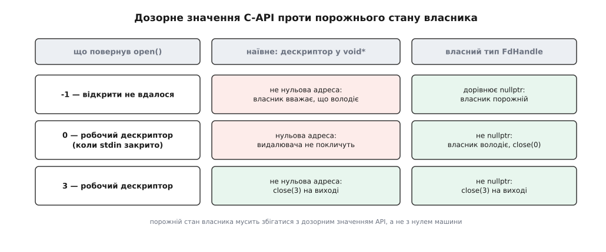

# ⚙️ Володіння чужим ресурсом через unique_ptr

Файловий дескриптор — не вказівник: його «нічого» дорівнює −1, а нуль — цілком робоче значення. Наївне загортання такого ресурсу в `unique_ptr` компілюється, проходить тести й мовчки ламається на дескрипторі 0; ліки в тому, щоб тип дескриптора сам вирішував, яке його значення означає «порожньо».

## Спроба, яка компілюється й бреше

Дескриптор — це `int`, тож найкоротший шлях покласти його під нагляд власника виглядає так: втиснути число туди, де `unique_ptr` чекає на адресу.

```cpp
struct FdClose {
    void operator()(void* p) const noexcept {
        ::close(static_cast<int>(reinterpret_cast<std::intptr_t>(p)));
    }
};
using RawFd = std::unique_ptr<void, FdClose>;

RawFd fd(reinterpret_cast<void*>(::open("run.log", O_RDONLY)));
if (!fd) return report_error();
```

Вирішує тут деструктор власника, а вся його дія зводиться до одного рядка: `if (get()) get_deleter()(get());` — видалювача кличуть тільки тоді, коли збережене значення не дорівнює `nullptr`. Тобто питання «є тут ресурс чи ні» власник вирішує звіркою з машинним нулем, і ця звірка тут відповідає на зовсім інше питання, ніж нам треба.

Ядро видає дескриптори ощадливо: `open()` повертає **найменший номер, не зайнятий у цьому процесі** ([файловий дескриптор](topic:unix-linux/file-descriptor) — номер рядка в таблиці відкритих файлів процесу). Демон, що закрив успадкований стандартний ввід, або утиліта, яка зробила `close(0)`, наступним відкриттям отримає рівно нуль. І тоді код вище бреше двічі: `if (!fd)` повідомляє про помилку, хоч файл щойно відкрито, а `close` не викличеться ніколи — дескриптор триматиметься до кінця процесу, і цикл із такими відкриттями впреться в ліміт.

Дзеркальна помилка чекає на іншому кінці. Невдале відкриття дає −1, а −1 у ролі адреси — це всі одиниці, значення явно не нульове. Власник вирішить, що володіє ресурсом, і на виході покличе `close(-1)`. Тут це лише `EBADF`, який ніхто не читає; з функцією звільнення чужої бібліотеки, яка довіряє своєму аргументові, той самий недогляд дає падіння.

Винне не приведення типу. Винне те, що ми ототожнили два різні «нічого»: нуль машини й дозорне значення API.

## Хто вирішує, що означає «порожньо»

Насправді `unique_ptr` ніде не припускає, що тримає адресу. Тип збереженого значення він бере не з першого параметра шаблону, а питає у видалювача: якщо `remove_reference_t<D>::pointer` називає тип, то саме він стає `unique_ptr<T, D>::pointer`, і лише інакше береться `T*`. Вимога до цього типу одна — задовольняти набір **Cpp17NullablePointer**.

Набір скромний, бо й робить власник із дескриптором небагато: копіює його, обмінює, порівнює з `nullptr` і передає видалювачеві. Розіменування немає, доки ви самі не напишете `*p`. Тож тип мусить уміти рівно ось що: давати «порожньо» при ініціалізації значенням (`P()` зобов'язане дати нуль цього типу), будуватися з `nullptr` і приймати `nullptr` присвоєнням, порівнюватися з `nullptr` в обидва боки, приводитися до `bool` у логічному контексті — і не кидати винятків.

Це і є важіль: **порожнє значення визначає не мова, а ми**.



*Наївна схема класифікує обидва цікаві значення навпаки; власний тип дескриптора ставить межу там, де її провів C-API.*

## Дескриптор, який уміє порівнюватися з nullptr

Спершу сам дескриптор — крихітний клас, чия єдина робота полягає в тому, щоб оголосити −1 своїм нулем:

```cpp
class FdHandle {
    int fd_ = -1;                                    // порожнє значення — саме -1
public:
    FdHandle() = default;
    FdHandle(std::nullptr_t) noexcept {}
    explicit FdHandle(int fd) noexcept : fd_(fd) {}

    int  fd() const noexcept { return fd_; }
    explicit operator bool() const noexcept { return fd_ != -1; }

    friend bool operator==(FdHandle a, FdHandle b) noexcept { return a.fd_ == b.fd_; }
    friend bool operator==(FdHandle h, std::nullptr_t) noexcept { return h.fd_ == -1; }
};
```

Двох операторів `==` вистачає завдяки переписаним кандидатам C++20: з них компілятор сам виводить і `!=`, і дзеркальний порядок операндів ([тричленне порівняння](topic:cpp-standards/three-way-comparison) додало до мови саме це правило переписування). До C++20 ті самі чотири оператори довелося б написати руками.

Далі видалювач — і в ньому один рядок, заради якого все затівалося:

```cpp
struct FdClose {
    using pointer = FdHandle;                        // ← дескриптор замість адреси
    void operator()(FdHandle h) const noexcept { ::close(h.fd()); }
};

using UniqueFd = std::unique_ptr<int, FdClose>;      // «int» тут суто декоративний
static_assert(sizeof(UniqueFd) == sizeof(int));
```

Перший параметр шаблону більше не визначає нічого: тип збереженого значення прийшов із `FdClose::pointer`, а `int` лишився для читабельності. Порожня структура-видалювач не додає до розміру нічого ([оптимізація порожньої бази](topic:cpp-standards/empty-base-optimization) вкладає її в те саме слово), тож перевірка розміру проходить — власник важить стільки ж, скільки голий `int`, а виклик `close` вбудовується.

Тепер відкриття:

```cpp
UniqueFd open_file(const char* path, int flags) {
    UniqueFd fd(FdHandle{::open(path, flags)});
    if (!fd) throw std::system_error(errno, std::system_category(), path);
    return fd;
}

inline int native(const UniqueFd& f) noexcept { return f.get().fd(); }

auto log = open_file("run.log", O_RDONLY);
char buf[4096];
ssize_t n = ::read(native(log), buf, sizeof buf);    // close — на будь-якому виході
```

Дрібниця в цій функції варта окремої уваги: між `::open` і перевіркою не стоїть жодного виклику. Конструктор `FdHandle` тільки копіює число, конструктор `unique_ptr` — теж, тож `errno` доходить до `std::system_error` неушкодженим. Досить вставити між ними будь-що змістовне — журналювання, звільнення тимчасового буфера — і в діагностиці опиниться помилка зовсім іншої операції.

Друга дрібниця працює вже на боці компілятора. `FdHandle(int)` оголошено `explicit`, тому `UniqueFd fd(::open(path, flags));` просто не збереться: сире число не перетвориться на дескриптор мовчки. Плутанина, з якої почалася вся ця історія, ловиться тепер не тестом на рідкісному нулі, а першою ж збіркою.

> 🔧 **Навіщо це.** Дозорне значення C-API і порожній стан власника стали одним значенням, тож `if (!fd)` тепер означає рівно «відкрити не вдалося» — не більше й не менше. Перевірка помилки й перевірка володіння злилися в одну, і жодне число з робочого діапазону вже не може випадково потрапити в роль «нічого».

## Коли видалювач мусить щось пам'ятати

Дескриптор ядра звільняється сам по собі: `close` знає все потрібне з номера. Але багато ресурсів так не вміють — слот у пулі, кадр у кільцевому буфері, текстура в контексті рендерера. Щоб повернути такий ресурс, треба знати **куди** його повертати, і ця адреса не вміщається в дескриптор.

```cpp
class SlotPool {
    std::array<Frame, 64> frames_{};
    std::bitset<64>       busy_{};
public:
    int    acquire() noexcept;                       // -1, якщо вільних немає
    void   give_back(int i) noexcept { busy_.reset(i); }
    Frame& frame(int i) noexcept { return frames_[i]; }
};

class SlotHandle {                                   // те саме, що FdHandle, про індекс
    int i_ = -1;
public:
    SlotHandle() = default;
    SlotHandle(std::nullptr_t) noexcept {}
    explicit SlotHandle(int i) noexcept : i_(i) {}
    int index() const noexcept { return i_; }
    friend bool operator==(SlotHandle a, SlotHandle b) noexcept { return a.i_ == b.i_; }
    friend bool operator==(SlotHandle h, std::nullptr_t) noexcept { return h.i_ == -1; }
};

class SlotReturn {
    SlotPool* pool_ = nullptr;                       // ← стан: куди повертати
public:
    using pointer = SlotHandle;
    SlotReturn() = default;
    explicit SlotReturn(SlotPool& p) noexcept : pool_(&p) {}
    void operator()(SlotHandle h) const noexcept { pool_->give_back(h.index()); }
};

using UniqueSlot = std::unique_ptr<Frame, SlotReturn>;

UniqueSlot take(SlotPool& pool) {
    return UniqueSlot(SlotHandle{pool.acquire()}, SlotReturn{pool});
}
```

Конструктор із двох аргументів кладе видалювач усередину власника, і далі той подорожує разом із дескриптором: повернули `UniqueSlot` із функції, переклали в структуру, віддали в чергу — знання про пул їде поруч і не губиться.

## Чим платить стан у видалювачі

Найперше — розміром. Порожній `FdClose` був безкоштовний, а `SlotReturn` несе вказівник: `UniqueSlot` важить шістнадцять байтів проти чотирьох у `UniqueFd`. Для одного власника це дрібниця, для мільйона слотів у масиві — вже стаття витрат.

Друге тонше. Переміщення власника переміщує й видалювач, а джерело лишається з видалювачем у стані «після переміщення». Поки джерело порожнє, це нікого не турбує — видалювача до нього не покличуть. Але якщо тому самому об'єктові потім зробити `reset` зі свіжим ресурсом, звільняти його буде вже обібраний видалювач. Звідси проста дисципліна: **стан видалювача має бути тривіально копійовним** — вказівник, дескриптор, індекс, тобто те, чиє «переміщення» насправді є копіюванням. Видалювач, що тримає всередині `std::function` або власний `unique_ptr`, — саме та конструкція, на якій це стріляє.

Третє видно не в коді, а в порядку знищень. Видалювач із сирим вказівником на пул мовчки заявляє, що пул переживе кожен виданий ним слот, — а перевіряти це нікому. Пул, оголошений після власника в тій самій функції, помре першим, і повернення слота відбудеться в уже неживий об'єкт. Тому такий пул або живе довше за все, що з нього беруть (статичний, член довговічної системи), або видає слоти лише всередині своєї області й нікуди їх не віддає.

Четверте стосується виклику. Найлінивіший спосіб задати видалювач — вказівник на функцію, і він же найдорожчий:

```cpp
using FilePtr = std::unique_ptr<std::FILE, int(*)(std::FILE*)>;
FilePtr f(std::fopen(path, "r"), [](std::FILE* p) { return std::fclose(p); });
```

Тут вісім байтів на сам вказівник плюс непрямий виклик, який компілятор здебільшого не вбудує. C++20 дав дешеву заміну: лямбду без захоплень тепер можна писати в невичислюваному контексті (папір P0315R4) і в неї є конструктор без аргументів (папір P0624R2), тож її тип годиться просто як аргумент шаблону:

```cpp
using FilePtr = std::unique_ptr<std::FILE, decltype([](std::FILE* p) { std::fclose(p); })>;
```

Розмір — знову одне слово, `fclose` вбудовується. І в будь-якому варіанті видалювач не має права кидати: деструктор кличе його, і стандарт прямо каже, що поведінка невизначена, якщо цей виклик кине виняток ([noexcept](topic:cpp-standards/noexcept) тут не прикраса, а фіксація вже наявного обов'язку).

## Пастки й межа розумного

**Ініціалізація значенням мусить давати порожньо.** Рядок `int fd_ = -1;` — не стиль, а весь контракт: свій порожній стан `unique_ptr` будує саме виразом `FdHandle()`. Приберіть ініціалізатор — і конструктор, оголошений через `= default`, лишиться не наданим користувачем, тож ініціалізація значенням просто занулить поле. Порожній `UniqueFd` уважатиме, що володіє дескриптором 0, і на виході з області закриє чужий стандартний ввід. Компілятор при цьому не скаже ані слова.

**Видалювача не кличуть на порожньому значенні.** Тож перевірка дозорного значення всередині нього — мертвий код, а спокуса повісити на видалювач журналювання «кожного знищення» приречена: порожній власник помре тихо.

**`release()` віддає дескриптор, а не число.** Щоб передати сирий номер у C-API, який закриє його сам, пишуть `int raw = fd.release().fd();` — і з цієї миті відповідальність уже не тут.

**`shared_ptr` такого не візьме.** Його конструктор від `unique_ptr<Y, D>` вимагає, щоб `pointer` перетворювався на `Y*`, а наш дескриптор — не адреса. Спільне володіння таким ресурсом доводиться будувати інакше: загорнути власника в маленький об'єкт і вже ним володіти спільно ([shared_ptr і weak_ptr](topic:cpp-standards/shared-weak-ptr) рахує посилання на об'єкт, а не на довільний дескриптор).

**Кожен видалювач — окремий тип.** `UniqueFd` і дескриптор, що закривається інакше, не покладеш в один контейнер, а функція, яка повертає «якийсь дескриптор під наглядом», зобов'язана назвати видалювач у своїй сигнатурі.

Чи варта гра свічок — питання масштабу. Заради єдиного дескриптора власний клас на двадцять рядків нерідко чесніший: ні вимог Cpp17NullablePointer, ні декоративного першого параметра, а `get()` одразу віддає `int`. Виграш з'являється там, де дескрипторів багато й вони різні — файли, слоти, текстури, контексти чужих бібліотек: усі вони дістають один словник (`get`, `release`, `reset`, переміщення, перевірка в `if`), одну й ту саму заборону копіювання і ту саму гарантію звільнення на кожному виході. Власного в кожному такому власнику — рядок `using pointer` і один виклик звільнення; решту вже перевірено в стандартній бібліотеці.
