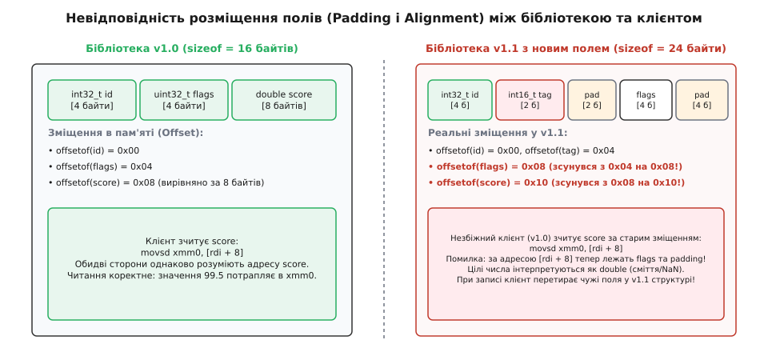
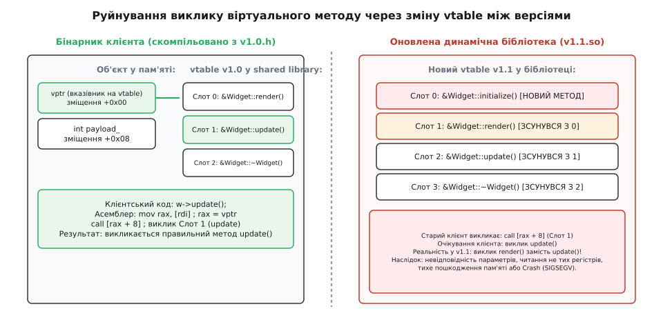
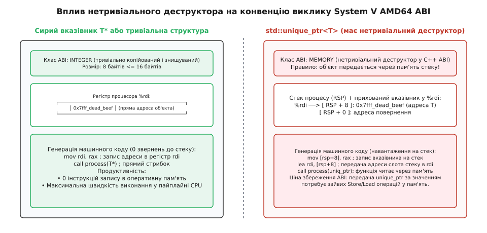
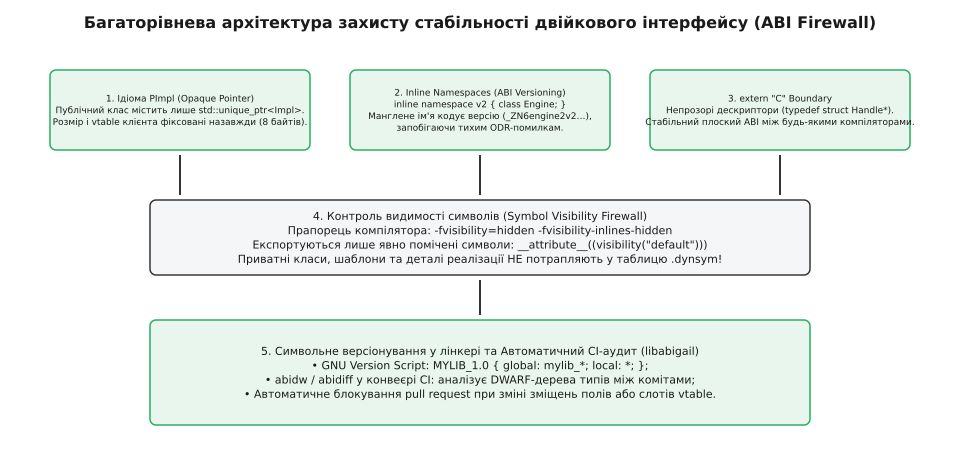

# Стабільність ABI у C++ і що її ламає

<preknowlist>
- [Означення одного правила (ODR) і типи компонування](book:cpp-standards/odr-and-linkage) — правила узгодженості типів та символів між одиницями трансляції.
- [Манглінг імен: декорування символів у C++](book:cpp-standards/name-mangling) — алгоритми перетворення сигнатур у двійкові ідентифікатори лінкера.
- [Вирівнювання та розміщення в пам'яті (alignment)](book:cpp-standards/alignment-placement-new) — вирівнювання полів, sizeof, alignof та зміщення.
- [Ідіома PImpl: ізоляція реалізації](book:cpp-standards/pimpl) — захист публічного заголовка від змін приватних полів через непрозорий вказівник.
</preknowlist>

Програма успішно компілюється без жодного попередження, компонувальник бездоганно зв'язує виконуваний файл, проте під час запуску на сервері процес раптово падає із системним сигналом `SIGSEGV` або мовчки спотворює дані в сусідніх комірках пам'яті. Причина такого збою криється у непомітній підміні динамічної бібліотеки `.so` або `.dll`: спільний заголовок `widget.h` у клієнтській програмі та в новій версії бібліотеки мав однаковий вихідний код, проте бібліотеку скомпільовано з іншою версією компілятора, із доданим приватним полем або зміненим прапорцем оптимізації, що непомітно зрушило адреси полів у пам'яті.

Подібні збої виникають через порушення **двійкового інтерфейсу додатків (англ. Application Binary Interface, ABI)** — низькорівневого контракту між скомпільованими машинними модулями. Розуміння того, як влаштований цей контракт, чому стандарт мови C++ свідомо відмовляється його фіксувати, які зміни вихідного коду непомітно руйнують сумісність та чому комітет стандартизації обрав стабільність ціною швидкодії, є ключовою навичкою архітектора сучасних системних C++ додатків.

---

## 1. Концепція ABI та межі стандарту C++

Щоб усвідомити природу ABI, необхідно чітко розмежувати два рівні сумісності програмного забезпечення: інтерфейс вихідного коду та двійковий інтерфейс.

**Інтерфейс прикладного програмування (англ. Application Programming Interface, API)** — це контракт на рівні сирцевого тексту програми. Він визначає назви типів, сигнатури функцій, простори імен, правила шаблонів та поведінкові інваріанти. Якщо бібліотека зберігає сумісність API (Source Compatibility), клієнтський код гарантовано успішно компілюється після оновлення версії заголовків без внесення правок у текст програми.

**Двійковий інтерфейс додатків (Application Binary Interface, ABI)** — це контракт на рівні скомпільованого машинного коду, регістрів мікропроцесора, структури стекових фреймів та форматів об'єктних файлів. Він визначає:
- Як саме імена функцій і типів перетворюються у текстові ідентифікатори лінкера (декорування або манглінг імен);
- Який точний розмір у байтах (`sizeof`), вирівнювання (`alignof`) та зміщення (`offsetof`) має кожне поле в структурі;
- Як організовані віртуальні таблиці (`vtable`) і за яким числовим індексом викликається кожен поліморфний метод;
- Через які саме регістри процесора передаються аргументи функцій і хто очищає стек (Calling Conventions);
- Який формат мають службові таблиці розгортання стеку при виникненні винятків (Exception Handling).

Якщо бібліотека зберігає двійкову сумісність (Binary Compatibility), скомпільовану програму можна запустити з новою версією динамічної бібліотеки без повторної перекомпіляції клієнтського коду (Drop-in Replacement).

```
┌────────────────────────────────────────────────────────┐
│              Вихідний код C++ (API)                    │
│      void process(const Widget& w, int priority);      │
└──────────────────────────┬─────────────────────────────┘
                           │ Компіляція (GCC, Clang, MSVC)
                           ▼
┌────────────────────────────────────────────────────────┐
│           Двійковий машинний код (ABI)                 │
│  Символ: _Z7processRK6Widgeti                          │
│  Регістри: %rdi = &w, %esi = priority                  │
│  Розкладка Widget: offsetof(vptr)=0, offsetof(id)=8    │
│  Розгортання: секція .eh_frame / .gcc_except_table    │
└────────────────────────────────────────────────────────┘
```

### Чому міжнародний стандарт C++ не визначає ABI

Міжнародний стандарт мови C++ (ISO/IEC 14882) повністю ігнорує існування ABI. Стандарт описує функціонування так званої **абстрактної машини (англ. abstract machine)** та поведінкове правило «як ніби» (англ. *as-if rule*). Компілятор має право згенерувати абсолютно будь-який двійковий код, доки спостережувана поведінка програми (введення-виведення, робота з пам'яттю, виклики системних функцій) збігається з вимогами абстрактної машини.

Комітет стандартизації ISO свідомо відмовився від фіксації ABI з трьох фундаментальних причин:

1. **Різноманіття апаратних архітектур**. C++ працює на сотнях типів мікропроцесорів: від 8-бітних мікроконтролерів AVR та вбудованих DSP-процесорів до 64-бітних суперкомп'ютерів архітектури x86_64, ARM AArch64, RISC-V, POWER та графічних прискорювачів GPU. Кожна архітектура має унікальний набір регістрів та апаратні обмеження вирівнювання пам'яті. Зафіксувати єдиний ABI для всіх процесорів фізично неможливо.
2. **Свобода оптимізацій компілятора**. Якби стандарт вимагав конкретного розташування полів у пам'яті чи фіксованого порядку виклику функцій, компілятори втратили б можливість перевпорядковувати поля для усунення байтів заповнення, передавати аргументи через розширені векторні регістри (AVX-512, SVE) або виконувати міжпроцедурну оптимізацію цілої програми (Link-Time Optimization, LTO).
3. **Відмінності операційних систем**. Формати виконуваних файлів та динамічних завантажувачів (ELF у Linux, Mach-O у macOS, PE/COFF у Windows) розроблялися незалежно різними консорціумами. Стандартизація ABI вимагала б стандартизації самих операційних систем, що виходить далеко за межі мови програмування.

Як наслідок, специфікації ABI формуються не комітетом ISO, а незалежними консорціумами розробників операційних систем та компіляторів. На платформах Linux, macOS, iOS та Android домінує відкритий стандарт **Itanium C++ ABI**, тоді як на платформі Windows операційна система та компілятор опираються на закриту специфікацію **MSVC ABI**.

---

## 2. П'ять фундаментальних складових C++ ABI

Двійковий контракт C++ складається з п'яти взаємопов'язаних підсистем, кожна з яких регламентує окремий аспект взаємодії машинного коду.

### 2.1. Манглінг імен (Name Mangling)

Оскільки класичні компонувальники (Linkers) оперують пласкими глобальними таблицями імен і нічого не знають про простори імен, перевантаження функцій чи класи, компілятор C++ шифрує повну сигнатуру кожної сутності в унікальний текстовий рядок лінкера — процес, що отримав назву декорування або манглінгу (англ. *name mangling*, від лат. *mangulare* — спотворювати).

В **Itanium C++ ABI** (GCC, Clang) усі манглені імена починаються з префікса `_Z`. Якщо функція є членом класу або розташована в просторі імен, додається літера `N`, далі чергуються довжини назв та самі назви, а завершується ланцюжок літерою `E` перед кодуванням типів аргументів:

```cpp
namespace Engine {
    class Widget {
    public:
        void render(int width, double scale);
    };
}
// Манглене ім'я в Itanium ABI: _ZN6Engine6Widget6renderEid
// Розбір: _Z (префікс C++)
//         N (вкладене ім'я)
//         6Engine 6Widget 6render (простір імен, клас, функція)
//         E (кінець списку імен)
//         i (int) d (double) (типи аргументів)
```

В **MSVC ABI** (Microsoft Visual C++) використовується власна система, де імена починаються зі знака питання `?`:
`?render@Widget@Engine@@QEAAXHN@Z`. Тут кваліфікатор `QEAA` додатково шифрує модифікатор доступу `public`, константність покажчика `this` та угоду про виклик, а `X`, `H`, `N` кодують типи `void`, `int` та `double`.

**Критичний нюанс манглінгу:** Для звичайних (нешаблонних) функцій тип повернення **не включається** у манглене ім'я в Itanium ABI. Це зроблено тому, що в C++ заборонено перевантажувати функції виключно за типом повернення. Якщо розробник змінить сигнатуру експортованої функції з `int calculate(double)` на `double calculate(double)`, манглене ім'я символу `_Z9calculated` залишиться абсолютно однаковим. Компонувальник не помітить підміни, проте клієнт очікуватиме результат у цілочисельному регістрі `%rax`, тоді як оновлена функція поверне значення через регістр чисел із рухомою комою `%xmm0`, спричиняючи читання сміття. Для шаблонів функцій тип повернення обов'язково кодується в символі, оскільки він може залежати від параметрів шаблону.

---

### 2.2. Розміщення в пам'яті (Layout, Alignment, Padding)

Розташування структури в оперативній пам'яті визначається трьома правилами:
1. **Зсув першого поля**: Перше нестатичне поле структури завжди розміщується за зміщенням 0 (якщо у класу немає віртуальних функцій).
2. **Вирівнювання полів (Field Alignment)**: Кожне поле типу `T` повинно розташовуватися за адресою, кратною `alignof(T)`. Якщо між попереднім полем та поточною адресою виникає проміжок, компілятор вставляє байти заповнення (англ. *padding*).
3. **Загальне вирівнювання структури (Structure Alignment)**: Загальний розмір структури `sizeof(S)` завжди округлюється вгору до числа, кратного найбільшому значенню `alignof` серед усіх її полів.


*Невідповідність зміщень полів (Padding та Offset) між старою версією клієнта та новою бібліотекою призводить до читання сміття або перетирання сусідньої пам'яті.*

Розглянемо випадок, коли порядок полів оптимізовано для економії пам'яті:

```cpp
// Версія 1.0: Неефективне розташування (розмір 24 байти)
struct DataV1 {
    char   flag;      // 1 байт  [зміщення 0x00]
                      // 7 байтів padding
    double value;     // 8 байтів [зміщення 0x08]
    int    id;        // 4 байти  [зміщення 0x10]
                      // 4 байти padding (округлення до alignof(double)=8)
};

// Версія 1.1: Розробник переставив поля (розмір 16 байтів)
struct DataV2 {
    double value;     // 8 байтів [зміщення 0x00]
    int    id;        // 4 байти  [зміщення 0x08]
    char   flag;      // 1 байт   [зміщення 0x0C]
                      // 3 байти padding
};
```

Хоча склад полів не змінився, зміщення `offsetof(Data, id)` змінилося з `0x10` на `0x08`. Клієнтська програма, скомпільована з версією 1.0, під час читання `data.id` зчитуватиме байти з адреси `+0x10`, де у версії 1.1 взагалі немає даних структури.

**Оптимізація порожнього базового класу (Empty Base Optimization, EBO):**
У мові C++ будь-який самостійний об'єкт повинен мати розмір щонайменше 1 байт, щоб гарантувати унікальність його адреси. Проте якщо порожній клас успадковується як базовий (наприклад, stateless-алокатор або функціональний об'єкт), Itanium ABI дозволяє розмістити під'об'єкт базового класу за зміщенням 0 без виділення під нього додаткової пам'яті. У C++20 з'явився атрибут `[[no_unique_address]]`, який поширює оптимізацію EBO на звичайні поля-члени класу, змінюючи геометрію пам'яті структури.

---

### 2.3. Віртуальні таблиці (vtable) та поліморфна диспетчеризація

Якщо клас містить хоча б одну віртуальну функцію або успадковує віртуальний клас, компілятор додає на початок об'єкта прихований покажчик на віртуальну таблицю — **`vptr` (Virtual Table Pointer)**, розмір якого на 64-бітних системах дорівнює 8 байтам.

Віртуальна таблиця (`vtable`) розміщується в секції пам'яті тільки для читання (`.rodata`) і є масивом покажчиків на функції.


*Зміна порядку або додавання віртуальних методів зміщує індекси слотів у vtable, змушуючи старий скомпільований клієнт викликати чужий метод.*

Структура `vtable` в Itanium ABI строго регламентована:
- За зміщенням `-2` (перед початком слотів методів) зберігається зміщення до повного об'єкта (Offset-to-Top);
- За зміщенням `-1` зберігається вказівник на структуру метаданих RTTI `std::type_info`;
- Починаючи зі зміщення `0`, розташовуються покажчики на віртуальні методи в порядку їхнього першого оголошення у вихідному коді;
- Для віртуального деструктора в Itanium ABI завжди генерується **два слоти**: повний деструктор (Complete Object Destructor, що очищає поля) та деструктор зі звільненням пам'яті (Deleting Destructor, що додатково викликає `operator delete`).

**Множинне та віртуальне успадкування:**
Якщо клас успадковує кілька базових класів (`class Derived : public Base1, public Base2`), об'єкт отримує кілька незалежних покажчиків `vptr`. Перший покажчик вказує на первинну віртуальну таблицю (Primary Vtable), а другий — на вторинну таблицю (Secondary Vtable). При виклику методу `Base2` через покажчик на `Derived` компілятор вставляє спеціальну функцію-перехідник — **Thunk**, яка коригує покажчик `this` (віднімаючи зміщення під'об'єкта `Base2` у пам'яті: `sub rdi, 8; jmp Base2::foo`) перед виконанням методу.

У разі **віртуального успадкування** (`class Derived : virtual public Base`) зміщення базового класу не може бути зафіксоване статично, оскільки воно залежить від кінцевого похідного класу. Для цього Itanium ABI генерує таблиці **VTT (Virtual Table Table)**, через які зміщення віртуальних баз динамічно зчитуються під час конструювання об'єкта. Будь-яка зміна ієрархії віртуального успадкування повністю перебудовує структуру VTT і робить старі бінарники непрацездатними.

---

### 2.4. Конвенції викликів функцій (Calling Conventions)

Конвенція виклику регламентує, як аргументи передаються у функцію (через регістри процесора чи через оперативну пам'ять стеку) і як повертається результат.

На 64-бітній архітектурі x86_64 існують дві глобальні конвенції:
- **System V AMD64 ABI** (Linux, macOS, BSD): перші 6 цілочисельних аргументів або покажчиків передаються у регістрах `%rdi`, `%rsi`, `%rdx`, `%rcx`, `%r8`, `%r9`. Перші 8 аргументів чисел із рухомою комою передаються через `%xmm0`–`xmm7`. Регістри `%rbx`, `%rsp`, `%rbp`, `%r12`–`%r15` зберігаються викликаною функцією (Callee-saved).
- **Microsoft x64** (Windows): перші 4 аргументи передаються у регістрах `%rcx`, `%rdx`, `%r8`, `%r9`. Викликач обов'язково резервує на стеку «тіньовий простір» (Shadow Space) розміром 32 байти перед інструкцією `call`.


*Наявність нетривіального деструктора в std::unique_ptr змушує System V ABI передавати об'єкт через пам'ять стеку замість прямого регістрового запису.*

**Класифікація аргументів для передачі за значенням (Pass-by-Value):**
Згідно з Itanium ABI, якщо тип є тривіально копійованим і тривіально знищуваним (Trivially Copyable and Trivially Destructible) і його розмір не перевищує 16 байтів, він класифікується як `INTEGER` або `SSE` і передається безпосередньо в регістрах процесора.

Проте якщо клас містить хоча б один нетривіальний конструктор копіювання, конструктор переміщення або призначений для користувача деструктор (як у `std::unique_ptr`), тип класифікується як `MEMORY`. Компілятор зобов'язаний виділити пам'ять на стеку, скопіювати об'єкт туди і передати у регістрі `%rdi` прихований покажчик на цей стек.

**Повернення об'єктів за значенням (Return Slot / Struct Return):**
Якщо функція повертає складну структуру або об'єкт із нетривіальним деструктором, результат не може бути повернутий через регістр `%rax`. Викликач резервує пам'ять на своєму стеку і передає її адресу як прихований нульовий аргумент (у регістрі `%rdi`), зсуваючи всі інші параметри праворуч. Якщо клієнт та бібліотека мають різне уявлення про тривіальність деструктора типу повернення, конвенція передачі аргументів розсинхронізується, і функція зчитає перший параметр із неправильного регістра.

---

### 2.5. Моделі обробки та розгортання винятків (Zero-Cost Exception Handling)

Сучасний C++ використовує табличну модель обробки винятків із нульовою ціною при нормальному виконанні (Zero-Cost Exceptions). Це означає, що блоки `try-catch` не виконують жодної інструкції процесора, доки не буде кинуто виняток оператором `throw`.

Для реалізації цієї моделі компілятор генерує в об'єктному файлі спеціальні секції метаданих:
- **`.eh_frame`**: містить дескриптори викликів CIE (Common Information Entry) та FDE (Frame Description Entry), які описують, які регістри зберігаються на стеку на кожному кроці інструкцій кожної функції;
- **`.gcc_except_table`** (Language-Specific Data Area, LSDA): містить таблиці відповідності діапазонів адрес інструкцій (Call Site Table) та типів винятків, які перехоплюються відповідними блоками `catch`.

Коли виникає виняток, системна функція розгортання (Personality Routine, наприклад `__gxx_personality_v0`) зчитує ці таблиці, динамічно відновлює стан регістрів викликача і послідовно викликає деструктори локальних RAII-об'єктів. Якщо динамічна бібліотека скомпільована без інформації розгортання або з несумісною версією runtime-бібліотеки, розгортання аварійно припиняється викликом `std::terminate()`.

---

## 3. Анатомія непомітних поломок ABI

Розглянемо найпоширеніші сценарії, коли зміна вихідного коду бібліотеки не порушує компіляцію (API залишається сумісним), але миттєво руйнує двійковий інтерфейс ABI для вже скомпільованих клієнтів.

### 3.1. Зміна розміру або порядку полів класу

Будь-яке додавання або видалення поля (навіть `private`), а також зміна типу поля зі збереженням імені ламає зміщення всіх наступних змінних та змінює `sizeof(Class)`:

```cpp
// v1.0 у shared library
class Session {
public:
    int get_id() const { return id_; }
private:
    int id_;         // зміщення +0
    double timeout_; // зміщення +8
};

// v1.1: Розробник додав нове приватне поле
class Session {
public:
    int get_id() const { return id_; }
private:
    int id_;             // зміщення +0
    bool authenticated_; // зміщення +4 (НОВЕ ПОЛЕ)
    double timeout_;     // зміщення +8 -> зсунулося на +16 через вирівнювання!
};
```

Якщо стара клієнтська програма створила об'єкт `Session` на власному стеку (виділивши під нього 16 байтів за старим розміром), а нова версія бібліотеки записує в об'єкт 24 байти, бібліотека перетре сусідні дані на стеку клієнта (Stack Buffer Overflow).

---

### 3.2. Додавання нетривіального деструктора

Додавання деструктора до структури виглядає безпечним покращенням коду, проте воно кардинально змінює двійковий контракт передачі аргументів:

```cpp
// v1.0: Тривіальний тип -> передається в регістрі %rdi (System V ABI)
struct Point {
    int x;
    int y;
};
void draw_point(Point p); // Асемблер: mov rdi, [адреса]; call draw_point

// v1.1: Додано логування в деструкторі -> тип став MEMORY
struct Point {
    int x;
    int y;
    ~Point() { log("destroyed"); } // Нетривіальний деструктор!
};
void draw_point(Point p); // Асемблер: lea rdi, [rsp+8]; call draw_point
```

Якщо клієнт скомпільовано з версією 1.0, він запише координати прямо в регістр `%rdi`. Оновлена функція `draw_point` з версії 1.1 інтерпретує значення в `%rdi` як покажчик на пам'ять стеку і спробує розіменувати числові координати як адресу пам'яті, що призведе до негайного падіння з `SIGSEGV`.

---

### 3.3. Модифікація тіла `inline`-функцій та шаблонів

Функції, оголошені як `inline`, а також методи, реалізовані безпосередньо всередині оголошення класу в заголовку, компілюються безпосередньо в машинний код клієнтської одиниці трансляції.

Якщо розробник бібліотеки оновив логіку `inline`-методу в заголовку і зібрав нову версію `.so`, але не перекомпілював саму програму:
- Програма продовжить виконувати старе тіло функції, «запечене» в її машинний код під час первинної збірки;
- Якщо `inline`-метод взаємодіє з внутрішніми полями, зміненими в новій версії бібліотеки, виникає критичне порушення правила одного визначення (One Definition Rule, ODR), що спричиняє хаотичну поведінку.

---

### 3.4. Зміна значень аргументів за замовчуванням та переліків enum

Аргументи за замовчуванням обчислюються в точці виклику в клієнтській одиниці трансляції. Якщо у заголовку бібліотеки змінити `void connect(int port = 8080)` на `void connect(int port = 9090)`, скомпільована раніше програма продовжить передавати значення `8080`, оскільки константа була запечена в інструкцію `mov esi, 8080` під час компіляції клієнта.

Аналогічно, зміна базового типу переліку з `enum Status : int32_t` на `enum Status : uint8_t` змінює ширину регістрів та вирівнювання структур, які містять цей перелік. Додавання нового елемента всередину переліку зі зміщенням числових значень наступних констант призводить до того, що стара програма надсилатиме застарілі коди команд.

---

### 3.5. Зміна директив вирівнювання та упаковки

Використання прапорців компілятора на зразок `-fpack-struct` або директив `#pragma pack(push, 1)` примусово видаляє байти заповнення між полями.

Якщо бібліотеку скомпільовано з пакуванням `#pragma pack(1)`, а клієнтський додаток підключив той самий заголовок без цієї директиви, зміщення абсолютно кожного поля в структурі стане несумісним. Крім того, на процесорах архітектури ARM або RISC-V розіменування невирівняних покажчиків призводить до апаратного винятку процесора (Alignment Fault).

### 3.6. Прапорці налагоджувальних режимів стандартної бібліотеки

Більшість реалізацій стандартної бібліотеки містять спеціальні діагностичні режими перевірки ітераторів та меж масивів. Наприклад, у GCC це макрос `_GLIBCXX_DEBUG`, у Clang — `_LIBCPP_ENABLE_HARDENED_MODE` (або застарілий `_LIBCPP_DEBUG`), у MSVC — `_ITERATOR_DEBUG_LEVEL=2`.

Увімкнення цих макросів додає до кожного контейнера (`std::vector`, `std::list`, `std::map`) службові покажчики на глобальний список валідних ітераторів та м'ютекси для багатопотокового аудиту. Як наслідок, `sizeof(std::vector<int>)` збільшується з 24 до 48 байтів.

Якщо одна частина програми (наприклад, виконуваний файл) скомпільована з прапорцем `-D_GLIBCXX_DEBUG`, а завантажена стороння бібліотека зібрана в релізному режимі без цього макроса, спроба передати вектор через межу функцій призведе до катастрофічного руйнування пам'яті через повну невідповідність розкладки полів контейнера.

---

## 4. Велика криза ABI у комітеті WG21 (C++20 / C++23)

Протягом останнього десятиліття мова C++ опинилася в центрі гострого конфлікту між максимальною продуктивністю та стабільністю світової двійкової інфраструктури.

Детальний аналіз історичного контексту появи перших стандартів та хроніку боротьби за сумісність викладено в матеріалі [Еволюція ABI та празький розкол WG21](book:cpp-standards/abi-stability-cpp/hist-abi-evolution.md).

### Чотири заручники двійкової стабільності в STL

Стандартна бібліотека C++ містить низку компонентів, чия швидкодія суттєво деградувала через неможливість змінити їхнє двійкове представлення:

1. **`std::regex`**: Початкова реалізація регулярних виразів у GNU `libstdc++` базувалася на неефективній розкладці кінцевих автоматів (NFA/DFA). Оптимізація вимагає зміни внутрішніх полів класу `std::regex`. Оскільки зміна полів ламає ABI, оптимізацію заблоковано вже понад 10 років, а розробники високопродуктивних систем змушені використовувати сторонні бібліотеки (Boost.Regex, Google RE2).
2. **`std::unique_ptr` pass-in-registers**: Об'єкт `std::unique_ptr<T>` займає рівно 8 байтів (розмір одного покажчика). Проте через наявність нетривіального деструктора System V ABI вимагає передавати його через пам'ять стеку, а не через швидкісний регістр `%rdi`. Передача `std::unique_ptr` за значенням у функцію генерує зайві інструкції запису та читання з оперативної пам'яті, що робить її у 1.5–2 рази повільнішою за виклик із сирим покажчиком `T*`.
3. **`std::string` та криза GCC 5**: У C++11 заборонили модель копіювання при записі (Copy-on-Write, CoW) на користь оптимізації малих рядків (SSO). Коли в 2015 році розробники GCC впровадили новий рядок у GCC 5, це спричинило десятирічний розкол екосистеми через необхідність підтримки подвійного ABI (`_GLIBCXX_USE_CXX11_ABI=0/1`).
4. **Заморожування `intmax_t`**: Тип `intmax_t` у стандарті C/C++ зафіксовано як 64-бітне ціле число, оскільки розширення його до 128 біт (`__int128`) зламає бінарний контракт функції `printf` та структур системної бібліотеки `libc`.

### Празьке голосування WG21 (лютий 2020)

На саміті комітету стандартизації ISO C++ (WG21) у Празі в лютому 2020 року відбулося вирішальне голосування.

Представники великих монорепозиторіїв (Google, Apple, Meta), які щодня перекомпілюють увесь свій код із сирців, вимагали оголосити розрив ABI у C++23, щоб очистити стандартну бібліотеку від застарілих рішень. На противагу їм розробники операційних систем (Red Hat, SUSE, Canonical), ігрових рушіїв та комерційних плагінів заявили, що розрив ABI змусить клієнтів застрягти на C++20 на десятиліття, повторивши кризу переходу з Python 2 на Python 3.

Комітет WG21 проголосував **проти розриву ABI у C++23**. Пріоритетом розвитку C++ було офіційно обрано довгострокову двійкову стабільність.

---

## 5. Інженерні патерни проектування стійкого ABI

Для створення системних бібліотек, здатних зберігати двійкову сумісність протягом років оновлень, у промисловій розробці застосовують багаторівневу стратегію захисту (ABI Firewall).


*Комплексна багаторівнева стратегія захисту ABI (ABI Firewall): від PImpl та C-шлюзу до контролю видимості лінкера та CI-аудиту.*

### 5.1. Ідіома PImpl (Pointer to Implementation)

Ідіома PImpl повністю ізолює приватний стан класу від публічного заголовка. Публічний клас містить виключно один непрозорий покажчик `std::unique_ptr<Impl>` на структуру реалізації, оголошену в заголовку як неповний тип (`forward declaration`):

```cpp
// widget.hpp — стабільний заголовок клієнта
#pragma once
#include <memory>

class Widget {
public:
    Widget();
    ~Widget(); // Обов'язково неінлайновий деструктор!

    Widget(Widget&&) noexcept;
    Widget& operator=(Widget&&) noexcept;

    void draw();

private:
    struct Impl;                  // Неповний тип (Forward declaration)
    std::unique_ptr<Impl> pimpl_; // Фіксований розмір: 8 байтів назавжди
};
```

Усі приватні змінні, важкі залежності та структури даних додаються виключно всередині файлу `widget.cpp`. Розмір класу `Widget` для клієнта назавжди зафіксований на рівні 8 байтів.

---

### 5.2. Чистий C-шлюз (`extern "C"`) з непрозорими дескрипторами

Найвищий рівень міжмовної та міжкомпіляторної стабільності забезпечує плоский двійковий C-шлюз із використанням непрозорих покажчиків:

```cpp
#ifdef __cplusplus
extern "C" {
#endif

typedef struct engine_handle_opaque* engine_handle_t;

int  engine_create(engine_handle_t* out_handle);
int  engine_process(engine_handle_t handle, const double* data, size_t size);
void engine_destroy(engine_handle_t handle);

#ifdef __cplusplus
}
#endif
```

Оскільки плоский C ABI не має манглінгу імен C++, віртуальних таблиць чи винятків, цей інтерфейс гарантовано працює між будь-якими компіляторами (наприклад, хост на Rust/Go/C#, що завантажує плагін на C++20).

---

### 5.3. Двійкове версіонування через `inline namespace`

Якщо бібліотека оновлює алгоритми або класи зі зміною геометрії полів, застосування механізму `inline namespace` дозволяє закодувати версію безпосередньо в манглене ім'я символу:

```cpp
namespace Engine {
    inline namespace v2 {
        class Renderer {
        public:
            void render(); // Манглене ім'я: _ZN6Engine2v28Renderer6renderEv
        };
    }
}
```

Для вихідного коду клієнта тип залишається доступним як `Engine::Renderer`. Проте на рівні лінкера символ містить префікс версії `v2`. Якщо стара програма спробує підключити нову бібліотеку, компонувальник негайно повідомить про відсутність символу старої версії, унеможливлюючи тихе пошкодження пам'яті.

---

### 5.4. Керування видимістю символів та скрипти версіонування лінкера

За замовчуванням компілятори GCC/Clang експортують усі внутрішні символи у динамічну таблицю `.dynsym`. Промисловим стандартом є примусове приховування всіх символів через прапорець компілятора з вибірковим відкриттям публічного API:

```bash
# Прапорці збірки бібліотеки:
CXXFLAGS += -fvisibility=hidden -fvisibility-inlines-hidden
```

У вихідному коді відкриваються лише затверджені класи:

```cpp
#define EXPORT_API __attribute__((visibility("default")))

class EXPORT_API PublicService {
public:
    void execute(); // Символ потрапляє у .dynsym
};
```

**Символьне версіонування ELF (GNU Symbol Versioning):**
Для тонкого контролю еволюції бібліотеки компонувальнику `ld` передають версійний скрипт (`version script`), що групує функції за вузлами версій (`LIB_1.0`, `LIB_2.0`). Це дозволяє розміщувати в одній динамічній бібліотеці дві реалізації однієї функції під різними версійними тегами:

```cpp
// Стара реалізація для старих клієнтів (LIB_1.0)
int calculate_v1(int x) { return x * 2; }
__asm__(".symver calculate_v1, calculate@LIB_1.0");

// Нова оптимізована реалізація за замовчуванням (LIB_2.0)
int calculate_v2(int x) { return x * 3; }
__asm__(".symver calculate_v2, calculate@@LIB_2.0");
```

Завдяки подвійному знаку `@@` нові програми під час збірки автоматично зв'язуються з версією `calculate@@LIB_2.0`, тоді як старі скомпільовані бінарники завантажувач `ld.so` безшовно перенаправляє на `calculate@LIB_1.0`.

Якщо ж зміни торкаються всієї архітектури бібліотеки і зворотна сумісність стає неможливою, виробники підвищують мажорний номер бібліотеки у тегу **`SONAME`** (наприклад, з `libengine.so.1` на `libengine.so.2`). Це змушує операційну систему тримати в пам'яті обидві версії бібліотеки одночасно, дозволяючи старим і новим програмам співіснувати на одній системі.

Повний сигнатурний довідник інструментів інспекції двійкових файлів (`nm`, `readelf`, `c++filt`), компіляторних прапорців дампу геометрії класів та систем автоматичного аудиту наведено у [довіднику інструментів аналізу та аудиту ABI](book:cpp-standards/abi-stability-cpp/api-abi-inspection.md).

Практичний приклад проектування повністю захищеного плагінного каркаса на C++20 та конфігурацію автоматичного конвеєра аудиту в CI на основі Libabigail детально розглянуто у [практичному проєкті побудови стійкого каркаса плагінів](book:cpp-standards/abi-stability-cpp/proj-abi-break-detect.md).

---

## 6. Висновки

Стабільність ABI у C++ — це фундаментальний інженерний компроміс. Відмова стандарту C++ від жорсткої фіксації двійкового формату забезпечує найвищу швидкодію на будь-якому обладнанні, проте покладає відповідальність за збереження двійкового контракту на архітектора програмного забезпечення.

Застосування ідіоми PImpl, використання чистих C-шлюзів для динамічних плагінів, версіонування просторів імен через `inline namespace` та впровадження автоматизованого аудиту бінарників через Libabigail у конвеєрі безперервної інтеграції дозволяють створювати надійні, довговічні та високопродуктивні програмні комплекси.
