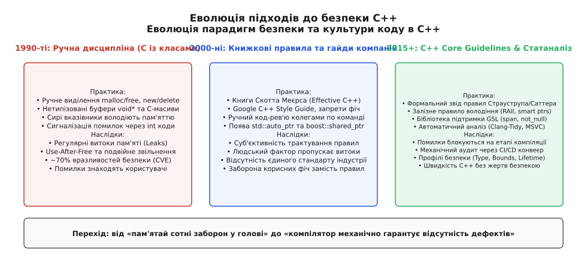
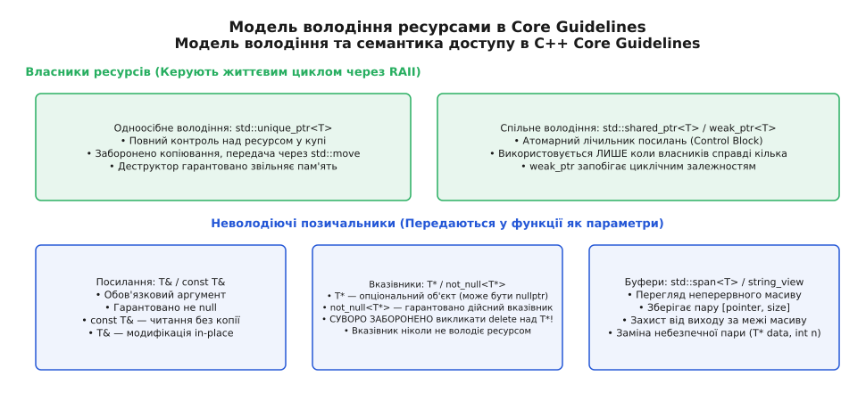
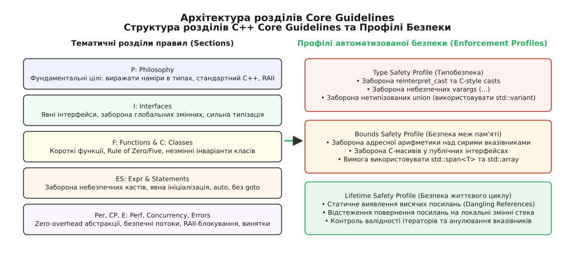
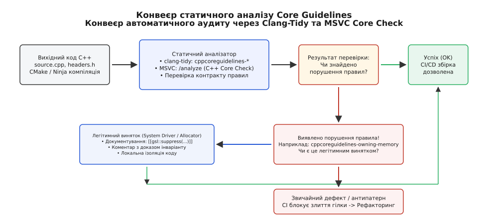

# Core Guidelines: узгоджені правила стилю й безпеки

<preknowlist>
- [Семантика володіння](topic:cpp-standards/ownership-semantics) — поняття ексклюзивного, спільного та тимчасового володіння ресурсами.
- [Правило п'яти й правило нуля](topic:cpp-standards/rule-of-five-zero) — керування спеціальними функціями-членами та життєвим циклом об'єкта.
- [unique_ptr: ексклюзивне володіння](topic:cpp-standards/unique-ptr) — RAII-обгортка над динамічною пам'яттю з нульовими накладними витратами.
- [GSL: підпірки Core Guidelines](topic:cpp-standards/gsl-support-library) — базові типи бібліотеки Guidelines Support Library (`span`, `not_null`, `owner`).
</preknowlist>

Коли високонавантажений мережевий сервіс аварійно завершує роботу під навантаженням через помилку сегментації (Segmentation Fault), розслідування системного дампу пам'яті зазвичай приводить до інтерфейсної функції з архаїчною сигнатурою на кшталт `int process_network_frame(char* buffer, int length, SessionContext* ctx)`. У такій точці входу сирий вказівник `char*` виконує водночас кілька несумісних ролей: передає адресу неперервного масиву байтів, використовується для зміщення пам'яті вказівниковою арифметикою та потенційно несе приховані зобов'язання щодо звільнення пам'яті. Ні розробник, ні компілятор не мають змоги з'ясувати з коду, чи може `ctx` містити нульову адресу `nullptr`, хто відповідає за виклик `delete buffer`, і чи зберігає буфер валідність після виходу з функції.

Понад 70% усіх критичних уразливостей безпеки (CVE) у кодових базах на C++ історично виникають не через дефекти самої мови, а через інерцію процедурних антипатернів 1990-х років. У ранніх стандартах C++ сирий вказівник `T*` застосовувався як універсальний інструмент для чотирьох принципово різних інженерних задач: адресації одиничного об'єкта, представлення буфера довільної довжини, передачі опціонального параметра та одноосібного володіння пам'яттю в купі.

Для подолання цієї системної невизначеності провідні архітектори мови створили **C++ Core Guidelines** (від англ. *core* — ядро, основа та *guidelines* — керівні принципи, настанови) — відкритий формалізований звід інженерних правил, спрямований на системний перехід від ненадійного ручного контролю ресурсів до автоматично верифікованої типобезпеки з нульовими накладними витратами під час виконання (zero-overhead principle).

---

## 1. Концептуальний зсув: від заборон до конструктивної безпеки

Ранні спроби стандартизувати культуру написання коду на C++ будувалися навколо заборони окремих механізмів мови. Корпоративні стандарти 2000-х років (наприклад, Google C++ Style Guide або військові регламенти JSF C++) часто забороняли використання винятків (`exceptions`), множинного успадкування чи динамічної типізації (RTTI), оскільки вони вважалися занадто складними для ручного контролю витоків пам'яті.

Такий підхід не усував корінь проблеми. Заборона сучасних виразних конструкцій змушувала розробників повертатися до мови «C з класами»: ручного виділення пам'яті через `malloc`/`free`, ручного каскадного очищення ресурсів через мітки `goto` та передачі нетипізованих структур даних через `void*`.

Детальний аналіз історичного розвитку цих підходів та передумов презентації маніфесту на CppCon 2015 розібрано у вставці [Від хаосу 1990-х до C++ Core Guidelines: історія подолання спадщини](topic:cpp-standards/core-guidelines/hist-guidelines-origin.md).


*Еволюція підходів до безпеки C++: від ручного контролю та корпоративних заборон до формальних правил і компіляторних перевірок.*

Фундаментальна ідея C++ Core Guidelines полягає у зміні вектору: замість звуження можливостей мови надати правила, які роблять написання правильного, безпечного та продуктивного коду простішим і природнішим, ніж написання коду з помилками.

Головні принципи цієї філософії формулюються так:
1. **Виражати наміри безпосередньо в типах**: Інваріанти програми мають фіксуватися на рівні компілятора (через типи, кваліфікатори `const`, `noexcept` та атрибути), а не ховатися в текстових коментарях.
2. **Нульові накладні витрати під час виконання**: Безпека досягається статичним аналізом і структурами даних без динамічного оверхеду, зберігаючи максимальну апаратну швидкодію.
3. **Механічна верифікованість**: Правило є чинним лише тоді, коли його дотримання може перевірити компілятор або статичний аналізатор без участі людини.

---

## 2. Залізне правило володіння ресурсами (Ownership Model)

Центральним ядром Core Guidelines є суворе розмежування понять **володіння** (ownership) та **спостереження** (observation) ресурсів.

Ресурс — це будь-яка сутність, яка захоплюється під час роботи програми та повинна бути гарантовано звільнена після завершення використання (динамічна пам'ять у купі, файловий дескриптор, системний сокет, м'ютекс або дескриптор потоку).

### Заборона володіння для сирих вказівників

> **Залізне правило володіння (правило R.3 та I.11):**  
> Сирий вказівник `T*` **ніколи** не повинен володіти ресурсом. Виклик оператора `delete` або функції `free()` над сирим вказівником `T*` є безумовним дефектом коду.

Якщо функція отримує або повертає сирий вказівник `T*`, це означає винятково неволодіючий доступ (позичання, або *borrowing*). Відповідальність за звільнення об'єкта завжди несе його безпосередній власник.


*Модель володіння пам'яттю: чітке розмежування власників (smart pointers) та неволодіючих позичальників (references, raw pointers, spans).*

### Класифікація семантики володіння

Сучасний C++ згідно з Core Guidelines визначає чітку градацію типів за їхнім відношенням до життєвого циклу об'єкта:

1. **Одноосібне володіння (`std::unique_ptr<T>`)**:
   Об'єкт має рівно одного власника. Пам'ять звільняється автоматично у деструкторі `std::unique_ptr`. Копіювання заборонено на рівні компілятора (`= delete`), передача володіння новому власнику здійснюється винятково через явне переміщення `std::move()`.
   На рівні згенерованого асемблерного коду `std::unique_ptr` зі стандартним видалячем (`std::default_delete<T>`) має нульовий розмірний оверхед (дорівнює розміру одного вказівника) і транслюється в інструкції, абсолютно ідентичні сирому вказівнику з ручним викликом `delete`.

2. **Спільне володіння (`std::shared_ptr<T>` та `std::weak_ptr<T>`)**:
   Застосовується лише тоді, коли об'єкт має кілька рівноправних власників у різних підсистемах, і момент його знищення неможливо визначити детерміновано заздалегідь. Керування життєвим циклом здійснюється через атомарний лічильник посилань (Control Block). `std::weak_ptr` використовується для запобігання циклічним посиланням, що блокують звільнення пам'яті.

3. **Обов'язкове спостереження (`T&` та `const T&`)**:
   Використовується, коли функція гарантовано потребує доступу до валідного об'єкта, який не може бути нульовим. `const T&` надає доступ для читання без копіювання, `T&` — для локальної модифікації за місцем.

4. **Опціональне спостереження (`T*` та `gsl::not_null<T*>`)**:
   Сирий вказівник `T*` застосовується лише тоді, коли аргумент є необов'язковим (може набувати значення `nullptr`). Якщо ж вказівник обов'язково повинен містити валідну адресу, його огортають у `gsl::not_null<T*>`, що переносить перевірку на `nullptr` на момент конструювання об'єкта.

5. **Перегляд неперервних послідовностей (`std::span<T>` та `std::string_view`)**:
   Замінює небезпечні пари «вказівник + розмір» (`T* data, size_t n`). Зберігає адресу початку та довжину буфера, гарантуючи контроль меж під час ітерації або індексації без виділення додаткової пам'яті.

### Правила передачі параметрів у функції

Розділи F (Functions) та I (Interfaces) формалізують ідіоматичний спосіб передачі аргументів:

| Намір передачі аргументу | Ідіоматичний тип у сигнатурі | Правило Core Guidelines |
| :--- | :--- | :--- |
| **Вхідний аргумент (простий скаляр: `int`, `double`)** | Передача за значенням: `void f(int x)` | F.16 (дешеве копіювання в регістрах) |
| **Вхідний аргумент (складний об'єкт: `std::string`, `std::vector`)** | Константне посилання: `void f(const Widget& w)` | F.16 (читання без копіювання) |
| **Модифікація об'єкта викликача (In-place update)** | Неконстантне посилання: `void f(Widget& w)` | F.17 (модифікація стану) |
| **Опціональний вхідний об'єкт** | Сирий вказівник: `void f(const Widget* w)` | I.12 / F.60 (може бути `nullptr`) |
| **Гарантовано ненульовий вказівник** | `void f(gsl::not_null<const Widget*> w)` | I.12 (статична перевірка валідності) |
| **Неперервний масив елементів для читання** | `void f(std::span<const int> data)` | I.13 (безпека меж без копіювання) |
| **Передача повного володіння новому власнику** | `void f(std::unique_ptr<Widget> w)` | F.15 / R.30 (приймає за значенням через `move`) |
| **Спільне співволодіння об'єктом** | `void f(std::shared_ptr<Widget> w)` | R.34 (збільшує лічильник посилань) |

Розглянемо практичне зіставлення застарілого процедурного підходу та сучасного ідіоматичного проєктування інтерфейсу:

:::tabs
```c
/* Традиційний C-підхід: амбівалентне володіння, небезпечні масиви, коди помилок */
#include <stdio.h>
#include <stdlib.h>
#include <string.h>

typedef struct {
    char* name;
    double* readings;
    int readings_count;
} SensorData;

SensorData* create_sensor(const char* name, const double* initial_data, int count) {
    if (!name || count < 0) return NULL;

    SensorData* s = (SensorData*)malloc(sizeof(SensorData));
    if (!s) return NULL;

    s->name = (char*)malloc(strlen(name) + 1);
    strcpy(s->name, name);

    if (count > 0 && initial_data) {
        s->readings = (double*)malloc(sizeof(double) * count);
        memcpy(s->readings, initial_data, sizeof(double) * count);
        s->readings_count = count;
    } else {
        s->readings = NULL;
        s->readings_count = 0;
    }
    return s;
}

void destroy_sensor(SensorData* s) {
    if (!s) return;
    free(s->name);
    free(s->readings);
    free(s);
}
```
```cpp
// Сучасний C++ за правилами Core Guidelines: повна типобезпека, RAII та відсутність витоків
#include <string>
#include <vector>
#include <span>
#include <memory>
#include <string_view>

class SensorData {
public:
    // I.13: std::span захищає від виходу за межі масиву без додаткового виділення пам'яті
    // F.16: std::string_view передає рядок без зайвих копіювань
    SensorData(std::string_view name, std::span<const double> initial_data)
        : name_(name), readings_(initial_data.begin(), initial_data.end()) {}

    // C.21 / C.67: Правило нуля — компілятор автоматично генерує коректний деструктор,
    // конструктори переміщення та копіювання без ручного керування пам'яттю
    ~SensorData() = default;
    SensorData(const SensorData&) = default;
    SensorData& operator=(const SensorData&) = default;
    SensorData(SensorData&&) noexcept = default;
    SensorData& operator=(SensorData&&) noexcept = default;

    [[nodiscard]] std::string_view name() const noexcept { return name_; }
    [[nodiscard]] std::span<const double> readings() const noexcept { return readings_; }

private:
    std::string name_;
    std::vector<double> readings_;
};

// R.30: Фабрична функція повертає об'єкт через std::unique_ptr, явно фіксуючи передачу володіння
[[nodiscard]] std::unique_ptr<SensorData> make_sensor(
    std::string_view name, 
    std::span<const double> initial_data) 
{
    return std::make_unique<SensorData>(name, initial_data);
}
```
:::

---

## 3. Анатомія розділів Core Guidelines

C++ Core Guidelines структуровані у тематичні розділи, кожен із яких охоплює конкретний рівень проєктування програмної системи — від базової філософії до обробки виняткових ситуацій.


*Структура розділів Core Guidelines: ієрархія від філософських принципів до автоматизованих профілів безпеки.*

### Розділ P: Philosophy (Фундаментальна філософія)
Визначає цілі та спосіб мислення розробника сучасного C++:
- **P.1 (Express ideas directly in code)**: Наміри розробника мають виражатися в синтаксичних конструкціях мови. Якщо функція не змінює стан об'єкта, вона зобов'язана бути `const`. Якщо обчислення можливе на етапі компіляції, слід використовувати `constexpr`.
- **P.2 (Write in ISO Standard C++)**: Код має відповідати чинному міжнародному стандарту без використання нестандартних діалектних розширень компіляторів.
- **P.3 (Express intent)**: Замість низькорівневих циклів з індексами `for (size_t i = 0; ...)` слід використовувати алгоритми стандартної бібліотеки (`std::ranges`, `std::find_if`, range-based `for`).
- **P.4 (Ideally, a program should be statically type safe)**: Будь-які небезпечні операції, що вимикають перевірки компілятора, заборонені.
- **P.8 (Don't leak any resources)**: Використання ідіоми RAII (Resource Acquisition Is Initialization) для будь-якого непостійного ресурсу.
- **P.10 (Prefer immutable data to mutable data)**: Незмінні дані (immutable) усувають приховані побічні ефекти та гарантують потокобезпечність без блокувань.

### Розділ I: Interfaces (Інтерфейси та контракти)
Формулює правила проєктування меж між функціональними модулями:
- **I.1 (Make interfaces explicit)**: Заборона прихованих залежностей. Усі дані, необхідні функції для виконання задачі, повинні передаватися через явні параметри.
- **I.2 (Avoid non-const global variables)**: Глобальні змінні створюють неконтрольовані побічні ефекти та гонитви за даними в багатопотокових середовищах.
- **I.3 (Avoid singletons)**: Патерн Singleton розглядається як замаскована глобальна змінна, яка блокує модульне тестування та ускладнює керування життєвим циклом.
- **I.4 (Make interfaces strongly typed)**: Заборона використання загальних типів `void*`, сирих цілих чисел `int` для позначення фізичних величин або ідентифікаторів. Рекомендується створення строгих типів-обгорток (Strong Types):
  ```cpp
  // Погано: легко переплутати порядок аргументів однакового типу
  void set_viewport(double width, double height);

  // Добре: сильна типізація унеможливлює помилку на етапі компіляції
  struct Width { double val; };
  struct Height { double val; };
  void set_viewport(Width w, Height h);
  ```
- **I.5-I.8 (Contract Programming: Preconditions and Postconditions)**: Контрактне проектування інтерфейсів. Функція явно оголошує передумови (`gsl::Expects`) та післяумови (`gsl::Ensures`). Якщо викликач порушує передумову (наприклад, передає від'ємний радіус кола), виконання негайно переривається, не допускаючи поширення зіпсованого стану:
  ```cpp
  double calculate_circle_area(double radius) {
      gsl::Expects(radius >= 0.0); // Передумова: радіус не може бути від'ємним
      double area = 3.141592653589793 * radius * radius;
      gsl::Ensures(area >= 0.0);   // Післяумова: площа завжди невід'ємна
      return area;
  }
  ```
- **I.25 (Prefer empty abstract classes as interfaces)**: Поліморфні інтерфейси повинні складатися винятково з суто віртуальних функцій (`= 0`) і віртуального деструктора, не містячи полів даних.

### Розділ F: Functions (Функції)
Регламентує внутрішню будову та сигнатури функцій:
- **F.2 (A function should perform a single logical operation)**: Функція повинна виконувати рівно одну логічну задачу, мати мінімальний розмір і поміщатися в межі одного екрана.
- **F.8 (Prefer pure functions)**: Чисті функції, результат яких залежить винятково від переданих аргументів і які не змінюють глобальний стан, є пріоритетними, оскільки вони тривіально паралеляться та тестуються.
- **F.20 (For "out" output values, prefer returning them as return values)**: Заборона вихідних параметрів через неконстантні вказівники або посилання `void get_data(Result* out)`. Функції повинні повертати результат за значенням `Result get_data()`, покладаючись на оптимізацію повернення значень (RVO) та семантику переміщення. Для повернення кількох значень застосовують кортежі або структури зі структурованим зв'язуванням (Structured Bindings):
  ```cpp
  struct QueryResult {
      std::string text;
      double execution_time_ms;
  };
  
  [[nodiscard]] QueryResult execute_query(std::string_view sql);
  
  // Клієнтський код розпаковує результат чисто і наочно
  auto [text, duration] = execute_query("SELECT * FROM telemetry");
  ```
- **F.52 (Prefer capturing by reference in local lambdas, by value in async)**: Локальні лямбда-вирази для алгоритмів STL захоплюють змінні за посиланням `[&]`, а асинхронні задачі для інших потоків зобов'язані захоплювати стан за значенням `[=]`, унеможливлюючи висячі посилання на стек.

### Розділ C: Classes and Class Hierarchies (Класи та ієрархії)
Визначає правила об'єктного моделювання:
- **C.1 (Organize related data into structures)**: Використовуйте `struct`, якщо члени даних можуть змінюватися незалежно і структура не має прихованих внутрішніх інваріантів. Використовуйте `class`, якщо тип має інваріант, що підтримується через закриті поля (`private`) та відкриті методи.
- **C.21 / C.67 (The Rule of Zero / Five)**: Якщо клас інкапсулює низькорівневий ресурс і вимагає власного деструктора, конструктора копіювання чи переміщення, він повинен явно визначати або видаляти всі п'ять спеціальних функцій-членів. Для решти класів діє Правило нуля — полями мають бути готові RAII-типи, а спеціальні методи генеруються компілятором автоматично.
- **C.41 (A constructor should create a fully initialized, valid object)**: Заборона створення «напівініціалізованих» об'єктів, які потребують виклику додаткових методів на кшталт `init()`. Конструктор зобов'язаний повністю сформувати валідний інваріант або кинути виняток у разі помилки.
- **C.46 (By default, declare single-argument constructors explicit)**: Одноаргументні конструктори повинні позначатися ключовим словом `explicit`, запобігаючи неявним прихованим приведенням типів при передачі аргументів.
- **C.82 (Don't call virtual functions in constructors and destructors)**: Заборона викликів віртуальних функцій у конструкторах і деструкторах. Під час роботи конструктора базового класу таблиця віртуальних методів (vtable) вказує на реалізацію базового класу, оскільки похідний клас ще не сконструйований. Поліморфний виклик не дійде до перевизначеного методу похідного класу, що створює важковловимі логічні баги.
- **C.83 (For value-like types, consider noexcept move operations)**: Операції переміщення (Move Constructor / Move Assignment) для типів зі семантикою значень повинні маркуватися кваліфікатором `noexcept`. Це дозволяє стандартним контейнерам (`std::vector`) використовувати швидке переміщення замість повільного копіювання при зміні ємності буфера.

### Розділ ES: Expressions and Statements (Вирази та оператори)
Встановлює правила гігієни локального коду:
- **ES.20 (Always initialize an object)**: Заборона оголошення неініціалізованих змінних. Кожна змінна повинна одразу отримувати коректне початкове значення.
- **ES.23 (Prefer the {}-initializer syntax)**: Використання уніфікованої ініціалізації у фігурних дужках захищає від небажаного звуження типів (narrowing conversions):
  ```cpp
  int a = 7.9;    // Скомпільовано мовчки: a = 7 (втрата дробової частини)
  int b{7.9};     // Помилка компіляції: звуження типу заборонено!
  ```
- **ES.48 (Avoid casts)**: Уникнення явного приведення типів. Заборона C-style casts `(int)x` на користь строго типізованих `static_cast` або `dynamic_cast`.
- **ES.63 (Avoid comma operator in expressions)**: Заборона оператора «кома» у складених виразах, оскільки він погіршує читабельність і приховує порядок обчислення підвиразів.
- **ES.76 (Avoid goto)**: Повна заборона безумовного переходу `goto`. Очищення ресурсів покладається на деструктори об'єктів.
- **ES.100 (Don't use varargs)**: Повна заборона еліпсисів `...` мови C. Будь-які функції зі змінною кількістю аргументів мають реалізовуватися через варіативні шаблони (Variadic Templates) або пакети параметрів C++20 `std::format`.
- **ES.102 (Use signed types for arithmetic, unsigned for bit manipulation)**: Беззнакові типи (`unsigned int`, `uint32_t`) повинні застосовуватися для бітових прапорців і бітових масок, а не просто для невід'ємних величин. Використання `unsigned` в арифметиці часто призводить до катастрофічного переповнення при відніманні (`0u - 1u == 4294967295u`), що ламає перевірки меж циклів.

### Розділи Per, CP, E, T: Performance, Concurrency, Errors, Templates
- **Per.1 (Don't optimize without reason)**: Заборона передчасної оптимізації, яка погіршує читабельність та структуру коду.
- **Per.19 (Access memory predictably)**: Розміщення гарячих даних у неперервних блоках пам'яті (`std::vector`) для максимальної утилізації кешу процесора (L1/L2 data cache).
- **CP.1 (Assume multi-threaded execution)**: При проєктуванні бібліотечних компонентів слід за замовчуванням враховувати можливість одночасного доступу з різних потоків.
- **CP.20 (Use RAII, never plain lock()/unlock())**: Заборона ручного захоплення примітивів синхронізації. Використання `std::scoped_lock` для атомарного захоплення кількох м'ютексів без ризику дедлоків (Lock Inversion).
- **CP.21 (Use std::lock() or std::scoped_lock to acquire multiple mutexes)**: Одночасне захоплення кількох м'ютексів у довільному порядку призводить до класичного взаємного блокування (ABBA Deadlock). `std::scoped_lock` реалізує алгоритм запобігання дедлокам без ризику блокування потоку.
- **E.2 (Throw an exception to signal that a function can't perform its task)**: Винятки використовуються для обробки аварійних ситуацій, які функція не може вирішити локально, зберігаючи цілісність інваріантів системи.
- **E.6 (Use RAII to prevent leaks on exception unwinding)**: Гарантія того, що розгортання стека (stack unwinding) при виникненні винятку не призведе до витоку ресурсів.
- **E.14 (Use purpose-designed types for expected failures)**: Якщо помилка є нормальною та частою частиною логіки програми (наприклад, валідація введених користувачем даних або парсинг мережевого пакета), слід використовувати `std::expected<T, E>` (C++23) або `std::optional<T>`, уникаючи накладних витрат на генерацію винятків.
- **T.10 (Specify concepts for all template arguments)**: Замість неконтрольованої підстановки `typename T` із застарілим SFINAE слід явно обмежувати шаблони концептами C++20 (`std::integral`, `std::ranges::range`), забезпечуючи миттєві та зрозумілі діагностичні повідомлення компілятора при помилках типізації.
- **Enum.3 (Prefer class enums over "plain" enums)**: Використання типізованих перечислень зі скоупом (`enum class`) усуває конфлікти імен у просторах назв та унеможливлює неявне небезпечне приведення елементів до цілих чисел.

---

## 4. Профілі безпеки (Safety Profiles)

Одним із найважливіших внесків Core Guidelines у мову C++ стала розробка математично суворих **Профілів безпеки (Safety Profiles)**. Профіль — це набір правил статичного аналізу, виконання яких гарантує повне усунення певного класу дефектів у межах модуля або всієї програми.

### 1. Профіль типобезпеки (Type Safety Profile)
Гарантує, що жодна комірка пам'яті не буде використана всупереч її справжньому типу:
- Забороняє небезпечне бінарне перетворення `reinterpret_cast`. Пряме приведення вказівників між несумісними типами ламає правило суворого псевдонімування (Strict Aliasing Rule), що змушує оптимізатор компілятора генерувати некоректний бінарний код із перестановкою операцій читання і запису.
- Для безпечної реінтерпретації бітових представлень вимагається використання `std::bit_cast` (C++20), який виконує побітове копіювання на етапі компіляції без порушення аліасингу.
- Забороняє C-стиль приведення `(T)value`.
- Забороняє прямий доступ до нетипізованих об'єднань `union` без використання безпечних дискримінованих об'єднань `std::variant`.
- Забороняє функції з невизначеною кількістю аргументів мови C (`varargs`, `<cstdarg>`).

### 2. Профіль безпеки меж (Bounds Safety Profile)
Гарантує неможливість читання або запису даних за межами виділеного буфера:
- Забороняє адресну арифметику над сирими вказівниками (`ptr++`, `ptr + i`).
- Забороняє використання сирих фіксованих C-масивів `int arr[100]` у публічних інтерфейсах.
- Вимагає передачі масивів через безпечні зрізи пам'яті `std::span<T>` або стандартні контейнери `std::array` / `std::vector`.
- Статично валідує константні індекси масивів під час компіляції.

### 3. Профіль безпеки життєвого циклу (Lifetime Safety Profile)
Запобігає виникненню найнебезпечніших дефектів пам'яті — висячих вказівників (dangling pointers) та використання ресурсів після звільнення (use-after-free):
- Відстежує життєвий цикл кожного об'єкта, посилання та ітератора через побудову графа потоку даних (data-flow graph) та аналіз множин походження (Origin Sets).
- Статично забороняє повернення посилань або вказівників на локальні змінні стека з функцій.
- Ловить класичну пастку тимчасових рядків:
  ```cpp
  // Помилка: тимчасовий std::string знищується наприкінці виразу,
  // залишаючи string_view висячим вказівником у пам'ять стека!
  std::string_view sv = (std::string("hello ") + "world"); 
  ```
- Контролює валідність ітераторів після виклику операцій над контейнерами, що можуть призвести до релокації буфера (наприклад, `vector.push_back()`).

---

## 5. Вплив на двійкову структуру та оптимізацію компілятора (ABI)

Дотримання правил Core Guidelines впливає не лише на безпеку сирцевого коду, але й на ефективність згенерованого двійкового файлу (ABI — Application Binary Interface).

Розглянемо випадок передачі об'єктів за значенням:
1. **Клас за Правилом нуля**: Тип, що складається зі скалярних полів або простих структур і не має власноруч написаного деструктора, класифікується платформенним ABI (наприклад, System V AMD64 ABI у Linux) як **тривіально переміщуваний та копійований** (trivially copyable). Компілятор передає екземпляри такого типу безпосередньо у регістрах процесора (`%rdi`, `%rsi`, `%rdx`), оминаючи повільне виділення стек-фрейму.
2. **Клас з архаїчним ручним деструктором**: Щойно розробник додає порожній або ручний деструктор `~MyClass() {}` для ручного логування чи виклику `free()`, тип втрачає статус тривіального. Згідно з вимогами стандарту ABI компілятор змушений передавати об'єкт винятково через пам'ять стека за непрямим посиланням, що збільшує кількість звернень до кешу пам'яті та сповільнює виклики функцій.

Таким чином, сучасний C++ за правилами Core Guidelines виявляється швидшим за застарілий C-стиль, оскільки надає оптимізатору компілятора повну семантичну інформацію про життєвий цикл даних.

---

## 6. Інтеграція з C-бібліотеками через безпечні RAII-обгортки

Сучасні проєкти на C++ не існують у вакуумі: вони постійно взаємодіють із системними C-бібліотеками операційної системи (OpenSSL, libcurl, SQLite, POSIX sockets, Win32 API). Ці бібліотеки повертають непрозорі сирі вказівники та вимагають явного виклику парних функцій деініціалізації (`SSL_free`, `curl_easy_cleanup`, `sqlite3_close`, `close`).

Core Guidelines вимагають негайного обертання таких C-ресурсів у типи з автоматичним керуванням за допомогою `std::unique_ptr` із кастомним видалячем (Custom Deleter) без створення додаткових класів:

```cpp
#include <memory>
#include <cstdio>

// Спеціальний функтор-видаляч для файлового дескриптора C
struct FileCloser {
    void operator()(std::FILE* fp) const noexcept {
        if (fp) {
            std::fclose(fp);
        }
    }
};

// Зручний аліас типу безпечного файлового дескриптора
using UniqueFile = std::unique_ptr<std::FILE, FileCloser>;

[[nodiscard]] UniqueFile open_secure_config(const char* path) {
    std::FILE* raw_file = std::fopen(path, "re");
    // Негайно передаємо володіння розумному вказівнику:
    // деструктор гарантовано викличе std::fclose при будь-якому виході або винятку
    return UniqueFile(raw_file);
}
```

Для локального автоматичного очищення ресурсів у процедурних блоках застосовується тип `gsl::finally`, який гарантує виконання лямбда-виразу при виході зі скоупу:

```cpp
void perform_transaction() {
    begin_transaction();
    auto cleanup = gsl::finally([]() noexcept {
        rollback_if_active();
    });

    // Логіка транзакції...
    commit_transaction();
}
```

Такий підхід забезпечує нульовий розмірний оверхед і повну безпеку щодо винятків (Exception Safety) під час взаємодії з будь-яким спадковим кодом.

---

## 7. Інструментальна автоматизація та конвеєр перевірок

Правила Core Guidelines не розраховані на суб'єктивну людську перевірку. Інженерні команди впроваджують їх у щоденну практику через системи статичного аналізу, які переривають збірку коду за наявності найменшого відхилення.


*Конвеєр автоматичного аудиту: від локального статичного аналізу до документування легітимних винятків через анотації.*

Головними інструментами автоматизації виступають:

1. **LLVM `clang-tidy` (модуль `cppcoreguidelines-*`)**:
   Кросплатформний лінтер, який аналізує синтаксичне дерево Clang AST. Містить понад 30 спеціалізованих чекерів, які інтегруються у CMake, VS Code, CLion та конвеєри CI/CD.
2. **Microsoft Visual C++ Core Check (`/analyze`)**:
   Вбудований у компілятор MSVC рушій глибокого семантичного аналізу, що підтримує розширений міжфункціональний аналіз життєвого циклу об'єктів.

Детальний покроковий посібник із налаштування конфігурації `.clang-tidy`, автоматичного виправлення дефектів та побудови перевірок у GitHub Actions наведено у вставці [Налаштування автоматичного аудиту коду через Clang-Tidy та CMake](topic:cpp-standards/core-guidelines/proj-linter-pipeline.md).

---

## 8. Ієрархія та легітимні винятки: коли правило можна порушити

У системному програмуванні існують об'єктивні ситуації, де прямий низькорівневий доступ до адресного простору є технічно неминучим:
- Написання кастомних алокаторів пам'яті (Memory Pools, Slab Allocators).
- Реалізація низькорівневих Lock-Free структур даних та примітивів атомарної синхронізації.
- Взаємодія з системними C-інтерфейсами операційної системи (POSIX syscalls, Win32 API).
- Програмування драйверів пристроїв і прямий доступ до пам'яті регістрів апаратури (MMIO).

Core Guidelines не вимагають неможливого, проте встановлюють сувору дисципліну ізоляції винятків:

1. **Принцип інкапсуляції**: Низькорівневий небезпечний код повинен бути ізольований усередині окремого вузького класу чи функції. Назовні модуль зобов'язаний експортувати винятково безпечний, типізований інтерфейс.
2. **Явне документування винятку**: Будь-яке придушення попередження статичного аналізатора має супроводжуватися точним коментарем із доведенням збереження інваріантів безпеки.

Для фіксації винятків застосовуються спеціальні конструкції:

```cpp
#include <cstddef>
#include <new>

// Приклад: низькорівневий системний алокатор пам'яті
class SystemMemoryArena {
public:
    [[nodiscard]] void* allocate_aligned(std::size_t bytes, std::size_t alignment) {
        // Документоване придушення для лінтера Clang-Tidy
        // NOLINTNEXTLINE(cppcoreguidelines-owning-memory): Арена керує пулом самостійно
        void* raw_memory = ::operator new(bytes, std::align_val_t{alignment});
        return raw_memory;
    }

    void deallocate(void* ptr) noexcept {
        // MSVC C++ Core Check анотація
        [[gsl::suppress("cppcoreguidelines-owning-memory", 
          justification = "Звільнення сирого блоку пам'яті внутрішньої арени")]]
        ::operator delete(ptr);
    }
};
```

---

## 9. Нова інженерна парадигма C++

Перехід до C++ Core Guidelines означає не просто оновлення правил оформлення коду, а фундаментальну зміну ментальної моделі розробника. На відміну від мов із динамічним збирачем сміття (Garbage Collection), де безпека досягається за рахунок непередбачуваних пауз виконання та значного оверхеду пам'яті, або мов із жорстким синтаксичним обмеженням аліасингу (як-от механізм borrow checker у Rust), сучасний C++ пропонує унікальну модель:

1. **Повна виразна свобода**: Мова дозволяє будувати складні графові структури даних із нециклічним або спільним володінням через `std::unique_ptr` та `std::shared_ptr`.
2. **Нульова ціна абстракцій**: Компілятор за допомогою оптимізацій RVO, інлайнінгу та перенесення типів у регістри процесора генерує такий самий швидкий двійковий код, як і при ручному асемблерному програмуванні.
3. **Механічна гарантія відсутності дефектів**: Статичні аналізатори усувають людський фактор під час перевірок, перетворюючи компіляцію на строгий процес математичного аудиту інваріантів системи.

> 🔧 **Навіщо це в реальній розробці.**  
> Дотримання C++ Core Guidelines перетворює кодову базу з «мінної смуги» прихованих витоків пам'яті на математично надійну архітектуру. Інженери звільняються від постійного стресу ручного відстеження адресних помилок і зосереджуються на бізнес-логіці, довіряючи захист компілятору. Проєкти, побудовані за цими принципами, безболісно масштабуються на сотні розробників, зберігаючи легендарну швидкодію C++ без компромісів у надійності.
