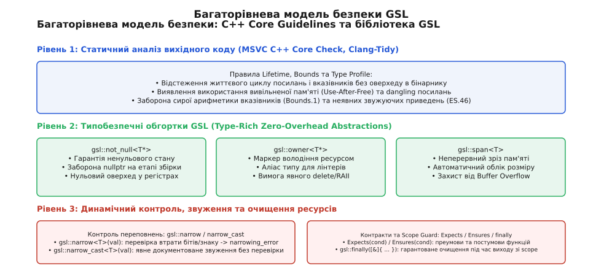
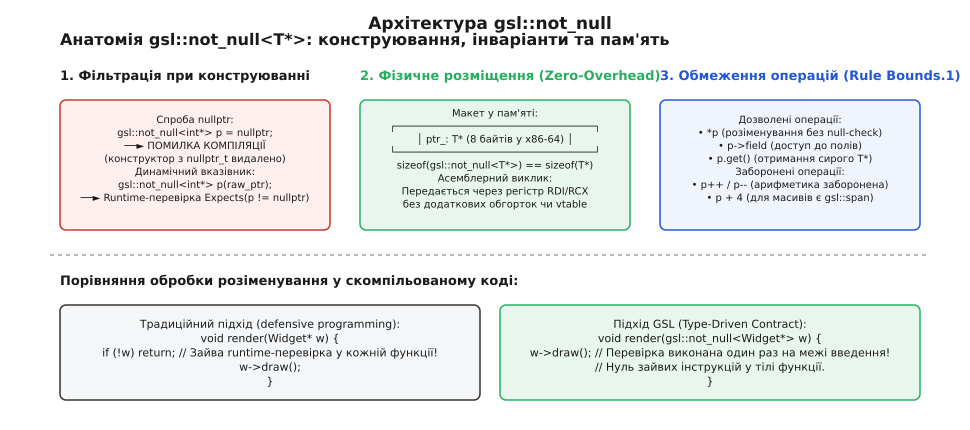
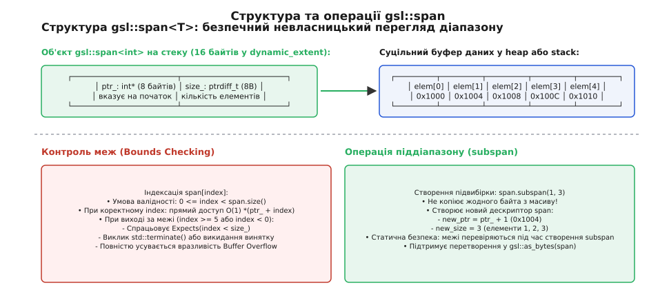
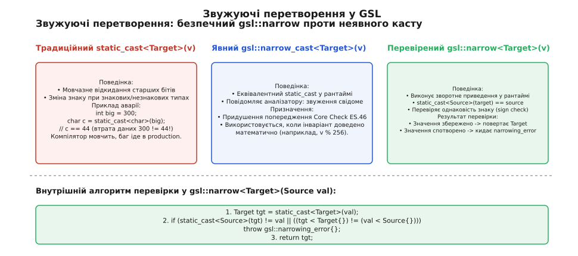

# GSL: not_null, owner і решта підпірок Core Guidelines

<preknowlist>
- [Семантика володіння](topic:cpp-standards/ownership-semantics) — розмежування ексклюзивного, спільного та тимчасового володіння ресурсами.
- [Core Guidelines: правила стилю й безпеки](topic:cpp-standards/core-guidelines) — філософія механічної верифікації правил безпеки C++.
- [unique_ptr: ексклюзивне володіння](topic:cpp-standards/unique-ptr) — RAII-обгортка над динамічною пам'яттю з нульовими накладними витратами.
- [Оператори приведення типів](topic:cpp-standards/cast-operators) — семантика static_cast, reinterpret_cast та const_cast.
</preknowlist>

Коли системна бібліотека оброблення мережевих пакетів або драйвер периферійного пристрою отримує керування через функцію з сигнатурою `int process_stream(int* channel_id, uint8_t* buffer, int length, void* callback_state)`, компілятор мови C++ позбавлений будь-якої семантичної інформації про наміри автора коду. Параметр `int* channel_id` може вимагати обов'язкового ненульового об'єкта або допускати передачу нульової адреси `nullptr` як ознаки відсутності каналу. Параметр `uint8_t* buffer` може вказувати на одиночний байт або бути початком масиву довжиною `length`, межі якого ніяк не контролюються апаратно. Параметр `callback_state` може бути як неволодіючим контекстом виклику, так і виділеним у купі об'єктом, який функція зобов'язана вивільнити через `delete` або `free()`.

Ця фундаментальна неоднозначність призводить до двох крайніх інженерних дефектів. З одного боку, розробники починають писати надлишковий захисний код (англ. *defensive programming*), вставляючи десятки перевірок `if (p == nullptr)` всередині внутрішніх функцій, де покажчик фізично не може бути нульовим, що засмічує логіку й погіршує роботу передбачувача переходів (англ. *branch predictor*) процесора. З іншого боку, випадковий пропуск перевірки на межі модуля або помилка у зміщенні покажчика на кілька байтів спричиняє читання за межами пам'яті (англ. *buffer overflow*), розіменування нульової адреси (англ. *null pointer dereference*) або витік пам'яті (англ. *memory leak*).

Для розв'язання цієї проблеми в межах ініціативи C++ Core Guidelines було створено **Guidelines Support Library (GSL)** (від англ. *guidelines* — настанови, керівні принципи, *support* — підтримка та *library* — бібліотека; латинське *liber* — книга) — компактну бібліотеку фундаментальних типів, концептів та функціональних адаптерів. Мета GSL полягає в тому, щоб перенести неформальні інженерні домовленості, приховані у коментарях або документації, безпосередньо у систему статичних типів мови C++, забезпечивши строгу верифікацію коду компілятором і статичними аналізаторами без додаткових накладних витрат у згенерованому машинному коді (англ. *zero-overhead abstractions*).

Повний шлях формування концепції GSL від презентації маніфесту на конференції CppCon 2015 до прийняття ключових компонентів у міжнародні стандарти ISO C++ викладено у вставці [Еволюція Guidelines Support Library: від маніфесту CppCon 2015 до стандартів ISO](topic:cpp-standards/gsl-support-library/hist-gsl-evolution.md).


*Багаторівнева модель безпеки: поєднання статичного аналізу вихідного коду, типобезпечних абстракцій GSL та детермінованого динамічного контролю.*

---

## 1. Анатомія ненульових контрактів: gsl::not_null

Класичний сирий вказівник `T*` у мові C++ за замовчуванням є нульованим (англ. *nullable*). Він може приймати спеціальне значення `nullptr` (числове значення нуль), яке позначає відсутність об'єкта. Однак у реальних програмах понад 80% функцій проєктуються з розрахунком на те, що переданий покажчик обов'язково адресує валідний живий екземпляр у пам'яті.

Коли контракт ненульовості не виражений у типі параметра, розробники змушені або сліпо довіряти клієнтському коду, ризикуючи отримати аварійне завершення процесу сигналом `SIGSEGV` при спробі розіменування, або нагромаджувати перевірки в кожному виклику:

:::tabs
```c
#include <stdio.h>
#include <stdlib.h>

typedef struct {
    int id;
    double scale;
} TransformConfig;

/* Захисне C-програмування: перевірка на null у кожній функції */
void apply_transform_c(const TransformConfig* cfg, double* value) {
    if (cfg == NULL || value == NULL) {
        return; /* Прихований збій або дублювання перевірок */
    }
    *value = (*value) * cfg->scale;
}
```
```cpp
#include <iostream>
#include <gsl/gsl>

struct TransformConfig {
    int id;
    double scale;
};

// Контракт виражено в системі типів: p не може бути nullptr
void apply_transform_cpp(gsl::not_null<const TransformConfig*> cfg, 
                         gsl::not_null<double*> value) noexcept {
    // Жодних перевірок у тілі: гарантовано валідні адреси на рівні компілятора
    *value = (*value) * cfg->scale;
}
```
:::

Шаблонний клас `gsl::not_null<T>` інкапсулює довільний вказівникоподібний тип (сирий покажчик `U*`, розумний вказівник `std::unique_ptr<U>` або `std::shared_ptr<U>`) і підтримує незмінний інваріант: внутрішня адреса ніколи не дорівнює `nullptr`.

### Механізм конструювання та статичної фільтрації

Клас `gsl::not_null<T>` реалізує суворий контроль на етапі компіляції та виконання:

1. **Заборона конструювання з нульових літералів**: Перевантаження конструктора та оператора присвоєння від типу `std::nullptr_t` позначені специфікатором `= delete`. Спроба передати `nullptr`, макрос `NULL` або числовий нуль `0` у функцію, що приймає `gsl::not_null<T>`, викликає помилку компіляції:
   ```cpp
   gsl::not_null<int*> p1 = nullptr; // ПОМИЛКА КОМПІЛЯЦІЇ: use of deleted function
   ```
2. **Динамічна перевірка під час конструювання з сирого покажчика**: При передачі динамічної змінної `T raw_ptr` конструктор виконує контрактну верифікацію `Expects(raw_ptr != nullptr)`. Якщо змінна містить нуль, негайно спрацьовує обробник порушення контрактів, запобігаючи проникненню невалідного стану вглиб архітектури програми.
3. **Заборона адресної арифметики**: В операторному інтерфейсі `gsl::not_null` видалено оператори інкременту (`++`), декременту (`--`), зміщення (`+=`, `-=`) та індексації (`[]`). Це прямо відповідає правилу Core Guidelines Bounds.1: покажчик на одиночний об'єкт не повинен брати участь в адресній арифметиці. Для масивів слід застосовувати діапазонні типи.


*Анатомія gsl::not_null: статична фільтрація нульових констант, динамічний контроль та пряма трансляція в машинний код.*

### Внутрішня реалізація та сумісність зі смарт-поінтерами

Шаблон `not_null<T>` не обмежується сирими покажчиками. Завдяки використанню `std::pointer_traits<T>` та допоміжних метафункцій виявлення типу вказівника, `not_null` бездоганно огортає `std::unique_ptr<T>` та `std::shared_ptr<T>`:

```cpp
// Гарантія володіння унікальним екземпляром без можливості порожнього стану
std::unique_ptr<Widget> raw_widget = std::make_unique<Widget>();
gsl::not_null<std::unique_ptr<Widget>> widget = std::move(raw_widget);

// widget гарантовано володіє живим об'єктом протягом усього часу існування
widget->render();
```

При переміщенні `not_null<std::unique_ptr<T>>` система типів гарантує, що цільовий об'єкт отримує валідний покажчик. Якщо розробник спробує перемістити володіння назовні, вихідний об'єкт переходить у стан після переміщення (moved-from), і статичний аналізатор MSVC або Clang видасть попередження про небезпеку повторного використання спустошеного об'єкта (Use-After-Move).

### Різновид gsl::strict_not_null

У стандартному класі `gsl::not_null<T>` оператор неявного перетворення до базового покажчика `operator T()` оголошено неявним для забезпечення максимальної сумісності з наявними бібліотеками. Проте в архітектурних шарах із критичними вимогами до безпеки таке неявне приведення створює ризик випадкового передавання об'єкта назад у застарілий C-код, де захисний інваріант може бути втрачено.

Для таких сценаріїв бібліотека GSL надає спеціалізацію `gsl::strict_not_null<T>`. У ній оператор неявного приведення видалено або оголошено як `explicit`. Для отримання сирого покажчика розробник зобов'язаний викликати метод `.get()`, що робить кожне перетинання межі безпеки абсолютно явним та видимим під час аудиту коду.

### Використання в контейнерах

Розміщення звичайних посилань C++ (`T&`) у стандартних контейнерах STL (`std::vector<T&>`) заборонено стандартом мови, оскільки посилання не є об'єктами, що підтримують присвоєння (англ. *assignable*). Історично розробники використовували або сирі покажчики `std::vector<T*>`, ризикуючи отримати `nullptr` серед елементів, або важку обгортку `std::reference_wrapper<T>`.

Клас `gsl::not_null<T*>` є повноцінним об'єктом, який підтримує копіювання, переміщення та присвоєння. Вектор `std::vector<gsl::not_null<Widget*>>` гарантує відсутність нульових дірок у списку елементів із абсолютно нульовим оверхедом пам'яті, що критично важливо для графічних сцен, списків підписників у патерні Observer та черг завдань.

### Фізичне розташування в пам'яті та асемблерна ефективність

З точки зору двійкового представлення (ABI), клас `gsl::not_null<T*>` містить рівно одне приватне поле типу `T*`. Розмір об'єкта `sizeof(gsl::not_null<T*>)` суворо дорівнює `sizeof(T*)` (8 байтів на 64-бітних архітектурах x86-64 та AArch64).

При передачі параметра `gsl::not_null<T*>` у функцію компілятор розміщує значення безпосередньо у стандартному апаратному регістрі виклику (регістри `RDI`, `RSI`, `RDX` в ABI System V AMD64 або `RCX`, `RDX` в ABI Microsoft x64). Операція розіменування `*p` транслюється в пряму інструкцію доступу до пам'яті процесора:

```nasm
; Асемблерний код функції apply_transform_cpp на архітектурі x86-64:
; RDI містить cfg (not_null<const TransformConfig*>), RSI містить value (not_null<double*>)
movsd   xmm0, QWORD PTR [rsi]        ; Завантаження *value з адреси RSI
mulsd   xmm0, QWORD PTR [rdi + 8]    ; Множення на cfg->scale (зсув 8 байтів)
movsd   QWORD PTR [rsi], xmm0        ; Збереження результату назад у *value
ret                                  ; Повернення без жодних розгалужень
```

Сучасні компілятори GCC, Clang та MSVC транслюють контракт ненульовості в метадані внутрішнього представлення (LLVM IR `nonnull` attribute). Це дозволяє оптимізатору повністю елімінувати мертві перевірки (Dead Code Elimination) у всьому подальшому коді трансляційної одиниці.

> 🔧 **Навіщо це.**  
> Застосовуйте `gsl::not_null<T*>` для всіх параметрів функцій і полів структур, де відсутність об'єкта не передбачена логікою програми. Це усуває потребу в повторних захисних перевірках `if (!ptr)`, спрощує граф потоку керування та дозволяє статичним аналізаторам виявляти передачу потенційного `nullptr` ще до запуску коду.

---

## 2. Відстеження володіння сирими ресурсами: gsl::owner

Фундаментальне правило C++ Core Guidelines щодо керування ресурсами (Rule R.3) стверджує: *сирий вказівник ніколи не повинен володіти пам'яттю або ресурсом*. Володіння має виражатися через стандартні класи RAII (Resource Acquisition Is Initialization), такі як `std::unique_ptr`, `std::shared_ptr` або контейнери `std::vector` і `std::string`.

Однак у реальній практиці переписування великих кодових баз обсягом у мільйони рядків миттєва заміна всіх сирих покажчиків на `std::unique_ptr` часто є неможливою. Наприклад, структура даних може бути частиною стабільного двійкового C-інтерфейсу (C ABI), або код взаємодіє з низькорівневими системними бібліотеками операційної системи.

Для забезпечення безпечного та керованого перехідного періоду GSL надає тип `gsl::owner<T>`:

```cpp
namespace gsl {
    template <class T, class = std::enable_if_t<std::is_pointer<T>::value>>
    using owner = T;
}
```

### Семантична роль та правила статичного аналізу

З точки зору стандарту мови C++, `gsl::owner<T*>` є прозорим псевдонімом типу (`type alias`) для звичайного сирого покажчика `T*`. Він не додає жодних конструкторів, полів чи перевірок у runtime. Проте для інструментів статичного аналізу коду (MSVC C++ Core Check, Clang-Tidy) маркер `owner<T*>` активує модуль відстеження життєвого циклу власності (Lifetime and Ownership Profile):

1. **Контроль виділення пам'яті (Rule C26400 / `cppcoreguidelines-owning-memory`)**: Результат оператора `new`, виклику `malloc()` або функції-фабрики повинен бути негайно збережений у змінну типу `owner<T*>` або переданий у смарт-поінтер. Присвоєння невласницькому покажчику `T*` породжує попередження компілятора.
2. **Обов'язкове вивільнення ресурсів (Rule C26401)**: Змінна, позначена як `owner<T*>`, зобов'язана бути або передана іншому власнику, або явно знищена через оператор `delete` до виходу з поточної області видимості. Забутий виклик `delete` ідентифікується як критичний витік пам'яті.
3. **Заборона видалення невласницьких адрес (Rule C26402 / C26403)**: Спроба викликати `delete ptr` над змінною без маркера `owner` діагностується як помилка, оскільки функція намагається вивільнити ресурс, яким вона не володіє.
4. **Заборона адресної арифметики над власниками (Rule C26408)**: Власницький покажчик представляє дискретний виділений блок пам'яті. Зміщення покажчика `owner` арифметикою вказівників (`ptr++`) призведе до втрати початкової адреси, виділеної аллокатором, через що подальший виклик `free(ptr)` або `delete ptr` спричинить фатальне пошкодження динамічної купи (Heap Corruption).

:::tabs
```c
#include <stdlib.h>

typedef struct {
    int* data;
    size_t count;
} IntBuffer;

/* Застарілий C-підхід: відповідальність за free не зафіксована */
IntBuffer* create_buffer_c(size_t count) {
    IntBuffer* buf = (IntBuffer*)malloc(sizeof(IntBuffer));
    if (!buf) return NULL;
    buf->data = (int*)malloc(count * sizeof(int));
    buf->count = count;
    return buf; /* Хто і як має звільняти buf->data та buf? */
}
```
```cpp
#include <gsl/gsl>

struct IntBuffer {
    gsl::owner<int*> data; // Лінтер вимагає явного delete[] для цього поля
    size_t count;
};

// Функція явно декларує передачу власності через повернене значення
gsl::owner<IntBuffer*> create_buffer_cpp(size_t count) {
    auto buf = new IntBuffer();
    buf->data = new int[count];
    buf->count = count;
    return buf; // Статичний аналізатор перевіряє передачу власності
}

void destroy_buffer_cpp(gsl::owner<IntBuffer*> buf) {
    if (buf) {
        delete[] buf->data; // Звільнення вкладеного ресурсу
        delete buf;         // Звільнення структури
    }
}
```
:::

### Граф потоку керування та діагностика витоків

Під час компіляції модуль статичного аналізу будує орієнтований граф потоку керування (Control Flow Graph, CFG) кожної функції. Кожна змінна `owner<T*>` реєструється як активне зобов'язання. Якщо в графі виявляється шлях виконання (наприклад, достроковий `return` при помилці валідації або вихід через оператор `break`), де об'єкт `owner` не був звільнений або переміщений, лінтер генерує повідомлення про витік із точним зазначенням рядка виділення та проблемної гілки розгалуження.

Використання `gsl::owner<T*>` дозволяє системно ліквідувати витоки пам'яті в застарілому коді ще до його повної конвертації в ідіоматичний C++20 з використанням розумних вказівників.

---

## 3. Неперервні зрізи та усунення переповнення буфера: gsl::span

Найпоширенішим джерелом уразливостей у системному програмуванні історично була передача неперервних послідовностей даних у вигляді пари розрізнених аргументів: сирого покажчика на початок масиву `T*` та цілочисельної кількості елементів `size_t count`.

Між цими двома змінними відсутній фізичний зв'язок на рівні компілятора. Функція може отримати покажчик на буфер із 16 байтів, але значення розміру `count = 64`. Спроба обробити 64 елементи призведе до виходу за межі виділеної пам'яті.

Шаблонний клас `gsl::span<ElementType, Extent>` (від англ. *span* — діапазон, інтервал, проліт; латинське *expandere* — розгортати) об'єднує покажчик на перший елемент і розмір послідовності в єдиний безпечний невласницький об'єкт-перегляд (англ. *non-owning view*).


*Структура gsl::span: невласницький дескриптор суцільної послідовності, механізм перевірки меж та створення неперервних піддіапазонів subspan.*

### Статичний та динамічний розмір (Extents)

Шаблон `gsl::span` підтримує два режими роботи:

1. **Динамічний розмір (`Extent = gsl::dynamic_extent = -1`)**:  
   Розмір послідовності визначається під час виконання програми. Об'єкт `span` зберігає два поля: покажчик `ptr_` (8 байтів) та розмір `size_` (8 байтів), займаючи сумарно 16 байтів у пам'яті.
2. **Статичний розмір (`Extent >= 0`)**:  
   Розмір масиву жорстко зафіксований на етапі компіляції (наприклад, для вбудованого масиву `int raw_arr[32]` або `std::array<int, 32>`). У цьому випадку `gsl::span<int, 32>` зберігає **лише один покажчик** (8 байтів), а значення розміру вбудовується безпосередньо в код як константа часу компіляції. Розмірний оверхед структури дорівнює нулю.

### Архітектурні відмінності: gsl::span проти std::span (C++20)

Хоча концепція `span` була стандартизована у C++20 як `std::span`, реалізація `gsl::span` містить фундаментальні архітектурні відмінності, спрямовані на посилену безпеку:

| Характеристика | `gsl::span<T>` (Guidelines Support Library) | `std::span<T>` (Стандарт C++20) |
| :--- | :--- | :--- |
| **Тип розміру та індексу** | Знаковий `std::ptrdiff_t` (або `gsl::index`) | Беззнаковий `std::size_t` |
| **Контроль меж в `operator[]`** | **Обов'язкова перевірка** `Expects(0 <= i && i < size())` | Невизначена поведінка (UB) без перевірки |
| **Поведінка при порушенні** | Виклик `std::terminate()` або перехоплення | Аварія, пошкодження пам'яті або читання сміття |
| **Байтові проекції** | Вбудовані функції `as_bytes` / `as_writeable_bytes` | `std::as_bytes` / `std::as_writable_bytes` |

Вибір знакового типу `std::ptrdiff_t` у `gsl::span` був принциповою вимогою Б'ярна Страуструпа. У циклах зі зворотною ітерацією використання беззнакового `size_t` створює класичну пастку нескінченного циклу через переповнення при виході в мінус:

```cpp
// Пастка беззнакового size_t: при i == 0 операція --i дає SIZE_MAX (нескінченний цикл)
for (std::size_t i = vec.size() - 1; i >= 0; --i) { /* ... */ }

// Безпечний знаковий індекс у gsl::span: при i == 0 операція --i дає -1 (коректний вихід)
for (gsl::index i = s.size() - 1; i >= 0; --i) {
    process(s[i]); // operator[] гарантовано перевіряє межі
}
```

### Створення підвибірок (subspan) та байтові зрізи

Метод `.subspan(offset, count)` створює новий об'єкт `gsl::span`, що адресує частину початкового масиву без виділення пам'яті в купі та без копіювання елементів. Усі перевірки зсувів та розмірів підвибірки виконуються у точці виклику:

:::tabs
```c
#include <stdint.h>
#include <string.h>

/* Робота з сирим буфером у C: ризик помилки у зсувах покажчиків */
void parse_payload_c(const uint8_t* packet, int total_len) {
    if (total_len < 16) return;
    
    const uint8_t* payload = packet + 8;
    int payload_len = total_len - 12; /* Помилка в арифметиці призводить до виходу за межі */
    
    uint8_t temp[32];
    if (payload_len > 0 && payload_len <= 32) {
        memcpy(temp, payload, payload_len);
    }
}
```
```cpp
#include <gsl/gsl>
#include <array>

// Робота через типобезпечний зріз gsl::span
void parse_payload_cpp(gsl::span<const gsl::byte> packet) {
    if (packet.size() < 16) return;

    // Створення піддіапазону: автоматична валідація зміщення та довжини
    auto payload = packet.subspan(8, packet.size() - 12);
    
    // Статичний зріз фіксованого розміру
    auto header = packet.first<8>(); 
    (void)header;
}
```
:::

### Захист від порушення строгого аліасингу (Strict Aliasing)

Функції `gsl::as_bytes(span)` та `gsl::as_writeable_bytes(span)` перетворюють довільний типізований зріз `gsl::span<T>` у байтовий зріз `gsl::span<const gsl::byte>` або `gsl::span<gsl::byte>`.

Згідно зі стандартом ISO C++, звернення до об'єкта типу `T` через покажчик іншого неспорідненого типу `U*` є грубим порушенням правила строгого аліасингу (Strict Aliasing Rule), що веде до непередбачуваних оптимізацій і збоїв програми. Єдиним законним винятком у стандарті є типи `char`, `unsigned char` та `std::byte`. Функція `gsl::as_bytes` гарантує абсолютно коректне приведення діапазону до байтового перегляду без ризику зламати оптимізації компілятора.

### Сумісність із C++20 Ranges та векторизація SIMD

Об'єкт `gsl::span` повністю задовольняє концептам `std::ranges::contiguous_range` та `std::ranges::sized_range`. Це дозволяє безпосередньо передавати зрізи GSL у стандартні алгоритми простору імен `std::ranges` (`std::ranges::sort`, `std::ranges::find_if`, `std::ranges::copy`) без проміжних обгорток чи ітераторних адаптерів.

Завдяки гарантії неперервності розташування елементів у пам'яті компіляторний оптимізатор автоматично застосовує розширення векторних інструкцій процесора (SIMD: AVX2, AVX-512 для x86-64 або ARM Neon для AArch64). Векторизатор компілятора (Auto-Vectorizer) розгортає цикли обробки `span` у пакетні інструкції завантаження (наприклад, `vmovupd` для 4 чисел типу `double`), забезпечуючи максимальну пропускну здатність обчислювального тракту без ручного написання асемблерних вставок.

---

## 4. Безпечна робота з сирою пам'яттю: gsl::byte та Z-String

До стандарту C++17 нетипізовані масиви сирої пам'яті (наприклад, мережеві буфери або блоки пам'яті від апаратних пристроїв DMA) представлялися масивами типів `char`, `unsigned char` або `uint8_t`.

Це створювало виражену семантичну двозначність. Тип `char` одночасно трактувався компілятором як символ текстового рядка, як 8-бітне ціле число, над яким дозволені операції множення чи ділення, і як сира комірка пам'яті. Випадкове додавання двох байтів замість накладання побітової маски не викликало жодних зауважень компілятора.

### Тип gsl::byte

Бібліотека GSL запровадила тип `gsl::byte`, визначений як строгий перелік:

```cpp
namespace gsl {
    enum class byte : unsigned char {};
}
```

Ключові властивості `gsl::byte`:
1. **Повна заборона арифметики**: Спроба виконати операції додавання (`+`), віднімання (`-`), множення (`*`) або ділення (`/`) над об'єктами `gsl::byte` призводить до помилки компіляції. Байт пам'яті не є числом.
2. **Дозвіл порозрядних операцій**: Для `gsl::byte` визначені виключно логічні бітові маски (`&`, `|`, `^`, `~`) та оператори бітового зсуву (`<<`, `>>`).
3. **Явне перетворення в числа**: Для отримання числового значення обов'язково використовується шаблонна функція `gsl::to_integer<T>(b)`.

Концепція `gsl::byte` довела свою виняткову надійність і була повністю стандартизована у C++17 як `std::byte`.

### Псевдоніми рядків Z-String

Для однозначної ідентифікації традиційних нуль-термінованих C-рядків у сигнатурах функцій GSL надає набір семантичних псевдонімів:

```cpp
namespace gsl {
    using zstring   = char*;              // Змінний нуль-термінований C-рядок
    using czstring  = const char*;        // Константний нуль-термінований C-рядок
    using wzstring  = wchar_t*;           // Широкий змінний C-рядок
    using cwzstring = const wchar_t*;     // Широкий константний C-рядок
    using u8zstring = char8_t*;           // UTF-8 змінний C-рядок (C++20)
    using cu8zstring= const char8_t*;     // UTF-8 константний C-рядок (C++20)
}
```

Використання `gsl::czstring` замість неперевіреного `const char*` прямо сигналізує розробнику та статичному аналізатору, що функція очікує рядок із завершальним нуль-символом `\0`. Якщо функція приймає довільний набір символів без термінатора, правило Bounds.1 вимагає використання `gsl::span<const char>` або `std::string_view`.

---

## 5. Контроль числових переповнень: gsl::narrow та gsl::narrow_cast

Мова C++ успадкувала від C правила неявного приведення числових типів. Присвоєння 64-бітного числа `int64_t` у 32-бітну змінну `int32_t` або передача від'ємного `int` у функцію з беззнаковим параметром `size_t` відбувається непомітно або супроводжується слабким попередженням компілятора.

Звичайний оператор приведення `static_cast<Target>(value)` мовчки відкидає старші біти числа та спотворює знак, що є головною причиною катастрофічних цілочисельних переповнень (англ. *integer truncation / sign mismatch vulnerabilities*).


*Звужуючі перетворення: порівняння небезпечного static_cast, документованого gsl::narrow_cast та перевіреного gsl::narrow.*

### Механізм перевірки gsl::narrow

Функція `gsl::narrow<Target>(source)` виконує звужуюче перетворення з обов'язковою верифікацією збереження значення під час виконання:

```cpp
template <class Target, class Source>
constexpr Target narrow(Source u) {
    Target t = static_cast<Target>(u);
    // Перевірка 1: Чи повертає зворотне приведення вихідне значення?
    // Перевірка 2: Чи збігаються знаки вихідного та цільового чисел?
    if (static_cast<Source>(t) != u || ((t < Target{}) != (u < Source{}))) {
        throw narrowing_error{};
    }
    return t;
}
```

Розглянемо чотири критичні сценарії, які перехоплює алгоритм `gsl::narrow`:
1. **Звуження розрядності цілих чисел (`int64_t` → `int32_t`)**: Якщо старші 32 біти містять непотрібні одиниці, зворотне приведення `static_cast<int64_t>(t)` дасть число, відмінне від оригіналу, викликавши `gsl::narrowing_error`.
2. **Перетворення від'ємних значень у беззнакові (`int` → `uint32_t`)**: Вираз `(t < Target{}) != (u < Source{})` виявляє розбіжність знаків: `u < 0` є істинним, тоді як `t < 0` для беззнакового типу завжди хибне. Помилка фіксується миттєво.
3. **Конвертація чисел із плаваючою комою у цілі (`double` → `int`)**: Якщо дрібна частина числа `3.14159` відкидається, зворотне приведення `3.0 != 3.14159` генерує виняток, захищаючи від непомітної втрати математичної точності.
4. **Переповнення діапазону з плаваючою комою (`double` → `float`) та спецзначення IEEE-754**: Якщо величина числа перевищує максимальне значення типу `float` (наприклад, `1e300`), приведення викликає генерацію нескінченності `inf`, що виявляється перевіркою еквівалентності. Якщо джерело містить нечислове значення `NaN`, операція порівняння `NaN != NaN` за стандартом IEEE-754 повертає `true`, що також надійно активує аварійну гілку з винятком `gsl::narrowing_error`.

### Призначення gsl::narrow_cast

Функція `gsl::narrow_cast<Target>(source)` за згенерованим машинним кодом є повним еквівалентом `static_cast<Target>(source)` і не виконує жодних перевірок у runtime. 

Вона призначена виключно для явного документування наміру інженера та придушення попереджень статичного аналізатора (Core Guideline ES.46), коли коректність діапазону гарантується попередніми логічними інваріантами (наприклад, після виконання операції взяття залишку `val % 256` або бітової маски `val & 0xFF`).

---

## 6. Захист областей видимості: gsl::finally

У процедурному коді на C керування вивільненням складних ресурсів (закриття дескрипторів файлів, розблокування системних м'ютексів, відновлення стану термінала) традиційно виконувалося через каскадні мітки `goto error_clean;`.

У C++ із появою механізму винятків будь-яка інструкція між захопленням ресурсу та його вивільненням може згенерувати виняток, призводячи до витоку ресурсів у разі відсутності повноцінних RAII-обгорток.

Функція `gsl::finally` реалізує ідіому Scope Guard (охоронець області видимості):

:::tabs
```c
#include <stdio.h>
#include <stdlib.h>

/* Традиційне C-очищення ресурсів через мітки goto */
int process_file_c(const char* filename) {
    FILE* f = fopen(filename, "rb");
    if (!f) return -1;

    void* buffer = malloc(1024);
    if (!buffer) {
        fclose(f);
        return -2;
    }

    /* Якщо тут виникне помилка, потрібно не забути всі free та fclose */
    if (fread(buffer, 1, 1024, f) != 1024) {
        free(buffer);
        fclose(f);
        return -3;
    }

    free(buffer);
    fclose(f);
    return 0;
}
```
```cpp
#include <gsl/gsl>
#include <cstdio>
#include <vector>

// Сучасний C++ Scope Guard на базі gsl::finally
int process_file_cpp(gsl::czstring filename) {
    FILE* f = std::fopen(filename, "rb");
    if (!f) return -1;

    // Гарантоване закриття дескриптора при будь-якому виході з функції
    auto file_guard = gsl::finally([f] {
        std::fclose(f);
    });

    std::vector<gsl::byte> buffer(1024);
    if (std::fread(buffer.data(), 1, buffer.size(), f) != buffer.size()) {
        return -3; // file_guard автоматично викличе fclose(f)
    }

    return 0; // file_guard автоматично викличе fclose(f)
}
```
:::

### Анатомія та інваріанти final_action

Об'єкт `gsl::final_action`, який повертається функцією `gsl::finally`, має такі характеристики:
1. **Атрибут `[[nodiscard]]`**: Спроба викликати `gsl::finally([&]{ ... });` без збереження результату в іменовану змінну призводить до попередження компілятора, оскільки безіменний тимчасовий об'єкт буде знищено на тому ж рядку коду.
2. **Заборона копіювання**: Об'єкт підтримує виключно переміщення (`move-only`), що унеможливлює випадковий подвійний виклик зареєстрованої дії.
3. **noexcept-деструктор**: Очищення гарантовано виконується під час розкручування стека (Stack Unwinding). Будь-який виняток всередині лямбда-виразу перехоплюється або призводить до `std::terminate`.
4. **Метод `.dismiss()`**: Дозволяє скасувати виконання дії очищення, що необхідно при реалізації транзакційних алгоритмів (якщо операція пройшла успішно, відкат скасовується).

У майбутніх стандартах C++ напрацювання `gsl::finally` трансформувалися у пропозицію стандартних охоронців області видимості `std::scope_exit`, `std::scope_success` та `std::scope_fail` (Library Fundamentals TS / C++26).

---

## 7. Декларативні контракти: Expects та Ensures

Надійність програмного забезпечення базується на концепції контрактного програмування (англ. *Design by Contract*), сформульованій Бертраном Меєром. Кожна функція встановлює:
- **Преумови (Preconditions)**: Вимоги до стану програми та вхідних аргументів перед початком виконання функції.
- **Постумови (Postconditions)**: Гарантії щодо стану результату та системи після завершення роботи функції.

Бібліотека GSL надає макроси `Expects(condition)` та `Ensures(condition)` для декларативного вираження контрактів:

```cpp
double calculate_sensor_variance(gsl::span<const double> samples, gsl::not_null<double*> mean_out) {
    // Преумови функції (Preconditions)
    Expects(samples.size() >= 2);
    Expects(!samples.empty());

    double sum = 0.0;
    for (double s : samples) sum += s;
    *mean_out = sum / static_cast<double>(samples.size());

    double variance = 0.0;
    for (double s : samples) {
        double diff = s - *mean_out;
        variance += diff * diff;
    }
    variance /= static_cast<double>(samples.size() - 1);

    // Постумова функції (Postconditions)
    Ensures(variance >= 0.0);
    return variance;
}
```

### Режими реакції на порушення контрактів

На відміну від стандартного макроса `<cassert>` `assert()`, який повністю зникає у релізних збірках (`NDEBUG`), поведінка контрактів GSL конфігурується прапорцями препроцесора під час збірки проєкту:

1. **`GSL_TERMINATE_ON_CONTRACT_VIOLATION` (режим за замовчуванням)**:  
   При порушенні умови програма друкує діагностичне повідомлення у потік помилок і негайно викликає `std::terminate()`. Цей режим рекомендований для промислових систем реального часу, де продовження роботи зі зламаним інваріантом загрожує пошкодженням пам'яті.
2. **`GSL_THROW_ON_CONTRACT_VIOLATION`**:  
   При збої умови генерується виняток `gsl::fail_fast`. Використовується в тестових фреймворках (Google Test, Catch2) для верифікації реакції функцій на некоректні аргументи.
3. **`GSL_UNENFORCED_ON_CONTRACT_VIOLATION`**:  
   Код перевірки повністю видаляється компілятором. Застосовується виключно в ультракритичних циклах чисельних обчислень.

У вбудованих системах (наприклад, на базі мікроконтролерів STM32 або ESP32 з прапорцем `-fno-exceptions`) стандартний обробник `gsl::fail_fast` може бути перевизначений користувачем: розробник налаштовує переведення апаратних приводів у безпечний стан, запис діагностичного дампу пам'яті в енергонезалежну Flash-пам'ять та апаратний перезапуск процесора через сторожовий таймер (Watchdog Timer).

Напрацювання контрактів GSL стали фундаментом для розробки офіційного мовного механізму контрактів у стандарті C++26 (пропозиція P2900).

---

## 8. Інтеграція зі статичними аналізаторами коду

Головна перевага впровадження GSL розкривається у поєднанні з автоматизованими модулями статичного аналізу коду: **MSVC C++ Core Check** (вбудованим у компілятор Microsoft Visual C++) та **Clang-Tidy** (компонентом екосистеми LLVM/Clang).

Аналізатори розпізнають типи та атрибути GSL безпосередньо в абстрактному синтаксичному дереві (AST) і активують три спеціалізовані профілі безпеки:

### 1. Профіль меж пам'яті (Bounds Profile)
- **Діагностика C26481 / `cppcoreguidelines-pro-bounds-pointer-arithmetic`**: Забороняє пряме додавання чи віднімання чисел від покажчиків (`ptr + 5`, `ptr++`). Вимагає заміни на `gsl::span`.
- **Діагностика C26485 / `cppcoreguidelines-pro-bounds-array-to-pointer-decay`**: Блокує неявне розпадання фіксованого масиву в сирий покажчик при передачі у функції.
- **Діагностика C26482 / `cppcoreguidelines-pro-bounds-constant-array-index`**: Вимагає використання виключно константних індексів для доступу до сирих масивів або переходу на `gsl::span`.

### 2. Профіль життєвого циклу та власності (Lifetime & Ownership Profile)
- **Діагностика C26400 / `cppcoreguidelines-owning-memory`**: Виявляє збереження результату виділення пам'яті в невласницький покажчик без маркера `gsl::owner`.
- **Діагностика C26401 / C26409**: Контролює коректність викликів `delete` виключно для об'єктів `gsl::owner` та вимагає заміни сирого `new`/`delete` на смарт-поінтери.
- **Діагностика C26429 / C26430**: Якщо сирий покажчик у тілі функції розіменовується без попередньої перевірки на `nullptr`, лінтер видає вимогу замінити тип параметра на `gsl::not_null<T*>`.
- **Відстеження множин походження (Points-to Set Analysis)**: Аналізатор відстежує життєвий цикл кожного посилання або покажчика, зіставляючи його з областю видимості батьківського об'єкта. Якщо функція повертає посилання на локальний тимчасовий об'єкт або елемент вектора, який може бути реалокований, лінтер діагностує помилку Use-After-Free ще під час аналізу коду в IDE.

### 3. Профіль типів (Type Profile)
- **Діагностика C26472 / `cppcoreguidelines-narrowing-conversions`**: Забороняє використання `static_cast` для звуження числових типів, вимагаючи `gsl::narrow` або `gsl::narrow_cast`.
- **Діагностика C26490 / `cppcoreguidelines-pro-type-reinterpret-cast`**: Забороняє пряме використання `reinterpret_cast` для маніпуляцій з пам'яттю, скеровуючи до `gsl::as_bytes`.
- **Діагностика C26492 / `cppcoreguidelines-pro-type-const-cast`**: Блокує зняття константності через `const_cast`, запобігаючи модифікації даних у захищених сегментах пам'яті (ReadOnly Data).

### Локальне придушення діагностик

Якщо в низькорівневих модулях (наприклад, драйверах прямого доступу до регістрів апаратури MMIO) виникає потреба тимчасово відійти від правил, GSL надає стандартизовані засоби придушення:

```cpp
// Придушення для компілятора MSVC
[[gsl::suppress(bounds.1)]]
void write_hardware_register(uintptr_t base_addr, size_t offset, uint32_t val) {
    volatile uint32_t* reg = reinterpret_cast<volatile uint32_t*>(base_addr + offset);
    *reg = val;
}

// Придушення для аналізатора Clang-Tidy
void process_legacy_raw_packet(char* buffer) // NOLINT(cppcoreguidelines-pro-bounds-pointer-arithmetic)
{
    buffer[0] = '\0';
}
```

Такий підхід забезпечує абсолютну прозорість архітектури: кожне відхилення від безпечного стандарту документується прямо у вихідному коді, що багаторазово прискорює проведення регулярного аудиту безпеки.

---

## 9. Практичний рефакторинг та повний довідник інтерфейсів

Реальний вплив бібліотеки GSL найкраще спостерігати під час комплексної модернізації системних компонентів, де одночасно задіюються всі рівні безпеки.

Повний покроковий процес трансформації застарілого мережевого парсера польотної телеметрії з аналізом уразливостей пам'яті, бенчмарками швидкодії та тестуванням під фазинг-рушієм LLVM `libFuzzer` наведено у практичній вставці [Практика: Рефакторинг бінарного мережевого парсера на безпечний стек GSL](topic:cpp-standards/gsl-support-library/proj-gsl-refactoring.md).

Для швидкого пошуку точних сигнатур функцій, шаблонів концептів, макросів конфігурації збірки та прикладів використання звертайтеся до довідкової вставки [Повний довідник інтерфейсів та типів Guidelines Support Library](topic:cpp-standards/gsl-support-library/api-gsl-reference.md).

### Підключення GSL до сучасних проєктів на CMake

Завдяки заголовній структурі (англ. *header-only library*) бібліотека GSL не вимагає попередньої компіляції двійкових файлів і підключається як інтерфейсна ціль:

```cmake
# Підключення Microsoft GSL через CMake FetchContent
include(FetchContent)
FetchContent_Declare(
    GSL
    GIT_REPOSITORY https://github.com/microsoft/GSL.git
    GIT_TAG        v4.0.0
)
FetchContent_MakeAvailable(GSL)

add_executable(my_secure_service main.cpp)
target_link_libraries(my_secure_service PRIVATE Microsoft.GSL::GSL)
target_compile_features(my_secure_service PRIVATE cxx_std_20)
```

Бібліотека також доступна у всіх стандартних менеджерах пакетів C++: `vcpkg install ms-gsl` або через `Conan` за дескриптором `ms-gsl/4.0.0`. Для вбудованих платформ мікроконтролерів (ARM Cortex-M, ESP32) доступна надлегка реалізація `gsl-lite`, яка підтримує навіть консервативні стандарти C++11 та C++14.

---

## Підсумки: міст між спадщиною та математичною безпекою

Бібліотека Guidelines Support Library докорінно змінила підхід до написання надійного коду на C++. Замість вибору між небезпечною максимальною швидкодією мови C та важкими надлишковими абстракціями з динамічними перевірками, розробники отримали систему типів, яка перетворює неформальні контракти на машинні інваріанти з нульовими накладними витратами.

Типи `gsl::not_null`, `gsl::owner`, `gsl::span`, `gsl::narrow` та `gsl::finally` усувають простір для типових людських помилок, забезпечуючи математично строгу безпеку пам'яті в існуючих промислових кодових базах.
