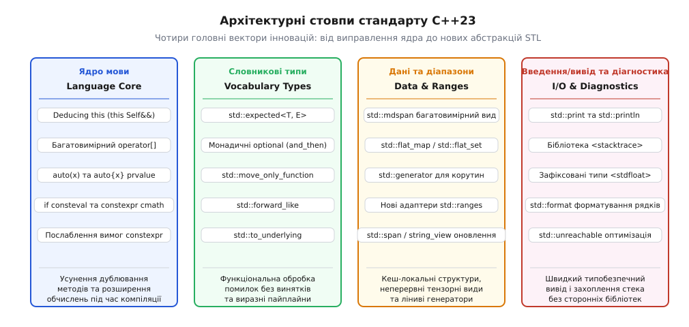
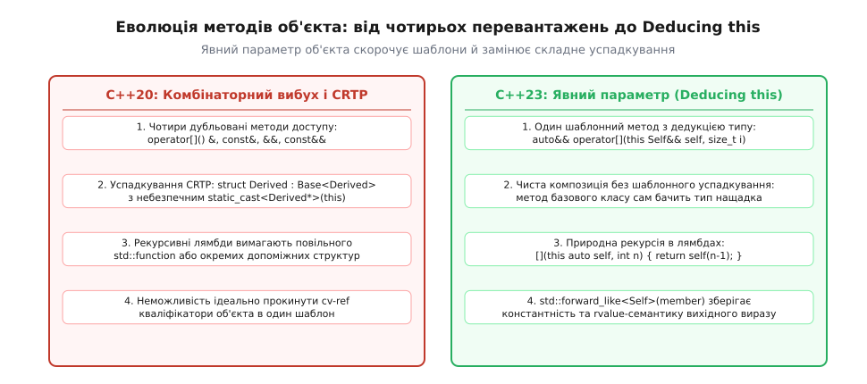
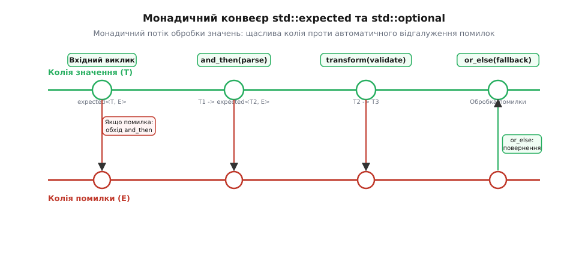
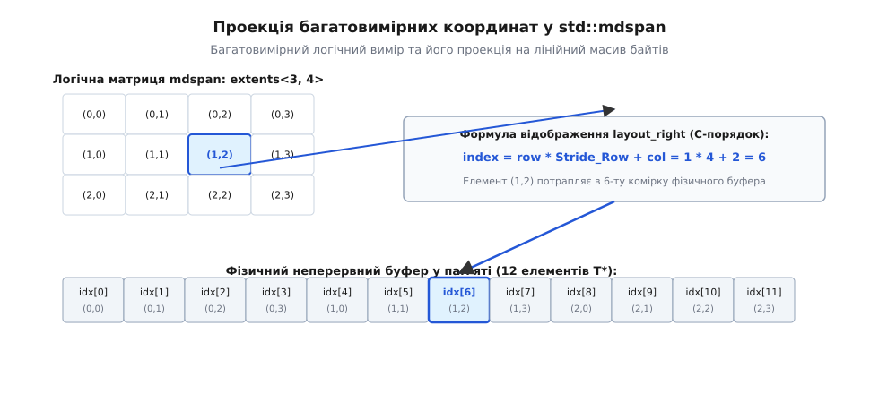

# Що приніс C++23

<preknowlist>
- [Як робиться стандарт C++: комітет, папери, цикл](book:cpp-standards/standardization-process) — трирічна модель потягів, робочі групи WG21 та етапи проходження пропозицій.
- [Категорії значень: lvalue, prvalue, xvalue](book:cpp-standards/value-categories) — семантика значень виразів, копіювання та переміщення.
- [Явний параметр об'єкта (deducing this)](book:cpp-standards/deducing-this) — базовий синтаксис `this Self&& self` та механізм виведення типу об'єкта.
- [constexpr і consteval](book:cpp-standards/constexpr-and-consteval) — правила обчислень під час компіляції та обмеження компіляторного інтерпретатора.
</preknowlist>

Програмування користувацьких контейнерів та функціональних конвеєрів у C++20 упиралося в комбінаторний бар'єр: щоб забезпечити коректний доступ до елементів структури даних, інженер мусив писати чотири дубльованих перевантаження кожного методу (`&`, `const&`, `&&`, `const&&`), а для багатовимірних матриць використовувати незручні виклики функцій `matrix(x, y)` чи виділяти масиви покажчиків другого порядку `T**` з катастрофічними втратами локальності кешу. Будь-яка спроба передати об'єкт помилки назовні змушувала обирати між дорогим розкручуванням стека винятків (накладні витрати на таблиці DWARF `.eh_frame`) та втратою інформації через повернення магічних чисел чи фіктивних значень.

Міжнародний стандарт ISO/IEC 14882:2024 (неофіційно відомий як C++23) усунув ці системні розриви. Реліз не став черговою революцією з фундаментальною зміною парадигми (як C++11 чи C++20), а зосередився на практичній завершеності мови: надав механізм явного зазначення параметра об'єкта, уніфікував роботу з багатовимірними даними, впровадив детерміновану обробку помилок на рівні стандартної бібліотеки та замінив застарілі підсистеми введення/виводу швидкими, типобезпечними аналогами.

## Контекст релізу: від пандемічного карантину до стандарту ISO/IEC 14882:2024

Розробка C++23 збіглася з глобальною кризою 2020–2022 років, коли комітет WG21 був змушений повністю перейти на дистанційні телеконференції. Втрата очних тижневих засідань різко скоротила пропускну здатність робочих груп з еволюції мови (EWG) та бібліотеки (LEWG). Великі експериментальні напрями — статична рефлексія, синтаксис контрактів, зіставлення зі зразком (Pattern Matching) та мережева бібліотека Networking — були свідомо відкладені до циклу C++26.

Завдяки цьому рішенню всі інженерні ресурси комітету було спрямовано на завершення та стабілізацію можливостей, які безпосередньо покращують щоденну розробку. [Історія стандарту C++23: пандемічний цикл WG21 і порятунок ядра мови](book:cpp-standards/cpp23-features/hist-cpp23-covid-cycle.md) докладно висвітлює хроніку прийняття рішень у віртуальному форматі та боротьбу за ключові папери релізу.



*Чотири архітектурні напрями стандарту C++23: ремонт синтаксису ядра, нові словникові типи, кеш-локальні структури даних та високопродуктивний вивід.*

Нововведення C++23 природно розділяються на чотири взаємопов'язані блоки:
1. **Ядро мови:** ліквідація надлишкового синтаксичного шуму шаблонів, підтримка багатовимірних операторів та розширення можливостей `constexpr`.
2. **Словникові типи:** функціональна обробка результатів та помилок без винятків.
3. **Організація даних:** кеш-орієнтовані контейнери, неволодіючі тензорні представлення та ліниві корутинні послідовності.
4. **Системний вивід і діагностика:** усунення повільного форматування потоків `iostream` та пряме захоплення стека викликів.

## Явний параметр об'єкта (Deducing this): усунення комбінаторного вибуху та рефакторинг CRTP

Найважливішою інновацією ядра мови в C++23 стало введення явного параметра об'єкта (папір P0847R7, відомий під назвою *Deducing this*). У попередніх стандартах неявний покажчик `this` передавався в методи приховано через регістри процесора відповідно до угоди виклику (`thiscall`), а константність і категорія значення поточного екземпляра кодувалися суфіксами після списку параметрів.

Коли клас реалізовував оператор індексації або метод доступу до поля, що повертає посилання, розробник був зобов'язаний писати чотири майже однакові функції:

```cpp
struct Buffer {
    int& operator[](size_t i) &             { return data_[i]; }
    const int& operator[](size_t i) const&  { return data_[i]; }
    int&& operator[](size_t i) &&           { return std::move(data_[i]); }
    const int&& operator[](size_t i) const&&{ return std::move(data_[i]); }
private:
    std::vector<int> data_;
};
```

У C++23 першим параметром функції-члена дозволено явно зазначити об'єкт із префіксом `this`. Якщо тип параметра оголошено як шаблонний універсальний зв'язок `this Self&& self`, компілятор самостійно виводить повний тип об'єкта разом з усіма його кваліфікаторами `const`, `volatile` та посиланнями `&`/`&&`:

```cpp
struct Buffer {
    template <typename Self>
    auto&& operator[](this Self&& self, size_t i) {
        return std::forward_like<Self>(self.data_[i]);
    }
private:
    std::vector<int> data_;
};
```

Допоміжна функція `std::forward_like<Self>(member)` (додана в заголовок `<utility>`) проєктує кваліфікатори типу `Self` на його поле `data_[i]`: якщо `self` є `const Buffer&`, вираз повертає `const int&`; якщо `self` є rvalue-об'єктом `Buffer&&`, вираз повертає `int&&`.



*Порівняння підходів: C++20 вимагав чотирьох дубльованих методів та шаблонного успадкування CRTP, тоді як C++23 зводить усе до єдиного шаблонного методу та прямої композиції.*

### Передача об'єкта за значенням (Pass-by-value this)

Традиційні методи класу завжди отримують покажчик `this` на об'єкт у пам'яті. Для дрібних структур розміром до 16 байтів (таких як `std::string_view`, ітератори масивів, комплексні числа або математичні точки `Point2D`) передача покажчика з подальшим його розіменуванням створює зайву операцію звернення до стека (зайвий рівень індирекції).

Deducing this дозволяє приймати об'єкт прямо за значенням без покажчика:

```cpp
struct Coordinate {
    int x;
    int y;

    // Об'єкт передається напряму в регістрах rdi / rsi процесора
    int area(this Coordinate self) noexcept {
        return self.x * self.y;
    }
};
```

Такий підхід повністю усуває аліасинг покажчиків і дозволяє оптимізатору компілятора зберігати всі поля структури безпосередньо у векторних або цілочисельних регістрах процесора без запису в оперативну пам'ять.

### Статичний поліморфізм без успадкування

Другим фундаментальним застосуванням Deducing this є заміна ідіоми CRTP (англ. *Curiously Recurring Template Pattern*). У класичному CRTP базовий клас мусив бути шаблоном, параметризованим типом нащадка `template <typename Derived> struct Base`, а виклик методів нащадка вимагав явного перетворення вказівника `static_cast<Derived*>(this)->interface()`.

У C++23 базовий клас стає звичайною нешаблонною структурою. Метод базового класу автоматично отримує фактичний тип нащадка через явний параметр `this Self&& self`:

```cpp
struct Printable {
    template <typename Self>
    void print(this const Self& self) {
        // self має тип фактичного нащадка, а не Printable
        std::println("Об'єкт: {}", self.to_string());
    }
};

struct User : Printable {
    std::string name;
    std::string to_string() const { return name; }
};

struct Device : Printable {
    int id;
    std::string to_string() const { return std::to_string(id); }
};
```

Цей підхід повністю ліквідує необхідність шаблонного спадкування, усуває небезпеку помилкового інстанціювання `struct Device : Printable<User>` і кардинально прискорює компіляцію великих ієрархій компонентів.

### Будівничий інтерфейс (Fluent Builder) без зрізання типів

При створенні класів-будівників метод налаштування властивості зазвичай повертає посилання на поточний об'єкт `*this`. Коли такий будівник успадковується іншим класом, виклик базового методу зрізає тип результату до базового посилання:

```cpp
// Проблема у C++20: зрізання типу при успадкуванні
struct BaseBuilder {
    BaseBuilder& set_tag(std::string_view t) { tag = t; return *this; }
    std::string tag;
};

struct HttpBuilder : BaseBuilder {
    HttpBuilder& set_port(int p) { port = p; return *this; }
    int port{80};
};

// HttpBuilder().set_tag("api").set_port(8080); // Помилка компіляції: set_tag повертає BaseBuilder&
```

Завдяки Deducing this базовий метод повертає посилання на фактичний похідний тип, забезпечуючи коректне ланцюжкове викликання:

```cpp
struct BaseBuilder {
    template <typename Self>
    Self&& set_tag(this Self&& self, std::string_view t) {
        self.tag = t;
        return std::forward<Self>(self);
    }
    std::string tag;
};

struct HttpBuilder : BaseBuilder {
    template <typename Self>
    Self&& set_port(this Self&& self, int p) {
        self.port = p;
        return std::forward<Self>(self);
    }
    int port{80};
};

// Працює ідеально в C++23:
auto req = HttpBuilder{}.set_tag("api").set_port(8080);
```

### Покажчики на функції замість покажчиків на методи

Історично покажчик на нестатичну функцію-член (`void (Buffer::*)(size_t)`) мав складне бінарне представлення (у компіляторі GCC це структура розміром 16 байтів, що містить покажчик на код та зміщення `vtable`). Метод з явним параметром `this` має сигнатуру звичайної вільної функції: покажчик на нього є звичайним 8-байтним покажчиком на функцію `void (*)(const Buffer&, size_t)`. Це дозволяє передавати методи безпосередньо у низькорівневі C-бібліотеки та API потоків без використання лямбд або `std::bind`.

### Універсальні декоратори та проксі-обгортки

Deducing this істотно спрощує написання класів-обгорток (проксі, декораторів, логерів), які повинні перехоплювати виклики методів і делегувати їх внутрішньому об'єкту, зберігаючи точні кваліфікатори доступу. Раніше написання універсального проксі вимагало генерації макросів або десятків спеціалізацій для константних та rvalue-об'єктів:

```cpp
template <typename Target>
struct LoggingWrapper {
    Target inner;

    template <typename Self, typename... Args>
    auto execute(this Self&& self, Args&&... args) 
        -> decltype(auto) 
    {
        std::println("Початок виконання операції");
        return std::forward_like<Self>(self.inner).execute(std::forward<Args>(args)...);
    }
};
```

### Природна рекурсія в лямбда-виразах

До C++23 анонімна лямбда-функція не мала імені, а отже не могла викликати саму себе без збереження у повільний поліморфний контейнер `std::function` або передачі посилання на саму себе через аргументи виклику. Явний параметр `this` дозволяє лямбді отримати власне замикання:

```cpp
auto fibonacci = [](this auto self, int n) -> int {
    if (n <= 1) return n;
    return self(n - 1) + self(n - 2);
};

int val = fibonacci(10); // Обчислює 55 без виділення динамічної пам'яті
```

Компілятор інлайнить такі рекурсивні виклики без жодних накладних витрат на непрямий виклик через таблицю віртуальних методів чи покажчики на функції.

> 🔧 **Навіщо це.** Явний параметр об'єкта знімає до 75% шаблонного коду в адаптерах діапазонів, бібліотеках чисельних методів та UI-деревах, гарантуючи нульові витрати на диспетчеризацію під час виконання.

## Синтаксичні інновації ядра: багатовимірний operator[], явне копіювання prvalue та еволюція constexpr

Крім Deducing this, стандарт C++23 вніс низку точкових удосконалень у синтаксис та семантику виразів.

### Багатовимірний оператор індексації operator[]

Історично оператор `operator[]` у мовах C і C++ приймав рівно один аргумент. Для доступу до елементів двовимірних і тривимірних масивів розробники були змушені або перевантажувати оператор виклику функції `matrix(row, col)`, або створювати штучні проміжні класи-проксі для ланцюжка `matrix[row][col]`. Створення проксі-об'єктів ускладнювало оптимізацію та перешкоджало векторизації циклів компілятором.

У стандарті C++20 вираз `a[x, y]` із використанням оператора коми було офіційно оголошено застарілим (deprecated), щоб звільнити синтаксис ком для передачі декількох аргументів.

Папір P2128R6 зняв обмеження одного аргументу: тепер `operator[]` може приймати довільну кількість аргументів будь-яких типів (зокрема пакети параметрів `Args...`):

```cpp
template <typename T, size_t Rows, size_t Cols>
struct Matrix {
    T data[Rows * Cols];

    T& operator[](size_t r, size_t c) noexcept {
        return data[r * Cols + c];
    }

    const T& operator[](size_t r, size_t c) const noexcept {
        return data[r * Cols + c];
    }
};

Matrix<float, 4, 4> mat;
mat[1, 2] = 3.14f; // Природний математичний доступ до елемента
```

Цей синтаксис став базовим фундаментом для бібліотечного типу `std::mdspan`.

### Явне копіювання prvalue: auto(x) та auto{x}

У метапрограмуванні часто виникає потреба створити чисту копію значення за місцем, позбавивши його посилань і константності (створити prvalue, англ. *decay-copy*). Раніше для цього використовувалися громіздкі шаблонні конструкції `template <typename T> auto decay_copy(T&& v) -> std::decay_t<T> { return std::forward<T>(v); }`.

Синтаксис C++23 ввів вирази `auto(x)` та `auto{x}` (папір P0849R8), які явно створюють тимчасову копію переданого виразу типу `decay_t`:

```cpp
void process_buffer(std::span<const int> view);

void update(std::vector<int>& data) {
    // data передається як незалежна prvalue-копія у фоновий потік,
    // запобігаючи стану гонитви (data race) при зміні оригінального вектора
    auto copy_task = [copy = auto(data)]() {
        process_buffer(copy);
    };
}
```

Вираз `auto(x)` завжди створює незалежний prvalue-об'єкт, для якого діють стандартні правила обов'язкового виключення копіювання (Guaranteed Copy Elision / RVO).

### Розширення обчислень часу компіляції: if consteval та послаблення constexpr

У C++20 для розділення компіляторного та динамічного коду використовувалася функція `std::is_constant_evaluated()`. Її застосування умовним оператором `if (std::is_constant_evaluated())` часто призводило до помилок: якщо інженер помилково писав `if constexpr (std::is_constant_evaluated())`, вираз `is_constant_evaluated()` всередині `if constexpr` завжди повертав `true`, незалежно від того, як виконувалася зовнішня функція.

C++23 ввів пряму мовну конструкцію `if consteval` (папір P1938R3):

```cpp
constexpr double compute_sqrt(double x) {
    if consteval {
        // Гарантовано виконується компілятором під час збірки
        return compile_time_taylor_sqrt(x);
    } else {
        // Використовує апаратні векторні інструкції процесора (SIMD) під час виконання
        return std::sqrt(x);
    }
}
```

Також у C++23 було знято низку штучних обмежень у `constexpr`-функціях:
- Дозволено оголошувати невикористовувані статичні (`static`) та локальні для потоку (`thread_local`) змінні у гілках, які не активуються під час обчислення константного виразу;
- Дозволено використання операцій зміни пам'яті та виділення динамічних масивів через `std::allocator`, за умови що вся виділена пам'ять звільняється до завершення фази константного обчислення (папір P1004 / P2647 — перехідні алокації);
- Більшість функцій математичного заголовка `<cmath>` (зокрема `sin`, `cos`, `log`, `exp`) та операції `<cstdlib>` отримали специфікатор `constexpr`;
- Дозволено операції приведення типів `dynamic_cast` та отримання інформації про типи `typeid` у константному контексті.

### Форматовані повідомлення у static_assert

Папір P2741R3 розширив можливості компіляторної діагностики, дозволивши використовувати користувацькі рядкові вирази у `static_assert`:

```cpp
template <typename T>
void verify_alignment() {
    static_assert(sizeof(T) <= 64, "Розмір структури перевищує одну кеш-лінію процесора");
}
```

### Літеральні суфікси розмірності

Для виключення попереджень компілятора щодо звуження типів при змішуванні `int` та `size_t` запроваджено офіційні суфікси для беззнакового типу розміру `uz` (або `UZ`) та його знакового аналога `z` (або `Z`):

```cpp
auto sz = 100uz; // Тип std::size_t
auto diff = -50z; // Знаковий тип std::ptrdiff_t
```

## Функціональний потік даних: монадичні операції std::optional та словниковий тип std::expected

Обробка відсутності значення або збою операції в традиційному C++ змушувала розробників писати багатослівні каскади перевірок, відомі як «піраміда умов»:

```cpp
// Класичний стиль C++17
std::optional<User> find_user(int id);
std::optional<Address> get_address(const User& u);
std::optional<GeoPoint> get_coords(const Address& a);

std::optional<GeoPoint> locate(int id) {
    auto u = find_user(id);
    if (!u) return std::nullopt;
    auto a = get_address(*u);
    if (!a) return std::nullopt;
    return get_coords(*a);
}
```

### Монадичні розширення std::optional

У C++23 клас `std::optional` отримав три методи для побудови функціональних ланцюжків:
- **`and_then(f)`:** викликає функцію `f`, якщо значення є. Функція `f` повинна сама повертати `std::optional<U>`. Якщо значення немає, ланцюг переривається з результатом `std::nullopt`.
- **`transform(f)`:** викликає функцію `f`, якщо значення є, і автоматично загортає результат типу `U` у `std::optional<U>`.
- **`or_else(f)`:** викликає функцію `f`, якщо значення відсутнє, дозволяючи надати альтернативне джерело даних або відновити стан.

З монадичними операціями функція `locate` згортається в один лінійний вираз:

```cpp
std::optional<GeoPoint> locate(int id) {
    return find_user(id)
        .and_then(get_address)
        .and_then(get_coords);
}
```

### std::expected<T, E>: типобезпечна помилка як значення

Головним бібліотечним нововведенням C++23 у сфері надійності став тип `std::expected<T, E>` (заголовок `<expected>`). Він містить або успішне значення типу `T`, або код чи об'єкт помилки типу `E`.

На відміну від `std::optional`, `std::expected` зберігає детальну інформацію про причину збою, не вимагаючи генерації винятків:

```cpp
enum class NetError { Timeout, HostNotFound, AccessDenied };

std::expected<std::string, NetError> fetch_data(std::string_view url);
std::expected<JsonDoc, NetError> parse_json(std::string_view text);

auto result = fetch_data("https://api.service.internal/config")
    .and_then(parse_json)
    .transform([](const JsonDoc& doc) { return doc["port"].as_int(); })
    .or_else([](NetError err) -> std::expected<int, NetError> {
        if (err == NetError::Timeout) return 8080; // Відновлення через резервний порт
        return std::unexpected(err); // Прокидання помилки далі
    });
```



*Залізнична модель монадичної обробки помилок: успішні виклики просуваються верхньою колією через and_then і transform, а помилки негайно переходять у нижню гілку до or_else.*

### Внутрішнє розміщення та гарантії пам'яті

`std::expected<T, E>` зберігає `T` або `E` у внутрішньому неіменованому об'єднанні (`union`). Розмір об'єкта розраховується за формулою:

```
sizeof(std::expected<T, E>) = max(sizeof(T), sizeof(E)) + sizeof(bool) + вирівнювання
```

На відміну від `std::variant<T, E>`, де індекс стану може займати 4 або 8 байтів, `std::expected` використовує компактний булевий прапорець і гарантує, що об'єкт ніколи не перебуває у «порожньому через виняток» стані (valueless by exception). Об'єкт не виконує жодних виділень динамічної пам'яті (відсутній `malloc`/`new`), що робить його придатним для використання в ядрах операційних систем, вбудованих контролерах та мікросервісах із жорсткими обмеженнями затримки (Low Latency).

Для функцій, які в разі успіху не повертають значення, передбачено спеціалізацію `std::expected<void, E>`. У ній відсутнє поле даних для `T`, а перевірка стану здійснюється методом `has_value()`:

```cpp
std::expected<void, std::error_code> write_file(std::string_view path, std::span<const uint8_t> data);

if (auto res = write_file("/var/log/sys.log", buffer); !res) {
    std::println(stderr, "Помилка запису: {}", res.error().message());
}
```

### Трансформація помилок між доменами через transform_error

У великих архітектурах низькорівневі помилки підсистем (наприклад, помилки читання з диска `std::io_errc`) не повинні виходити в бізнес-логіку програми у сирому вигляді. Метод `transform_error(f)` дозволяє виконати мапінг кодів помилок без переривання монадичного конвеєра:

```cpp
enum class DbError { ConnectionLost, RecordNotFound, CorruptedData };
enum class ApiError { InternalServerError, NotFound, Unauthorized };

std::expected<Record, DbError> load_from_db(int id);

std::expected<Record, ApiError> get_user_record(int id) {
    return load_from_db(id).transform_error([](DbError e) -> ApiError {
        switch (e) {
            case DbError::RecordNotFound: return ApiError::NotFound;
            case DbError::ConnectionLost:
            case DbError::CorruptedData:  return ApiError::InternalServerError;
        }
        std::unreachable();
    });
}
```

### Порівняльний аналіз стратегій обробки збоїв

У розробці системного програмного забезпечення вибір між класичними винятками, кодами повернення та типом `std::expected` ґрунтується на балансі між накладними витратами часу виконання, виразністю синтаксису та гарантіями безпеки пам'яті:

| Критерій | Традиційні винятки (`throw`/`catch`) | Коди помилок (`int`/`errno`) | `std::expected<T, E>` (C++23) |
|---|---|---|---|
| **Накладні витрати успішного шляху** | Нульові (Zero-Cost Exceptions) | Мінімальні (перевірка регістра) | Мінімальні (перевірка прапорця) |
| **Накладні витрати шляху збою** | Величезні (1000–5000 тактів CPU) | Нульові (просте повернення) | Нульові (передача об'єкта в стеку) |
| **Виділення динамічної пам'яті** | Можливе (для об'єктів винятків) | Відсутнє | Відсутнє (union за місцем) |
| **Сумісність із `-fno-exceptions`** | Неможлива (заборонено) | Повна | Повна |
| **Контроль обробки компілятором** | Відсутній (можна пропустити catch) | Відсутній (`[[nodiscard]]` частково) | Повний (значення недоступне без перевірки) |
| **Композиція у функціональні конвеєри** | Неможлива | Громіздкі перевірки `if` | Природна (`and_then`, `transform`) |

## Ефективний вивід та діагностика: std::print, std::println та бібліотека <stacktrace>

Історично консольний вивід у C++ страждав від двох крайнощів: або небезпечний `printf` із ризиком невідповідності специфікаторів формату реальним типам аргументів (що призводить до пошкодження пам'яті та вразливостей переповнення буфера), або повільний `std::cout`, чия архітектура вимагає багаторазових викликів віртуальних методів локалей, проміжних рядкових алокацій та незручного синтаксису маніпуляторів `std::setw`/`std::setfill`.

### Вивід нового покоління: std::print та std::println

Стандарт C++23 представив заголовок `<print>` (папір P2093R14). Функції `std::print` та `std::println` поєднують строгий контроль рядка формату під час компіляції (успадкований від `std::format` C++20) з максимальною швидкістю низькорівневого запису:

```cpp
#include <print>

int main() {
    std::string module = "CoreEngine";
    int thread_id = 4;
    double latency_ms = 0.428;

    // Вивід у стандартний stdout
    std::println("[{}] Потік {}: затримка {:.2f} мс", module, thread_id, latency_ms);

    // Прямий вивід у файл потоку C (FILE*)
    std::println(stderr, "Критична помилка ініціалізації");
}
```

Ключові архітектурні переваги `std::println`:
1. **Прямі системні виклики:** Замість посимвольного запису через буфери `std::streambuf`, функція формує готовий UTF-8 пакет у локальному буфері на стеку і записує його за один виклик `write()` у POSIX або `WriteConsoleW()` у Windows.
2. **Коректний Unicode у Windows:** Функція автоматично розпізнає вивід у консоль Windows і передає дані у форматі UTF-16, усуваючи спотворення символів («крякозябри») без виклику `SetConsoleOutputCP(65001)`.
3. **Менший розмір двійкового файлу:** Шаблони форматування генерують оптимізовані таблиці параметрів замість роздування десятків перевантажень оператора `operator<<`.

### Програмна інспекція стека: бібліотека <stacktrace>

До C++23 для отримання стека викликів під час аварійного завершення чи логування розробники використовували платформозалежні нестандартні бібліотеки (`boost::stacktrace`, `libunwind` або виклики Win32 API).

Заголовок `<stacktrace>` стандартизував захоплення та форматування трасування:

```cpp
#include <stacktrace>
#include <print>

void deep_operation() {
    auto trace = std::stacktrace::current();
    for (const auto& frame : trace) {
        std::println("Функція: {}, файл: {}:{}", 
                     frame.description(), frame.source_file(), frame.source_line());
    }
}
```

`std::stacktrace::current()` фіксує ланцюжок кадрів стека без зупинки процесу. Якщо налагоджувальні символи (DWARF або PDB) скомпільовані разом із бінарним файлом, методи `source_file()` та `source_line()` повертають точне місцезнаходження виклику в сирцевому коді.

## Структури даних і паралелізм: std::mdspan, flat-контейнери та std::generator

Утиліти для організації пам'яті в C++23 орієнтовані на сучасну архітектуру процесорів: мінімізацію промахів кешу L1/L2 та інтеграцію з конвеєрами діапазонів.

### Багатовимірний масив std::mdspan

`std::mdspan` (заголовок `<mdspan>`) є неволодіючим багатовимірним видом на лінійну ділянку пам'яті. Він узагальнює одновимірний `std::span` на довільну кількість вимірів.

Об'єкт `std::mdspan` складається з покажчика на початок даних і трьох ортогональних політик:

```cpp
#include <mdspan>
#include <vector>
#include <print>

void process_tensor() {
    std::vector<double> buffer(3 * 4, 0.0);

    // Створення 2D-виду розміром 3x4 поверх плоского вектора
    std::mdspan<double, std::extents<size_t, 3, 4>> matrix(buffer.data());

    // Запис через багатовимірний operator[]
    matrix[1, 2] = 42.0;

    // Стовпчик за стовпчиком (Fortran-layout) для інтеграції з LAPACK/BLAS
    std::mdspan<double, std::dextents<size_t, 2>, std::layout_left> fortran_matrix(
        buffer.data(), 3, 4
    );

    std::println("Елемент buffer[6]: {}", buffer[1 * 4 + 2]); // Друкує 42.0
}
```



*Відображення багатовимірного координатного простору у фізичний неперервний масив пам'яті за правилами layout_right.*

Політики розкладки координат:
- **`std::layout_right` (за замовчуванням):** C-порядок, де останній індекс змінюється найшвидше (елементи рядка лежать поруч у пам'яті). Дозволяє компілятору виконувати автоматичну векторизацію (SIMD AVX2/AVX-512) внутрішніх циклів через неперервні завантаження пам'яті.
- **`std::layout_left`:** Fortran-порядок, де перший індекс змінюється найшвидше (елементи стовпчика лежать поруч).
- **`std::layout_stride`:** Довільний крок між елементами кожного виміру, що дозволяє створювати зрізи (slices), діагоналі та підвибірки без копіювання даних.

Завдяки відокремленню політики доступу (Accessor Policy), `std::mdspan` можна налаштовувати для прямої роботи з пам'яттю графічних прискорювачів GPU (CUDA / ROCm), енергонезалежною пам'яттю NVRAM або блоками пам'яті з атомарним доступом через `std::atomic_ref`.

### Зрізи підвимірів через std::submdspan

Для виділення підматриць, окремих рядків, стовпчиків чи просторових площин без алокації нової пам'яті C++23 надає функцію `std::submdspan`:

```cpp
#include <mdspan>

void slice_3d_volume() {
    double raw_data[100 * 100 * 100];
    std::mdspan<double, std::extents<size_t, 100, 100, 100>> volume(raw_data);

    // Отримання 2D-зрізу (переріз по Z = 42)
    auto plane_2d = std::submdspan(volume, 42, std::full_extent, std::full_extent);

    // plane_2d має ранг 2 та розмірність 100x100
    plane_2d[10, 20] = 1.0; // Записує безпосередньо у вихідний масив raw_data
}
```

### Плоскі асоціативні контейнери std::flat_map та std::flat_set

Класичний контейнер `std::map` реалізований як червоно-чорне дерево, де кожен вузол містить три покажчики (`parent`, `left`, `right`) та виділяється в динамічній пам'яті окремим викликом алокатора. При переборі дерева покажчики розкидані по всій оперативній пам'яті, що призводить до постійних промахів кешу процесора (Cache Misses).

Адаптери `std::flat_map` та `std::flat_set` (заголовки `<flat_map>` та `<flat_set>`) зберігають елементи у двох паралельних неперервних векторах (`std::vector<Key>` та `std::vector<Value>`):

```cpp
#include <flat_map>
#include <print>

void benchmark_map() {
    std::flat_map<int, std::string> accounts;

    accounts.insert({1024, "Адміністратор"});
    accounts.insert({2048, "Оператор"});
    accounts.insert({512, "Гість"});

    // Пошук за O(log N) через двійковий пошук у кеш-локальному векторі
    if (auto it = accounts.find(1024); it != accounts.end()) {
        std::println("Знайдено: {}", it->second);
    }
}
```

Властивості плоских контейнерів:
- **Швидкість читання:** Двійковий пошук у неперервному векторі ключів працює у 3–8 разів швидше за обхід вузлового дерева `std::map`, оскільки сусідні ключі завантажуються в кеш процесора цілими лініями по 64 байти.
- **Накладні витрати пам'яті:** Зменшуються на 60–80%, оскільки відсутні покажчики вузлів дерева.
- **Ціна вставки:** Вставка нового елемента коштує `O(N)` через необхідність зсуву масиву. Тому `std::flat_map` є ідеальним вибором для словників, які заповнюються один раз на старті програми, а потім інтенсивно використовуються для читання.

Для масового заповнення `std::flat_map` підтримує конструктори, які приймають готові відсортовані вектори або сортують їх за один прохід за час `O(N log N)`, уникаючи квадратичних витрат на послідовну вставку.

### Маніпуляція внутрішніми векторами через extract та replace

Якщо програмі потрібно модифікувати велику кількість ключів або значень, `std::flat_map` дозволяє вилучити внутрішні вектори у формі структури `containers` без копіювання, змінити їх напряму та замінити назад:

```cpp
#include <flat_map>
#include <algorithm>

void bulk_update(std::flat_map<int, double>& prices) {
    // Вилучення векторів
    auto [keys, values] = std::move(prices).extract();

    // Масове оновлення всіх значень за один векторний прохід
    for (auto& val : values) {
        val *= 1.20; // Додавання ПДВ
    }

    // Повернення векторів у плоску мапу
    prices.replace(std::move(keys), std::move(values));
}
```

### Ліниві корутини: std::generator

У C++20 з'явилися інструкції корутин (`co_yield`, `co_await`, `co_return`), але була відсутня готова бібліотечна реалізація. Розробники мали вручну створювати типи обіцянок (`promise_type`), що вимагало понад 100 рядків складного низькорівневого коду.

`std::generator<T>` (заголовок `<generator>`) надає синхронний лінивий генератор послідовностей, сумісний із бібліотекою Ranges:

```cpp
#include <generator>
#include <ranges>
#include <print>

std::generator<uint64_t> generate_primes() {
    co_yield 2;
    co_yield 3;
    for (uint64_t n = 5; ; n += 2) {
        bool is_prime = true;
        for (uint64_t i = 3; i * i <= n; i += 2) {
            if (n % i == 0) { is_prime = false; break; }
        }
        if (is_prime) co_yield n;
    }
}

int main() {
    // Об'єднання генератора з адаптерами std::ranges
    for (auto prime : generate_primes() 
                    | std::views::filter([](auto p) { return p % 10 == 7; })
                    | std::views::take(5)) {
        std::println("Просте число: {}", prime);
    }
}
```

Генератор не виділяє пам'ять під послідовність наперед: наступне просте число обчислюється лише тоді, коли ітератор циклу `for` робить крок `++it`.

### Вкладені генератори через elements_of

Коли генератор викликає інший генератор або діапазон (наприклад, при рекурсивному обході бінарного дерева або файлової системи), інструкція `co_yield std::ranges::elements_of(sub_generator)` передає управління дочірній корутині без накладних витрат на покрокове розгортання проміжного циклу:

```cpp
#include <generator>
#include <ranges>
#include <string>

struct TreeNode {
    std::string value;
    std::vector<TreeNode> children;
};

std::generator<const std::string&> traverse_tree(const TreeNode& node) {
    co_yield node.value;
    for (const auto& child : node.children) {
        // Делегування генерації вкладеному піддереву
        co_yield std::ranges::elements_of(traverse_tree(child));
    }
}
```

### Нові адаптери бібліотеки std::ranges

Стандарт C++23 суттєво розширив палітру адаптерів діапазонів (Ranges), усунувши прогалини, що залишилися після виходу C++20:
- **`views::zip`:** об'єднує кілька діапазонів у єдину послідовність кортежів `std::tuple<Ref1, Ref2, ...>`.
- **`views::chunk(n)`:** розбиває вхідний діапазон на блоки фіксованого розміру `n`.
- **`views::slide(n)`:** створює ковзне вікно шириною `n` елементів, що переміщується по послідовності з кроком 1.
- **`views::stride(n)`:** перебирає елементи діапазону з фіксованим кроком `n`.
- **`views::cartesian_product`:** обчислює декартовий добуток довільної кількості послідовностей.
- **`views::enumerate`:** додає індекс поточного елемента до самого значення, продукуючи пари `(index, value)`.
- **`views::join_with`:** об'єднує діапазон піддіапазонів у плоску послідовність, вставляючи між ними заданий роздільник.

## Системні компоненти та утиліти низького рівня

Крім макроструктурних бібліотек, C++23 впровадив низку фундаментальних утиліт, які вирішують давні системні проблеми мови C++.

### std::move_only_function

Клас `std::function` вимагав від замикання обов'язкової підтримки копіювання (`CopyConstructible`). Через це у ньому було неможливо зберегти лямбди, які захоплювали некопійовані ресурси — такі як `std::unique_ptr`, `std::jthread`, сокети чи екземпляри `std::promise`.

Утиліта `std::move_only_function` (заголовок `<functional>`) вимагає лише семантики переміщення (`MoveConstructible`). Крім того, вона дозволяє явно вказувати константність виклику та специфікатор `noexcept` прямо у сигнатурі:

```cpp
#include <functional>
#include <memory>

struct Task {
    std::unique_ptr<int[]> buffer;
};

// Зберігає переміщуваний об'єкт без виділення пам'яті в купі для SBO
std::move_only_function<void() noexcept> task_runner = [t = Task{std::make_unique<int[]>(1024)}]() noexcept {
    // Безпечне виконання задачі
};
```

### Фіксована ширина чисел із плаваючою крапкою <stdfloat>

Історично типи `float`, `double` та `long double` мали платформозалежну розрядність (наприклад, `long double` міг бути 64, 80 або 128 бітів). Заголовок `<stdfloat>` ввів типи гарантованої бінарної ширини за стандартом IEEE 754:
- `std::float16_t` (16 бітів половинної точності);
- `std::float32_t` (32 біти одинарної точності);
- `std::float64_t` (64 біти подвійної точності);
- `std::float128_t` (128 бітів четвертинної точності);
- `std::bfloat16_t` (16-бітний формат Brain Floating Point з 8-бітним порядком для прискорення нейромереж).

Для нових типів додано літеральні суфікси: `1.0f16`, `1.0bf16`, `1.0f32`, `1.0f64`, `1.0f128`.

### Неалокуючі рядкові потоки <spanstream>

Класи `<spanstream>` здійснюють потокове форматування у фіксований буфер пам'яті:

```cpp
#include <spanstream>
#include <print>

char stack_buf[256];
std::ospanstream stream(stack_buf);
stream << "Рівень сигналу: " << 98 << "%";

std::println("Результат: {}", stream.span()); // Читання без копіювання
```

### Низькорівневі системні підказки та конвертація

- **`std::to_underlying(e)`:** лаконічно повертає базовий цілочисельний тип строго типізованого переліку `enum class`, замінюючи довгу конструкцію `static_cast<std::underlying_type_t<E>>(e)`.
- **`std::byteswap(n)`:** виконує апаратно оптимізований реверс байтів (використовуючи інструкції `BSWAP` на x86 чи `REV` на ARM) для швидкої конвертації порядку байтів (endianness) при розборі мережевих пакетів.
- **`std::unreachable()`:** повідомляє оптимізатору компілятора, що виконання програми ніколи не дійде до цієї точки. Це дозволяє транслятору прибрати зайві перевірки у фінальному машинному коді.
- **`string::contains` та `string_view::contains`:** додано зручний булевий метод перевірки входження підрядка, що замінює архаїчний вираз `str.find(sub) != std::string::npos`.

## Системний вплив C++23 на сучасну архітектуру ПЗ

Стандарт C++23 завершив десятилітню трансформацію мови з «C з класами та шаблонами» на виразну, безпечну систему конвеєрного компонування компонентів. 

Головні зміни торкнулися повсякденної культури написання коду:
1. **Відмова від надлишкового дублювання:** Deducing this скоротив розмір шаблонних заголовків бібліотек майже вдвічі, зробивши їх зрозумілими для читання та швидкими для компіляції.
2. **Детермінована обробка збоїв:** `std::expected` та монадичні методи `std::optional` надали C++ інструменти функціональної обробки помилок, усунувши потребу у винятках для передбачуваних сценаріїв.
3. **Кеш-локальність за замовчуванням:** Впровадження `std::mdspan` та `std::flat_map` перевело роботу зі складними структурами даних у площину сучасної апаратної ефективності.
4. **Прозорий введення/вивід:** `std::print` витіснив архаїчні потоки введення/виводу, забезпечивши максимальну продуктивність і захист від помилок форматування.

Повний перелік сигнатур усіх нових бібліотечних класів, перелік макросів тестування можливостей та таблицю адаптерів наведено у [довіднику стандартної бібліотеки та макросів C++23](book:cpp-standards/cpp23-features/api-cpp23-reference.md). Стандарт C++23 став зрілим, високопродуктивним фундаментом, на якому будуються сучасні ігрові рушії, суперкомп'ютерні симуляції, розподілені бази даних та вбудовані системи нового покоління.
