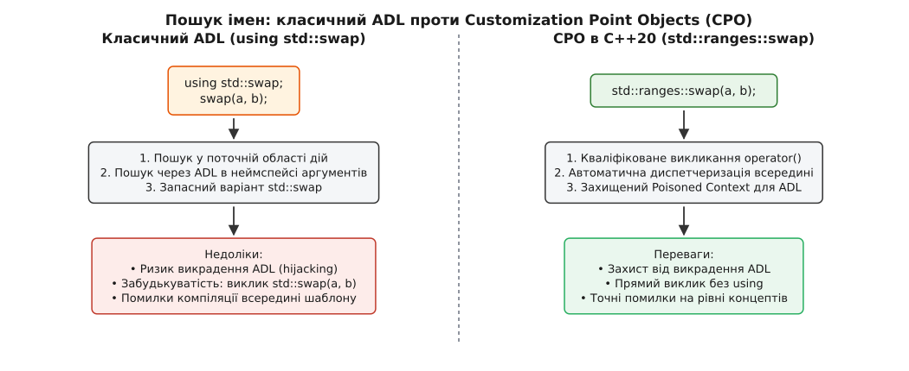
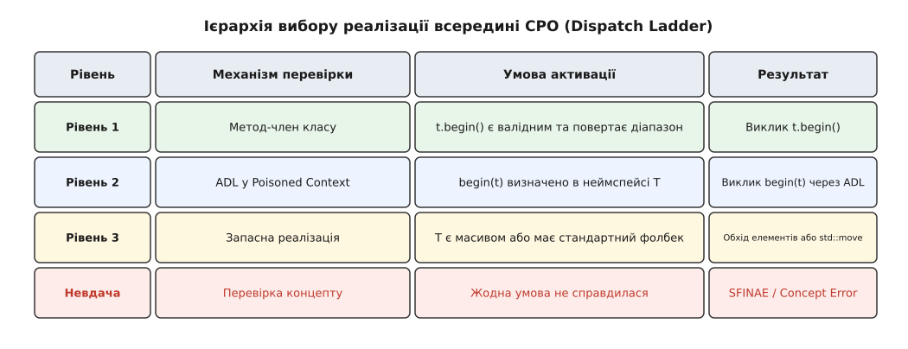
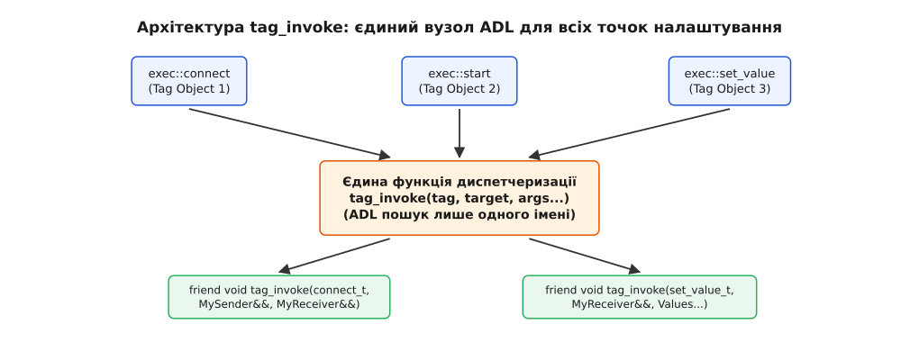

# Точки налаштування й об'єкти-CPO

<preknowlist>
- [Пошук імен та ADL](book:cpp-standards/namespaces-and-adl) — Argument-Dependent Lookup (пошук Кенона) та вибір перевантажень.
- [Концепти й обмеження](book:cpp-standards/concepts-constraints) — вирази `requires`, предикати типів та обмеження шаблонів у C++20.
- [SFINAE й enable_if](book:cpp-standards/sfinae-and-enable-if) — вилучення кандидатури з множини перевантажень без помилки компіляції.
- [Операція swap](book:cpp-standards/swap-operation) — класичний ідіоматичний обмін значеннями через `using std::swap`.
</preknowlist>

Обобщене програмування вимагає від мови C++ здатності застосовувати однакові алгоритми до типів, створених у різний час і різними авторами. Коли алгоритм `std::sort` впорядковує елементи масиву, йому необхідно міняти місцями значення. Для базових типів на кшталт `int` обмін виконується через тимчасову змінну. Проте для складного об'єкта — наприклад, динамічного вектора — обмін через копіювання означає триразове виділення пам'яті в купі та копіювання мільйона елементів. Припустити таке у високоефективному коді неможливо.

Спроба вирішити цю проблему через динамічний поліморфізм (*поліморфізм* з грецької *πολύς* — багатий, чисельний та *μορφή* — форма) із віртуальними функціями руйнує швидкодію. Віртуальний виклик додає непряму адресацію через таблицю віртуальних методів (vtable), унеможливлює вбудовування коду (inlining) оптимізатором і вимагає зберігати у кожному об'єкті прихований вказівник `vptr`. Крім того, спадкування є закритою системою (closed-world abstraction): об'єкт повинен знати про базовий інтерфейсний клас ще під час свого оголошення, що робить неможливим адаптацію сторонніх бібліотек або базових типів на кшталт масивів чи покажчиків.

Для статичного поліморфізму потрібен відкритий механізм розширення (open-world abstraction): спосіб, за допомогою якого обобщений алгоритм делегує частину своєї роботи реалізації, специфічній для конкретного типу, без зміни коду самої бібліотеки й без бруднення простору імен. Такий механізм у C++ називається **точкою налаштування** (Customization Point).

## Класичний ADL: двокрокова ідіома `using std::swap` та її підводні камені

У стандарті C++98 єдиним інструментом для створення точок налаштування був неповнокваліфікований виклик функції у поєднанні з пошуком імен, залежним від аргументів (Argument-Dependent Lookup, ADL, або пошук Кенона).

Диспетчеризація (*диспетчеризація* від англ. *dispatch* — відправлення, координація) працює за послідовним ланцюжком причин і наслідків. Якщо алгоритму потрібно обміняти значення двох об'єктів `a` та `b` типу `T`, виклик описується двома кроками:

```cpp
template<typename T>
void my_sort_step(T& a, T& b) {
    using std::swap; // Крок 1: вводимо std::swap у поточну область дій
    swap(a, b);      // Крок 2: неповнокваліфікований виклик
}
```

Розбір цього виразу компілятором проходить три послідовні ланки:

1. **Директива `using std::swap;`** робить шаблонну функцію `std::swap` доступною в поточній області дій. Вона виконує роль "запасного варіанта" (fallback), якщо жодного іншого перевантаження знайдено не буде.
2. **Неповнокваліфікований виклик `swap(a, b)`** (написаний без префікса `std::`) вмикає механізм ADL. Компілятор аналізує типи аргументів `a` та `b`, знаходить простір імен, у якому оголошено тип `T`, і додає цей простір імен до списку пошуку кандидатів. Окрім того, якщо `T` є шаблоном на кшталт `std::vector<MyStruct>`, ADL додає до списку пошуку як простір імен `std`, так і простір імен типу `MyStruct`.
3. **Вибір найкращого перевантаження (Overload Resolution).** Якщо у просторі імен типу `T` знайдено функцію `swap(T&, T&)`, вона стає більш специфічним кандидатом, ніж загальний шаблон `std::swap`, і компілятор обирає саме її. Якщо ж у просторі імен типу `T` такої функції немає, компілятор обирає `std::swap`.

Приклад реалізації користувацького типу з власною точкою налаштування через дружню функцію:

```cpp
namespace storage {
    class BigBuffer {
    private:
        uint8_t* ptr_ = nullptr;
        size_t size_ = 0;

    public:
        BigBuffer(size_t sz) : ptr_(new uint8_t[sz]), size_(sz) {}
        ~BigBuffer() { delete[] ptr_; }

        BigBuffer(const BigBuffer&) = delete;
        BigBuffer& operator=(const BigBuffer&) = delete;

        BigBuffer(BigBuffer&& o) noexcept : ptr_(o.ptr_), size_(o.size_) {
            o.ptr_ = nullptr;
            o.size_ = 0;
        }

        BigBuffer& operator=(BigBuffer&& o) noexcept {
            if (this != &o) {
                delete[] ptr_;
                ptr_ = o.ptr_;
                size_ = o.size_;
                o.ptr_ = nullptr;
                o.size_ = 0;
            }
            return *this;
        }

        // Дружня точка налаштування для ADL swap
        friend void swap(BigBuffer& a, BigBuffer& b) noexcept {
            using std::swap;
            swap(a.ptr_, b.ptr_);
            swap(a.size_, b.size_);
        }
    };
}
```

Незважаючи на елегантність ідеї, класичний ADL містить три системні вади, які роблять його небезпечним у великих проектних базах:

- **Випадкове вимкнення ADL через явну кваліфікацію.** Якщо розробник за звичкою напише `std::swap(a, b);` замість двокрокової ідіоми, ADL вимикається повністю. Компілятор мовчки виконає загальний шаблон `std::swap` з трьома копіюваннями, не видавши жодного попередження.
- **Викрадення пошуку (ADL Hijacking).** Якщо сторонній шаблон оголосить функцію `swap` у широкому просторі імен з занадто загальними параметрами, ADL може обрати чужу функцію замість стандартного фолбека.
- **Пізня діагностика помилок.** Якщо тип `T` взагалі не підтримує обмін, помилка компіляції виникне не в місці виклику `my_sort_step`, а глибоко у надрах тіла `std::swap`, генеруючи нечитабельний каскад помилок інстанціювання.

Детальний процес еволюції точок налаштування та історичні передумови появи нових стандартів розкрито у 📜 [Еволюція точок налаштування: від std::swap до CPO та tag_invoke](book:cpp-standards/customization-points/hist-customization-evolution.md).


*Шлях виклику класичного ADL вимагає using та піддається ADL-hijacking, тоді як виклик CPO є прямо кваліфікованим і безпечним.*

## Спеціалізація шаблонів у просторі `std`: чому це виявилося тупиковим шляхом

У спробі уникнути ризиків ADL розробники C++98 звернулися до іншого мовного механізму: явної спеціалізації шаблонів безпосередньо у просторі імен `std`.

Найвідомішим прикладом цієї моделі є `std::hash` та `std::numeric_limits`:

```cpp
namespace user_data {
    struct Account {
        int id;
        std::string email;
    };
}

// Спеціалізація шаблону у просторі std
namespace std {
    template<>
    struct hash<user_data::Account> {
        std::size_t operator()(const user_data::Account& acc) const noexcept {
            return std::hash<int>{}(acc.id);
        }
    };
}
```

У цій системі розробник відкриває простір імен `std` і додає явну спеціалізацію структури `std::hash` для власного типу. Виклик точки налаштування є прямо кваліфікованим: `std::hash<T>{}(obj)`. Оскільки виклик є кваліфікованим, він взагалі не використовує ADL, що повністю виключає викрадення пошуку.

Проте спроба поширити цей підхід на алгоритми та оператори виявилася тупиковим шляхом із трьох фундаментальних причин:

1. **Заборона часткової спеціалізації функцій.** У мові C++ шаблони функцій можна піддавати лише повній спеціалізації. Неможливо створити часткову спеціалізацію шаблонної функції для шаблону класу (наприклад, для `std::vector<T>`). Це змушує обгортати кожну точку налаштування у шаблонний клас чи структуру, як це зроблено у `std::hash`.
2. **Ризик порушення ODR та заборона модифікації `std`.** Стандарт C++ забороняє додавати нові функції, перевантаження чи методи у простір імен `std`. Дозволено лише спеціалізувати вже існуючі шаблони класів для користувацьких типів. Будь-яке випадкове додавання нової функції в `std` призводить до невизначеної поведінки (Undefined Behavior).
3. **Високе навантаження на компілятор.** Інстанціювання шаблонів класів для кожної спеціалізації створює суттєвий оверхед під час компіляції та збільшує розмір бінарного файлу за рахунок додаткової символьної інформації.

## Феномен NIEBLO та перехід від функцій до об'єктів у C++17

Шукаючи вихід із кутка між небезпечним ADL та обмеженою спеціалізацією шаблонів, автори стандартної бібліотеки звернули увагу на специфічне правило пошуку імен в C++:

> Якщо ім'я у кваліфікованому виклику ідентифікує об'єкт або змінну, компілятор зупиняє пошук імен на цьому об'єкті й НЕ виконує ADL для функцій з такою ж назвою.

Це правило лягло в основу концепції **NIEBLO** (Naming Is Essential Beside Logical Overloads). Замість того щоб оголошувати точку налаштування як шаблонну функцію `std::size(x)`, її оголошують як глобальну константу-функтор у кваліфікованому просторі імен:

```cpp
namespace my_std {
    namespace __detail {
        struct __size_fn {
            template<typename T>
            constexpr auto operator()(T&& t) const {
                return t.size();
            }
        };
    }

    // Точка налаштування — це ОБ'ЄКТ, а не функція
    inline constexpr __detail::__size_fn size{};
}
```

Виклик цього об'єкта описується прямо й кваліфіковано:

```cpp
auto sz = my_std::size(container);
```

Оскільки виклик `my_std::size` посилається на константний об'єкт `size`, компілятор не шукає функціональні перевантаження `size` через ADL на рівні самого виклику. Пошук імен зупиняється на об'єкті `my_std::size`. Далі викликається його `operator()`, і вже всередині цього оператора автор бібліотеки може безпечно та детерміновано керувати пошуком реалізації.

У C++17 цей підхід було застосовано для функцій `std::size`, `std::empty` та `std::data`, що створило підґрунтя для повноцінної стандартизації точок налаштування нового покоління.

## Customization Point Objects (CPO) у C++20: концептуальна анатомія

У C++20 концепцію NIEBLO було формалізовано й розширено в стандарті під назвою **Customization Point Objects (CPO)** у розділі `[custom.mana]`.

CPO — це функціональний об'єкт (функтор), який задовольняє наступним суворим вимогам:
- Він оголошений як `inline constexpr` у просторі імен бібліотеки (наприклад, `std::ranges::begin` або `std::ranges::swap`).
- Він має безстановий (stateless) тип-функтор із константними операторами виклику `operator() const`.
- Його тип забороняє копіювання, переміщення та викрадення адреси.
- Його виклик є строго обмеженим концептами C++20 (`requires`-виразами).

Головною архітектурною особливістю CPO є **трьохрівнева драбина диспетчеризації** (Dispatch Ladder) всередині `operator() const`:

1. **Перший рівень (Метод-член).** Перевіряється, чи має тип `T` власний метод-член (наприклад, `t.begin()`), який повертає валідний ітератор. Якщо такий метод існує, викликається він.
2. **Другий рівень (ADL у Poisoned Context).** Якщо методу-члена немає, виконується неповнокваліфікований виклик `begin(t)` через ADL. Але цей виклик виконується у спеціальному "отруєному контексті" (Poisoned Context) — приватному просторі імен деталі, де явно оголошено видалену функцію `void begin() = delete;`. Це виключає рекурсивне викликання самого CPO і дозволяє знаходити лише реальні користувацькі перевантаження.
3. **Третій рівень (Запасний варіант / Fallback).** Якщо перші дві гілки не справдилися, CPO застосовує стандартний фолбек (наприклад, обробку статичних C-масивів `t + 0` для `std::ranges::begin`).


*Компілятор послідовно перевіряє методи-члени, ADL у замкненому просторі імен та запасні алгоритми, відсікаючи невалідні варіанти за допомогою концептів.*

Завдяки використанню концептів C++20, якщо для типу `T` жодна гілка CPO не є придатною, вираз `std::invocable<decltype(std::ranges::begin), T>` повертає `false`. Помилка виникає безпосередньо у точці виклику (`call site`), а не всередині глибин шаблону.

Розглянемо практичний виклик CPO `std::ranges::swap`:

```cpp
#include <concepts>
#include <utility>
#include <vector>
#include <iostream>

namespace custom {
    struct Matrix {
        int rows, cols;
        std::vector<double> data;

        // Користувацька точка налаштування swap
        friend void swap(Matrix& a, Matrix& b) noexcept {
            std::swap(a.rows, b.rows);
            std::swap(a.cols, b.cols);
            a.data.swap(b.data);
        }
    };
}

int main() {
    custom::Matrix m1{2, 2, {1.0, 2.0, 3.0, 4.0}};
    custom::Matrix m2{2, 2, {5.0, 6.0, 7.0, 8.0}};

    // Прямий, безпечний виклик CPO без using std::swap
    std::ranges::swap(m1, m2);

    std::cout << "m1 first element: " << m1.data[0] << "\n"; // Повертає 5.0
}
```

Повний аналіз сигнатур, шаблонного коду та готових виробничих моделей CPO наведено в 📋 [Довідник сигнатур та реалізації CPO і tag_invoke](book:cpp-standards/customization-points/api-cpo-implementations.md).

## Повний розбір CPO бібліотеки C++20 Ranges

Стандарт C++20 надає вичерпну серію CPO у просторі імен `std::ranges`, які утворюють базовий фундаментальний шар для роботи з обобщеними алгоритмами:

1. **`std::ranges::begin`**: отримує ітератор на початок контейнера. Перевіряє `t.begin()`, затем ADL `begin(t)`, потім для масиву `U[N]` повертає покажчик `t + 0`.
2. **`std::ranges::end`**: отримує маркер кінця діапазону (sentinel або ітератор). Перевіряє `t.end()`, затем ADL `end(t)`, для масиву `U[N]` повертає покажчик `t + N`.
3. **`std::ranges::cbegin` / `std::ranges::cend`**: повертають константні ітератори (константний огляд) навіть для модифікованих lvalue контейнерів.
4. **`std::ranges::rbegin` / `std::ranges::rend`**: повертають зворотні ітератори (reverse iterators) для обходу елементів від кінця до початку.
5. **`std::ranges::crbegin` / `std::ranges::crend`**: повертають константні зворотні ітератори.
6. **`std::ranges::size`**: повертає кількість елементів у вигляді беззнакового цілого. Перевіряє метод `t.size()`, потім ADL `size(t)`, потім обчислює різницю `end(t) - begin(t)`.
7. **`std::ranges::ssize`**: повертає кількість елементів як знакове ціле число (тип `std::ptrdiff_t`), що запобігає помилкам під час віднімання та порівнянь зі знаковими індексами у циклах.
8. **`std::ranges::empty`**: повертає булеве значення. Перевіряє метод `t.empty()`, потім `size(t) == 0`, або порівняння `begin(t) == end(t)`.
9. **`std::ranges::data` / `std::ranges::cdata`**: повертає покажчик на неперервний блок пам'яті. Перевіряє `t.data()`, або застосовує `std::to_address(begin(t))`.
10. **`std::ranges::swap`**: здійснює обмін двох об'єктів з гарантією відсутності ADL hijacking.

Ці CPO гарантують, що будь-який узагальнений алгоритм діапазонів опрацьовує як стандартні контейнери `std::vector` чи `std::string`, так і C-масиви чи власні класи користувачів однакове та з нульовим оверхедом під час виконання.

## Глибоке порівняння SFINAE та C++20 Концептів у CPO

Для того щоб зрозуміти, як CPO відсікає невалідні кандидатури, порівняємо механіку відбору у C++14 через SFINAE та у C++20 через концептуальні вимоги `requires`.

У C++14 для відсікання некоректного виклику використовувався шаблонний логічний вираз у `decltype`:

```cpp
// C++14 SFINAE підхід (громіздкий і важкий для компілятора)
template<typename T>
auto draw_helper(T&& t, int)
    -> decltype(std::forward<T>(t).draw(), void()) {
    std::forward<T>(t).draw();
}

template<typename T>
void draw_helper(T&& t, long) {
    // Фолбек
}
```

У C++20 концепт `requires` перевіряє синтаксичну валідність виразу ще до початку виведення параметрів шаблону:

```cpp
// C++20 Концепти: чіткі, виразні та швидкі при компіляції
template<typename T>
concept has_draw = requires(T&& t) {
    std::forward<T>(t).draw();
};

template<has_draw T>
void draw_cpo_impl(T&& t) {
    std::forward<T>(t).draw();
}
```

Правила підпорядкування концептів (Subsumption Rules) у C++20 гарантують, що компілятор вважатиме шаблон з обмеженням `has_draw T` більш специфічним (more specialized), ніж неограничений шаблон `typename T`. Завдяки цьому компілятор без виникнення неоднозначностей обирає точнішу гілку, а виклик CPO залишається чистим і передбачуваним.

## Категорії значений, категорії тимчасових об'єктів та приховані небезпеки CPO

Під час роботи з CPO необхідно враховувати категорію значень аргументів (`lvalue` проти `rvalue`), оскільки некоректна обробка посилань може призвести до небезпечного висячого покажчика (dangling pointer або dangling iterator).

У C++20 CPO `std::ranges::begin` та `std::ranges::end` мають спеціальний захист від прийняття тимчасових об'єктів (rvalues), якщо тип не оголошено як `std::ranges::borrowed_range`:

```cpp
#include <vector>
#include <ranges>

std::vector<int> get_vector() {
    return {1, 2, 3, 4, 5};
}

void process_dangling_example() {
    // ❌ ПОМИЛКА КОМПІЛЯЦІЇ у C++20:
    // std::ranges::begin(get_vector()) заборонено, оскільки get_vector() повертає rvalue,
    // і повернений ітератор став би висячим одразу після завершення виразу!
    
    // auto it = std::ranges::begin(get_vector()); // Не скомпільовано завдяки концепту borrowed_range

    // ✅ ПРАВИЛЬНО: зберегти об'єкт у lvalue змінну
    auto vec = get_vector();
    auto it = std::ranges::begin(vec);
}
```

Цей захист реалізується за допомогою концепту `std::ranges::borrowed_range`. Тільки ті контейнери чи діапазони, ітератори яких не залежать від часу життя самого контейнера (наприклад, `std::string_view` або `std::span`), позначаються як `borrowed_range` і дозволяють передачу rvalue тимчасових об'єктів у CPO.

## Патерн `tag_invoke` у C++23/C++26: згортка точок налаштування у єдиний ADL-вузол

Попри всі переваги CPO у C++20, їх масове застосування викрило нову проблему: **вибухове зростання кількості об'єктів і типів**.

Для кожного нового CPO (наприклад, `std::ranges::begin`, `std::ranges::end`, `std::ranges::rbegin` тощо) авторам бібліотеки доводиться створювати окремий тип функтора, власну трирівневу драбину диспетчеризації та власний отруєний контекст. Коли у C++23 розпочалася робота над асинхронним фреймворком `std::execution` (Sender/Receiver model, P2300), з'ясувалося, що архітектура вимагає понад п'ятдесят різних точок налаштування (`connect`, `start`, `set_value`, `set_error`, `set_stopped`, `get_env` тощо).

Створення 50 окремих CPO за схемою Ranges призводило до суттєвого уповільнення компіляції та засмічення простору імен.

Рішенням став патерн **`tag_invoke`** (запропонований у папері P1895). Ідея `tag_invoke` полягає у згортці всіх точок налаштування в **ЄДИНУ ADL-функцію**:

```cpp
template<typename Tag, typename... Args>
constexpr decltype(auto) tag_invoke(Tag&& tag, Args&&... args) noexcept;
```

У цій архітектурі точка налаштування (тег) передається першим аргументом функції. Самі теги є порожніми унікальними типами-маркерами (наприклад, `std::execution::connect_t`).


*Замість десятків окремих імен ADL виклики спрямовуються через єдину точку tag_invoke, де тег виступає першим аргументом.*

Приклад підключення користувацького типу до системи `tag_invoke`:

```cpp
namespace app {
    struct CustomSender {
        // Єдина дружня точка налаштування для всіх тегів фреймворку
        template<typename Receiver>
        friend auto tag_invoke(std::execution::connect_t, CustomSender&& self, Receiver&& r) {
            return my_operation_state{std::move(r)};
        }
    };
}
```

Завдяки `tag_invoke` ADL пошук виконується лише для одного імені `tag_invoke`. Це радикально зменшує час компіляції, зменшує розмір заголовочних файлів і забезпечує уніфікований інтерфейс розширення для складних фреймворків у C++26.

У стандартах C++23 та C++26 CPO та `tag_invoke` додатково оптимізуються за допомогою статичних операторів виклику (`static operator()`), що усуває потребу передавати прихований аргумент `this` у регістрах процесора.

## Детальний розбір роботи `tag_invoke` під час компіляції

Щоб зрозуміти, чому `tag_invoke` суттєво зменшує навантаження на компілятор порівняно з класичними CPO, простежимо шлях обробки виклику `my_framework::connect(sender, receiver)` під час компіляції.

Коли компілятор зустрічає такий виражений виклик:

1. **Аналіз об'єкта тегу.** Об'єкт `my_framework::connect` є глобальним екземпляром типу `connect_t`. Його оператор виклику `operator()(Sender&& s, Receiver&& r)` приймає аргументи за прохідними посиланнями.
2. **Перенаправлення на внутрішній CPO.** Оператор виклику тегу `connect_t` викликає узагальнений функтор `my_framework::tag_invoke(connect_t{}, std::forward<Sender>(s), std::forward<Receiver>(r))`.
3. **Пошук імен через ADL.** На цьому етапі компілятор виконує ADL-пошук для єдиної функції з іменем `tag_invoke`. Оскільки першим аргументом передано об'єкт типу `connect_t`, а наступними аргументами є `Sender` та `Receiver`, компілятор шукає перевантаження `tag_invoke` у трьох просторах імен:
   - Простір імен тегу `connect_t`.
   - Простір імен типу `Sender`.
   - Простір імен типу `Receiver`.
4. **Вибір дружньої функції.** Якщо тип `Sender` оголосив дружню функцію `friend auto tag_invoke(connect_t, Sender&&, Receiver&&)`, вона ідеально збігається за типами. Компілятор обирає її й інстанціює безпосереднє виконання.
5. **Обробка концептуальних обмежень.** Якщо жодного перевантаження `tag_invoke` не знайдено, концепт `tag_invocable<connect_t, Sender, Receiver>` повертає `false`. Компілятор відкидає виклик на етапі перевірки `requires`-блоків і формує точне повідомлення про помилку у точці виклику.

Цей механізм демонструє, що `tag_invoke` бере найкраще від обох світів: безпеку й точність концептів C++20 CPO та мінімальну кількість імен ADL класичного C++98.

## Простеження виконання машинного коду та оптимізацій компілятора

Найважливішим питанням застосування CPO у високонавантажених системах є вартість виконання під час роботи програми (runtime overhead).

Проаналізуємо машинний код, який ґенерують сучасні компілятори (GCC 13+, Clang 17+, MSVC 2022) під час виклику CPO `std::ranges::swap(a, b)` для двох цілих чисел або двох векторів з увімкненою оптимізацією `-O2`:

```cpp
void test_cpo_opt(int& x, int& y) {
    std::ranges::swap(x, y);
}
```

Згенерований ассемблерний код для архітектури x86-64 має наступний вигляд:

```assembly
test_cpo_opt(int&, int&):
        mov     eax, DWORD PTR [rdi]
        mov     edx, DWORD PTR [rsi]
        mov     DWORD PTR [rdi], edx
        mov     DWORD PTR [rsi], eax
        ret
```

Як видно з асемблерного лістингу:
- Всі шари інкапсуляції CPO (типи-функтори `__swap_fn`, кваліфіковані простори імен `std::ranges`, шаблони та концепти) **повністю зникають** на етапі компіляції.
- Оптимізатор компілятора повністю вбудовує (inlines) оператор `operator()` і проводить обмін реєстрами процесора (`eax` та `edx`).
- Вартість виклику CPO під час виконання дорівнює **нулю тактів додаткового оверхеду** (Zero-Overhead Abstraction).

Для складних об'єктів з користувацькою дружньою функцією `friend void swap(T&, T&)` компілятор вбудовує безпосередньо тіло дружньої функції, усуваючи будь-яку непряму адресацію чи додаткові виклики процедур.

## Практична розробка власної розширюваної системи: приклад JSON-серіалізатора

Для закріплення розуміння побудуємо повноцінний виробничий приклад власних CPO на мові C++20 для системи JSON-серіалізації.

Система вимагає точки налаштування `to_json`, яка має працювати для стандартних типів (масиви, `int`, `std::string`), а також підтримувати розширення для користувацьких структур:

```cpp
#include <iostream>
#include <string>
#include <vector>
#include <concepts>
#include <utility>

namespace json_lib {
    namespace __to_json_detail {
        // Отруєний контекст
        void to_json() = delete;

        template<typename T>
        concept has_member_to_json = requires(const T& t) {
            t.to_json();
        };

        template<typename T>
        concept has_adl_to_json = !has_member_to_json<T> && requires(const T& t) {
            to_json(t);
        };

        struct __to_json_fn {
            // Гілка 1: Метод-член
            template<has_member_to_json T>
            constexpr std::string operator()(const T& t) const {
                return t.to_json();
            }

            // Гілка 2: ADL у отруєному контексті
            template<has_adl_to_json T>
            constexpr std::string operator()(const T& t) const {
                return to_json(t);
            }

            // Гілка 3: Фолбек для числово-текстових типів
            template<typename T>
                requires (!has_member_to_json<T> && !has_adl_to_json<T> && std::integral<T>)
            constexpr std::string operator()(const T& t) const {
                return std::to_string(t);
            }

            template<typename T>
                requires (!has_member_to_json<T> && !has_adl_to_json<T> && std::same_as<T, std::string>)
            constexpr std::string operator()(const T& t) const {
                return "\"" + t + "\"";
            }
        };
    }

    // Публічний CPO
    inline constexpr __to_json_detail::__to_json_fn to_json{};

    // Концепт перевірки підключення типу
    template<typename T>
    concept json_serializable = std::invocable<decltype(to_json), T>;
}

// Користувацький тип
namespace app {
    struct UserProfile {
        int id;
        std::string username;

        // Розширення через дружню функцію ADL
        friend std::string to_json(const UserProfile& u) {
            return "{\"id\":" + json_lib::to_json(u.id) + 
                   ",\"username\":" + json_lib::to_json(u.username) + "}";
        }
    };
}

int main() {
    app::UserProfile user{101, "alex_dev"};

    // Прямий виклик CPO
    if constexpr (json_lib::json_serializable<app::UserProfile>) {
        std::cout << json_lib::to_json(user) << "\n";
        // Виводить: {"id":101,"username":"alex_dev"}
    }
}
```

Цей приклад показує всі ключові переваги CPO: виклик `json_lib::to_json(user)` є кваліфікованим, захищеним від викрадення ADL, перевіряється концептом `json_serializable` і дозволяє підключати користувацькі типи без зміни бібліотеки.

## Перспективи стандартизації: C++26 `tag_override` та папери P2544 / P3055

Незважаючи на успіх CPO та `tag_invoke`, комітет ISO C++ (робочі групи EWG та LWG) продовжує вдосконалювати мовні засоби точок налаштування.

Основні напрямки розвитку у мові C++26 підтверджують два вектори:
- **Папір P2544 (`C++ Customization Points`)**: розробка першокласного мовного синтаксису для точок налаштування. Замість написання десятків рядків шаблонного коду для ізоляції ADL і створення функторів, мова може отримати вбудовані синтаксичні конструкції для оголошення CPO.
- **Папір P3055 (`tag_override`)**: впровадження механізму явного перевизначення тегів для усунення неоднозначностей у складних графах викликів асинхронних сеансів у `std::execution`.

Це свідчить про те, що еволюція точок налаштування в C++ рухається від ручних небезпечних домовленостей C++98 до мовно підтримуваних, абсолютно безпечних та нуль-оверхедних архітектур сучасного мовного стандарту.

## Порівняльний аналіз та практичні рекомендації з проектування

Вибір підходу до створення точок налаштування залежить від цільової версії стандарту C++ та масштабу проекту:

| Критичний параметр | Класичний ADL (C++98/11) | Спеціалізація `std` (C++98) | CPO у стилі Ranges (C++20) | Патерн `tag_invoke` (C++23/26) |
| :--- | :--- | :--- | :--- | :--- |
| **Безпека від ADL Hijacking** | ❌ Низька | ✅ Абсолютна | ✅ Повна (Poisoned context) | ✅ Повна (Єдиний ADL вузол) |
| **Зручність виклику** | ⚠️ Вимагає `using` | ⚠️ Кваліфікований клас | ✅ Прямий кваліфікований | ✅ Прямий через тег |
| **Точність помилок** | ❌ Глибокий каскад | ⚠️ Середня | ✅ У точці виклику (Concepts) | ✅ У точці виклику (Concepts) |
| **Навантаження на компілятор**| ⚡ Мінімальне | 🐢 Високе | 🐢 Високе (багато CPO типів) | ⚡ Оптимальне |
| **Обсяг коду реалізації** | ⚡ Мінімальний | ⚠️ Середній | 🐢 Великий для кожного CPO | ⚡ Мінімальний (один тег) |

> 🔧 **Навіщо це.**
> При проективанні власних бібліотек у сучасній C++ дотримуйтеся трьох правил:
> 1. Для невеликих бібліотек на C++20 створюйте класичні CPO з трирівневою драбиною диспетчеризації (`t.func()`, ADL у отруєному контексті, фолбек).
> 2. Якщо бібліотека містить десятки точок налаштування (як асинхронні фреймворки чи ORM), використовуйте патерн `tag_invoke`, щоб не перевантажувати компілятор згенерованими типами.
> 3. У C++23 завжди маркуйте `operator()` у CPO як `static operator()`, усуваючи накладні витрати передачі прихованого покажчика `this`.
