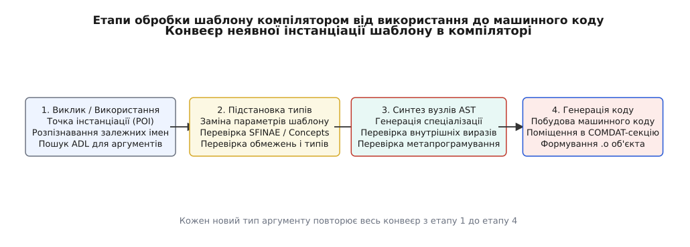
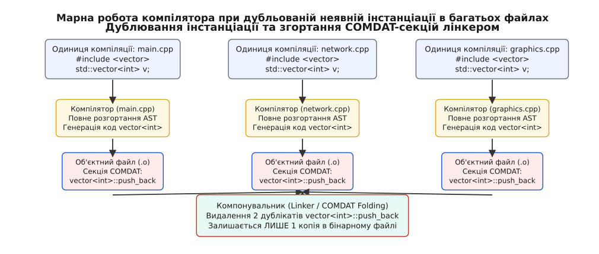
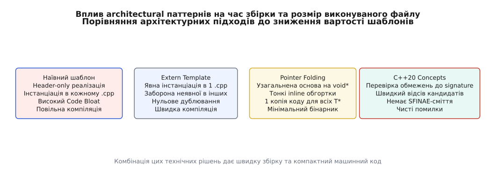

# Вартість інстанціації шаблонів: механіка компілятора, розростання коду й оптимізація

<preknowlist>
- [Правило ODR та зв'язування](topic:cpp-standards/odr-and-linkage) — ODR, секції COMDAT та усунення дублікатів на етапі компонування.
- [Вирішення перевантажень та SFINAE](topic:cpp-standards/overload-resolution) — підстановка аргументів шаблону та перевірка кандидатів.
</preknowlist>

У великомасштабних проектах мовою C++ модифікація одного базованого на шаблонах заголовочного файлу може спричинити справжній компіляційний колапс: час повторного складання проекту зростає з десятків секунд до півгодини, процес компілятора споживає десятки гігабайт оперативної пам'яті, а на серверах безперервної інтеграції виникають збої через вичерпання пам'яті (Out-of-Memory). Розробники часто сприймають цей процес як неминучу «плату за абстракцію», проте за затримками компіляції стоять цілком конкретні алгоритмічні фази аналізатора компілятора та особливості машинного коду.

Причина цієї проблеми полягає у принциповій відмінності між класичним звичайним кодом мови C та шаблонами C++. Звичайна функція оголошується один раз і вимагає постійного часу `O(1)` для синтаксичного аналізу її підпису. Використання ж шаблону запускає неявну інстанціацію (`implicit instantiation`) — комплексний процесорний алгоритм, який для кожної нової комбінації параметрів типів виконує розгортання абстрактного синтаксичного дерева (AST), перевіряє обмеження типів, аналізує контекст підстановки та знову й знову генерує машинний код для об'єктних модулів.

Ситуація множиться на рівень архітектури проекту через традиційну текстову модель включення заголовочних файлів (`#include`). Якщо один і той самий заголовок із шаблоном `std::vector<T>` включено у 200 різних одиниць компіляції (`.cpp` файлів), компілятор виконує повну інстанціацію `std::vector<int>` 200 разів поспіль. Отримані 199 дубльованих функцій згодом просто відкидаються компонувальником (лінкером), однак процесорний час та оперативна пам'ять, витрачені компілятором на їх повторне створення в кожному об'єктному модулі, втрачаються безповоротно.

## 1. Конвеєр неявної інстанціації: від точки POI до AST

Щоб зрозуміти, куди саме зникають секунди й гігабайти під час компіляції шаблонного коду, необхідно детально простежити конвеєр неявної інстанціації шаблону всередині синтаксичного аналізатора (FrontEnd) компілятора.


*Етапи обробки шаблону компілятором від використання до машинного коду*

Процес інстанціації розпадається на чотири фундаментальні фази, кожна з яких має свою алгоритмічну складність та ціну в ресурсах:

### Фаза 1. Точка інстанціації (POI) та двофазний пошук імен

Коли компілятор зустрічає шаблонний клас чи функцію при першому прочитанні заголовочного файлу, він виконує першу фазу пошуку імен (`Phase 1 Name Lookup`). На цьому етапі перевіряються лише ті імена, які не залежать від параметрів шаблону (незалежні імена, `non-dependent names`). Сам шаблон залишається у вигляді абстрактного синтаксичного шаблону і не генерує жодних інструкцій.

Справжня робота починається в точці інстанціації (Point of Instantiation, `POI`) — конкретному місці у коді, де шаблон викликається з конкретними аргументами типів, наприклад `std::vector<double> v;`. У цій точці компілятор виконує другу фазу пошуку імен (`Phase 2 Name Lookup`), яка включає пошук, залежний від аргументів (Argument-Dependent Lookup, `ADL`). Для кожного аргументу компілятор змушений сканувати простір імен, у якому цей тип оголошено, будувати таблиці кандидатів та перевіряти їх доступність. Якщо параметром шаблону є складний тип із багатьма вкладеними шаблонами, пошук ADL може охоплювати десятки заголовочних файлів.

Історично у компіляторі MSVC тривалий час існував режим неповного двофазного пошуку (де імена розпізнавалися одночасно в точці виклику), що призводило до розбіжностей поведінки порівняно з GCC та Clang. Введення суворого режиму `/permissive-` у MSVC 2017 зрівняло поведінку компіляторів, підтвердивши алгоритмічну необхідність повторного виклику ADL на другій фазі.

### Фаза 2. Підстановка типів та канонізація в кеші компілятора

Отримавши конкретні типи-аргументи, компілятор виконує процедуру заміни параметрів шаблону відповідними типами у підписі та тілі шаблону. На цьому етапі відбуваються всі перевірки SFINAE (`Substitution Failure Is Not An Error`) або оцінка вимог C++20 Concepts. Компілятор змушений будувати тимчасові вирази, аби перевірити, чи є даний тип допустимим для обраного шаблону.

Отримавши підтверджений тип, компілятор перевіряє таблицю мемоїзації (Memoization Table / Type Canonicalization Cache). Оскільки `std::vector<int>` та `std::vector<signed int>` на рівні стандартної мови посилаються на один і той самий канонічний тип `TemplateSpecializationType`, компілятор згортає синоніми `typedef`/`using` до єдиного запису в таблиці типів.

Проте сам пошук у хеш-таблицях канонічних типів та порівняння декорованих імен (mangled names) не є безкоштовним. Якщо програма оперує метатипами типу `std::tuple<std::variant<T1, T2>, std::map<K, V>>`, ключ для хеш-таблиці типів може містити тисячі символів, перетворення яких вимагає інтенсивної роботи з пам'яттю.

### Фаза 3. Синтез вузлів абстрактного синтаксичного дерева (AST)

Отримуючи підтверджену комбінацію типів, компілятор розпочинає найважчу з точки зору оперативної пам'яті процедуру — синтез контурів конкретних класів та методів в абстрактному синтаксичному дереві (AST Synthesis).

Для кожного методу шаблонного класу, який був викликаний у коді, компілятор створює набір синтаксичних вузлів AST (`CXXRecordDecl`, `CXXMethodDecl`, `ParmVarDecl`, `SubstTemplateTypeParmType` у термонології LLVM/Clang). Кожен такий вузол є структурою в оперативній пам'яті обсягом від 64 до 256 байт. Якщо шаблон містить рекурсивне метапрограмування (наприклад, `std::tuple` з 20 елементів, де кожен елемент успадковує наступний), компілятор генерує ланцюжок із сотень вкладених класів, створюючи десятки тисяч вузлів AST.

Глибина цього рекурсивного розгортання контролюється спеціальним прапорцем компілятора `-ftemplate-depth=N` (за замовчуванням `1024`). Якщо рекурсивний метаалгоритм перевищує цю межу, компілятор аварійно зупиняє роботу. Проте навіть у межах дозволеної глибини нагромадження дерев AST швидко вичерпує кеш-пам'ять процесора і призводить до активного скидання даних у системну оперативну пам'ять.

Внутрішні арени пам'яті (Bump Allocators у Clang та GGC у GCC) не звільняють пам'ять згенерованих вузлів AST до повного завершення обробки об'єктного модуля. У компіляторі Clang арена `BumpPtrAllocator` виділяє великі безперервні блоки пам'яті розміром по 4 КБ та 64 КБ, пересуваючи лише один покажчик `CurPtr`. Цей алгоритм виділення є надзвичайно швидким (часова складність `O(1)`), але вивантажити назад окремі вузли AST, які виявилися непотрібними після перевірки SFINAE, компілятор фізично не може. В результаті вся відкинута метаструктурна пам'яті залишається в операційній системі до моменту завершення трансляції всієї одиниці компіляції. Тому великий `.cpp` файл з сотнями інстанціацій складних типів може миттєво спожити кілька гігабайт оперативної пам'яті.

Додатково слід ураховувати, що під час генерації вузлів синтаксичного дерева компілятор будує повні таблиці віртуальних методів (`vtable`), якщо шаблонний клас містить віртуальні функції або успадковує від віртуальних баз. Для кожної спеціалізації створюється власна таблиця `vtable`, яка виділяє пам'ять у секції констант `.rodata` та додає проміжні інструкції завантаження адрес у генераторі коду.

### Фаза 4. Декорування імен (Name Mangling) та формування об'єктних секцій

Під час створення символів для компонувальника кожна шаблонова спеціалізація повинна отримати абсолютно унікальне текстове ім'я в об'єктному файлі. Ця процедура називається декоруванням імен (Name Mangling).

У стандартах Itanium C++ ABI (використовується у GCC та Clang для Linux/macOS) та MSVC C++ ABI (використовується у Windows) закодоване ім'я містить повний опис параметрів типів. Наприклад, спеціалізація `std::vector<std::string>` у дворічному ланцюжку меташаблонів перетворюється на декорований рядок довжиною в кілька тисяч символів:

`_ZNSt6vectorINSt7__cxx1112basic_stringIcSt11char_traitsIcESaIcEEESaIS5_EE9push_backEOS5_`

Створення, запис та порівняння таких наддовгих рядків у таблиці символів (Symbol Table) та таблицях релокації (`.rel.text`) створюють колосальне навантаження на підсистему введення-виведення та пам'ять компонувальника.

На завершальному етапі компілятор передає згенероване синтаксичне дерево до генератора коду (BackEnd). Тут абстрактні вирази перетворюються на intermediate representation (LLVM IR або GCC GIMPLE), проходять оптимізаційні проходи реєстрового розподілу, вмикання функцій (inlining) та в результаті перетворюються на машинні інструкції асемблера. Отриманий машинний код упаковується в спеціальні секції об'єктного файлу `.o`.

## 2. Потрійне покарання: механіка Code Bloat та деградація I-Cache

Наслідки масової неявної інстанціації шаблонів не обмежуються тривалістю збірки. Вони створюють потрійне системне покарання для програми:

1. **Компіляційне покарання:** Повторний синтаксичний розбір і кодогенерація ідентичних типів у кожній одиниці компіляції.
2. **Дискове покарання:** Зростання розміру об'єктних файлів через розміщення однакового коду в багатьох `.o` файлах.
3. **Виконавче покарання (Runtime Penalty):** Розростання бінарного файлу (`Code Bloat`) та вимивання кешу інструкцій процесора.


*Марна робота компілятора при дубльованій неявній інстанціації в багатьох файлах*

### Механіка COMDAT та марна робота компілятора

Щоб уникнути помилок повторного визначення символів (ODR — One Definition Rule) при компонуванні заголовочних шаблонів, компілятори поміщають інстанційовані шаблони функцій у спеціальні секції об'єктного файлу — COMDAT-секції (у системі ELF — `.gnu.linkonce`, у PE/COFF — `IMAGE_COMDAT_SELECT_NODUPLICATES`).

Коли компонувальник (linker) збирає остаточний виконуваний файл із сотень об'єктних модулів, він виявляє однакові COMDAT-секції (наприклад, `std::vector<int>::push_back`), залишає лише одну копію коду у підсумковому бінарному файлі, а решту копій просто відкидає.

Хоча це дозволяє отримати працездатний бінарний файл, ціна досягнення цього результату є катастрофічною. Компілятор здійснює 100% роботи з кодогенерації для кожної одиниці компіляції, але 99% цієї роботи виявляються абсолютно марними.

Детальний історичний огляд боротьби з цією проблемою в компіляторах 1990-х років викладено в матеріалі [📜 Історія появи шаблонів, проблеми розростання коду та боротьби з тривалою компіляцією](topic:cpp-standards/instantiation-cost/hist-template-bloat.md).

### Особливості статичних змінних у шаблонах

Окремою небезпекою при неявній інстанціації шаблонів є використання локальних статичних змінних у шаблонних функціях:

```cpp
template <typename T>
void log_usage() {
    static int call_count = 0;
    ++call_count;
    // ...
}
```

Стандарт C++ вимагає, щоб кожна унікальна спеціалізація `log_usage<T>` мала свою власну ексклюзивну копію змінної `call_count`. Інстанціація `log_usage<int>` та `log_usage<double>` створює дві різні статичні змінні у секції `.bss` або `.data`.

Якщо шаблонну функцію викликають для 50 різних типів, компілятор створює 50 незалежних лічильників та 50 потокобезпечних прапорців ініціалізації (Guard Variables), що збільшує розмір даних програми та створює додаткові інструкції синхронізації `atomic` під час виклику.

### Вплив Code Bloat на кеш інструкцій (I-Cache) та ISA процесора

Навіть після того, як компонувальник усунув точні дублікати функцій, виникає друга фаза розростання коду. Розглянемо приклад інстанціації стандартного контейнера для різних типів вказівників:

```cpp
std::vector<Widget*>   v1;
std::vector<Device*>   v2;
std::vector<Texture*>  v3;
std::vector<Window*>   v4;
```

З точки зору типізації C++ — це чотири абсолютно різні класи. Компілятор змушений згенерувати чотири окремі спеціалізації для кожного типу. Проте на рівні 64-бітного машинного коду x86_64 або ARM64 вказівники `Widget*`, `Device*`, `Texture*` та `Window*` є абсолютно однаковими 64-бітними адресами в пам'яті!

В результаті виконуваний файл отримує чотири різні функції `vector<Widget*>::push_back`, `vector<Device*>::push_back` тощо. Вони містять абсолютно ідентичний набір інструкцій асемблера, але розташовані за різними адресами в пам'яті.

Під час виконання програми це призводить до системної деградації продуктивності:
- **L1 Instruction Cache Thrashing:** Замість того, щоб утримувати одну гарячу функцію у кеші інструкцій першого рівня (L1i розміром 32–64 КБ), процесор змушений завантажувати в кеш чотири різні машинні функції, що призводить до постійних промахів кешу (`I-cache misses`).
- **TLB Missprediction & BTB Thrashing:** Збільшується навантаження на буфер трансляції адреси інструкцій (Instruction TLB) та буфер передбачення переходів (Branch Target Buffer).
- **Зростання розміру бінарника:** Розмір секції коду (`.text`) зростає на сотні кілобайт чи мегабайт, збільшуючи час завантаження програми з диска в оперативну пам'яті.

### Взаємодія з міжмодульною оптимізацією (LTO / LTCG)

Застосування скрізної оптимізації на етапі компонування (Link-Time Optimization, LTO у GCC/Clang або Link-Time Code Generation, LTCG у MSVC) дозволяє частково вирішити проблему розростання коду. При збірці з `-flto` компілятор зберігає в об'єктних файлах не машинний код, а проміжне представлення LLVM IR чи GCC GIMPLE.

Під час компонування компонувальник аналізує увесь проект цілком, знаходить однакові тіла функцій для різних типів вказівників і об'єднує їх на рівні асемблера (Identical Code Folding, ICF). Проте LTO не вирішує проблему тривалості збірки — навпаки, час компонування зростає у кілька разів, оскільки вся важка робота з оптимізації переношується на останню монолітну фазу компонування.

## 3. Вартість вариативних шаблонів, tuples та виразових дерев

Окремою категорією високої компіляційної вартості є метаструктури стандартної бібліотеки C++ та шаблони виразів (Expression Templates).

### Квадратичне розростання `std::tuple` та `std::variant`

Класична реалізація `std::tuple<T1, T2, ..., TN>` у стандартній бібліотеці базується на рекурсивному спадкуванні або рекурсивній композиції. Для кортежу з 5 елементів `std::tuple<int, double, char, short, float>` компілятор генерує наступну ієрархію успадкування:

```
tuple<int, double, char, short, float>
 └── tuple_impl<0, int, double, char, short, float>
      └── tuple_impl<1, double, char, short, float>
           └── tuple_impl<2, char, short, float>
                └── tuple_impl<3, short, float>
                     └── tuple_impl<4, float>
```

Для одного кортежу з `N` елементів компілятор створює `N` окремих класів інстанціації. Якщо у програмі використовується сортування або трансформація кортежів через `std::apply` або `std::tuple_cat`, кількість проміжних типів досягає квадратичної складності `O(N²)`.

Аналогічно, реалізація `std::variant<T1, ..., TN>` та функції `std::visit` вимагає генерації таблиці віртуальних або функціональних покажчиків розміром `Nᵐ` для `M` аргументів варіанту. Виклик `std::visit` для 3 варіантів по 10 типів змушує компілятор згенерувати та оптимізувати таблицю з 10³ = 1000 інстанціацій лямбда-функцій!

### Виразові шаблони (Expression Templates)

У бібліотеках високопродуктивних обчислень (наприклад, Eigen чи Blitz++) використовується техніка виразових шаблонів для об'єднання векторних операцій `A = B + C + D` в один цикл без створення тимчасових векторів.

Хоча це дає ідеальний машинний код, ціна компіляції є колосальною. Вираз `A + B + C + D` створює тип вида:

```cpp
AddExpr<AddExpr<Vector, Vector>, AddExpr<Vector, Vector>>
```

Компілятор змушений будувати гігантські шаблонові дерева типів, інстанціювати десятки операторів `operator+` та проводити важку процедуру `inlining` для згортання виразу в один цикл.

### Альтернатива C++20: `constexpr` та `consteval` замість TMP

З появою `constexpr` у C++11 та `consteval` у C++20 значну частину метаобчислень можна перенести з шаблонів на звичайні функції, що обчислюються у віртуальній машині компілятора (Constexpr Interpreter).

Використання `consteval`-функцій замість метаструктур типів дозволяє уникнути генерації додаткових класів у кеші AST. Обчислення виконуються над значеннями, а не над типами, що знижує витрати оперативної пам'яті компілятора на порядки.

## 4. Вартість перевірки обмежень: SFINAE проти C++20 Concepts

Окрім створення синтаксичних дерев для дійсних типів, колосальний обсяг процесорного часу витрачається компілятором на перевірку відкинутих типів під час вибору правильного перевантаження функції.

### Прихована ціна SFINAE

До появі C++20 основним інструментом вибору шаблонних функцій на основі властивостей типів був механізм SFINAE (`Substitution Failure Is Not An Error`) та вспомогательна метаструктура `std::enable_if_t`.

Розглянемо класичний приклад обмеження шаблону за допомогою SFINAE:

```cpp
template <typename T, typename std::enable_if_t<std::is_integral_v<T>, int> = 0>
void process_data(T value) {
    // Реалізація для цілочисельних типів
}

template <typename T, typename std::enable_if_t<std::is_floating_point_v<T>, int> = 0>
void process_data(T value) {
    // Реалізація для типів із плаваючою крапкою
}
```

Коли розробник викликає `process_data(42)`, компілятор повинен оцінити *всі* кандидатні шаблони у списку перевантаження:

1. Для першого шаблону компілятор підставляє `T = int`, інстанціює меташаблон `std::is_integral<int>`, розгортає його структуру, знаходить константу `value = true`, після чого інстанціює `std::enable_if<true, int>` і отримує тип `int`. Шаблон визнано придатним.
2. Для другого шаблону компілятор підставляє `T = int`, інстанціює `std::is_floating_point<int>`, генерує AST для цієї спеціалізації, знаходить `value = false`, інстанціює `std::enable_if<false, int>`, виявляє відсутність внутрішнього типу `type`, фіксує помилку підстановки і **тихо відкидає** цього кандидата.

Зверніть увагу: компілятор використав процесорний час та пам'ять на інстанціацію `std::is_floating_point<int>` та `std::enable_if<false, int>` лише для того, щоб підтвердити, що другий шаблон *не* підходить! Якщо у списку перевантаження є 20 шаблонних функцій з різними виразами SFINAE, компілятор інстанціює десятки допоміжних структур для кожного виклику, а потім викидає їх із розгляду.

Крім того, при помилці виклику компілятор формує розлеглі списки діагностичних повідомлень (Template Backtrace Explosion), виводячи в консоль сотні рядків із поясненнями, чому саме кожен із 20 кандидатів був відкинутий.

### Алгоритмічна перевага C++20 Concepts та Subsumption

Введення Концептів (Concepts) у C++20 кардинально змінило математику перевірки обмежень типів.

Розглянемо той самий приклад, переписаний із використанням концептів:

```cpp
template <std::integral T>
void process_data(T value) {
    // Реалізація для цілочисельних типів
}

template <std::floating_point T>
void process_data(T value) {
    // Реалізація для типів із плаваючою крапкою
}
```

Відмінність у поведінці компілятора є принциповою:
- Концепт перевіряється **до** підстановки типів у підпис функції та до генерації тіла шаблону.
- Обмеження (Constraint Expression) обчислюються у вигляді логічних виразів над типами без інстанціації допоміжних типів-обгорток на кшталт `enable_if`.
- Компілятор застосовує коротке замикання обчислень (Short-Circuit Evaluation): якщо перша умова концепту `integral<T>` виявилася хибною, подальші складні перевірки концепту навіть не починають обчислюватися.
- Якщо кандидатура відкидається на рівні концепту, компілятор не будує синтаксичне дерево для тіла функції і не засмічує кеш типів.
- Додатково вмикається механізм включення концептів (Concept Subsumption Rule): компілятор логічно порівнює графи вимог і автоматично обирає більш специфічний концепт без складної SFINAE-амбівалентності.

Вимірювання на реальних кодових базах показують, що заміна SFINAE на C++20 Concepts у бібліотеках метапрограмування прискорює фазу перевірки типів у 3–8 разів і повністю усуває проблему гігантських повідомлень про помилки.

## 5. Архітектурні стратегії приборкання інстанціації

Оскільки вартість шаблонів закладена у мовну механіку C++, боротьба з нею вимагає свідомого застосування архітектурних паттернів проектування коду.


*Порівняння архітектурних підходів до зниження вартості шаблонів*

### Стратегія 1. Явна інстанціація та `extern template` (C++11)

Якщо у проекті існує популярний шаблонний клас (наприклад, `Array<T>`), який використовується у десятках модулів для стандартних типів (`int`, `double`, `std::string`), розробник може повністю виключити повторну неявну інстанціацію за допомогою `extern template`.

Метод складається з двох кроків:

1. У заголовочному файлі `Array.hpp` після оголошення класу додається заборона неявної інстанціації:

```cpp
// Array.hpp
template <typename T>
class Array {
public:
    void process();
    // ...
};

// Заборона неявної інстанціації у файлах, що включають цей заголовок
extern template class Array<int>;
extern template class Array<double>;
```

2. В одном-єдиному файлі реалізації `Array.cpp` додається явна інстанціація:

```cpp
// Array.cpp
#include "Array.hpp"

// Компілятор генерує машинний код для Array<int> і Array<double> ТІЛЬКИ ТУТ
template class Array<int>;
template class Array<double>;
```

У динамічних бібліотеках (`DLL` / `.so`) під час експорту шаблонного класу через межі бібліотеки застосовується комбінація прагм та специфікаторів експорту (`__declspec(dllexport)` у MSVC або `__attribute__((visibility("default")))` у GCC/Clang). Це дозволяє зібрати машинний код шаблону всередині бібліотеки, а клієнтські модулі лише посилаються на готові символи.

**Результат:** Усі 200 одиниць компіляції, що включають `Array.hpp`, при зустрічі `Array<int>` більше не будуть розгортати синтаксичне дерево і генерувати машинний код. Вони просто залишать зовнішнє посилання на символ, а компілятор збереже 99% часу на FrontEnd та BackEnd фазах.

### Стратегія 2. Ідіома нешаблонної основи (Non-Template Base Idiom)

Часто у шаблонному класі лише невелика частина коду дійсно залежить від параметра типу `T`. Операції з виділення пам'яті, перевірки меж, обробки помилок, логування та адміністрування покажчиків є однаковими для всіх типів.

Ідіома нешаблонної основи полягає у винесенні усієї незалежної від типу логіки в звичайний нешаблонний базовий клас:

```cpp
// Нешаблонний базовий клас (реалізація у .cpp файлі)
class RawVectorBase {
protected:
    void* data_;
    std::size_t capacity_;
    std::size_t size_;

    RawVectorBase();
    ~RawVectorBase();

    void raw_grow(std::size_t element_size);
    void raw_throw_out_of_range() const;
};

// Шаблонна обгортка (тільки тонкі inline-методи контролю типів)
template <typename T>
class Vector : private RawVectorBase {
public:
    void push_back(const T& val) {
        if (size_ >= capacity_) {
            raw_grow(sizeof(T));
        }
        new (static_cast<T*>(data_) + size_) T(val);
        ++size_;
    }

    T& at(std::size_t index) {
        if (index >= size_) raw_throw_out_of_range();
        return static_cast<T*>(data_)[index];
    }
};
```

Оскільки важкі методи `raw_grow` та `raw_throw_out_of_range` винесені у звичайний клас `RawVectorBase` і компілюються один раз у файлі `.cpp`, шаблон `Vector<T>` стає надзвичайно легким. Його методи повністю згортаються у крок `inline` під час оптимізації, не створюючи дубльованого машинного коду.

### Стратегія 3. Згортання вказівників (Pointer Folding / Type Erasure)

Для контейнерів та алгоритмів, що працюють з вказівниками, застосовується спеціалізація `Pointer Folding`. Усі типи вказівників `T*` делегують виконання єдиній реалізації над `void*`:

```cpp
// Базова реалізація для бестипових вказівників void*
template <>
class Vector<void*> : private RawVectorBase {
public:
    void push_back(void* val);
    void* get(std::size_t idx) const;
};

// Часткова спеціалізація для всіх вказівників T*
template <typename T>
class Vector<T*> : private Vector<void*> {
public:
    void push_back(T* val) {
        Vector<void*>::push_back(static_cast<void*>(val));
    }

    T* get(std::size_t idx) const {
        return static_cast<T*>(Vector<void*>::get(idx));
    }
};
```

Цей підхід використовується у реалізації `std::vector<T*>` у бібліотеках libstdc++ (GCC) та libc++ (Clang). Незалежно від того, скільки тисяч різних типів вказівників використовується у програмі, генерується лише один випадок машинного коду для `Vector<void*>`.

### Стратегія 4. Модулі C++20 (Modules)

Найбільш фундаментальним рішенням проблеми повторного читання заголовочних файлів є перехід на Модулі C++20 (`import my_module;`).

На відміну від заголовочних файлів `#include`, які кожен раз повторно обробляються препроцесором, модуль C++ компілюється в бінарний інтерфейс модулів (Binary Module Interface, `BMI`). При імпорті модуля компілятор завантажує вже готове, розібране синтаксичне дерево шаблону. Це усуває фазу текстового аналізу препроцесора і знижує час первинного розбору заголовочного тексту в 5–20 разів.

Повний проект із вимірювання та оптимізації реального шаблонного контейнера з порівняльним аналізом до й після рефакторингу розібрано у практичному матеріалі [⚙️ Практика вимірювання й оптимізації вартості інстанціації шаблонів](topic:cpp-standards/instantiation-cost/proj-instantiation-profiling.md).

## 6. Профілювання та інструментальний аналіз збірки

Оптимізація вартості шаблонів не повинна виконуватися наосліп. Сучасні інструменти профілювання компіляції дозволяють точно локалізувати «найважчі» інстанціації у кодовій базі.

### Інструменти діагностики компіляції

- **Clang `-ftime-trace`:** Згенеровує файл JSON у форматі Chrome Tracing, який показує часову шкалу компіляції. Дозволяє візуалізувати фази `InstantiateClass` та `InstantiateFunction` для кожного типу у браузері `chrome://tracing` або на `speedscope.app`.
- **GCC `-ftime-report`:** Друкує підсумкову текстову таблицю витрат часу процесора на різні фази трансляції (синтаксичний аналіз, оптимізація, генерація коду).
- **MSVC `/bt` та `/ftime`:** Опції компілятора Microsoft для виводу тривалості збірки заголовочних файлів та підсистем кодогенерації `c1xx.dll` і `c2.dll`.
- **Clang Build Analyzer (`clang-build-analyzer`):** Утиліта командного рядка, яка збирає `.time-trace` файли по всьому проекту й будує агрегований звіт із зазначенням найповільніших заголовочних файлів та шаблонів.

Регулярне застосування цих інструментів у комбінації з автоматизованими скриптами збірки дає змогу команді інженерів тримати тривалість компіляції під повним контролем, запобігаючи деградації продуктивності розробників.

Повний довідник прапорців компіляторів, опцій профілювання та параметрів діагностики наведено у матеріалі [📋 Довідник прапорців та інструментів діагностики інстанціації компіляторів GCC, Clang і MSVC](topic:cpp-standards/instantiation-cost/api-compiler-diagnostics.md).

## 7. Інженерний компроміс: швидкість збірки проти продуктивності

При оптимізації вартості шаблонів архітектор C++ завжди вирішує багатокритеріальну задачу компромісу між трьома фундаментальними параметрами:

```
                      Швидкість збірки
                      (Compile Time)
                           ▲
                          / \
                         /   \
                        /     \
                       /  C++  \
                      /   Comp  \
                     /           \
                    /─────────────\
Швидкість виконання ◄─────────────► Розмір бінарника
(Runtime Performance)               (Binary Size / Code Bloat)
```

1. **Максимальна продуктивність виконання (Zero-Overhead):** Агресивне використання header-only шаблонів, вбудовування функцій (inlining) та виразових шаблонів дає максимально швидкий код під час виконання, але сплачується повільною компіляцією та великим розміром бінарного файлу.
2. **Максимальна швидкість збірки:** Повна винесення логіки в нешаблонні базові класи, використання `extern template` та динамічного поліморфізму (`virtual`) прискорюють компіляцію у рази, але додають один рівень непрямого виклику (indirection) під час виконання.
3. **Оптимальний інженерний баланс:** Використання шаблонів там, де це критично для алгоритмічної швидкості (гарячі цикли, контейнери базових типів), і застосування `Pointer Folding`, `extern template` та нешаблонних основ у загальній бізнес-логіці програми.

### Чек-лист для архітектора C++-систем

Для запобігання компіляційній деградації у великих проектах дотримуйтесь наступних практичних правил:

- **Профілювання до рефакторингу:** Використовуйте `-ftime-trace` для точного пошуку пляшок вузьких місць у збірці перед тим, як переписувати шаблони.
- **Розділення оголошення та логіки:** Застосовуйте ідіому нешаблонного базового класу для винесення важкої обробки пам'яті та винятків у файли `.cpp`.
- **Явна інстанціація для гарячих типів:** Впроваджуйте `extern template` для класів, що часто інстанціюються фундаментальними типами.
- **Використання C++20 Concepts:** Замінюйте заплутаний SFINAE на концептуальні обмеження `requires`.
- **Згортання типів указівників:** Застосовуйте `Pointer Folding` для контейнерів над вказівниками.

> 🔧 **Навіщо це.**
> Розуміння механіки та вартості інстанціації шаблонів перетворює компілятор C++ з «чорного ящика», що випадково зависає на півгодини, на повністю керований інженерний інструмент. Застосування `extern template`, нешаблонних базових класів та згортання типів дозволяє скоротити час збірки великих систем у 3–5 разів, зменшити споживання пам'яті компілятором на серверах CI/CD та покращити локальність кешу інструкцій процесора під час виконання програми.
