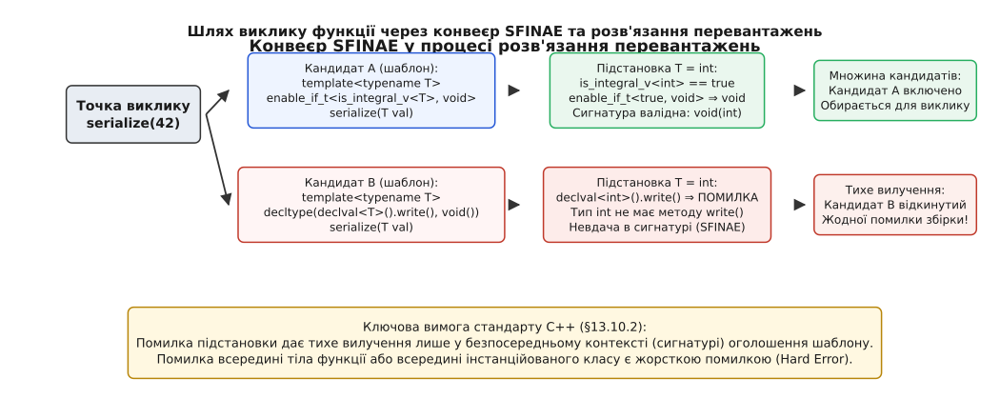
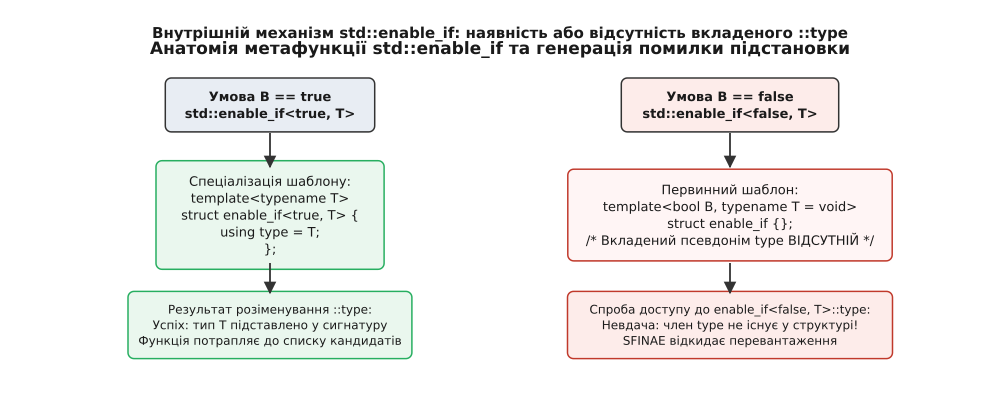
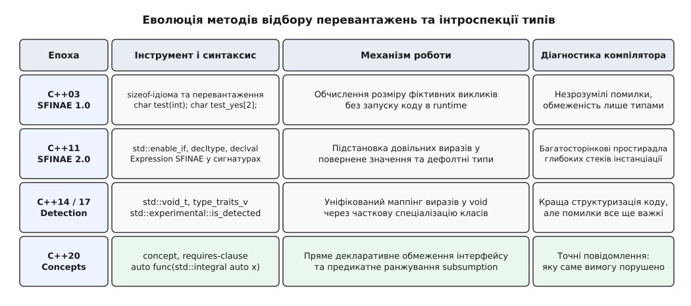

# SFINAE й enable_if: відбір перевантажень

<preknowlist>
- [Шаблони: параметризація типом](book:cpp-standards/templates-basics) — що таке параметр-тип шаблону, синтаксис `template<typename T>` та інстанціація функцій.
- [Виведення аргументів шаблону](book:cpp-standards/template-argument-deduction) — як компілятор зіставляє типи виклику з параметрами шаблону.
- [Розв'язання перевантажень](book:cpp-standards/overload-resolution) — алгоритм формування списку кандидатів, відбору придатних функцій та вибору найкращого перевантаження.
- [Метапрограмування та метадані типів: std::type_traits](book:cpp-standards/type-traits) — предикати властивостей типів `is_integral`, `is_pointer` та робота з константами компіляції.
</preknowlist>

Уявімо узагальнену функцію збереження даних `serialize`, яка повинна записувати значення різних типів у мережевий або дисковий буфер. Для скалярних цілих чисел (як-от `int` чи `uint64_t`) найшвидший спосіб полягає у прямому копіюванні сирих байтів через системні інструкції. Для складних об'єктів (наприклад, структур користувача чи транзакцій) необхідно викликати їхній власний внутрішній метод `obj.serialize(buffer)`. Якщо написати дві наївні функції у вигляді звичайного перевантаження:

```cpp
// Перевантаження 1: для цілих чисел
template<typename T>
void serialize(Buffer& buf, T val) {
    buf.write_bytes(&val, sizeof(val));
}

// Перевантаження 2: для класів із власним методом
template<typename T>
void serialize(Buffer& buf, const T& obj) {
    obj.serialize(buf);
}
```

Під час спроби скомпілювати виклик `serialize(buf, 42)` транслятор зупинить збірку з фатальною помилкою. Обидва шаблони однаково успішно приймають цілочисловий аргумент `int`. Компілятор бачить два рівноцінні кандидати й фіксує неоднозначність виклику (ambiguous call). Якщо ж прибрати перше перевантаження і залишити лише друге, компілятор спробує інстанціювати його тіло для `T = int`, де вираз `42.serialize(buf)` призведе до краху компіляції: примітивний тип `int` не є класом і не має жодних методів.

Цей конфлікт виникає через фундаментальну властивість шаблонів: неперевантажений шаблон `template<typename T>` є жадібним — він зіставляється з будь-яким переданим типом. Щоб організувати умовний відбір функцій, програмісту потрібен інструмент, який вилучає невідповідні шаблони зі списку кандидатів ще на етапі аналізу сигнатури, задовго до спроби генерації тіла функції. Таким інструментом у класичному C++ є правило **SFINAE** та стандартна метафункція **`std::enable_if`**.

## Принцип SFINAE: чому помилка підстановки не ламає компіляцію

Термін **SFINAE** (абревіатура від англ. *Substitution Failure Is Not An Error* — «невдача підстановки не є помилкою») закріплює базове правило стандарту C++ (§13.10.2 [temp.deduct]): якщо під час виклику перевантаженої функції підстановка виведеного або явно переданого типу в сигнатуру шаблону призводить до синтаксично некоректного виразу, ця помилка не зупиняє компіляцію програми, а лише змушує транслятор тихо вилучити цей конкретний шаблон із множини кандидатів.

Щоб зрозуміти, у якій саме точці вмикається це правило, простежимо повний шлях виклику функції через конвеєр компілятора:



*Етапи обробки виклику: відкидання невідповідного шаблону за правилом SFINAE та вибір єдиного валідного кандидата.*

Конвеєр розв'язання перевантажень (Overload Resolution) складається з шести послідовних кроків:

1. **Пошук імен (Name Lookup):** Компілятор знаходить усі оголошення функцій та шаблонів функцій з іменем `serialize`, видимі у поточній області видимості або доступні через пошук Кеніга (ADL).
2. **Виведення аргументів шаблону (Template Argument Deduction):** Для кожного знайденого шаблону компілятор аналізує типи фактичних аргументів у точці виклику та зіставляє їх із формою параметрів шаблону.
3. **Підстановка типів (Substitution):** Отримані типи підставляються у сигнатуру шаблону — у тип повернення, типи параметрів функції та вирази параметрів шаблону за замовчуванням.
4. **Оцінка валідності сигнатури (SFINAE):**
   - Якщо підстановка сформувала коректну сигнатуру, функція додається до **множини придатних кандидатів** (Viable Functions Set).
   - Якщо підстановка утворила невалідний тип (наприклад, звернення до неіснуючого поля `typename T::value_type` для `T = int`), компілятор не видає діагностичного повідомлення про помилку. Він просто мовчки відкидає цю спеціалізацію.
5. **Розв'язання перевантажень (Overload Resolution):** Серед усіх функцій, які успішно пройшли етап підстановки, обирається найкраща відповідно до правил неявних перетворень та часткового впорядкування шаблонів.
6. **Інстанціація тіла (Body Instantiation):** Лише для однієї обраної функції компілятор починає перевірку та компіляцію інструкцій всередині фігурних дужок `{ ... }`.

Детальний аналіз того, як історично з'явилося це правило у роботах Девіда Вандевурда та як воно лягло в основу сучасних бібліотек, наведено в нарисі [Еволюція SFINAE: від зауваження до мовного стандарту](book:cpp-standards/sfinae-and-enable-if/hist-sfinae-evolution.md).

### Формальний перелік помилок підстановки за стандартом ISO C++

Стандарт мови C++ у розділі §13.10.2 [temp.deduct] чітко визначає вичерпний перелік ситуацій, які кваліфікуються як невдача підстановки SFINAE:

- **Спроба використати тип у кваліфікованому імені**, якщо цей тип не є класом або переліком (наприклад, вираз `T::type`, коли `T` виявився `int` чи `double*`).
- **Спроба звернутися до неіснуючого члена класу або типу**, коли у структурі немає вкладеного `typedef`, поля або методу з таким ім'ям.
- **Спроба створити посилання на `void`** (`void&`), посилання на посилання (`T& &` до появи правил згортання посилань у C++11), або покажчик на посилання (`T&*`).
- **Спроба створити масив із типом елементів `void`**, масив функцій, масив посилань або масив із від'ємним чи нульовим розміром під час підстановки констант компіляції.
- **Спроба використати тип, який порушує обмеження прав доступу** (якщо підстановка звертається до закритого `private` або захищеного `protected` члена класу в публічному контексті).
- **Спроба виконати невалідне перетворення типів у параметрах або виразах за замовчуванням**, якщо типи виявляються несумісними.
- **Спроба обчислити вираз, який є синтаксично некоректним** у неоцінюваному контексті оператора `decltype` (наприклад, виклик неіснуючого оператора чи функції без сумісних перевантажень).

Кожен із цих випадків у разі виникнення безпосередньо у сигнатурі шаблону розглядається компілятором як м'яка відмова: шаблон тихо залишає список кандидатів.

### Межа дії: безпосередній контекст проти жорстких помилок

Правило SFINAE діє не всюди. Стандарт мови чітко розмежовує помилки у **безпосередньому контексті** (Immediate Context) та помилки на наступних фазах трансляції.

Безпосередній контекст охоплює виключно оголошення самого шаблону функції:
- Вирази у типі повернення функції;
- Типи формальних параметрів функції;
- Вирази та типи у списку параметрів самого шаблону `template<...>`;
- Специфікацію винятків `noexcept(...)`.

Якщо помилка виникає за межами цих елементів, компілятор генерує **жорстку помилку збірки** (Hard Error), яка негайно зупиняє побудову проєкту:

```cpp
template<typename T>
struct Helper {
    // Якщо T = int, вираз T::value_type — це жорстка помилка всередині класу!
    using type = typename T::value_type;
};

// Небезпечний шаблон: помилка виникає під час інстанціації зовнішнього Helper<T>
template<typename T>
typename Helper<T>::type process_bad(T val);

// Безпечний шаблон: помилка виникає безпосередньо у сигнатурі функції
template<typename T>
typename T::value_type process_good(T val);

int main() {
    // process_good(10); // SFINAE спрацює: кандидат тихо відкинеться
    // process_bad(10);  // КРАХ ЗБІРКИ: Hard Error всередині Helper<int>!
}
```

У виклику `process_bad(10)` звернення до `Helper<int>` вимагає повної інстанціації структури `Helper`. Оскільки помилка виникла всередині тіла іншого класу, а не безпосередньо у сигнатурі функції `process_bad`, захисний щит SFINAE не спрацьовує.

> 🔧 **Навіщо це.** Розмежування контекстів захищає компілятор від нескінченного рекурсивного розгортання всього коду проєкту під час простого пошуку функції: помилка підстановки відсікає лише верхній рівень інтерфейсу, але не маскує внутрішніх дефектів реалізації у типах-помічниках.

## Анатомія std::enable_if та генерація штучної помилки підстановки

Саме по собі правило SFINAE лише захищає від випадкових збоїв типізації. Щоб перетворити його на керований механізм відбору перевантажень, необхідно вміти штучно генерувати помилку підстановки тоді, коли певна логічна умова компіляції не виконується. Для цього бібліотека `<type_traits>` надає шаблонний інструмент **`std::enable_if`**.

Внутрішня побудова `std::enable_if` вражає своєю лаконічністю. Вона складається з первинного шаблону та однієї часткової спеціалізації:

```cpp
namespace std {
    // 1. Первинний шаблон для хибної умови (B == false)
    template<bool B, typename T = void>
    struct enable_if {};

    // 2. Часткова спеціалізація для істинної умови (B == true)
    template<typename T>
    struct enable_if<true, T> {
        using type = T;
    };

    // 3. Допоміжний псевдонім (починаючи з C++14)
    template<bool B, typename T = void>
    using enable_if_t = typename enable_if<B, T>::type;
}
```

Механіка взаємодії `std::enable_if` із компілятором показана на діаграмі:



*Розгалуження підстановки залежно від булевої константи компіляції: наявність або відсутність вкладеного псевдоніма type.*

Розглянемо обидві гілки виконання:
1. **Умова `B` обчислюється як `true`:** Компілятор обирає часткову спеціалізацію `enable_if<true, T>`. Усередині цієї структури визначено псевдонім `using type = T`. Вираз `typename std::enable_if<true, T>::type` успішно розкривається у тип `T`, сигнатура функції стає валідною, і шаблон додається до списку кандидатів.
2. **Умова `B` обчислюється як `false`:** Компілятор звертається до первинного шаблону `enable_if<false, T>`. Ця структура є абсолютно порожньою — у ній **взагалі немає члена з іменем `type`**. Спроба компілятора отримати доступ до неіснуючого `::type` негайно спричиняє помилку підстановки (Substitution Failure).

Оскільки цей запис розміщується безпосередньо у сигнатурі шаблонної функції, увімкнене правило SFINAE тихо викреслює цей шаблон зі списку доступних перевантажень.

Повний опис усіх стандартних метафункцій керування сигнатурами та їхніх формальних гарантій зібрано у [Довіднику інтерфейсів: std::enable_if, void_t та правила підстановки](book:cpp-standards/sfinae-and-enable-if/api-enable-if.md).

## Три класичні точки розміщення enable_if у коді

Існує три канонічні способи інтеграції `std::enable_if` у сигнатуру шаблонної функції. Кожен із них має власні переваги, обмеження та приховані пастки.

### 1. У типі повернення функції

Найбільш наочний спосіб полягає у заміні звичайного типу повернення на вираз `std::enable_if_t`:

```cpp
// Активується тільки для цілих типів (int, short, long тощо)
template<typename T>
std::enable_if_t<std::is_integral_v<T>, void>
process(T val) {
    std::cout << "Обробка цілого числа: " << val << "\n";
}

// Активується тільки для чисел із плаваючою крапкою (float, double)
template<typename T>
std::enable_if_t<std::is_floating_point_v<T>, void>
process(T val) {
    std::cout << "Обробка дійсного числа: " << val << "\n";
}
```

У разі використання пізнього уточнення типу повернення (trailing return type) синтаксис стає ще чистішим:

```cpp
template<typename T>
auto compute(T a, T b) -> std::enable_if_t<std::is_arithmetic_v<T>, T> {
    return a + b;
}
```

**Обмеження:** Цей підхід категорично не працює для:
- **Конструкторів класу** (вони взагалі не мають типу повернення);
- **Операторів перетворення типів** на кшталт `operator int()` (тип повернення жорстко заданий ім'ям оператора);
- **Деструкторів**.

### 2. У додатковому параметрі функції за замовчуванням

Другий підхід додає до списку параметрів функції фіктивний неіменований параметр із вказівником або нульовим значенням за замовчуванням:

```cpp
template<typename T>
void process(T val, std::enable_if_t<std::is_integral_v<T>>* = nullptr) {
    std::cout << "Ціле число через параметр\n";
}
```

Якщо умова `std::is_integral_v<T>` істинна, тип другого параметра перетворюється на `void* = nullptr`. Якщо хибна — генерація типу параметра зазнає невдачі SFINAE.

**Переваги:** Цей підхід підходить для конструкторів:

```cpp
class SmartBuffer {
public:
    // Конструктор тільки для контейнерів
    template<typename Container,
             std::enable_if_t<std::is_class_v<Container>>* = nullptr>
    explicit SmartBuffer(const Container& c);
};
```

**Недоліки:** Зайвий параметр потрапляє у відкриту сигнатуру функції. Це псує автодоповнення в IDE та документацію Doxygen, а користувач теоретично може помилково передати туди зайвий аргумент `process(42, nullptr)`.

### 3. У параметрі самого шаблону (NTTP проти Type Parameter)

Третій спосіб розміщує перевірку у списку параметрів шаблону `template<...>`:

```cpp
// НАЇВНИЙ ПІДХІД ІЗ ПРИХОВАНОЮ ПАСТКОЮ
template<typename T,
         typename = std::enable_if_t<std::is_integral_v<T>>>
void print_value(T val);

template<typename T,
         typename = std::enable_if_t<std::is_floating_point_v<T>>>
void print_value(T val); // ПОМИЛКА КОМПІЛЯЦІЇ!
```

> ⚠️ **Критична пастка ODR:** Чому наведений вище код не скомпілюється?
> За правилами C++ значення параметрів шаблону за замовчуванням **не входять до сигнатури функції**. З точки зору компілятора обидва рядки оголошують абсолютно однаковий шаблон: `template<typename T, typename> void print_value(T)`. Друге оголошення сприймається не як перевантаження, а як нелегійна повторна декларація (redefinition of function template) з конфліктом аргументів за замовчуванням!

Щоб обійти цю проблему, використовують **нетипові параметри шаблону** (Non-Type Template Parameters, NTTP). Ми задаємо унікальний тип самого параметра шаблону через `enable_if_t`:

```cpp
// ПРАВИЛЬНИЙ СИСТЕМНИЙ ПІДХІД
template<typename T,
         std::enable_if_t<std::is_integral_v<T>, int> = 0>
void print_value(T val) {
    std::cout << "Integral: " << val << "\n";
}

template<typename T,
         std::enable_if_t<std::is_floating_point_v<T>, int> = 0>
void print_value(T val) {
    std::cout << "Floating: " << val << "\n";
}
```

У цьому випадку перший шаблон має сигнатуру `template<typename T, int> void print_value(T)`, коли `T` цілочисловий. Для дійсного типу `T` тип нетипового параметра взагалі не утворюється. Оскільки типи параметрів шаблону різняться залежно від умов, компілятор розглядає їх як незалежні перевантаження, що усуває конфлікт сигнатур.

### SFINAE у частковій спеціалізації шаблонів класів

На відміну від функцій, які можна вільно перевантажувати, шаблони класів у C++ не підтримують класичного перевантаження імен. Усі розгалуження поведінки для класів реалізуються виключно через **часткову спеціалізацію шаблонів**.

Щоб інтегрувати SFINAE у спеціалізацію класів, у первинному шаблоні оголошують додатковий неіменований параметр-тип, значенням якого за замовчуванням є `void`:

```cpp
// 1. Первинний шаблон із фіктивним параметром Enable = void
template<typename T, typename Enable = void>
struct Formatter {
    static void format(const T& val) {
        std::cout << "Базове загальне форматування об'єкта\n";
    }
};

// 2. Спеціалізація для цілих типів
template<typename T>
struct Formatter<T, std::enable_if_t<std::is_integral_v<T>>> {
    static void format(const T& val) {
        std::cout << "Швидке форматування цілого числа: " << val << "\n";
    }
};

// 3. Спеціалізація для покажчиків
template<typename T>
struct Formatter<T, std::enable_if_t<std::is_pointer_v<T>>> {
    static void format(const T& val) {
        std::cout << "Шістнадцятковий вивід адреси: " << static_cast<const void*>(val) << "\n";
    }
};
```

Коли користувач записує `Formatter<int>::format(42)`:
1. Другим аргументом за замовчуванням стає `void`.
2. Компілятор перевіряє спеціалізацію для цілих чисел: `enable_if_t<true>` розгортається у `void`.
3. Оскільки форма `Formatter<int, void>` точно збігається зі спеціалізацією, компілятор обирає оптимізовану версію для цілих чисел.

### Класичний випадок: захист універсального конструктора перенаправлення

Одним із найвідоміших застосувань `std::enable_if` є розв'язання конфлікту між універсальним шаблонним конструктором (Forwarding Constructor) та звичайним конструктором копіювання класу.

Уявімо клас обгортки `NamedItem`:

```cpp
class NamedItem {
public:
    std::string name;

    // Універсальний конструктор для ініціалізації рядком або типами, що перетворюються на string
    template<typename T>
    explicit NamedItem(T&& str) : name(std::forward<T>(str)) {}

    NamedItem(const NamedItem& other) = default;
    NamedItem(NamedItem&& other) noexcept = default;
};
```

Коли програміст створює неконстантний екземпляр класу `NamedItem item1("test")` і намагається скопіювати його `NamedItem item2(item1)`, компілятор запускає розв'язання перевантажень між конструктором копіювання `NamedItem(const NamedItem&)` та шаблоном `NamedItem(T&&)`.

Для неконстантного lvalue-об'єкта `item1` точний тип аргументу є `NamedItem&`. Конструктор копіювання вимагає перетворення з `NamedItem&` на `const NamedItem&` (додавання кваліфікатора const). Натомість у шаблоні параметр `T` виводиться як `NamedItem&`, і параметр `T&&` згортається у точний тип `NamedItem&`. Компілятор обирає шаблон як точніше співпадіння! Шаблон намагається виконати `name(item1)` — тобто сконструювати рядок із об'єкта `NamedItem`, що призводить до незрозумілої помилки компіляції всередині `std::string`.

Використання `std::enable_if` відновлює коректний порядок:

```cpp
class NamedItem {
public:
    std::string name;

    template<typename T,
             std::enable_if_t<!std::is_same_v<std::decay_t<T>, NamedItem>, int> = 0>
    explicit NamedItem(T&& str) : name(std::forward<T>(str)) {}

    NamedItem(const NamedItem& other) = default;
    NamedItem(NamedItem&& other) noexcept = default;
};
```

Предикат `!std::is_same_v<std::decay_t<T>, NamedItem>` гарантує, що коли аргументом є сам об'єкт `NamedItem` (незалежно від посилань та `const`), шаблонний конструктор тихо відкидається за правилом SFINAE, дозволяючи штатному конструктору копіювання виконати свою роботу.

## SFINAE на базі виразів: Expression SFINAE, decltype та std::declval

До появи стандарту C++11 відбір перевантажень обмежувався перевіркою наявності вкладених типів (`typename T::iterator`) або громіздкими трюками з обчисленням розмірів `sizeof(test(0))`. У стандарті C++11 відбулася революція: було впроваджено **Expression SFINAE** (документ N2242), що дозволило перевіряти синтаксичну валідність довільних виразів C++.

Ключовими інструментами цього підходу є оператор отримання типу виразу `decltype` та стандартна функція `std::declval`.

### Механіка std::declval у неоцінюваному контексті

Функція `std::declval<T>()` дозволяє «створити» умовне rvalue-посилання на об'єкт типу `T` під час компіляції без виклику справжнього конструктора:

```cpp
#include <utility>

// Нехай клас не має конструктора за замовчуванням або має приватний конструктор:
class NonDefaultConstructible {
public:
    NonDefaultConstructible(int, double);
    int get_code() const;
};
```

Спроба записати `decltype(NonDefaultConstructible().get_code())` викличе помилку, оскільки у класу немає конструктора без аргументів `()`. Використання `std::declval` розв'язує цю проблему:

```cpp
using ReturnType = decltype(std::declval<NonDefaultConstructible>().get_code()); // int
```

Функція `std::declval<T>()` існує виключно у неоцінюваному контексті (Unevaluated Context) — всередині `decltype`, `sizeof` або `noexcept`. Вона взагалі не має виконуваного тіла: спроба викликати її у runtime призведе до помилки компонувальника.

Зверніть увагу на правила згортання посилань:
- `std::declval<T>()` повертає тип `T&&` (rvalue-посилання);
- `std::declval<T&>()` повертає тип `T&` (lvalue-посилання);
- `std::declval<const T&>()` повертає `const T&`.

Це критично важливо під час перевірки методів, які кваліфіковані за `const` або вимагають виклику тільки на тимчасових rvalue-об'єктах (`void func() &&`).

### Трюк з оператором «кома» для перевірки методів

Щоб перевірити, чи підтримує тип `T` певний метод або операцію (наприклад, виведення у потік `std::cout << val`), застосовують ідіому послідовного обчислення через кому:

```cpp
template<typename T>
auto dump_to_stream(std::ostream& os, const T& obj) 
    -> decltype(os << obj, void()) 
{
    os << obj;
}
```

Розберемо конструкцію `decltype(os << obj, void())`:
1. Компілятор аналізує перший вираз `os << obj`. Якщо для типу `T` оператор `<<` не визначено, підстановка виразу зазнає невдачі, і за правилом SFINAE шаблон мовчки відкидається.
2. Якщо оператор `<<` валідний, оператор «кома» відкидає результат оператора `<<` та повертає другий вираз `void()`.
3. Тип повернення функції успішно обчислюється як `void`.

## Ідіома виявлення та універсальний перетворювач std::void_t

Хоча Expression SFINAE дозволяє перевіряти довільні операції, виписування складних сигнатур безпосередньо біля функцій швидко перетворює код на важкочитаний лабіринт. У стандарті C++17 з'явився інструмент, який уніфікував створення трейтів інтроспекції — **`std::void_t`** (запропонований Волтером Брауном у документі N3928):

```cpp
namespace std {
    template<typename...>
    using void_t = void;
}
```

Шаблон `std::void_t` приймає довільну кількість типів і завжди трансформує їх у звичайний тип `void`. Проте якщо будь-який із типів-аргументів є невалідним виразом `decltype(...)`, підстановка зазнає краху.

На базі `std::void_t` будується канонічна **ідіома виявлення** (Detection Idiom):

```cpp
// Крок 1: Первинний шаблон (за замовчуванням властивість відсутня)
template<typename T, typename = void>
struct has_clone_method : std::false_type {};

// Крок 2: Часткова спеціалізація для валідного виразу
template<typename T>
struct has_clone_method<T, std::void_t<
    decltype(std::declval<const T&>().clone())
>> : std::true_type {};

// Зручний константний доступ (C++17)
template<typename T>
inline constexpr bool has_clone_method_v = has_clone_method<T>::value;
```

Коли ми запитуємо `has_clone_method_v<MyClass>`:
- Якщо `MyClass` містить метод `.clone()`, вираз `std::declval<const MyClass&>().clone()` є валідним, `std::void_t<...>` перетворюється на `void`, і компілятор обирає часткову спеціалізацію, яка повертає `true_type`.
- Якщо методу немає, підстановка у часткову спеціалізацію зазнає краху SFINAE, і компілятор повертається до первинного шаблону з `false_type`.

### Перевірка кількох операцій одночасно

Завдяки варіативній природі `std::void_t<...>` розробник може перевірити цілий комплекс вимог до інтерфейсу в одному блоці:

```cpp
template<typename T, typename = void>
struct is_bidirectional_range : std::false_type {};

template<typename T>
struct is_bidirectional_range<T, std::void_t<
    decltype(std::declval<T>().begin()),
    decltype(std::declval<T>().end()),
    decltype(--std::declval<decltype(std::declval<T>().begin())&>()),
    typename T::value_type
>> : std::true_type {};
```

Якщо хоча б одна з чотирьох умов порушена (наприклад, ітератор не підтримує префіксний декремент `--it` або в типі відсутній `value_type`), весь блок зазнає помилки SFINAE, і структура повертає `false`.

Повну практичну реалізацію умовного серіалізатора буферів та контейнерів на базі цієї ідіоми показано у практичному проекті [Практика: побудова детектора інтерфейсів та умовного серіалізатора](book:cpp-standards/sfinae-and-enable-if/proj-detection-idiom.md).

## Діагностичне пекло SFINAE та революція концептів C++20

Протягом майже двох десятиліть SFINAE залишався єдиним робочим інструментом для побудови умовного узагальненого коду. Проте цей підхід мав фундаментальну системну ваду: **він використовував побічний ефект компілятора замість прямої мовної конструкції**.

Це породило явище, відоме серед розробників C++ як «діагностичне пекло» (Compiler Diagnostics Bloat):
1. **Незрозумілі помилки компіляції:** Якщо розробник припускався помилки в одному з аргументів виклику (наприклад, передав `const char*` замість `std::string`), жодне зі SFINAE-перевантажень не спрацьвувало. Компілятор не знав, яку саме функцію мав на увазі програміст, і виводив на екран багатометрові стеки відхилення всіх можливих кандидатів стандартної бібліотеки.
2. **Величезні часові витрати на збірку:** Для кожного виклику компілятор був змушений інстанціювати десятки допоміжних структур `enable_if`, генерувати AST для `decltype` та обчислювати рекурсивні ланцюжки перевантажень. У великих проектах обробка шаблонів метапрограмування займала до 70–80% загального часу компіляції.

Еволюцію від ручних трюків C++03 до декларативних контрактів сучасності демонструє таблиця:



*Історичний перехід від низькорівневих трюків SFINAE до прямої мовної підтримки обмежень у C++20.*

### Порівняння SFINAE та if constexpr (C++17)

З появою інструкції `if constexpr` у C++17 багато розробників спробували повністю відмовитися від SFINAE на користь локального розгалуження всередині однієї функції:

```cpp
template<typename T>
void process_value(T val) {
    if constexpr (std::is_integral_v<T>) {
        std::cout << "Ціле число\n";
    } else if constexpr (std::is_floating_point_v<T>) {
        std::cout << "Дійсне число\n";
    } else {
        static_assert(sizeof(T) == 0, "Непідтримуваний тип даних!");
    }
}
```

Хоча `if constexpr` значно спрощує розгалуження логіки всередині тіла функції, він принципово **не замінює SFINAE у виборі інтерфейсу**:
- `if constexpr` не може змінити набір відкритих перевантажень для стороннього коду, який перевіряє наявність функції через `std::is_invocable` або `decltype`.
- `if constexpr` не дозволяє створювати різні типи повернення для різних типів без використання `auto` з єдиним виведенням.
- `if constexpr` не працює під час вибору спеціалізацій конструкторів у класах.

### Декларативні концепції C++20: пряма заміна enable_if

Стандарт C++20 вирішив проблему вибору інтерфейсів кардинально через введення **Концепцій та Вимог** (Concepts and Constraints). Замість штучного ламання сигнатур через `enable_if`, розробник формулює явні вимоги до типів через ключові слова `concept` та `requires`:

:::tabs
```cpp
// Класичний підхід C++14/17 (SFINAE через std::enable_if_t)
template<typename T,
         std::enable_if_t<std::is_integral_v<T> && !std::is_same_v<T, bool>, int> = 0>
T square(T val) {
    return val * val;
}
```
```cpp
// Сучасний підхід C++20 (Concepts)
template<typename T>
requires std::integral<T> && (!std::same_as<T, bool>)
T square(T val) {
    return val * val;
}

// Або скорочений синтаксис (Terse Syntax):
auto square(std::integral auto val) {
    return val * val;
}
```
:::

Концепції C++20 забезпечують:
- **Миттєву та точну діагностику:** Якщо передати невідповідний тип у функцію з концептом, компілятор виведе рівно один рядок: `error: constraints not satisfied for class 'std::string': type does not satisfy 'std::integral'`.
- **Автоматичне часткове впорядкування (Subsumption Rules):** Якщо один концепт є логічним звуженням іншого (наприклад, `RandomAccessIterator` вимагає `BidirectionalIterator`), компілятор C++20 автоматично обере більш специфіковане перевантаження без потреби писати взаємовиключні предикати `!is_same_v` вручну.
- **Підтримка лінивого короткого замикання (Short-circuiting):** У виразах `requires (A<T> && B<T>)` якщо перша умова хибна, друга взагалі не оцінюється, що виключає каскадні аварії трансляції.

SFINAE та `std::enable_if` залишаються незамінними для підтримки величезних масивів коду стандартів C++11/14/17 та написання низькорівневих бібліотек зворотної сумісності. Проте у новому коді стандарту C++20 і вище відбір перевантажень реалізується виключно через декларативні концепції.
