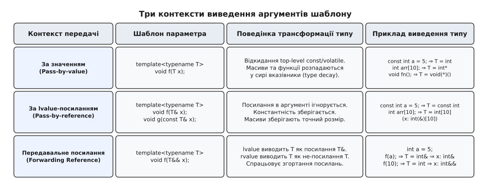
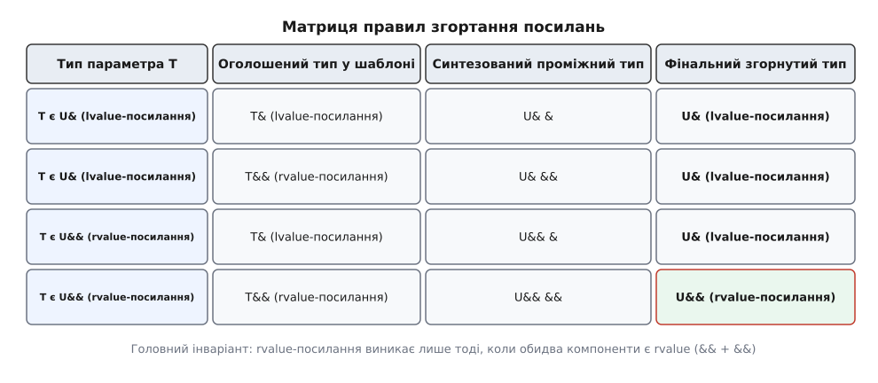
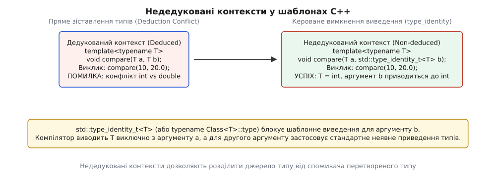
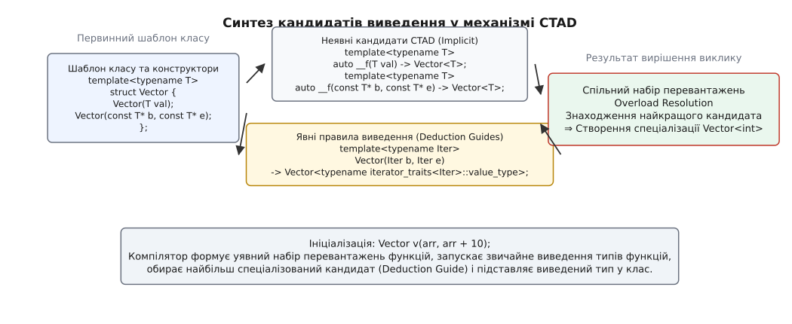

# Виведення аргументів шаблону: механіка зіставлення типів та CTAD

<preknowlist>
- [Шаблони: параметризація типом](topic:cpp-standards/templates-basics) — що таке параметр-тип шаблону, синтаксис template<typename T> та базові принципи інстанціації.
- [Категорії значень: lvalue, rvalue, prvalue, xvalue](topic:cpp-standards/value-categories) — як розрізняти іменовані об'єкти та тимчасові значення виразів.
- [Семантика переміщення й rvalue-посилання](topic:cpp-standards/rvalue-references-move) — як працюють `T&&` та оптимізація передачі ресурсів.
</preknowlist>

У системному програмуванні та розробці узагальнених бібліотек алгоритми на кшталт `min_val(a, b)` або функціональні обгортки `forward_task(f, args...)` створюються так, щоб працювати з довільними типами даних без зайвого синтаксичного шуму. Коли програміст записує виклик `min_val(10, 20)`, компілятор самостійно обчислює тип `T = int` без потреби явно зазначати кутові дужки `min_val<int>(10, 20)`. Цей процес називається виведенням аргументів шаблону (від лат. *deductio* — виведення, логічний висновок з очевидних передумов; англ. *Template Argument Deduction*, TAD).

Проте за оманливо простим синтаксисом ховається строгий механізм синтаксичного зіставлення типів. Спроба викликати функцію з аргументами різних типів `min_val(10, 3.14)` миттєво зупиняє компіляцію через конфлікт виведення, оскільки компілятор принципово не застосовує неявні перетворення типів до дедукованих параметрів. Передача масиву `int[10]` за значенням призводить до незворотного розпаду типу у вказівник `int*`, знищуючи метадані про розмір буфера. А передача аргументів через передавальні посилання `T&&` активує алгебру згортання посилань (Reference Collapsing), де lvalue та rvalue виводять кардинально різні типи.

Крім того, якщо для функцій цей механізм існував від появи першого стандарту C++98, то шаблони класів протягом майже двох десятиліть вимагали обов'язкового зазначення типів або громіздких фабричних функцій на зразок `std::make_pair`. Лише у стандарті C++17 з'явилося виведення аргументів шаблонів класів (Class Template Argument Deduction, CTAD) та користувацькі керівні правила виведення (Deduction Guides).

## Анатомія процесу виведення: зіставлення форми P з типом аргументу A

Алгоритм виведення аргументів шаблону базується на формальному структурному порівнянні двох абстрактних сутностей:
- `P` (Parameter Pattern) — тип формального параметра у сигнатурі шаблону, який містить один або кілька невідомих типів-параметрів `T`;
- `A` (Argument Type) — точний тип фактичного виразу, переданого в точці виклику після обчислення категорій значень.

Процес виведення виконується транслятором на етапі синтаксичного аналізу до генерації проміжного представлення та машинного коду:

```cpp
template<typename T>
void inspect(const std::vector<T*>& param);

int x = 42;
int* ptr = &x;
std::vector<int*> vec = {ptr};

inspect(vec);
```

Коли компілятор бачить виклик `inspect(vec)`, він запускає покроковий аналіз зіставлення синтаксичних дерев типів:
1. **Визначення типу фактичного аргументу:** Вираз `vec` має точний тип `A = std::vector<int*>`.
2. **Визначення шаблону параметра:** Формальний параметр має тип `P = const std::vector<T*>&`.
3. **Зняття зовнішніх модифікаторів посилань:** Оскільки `P` є посиланням на константу, зовнішнє посилання `&` та кваліфікатор `const` знімаються для зіставлення ядра типу. Залишається форма `std::vector<T*>`.
4. **Рекурсивний спуск по дереву типу:** Зовнішній шаблон класу `std::vector<...>` збігається в обох типах. Компілятор спускається до внутрішнього типу-аргументу вектора і порівнює `T*` із `int*`.
5. **Зв'язування параметра-типу:** Зіставлення форми покажчика `T*` із типом `int*` однозначно дає підстановку `T = int`.

Якщо на будь-якому кроці структурна форма `P` не може бути зіставлена з `A` (наприклад, якщо у функцію передано звичайний масив або скалярне число замість вектора), виведення для цього кандидата вважається невдалим.

Якщо в коді присутні інші перевантаження функції з таким самим ім'ям, невдалий кандидат мовчки відкидається зі списку перевантажень без генерації фатальної помилки компіляції. Це правило відоме як SFINAE (від англ. *Substitution Failure Is Not An Error* — невдача підстановки не є помилкою). Лише тоді, коли після перевірки всіх кандидатів не залишається жодної придатної функції, компілятор зупиняє побудову проєкту з діагностичним повідомленням `no matching function for call`.

Докладніше про історичні передумови та еволюцію цього механізму від перших версій STL до сучасних стандартів розповідає [Історія еволюції виведення типів у C++: від C++98 до CTAD](topic:cpp-standards/template-argument-deduction/hist-ctad-evolution.md).

### Рекурсивна декомпозиція складних складених типів

Алгоритм дедукції підтримує довільну глибину вкладеності конструкцій C++. Компілятор розбирає складні типи на елементарні структурні вузли:
- **Покажчики на методи класів:** Сигнатура `ReturnType (ClassName::*)(ArgTypes...)` зіставляється з формою `R (C::*)(Args...)`, дозволяючи одночасно вивести тип класу `C`, тип результату `R` та пакет типів аргументів `Args...`.
- **Шаблони шаблонів (Template Template Parameters):** Для форми `template<template<typename> class Container, typename T> void dump(const Container<T>& c)` компілятор виділяє ім'я самого шаблону контейнера `Container` (наприклад, `std::vector`) та тип його елементів `T`.
- **Багатовимірні масиви:** Форма `T(&)[Rows][Cols]` послідовно зіставляє розмірності `Rows` та `Cols` як константи компіляції `std::size_t`, зберігаючи повну інформацію про пам'ять матриці.

### Ранжування перевантажень після дедукції (Partial Ordering)

Коли для одного виклику успішно виведено типи для кількох різних шаблонних функцій, компілятор повинен обрати найбільш підходящу функцію. Цей етап називається частковим упорядкуванням шаблонів функцій (Partial Ordering of Function Templates, §13.7.6.2 [temp.func.order]).

Компілятор проводить уявне змагання між шаблонами: він генерує штучні унікальні типи для параметрів першого шаблону та перевіряє, чи може другий шаблон прийняти ці штучні типи. Якщо шаблон `A` може прийняти всі аргументи шаблону `B`, але шаблон `B` не може прийняти аргументи шаблону `A`, то шаблон `B` вважається більш спеціалізованим (more specialized) і перемагає у виборі перевантаження:

```cpp
template<typename T>
void process(T* ptr);       // Кандидат 1: вказівник

template<typename T>
void process(const T* ptr); // Кандидат 2: вказівник на константу (більш спеціалізований)

const int x = 10;
process(&x); // Вибирається Кандидат 2, оскільки const T* є більш спеціалізованим
```

## Три базові контексти передачі параметрів у функціях

Поведінка алгоритму дедукції докорінно залежить від того, як саме оголошено параметр у сигнатурі шаблону. Усі форми параметрів поділяються на три взаємовиключні контексти передачі.


*Порівняння трьох контекстів передачі аргументів: за значенням з відкиданням кваліфікаторів і розпадом типів, за посиланням зі збереженням точного типу масивів, та через передавальне посилання.*

### Контекст 1: Передача за значенням (T або auto)

Коли параметр оголошено як `template<typename T> void func(T val)`, компілятор генерує функцію, яка приймає незалежну копію об'єкта. Оскільки значення копіюється, властивості вихідного об'єкта, що стосуються доступу до пам'яті (константність самого об'єкта та посилання), не мають значення для нової копії.

Компілятор застосовує такі послідовні правила трансформації типів:
1. **Відкидання посилань:** Якщо аргумент має тип `int&` або `const int&`, посилання ігнорується, і початковим типом для аналізу стає `int` або `const int`.
2. **Відкидання top-level const та volatile:** Якщо аргумент є константною змінною `const int x = 10;`, кваліфікатор `const` відкидається: `T` виводиться як звичайний `int`. При цьому low-level const (константність даних під вказівником, наприклад `const char*`) обов'язково зберігається.
3. **Деградація масивів (Array-to-pointer decay):** Масив `int arr[10]` втрачає свій статичний розмір і перетворюється на вказівник на перший елемент `int*`. Для рядкових літералів `"hello"` типу `const char[6]` тип `T` дедукується як `const char*`.
4. **Деградація функцій (Function-to-pointer decay):** Передана функція `void handler(int)` перетворюється на покажчик на функцію `void(*)(int)`.

```cpp
template<typename T>
void by_value(T x);

const int a = 5;
const int& ref = a;
int buffer[16];

by_value(a);      // T = int, параметр x: int
by_value(ref);    // T = int, параметр x: int
by_value(buffer); // T = int*, параметр x: int*
by_value("text"); // T = const char*, параметр x: const char*
```

Відкидання top-level const є абсолютно логічним: функція отримує власну незалежну ділянку пам'яті на стеку або у регістрах процесора. Те, що оригінальна змінна в області видимості того, хто викликає, була константною, ніяк не обмежує право новоствореної копії змінювати власний стан, якщо тільки параметр у сигнатурі не було явно позначено як `const T`.

### Low-level проти Top-level const у вказівниках

Для покажчиків різниця між рівнями константності проявляється особливо яскраво:
- `int* const ptr` — top-level const (незмінний сам покажчик). При передачі за значенням `T` дедукується як `int*` (константність вказівника відкидається).
- `const int* ptr` — low-level const (незмінні дані за адресою). При передачі за значенням `T` дедукується як `const int*` (константність даних зберігається).
- `const int* const ptr` — комбінація обох. Top-level const відкидається, low-level const зберігається: `T` стає `const int*`.

### Контекст 2: Передача за lvalue-посиланням (T& та const T&)

Коли параметр оголошено як посилання `template<typename T> void func(T& ref)` або `template<typename T> void func(const T& ref)`, створення копії не відбувається: функція зв'язується безпосередньо з оригінальним об'єктом у пам'яті через його адресу.

Правила виведення для цього контексту змінюються:
1. **Збереження константності у формі T&:** Якщо параметр має форму `T&`, а аргумент є константним об'єктом `const int x = 10;`, константність переходить усередину типу `T`: `T` виводиться як `const int`, а тип параметра стає `const int&`. Це гарантує, що неконстантне посилання не зможе випадково модифікувати незмінний об'єкт.
2. **Параметр const T&:** Якщо константність уже є частиною форми параметра `const T&`, для аргументу `const int` тип `T` виводиться як чистий `int` (щоб уникнути подвійного позначення `const const int`), а параметр функції стає `const int&`.
3. **Блокування розпаду масивів:** Оскільки посилання у C++ можуть зв'язуватися з масивами фіксованого розміру `int(&)[N]`, масиви не розпадаються у вказівники. Тип `T` виводиться як точний тип масиву зі збереженням його розміру.

```cpp
template<typename T>
void by_ref(T& x);

template<typename T>
void by_const_ref(const T& x);

const int val = 100;
int raw_array[8];

by_ref(val);          // T = const int, параметр x: const int&
by_const_ref(val);    // T = int, параметр x: const int&
by_ref(raw_array);    // T = int[8], параметр x: int(&)[8]
```

Здатність `T&` захоплювати тип масиву цілком дозволяє писати шаблонні функції, що перевіряють межі масивів або обчислюють їхню довжину ще під час компіляції:

```cpp
template<typename Element, std::size_t N>
constexpr std::size_t get_array_length(const Element (&)[N]) noexcept {
    return N;
}
```

Якщо викликати функцію з двома масивами різної довжини `compare_buffers(arr10, arr20)`, де параметр оголошено як `T&`, компілятор зафіксує конфлікт типів `int[10]` та `int[20]`.

### Контекст 3: Передавальні (універсальні) посилання (T&&)

Найбільш гнучким і складним контекстом є використання `template<typename T> void func(T&& param)`. Подвійний амперсанд `&&` у контексті, де `T` є параметром шаблону, що дедукується безпосередньо у цьому виклику, позначає не rvalue-посилання, а **передавальне посилання** (Forwarding Reference; Скотт Мейєрс у своїй книзі *Effective Modern C++* назвав його універсальним посиланням — Universal Reference).

Якщо ж тип `T` відомий заздалегідь (наприклад, у методі вже інстанційованого класу `std::vector<T>::push_back(T&& x)`), то `T&&` є звичайним rvalue-посиланням, яке приймає виключно тимчасові об'єкти (rvalues) і відхиляє lvalues.

Для передавального посилання діє спеціальне правило дедукції:
- Якщо аргумент є **lvalue** типу `U`, то `T` дедукується як lvalue-посилання `U&`.
- Якщо аргумент є **rvalue** типу `U` (тимчасовий об'єкт prvalue або результат `std::move` — xvalue), то `T` дедукується як звичайний тип без посилань `U`.

```cpp
template<typename T>
void forwarding_wrapper(T&& param);

int value = 42;

forwarding_wrapper(value);            // value є lvalue ⇒ T = int&
forwarding_wrapper(100);              // 100 є rvalue (prvalue) ⇒ T = int
forwarding_wrapper(std::move(value)); // std::move дає rvalue (xvalue) ⇒ T = int
```

Важливо підкреслити: якщо додати кваліфікатор `const` до форми параметра `const T&&`, конструкція втрачає статус передавального посилання і стає rvalue-посиланням на константу. Вона більше не може зв'язуватися з lvalues і приймає лише константні тимчасові об'єкти.

## Універсальні посилання та механізм згортання посилань (Reference Collapsing)

Що відбувається з типом параметра `T&&`, коли `T` дедукується як `int&`? Пряма текстова підстановка дала б конструкцію `int& && param`. Проте синтаксис мови C++ забороняє безпосереднє оголошення посилань на посилання у вихідному тексті програми.

Щоб обробити такі випадки під час компіляції шаблонів, стандарт C++ визначає математично строгі правила **згортання посилань** (Reference Collapsing).


*Правила згортання подвійних посилань у C++: посилання на lvalue завжди перемагає, утворюючи lvalue-посилання, і лише комбінація rvalue з rvalue дає rvalue-посилання.*

Існує рівно чотири можливі комбінації посилань:

```text
&  + &  ⇒ &   [lvalue-посилання на lvalue-посилання згортається в lvalue-посилання]
&  + && ⇒ &   [rvalue-посилання на lvalue-посилання згортається в lvalue-посилання]
&& + &  ⇒ &   [lvalue-посилання на rvalue-посилання згортається в lvalue-посилання]
&& + && ⇒ &&  [rvalue-посилання на rvalue-посилання згортається в rvalue-посилання]
```

Головний висновок із цих правил: **якщо у ланцюжку є хоча б одне lvalue-посилання, результат завжди стає lvalue-посиланням**. Rvalue-посилання виникає виключно у випадку поєднання двох rvalue-посилань.

Завдяки цьому механізму реалізується ідіома ідеальної передачі (Perfect Forwarding) за допомогою стандартної функції `std::forward<T>`:

```cpp
template<typename T>
T&& forward(std::remove_reference_t<T>& t) noexcept {
    return static_cast<T&&>(t);
}
```

Розглянемо, як `std::forward<T>` поводиться для двох різних категорій значень:

1. **Коли у функцію передається lvalue типу `Widget`:**
   - Тип `T` дедукується як `Widget&`.
   - Параметр функції `T&&` через згортання `Widget& &&` стає `Widget&`.
   - Виклик `std::forward<T>(param)` інстанціюється як `std::forward<Widget&>`.
   - Приведення `static_cast<Widget& &&>` перетворюється на `static_cast<Widget&>`, повертаючи звичайне lvalue-посилання.

2. **Коли передається rvalue типу `Widget`:**
   - Тип `T` дедукується як чистий `Widget`.
   - Параметр функції `T&&` стає `Widget&&`.
   - Виклик `std::forward<T>(param)` інстанціюється як `std::forward<Widget>`.
   - Приведення `static_cast<Widget&&>` повертає rvalue-посилання, дозволяючи викликати ефективний конструктор переміщення замість копіювання.

На рівні згенерованого асемблерного коду виклики `std::forward` та `std::move` не створюють жодних машинних інструкцій. Це виключно інструкції компілятору щодо інтерпретації категорії значення об'єкта під час подальшого вибору перевантажених функцій.

## Конфлікти типів та недедуковані контексти (Non-deduced Contexts)

Коли один і той самий параметр-тип `T` використовується у кількох аргументах функції, компілятор виводить тип незалежно для кожного аргументу, а потім перевіряє їх на строгу тотожність:

```cpp
template<typename T>
T calculate_max(T a, T b) {
    return (a > b) ? a : b;
}

// Виклик:
auto res = calculate_max(10, 20.5); // ПОМИЛКА КОМПІЛЯЦІЇ!
```

Компілятор GCC видає помилку: `error: deduced conflicting types for parameter 'T' ('int' and 'double')`.

Ця поведінка є принциповою: компілятор не має права робити здогадки про те, до якого типу приводити дані — `int` до `double` чи `double` до `int`. Якщо б компілятор намагався підібрати спільний тип через неявні приведення, виникла б неоднозначність: для пари `(int, double)` однаково можливі приведення `int -> double` або `double -> int` (через звуження). Це перетворило б вибір перевантажень на експоненціальний перебір із непередбачуваними наслідками для стабільності програм.

Щоб дозволити неявне перетворення одного з аргументів, цей аргумент необхідно виключити з процесу виведення типів, перевівши його у **недедукований контекст** (Non-deduced Context).


*Розподіл аргументів на дедуковані та недедуковані контексти: використання std::type_identity дозволяє вказати компілятору, за яким аргументом визначати тип, а який приводити неявно.*

### Механізм std::type_identity

Згідно зі стандартом C++ (§13.10.2.5 [temp.deduct.type]), будь-який тип, що знаходиться праворуч від оператора розділення видимості `::` у залежному імені (наприклад, `typename SomeClass<T>::type`), є недедукованим контекстом. Компілятор не може знати всіх можливих спеціалізацій `SomeClass`, тому він навіть не намагається вивести `T` з такого параметра.

У стандарті C++20 для цього введено утиліту `std::type_identity`:

```cpp
template<typename T>
struct type_identity {
    using type = T;
};

template<typename T>
using type_identity_t = typename type_identity<T>::type;
```

Застосуємо її для виправлення функції `calculate_max`:

```cpp
template<typename T>
T calculate_max(T a, std::type_identity_t<T> b) {
    return (a > b) ? a : b;
}

auto res = calculate_max(10, 20.5); // УСПІХ: T виводиться як int з першого аргументу,
                                   // а другий аргумент 20.5 неявно приводиться до int (20)
```

Повний формальний перелік усіх недедукованих контекстів, таблиць згортання та дозволених трансформацій наведено у матеріалі [Довідник правил виведення типів та неявних трансформацій](topic:cpp-standards/template-argument-deduction/api-deduction-rules.md).

## Виведення для шаблонів зі змінною кількістю аргументів (Variadic Packs)

У шаблонах зі змінною кількістю аргументів `template<typename... Args>` компілятор застосовує алгоритм пакетного зіставлення (Pack Matching):

```cpp
template<typename Target, typename... Sources>
void batch_assign(Target& dst, const Sources&... srcs);
```

Під час аналізу виклику `batch_assign(t, a, b, c)` компілятор зіставляє перший аргумент із `Target&`, а всі наступні фактичні аргументи послідовно зіставляє з формою `const Sources&...`. Якщо передано аргументи типів `int`, `double`, `std::string`, компілятор дедукує пакет параметрів:
`Sources = {int, double, std::string}`.

### Пастка недедукованих пакетів у середині сигнатури

Якщо пакет параметрів розташований не в кінці списку параметрів, компілятор втрачає здатність однозначно визначити межу між пакетом та наступними параметрами:

```cpp
template<typename... Args, typename Callback>
void dispatch_event(Args... args, Callback cb); // Callback стає недедукованим!

// Виклик dispatch_event(1, 2, my_lambda); // ПОМИЛКА: компілятор не знає, скільки аргументів належить Args...
```

У такій ситуації всі параметри після `Args...` потрапляють у недедукований контекст. Їх неможливо вивести автоматично без явного зазначення всіх типів у кутових дужках `dispatch_event<int, int, MyLambda>(1, 2, my_lambda)`. Для виправлення архітектури такі функціональні об'єкти завжди передають першим параметром: `template<typename Callback, typename... Args> void dispatch_event(Callback cb, Args... args)`.

## Виведення нетипових аргументів шаблону (NTTP Deduction)

Шаблони у C++ можуть параметризуватися не лише типами, але й константами компіляції — нетиповими параметрами шаблону (Non-Type Template Parameters, NTTP). Компілятор здатний автоматично виводити ці значення з аргументів виклику:

```cpp
template<typename T, std::size_t N>
constexpr std::size_t count_elements(const T (&)[N]) noexcept {
    return N;
}
```

У цьому прикладі компілятор одночасно виводить тип елемента `T` та числову константу `N = 10` з типу переданого масиву `int[10]`.

Починаючи зі стандарту C++17, мова дозволила використовувати `template<auto Value>`, де компілятор спочатку дедукує тип константи, а потім саме її значення:

```cpp
template<auto Value>
void log_constant() {
    std::cout << "Значення: " << Value << ", Розмір типу: " << sizeof(Value) << '\n';
}

log_constant<100>();       // Тип: int, Value = 100
log_constant<'A'>();       // Тип: char, Value = 'A'
log_constant<3.14159f>();  // C++20: плаваюча крапка як NTTP
```

У C++20 можливості NTTP було розширено на так звані структурні типи (Structural Types) — літеральні класи, чиї відкриті поля можуть використовуватися як константи компіляції, що дозволило створювати шаблони з фіксованими текстовими рядками безпосередньо у параметрах шаблонів.

## Виведення аргументів шаблонів класів (CTAD) у C++17 та C++20

До стандарту C++17 створення об'єктів шаблонних класів вимагало обов'язкового зазначення типів у кутових дужках або використання спеціальних допоміжних функцій:

```cpp
// До C++17:
std::pair<int, double> p1(1, 2.0);
auto p2 = std::make_pair(1, 2.0);
std::lock_guard<std::mutex> lock(mtx);
```

Стандарт C++17 ввів механізм **Class Template Argument Deduction (CTAD)**, який дозволив створювати об'єкти класів так само просто, як і викликати функції:

```cpp
// Починаючи з C++17:
std::pair p(1, 2.0);          // std::pair<int, double>
std::lock_guard lock(mtx);    // std::lock_guard<std::mutex>
std::tuple t(1, "abc"s, 3.14);// std::tuple<int, std::string, double>
```

### Як компілятор реалізує CTAD

Компілятор не створює спеціального паралельного рушія для класів. Замість цього для кожного конструктора первинного шаблону компілятор автоматично генерує уявні функції-кандидати виведення (Implicit Deduction Candidates).

Якщо клас визначено як:

```cpp
template<typename T>
class Buffer {
public:
    Buffer(T initial_value, std::size_t count);
};
```

Компілятор автоматично синтезує уявний шаблон функції:

```cpp
template<typename T>
auto __synthesized_Buffer_guide(T initial_value, std::size_t count) -> Buffer<T>;
```

Коли програміст пише `Buffer buf(42, 10);`, компілятор запускає звичайний вибір перевантаження функцій (Overload Resolution) для уявних кандидатів. Функція дедукує `T = int` і повертає тип `Buffer<int>`, який і стає типом створюваного об'єкта.

### Виведення для агрегатних типів у C++20

У C++17 CTAD працював лише для класів із явно оголошеними конструкторами. Прості агрегатні структури не підтримували виведення типів:

```cpp
template<typename T, typename U>
struct KeyValuePair {
    T key;
    U value;
};

// У C++17 це була помилка. У C++20 працює автоматично:
KeyValuePair entry{"session_id", 1024}; // KeyValuePair<const char*, int>
```

У стандарті C++20 (пропозиція P1816R0) компілятор навчився автоматично синтезувати кандидати виведення безпосередньо зі списку відкритих полів агрегату.

### Виведення для шаблонів псевдонімів (CTAD for Alias Templates) у C++20

До стандарту C++20 використання CTAD із псевдонімами шаблонів (`template<typename T> using MyVector = std::vector<T>;`) було категорично заборонено. Компілятор не міг зіставити правила виведення базового шаблону з параметрами нового псевдоніма.

У стандарті C++20 (пропозиція P1814R0) було розроблено алгоритм дедукції для alias templates: компілятор створює набір уявних керівних правил, де параметри базового класу заміщуються через вирази псевдоніма. Це дозволяє прозоро використовувати CTAD для скорочених типів предметної області:

```cpp
template<typename T>
using StringMap = std::unordered_map<std::string, T>;

// C++20 автоматично дедукує StringMap<int>:
StringMap cache{std::pair{"timeout"s, 30}, std::pair{"retries"s, 3}};
```

### Специфіка ініціалізації вектором та кандидатом копіювання

Особливу увагу автори стандарту приділили розв'язанню конфлікту між конструктором копіювання та ініціалізацією через список `std::initializer_list`:

```cpp
std::vector v1{10, 20, 30};

std::vector v2{v1};     // Виводить std::vector<int> (копіювання вектора)
std::vector v3{v1, v1}; // Виводить std::vector<std::vector<int>> (список із двох векторів)
```

Для запобігання випадковому створенню векторів векторів при копіюванні у фігурних дужках, компілятор завжди генерує уявного кандидата копіювання `template<typename T> auto __copy(std::vector<T>) -> std::vector<T>;`, який має абсолютний пріоритет над конструктором зі списком ініціалізації для одиничного аргументу того самого типу.

## Користувацькі правила виведення (Deduction Guides)

Автоматичного синтезу кандидатів із конструкторів часто недостатньо. Класичний приклад — контейнери, що ініціалізуються парою ітераторів:

```cpp
template<typename T>
class CustomVector {
public:
    template<typename Iterator>
    CustomVector(Iterator first, Iterator last);
};
```

Конструктор приймає ітератори `Iterator`, але шаблон класу параметризовано типом елемента `T`. Компілятор не може самостійно здогадатися, що тип `T` слід шукати всередині `std::iterator_traits<Iterator>::value_type`.

Для вирішення цієї проблеми розробник пише явне **керівне правило виведення (Deduction Guide)**:

```cpp
template<typename Iterator>
CustomVector(Iterator, Iterator) 
    -> CustomVector<typename std::iterator_traits<Iterator>::value_type>;
```


*Процес виведення типів для класів: об'єднання неявних кандидатів конструкторів та явних користувацьких правил виведення в єдиний набір перевантажень.*

### Специфікатор explicit у Deduction Guides

Якщо конструктор класу оголошено як `explicit`, або якщо виведення типу не повинно відбуватися під час неявного копіювального присвоєння, правило виведення також позначають специфікатором `explicit`:

```cpp
template<typename T>
struct UniqueHandle {
    explicit UniqueHandle(T* ptr);
};

// Керівне правило з explicit
template<typename T>
explicit UniqueHandle(T*) -> UniqueHandle<T>;

UniqueHandle h1(new int(5));   // УСПІХ: пряма ініціалізація
// UniqueHandle h2 = new int(5); // ПОМИЛКА: explicit блокує копіювальну ініціалізацію через '='
```

Правила виведення мають важливу властивість: вони не є функціями чи методами. Вони не мають виконуваного тіла, не займають місця у пам'яті програми та не потрапляють до таблиці символів об'єктного файлу. Їхня єдина мета — надати компілятору додаткові сигнатури для таблиці перевантаження під час виконання CTAD.

Практичні приклади створення складних диспетчерів відвідувачів `Overloaded`, кільцевих буферів та алокатор-орієнтованих сховищ дивіться у матеріалі [Практична реалізація ідіоми Overloaded та користувацьких deduction guides](topic:cpp-standards/template-argument-deduction/proj-custom-deduction-guide.md).

## Взаємодія виведення типів із концептами C++20 (Concepts & Constraints)

У стандарті C++20 правила виведення аргументів шаблонів отримали пряму інтеграцію з системою концептів (Concepts). Обмеження `requires` перевіряються компілятором одразу після завершення фази структурного зіставлення типів.

Якщо тип `T` виведено успішно, але він не задовольняє концептуальне обмеження (наприклад, `std::integral<T>`), функція відхиляється на етапі перевірки обмежень (Constraint Satisfaction Check) без створення фатальної помилки компіляції (SFINAE):

```cpp
template<typename T>
requires std::integral<T>
T fast_gcd(T a, T b) {
    while (b != 0) {
        T t = b;
        b = a % b;
        a = t;
    }
    return a;
}

// fast_gcd(12, 18); // T = int, обмеження std::integral<int> виконується ⇒ УСПІХ
// fast_gcd(12.0, 18.0); // T = double, std::integral<double> хибний ⇒ відхилення кандидата
```

Крім того, концептуальні обмеження беруть участь у частковому впорядкуванні функцій (Subsumption Rules). Якщо дві шаблонні функції мають однакові сигнатури, але одна обмежена більш специфічним концептом (наприклад, `std::random_access_iterator` проти `std::input_iterator`), компілятор автоматично обере функцію з більш суворим концептом без виникнення неоднозначностей.

## Виведення типів для узагальнених лямбда-виразів (Generic Lambdas)

У стандарті C++14 з'явилися узагальнені лямбда-вирази, де параметри оголошуються як `auto`. Компілятор транслює таку лямбду в анонімний клас-функтор із шаблонним оператором виклику:

```cpp
auto multiplier = [](auto a, auto b) {
    return a * b;
};

// Еквівалентний клас, згенерований компілятором:
struct __LambdaMultiplier {
    template<typename T1, typename T2>
    auto operator()(T1 a, T2 b) const {
        return a * b;
    }
};
```

Кожен виклик `multiplier(10, 2.5)` запускає стандартний алгоритм TAD для згенерованого методу `operator()`, виводячи незалежні типи `T1 = int` та `T2 = double`.

У стандарті C++20 з'явився синтаксис лямбд із явними шаблонними параметрами (Explicit Template Parameter List for Lambdas):

```cpp
auto vector_processor = []<typename T>(const std::vector<T>& vec) {
    std::cout << "Вектор містить " << vec.size() << " елементів типу розміром " << sizeof(T) << '\n';
};
```

Цей синтаксис дозволяє явно обмежити форму вхідного контейнера та отримати доступ до імені типу елемента `T` безпосередньо в тілі лямбди без використання допоміжних трейтів `typename decltype(vec)::value_type`.

## Виведення типів через auto, decltype(auto) та скорочені шаблони C++20

Правила Template Argument Deduction є універсальним фундаментом усієї системи виведення типів у C++. Ключове слово `auto` у визначенні локальних змінних працює за тими самими математичними законами:

```cpp
const int val = 42;

auto a = val;        // Правило 1 (за значенням): відкидає const ⇒ int
const auto b = val;  // Правило 1 з явним const ⇒ const int
auto& c = val;       // Правило 2 (за lvalue-посиланням): зберігає const ⇒ const int&
auto&& d = val;      // Правило 3 (передавальне посилання): val є lvalue ⇒ int&
auto&& e = 100;      // Правило 3 (передавальне посилання): 100 є rvalue ⇒ int&&
```

Винятком є `decltype(auto)`, який використовує правила `decltype` замість TAD, точно зберігаючи категорію виразу та наявність посилань без відкидання `const` чи `&`. Це критично важливо для узагальнених функцій-обгорток, які повертають результати інших функцій:

```cpp
template<typename Container, typename Index>
decltype(auto) access_element(Container& c, Index i) {
    return c[i]; // Зберігає lvalue-посилання Container::operator[], не копіюючи елемент
}
```

### Скорочені шаблони функцій (Abbreviated Function Templates) у C++20

Стандарт C++20 дозволив використовувати `auto` безпосередньо у параметрах функцій:

```cpp
// Скорочений синтаксис C++20:
void process_item(auto&& item, std::integral auto count) {
    // ...
}

// Повний синтаксичний еквівалент:
template<typename T1, std::integral T2>
void process_item(T1&& item, T2 count) {
    // ...
}
```

Кожен параметр з типом `auto` стає окремим незалежним параметром-типом шаблону, для якого компілятор застосовує повний набір правил виведення типів аргументів.

## Архітектурні пастки: зрізання об'єктів та завислі посилання

Незважаючи на зручність, некоректне застосування виведення типів може призвести до важковиправних дефектів у системних програмах.

### 1. Зрізання об'єктів (Object Slicing) при дедукції за значенням

Якщо поліморфний об'єкт похідного класу `Derived` передається у функцію з параметром за значенням `template<typename T> void process(T obj)`, дедукція виводить `T = Derived`. Але якщо функцію було викликано через базовий вказівник або посилання `Base&`, дедукція виводить `T = Base`.

У результаті створюється копія лише базової частини об'єкта, а інформація про віртуальні таблиці та додаткові поля похідного класу безповоротно зрізається (Object Slicing). Для поліморфних ієрархій параметри функцій завжди слід приймати за посиланням `const Base&` або `Base&`.

### 2. Завислі посилання при збереженні передавальних посилань

Типовою помилкою є збереження універсального посилання `auto&&` або `T&&` всередині довгоживучих структур даних:

```cpp
template<typename T>
class ObserverWrapper {
public:
    ObserverWrapper(T&& obj) : m_ref(std::forward<T>(obj)) {}
private:
    T&& m_ref; // НЕБЕЗПЕКА: rvalue зв'язується з тимчасовим об'єктом!
};
```

Якщо передати у такий конструктор тимчасовий об'єкт `ObserverWrapper wrap(create_temporary_sensor());`, тимчасовий об'єкт буде знищено в кінці повного виразу, а поле `m_ref` перетвориться на зависле посилання (Dangling Reference), що призведе до фатального порушення пам'яті (Segmentation Fault) під час наступного звернення.

### 3. Непередбачуваний розпад рядкових літералів у парах та кортежах

Історична фабрична функція `std::make_pair("a", "b")` використовувала метафункцію `std::decay` всередині своєї реалізації, тому вона створювала об'єкт `std::pair<const char*, const char*>`. 

Натомість під час використання CTAD безпосередньо над конструктором `std::pair p("a", "b")` у ранніх чернетках C++17 конструктор приймав посилання `const T1&, const T2&`, що виводило точні типи масивів `std::pair<const char[2], const char[2]>` і призводило до помилок компіляції при спробі копіювання масивів. Для усунення цієї проблеми комітет стандартизації додав спеціальні явні deduction guides для `std::pair` та `std::tuple`, які примусово застосовують `std::decay_t` до параметрів:

```cpp
template<class T1, class T2>
pair(T1, T2) -> pair<T1, T2>; // Параметри за значенням викликають природний decay масивів
```

## Ціна виведення типів і архітектурні інваріанти

Механізм виведення аргументів шаблонів функцій та класів підпорядковується фундаментальному принципу мови C++ — **нульовій вартості абстракцій під час виконання програми (Zero-cost Runtime Abstraction)**:

1. **Нуль накладних витрат у пам'яті та швидкості:** Усі зіставлення типів, згортання посилань, трансформації decay та вибір перевантажень відбуваються виключно на етапі компіляції. У згенерованому бінарному машинні коді немає жодних таблиць дедукції, перевірок типів чи додаткових викликів.
2. **Вплив на час компіляції:** Використання CTAD та складних правил виведення збільшує набір кандидатів перевантаження, які компілятор аналізує в AST. Проте відмова від проміжних фабричних функцій на кшталт `std::make_pair` зменшує загальну кількість створених екземплярів шаблонів функцій, завдяки чому сучасний код із CTAD часто компілюється навіть швидше за застарілий код C++03.
3. **Архітектурна надійність:** Використання `std::type_identity` для захисту від конфліктів типів, специфікаторів `explicit` у deduction guides та передавальних посилань зі згортанням дозволяє проектувати надійні, самодокументовані бібліотеки, які поєднують безпеку суворої типізації з максимальною зручністю для кінцевого користувача.
