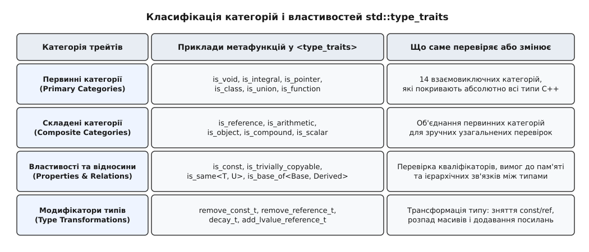
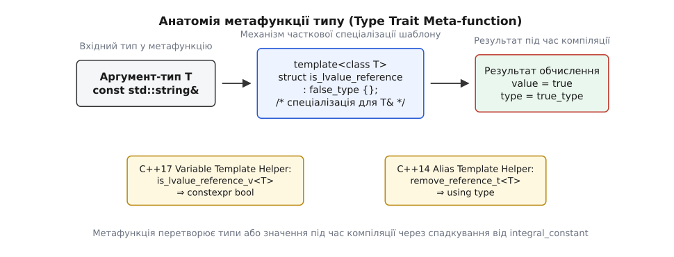
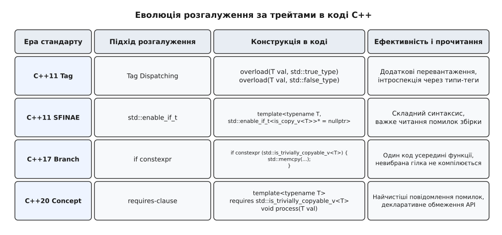
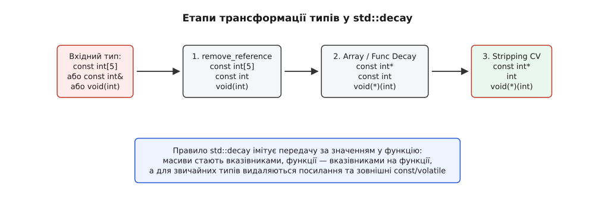

# Метапрограмування та метадані типів: std::type_traits

<preknowlist>
- [Шаблони: параметризація типом](book:cpp-standards/templates-basics) — що таке параметр-тип шаблону і як компілятор підставляє аргументи під час компіляції.
- [Спеціалізація шаблонів](book:cpp-standards/specialization-overload) — як повна та часткова спеціалізація змінюють поведінку шаблону для конкретних типів.
- [Обчислення за викликом і SFINAE](book:cpp-standards/sfinae-and-enable-if) — чому невдала підстановка в параметрах шаблону не є помилкою збірки.
- [Константні вирази constexpr](book:cpp-standards/constexpr-and-consteval) — як обчислювати значення та виконувати функції під час компіляції.
</preknowlist>

Припустимо, ви розробляєте високопродуктивний контейнер або системну функцію для копіювання масиву об'єктів у пам'яті. У мові C++ параметризація типів реалізується через шаблони `template<typename T>`, тож наївна реалізація узагальненої функції виглядатиме так:

```cpp
template<typename T>
void copy_buffer(const T* src, T* dst, std::size_t count) {
    for (std::size_t i = 0; i < count; ++i) {
        dst[i] = src[i];
    }
}
```

Уявімо, що ця функція викликається для масиву з десяти мільйонів елементів типу `int` або `double`. Поелементний цикл у C++ вимагає на кожній ітерації прочитати значення зі стеку чи купи, записати його в інший адресний простір, зробити інкремент лічильника та виконати умовний перехід. Проте сучасному процесору для передачі сирого блоку пам'яті скалярних типів цей цикл взагалі не потрібен: оперативна пам'ять та векторні SIMD-інструкції здатні скопіювати весь масив за один виклик системної функції `std::memcpy(dst, src, count * sizeof(T))` на швидкості десятків гігабайтів за секунду.

Однак автоматично замінити поелементне копіювання на `std::memcpy` для довільного типу `T` категорично заборонено. Якщо параметром `T` виявиться клас `std::string`, `std::vector<int>` або `std::shared_ptr<MyClass>`, під прямим копіюванням байтів ховається катастрофа. Сире копіювання байтів `std::memcpy` перезапише внутрішні вказівники на буфери, омине виклики конструкторів копіювання та реєстрацію лічильників посилань. Коли такі об'єкти вийдуть із області видимості, їхні деструктори спробують повторно вивільнити один і той самий вказівник у купі, що призведе до фатального подвійного звільнення пам'яті (double free) та порушення цілісності процесу.

Отже виникає глибокий архітектурний конфлікт: для простих скалярних типів копіювання байтів є найшвидшим можливим шляхом, а для складних об'єктів із ресурсами — це миттєве руйнування програми.

Під час збірки проєкту компілятор C++ точно знає тип `T`. Проте без спеціального інструменту інтроспекції розробник не має змоги поставити компіляторові запитання: «Чи можна цей конкретний `T` безпечно скопіювати як масив сирих байтів?». Щоб побудувати узагальнений код, який автоматично обирає найшвидшу й безпечну гілку обробки ще під час компіляції, потрібен механізм опитування метаданих типів. Цим механізмом і є система **Type Traits** та її стандартний заголовочний файл `<type_traits>`.

## Анатомія метафункції: як влаштовані трейти на рівні шаблонів

Термін «трейт» (від англ. *trait* — риса, рисочка, характерна ознака) у системному програмуванні позначає шаблонний клас чи структуру, яка асоціює властивості або метаінформацію з типом-параметром під час компіляції.

На відміну від звичайних функцій, які приймають значення і повертають інші значення під час виконання програми (`double y = sin(double x)`), **метафункція** оперує типами даних. Вхідними аргументами метафункції є типи (або цілочислові константи компіляції), а результатами є нові трансформовані типи чи булеві прапорці, обчислені до запуску коду.

У стандартній бібліотеці C++ кожна метафункція опитування реалізується як шаблон структури, успадкований від уніфікованого базового шаблону `std::integral_constant`:

```cpp
template<class T, T v>
struct integral_constant {
    static constexpr T value = v;
    using value_type = T;
    using type = integral_constant;
    constexpr operator value_type() const noexcept { return value; }
    constexpr value_type operator()() const noexcept { return value; }
};

using true_type  = integral_constant<bool, true>;
using false_type = integral_constant<bool, false>;
```

Шаблон `std::integral_constant` обгортає будь-яке константне значення `v` типу `T` унікальним типом C++. Зверніть увагу на два важливих оператори всередині: `operator value_type()` дозволяє використовувати об'єкт метафункції у булевих виразах, а `operator()()` дозволяє викликати його як функтор під час обчислення `constexpr`.

Щоб створити власну метафункцію (наприклад, предикат для перевірки, чи є тип `T` вказівником), розробники застосовують часткову спеціалізацію шаблонів. Первинний шаблон повертає `false_type` для всіх типів за замовчуванням, а часткова спеціалізація перехоплює форму `T*` і успадковується від `true_type`:

```cpp
// 1. Первинний шаблон: за замовчуванням будь-який тип — не вказівник
template<typename T>
struct is_pointer : std::false_type {};

// 2. Часткова спеціалізація для будь-якого вказівника T*
template<typename T>
struct is_pointer<T*> : std::true_type {};
```

Коли компілятор бачить вираз `is_pointer<int>::value`, він обирає первинний шаблон і повертає `false`. Коли ж підставляється `is_pointer<double*>::value`, компілятор обирає часткову спеціалізацію, яка успадковує `value = true`.

Усі ці обчислення виконуються виключно під час синтаксичного аналізу. Оскільки константа `value` має кваліфікатор `static constexpr bool`, значення підставляється безпосередньо у машинні інструкції без виділення байтів у пам'яті RAM та без жодних викликів у runtime. Докладніше про те, як від експериментів 1990-х років комітет прийшов до цієї системи, розповідає [Історія інтроспекції та створення метафункцій типу](book:cpp-standards/type-traits/hist-type-traits-evolution.md).

## Класифікація та таксономія метафункцій у бібліотеці <type_traits>

Заголовочний файл `<type_traits>` систематизує усяке розмаїття типів мови C++ у строгу математичну класифікацію.



*Всі метафункції стандарту поділені на первинні категорії, складені категорії, предикати властивостей та трансформації типів.*

Перша категоріальна група — **первинні категорії типів** (Primary Type Categories). Їх існує рівно 14:
- `is_void` — тип `void`;
- `is_null_pointer` — тип `std::nullptr_t`;
- `is_integral` — базові цілочислові типи (`bool`, `char`, `int`, `long long` тощо);
- `is_floating_point` — типи з плаваючою крапкою (`float`, `double`, `long double`);
- `is_array` — масиви відомого чи невідомого розміру (`int[10]` або `int[]`);
- `is_pointer` — вказівники на об'єкти та функції (`int*`, `void*`);
- `is_lvalue_reference` — посилання на lvalue (`T&`);
- `is_rvalue_reference` — посилання на rvalue (`T&&`);
- `is_member_object_pointer` — вказівники на поля даних у класах (`Data Class::*`);
- `is_member_function_pointer` — вказівники на методи класів (`void (Class::*)()`);
- `is_enum` — переліки (`enum` та `enum class`);
- `is_union` — об'єднання (`union`);
- `is_class` — структури та класи (`struct` і `class`, окрім `union`);
- `is_function` — сигнатури функцій (`void(int)`).

Первинні категорії є **взаємовиключними** (mutually exclusive): будь-який тип у C++ вичерпно належить рівно до однієї з цих чотирнадцяти категорій. Наприклад, вираз `is_pointer_v<T>` та `is_class_v<T>` ніколи не можуть дати `true` для одного й того самого типу `T`.

Друга група — **складені категорії типів** (Composite Type Categories). Вони є логічними об'єднаннями кількох первинних категорій для спрощення написання перевірок:
- `is_reference` — об'єднання `is_lvalue_reference || is_rvalue_reference`;
- `is_arithmetic` — об'єднання `is_integral || is_floating_point`;
- `is_fundamental` — об'єднання `is_arithmetic || is_void || is_null_pointer`;
- `is_object` — перевірка `!is_function && !is_reference && !is_void` (будь-який тип, який фактично займає послідовну ділянку пам'яті);
- `is_scalar` — об'єднання арифметичних типів, переліків, вказівників та `nullptr_t`.

Третя група — **властивості та відносини типів** (Properties & Relationships). Вони описують кваліфікатори та взаємні зв'язки між типами:
- `is_const<T>`, `is_volatile<T>` — перевірка топових кваліфікаторів;
- `is_trivially_copyable<T>` — чи дозволено копіювання через `memcpy`;
- `is_standard_layout<T>` — чи є розташування полів у пам'яті сумісним із мовою C;
- `is_same<T, U>` — перевірка абсолютної тотожності типів;
- `is_base_of<Base, Derived>` — перевірка зв'язку успадкування між класами.

Четверта група — **модифікатори та трансформації типів** (Type Transformations). Вони не повертають булеве значення, а обчислюють новий тип у вкладеному `::type`:
- `remove_const<T>` — видаляє топовий `const`;
- `remove_reference<T>` — знімає `&` або `&&`;
- `add_lvalue_reference<T>` — додає посилання `&`;
- `decay<T>` — виконує повний розпад типу до форми, при придатності для передачі за значенням.

Повний довідник усіх назв, сигнатур та помічників дивіться у матеріалі [Довідник заголовочного файла <type_traits>](book:cpp-standards/type-traits/api-type-traits-ref.md).

## Ергономіка та обчислювальна логіка: помічники _t, _v та короткі замикання

У стандартах C++11 написання меташаблонів вимагало надмірної кількості допоміжного синтаксису. Розробники змушені були писати префікс `typename` та вкладений псевдонім `::type` для кожної трансформації, а також вкладену константу `::value` для кожного предикату:

```cpp
// Важкий синтаксис C++11:
typename std::remove_reference<T>::type clean_var;
bool is_ptr = std::is_pointer<T>::value;
```

Для полегшення прочитання у C++14 з'явилися шаблони псевдонімів із суфіксом `_t`, а в C++17 — змінні-шаблони із суфіксом `_v`.



*Анатомія метафункції: аргумент T проходить через спеціалізацію або помічники _v та _t, даючи статичні значення чи трансформовані типи.*

Завдяки цим помічникам той самий код у C++17 виглядає максимально прозоро:

```cpp
// Зручний синтаксис C++17:
std::remove_reference_t<T> clean_var;
bool is_ptr = std::is_pointer_v<T>;
```

Внутрішнє влаштування цих помічників є гранично простим:

```cpp
template<class T>
using remove_reference_t = typename remove_reference<T>::type;

template<class T>
inline constexpr bool is_pointer_v = is_pointer<T>::value;
```

### Короткі замикання у метаобчисленнях: std::conjunction та std::disjunction

При створенні узагальнених умов розробники початково комбінували метафункції через звичайні булеві оператори C++: `std::is_integral_v<T> && std::is_signed_v<T>`. Однак цей підхід містить приховану пастку на етапі підстановки типів.

Оператор `&&` обчислює обидва вирази одночасно. Це змушує компілятор повністю інстанціювати всі шаблони в ланцюжку. Якщо правіша метафункція виявиться некоректною для даного типу (наприклад, спроба викликати `std::make_signed_t<T>`, коли `T` є `std::string`), збірка проєкту зупиниться з важкою помилкою, навіть якщо ліва умова вже повернула `false`.

Для усунення цієї проблеми в C++17 було додано логічні метафункції `std::conjunction` (логічне І), `std::disjunction` (логічне АБО) та `std::negation` (логічне НІ). Вони підтримують **коротке замикання (short-circuit evaluation)** під час компіляції:

```cpp
// Обчислення зупиняється на першому false, правіший шаблон НЕ інстанціюється:
template<typename T>
struct is_signed_integral 
    : std::conjunction<std::is_integral<T>, std::is_signed<T>> {};
```

Якщо `std::is_integral<T>` повертає `false`, метафункція `std::conjunction` миттєво припиняє обчислення і повертає `false_type`, навіть не намагаючись аналізувати `std::is_signed<T>`. Це повністю захищає код від помилок підстановки в невикористовуваних гілках.

## Паттерни застосування: від Tag Dispatch до if constexpr і концептів

Еволюція застосування type traits у програмуванні на C++ пройшла чотири фундаментальних етапи.



*Еволюція методів розгалуження: від додаткових перевантажень за тегами (C++11) до прямого branched code через if constexpr (C++17) та концептів (C++20).*

Повернемося до нашої початкової задачі — оптимізованого копіювання масиву `copy_buffer`. Простежимо, як ця задача вирішувалася на кожному з чотирьох етапів розвитку мови C++.

### Етап 1. Tag Dispatching (C++11)

У C++11 для вибору гілки використовували передачу екземплярів `std::true_type` чи `std::false_type` у приватні перевантажені функції:

```cpp
namespace detail {
    // Гілка 1: Швидкий memcpy для тривіально копійованих типів
    template<typename T>
    void copy_impl(const T* src, T* dst, std::size_t count, std::true_type) {
        std::memcpy(dst, src, count * sizeof(T));
    }

    // Гілка 2: Поелементний цикл для складних типів
    template<typename T>
    void copy_impl(const T* src, T* dst, std::size_t count, std::false_type) {
        for (std::size_t i = 0; i < count; ++i) {
            dst[i] = src[i];
        }
    }
}

template<typename T>
void copy_buffer(const T* src, T* dst, std::size_t count) {
    detail::copy_impl(src, dst, count, std::is_trivially_copyable<T>());
}
```

Недолік: вимагає винесення логіки у допоміжні перевантажені функції у внутрішніх просторах імен `detail`.

### Етап 2. SFINAE та std::enable_if_t (C++11/14)

Метафункція `std::enable_if_t` дозволяє вилучати функції з набору кандидатів перевантаження, якщо умова є хибною:

```cpp
// Гілка 1: Активується тільки якщо тип тривіально копійований
template<typename T, std::enable_if_t<std::is_trivially_copyable_v<T>>* = nullptr>
void copy_buffer(const T* src, T* dst, std::size_t count) {
    std::memcpy(dst, src, count * sizeof(T));
}

// Гілка 2: Активується тільки якщо тип НЕ є тривіально копійованим
template<typename T, std::enable_if_t<!std::is_trivially_copyable_v<T>>* = nullptr>
void copy_buffer(const T* src, T* dst, std::size_t count) {
    for (std::size_t i = 0; i < count; ++i) {
        dst[i] = src[i];
    }
}
```

Недолік: перевантажує сигнатуру функції технічними параметрами, ускладнює читання оголошень та генерує важкі текстові повідомлення про помилки збірки.

### Етап 3. if constexpr (C++17)

Конструкція `if constexpr` дозволяє виконувати розгалуження прямо всередині тіла однієї функції. Невибрана гілка взагалі не компілюється для даного типу `T`:

```cpp
template<typename T>
void copy_buffer(const T* src, T* dst, std::size_t count) {
    if constexpr (std::is_trivially_copyable_v<T>) {
        // Миттєве копіювання блоку пам'яті
        std::memcpy(dst, src, count * sizeof(T));
    } else {
        // Поелементний виклик операторів присвоєння
        for (std::size_t i = 0; i < count; ++i) {
            dst[i] = src[i];
        }
    }
}
```

Це найзручніший підхід для внутрішньої оптимізації алгоритмів: код залишається локалізованим в одному місці й не вимагає додаткових функцій-обгорток.

### Етап 4. Концепти та вирази requires (C++20)

У C++20 type traits стали фундаментальними будівельними блоками для концептів, дозволяючи обмежувати шаблони безпосередньо у сигнатурі:

```cpp
template<typename T>
requires std::is_trivially_copyable_v<T>
void fast_byte_copy(const T* src, T* dst, std::size_t count) {
    std::memcpy(dst, src, count * sizeof(T));
}
```

Детальніше про написання власних метафункцій інтроспекції та SFINAE-детективів дивіться у матеріалі [Реалізація власних метафункцій і метатрейтів](book:cpp-standards/type-traits/proj-custom-trait-impl.md).

## Складні трансформації: розпад типів через std::decay

Особливе місце серед метафункцій трансформацій посідає `std::decay` (`std::decay_t<T>`). Вона імітує точні правила перетворення типів, які застосовуються компілятором при передачі аргументу у звичайну функцію за значенням (by value).



*Три послідовних кроки алгоритму std::decay: вилучення посилань, розпад масивів/функцій у вказівники та зняття топових кваліфікаторів const/volatile.*

Алгоритм `std::decay_t<T>` виконується у три послідовних етапи:

1. **Видалення посилань:** Спочатку з вхідного типу видаляються посилання `&` та `&&` за допомогою `std::remove_reference_t<T>`.
2. **Розпад масивів та функцій (Array & Function Decay):**
   - Якщо тип є масивом `U[N]` або `U[]`, він перетворюється на вказівник `U*`.
   - Якщо тип є сигнатурою функції `U(Args...)`, він перетворюється на вказівник на функцію `U(*)(Args...)`.
3. **Видалення топових cv-кваліфікаторів:** Для всіх інших скалярних та об'єктних типів знімаються топові кваліфікатори `const` та `volatile` за допомогою `std::remove_cv_t`.

Проілюструємо поведінку `std::decay_t` на конкретних прикладах:

```cpp
// 1. Посилання на const-число:
using T1 = std::decay_t<const int&>;       // Перетворюється на int

// 2. Статичний масив символів:
using T2 = std::decay_t<const char[12]>;   // Перетворюється на const char*

// 3. Сигнатура функції:
using T3 = std::decay_t<void(int)>;        // Перетворюється на void(*)(int)

// 4. Вказівник на const-дані (const під вказівником не є топовим, тому залишається):
using T4 = std::decay_t<const int* const>; // Перетворюється на const int*
```

Метафункція `std::decay_t` є незамінною у фабричних шаблонах на кшталт `std::make_tuple` або `std::make_pair`, де вхідні масиви чи посилання повинні зберігатися як стабільні значення.

У C++20 також з'явилася додаткова метафункція `std::remove_cvref_t<T>`, яка виконує лише зняття посилань та cv-кваліфікаторів, але **не робить** розпаду масивів і функцій у вказівники: `std::remove_cvref_t<const int[5]>` поверне `int[5]`, тоді як `std::decay_t` поверне `const int*`.

## Крайові випадки, пастки та компіляторні інтринсики

При роботі з type traits необхідно враховувати три фундаментальних застереження.

### 1. Неповні типи (Incomplete Types)

Більшість метафункцій стандартної бібліотеки (зокрема `is_polymorphic`, `is_abstract`, `is_base_of`, `is_trivially_copyable`) вимагають, щоб тип `T` був **повним типом** (Complete Type) на момент виклику метафункції.

Якщо спробувати викликати метафункцію для попередньо оголошеного типу:

```cpp
struct BackwardDeclaration; // Неповний тип (Incomplete Type)

// Помилка компіляції або неокреслена поведінка (UB)!
constexpr bool check = std::is_polymorphic_v<BackwardDeclaration>;
```

Компілятор не здатний проаналізувати наявність таблиці віртуальних функцій (vtable) або тривіальність деструктора, поки не побачить повне визначення класу `struct BackwardDeclaration { ... };`. Єдиним винятком є метафункція `std::is_same`, якій достатньо лише імен типів.

### 2. Заборона спеціалізації простору імен std::

Розробники-початківці іноді намагаються навчити стандартний `std::is_integral` розпізнавати їхній власний клас довгої арифметики `BigInt`:

```cpp
// УВАГА: НЕОКРЕСЛЕНА ПОВЕДІНКА (UNDEFINED BEHAVIOR)!
namespace std {
    template<>
    struct is_integral<MyBigInt> : std::true_type {};
}
```

Стандарт C++ (§16.4.5.31) суворо забороняє додавати власні спеціалізації до шаблонів у просторі імен `std::`, за винятком `std::hash` та `std::numeric_limits`. Написання такої спеціалізації є прямим порушенням стандарту. Власні трейти повинні створюватися виключно у власних просторах імен проєкту.

### 3. Компіляторні інтринсики (Compiler Intrinsics)

Як зазначалося в історії розвитку, певні властивості типів неможливо обчислити чистою шаблонною магією. Наприклад, з точки зору мови C++ звичайний клас `struct A { int x; };` та об'єднання `union B { int x; };` мають однаковий синтаксис оголошення полів.

Тому сучасні компілятори надають вбудовані розширення — **компіляторні інтринсики**:
- `__is_enum(T)`
- `__is_union(T)`
- `__is_class(T)`
- `__is_trivially_copyable(T)`
- `__is_base_of(Base, Derived)`

Стандартні шаблони з `<type_traits>` усередині є високорівневими обгортками над цими викликами компілятора. Завдяки інтринсикам обчислення метаданих у GCC, Clang та MSVC відбувається миттєво без витрат на інстанціювання важких дерев шаблонів.

> 🔧 **Навіщо це в реальній розробці.**
> 
> Застосування `std::type_traits` — це ключ до створення нуль-коштовних абстракцій (Zero-Cost Abstractions) у мові C++. Вона дозволяє розробникові писати гнучкий узагальнений код, який автоматично адаптується під специфіку будь-якого типу під час компіляції.
> 
> У високопродуктивних мережевих движках, ігрових рушіях та системах обробки баз даних трейти застосовують для автоматичного вибору між швидкими SIMD-інструкціями та покласичним OOP-копіюванням. У бібліотеках серіалізації (JSON, Protocol Buffers) трейти дозволяють автоматично відрізняти контейнери від скалярних типів, позбавляючи розробників від написання ручного макетного коду для кожного нового класу.
