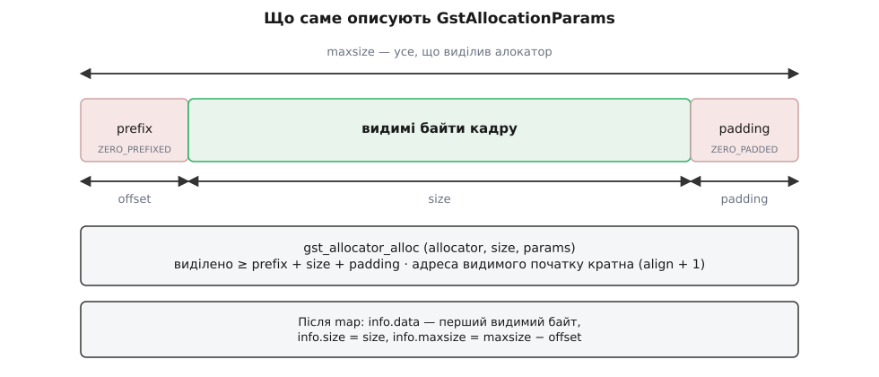

# 📋 Контракт буфера, пам'яті й пулу GStreamer

Аркуш для того, хто пише елемент: сигнатури, поля структур, значення прапорців і — найважливіше — порядок викликів, який не можна переставити. Усе стосується стабільного C-інтерфейсу GStreamer 1.x; де функція чи прапорець з'явилися пізніше за 1.0, версія стоїть поруч.

## Заголовки й збірка

```c
#include <gst/gst.h>                    /* GstBuffer, GstMemory, GstBufferPool, GstQuery */
#include <gst/video/video.h>            /* GstVideoInfo, GstVideoMeta, опції відеопулу   */
#include <gst/allocators/allocators.h>  /* GstDmaBufAllocator, GstFdAllocator            */
```

```
pkg-config --cflags --libs gstreamer-1.0 gstreamer-video-1.0 gstreamer-allocators-1.0
```

## Буфер: створення

| Сигнатура | Що дає |
|---|---|
| `GstBuffer *gst_buffer_new (void)` | порожній конверт без жодного блоку пам'яті; лічильник посилань 1 |
| `GstBuffer *gst_buffer_new_allocate (GstAllocator *allocator, gsize size, GstAllocationParams *params)` | конверт із одним свіжим блоком; `allocator == NULL` — типовий системний, `params == NULL` — нулі в усіх полях; `NULL` при невдачі |
| `GstBuffer *gst_buffer_new_wrapped (gpointer data, gsize size)` | загортає **ваш** блок і забирає його собі; звільнить через `g_free` |
| `GstBuffer *gst_buffer_new_wrapped_full (GstMemoryFlags flags, gpointer data, gsize maxsize, gsize offset, gsize size, gpointer user_data, GDestroyNotify notify)` | єдиний спосіб загорнути чужу пам'ять зі своїм звільненням: `notify(user_data)` покличуть, коли блок помре |
| `GstBuffer *gst_buffer_new_memdup (gconstpointer data, gsize size)` | копія ваших байтів (1.20) |

Лічильник посилань:

```c
GstBuffer *gst_buffer_ref   (GstBuffer *buf);   /* +1, повертає той самий вказівник */
void       gst_buffer_unref (GstBuffer *buf);   /* −1, на нулі звільняє або повертає в пул */
```

## Хто кому винен посилання

Половина витоків і половина падінь у власних елементах — це не логіка, а хибно прочитана передача володіння. Ось повний перелік для найчастіших викликів.

| Виклик | Що стається з посиланням |
|---|---|
| `gst_pad_push (pad, buf)` | **забирає ваше**: після виклику `buf` чіпати не можна ні для читання, ні для `unref` |
| `gst_buffer_pool_acquire_buffer (…, &buf, …)` | **дає вам**: ваш `unref` і є поверненням буфера в пул |
| `gst_buffer_peek_memory (buf, i)` | **нічого**: підглядання, `unref` робити не можна |
| `gst_buffer_get_memory (buf, i)` | **дає вам**: `gst_memory_unref` обов'язковий |
| `gst_buffer_append_memory (buf, mem)` | **забирає ваше** посилання на `mem` |
| `gst_buffer_pool_set_config (pool, config)` | **забирає** `config` — навіть коли повертає `FALSE`; повторно ним користуватися не можна |
| `gst_buffer_pool_get_config (pool)` | **дає вам** свіжу копію структури |
| `gst_query_add_allocation_pool (query, pool, …)` | **нічого**: запит бере власне посилання, ваше лишається на вас |
| `gst_query_parse_nth_allocation_pool (…, &pool, …)` | **дає вам**: `gst_object_unref (pool)` обов'язковий |

## Чотири різні «копії»

Слово одне, а операції геть різні за ціною.

```c
GstBuffer *gst_buffer_copy        (const GstBuffer *buf);
GstBuffer *gst_buffer_copy_deep   (const GstBuffer *buf);                  /* 1.6 */
GstBuffer *gst_buffer_copy_region (GstBuffer *parent, GstBufferCopyFlags flags,
                                   gsize offset, gsize size);
gboolean   gst_buffer_copy_into   (GstBuffer *dest, GstBuffer *src,
                                   GstBufferCopyFlags flags, gsize offset, gsize size);
```

| Виклик | Що робить із байтами | Скільки коштує |
|---|---|---|
| `gst_buffer_copy` | новий конверт, блоки беруться в спільне володіння | десятки наносекунд |
| `gst_buffer_copy_deep` | новий конверт **і** нова пам'ять із перенесеними байтами; результат придатний до запису | повний `memcpy` кадру |
| `gst_buffer_copy_region` | новий конверт із вікном `offset…offset+size` над тією самою пам'яттю; `size = -1` — до кінця | як `gst_buffer_copy` |
| `gst_buffer_copy_into` | загальна форма: що саме перенести, задають прапорці; `dest` мусить бути придатним до запису | залежить від прапорців |

`GstBufferCopyFlags` — саме те, чим `copy_into` відрізняється від решти:

| Прапорець | Значення | Що переносить |
|---|---|---|
| `GST_BUFFER_COPY_NONE` | 0 | нічого |
| `GST_BUFFER_COPY_FLAGS` | 1 | прапорці буфера |
| `GST_BUFFER_COPY_TIMESTAMPS` | 2 | PTS, DTS, тривалість, `offset`, `offset_end` |
| `GST_BUFFER_COPY_META` | 4 | ті метадані, що дозволяють себе копіювати |
| `GST_BUFFER_COPY_MEMORY` | 8 | блоки пам'яті — **у спільне володіння**, без руху байтів |
| `GST_BUFFER_COPY_MERGE` | 16 | злити всі блоки в один |
| `GST_BUFFER_COPY_DEEP` | 32 | справді перенести байти в нову пам'ять |
| `GST_BUFFER_COPY_METADATA` | 7 | зібране з `FLAGS`, `TIMESTAMPS` і `META` |
| `GST_BUFFER_COPY_ALL` | 15 | `METADATA` разом із `MEMORY` — саме це робить `gst_buffer_copy` |

Пастка тут одна й вона коштує мегабайтів: `MEMORY` без `DEEP` **не копіює байтів**. Тому `gst_buffer_copy` дає не «свій кадр», а другого власника на ті самі пікселі — і робить їх непридатними до запису обом.

## Дві писабельності

| Рівень | Перевірити | Зробити придатним | Що дозволяє |
|---|---|---|---|
| конверт | `gboolean gst_buffer_is_writable (const GstBuffer *buf)` | `GstBuffer *gst_buffer_make_writable (GstBuffer *buf)` | правити PTS/DTS/прапорці, чіпляти метадані, додавати й міняти блоки |
| пам'ять | `gboolean gst_memory_is_writable (GstMemory *mem)`, `gboolean gst_buffer_is_all_memory_writable (GstBuffer *buf)` | `GstMemory *gst_memory_make_writable (GstMemory *mem)` | писати байти |

Правило під обома рядками одне: об'єкт придатний до запису, коли на нього рівно одне посилання й на ньому немає виключного захвату. Звідси три наслідки, кожен із яких дає помилку, якщо його забути.

`make_writable` **з'їдає ваше посилання й повертає нове** — можливо, на інший об'єкт. Єдина правильна форма:

```c
buf = gst_buffer_make_writable (buf);   /* старий вказівник після цього недійсний */
```

Результат `gst_memory_share` документовано **гарантовано непридатний до запису** — спільне вікно на чужі байти не можна зробити своїм жодними маніпуляціями з лічильником.

`GST_MEMORY_FLAG_READONLY` не знімається взагалі: така пам'ять придатна лише для копіювання.

## `map` / `unmap`

```c
gboolean   gst_buffer_map       (GstBuffer *buffer, GstMapInfo *info, GstMapFlags flags);
gboolean   gst_buffer_map_range (GstBuffer *buffer, guint idx, gint length,
                                 GstMapInfo *info, GstMapFlags flags);
void       gst_buffer_unmap     (GstBuffer *buffer, GstMapInfo *info);

gboolean   gst_memory_map        (GstMemory *mem, GstMapInfo *info, GstMapFlags flags);
void       gst_memory_unmap      (GstMemory *mem, GstMapInfo *info);
GstMemory *gst_memory_make_mapped (GstMemory *mem, GstMapInfo *info, GstMapFlags flags);
```

`gst_buffer_map (buf, &info, flags)` — це рівно `gst_buffer_map_range (buf, 0, -1, &info, flags)`: усі блоки від нульового до кінця. `length = -1` означає «до кінця», а не «один».

Поля `GstMapInfo`:

| Поле | Тип | Що в ньому |
|---|---|---|
| `memory` | `GstMemory *` | відображений блок; коли блоків було кілька — тимчасовий злитий |
| `flags` | `GstMapFlags` | з чим відображено |
| `data` | `guint8 *` | перший **видимий** байт, уже з урахуванням `offset` |
| `size` | `gsize` | скільки видимих байтів |
| `maxsize` | `gsize` | скільки байтів доступно від `data` до кінця виділеного, тобто `maxsize − offset` блоку |
| `user_data[4]` | `gpointer` | службове поле алокатора — не чіпати |

Прапорці доступу:

| Прапорець | Значення | Семантика |
|---|---|---|
| `GST_MAP_READ` | 1 | читати; для чужої пам'яті може означати перенесення вмісту до процесора |
| `GST_MAP_WRITE` | 2 | писати; вимагає придатного до запису **буфера** |
| `GST_MAP_READWRITE` | 3 | обидва напрямки — і платите за обидва |
| `GST_MAP_REF_MEMORY` | 256 | відображення саме тримає посилання на пам'ять і відпускає його на `unmap` (1.28) |
| `GST_MAP_FLAG_LAST` | 65536 | звідси починаються прапорці плагінів (скажімо, `GST_MAP_GL` у бібліотеці GL) |

Що тут насправді важить:

**Кожному успішному `map` — рівно один `unmap`, включно зі шляхами помилок.** Поки блок відображений, на ньому висить захват: ніхто не візьме його на запис, а буфер із пулу не повернеться в обіг.

**`GST_MAP_WRITE` вимагає придатного до запису буфера.** Якщо буфер придатний, а пам'ять — ні, GStreamer мовчки виділяє придатну до запису копію, підмінює нею блок у буфері й ставить на буфер `GST_BUFFER_FLAG_TAG_MEMORY`. Виклик успішний, копія кадру відбулася, у коді її не видно.

**`map` кількох блоків зливає їх** — а зливання це `memcpy` усього буфера. Коли це важить, спитайте спершу `gst_buffer_n_memory (buf)`.

**`FALSE` повертається**, коли пам'ять узагалі не відображається в простір користувача (`GST_MEMORY_FLAG_NOT_MAPPABLE`) або не підтримує запитаний вид доступу.

Мінімальний коректний виклик:

```c
GstMapInfo info = GST_MAP_INFO_INIT;

if (!gst_buffer_map (buf, &info, GST_MAP_READ))
  return GST_FLOW_ERROR;

checksum = crc32 (info.data, info.size);

gst_buffer_unmap (buf, &info);          /* і на кожному ранньому виході теж */
```

## `GstMemory`: поля й операції над вікном

```c
struct _GstMemory {
  GstMiniObject  mini_object;
  GstAllocator  *allocator;   /* хто виділив і хто звільнить      */
  GstMemory     *parent;      /* не NULL, коли це спільне вікно   */
  gsize          maxsize;     /* скільки насправді виділено       */
  gsize          align;       /* маска вирівнювання при виділенні */
  gsize          offset;      /* де починається видима частина    */
  gsize          size;        /* скільки видимо                   */
};
```

```c
gsize      gst_memory_get_sizes (GstMemory *mem, gsize *offset, gsize *maxsize);
void       gst_memory_resize    (GstMemory *mem, gssize offset, gsize size);
GstMemory *gst_memory_share     (GstMemory *mem, gssize offset, gssize size);
GstMemory *gst_memory_copy      (GstMemory *mem, gssize offset, gssize size);
gboolean   gst_memory_is_span   (GstMemory *mem1, GstMemory *mem2, gsize *offset);
```

| Операція | Рух байтів | Результат придатний до запису | Умови |
|---|---|---|---|
| `resize` | немає | той самий об'єкт | `mem` мусить бути придатним до запису; `offset` — **зсув відносно поточного** (може бути від'ємним), `size` — новий розмір; `offset + size ≤ maxsize` |
| `share` | немає | **ні, гарантовано** | `size = -1` — до кінця; на `GST_MEMORY_FLAG_NO_SHARE` GStreamer робить копію замість спільного вікна |
| `copy` | повний | **так, гарантовано** | новий незалежний блок |
| `is_span` | немає | — | `TRUE`, коли два вікна мають спільного батька й лежать поруч |

`gst_memory_resize` ще й скидає `ZERO_PREFIXED`, коли зростає `offset`, і `ZERO_PADDED`, коли зростає хвіст: занулене поле вже не там, де було.

На рівні буфера тим самим керують `gst_buffer_resize (GstBuffer *buffer, gssize offset, gssize size)` і `gst_buffer_get_sizes`.

Прапорці блоку:

| Прапорець | Що означає | Звідки береться |
|---|---|---|
| `GST_MEMORY_FLAG_READONLY` | придатною до запису не стане ніколи — лише копія | файл, відображений на читання; регіон драйвера |
| `GST_MEMORY_FLAG_NO_SHARE` | у спільне володіння не віддавати: там, де GStreamer вирішує сам, він зробить копію | дефіцитний ресурс, що мусить швидко вернутися власникові |
| `GST_MEMORY_FLAG_ZERO_PREFIXED` | `prefix` занулено при виділенні | `GstAllocationParams.flags` |
| `GST_MEMORY_FLAG_ZERO_PADDED` | `padding` занулено при виділенні | те саме |
| `GST_MEMORY_FLAG_PHYSICALLY_CONTIGUOUS` | суцільна у фізичній пам'яті — придатна під прямий доступ пристрою | алокатори драйверів |
| `GST_MEMORY_FLAG_NOT_MAPPABLE` | у простір користувача не відображається взагалі (1.2) | захищені апаратні буфери |

Перевіряти — макросами `GST_MEMORY_IS_READONLY (mem)`, `GST_MEMORY_IS_NO_SHARE (mem)` і далі за іменами.

## Алокатор і параметри виділення

```c
GstAllocator *gst_allocator_find         (const gchar *name);   /* NULL → типовий */
GstMemory    *gst_allocator_alloc        (GstAllocator *allocator, gsize size,
                                          GstAllocationParams *params);
void          gst_allocator_free         (GstAllocator *allocator, GstMemory *memory);
void          gst_allocation_params_init (GstAllocationParams *params);
```

Імена в реєстрі: `GST_ALLOCATOR_SYSMEM` — це рядок `"SystemMemory"`, `GST_ALLOCATOR_DMABUF` — `"dmabuf"`. Другий дає блоки, всередині яких лежить файловий дескриптор замість вказівника, і супроводжується ознакою caps `GST_CAPS_FEATURE_MEMORY_DMABUF` — рядком `"memory:DMABuf"`; його інтерфейс — `gst_dmabuf_allocator_new`, `gst_dmabuf_allocator_alloc (allocator, fd, size)`, `gst_is_dmabuf_memory (mem)`, `gst_dmabuf_memory_get_fd (mem)`. Які елементи такі блоки віддають і приймають на кожній платформі — в [апаратному декодуванні](book:media-vision/hardware-decode-elements): там розібрано, що VA-API, NVDEC, V4L2 і MediaCodec постачають кадр кожен у своєму вигляді пам'яті.

`GstAllocationParams` — чотири поля, і перше ж із них читають неправильно:

| Поле | Тип | Значення |
|---|---|---|
| `flags` | `GstMemoryFlags` | з якими прапорцями народиться блок (`ZERO_PREFIXED`, `ZERO_PADDED`) |
| `align` | `gsize` | **бітова маска**, а не кількість байтів: вирівнювання дорівнює `align + 1` |
| `prefix` | `gsize` | скільки байтів лишити **перед** видимими даними |
| `padding` | `gsize` | скільки лишити **після** |

```
вирівнювання = align + 1        →  align завжди 2ⁿ − 1
8 байтів   → align = 7
64 байти   → align = 63
256 байтів → align = 255

maxsize ≥ prefix + size + padding
offset  = prefix                (видимі байти починаються за префіксом)
адреса info.data кратна (align + 1)
```

Чому маска, а не число: перевірка вирівнювання — це одне побітове «і», тому алокатор зберігає готову маску, а не рахує її щоразу. Звідки взагалі береться вимога кратної адреси, розібрано у [вирівнюванні даних у пам'яті](book:programming/memory-alignment): апаратура читає пам'ять словами фіксованого розміру, і невирівняний доступ коштує зайвої транзакції або взагалі заборонений.

**Кадр 1920×1080 NV12 для апаратного блоку, який вимагає рядка, кратного 256 байтам, і 64 байтів запасу за кінцем кадру.**

```
крок рядка = ceil(1920 / 256) · 256 = 8 · 256   = 2048 байтів
площина Y  = 2048 · 1080                        = 2 211 840
площина UV = 2048 · 540                         = 1 105 920
size       = 2 211 840 + 1 105 920              = 3 317 760 байтів

params.align   = 255      (256 байтів)
params.prefix  = 0
params.padding = 64
maxsize ≥ 0 + 3 317 760 + 64                    = 3 317 824 байти
```

Щільно спакований той самий кадр займав би 3 110 400 байтів — вимоги заліза додали 6.7 %. Це і є ціна того, що апаратний блок читає кадр як є, без перекладання рядок за рядком.



*Параметри виділення визначають розкладку блоку, а `GstMapInfo` показує з неї лише видиме вікно.*

## `GstBufferPool`: порядок викликів

Порядок тут не рекомендація, а умова: конфігурацію не приймуть на активному пулі, а буферів не буде до активації.

```c
GstBufferPool *pool = gst_buffer_pool_new ();      /* або з елемента, або із запиту */
GstStructure  *config = gst_buffer_pool_get_config (pool);   /* окрема копія */

gst_buffer_pool_config_set_params (config, caps, size, min_buffers, max_buffers);
gst_buffer_pool_config_set_allocator (config, allocator, &params);
if (gst_buffer_pool_has_option (pool, GST_BUFFER_POOL_OPTION_VIDEO_META))
  gst_buffer_pool_config_add_option (config, GST_BUFFER_POOL_OPTION_VIDEO_META);

if (!gst_buffer_pool_set_config (pool, config))    /* config з'їдено в будь-якому разі */
  goto config_failed;

gst_buffer_pool_set_active (pool, TRUE);           /* саме тут виділяються min_buffers */

/* … робота … */
gst_buffer_pool_acquire_buffer (pool, &buf, NULL);
gst_buffer_unref (buf);                            /* повернення в пул */

gst_buffer_pool_set_active (pool, FALSE);          /* звільняє, коли всі буфери вдома */
gst_object_unref (pool);
```

Три речі, на яких спотикаються:

`gst_buffer_pool_get_config` віддає **копію** — правки в ній ні на що не впливають, доки не покликано `set_config`. `gst_buffer_pool_set_config` забирає структуру собі навіть тоді, коли повертає `FALSE`: звільняти або перевикористовувати її не можна. І `FALSE` не завжди означає відмову — пул міг прийняти конфігурацію із власними виправленими числами, тож після невдачі беруть `get_config` знову й звіряють через `gst_buffer_pool_config_validate_params (config, caps, size, min, max)`.

Ключі конфігурації — це поля звичайної `GstStructure`, і ставлять їх лише через помічники:

| Ключ | Тип | Ставить | Значення |
|---|---|---|---|
| `caps` | `GstCaps` | `config_set_params` | формат, під який пул |
| `size` | `guint` | `config_set_params` | розмір одного буфера в байтах |
| `min-buffers` | `guint` | `config_set_params` | скільки виділити наперед і завжди тримати |
| `max-buffers` | `guint` | `config_set_params` | стеля; **0 — без межі**, а отже й без зворотного тиску |
| `allocator` | `GstAllocator` | `config_set_allocator` | `NULL` — типовий |
| `params` | `GstAllocationParams` | `config_set_allocator` | вирівнювання, префікс, запас |
| `options` | масив рядків | `config_add_option` | розширення поведінки пулу |

Нуль у `max-buffers` варто читати як вимкнений запобіжник: пул зростатиме, поки є пам'ять, і джерело ніколи не зупиниться. Саме цим числом і `min-buffers` регулюють компроміс між рівністю потоку й довжиною черги — як ним користуватися свідомо, розбирає [затримка й буферизація в конвеєрі](book:media-vision/latency-and-buffering).

Опції пулу — рядки; питати можна лише те, що пул сам оголосив через `gst_buffer_pool_get_options` або `gst_buffer_pool_has_option`:

| Константа | Рядок | Дія |
|---|---|---|
| `GST_BUFFER_POOL_OPTION_VIDEO_META` | `"GstBufferPoolOptionVideoMeta"` | пул чіпляє `GstVideoMeta` на кожен буфер |
| `GST_BUFFER_POOL_OPTION_VIDEO_ALIGNMENT` | `"GstBufferPoolOptionVideoAlignment"` | вмикає `gst_buffer_pool_config_set_video_alignment (config, &align)` — поля запасу з чотирьох боків і `stride_align` на кожну площину |

## Отримати й віддати буфер

```c
GstFlowReturn gst_buffer_pool_acquire_buffer (GstBufferPool *pool, GstBuffer **buffer,
                                              GstBufferPoolAcquireParams *params);
void          gst_buffer_pool_release_buffer (GstBufferPool *pool, GstBuffer *buffer);
void          gst_buffer_pool_set_flushing   (GstBufferPool *pool, gboolean flushing);
gboolean      gst_buffer_pool_is_active      (GstBufferPool *pool);
```

`release_buffer` у звичайному коді не викликають: буфер повертається сам, коли його лічильник падає до нуля. Ця функція потрібна тому, хто пише власний пул.

| Повернення `acquire_buffer` | Коли |
|---|---|
| `GST_FLOW_OK` | буфер ваш |
| `GST_FLOW_FLUSHING` | пул неактивний або в режимі скидання — не помилка, згортайте роботу |
| `GST_FLOW_EOS` | вільних буферів немає, і ви просили не чекати |
| `GST_FLOW_ERROR` | виділити не вдалося |

Типово порожній пул **блокує** виклик, доки хтось не поверне буфер, доки пул не переведуть у скидання або не деактивують. Це і є зворотний тиск конвеєра: джерело зупиняється не за таймером, а тому, що йому нема куди писати.

`GstBufferPoolAcquireParams` — чотири поля:

| Поле | Тип | Значення |
|---|---|---|
| `format` | `GstFormat` | одиниця для `start`/`stop`; зазвичай `GST_FORMAT_UNDEFINED` |
| `start`, `stop` | `gint64` | діапазон для спеціалізованих пулів; типовий їх ігнорує |
| `flags` | `GstBufferPoolAcquireFlags` | див. нижче |

| Прапорець | Значення | Дія |
|---|---|---|
| `GST_BUFFER_POOL_ACQUIRE_FLAG_NONE` | 0 | звичайне отримання, з очікуванням |
| `GST_BUFFER_POOL_ACQUIRE_FLAG_KEY_UNIT` | 1 | підказка: буде опорний кадр |
| `GST_BUFFER_POOL_ACQUIRE_FLAG_DONTWAIT` | 2 | **не блокуватися**: замість очікування одразу `GST_FLOW_EOS` |
| `GST_BUFFER_POOL_ACQUIRE_FLAG_DISCONT` | 4 | підказка: буде розрив потоку |

`KEY_UNIT` і `DISCONT` типовий пул ігнорує — вони для тих, хто по-різному готує буфери під різні кадри. А `DONTWAIT` має цілком практичне застосування в діагностиці: якщо з ним `acquire` стабільно повертає `GST_FLOW_EOS`, значить буфери десь застрягли — найчастіше у власному коді, який зберіг посилання, або в незакритому `map`.

```c
GstBufferPoolAcquireParams ap = { 0, };
ap.flags = GST_BUFFER_POOL_ACQUIRE_FLAG_DONTWAIT;

if (gst_buffer_pool_acquire_buffer (pool, &buf, &ap) != GST_FLOW_OK)
  GST_WARNING_OBJECT (self, "пул порожній: усі %u буферів на руках", max_buffers);
```

## Запит на алокацію

Домовленість про пам'ять їде конвеєром як звичайний запит — той самий механізм, яким пади питають одне одного про що завгодно ([події й запити](book:media-vision/events-and-queries): запит іде до сусіда й повертається до відправника з дописаною відповіддю). Надсилає його той, хто **виділятиме** буфери, а відповідає той, хто їх **споживатиме**.

```c
GstQuery *gst_query_new_allocation   (GstCaps *caps, gboolean need_pool);
void      gst_query_parse_allocation (GstQuery *query, GstCaps **caps, gboolean *need_pool);
```

`need_pool == FALSE` читається як «мені досить твоїх вимог, створювати пул не треба» — тоді споживач може додати запис із `NULL` замість пулу, але з розміром і мінімумом буферів.

Три однакові за будовою набори: пули, параметри виділення, метадані.

```c
/* пули */
void   gst_query_add_allocation_pool        (GstQuery *q, GstBufferPool *pool,
                                             guint size, guint min_buffers, guint max_buffers);
guint  gst_query_get_n_allocation_pools     (GstQuery *q);
void   gst_query_parse_nth_allocation_pool  (GstQuery *q, guint index, GstBufferPool **pool,
                                             guint *size, guint *min, guint *max);
void   gst_query_set_nth_allocation_pool    (GstQuery *q, guint index, GstBufferPool *pool,
                                             guint size, guint min, guint max);
void   gst_query_remove_nth_allocation_pool (GstQuery *q, guint index);

/* параметри виділення */
void   gst_query_add_allocation_param       (GstQuery *q, GstAllocator *allocator,
                                             const GstAllocationParams *params);
guint  gst_query_get_n_allocation_params    (GstQuery *q);
void   gst_query_parse_nth_allocation_param (GstQuery *q, guint index, GstAllocator **allocator,
                                             GstAllocationParams *params);

/* метадані */
void     gst_query_add_allocation_meta       (GstQuery *q, GType api, const GstStructure *params);
guint    gst_query_get_n_allocation_metas    (GstQuery *q);
GType    gst_query_parse_nth_allocation_meta (GstQuery *q, guint index,
                                              const GstStructure **params);
gboolean gst_query_find_allocation_meta      (GstQuery *q, GType api, guint *index);
```

Три домовленості, без яких ці функції читаються неправильно:

**Порядок — це перевага.** Індекс 0 означає «найбажаніше»; той, хто вирішує, дивиться спершу на нього. Дописуючи свій пул до вже наявних, ви стаєте останнім у черзі.

**`NULL` у полі алокатора — не помилка.** Такий запис каже: «конкретного алокатора не вимагаю, але `align`, `prefix` і `padding` мають бути ось такі».

**Метадані оголошують типом.** `gst_query_add_allocation_meta (query, GST_VIDEO_META_API_TYPE, NULL)` означає «я розумію `GstVideoMeta`» — а отже, той, хто виділяє, може лишити свій крок рядка й не перекладати кадр. Дзеркально: якщо `gst_query_find_allocation_meta` не знайшов цього типу, кадр доведеться віддавати щільно спакованим.

## Хто кого питає: `propose_allocation` ↔ `decide_allocation`

Послідовність фіксована й починається після того, як формат уже узгоджено ([узгодження caps](book:media-vision/caps-negotiation): сусідні елементи спершу домовляються про те, **що** передавати, і лише потім — **у чому**).

1. Елемент, який виділятиме буфери, будує `gst_query_new_allocation (caps, need_pool)` і надсилає його вниз за потоком через `gst_pad_peer_query (srcpad, query)`.
2. У споживача запит приходить на sink-пад, і базовий клас кличе **`propose_allocation`** — там споживач додає свій пул, свої `GstAllocationParams` і перелік метаданих, які розуміє.
3. Запит повертається до відправника, і базовий клас кличе **`decide_allocation`** — той, хто виділяє, або бере запропоноване, або створює власний пул із урахуванням чужих обмежень.

Сигнатури різняться між базовими класами:

```c
/* бік СПОЖИВАЧА */
gboolean (*propose_allocation) (GstBaseSink *sink, GstQuery *query);
gboolean (*propose_allocation) (GstBaseTransform *trans, GstQuery *decide_query, GstQuery *query);
gboolean (*propose_allocation) (GstVideoDecoder *decoder, GstQuery *query);

/* бік того, хто ВИДІЛЯЄ */
gboolean (*decide_allocation) (GstBaseSrc *src, GstQuery *query);
gboolean (*decide_allocation) (GstBaseTransform *trans, GstQuery *query);
gboolean (*decide_allocation) (GstVideoDecoder *decoder, GstQuery *query);
```

Зайвий аргумент у `GstBaseTransform` не примха: `decide_query` — це той запит, який елемент сам відправив далі за потоком (або `NULL`, коли він у наскрізному режимі). Через нього перетворювач передає вимоги свого споживача вгору, замість вигадувати власні.

Обидві половини цілком:

```c
/* ── СПОЖИВАЧ: що я вимагаю від того, хто виділятиме ─────────────────── */
static gboolean
my_sink_propose_allocation (GstBaseSink * sink, GstQuery * query)
{
  GstCaps *caps;
  gboolean need_pool;
  GstVideoInfo info;
  GstAllocationParams params;

  gst_query_parse_allocation (query, &caps, &need_pool);
  if (caps == NULL || !gst_video_info_from_caps (&info, caps))
    return FALSE;

  /* «я розумію GstVideoMeta» — джерело може лишити свій крок рядка */
  gst_query_add_allocation_meta (query, GST_VIDEO_META_API_TYPE, NULL);

  /* вимоги мого заліза: рядок по 256 байтів, 64 байти запасу за кадром */
  gst_allocation_params_init (&params);
  params.align = 255;
  params.padding = 64;
  gst_query_add_allocation_param (query, NULL, &params);   /* алокатор — будь-який */

  if (need_pool) {
    GstBufferPool *pool = gst_video_buffer_pool_new ();
    GstStructure *config = gst_buffer_pool_get_config (pool);

    gst_buffer_pool_config_set_params (config, caps, GST_VIDEO_INFO_SIZE (&info), 4, 0);
    gst_buffer_pool_config_add_option (config, GST_BUFFER_POOL_OPTION_VIDEO_META);
    if (!gst_buffer_pool_set_config (pool, config)) {
      gst_object_unref (pool);
      return FALSE;
    }
    gst_query_add_allocation_pool (query, pool, GST_VIDEO_INFO_SIZE (&info), 4, 0);
    gst_object_unref (pool);            /* запит узяв власне посилання */
  }
  return TRUE;
}
```

```c
/* ── ТОЙ, ХТО ВИДІЛЯЄ: обираю пул із зібраних відповідей ─────────────── */
static gboolean
my_src_decide_allocation (GstBaseSrc * src, GstQuery * query)
{
  GstBufferPool *pool = NULL;
  GstStructure *config;
  GstCaps *caps;
  guint size = 0, min = 0, max = 0;
  gboolean had_pool;

  gst_query_parse_allocation (query, &caps, NULL);

  had_pool = gst_query_get_n_allocation_pools (query) > 0;
  if (had_pool)
    gst_query_parse_nth_allocation_pool (query, 0, &pool, &size, &min, &max);

  if (pool == NULL) {                   /* ніхто нічого не запропонував */
    pool = gst_video_buffer_pool_new ();
    size = MAX (size, own_frame_size (src));
    min = 3;
    max = 0;
  }

  config = gst_buffer_pool_get_config (pool);
  gst_buffer_pool_config_set_params (config, caps, size, min, max);
  if (gst_query_find_allocation_meta (query, GST_VIDEO_META_API_TYPE, NULL))
    gst_buffer_pool_config_add_option (config, GST_BUFFER_POOL_OPTION_VIDEO_META);
  gst_buffer_pool_set_config (pool, config);

  /* рішення треба покласти назад у запит — базовий клас активує саме цей пул */
  if (had_pool)
    gst_query_set_nth_allocation_pool (query, 0, pool, size, min, max);
  else
    gst_query_add_allocation_pool (query, pool, size, min, max);

  gst_object_unref (pool);
  return TRUE;
}
```

## Симптом → причина

| Що бачите | Що сталося | Що перевірити |
|---|---|---|
| `map` із `GST_MAP_WRITE` пройшов, а в профілі з'явився `memcpy` | пам'ять була спільною, GStreamer підмінив її копією | `gst_buffer_is_all_memory_writable` перед `map`; `GST_BUFFER_FLAG_TAG_MEMORY` після |
| пул щоразу виділяє нові буфери замість своїх | у буфера підмінили пам'ять, тому пул його не приймає назад | `GST_BUFFER_FLAG_IS_SET (buf, GST_BUFFER_FLAG_TAG_MEMORY)` |
| `acquire_buffer` не повертається | усі буфери на руках, ніхто не відпустив | `DONTWAIT` для перевірки; шукати незакритий `map` і зайві `gst_buffer_ref` |
| `set_config` повернув `FALSE` | пул активний, або опція не підтримується, або числа виправлено | `gst_buffer_pool_is_active`, `has_option`, `config_validate_params` |
| картинка йде сходинками навскіс | адресу рахували за шириною, а розкладка йде за кроком рядка | чи додано `GST_BUFFER_POOL_OPTION_VIDEO_META` і `gst_query_add_allocation_meta` |
| `gst_buffer_map` коштує мілісекунди | зливаються кілька блоків або пам'ять не системна | `gst_buffer_n_memory`, вид пам'яті в узгоджених caps |
