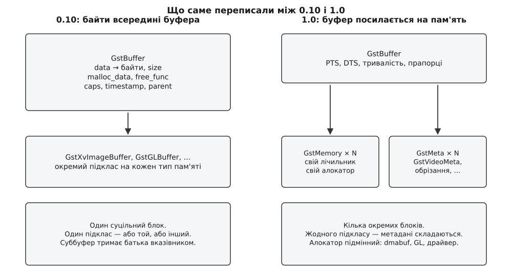

# 📜 Як GStreamer переписав пам'ять: від «вказівника й довжини» до GstMemory

Модель пам'яті, у якій буфер лише посилається на пам'ять, а пам'ять має власного алокатора й власний лічильник, з'явилася не з першого дня — вона коштувала проєктові двох років роботи й зламаного двійкового інтерфейсу. До версії 1.0.0, випущеної 24 вересня 2012 року, GStreamer вісім років жив із буфером, усередині якого просто лежав вказівник на байти, і саме цей вказівник урешті став на заваді всьому, заради чого модель переписували: апаратним декодерам, текстурам відеокарти й драйверам камер.

## Буфер, спроєктований під процесор і системну пам'ять

Гілка 0.10 вийшла в грудні 2005 року. Світ, під який її робили, був простий: файл або мережевий потік приходить у програму, процесор його розтискає в звичайну оперативну пам'ять, і звідти картинка йде на екран. Уся обробка — в адресному просторі процесу, уся пам'ять — з `malloc`. Структура буфера це чесно віддзеркалювала:

```c
struct _GstBuffer {
  GstMiniObject          mini_object;
  guint8                *data;         /* вказівник на байти */
  guint                  size;         /* скільки їх */
  GstClockTime           timestamp;
  GstClockTime           duration;
  GstCaps               *caps;         /* формат — просто в буфері */
  guint64                offset;
  guint64                offset_end;
  guint8                *malloc_data;  /* що звільняти */
  GFreeFunc              free_func;    /* чим звільняти */
  GstBuffer             *parent;       /* чий я суббуфер */
  gpointer _gst_reserved[GST_PADDING - 2];
};
```

*Структура `GstBuffer` у 0.10 — байти, їхній розмір і спосіб їх звільнити лежать прямо в конверті. Наведено за заголовком `gst/gstbuffer.h` гілки 0.10.*

Прочитайте її ще раз як опис світогляду. Байти в буфері рівно одні й рівно суцільні: `data` плюс `size`. Спосіб їх позбутися зашитий у два поля поруч — `malloc_data` і `free_func`. Формат (`caps`) подорожує з кожним кадром, хоча між кадрами він майже ніколи не змінюється. А `parent` — це весь механізм суббуферів: щоб віддати шматок чужого буфера, створювали новий буфер, який тримав посилання на батька й показував усередину його байтів. Працювало це справно, і саме тому протрималося вісім років.

Чого в цій структурі немає — місця, де можна сказати «а ці байти не мої». Немає поняття «хто виділив», є лише «чим звільняти». Немає поняття «блоків», є один. І немає жодного місця, куди причепити щось, чого автори не передбачили заздалегідь.

## Підклас на кожен різновид пам'яті

Спосіб обійти це в 0.10 був — і саме він урешті все й зіпсував. `GstBuffer` був об'єктом типової системи GLib, і в нього був клас:

```c
struct _GstBufferClass {
  GstMiniObjectClass    mini_object_class;
};
```

Клас порожній, але він є — а отже, буфер можна успадкувати. Так усі й робили. Sink для XVideo визначав `GstXvImageBuffer` — підклас `GstBuffer` із додатковими даними про зображення XvImage; графічний стек мав власний буфер для текстури; кожен апаратний декодер SoC приходив зі своїм. Ззовні це виглядало як `GstBuffer`, і елемент, який нічого про підклас не знав, брав `data` й `size` і працював собі далі.

Проблем із цим три, і всі три фатальні.

Перша: підклас можна мати тільки один. Буфер не буває водночас «зображенням XvImage» і «кадром з областю обрізання від камери» — успадкування не складається. Щойно двом підсистемам треба причепити до одного кадру свої дані, доводиться робити третій підклас, який знає про обидві, — і так на кожну пару.

Друга: чужий підклас невидимий. Елемент від іншого постачальника бачить лише спільну частину — вказівник і довжину. Якщо байти насправді лежать у пам'яті відеокарти й `data` вказує на тимчасову копію, він цього не дізнається й не має способу спитати. Тобто «пам'ять особлива» було відомо тільки тим, хто написав саме цей підклас, — а весь сенс конвеєра в тому, що елементи пишуть різні люди й вони не мають знати одне про одного.

Третя: підклас губиться на першій же операції. Візьміть суббуфер від кадру-текстури — і отримаєте звичайний `GstBuffer` із вказівником усередину, без жодної інформації про те, звідки байти. Скопіюйте буфер — те саме.



*Ліва половина — світ, де тип пам'яті виражають типом буфера. Права — світ, де пам'ять і опис кадру просто складаються в конверт.*

## Одна функція на дві різні роботи

Друга гниль сиділа в узгодженні. У 0.10 елемент, якому треба було віддати кадр далі, не виділяв пам'ять сам, а просив її в сусіда: `gst_pad_alloc_buffer()`. Ідея правильна — хай пам'ять дає той, хто врешті читатиме, бо він знає, де їй краще лежати. Але та сама функція водночас виконувала й другу роботу: сусід міг повернути буфер з **іншими** caps, і це означало «зміни формат». Офіційний посібник із перенесення на 1.0 формулює це прямо: функції `pad_alloc` використовували і для виділення буферів, і щоб повідомити елементи вище за потоком про новий формат.

Дві незалежні речі — «де взяти пам'ять» і «на який формат перейти» — їхали одним каналом. Наслідки виходили паскудні саме тому, що канал був один: перевибрати пул буферів, не чіпаючи формату, не було як; виклик ішов угору за потоком крізь чужі елементи й міг заблокуватися; а поведінка на межі («сусід повернув не те, що просили») залежала від того, наскільки уважно кожен елемент її обробив.

## Дві сили, що штовхнули в переписування

Про те, чому за це взялися, найточніше сказав сам Вім Тайманс (Wim Taymans) — бельгійський розробник, один із засновників проєкту й головний архітектор нової моделі — у програмній доповіді на GStreamer Conference у серпні 2012 року. За звітом LWN, він назвав дві перешкоди, через які довелося міняти саме ядро, а не латати краї.

Перша — прихід вбудованого Linux, зазвичай на платах-системах-на-кристалі. Там кадр народжується в буфері драйвера камери, декодується апаратним блоком, який має свої вимоги до вирівнювання, і показується дисплейним контролером, що читає пам'ять напряму. Процесор у цьому ланцюжку взагалі зайвий, а модель, у якій буфер — це вказівник у адресний простір процесу, вимагає його присутності на кожному кроці.

Друга — перехід настільних систем на промальовування через відеокарту. Тут кадр має закінчити життя [текстурою](book:programming/gpu-texture-upload), тобто в пам'яті, до якої в процесора або немає прямого доступу, або він дорогий. Бібліотек для роботи з відеокартою кілька, вони несумісні між собою й уміють різне — а отже, «спеціальний буфер для GPU» як єдиний підклас не існує в принципі.

Обидві сили тиснуть в один бік: пам'ять під кадр більше не є справою GStreamer. Її дає хтось інший — драйвер, графічний стек, апаратний декодер, — і завдання бібліотеки не виділити її, а **вміти прийняти чужу** і провести крізь конвеєр, нічого про неї не припускаючи.

## Хроніка: два роки й одна дата

Порядок подій відновлюється за списками розсилки, історією комітів і звітами LWN.

```
жовтень 2010  — відкрито гілку 0.11 як майданчик для несумісних змін
18.03.2011    — коміт «memory: add memory implementation» (Wim Taymans,
                 wim.taymans@collabora.co.uk) — перша реалізація GstMemory
квітень 2011  — лист «GStreamer status 0.11» у gstreamer-devel:
                 перероблення GstBuffer і його пам'яті
серпень 2011  — випуск 0.11.0, перший із нового API
березень 2012 — код 0.11 заміщає master: рішення стало остаточним
24.09.2012    — GStreamer 1.0.0; анонс у gstreamer-announce
26.09.2012    — GNOME 3.6, під розклад якого підганяли дату
```

Коміт від 18 березня 2011 року (хеш `063abd4c`) — це та точка, де `GstMemory` уперше стає окремою сутністю: приблизно 266 доданих рядків, новий файл `gstmemory.c`, стандартні операції над пам'яттю й реєстрація алокаторів. Адреса автора в коміті — `@collabora.co.uk`: роботу над новою моделлю оплачувала Collabora, компанія, яка тоді вела чи не всю інженерію довкола GStreamer. Це не дрібниця для розуміння темпу: два роки суцільного переписування ядра бібліотеки — не волонтерський обсяг.

Анонс 1.0.0 у списку gstreamer-announce підписав Тім-Філіпп Мюллер (Tim-Philipp Müller), і перелік головних покращень у ньому починається саме з пам'яті: гнучкіше поводження з пам'яттю; розширювані й узгоджувані метадані буферів; механізми узгодження та перевузгодження caps, **відділені від виділення буферів**. Три пункти з першої трійки — це рівно три хвороби 0.10, описані вище.

## Що саме змінили

Переписування звелося до чотирьох розділень, і кожне вбиває одну з описаних проблем.

**Пам'ять стала окремим об'єктом.** `GstMemory` — самостійний блок із власним лічильником посилань, власними `maxsize`/`offset`/`size` і власною реалізацією `map`/`unmap`. Буфер більше не містить байтів, він містить **список** блоків пам'яті. Звідси відразу два дарунки: кадр із трьох площин не треба зливати в один шматок, а шматок чужого буфера — не «суббуфер із батьком», а просто ще один конверт над тією самою пам'яттю. Поля `GST_BUFFER_DATA()`, `GST_BUFFER_SIZE()`, `GST_BUFFER_MALLOCDATA()` і `GST_BUFFER_FREE_FUNC()` зникли з мови взагалі — доступ лише через `gst_buffer_map()`, який мусить назвати режим доступу.

**Алокатор став підмінною сутністю.** Хто виділив пам'ять — тепер властивість пам'яті, а не спосіб її звільнити. Алокатор реєструють під іменем, і ним може бути будь-хто: системний `malloc`, драйвер камери, графічний стек, ядро через файловий дескриптор спільного буфера — [dma-buf](book:unix-linux/dma-buf). Для решти конвеєра нічого не змінюється: усе одно `GstMemory`, усе одно лічильник, усе одно `map`.

**Метадані замінили підкласи.** Замість успадкування буфера до нього чіпляють `GstMeta` — і не один, а скільки треба: опис розкладки кадру, область обрізання, дані розпізнавання. Метадані **складаються**, підкласи — ні; саме тут і ламався 0.10. Проєктний документ проводить межу чітко: у caps лежить те, що потрібно для узгодження формату (ширина, висота, частота кадрів), у метаданих — те, що може змінюватися від кадру до кадру й описує саме цю пам'ять (крок рядка, вказівники на площини, обрізання). Стало можливим і те, чого раніше не було зовсім: сторонній елемент чіпляє свій тип метаданих, і ядро бібліотеки про нього нічого знати не мусить — [модель плагінів](book:media-vision/plugin-model) поширилася й на опис кадру.

**Виділення відділили від узгодження формату.** `gst_pad_alloc_buffer()` і його рідня зникли, а на їхнє місце стали три різні речі: `GstBufferPool` як джерело буферів, запит `ALLOCATION` як окрема домовленість про те, у чому передавати, і подія `RECONFIGURE` як окремий спосіб сказати «перевибери». Тепер [узгодження caps](book:media-vision/caps-negotiation) відповідає на питання «що передаємо», запит на алокацію — на питання «у чому», і одне можна переграти, не чіпаючи іншого.

Разом ці чотири розділення дають те, чого в 0.10 не було як явища: кадр може народитися в буфері драйвера, пройти крізь елементи, написані людьми, які про цей драйвер ніколи не чули, і бути показаним, жодного разу не побувавши у вигляді `guint8 *`. Копія лишається можливою — але тепер вона є окремою свідомою дією, а не наслідком того, що інакше типи не сходяться. Це та сама логіка, що й у [копіювання при записі](book:algorithms/copy-on-write-structures): дешева операція за замовчуванням, дорога — лише коли справді знадобилася.

## Ціна: зламаний двійковий інтерфейс

За все це заплатили несумісністю. Серія 1.x не сумісна з 0.10 ані на рівні API, ані на рівні ABI — у 1.0.0 це сказано прямо. Для екосистеми, у якій GStreamer був системною бібліотекою півдесятка стільниць і сотень програм, це не дрібниця.

Вихід обрали технічний, і він показовий: паралельне встановлення. 0.10 і 1.0 отримали різні імена бібліотек, різні каталоги плагінів, різні назви пакетів — і спокійно живуть на одній машині; програма лінкується з тією, яка їй потрібна. Це рівно те, для чого існує [версіонування спільних бібліотек](book:unix-linux/soname-versioning): коли [сумісність ABI](book:unix-linux/library-abi-compat) зламано свідомо, єдиний чесний хід — не вдавати, що бібліотека та сама, а дати їй інше ім'я й дозволити старій дожити свій вік. Оголошений план був саме такий: старий і новий випуски співіснують, програми переходять протягом року чи більше — [керована відмова від старого](book:programming/deprecation-policy) замість одномоментного зламу.

На практиці на момент конференції 2012 року, за звітом LWN, більшість поширених програвачів на GStreamer уже були перенесені на новий API — і Тайманс наголошував, що прикладний API змінився порівняно мало. Це важлива деталь: ламали **внутрішній** інтерфейс, той, яким користуються автори елементів, а не той, яким користується автор програвача. Хто просто збирав конвеєр і слухав шину, відбувся косметичними правками; хто писав елемент із власною пам'яттю — переписував його по-справжньому.

## Що з цієї історії лишилося чинним

Модель, закладена в 2011–2012 роках, стоїть донині без структурних змін: кожен апаратний конвеєр, кожен елемент [апаратного декодування](book:media-vision/hardware-decode-elements) і кожен обмін кадрами між процесами спираються на те, що пам'ять — самостійний об'єкт із підмінним алокатором.

Доказовість тут різна за пунктами, і варто розрізняти. Дати випусків, текст анонсу, дата й авторство коміта `GstMemory`, зникнення `pad_alloc` і склад нової моделі — **документовані факти**: списки розсилки, історія репозиторію, офіційний посібник із перенесення, проєктні документи `design/memory` й `design/meta`. Мотивація — вбудовані плати й промальовування через відеокарту — **пряме свідчення учасника**, доповідь Тайманса в переказі LWN; це не менш надійно, але це виклад причин самим автором, а не незалежний аналіз. А ось будь-яке твердження на кшталт «модель скопіювали звідти» чи «її придумала одна людина за вечір» доказів не має: у комітах видно двох років роботи кількох людей довкола однієї архітектурної ідеї.

Загальний урок звідси не про GStreamer. Структура `GstBuffer` у 0.10 не була поганою — вона була точним відбитком свого світу, де байти лежать у пам'яті процесу й нічого іншого не буває. Зламало її не те, що вона щось робила неправильно, а те, що вона **припускала** те, що перестало бути правдою. Найдорожчі припущення в інтерфейсі — не ті, що записані в документації, а ті, що вбудовані в типи: `guint8 *data` не документує «пам'ять доступна процесорові», він робить цю тезу неспростовною. Вісім років вона була очевидною, а потім перестала — і платити довелося зламаним ABI.
