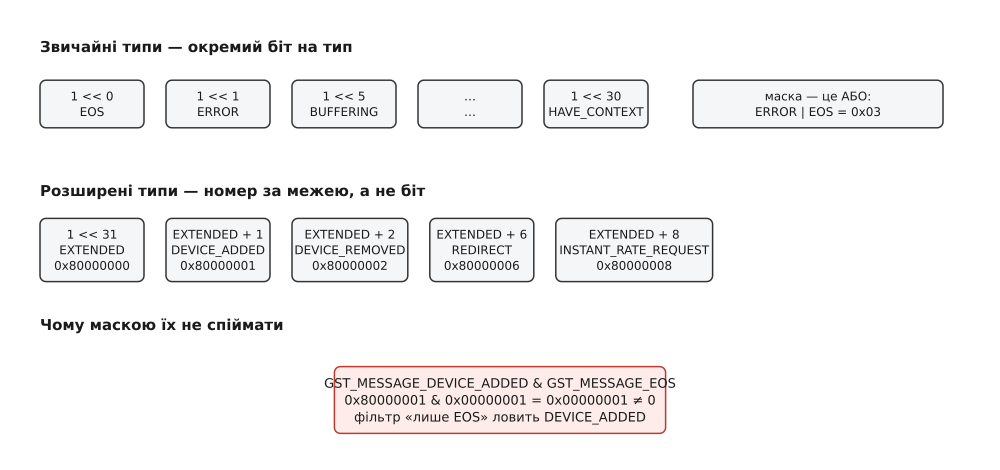
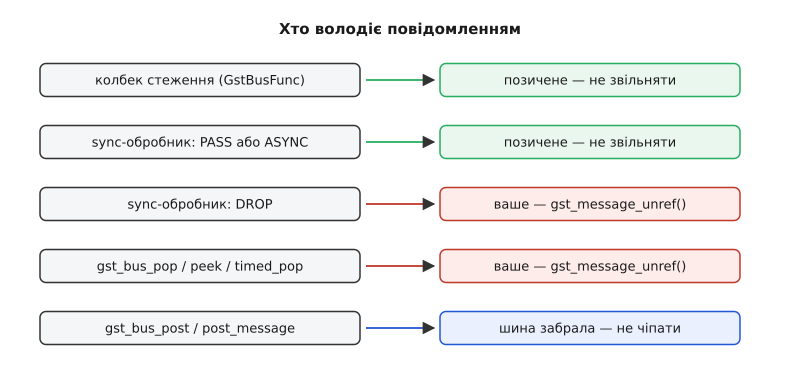

# 📋 Контракт шини й повідомлень GStreamer: типи, поля, сигнатури

Довідка з того, що саме прилітає в шину конвеєра і що з цим можна зробити: усі значення `GstMessageType` із зазначенням, хто їх постить і що лежить у їхньому вантажі, парні до них функції розбору, повний перелік функцій самої шини з правилами володіння, чотири домени `GError` із кодами, а також сигнали й властивості, якими вся ця машинерія налаштовується. Потрібна тоді, коли пишете власний обробник шини й треба точно знати, яке поле звідки брати, що після розбору звільняти й чому фільтр за типом іноді пропускає не те. Сигнатури й числа взято з заголовків `gstmessage.h`, `gstbus.h`, `gsterror.h` та `gstelement.h` гілки 1.28 — стабільної серії, що почалася випуском 1.28.0 27 січня 2026 року; де поле чи тип з'явилися пізніше за 1.0, версію вказано окремо.

## Що є в кожному повідомленні незалежно від типу

`GstMessage` — це `GstMiniObject` з підрахунком посилань. Чотири його поля читаються макросами й розбору не потребують.

| Макрос | Тип | Що дає |
| --- | --- | --- |
| `GST_MESSAGE_TYPE(msg)` | `GstMessageType` | тип повідомлення |
| `GST_MESSAGE_TYPE_NAME(msg)` | `const gchar *` | коротке ім'я типу для журналу: `"eos"`, `"error"`, `"state-changed"` |
| `GST_MESSAGE_SRC(msg)` | `GstObject *` | хто постив; позичене — не звільняти |
| `GST_MESSAGE_TIMESTAMP(msg)` | `GstClockTime` | час постання або `GST_CLOCK_TIME_NONE`, якщо не заповнено |
| `GST_MESSAGE_SEQNUM(msg)` | `guint32` | порядковий номер; `gst_message_set_seqnum()` дає змогу прив'язати повідомлення до події, що його спричинила |

Вантаж — вкладена `GstStructure`, і дістати її можна й без парної функції:

```c
const GstStructure *s = gst_message_get_structure (msg);   /* transfer none */
gboolean forwarded  = gst_message_has_name (msg, "GstBinForwarded");
gchar   *dump       = gst_structure_to_string (s);         /* ваше — g_free() */
```

Для повідомлень без вантажу (`EOS`, `LATENCY`, `DURATION_CHANGED`) `gst_message_get_structure()` повертає `NULL` — це нормальний стан, а не збій. Ім'я структури збігається з іменем типу (`GstMessageError`, `GstMessageQOS`) і саме за ним найзручніше впізнавати повідомлення в журналі.

## Типи повідомлень: хто постить, що у вантажі, чим розбирати

У таблицях нижче стовпчик «вантаж» подає ім'я `GstStructure` і її поля так, як вони справді називаються всередині; стовпчик «розбір» — функцію, яка ці поля дістає. Порожня клітинка вантажу означає, що вантажу немає взагалі.

### Кінець, біда, метадані

| Тип | Хто постить | Вантаж | Розбір |
| --- | --- | --- | --- |
| `EOS` | приймачі; bin зводить їх в одне | — | — |
| `ERROR` | будь-який елемент через `GST_ELEMENT_ERROR` | `GstMessageError`: `gerror`, `debug`, `details` (необов'язкове) | `gst_message_parse_error()`, `gst_message_parse_error_details()` |
| `WARNING` | те саме, через `GST_ELEMENT_WARNING` | `GstMessageWarning`: ті самі три поля | `gst_message_parse_warning()`, `..._warning_details()` |
| `INFO` | те саме, через `GST_ELEMENT_INFO` | `GstMessageInfo`: ті самі три поля | `gst_message_parse_info()`, `..._info_details()` |
| `TAG` | демультиплексори, парсери, декодери | `GstMessageTag`: `taglist` | `gst_message_parse_tag()` |

Різниця між трьома рівнями — не в суворості тону, а в тому, чи триває обробка: `ERROR` означає, що елемент зупинився, `WARNING` — що робота йде далі. Обидва рівні користуються тими самими доменами й кодами: макрос `GST_ELEMENT_WARNING` теж складає `GST_ ## domain ## _ERROR`, просто кладе результат у повідомлення іншого типу.

### Стан, годинник, нитки

| Тип | Хто постить | Вантаж | Розбір |
| --- | --- | --- | --- |
| `STATE_CHANGED` | кожен елемент на кожному переході | `GstMessageStateChanged`: `old-state`, `new-state`, `pending-state` | `gst_message_parse_state_changed()` |
| `STATE_DIRTY` | ніхто; у заголовку позначено застарілим | — | — |
| `ASYNC_START` | елемент, що почав асинхронний перехід; далі bin не пускає | — | — |
| `ASYNC_DONE` | елемент, що завершив перехід; застосунок бачить лише від конвеєра верхнього рівня | `GstMessageAsyncDone`: `running-time` | `gst_message_parse_async_done()` |
| `REQUEST_STATE` | елемент, який просить конвеєр перейти в інший стан | `GstMessageRequestState`: `new-state` | `gst_message_parse_request_state()` |
| `LATENCY` | елемент, чия затримка змінилася (типово `rtpjitterbuffer`) | — | — |
| `CLOCK_PROVIDE` | елемент, що вміє давати годинник; внутрішнє, іде лише до батька | `GstMessageClockProvide`: `clock`, `ready` | `gst_message_parse_clock_provide()` |
| `CLOCK_LOST` | елемент, чий годинник став непридатним | `GstMessageClockLost`: `clock` | `gst_message_parse_clock_lost()` |
| `NEW_CLOCK` | конвеєр, обравши годинник | `GstMessageNewClock`: `clock` | `gst_message_parse_new_clock()` |
| `RESET_TIME` | внутрішнє прохання скинути час перебігу | `GstMessageResetTime`: `running-time` | `gst_message_parse_reset_time()` |
| `STRUCTURE_CHANGE` | ядро при з'єднанні й роз'єднанні падів; внутрішнє | `GstMessageStructureChange`: `type`, `owner`, `busy` | `gst_message_parse_structure_change()` |
| `STREAM_STATUS` | елемент, що створює або спиняє нитку потоку | `GstMessageStreamStatus`: `type`, `owner` | `gst_message_parse_stream_status()` |

Чотири з них — `CLOCK_PROVIDE`, `STRUCTURE_CHANGE`, `ASYNC_START`, `RESET_TIME` — у заголовку прямо названо внутрішніми: конвеєр споживає їх сам, і в застосунок вони не потрапляють. Це не завада налагодженню — увімкнена властивість `message-forward` показує їх усі, — але код, який чекає на них у звичайному стеженні, чекатиме вічно.

`STREAM_STATUS` — єдина офіційна дорога до нитки, яку елемент щойно створив: разом із типом і власником у повідомленні лежить сам об'єкт `GstTask`, і дістати його треба окремою функцією `gst_message_get_stream_status_object()`, бо в структурі він зберігається як `GValue`. Саме так задають нитці потоку підвищений пріоритет чи прив'язку до ядра.

Що означає кожен зі станів у `STATE_CHANGED` і чому `ASYNC_DONE` приходить не одразу — у статті про [стани конвеєра](book:media-vision/states-lifecycle): переходи йдуть щаблями `NULL` → `READY` → `PAUSED` → `PLAYING`, і частина з них завершується не в момент виклику, а згодом. Що таке час перебігу в полях `running-time` й звідки береться годинник, чий `CLOCK_LOST` ви ловите, — у статті про [годинник і синхронізацію](book:media-vision/clock-and-sync): конвеєр обирає один годинник на всіх, і мітки часу кадрів міряються від його показів.

### Потік, сегмент, крок

| Тип | Хто постить | Вантаж | Розбір |
| --- | --- | --- | --- |
| `STREAM_START` | джерело або парсер на початку нового потоку | `GstMessageStreamStart`: `group-id` (необов'язкове) | `gst_message_parse_group_id()` — повертає `gboolean` |
| `SEGMENT_START` | елемент у сегментному відтворенні; внутрішнє | `GstMessageSegmentStart`: `format`, `position` | `gst_message_parse_segment_start()` |
| `SEGMENT_DONE` | конвеєр, коли догралися всі, хто постив `SEGMENT_START` | `GstMessageSegmentDone`: `format`, `position` | `gst_message_parse_segment_done()` |
| `DURATION_CHANGED` | елемент, коли тривалість стала відомою чи змінилася | — | — |
| `STEP_START` | приймач, отримавши подію кроку | `GstMessageStepStart`: `active`, `format`, `amount`, `rate`, `flush`, `intermediate` | `gst_message_parse_step_start()` |
| `STEP_DONE` | приймач, коли крок відпрацював | `GstMessageStepDone`: `format`, `amount`, `rate`, `flush`, `intermediate`, `duration`, `eos` | `gst_message_parse_step_done()` |
| `INSTANT_RATE_REQUEST` (1.18) | елемент, що просить у конвеєра час для миттєвої зміни темпу | `GstMessageInstantRateRequest`: `rate-multiplier` | `gst_message_parse_instant_rate_request()` |
| `TOC` | елемент, що знайшов зміст (`matroskademux` і подібні) | `GstMessageToc`: `toc`, `updated` | `gst_message_parse_toc()` |

`DURATION_CHANGED` — приклад повідомлення, яке навмисно не несе нової тривалості. Воно лише каже «те, що ви кешували, застаріло»; саме число треба брати запитом `gst_element_query_duration()`. Причина проста: тривалість часто знає не той елемент, що помітив зміну, а весь конвеєр разом, і покласти в повідомлення можна було б лише неповну відповідь.

### Запас, темп, поступ

| Тип | Хто постить | Вантаж | Розбір |
| --- | --- | --- | --- |
| `BUFFERING` | елементи із запасом: `queue2`, `multiqueue`, мережеві джерела | `GstMessageBuffering`: `buffer-percent`, `buffering-mode`, `avg-in-rate`, `avg-out-rate`, `buffering-left` | `gst_message_parse_buffering()` — лише відсоток; `gst_message_parse_buffering_stats()` — решта |
| `QOS` | приймачі й перетворювачі, що кинули кадр або змінили стратегію | `GstMessageQOS`: `live`, `running-time`, `stream-time`, `timestamp`, `duration`, `jitter`, `proportion`, `quality`, `format`, `processed`, `dropped` | `gst_message_parse_qos()`, `..._qos_values()`, `..._qos_stats()` |
| `PROGRESS` | елементи з довгою асинхронною роботою (`rtspsrc`, `souphttpsrc`) | `GstMessageProgress`: `type`, `code`, `text`, `percent`, `timeout` | `gst_message_parse_progress()` |

Вантаж `QOS` розбирається трьома функціями, і це не примха: перша дає час, коли сталося запізнення, друга — наскільки саме запізнилися (`jitter` у наносекундах, від'ємне значення означає «встигли завчасу»), третя — накопичені лічильники оброблених і викинутих кадрів. Для діагностики «чому смикається картинка» цінна саме третя: одна пара чисел за весь час роботи каже більше, ніж сотня окремих повідомлень.

Поле `buffering-mode` у `BUFFERING` — це той самий прапорець, за яким відрізняють живий конвеєр від файлового: значення `GST_BUFFERING_LIVE` означає, що ставити конвеєр на паузу не можна, бо джерело однаково не спиниться, а пауза лише накопичить відставання. Звідки взагалі береться розмір запасу й чому він мусить бути саме таким — у статті про [затримку й буферизацію](book:media-vision/latency-and-buffering): запас купує стійкість до нерівномірності ціною сталої затримки.

### Довільний зміст і розширені типи

| Тип | Хто постить | Вантаж | Розбір |
| --- | --- | --- | --- |
| `ELEMENT` | будь-який елемент; зміст свій у кожного | довільна `GstStructure` | `gst_message_get_structure()` + `gst_message_has_name()` |
| `APPLICATION` | сам застосунок | довільна `GstStructure` | те саме |
| `NEED_CONTEXT` (1.2) | елемент, якому бракує спільного ресурсу (GL-дисплея, ключів розшифрування) | `GstMessageNeedContext`: `context-type` | `gst_message_parse_context_type()` |
| `HAVE_CONTEXT` (1.2) | елемент, що такий ресурс створив | `GstMessageHaveContext`: `context` | `gst_message_parse_have_context()` |
| `DEVICE_ADDED` (1.4) | `GstDeviceProvider` через `GstDeviceMonitor` | `device` | `gst_message_parse_device_added()` |
| `DEVICE_REMOVED` (1.4) | те саме | `device` | `gst_message_parse_device_removed()` |
| `PROPERTY_NOTIFY` (1.10) | ядро, після `gst_element_add_property_notify_watch()` | `GstMessagePropertyNotify`: `property-name`, `property-value` | `gst_message_parse_property_notify()` |
| `STREAM_COLLECTION` (1.10) | `decodebin3`, `parsebin`, `urisourcebin` | `collection` | `gst_message_parse_stream_collection()` |
| `STREAMS_SELECTED` (1.10) | ті самі, коли вибір доріжок змінився | `collection` | `gst_message_parse_streams_selected()` |
| `REDIRECT` (1.10) | джерела, що дістали перенаправлення на іншу адресу | `GstMessageRedirect`: `entry-locations`, `entry-taglists`, `entry-structs` — три паралельні масиви | `gst_message_get_num_redirect_entries()` + `gst_message_parse_redirect_entry()` |
| `DEVICE_CHANGED` (1.16) | `GstDeviceProvider`, коли властивості пристрою змінилися | `device`, `changed-device` | `gst_message_parse_device_changed()` |
| `INSTANT_RATE_REQUEST` (1.18) | див. таблицю кроку | | |
| `DEVICE_MONITOR_STARTED` (1.28) | `GstDeviceMonitor`, коли асинхронний запуск завершився | `success` | `gst_message_parse_device_monitor_started()` |

`ELEMENT` — не «якийсь дрібний тип», а половина всього цікавого, що взагалі приходить у шину: рівні гучності від `level`, виявлення тиші від `cutter`, прохання відеоприймача дати вікно (структура на ім'я `prepare-window-handle`), обгортка `GstBinForwarded`, повідомлення про відсутній плагін. Спільної схеми в них немає — ім'я структури й склад полів визначає плагін, тож єдиний надійний спосіб розбору — перевірити ім'я, а вже потім лізти по поля. Де шукати опис конкретного імені — у документації самого елемента; як елементи взагалі знаходяться в системі, описано у статті про [модель плагінів](book:media-vision/plugin-model): реєстр зіставляє ім'я елемента з бібліотекою, що його дає.

`REDIRECT` заслуговує окремої уваги через форму вантажу: це не одна адреса, а список записів, кожен зі своєю адресою, набором міток і власною структурою (типово з бітовою швидкістю). Читати їх треба циклом від нуля до `gst_message_get_num_redirect_entries()`, і всі три виходи `gst_message_parse_redirect_entry()` позичені — вони живі рівно доти, доки живе саме повідомлення.

## Біти типу й межа 1 << 31

`GstMessageType` — не просто перелік, а набір окремих бітів, і саме тому типи можна об'єднувати маскою: `GST_MESSAGE_ERROR | GST_MESSAGE_EOS` — цілком робочий фільтр. Бітів у 32-розрядному числі лишилося рівно 31, і в 1.4 вони скінчилися. Вихід знайшли такий: `GST_MESSAGE_EXTENDED = 1 << 31` став межею, а всі типи після неї — це вже не окремі біти, а порядкові номери, додані до цієї межі.



*Перші тридцять один тип — по біту на кожен; усе після межі — номер, доданий до 0x80000000, і побітове «і» з таким числом дає хибне влучання.*

Наслідок жорсткий і в заголовку записаний прямо: розширені типи не можна вживати в тих функціях, що фільтрують маскою. Порівняння всередині шини робиться виразом `(GST_MESSAGE_TYPE (message) & types) != 0`, а `GST_MESSAGE_DEVICE_ADDED` — це `0x80000001`, тобто одиничний біт `EOS` плюс біт межі. Фільтр «лише пристрої» ловитиме `EOS`, а фільтр «лише `EOS`» ловитиме пристрої.

```
GST_MESSAGE_EOS           = 0x00000001
GST_MESSAGE_EXTENDED      = 0x80000000
GST_MESSAGE_DEVICE_ADDED  = 0x80000000 + 1 = 0x80000001

0x80000001 & 0x00000001 = 0x00000001 ≠ 0   → фільтр «лише EOS» спрацював хибно
```

Практичне правило одне: розширені типи ловляться лише порівнянням `GST_MESSAGE_TYPE (msg) == GST_MESSAGE_DEVICE_ADDED` всередині звичайного стеження. Маска `GST_MESSAGE_ANY` (`0xffffffff`) при цьому працює справно — вона накриває і біт межі, і номер, — тож «забрати геть усе» через `gst_bus_timed_pop_filtered()` можна без застережень.

> 🔧 **Навіщо це.** Ця пастка мовчазна: код збирається, працює й лише зрідка робить не те. Найчастіше вона проявляється у службових утилітах — щось на кшталт «зачекати на появу камери», написане через `gst_bus_timed_pop_filtered (bus, timeout, GST_MESSAGE_DEVICE_ADDED)`. Функція повертає перше-ліпше повідомлення з одиничним нульовим бітом, розбір `gst_message_parse_device_added()` дістає з чужої структури `NULL`, і застосунок падає на розіменуванні. Перевірка типу через `==` після виймання рятує від усього цього одним рядком.

## Що звільняти після розбору

Функції `gst_message_parse_*` поділені на дві породи, і плутанина між ними дає або витік, або звертання до звільненої пам'яті. Одні віддають нове посилання (`transfer full`) — його треба відпустити; інші віддають вказівник усередину вантажу (`transfer none`) — він живе рівно стільки, скільки живе саме повідомлення, і чіпати його не можна ні звільненням, ні збереженням «на потім». Механіку самого рахунку описано у статті про [підрахунок посилань](book:programming/reference-counting): об'єкт живе, доки на нього є посилання, і звільняє його той, хто відпустив останнє.

| Що дістали | Володіння | Що робити |
| --- | --- | --- |
| `GError` з `parse_error/warning/info` | ваше | `g_clear_error()` або `g_error_free()` |
| зневаджувальний рядок звідти ж | ваше | `g_free()` |
| `GstStructure` з `parse_error_details` | позичене | нічого |
| `GstTagList` з `parse_tag` | ваше | `gst_tag_list_unref()` |
| `GstContext` з `parse_have_context` | ваше | `gst_context_unref()` |
| `GstDevice` з `parse_device_added/removed/changed` | ваше | `gst_object_unref()` |
| `GstToc` з `parse_toc` | ваше | `gst_toc_unref()` |
| `GstStreamCollection` з `parse_stream_collection` | ваше | `gst_object_unref()` |
| рядки `code` й `text` з `parse_progress` | ваше | `g_free()` |
| `GstClock` з `parse_new_clock/clock_lost/clock_provide` | позичене | нічого |
| `GstElement *owner` з `parse_stream_status` | позичене | нічого |
| `context-type` з `parse_context_type` | позичене | нічого |
| ім'я та значення з `parse_property_notify` | позичене | нічого |
| усе з `parse_redirect_entry` | позичене | нічого |

Просте правило, що покриває майже всі рядки: якщо функція витягає з вантажу цілий об'єкт (список міток, контекст, пристрій, зміст), вона його при цьому дублює — і він ваш. Якщо вона показує на щось усередині (годинник, власника, рядок типу), вона нічого не дублює — і воно чуже.

## Функції шини

Спершу шину треба дістати. Обидві функції віддають нове посилання, тож `gst_object_unref()` на нього обов'язковий — навіть якщо шина вам далі не потрібна.

| Сигнатура | Повертає / володіння |
| --- | --- |
| `GstBus *gst_element_get_bus (GstElement *element)` | нове посилання; `NULL` для елемента поза конвеєром |
| `GstBus *gst_pipeline_get_bus (GstPipeline *pipeline)` | те саме, з точним типом |
| `GstBus *gst_bus_new (void)` | нова окрема шина; потрібна хіба що для власних контейнерів |

Постити може і елемент, і застосунок. В обох випадках повідомлення переходить у власність шини — навіть коли функція повернула `FALSE`, бо шина скидає чергу.

| Сигнатура | Повертає / володіння |
| --- | --- |
| `gboolean gst_element_post_message (GstElement *element, GstMessage *message)` | `FALSE`, якщо шини немає або вона скидає; повідомлення однаково забрано |
| `gboolean gst_bus_post (GstBus *bus, GstMessage *message)` | те саме, безпосередньо в шину |
| `gboolean gst_bus_have_pending (GstBus *bus)` | чи є щось у черзі; відповідь застаріває тієї ж миті |

Виймання руками. Усі чотири функції віддають нове посилання, тож `gst_message_unref()` на результат обов'язковий.

| Сигнатура | Повертає / володіння |
| --- | --- |
| `GstMessage *gst_bus_peek (GstBus *bus)` | перше повідомлення, **не знімаючи** його з черги; посилання все одно ваше |
| `GstMessage *gst_bus_pop (GstBus *bus)` | знімає перше або `NULL`, якщо порожньо; не блокує |
| `GstMessage *gst_bus_pop_filtered (GstBus *bus, GstMessageType types)` | знімає перше, що збіглося з маскою; не блокує |
| `GstMessage *gst_bus_timed_pop (GstBus *bus, GstClockTime timeout)` | чекає до появи або до кінця часу; `GST_CLOCK_TIME_NONE` — чекати без обмеження |
| `GstMessage *gst_bus_timed_pop_filtered (GstBus *bus, GstClockTime timeout, GstMessageType types)` | те саме з маскою |
| `GstMessage *gst_bus_poll (GstBus *bus, GstMessageType events, GstClockTime timeout)` | те саме, але **всередині крутить головний цикл** |

Дві останні варті окремих слів. Обидві фільтрувальні функції **викидають дорогою** все, що не збіглося з маскою й лежало в черзі перед потрібним, — фільтр тут не «пропустити повз», а «з'їсти й забути». Для утиліти, якій треба лише `ERROR` та `EOS`, це те, що треба; для застосунку, якому цікаві ще й `BUFFERING` зі `STATE_CHANGED`, — тихий спосіб їх ніколи не побачити.

А `gst_bus_poll()` документація прямо називає «pure evil» і радить не вживати ніколи: вона проганяє головний цикл усередині себе, тож із неї можуть вилетіти будь-які чужі колбеки — таймери, події інтерфейсу, введення-виведення, — і застосунок отримує повторний вхід у власний код там, де його ніхто не чекав. Що таке головний цикл і чому повторний вхід у нього небезпечний — у статті про [цикл подій](book:programming/event-loop): одна нитка по колу забирає готові події й викликає обробники, і вкладений цикл усередині обробника означає, що обробники почнуть вкладатися один в одного.

Стеження — основний спосіб для застосунку з головним циклом.

| Сигнатура | Повертає / володіння |
| --- | --- |
| `guint gst_bus_add_watch (GstBus *bus, GstBusFunc func, gpointer user_data)` | обгортка над `add_watch_full` з `G_PRIORITY_DEFAULT`; ідентифікатор джерела або **0**, якщо стеження вже є |
| `guint gst_bus_add_watch_full (GstBus *bus, gint priority, GstBusFunc func, gpointer user_data, GDestroyNotify notify)` | те саме з пріоритетом і функцією прибирання |
| `GSource *gst_bus_create_watch (GstBus *bus)` | нове джерело **без колбека**; ставити його самому |
| `gboolean gst_bus_remove_watch (GstBus *bus)` | `FALSE`, якщо стеження не було; з 1.6 |

Обидві функції `add_watch*` чіпляють джерело до **типового контексту поточної нитки** — того, який дає `g_main_context_get_thread_default()`. Це важливіше, ніж здається: якщо ви ставите стеження з нитки, де свій контекст покладено на верхівку через `g_main_context_push_thread_default()`, повідомлення підуть у той контекст, а не в глобальний. Коли потрібен конкретний, третій, контекст — беріть `gst_bus_create_watch()` і чіпляйте самі.

Стеження на шині може бути тільки одне. Друге `add_watch` поверне 0 і нічого не зробить; спершу треба зняти попереднє. Тип колбека:

```c
typedef gboolean (*GstBusFunc) (GstBus *bus, GstMessage *message, gpointer user_data);
```

Поверненим `TRUE` колбек лишається підключеним, `FALSE` — від'єднується назавжди. Повідомлення в ньому **позичене**: шина звільнить його сама.

Сигнали й синхронний обробник:

| Сигнатура | Повертає / володіння |
| --- | --- |
| `void gst_bus_add_signal_watch (GstBus *bus)` | вмикає сигнал `"message"`; **лічений** — скільки разів увімкнули, стільки й вимикати |
| `void gst_bus_add_signal_watch_full (GstBus *bus, gint priority)` | те саме з пріоритетом |
| `void gst_bus_remove_signal_watch (GstBus *bus)` | одне вимкнення на одне вмикання |
| `void gst_bus_enable_sync_message_emission (GstBus *bus)` | вмикає сигнал `"sync-message"`; теж лічений |
| `void gst_bus_disable_sync_message_emission (GstBus *bus)` | парне вимкнення |
| `void gst_bus_set_sync_handler (GstBus *bus, GstBusSyncHandler func, gpointer user_data, GDestroyNotify notify)` | один обробник на шину; `NULL` знімає |
| `void gst_bus_set_flushing (GstBus *bus, gboolean flushing)` | `TRUE` викидає все, що в черзі, і відкидає нове; `FALSE` вертає до звичайного |
| `void gst_bus_get_pollfd (GstBus *bus, GPollFD *fd)` | дескриптор для чужого циклу подій |
| `gboolean gst_bus_async_signal_func (GstBus *bus, GstMessage *message, gpointer data)` | готовий `GstBusFunc`, що перетворює повідомлення на сигнал |
| `GstBusSyncReply gst_bus_sync_signal_handler (GstBus *bus, GstMessage *message, gpointer data)` | готовий синхронний обробник, що робить те саме й завжди відповідає `GST_BUS_PASS` |

Дві останні функції — не екзотика, а те, що всередині ставлять `gst_bus_add_signal_watch()` і `gst_bus_enable_sync_message_emission()`. Знати про них варто тому, що вони показують межу: сигнальне стеження займає ту саму єдину точку, що й звичайне, тож `gst_bus_add_watch()` і `gst_bus_add_signal_watch()` на одній шині не живуть разом.

Лічений характер обох сигнальних вмикачів — джерело витоків у застосунках із кількома підсистемами: якщо дві частини програми незалежно покликали `gst_bus_add_signal_watch()`, а прибрала за собою одна, стеження лишиться жити, і повідомлення далі йтимуть у мертві обробники.

## GstBusSyncReply: три відповіді й три обов'язки

Синхронний обробник шина кличе негайно, у тій самій нитці, що постила, ще до будь-якої черги. Його відповідь визначає і долю повідомлення, і те, хто його звільнить.

| Значення | Число | Що робить шина | Чий тепер об'єкт |
| --- | --- | --- | --- |
| `GST_BUS_DROP` | 0 | далі не передає взагалі | **ваш**: `gst_message_unref()` обов'язковий |
| `GST_BUS_PASS` | 1 | кладе в чергу як завжди | шини — не чіпати |
| `GST_BUS_ASYNC` | 2 | кладе в чергу й **притримує нитку-постача**, доки застосунок не обробить | шини — не чіпати |

```c
typedef GstBusSyncReply (*GstBusSyncHandler) (GstBus *bus, GstMessage *message, gpointer user_data);
```

`GST_BUS_ASYNC` — це навмисне гальмо: постач блокується на умовній змінній і чекає. Нитка потоку стоїть, буфери не рухаються, і якщо ваш головний цикл цієї миті чимось зайнятий — конвеєр стоїть рівно стільки ж.



*Позичене приходить лише у стеженні та в синхронному обробнику, який пропустив повідомлення далі; усе інше треба відпускати руками.*

## Домени й коди помилок

Домен каже, **чия** це біда; код усередині домену уточнює, яка саме. Обидва числа лежать у `GError` і дістаються з нього як `err->domain` (це `GQuark`, читається `g_quark_to_string()`) та `err->code`. Нумерація в кожному домені починається з одиниці; останній член `..._NUM_ERRORS` — не код, а лічильник для перевірок.

**`GST_CORE_ERROR` — зламано щось у самому ядрі або в тому, як зібрано конвеєр.**

| Код | Коли |
| --- | --- |
| `FAILED` | загальний збій, коли точнішого немає |
| `TOO_LAZY` | заповнювач на час написання коду; у готовому елементі його бути не повинно |
| `NOT_IMPLEMENTED` | елемент не вміє того, що в нього просять |
| `STATE_CHANGE` | перехід стану не вдався |
| `PAD` | біда з падом |
| `THREAD` | не вдалося створити чи запустити нитку |
| `NEGOTIATION` | сторони не домовилися про формат |
| `EVENT` | біда з подією |
| `SEEK` | перемотування не вдалося |
| `CAPS` | біда з описом формату |
| `TAG` | біда з мітками |
| `MISSING_PLUGIN` | потрібного плагіна в системі немає |
| `CLOCK` | біда з годинником |
| `DISABLED` | можливість вимкнено ще при збиранні GStreamer |

`NEGOTIATION` — найчастіший із цієї чотирнадцятки й найменш зрозумілий із повідомлення: текст скаже «not negotiated», а справжня причина — у тому, що вихід одного елемента й вхід іншого не мають спільного формату. Як саме сусіди домовляються й де це видно — у статті про [узгодження caps](book:media-vision/caps-negotiation): кожен пад оголошує множину форматів, які приймає, і зв'язок стається лише на їхньому перетині.

**`GST_LIBRARY_ERROR` — не вдалося з бібліотекою, на якій стоїть елемент.**

| Код | Коли |
| --- | --- |
| `FAILED` | загальний збій бібліотеки |
| `TOO_LAZY` | заповнювач |
| `INIT` | бібліотека не запустилася |
| `SHUTDOWN` | бібліотека не зупинилася чисто |
| `SETTINGS` | бібліотека не прийняла налаштувань |
| `ENCODE` | кодування всередині бібліотеки не вдалося |

**`GST_RESOURCE_ERROR` — не вдалося з зовнішнім ресурсом: файлом, сокетом, пристроєм.**

| Код | Коли |
| --- | --- |
| `FAILED` | загальний збій ресурсу |
| `TOO_LAZY` | заповнювач |
| `NOT_FOUND` | ресурсу немає |
| `BUSY` | ресурс зайнято кимось іншим |
| `OPEN_READ` | не відкрився на читання |
| `OPEN_WRITE` | не відкрився на запис |
| `OPEN_READ_WRITE` | не відкрився на читання й запис |
| `CLOSE` | не закрився |
| `READ` | не читається |
| `WRITE` | не пишеться |
| `SEEK` | не позиціонується |
| `SYNC` | не синхронізується на носій |
| `SETTINGS` | не прийняв налаштувань |
| `NO_SPACE_LEFT` | скінчилося місце |
| `NOT_AUTHORIZED` | бракує прав доступу (з 1.2.4) |

**`GST_STREAM_ERROR` — не вдалося з самими даними.**

| Код | Коли |
| --- | --- |
| `FAILED` | загальний збій обробки потоку |
| `TOO_LAZY` | заповнювач |
| `NOT_IMPLEMENTED` | потрібної обробки нема в коді |
| `TYPE_NOT_FOUND` | тип даних не розпізнано |
| `WRONG_TYPE` | тип не той, якого чекали |
| `CODEC_NOT_FOUND` | кодека для цього потоку немає |
| `DECODE` | декодування зламалося |
| `ENCODE` | кодування зламалося |
| `DEMUX` | демультиплексування зламалося |
| `MUX` | мультиплексування зламалося |
| `FORMAT` | дані не відповідають оголошеному форматові |
| `DECRYPT` | розшифрувати не вдалося |
| `DECRYPT_NOKEY` | ключа для розшифрування немає |

Різниця між `RESOURCE` і `STREAM` практична, а не термінологічна: перший домен означає «до даних не дісталися», другий — «дісталися, але не впоралися». Обірваний мережевий сокет — це `RESOURCE_READ`; та сама обірваність, що вилізла зіпсованим кадром у декодері, — `STREAM_DECODE`.

### Як елемент це постить

Помилки не конструюють руками — для них є три макроси, і всі троє однакової форми:

```c
GST_ELEMENT_ERROR (element, RESOURCE, NOT_FOUND,
                   ("Файл «%s» не знайдено", path),          /* користувачеві, перекладене */
                   ("open() failed: %s", g_strerror (errno))); /* у журнал, не перекладене */
```

Домен і код пишуться **без префіксів**: макрос сам склеює `GST_ ## domain ## _ERROR` для домену і `GST_ ## domain ## _ERROR_ ## code` для коду. Обидва останні аргументи — це списки в дужках у стилі `printf`, а не рядки; `(NULL)` замість першого означає «взяти типовий перекладений текст для цього коду». До зневаджувального рядка макрос сам додає `__FILE__`, `GST_FUNCTION` і `__LINE__` — саме тому в ньому завжди видно, який з трьох однакових `queue` здався. Заразом макрос пише те саме в журнал GStreamer на рівні `WARNING`, тож у вивід із `GST_DEBUG` помилка потрапляє навіть тоді, коли шину ніхто не слухає.

`GST_ELEMENT_WARNING` і `GST_ELEMENT_INFO` мають рівно ту саму форму й ті самі домени — різниця лише в типі створеного повідомлення. А коли до біди треба додати машинно-читані подробиці, є `GST_ELEMENT_ERROR_WITH_DETAILS()` із шостим аргументом-структурою; на боці застосунку її дістає `gst_message_parse_error_details()`. Обидва макроси зводяться до однієї функції:

```c
void gst_element_message_full (GstElement *element, GstMessageType type,
                               GQuark domain, gint code, gchar *text, gchar *debug,
                               const gchar *file, const gchar *function, gint line);
```

## Сигнали й властивості

| Ім'я | Де | Підпис / тип | Умова |
| --- | --- | --- | --- |
| `"message"` | `GstBus` | `void (GstBus *bus, GstMessage *message, gpointer user_data)` | лише після `gst_bus_add_signal_watch()`; кличеться з головного циклу |
| `"sync-message"` | `GstBus` | той самий підпис | лише після `gst_bus_enable_sync_message_emission()`; кличеться в нитці, що постила |
| `message-forward` | `GstBin` | `gboolean`, типово `FALSE` | пропускає нагору все, зокрема й те, що bin зазвичай ковтає |
| `auto-flush-bus` | `GstPipeline` | `gboolean`, типово `TRUE` | скидає чергу на переході `READY` → `NULL` |

Обидва сигнали приймають уточнення за типом: `"message::eos"`, `"message::error"`, `"sync-message::element"` — після двокрапок іде коротке ім'я типу, те саме, що дає `GST_MESSAGE_TYPE_NAME()`. Підписка з уточненням кличе обробник лише на свій тип, і це єдина справжня перевага сигналів над стеженням: різні частини програми підписуються незалежно, не домовляючись про спільний `switch`. Сама ця схема — окремий випадок [спостерігача](book:programming/observer): джерело не знає своїх слухачів і лише оголошує подію.

`message-forward` виводить назовні не голе дитяче повідомлення, а обгортку: назовні йде `GST_MESSAGE_ELEMENT` зі структурою на ім'я `GstBinForwarded`, у полі `message` якої лежить оригінал. Розгортати треба руками:

```c
if (gst_message_has_name (msg, "GstBinForwarded")) {
  GstMessage *orig = NULL;
  gst_structure_get (gst_message_get_structure (msg),
                     "message", GST_TYPE_MESSAGE, &orig, NULL);
  /* orig — ваше посилання: gst_message_unref() обов'язковий */
}
```

`auto-flush-bus`, увімкнена (а вона увімкнена типово), означає, що після `gst_element_set_state (pipeline, GST_STATE_NULL)` шина мертва: усе, що було в черзі, викинуто, усе нове відхиляється. Зроблено це, щоб розірвати кільцеві посилання між чергою та об'єктами-джерелами повідомлень. Вимкнена — черга лишається живою, і тоді скидати її стає вашим обов'язком, інакше повідомлення від попереднього запуску прилетять уже під час наступного.

## Мінімальний повний виклик

Найкоротший робочий скелет, що показує все три речі одразу: власний контекст замість типового, розбір із правильним звільненням і чисте зняття стеження.

```c
static gboolean
bus_cb (GstBus *bus, GstMessage *msg, gpointer user_data)
{
  GstElement *pipeline = user_data;

  switch (GST_MESSAGE_TYPE (msg)) {
    case GST_MESSAGE_ERROR: {
      GError *err = NULL;
      gchar  *dbg = NULL;
      gst_message_parse_error (msg, &err, &dbg);
      g_printerr ("%s | %s:%d | %s | %s\n",
                  GST_OBJECT_NAME (GST_MESSAGE_SRC (msg)),
                  g_quark_to_string (err->domain), err->code,
                  err->message, dbg ? dbg : "(без подробиць)");
      g_clear_error (&err);            /* GError — наш */
      g_free (dbg);                    /* рядок — теж наш */
      break;
    }
    case GST_MESSAGE_BUFFERING: {
      gint percent = 0;
      GstBufferingMode mode;
      gst_message_parse_buffering (msg, &percent);
      gst_message_parse_buffering_stats (msg, &mode, NULL, NULL, NULL);
      if (mode != GST_BUFFERING_LIVE)  /* живий конвеєр на паузу не ставимо */
        gst_element_set_state (pipeline,
            percent < 100 ? GST_STATE_PAUSED : GST_STATE_PLAYING);
      break;
    }
    case GST_MESSAGE_DEVICE_ADDED:     /* розширений тип: тільки через ==, не маскою */
      break;
    default:
      break;
  }
  return TRUE;                         /* FALSE зняло б стеження назавжди */
}

/* ── підключення ─────────────────────────────────────────────────────── */
GstBus  *bus = gst_element_get_bus (pipeline);   /* нове посилання */
GSource *src = gst_bus_create_watch (bus);       /* нове джерело, ще без колбека */

g_source_set_callback (src, G_SOURCE_FUNC (bus_cb), pipeline, NULL);
g_source_attach (src, my_context);               /* саме той контекст, який крутимо ми */

/* ── прибирання ──────────────────────────────────────────────────────── */
g_source_destroy (src);
g_source_unref (src);
gst_object_unref (bus);
```

Тут `gst_bus_create_watch()` узято замість коротшого `gst_bus_add_watch()` рівно з однієї причини: перша дає змогу назвати контекст, до якого джерело чіпляється, а друга завжди бере типовий для нитки. У застосунку з єдиним головним циклом різниці немає; у застосунку, де GStreamer живе всередині чужого фреймворку з власним циклом подій, саме тут проходить межа між «повідомлення приходять» і «черга росте, а обробник мовчить».
