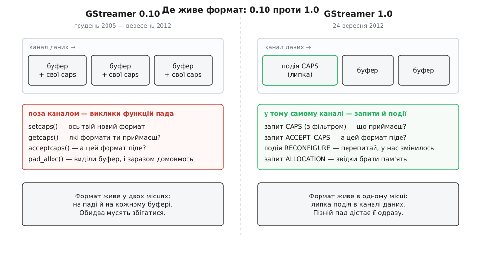

# 📜 Як переговори переїхали з викликів у канал даних

Механізм узгодження формату, який працює в GStreamer сьогодні, — не первісний. Це друга спроба, зроблена в 1.0 замість тієї, що прожила сім років у гілці 0.10 і зламалася об апаратне декодування, динамічні конвеєри й простий підрахунок вартості на кадр. Знати, що саме там зламалося, корисно не з поваги до історії: майже кожна дивна деталь нинішнього механізму — липкість події CAPS, фільтр у запиті, окрема подія RECONFIGURE — має форму, продиктовану конкретною раною 0.10.

## Список претензій, який писали сім років

GStreamer почав Ерік Вальтінсен (Erik Walthinsen) 1999 року. Гілка 0.10, що вийшла в грудні 2005-го, стала першою по-справжньому довгою стабільною серією; її архітектуру спроєктував Вім Тейманс (Wim Taymans) — бельгійський розробник, тоді у Fluendo, згодом у Collabora й Red Hat, і той самий, хто пізніше вів редизайн 1.0. Стабільність тут означала обіцянку не ламати API й ABI — а отже, кожна помилка проєктування лишалася на місці й обростала обхідними шляхами.

Претензії накопичувалися відкрито, у файлі `docs/design/TODO` всередині самого репозиторію. Це рідкісний випадок, коли мотиви перебудови не доводиться реконструювати: у документі спершу записано скаргу, а потім, після виходу 1.0, до неї дописали позначку «FIXED in 1.0 with…». Три записи з того списку стосуються переговорів прямо.

Про вартість запитів:

> «Optimize negotiation. We currently do a `get_caps()` call when we link pads, which could potentially generate a huge list of caps and all their combinations» — *виправлено в 1.0 фільтром у getcaps-функціях*.

Про пади, що з'являються посеред роботи:

> «rethink how we handle dynamic replugging wrt segments and other events that already got pushed and need to be pushed again» — *виправлено в 1.0 липкими подіями*.

Про переговори проти течії:

> «rethink the way we do upstream renegotiation. Currently it's done with `pad_alloc` but this has many issues such as only being able to suggest 1 format and the need to allocate a buffer of this suggested format» — *виправлено в 1.0 подіями RECONFIGURE*.

Розробка нової гілки почалася 2011 року під номером 0.11 — нестабільною серією, де ABI дозволено ламати. Підсумок вийшов 24 вересня 2012-го як GStreamer 1.0, і серед перебудованого був увесь механізм узгодження формату.

## Як це працювало до 1.0: формат у двох місцях

У 0.10 пад мав набір зворотних викликів, які плагін реєстрував при створенні. `gst_pad_set_getcaps_function()` ставила функцію «які формати я приймаю», `gst_pad_set_setcaps_function()` — «ось твій формат, налаштуйся», `gst_pad_set_acceptcaps_function()` — «чи піде саме цей». Була ще окрема функція фіксації, `GstPadFixateCapsFunction`, яка зводила множину до однієї точки.

Паралельно кожен буфер ніс власні caps: макрос `GST_BUFFER_CAPS()` повертав опис формату того конкретного шматка даних, і функції на кшталт `gst_buffer_get_caps()` були звичною частиною коду елементів.

Ось звідки росте головна вада: **формат жив у двох місцях одночасно**. Пад знав свій формат із виклику `setcaps`, буфер ніс свій усередині, і ці два джерела правди мусили збігатися. Кожен елемент, що створював буфер, мусив не забути прикріпити caps; кожен, що буфер приймав, мав вирішувати, кому вірити.



*Те саме питання «який зараз формат» у 0.10 має дві відповіді, які мусять збігатися, а в 1.0 — одну, і вона лежить там само, де дані.*

Кожен із двох каналів мав свою окрему хворобу, і в цьому вся сіль: жоден із них не можна було просто прибрати, доки не з'явилося щось, що вміє обидві їхні роботи.

Виклик `setcaps` дешевий — його роблять раз на зв'язку, а не раз на буфер. Але він іде повз канал даних, а тому не має точного місця в потоці. Питання «цей буфер — уже за новим форматом чи ще за старим?» на виклик не має відповіді: виклик і буфер рухаються різними шляхами й не впорядковані один щодо одного. Саме звідси більшість дивних поразок 0.10 при зміні формату посеред потоку — приймач іноді бачив зміну не там, де вона насправді сталася.

Caps на буфері, навпаки, дають межу ідеально точну: формат прикріплений до самих байтів, помилитися неможливо. Але за цю точність платять на кожному кадрі. `GstCaps` — об'єкт із лічильником посилань, тож кожен буфер тягне за собою роботу з цим лічильником; кожен елемент, що буфер пропускає далі, зобов'язаний caps перенести; а щоб зрозуміти, чи змінився формат, приймач мусить порівнювати caps буфера з тим, що вже налаштовано. Той самий `TODO` фіксує й це: серед бажаного стояло «мінімізувати кількість викликів acceptcaps при проштовхуванні буферів», і після 1.0 до запису дописано просте пояснення — caps на буферах більше немає.

І окремо стояла третя біда — `gst_pad_alloc_buffer()`. У 0.10 елемент просив буфер у сусіда за течією, і той самий виклик слугував ще й способом сусіда підказати бажаний формат. Дві різні задачі в одному виклику: виділення пам'яті й переговори. Звідси обмеження, назване в `TODO` прямо: підказати можна було рівно один формат, і на цей формат треба було ще й виділити реальний буфер — навіть якщо переговори закінчаться нічим. Обхідний код навколо цієї конструкції розрісся найбільше в `GstBaseTransform`, базовому класі для всіх перетворювачів.

## Що зробили в 1.0

Заміна вийшла майже механічною за формою й глибокою за наслідком: кожен зворотний виклик пада став або подією, або запитом — тобто повідомленням, що рухається тим самим каналом, що й дані. Офіційний посібник переносу плагінів на 1.0 подає це списком відповідностей:

```
gst_pad_set_setcaps_function()     →  GST_EVENT_CAPS у обробнику подій
gst_pad_set_getcaps_function()     →  GST_QUERY_CAPS у обробнику запитів
gst_pad_set_acceptcaps_function()  →  GST_QUERY_ACCEPT_CAPS у обробнику запитів
GstPadFixateCapsFunction           →  прибрано без заміни
GST_BUFFER_CAPS()                  →  прибрано; caps ставлять на пад, не на буфер
gst_pad_alloc_buffer()             →  GstBufferPool + запит ALLOCATION + подія RECONFIGURE
```

Рядок про `GST_BUFFER_CAPS` у посібнику сформульовано так, що з нього видно всю ідею: «caps більше не ставлять на буфери, їх ставлять на пади, якими буфер проштовхують».

Переїзд оголошення формату в подію вилікував обидві хвороби разом, і саме тому він і є суттю переходу. Подія рухається каналом даних — отже, впорядкована з буферами точно, як були впорядковані caps на буфері. Але вона одна на всю зміну формату, а не одна на кадр — отже, коштує стільки, скільки коштував виклик `setcaps`. Точність буфера за ціною виклику; після цього тримати caps на буферах не було жодної причини, і їх зняли.

Липкість — окрема властивість, яку легко прийняти за дрібницю реалізації. Липка подія лишається на паді після того, як пройшла, і кожен, хто під'єднається пізніше, отримує її негайно. Це пряма відповідь на скаргу про динамічне перезбирання: у 0.10 при під'єднанні нової гілки посеред роботи доводилося вручну відновлювати те, що вже було проштовхано, — сегмент, формат, решту стану. Новий пад у 1.0 не потрапляє в потік «без документів»: чинні caps на нього приходять самі. Без цієї властивості `decodebin`, `tee` з гілками, що додаються на ходу, і будь-який конвеєр, що перебудовується під час роботи, лишалися б крихкими.

Фільтр у запиті CAPS — виправлення тієї першої скарги, про «величезні списки». У 0.10 `getcaps` питали без жодного обмеження, і елемент, який уміє багато, чесно будував усі комбінації, які вміє. Аргумент-фільтр дозволив запитувачеві сказати «мене цікавить лише оце», і відповідь звузилася до осяжного розміру ще до побудови.

Фіксацію ж просто винесли туди, де для неї є знання. Окремої функції пада не стало зовсім — рішення про єдину точку в множині ухвалює базовий клас елемента, який знає його ремесло: перетворювач кольору тримається вхідного формату, масштабувальник — вхідного розміру. Загальний код пада такого правила знати не міг ніколи, тож окрема точка розширення в ньому була радше пасткою, ніж можливістю.

## Що з'явилося поруч: пам'ять як предмет переговорів

`pad_alloc` розібрали на три окремі речі, і це вже не механічна заміна, а зміна погляду. Подія RECONFIGURE взяла на себе переговори проти течії: вона нічого не виділяє й не несе формату, вона лише позначає, що далі за течією щось змінилося й перед наступним буфером треба домовитися заново. Запит ALLOCATION узяв на себе пам'ять: після того як формат уже погоджено, виробник питає споживача, звідки брати буфери, — і отримує у відповідь `GstBufferPool` разом із вимогами до вирівнювання, доповнення й потрібних метаданих. Сам пул буферів став третьою новою річчю.

Порядок тут суттєвий і невипадковий: спершу формат, потім пам'ять. Інакше й бути не могло — доки не відомо, що це за кадр, невідомо ні скільки для нього треба байтів, ні хто здатен його зберігати. І саме цей порядок робить можливим шлях без копіювання: коли апаратний декодер уже знає формат і питає ALLOCATION, приймач може відповісти власним пулом у пам'яті відеокарти, і кадр так і не побуває в оперативній пам'яті. Як улаштовані пули й чому кадр буває неможливо просто прочитати вказівником — це окрема тема, [буфери й пам'ять](book:media-vision/buffers-and-memory).

Через рік після 1.0 з'ясувалося, що переговорів про формат для цього шляху все ще замало. Кадр у системній пам'яті, кадр у буфері драйвера й кадр як текстура графічного процесора описуються тим самим рядком `video/x-raw, format=NV12, …` — і елементи, які не вміють читати чужу пам'ять, чесно погоджувалися такий кадр прийняти, а потім падали. Відповіддю стали ознаки caps (`GstCapsFeatures`) — додаткові вимоги в дужках після імені медіатипу, `video/x-raw(memory:DMABuf)`. Їх додав Себастьян Дреге (Sebastian Dröge) у циклі розробки 1.1 і випустив у складі 1.2 рівно через рік після 1.0, 24 вересня 2013 року, разом із бібліотекою розподільників у `gst-plugins-base`, що принесла узагальнену підтримку пам'яті dmabuf. Правило для ознак жорстке: різні набори ознак означають несумісність, перетин порожній. Помилка перестала бути падінням і стала звичайною відмовою узгодження — тобто тим, що видно й що можна прочитати. Ознаки в дужках, які видно сьогодні в кожному конвеєрі з [апаратним декодуванням](book:media-vision/hardware-decode-elements), — саме цей шар.

## Що з цього твердо доведене

Технічні зміни — задокументований факт, не реконструкція: перелік відповідностей «зворотний виклик → подія чи запит», зняття caps із буферів і заміна `gst_pad_alloc_buffer()` записані в офіційному посібнику переносу на 1.0, а чинний механізм — у проєктному документі `design/negotiation`, де сформульовані й два правила порядку ходів: «downstream suggests formats», «upstream decides on format».

Мотиви теж документовані, а не виведені заднім числом: файл `docs/design/TODO` містить скарги, записані ще за часів 0.10, з дописаними після 1.0 позначками, чим саме кожну виправлено. Це рідкісно надійне джерело намірів — розробники самі назвали проблему до того, як придумали розв'язок.

Дати перевіряються за оголошеннями випусків: 0.10.0 — грудень 2005-го, 1.0.0 — 24 вересня 2012-го, 1.2.0 з ознаками caps — 24 вересня 2013-го. Авторство теж встановлюване: Вім Тейманс як головний архітектор і 0.10, і 1.0, Себастьян Дреге як автор реалізації `GstCapsFeatures`. Що варто тримати з обережністю — це масштаб особистого внеску: GStreamer робили десятки людей, а формулювання на кшталт «головний архітектор» огрублюють колективну роботу до одного імені. Проєктування самого механізму переговорів у 1.0 приписують Тейманcу з високою певністю; решту — з нормальною для великого проєкту часткою колективного.

Одне поширене твердження варто позначити як спрощення: кажуть, ніби «в 1.0 прибрали caps із буферів заради швидкодії». Виграш у швидкодії справді є, але він не головний і не вимірювався окремо в жодному відомому оголошенні. Головне — прибрали друге джерело правди про формат, а швидкодія прийшла як наслідок.
