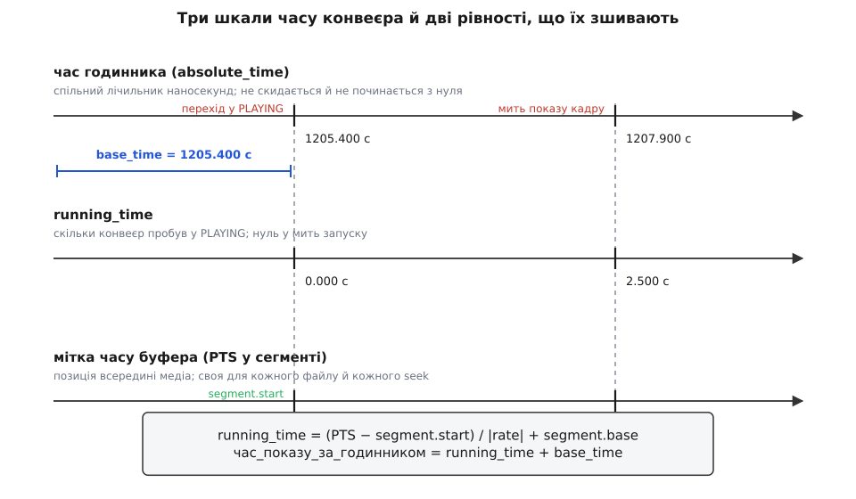
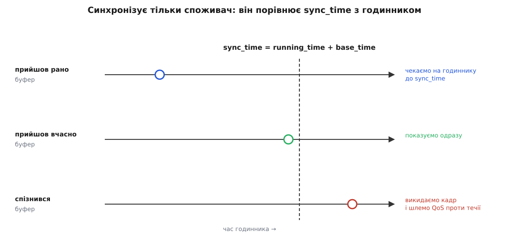
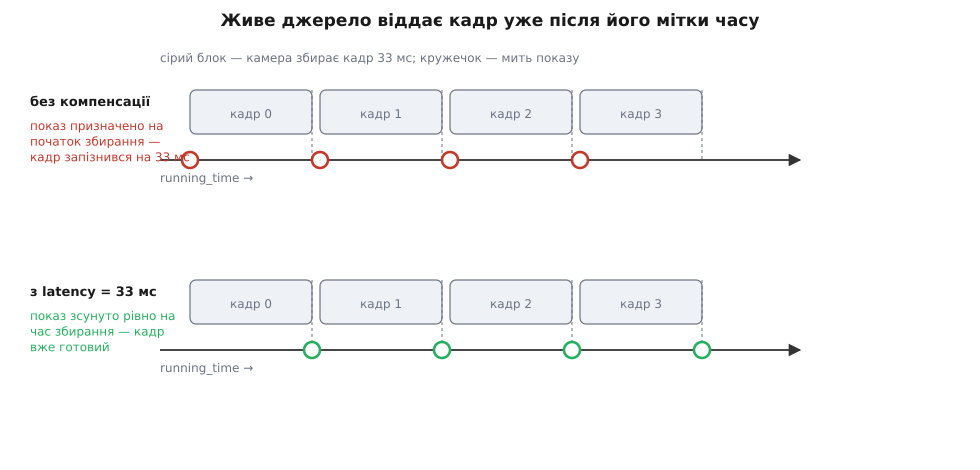
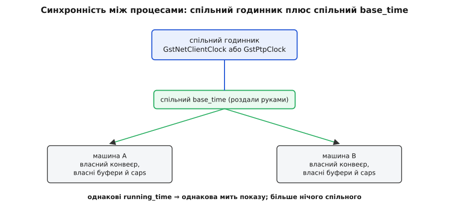

# Годинник, мітки часу й синхронізація потоків

<preknowlist>
- [Конвеєр GStreamer](book:media-vision/pipeline-model) — елементи, зчеплені в ланцюг, і дані, що течуть від джерела до споживача.
- [Стани конвеєра](book:media-vision/states-lifecycle) — що саме змінюють переходи NULL → READY → PAUSED → PLAYING.
- [Буфери й пам'ять](book:media-vision/buffers-and-memory) — буфер як одиниця даних, що несе кадр або порцію звуку.
- [Монотонний і настінний час](book:programming/monotonic-vs-wall-time) — чому для вимірювання тривалостей беруть годинник, який не стрибає назад.
- [Мітки часу](book:communications/timestamps) — навіщо даним приписують момент і в якій шкалі його рахують.
- [Дрейф годинників](book:communications/clock-offset-drift) — два кварци ніколи не йдуть однаково, і ppm як міра розбіжності.
</preknowlist>

## Чому потік даних сам себе не стримує

Уявіть найпростіший конвеєр: файл → демультиплексор → декодер → вікно. Кожен елемент віддає буфер наступному одразу, щойно його зробив. Ніде в цьому ланцюгу немає нічого, що знало б про темп. Декодер H.264 на звичайному настільному процесорі розбирає годинну стрічку за кілька хвилин — і саме це ви й побачите: усі 90 тисяч кадрів промайнуть у вікні за пару хвилин, а звук вилетить у динамік суцільним виском.

Отже, десь у конвеєрі мусить бути гальмо. Питання не в тому, чи воно потрібне, а в тому, **де** воно стоїть і **за чим** звіряється.

Найочевидніша відповідь — хай кожен кадр після показу присипляє потік на 1/25 секунди. Вона не працює, і причини її провалу описують усе, що доведеться побудувати натомість.

Перша причина: сон — це нижня межа, а не рівність. Планувальник поверне вам керування *не раніше* ніж через 40 мс, а насправді через 40.2 чи 41. Помилка щоразу однакового знаку, тож вона накопичується: зайві 0.2 мс на кадр при 25 кадрах за секунду дають 5 мс за секунду, тобто 18 секунд відставання за годину. Відставання нема від чого відняти — нема з чим звірятися.

Друга причина глибша. Звукова карта споживає рівно 48000 відліків на секунду — на *своїй* секунді, яку задає її власний кварц. Ви не можете попросити її трохи прискоритися: якщо ваш потік подає відліки повільніше, ніж карта їх з'їдає, буфер порожніє й у динаміку клацає. Тобто у системі вже є фізичний носій темпу, і він не той, за яким спить відеогілка.

Третя причина остаточно ховає ідею сну. У конвеєрі два споживачі — вікно і динамік. Кожен спить сам по собі. Ніщо у світі не стверджує, що *оцей* кадр і *оця* порція звуку належать одній миті. Синхронність губ і голосу не виникає з двох незалежних снів; вона взагалі не може з них виникнути.

Звідси випливає форма розв'язку, і вона єдина. Потрібна **спільна шкала часу** для всього конвеєра, кожен буфер має нести **мить, якій він належить**, а робота споживача зводиться до одного речення: тримай буфер, доки спільний час не дійде до його миті. Синхронність двох гілок тоді не домовляється — вона просто випадає з того, що обидві гілки міряють одним приладом.

Далі — як цей прилад влаштовано.

## Годинник конвеєра

Спільна шкала в GStreamer називається `GstClock`. Це об'єкт із однією істотною операцією: `gst_clock_get_time()` повертає `GstClockTime` — беззнакове 64-бітове число наносекунд, що тільки зростає.

Два його властивості варто зрозуміти одразу, бо на них тримається все інше.

Годинник **монотонний**, а не календарний. Він не показує «пів на десяту» й не стрибає, коли NTP підкрутив системну дату. Типовий `GstSystemClock` за замовчуванням бере монотонний годинник ядра, тобто просто час від запуску машини.

Через це саме́ значення годинника **не має сенсу**. Осмислені тільки різниці двох значень. Число `1205400000000` не каже нічого; число `1205400000000 − 1202900000000 = 2.5 с` каже все. Ця дрібниця пояснює, чому далі з'явиться `base_time`: щоб перевести безглузде абсолютне число у щось, що можна порівняти з міткою кадру.

Годинник не належить конвеєрові — його **надає елемент**. Елемент, який має власне фізичне джерело часу, оголошує це прапорцем `GST_ELEMENT_FLAG_PROVIDE_CLOCK`, і конвеєр під час переходу в PLAYING вибирає один годинник із запропонованих та роздає його всім елементам. Про появу такого елемента конвеєр шле в шину повідомлення `CLOCK_PROVIDE`, а якщо елемент із чинним годинником зникає — `CLOCK_LOST`; тоді застосунок мусить провести конвеєр через PAUSED назад у PLAYING, щоб вибір повторився й нові `base_time` розійшлися по елементах.

Чому годинник беруть у елемента, а не завжди системний? Поверніться до звукової карти. Її кварц уже визначає, скільки триває секунда для звуку, і сперечатися з ним нема як: зайвий чи пропущений відлік чутно, тоді як продубльований відеокадр — ні. Тому аудіоспоживач віддає назовні годинник, зроблений із лічильника відтворених відліків, і весь конвеєр міряє час *його* секундами. Відео підлаштовується під звук, бо підлаштувати звук під відео коштує чутних дефектів.

> 🔧 **Навіщо це.** На одноплатнику з камерою й без звуку годинник дає системний. Щойно ви додаєте `alsasink`, темп усього конвеєра переходить до звукової карти — і саме тоді часто «раптом» починає повзти відео, знята камерою. Це не поламка: два кварци розійшлися, і ви щойно призначили головним інший. Примусово закріпити конкретний годинник дозволяє `gst_pipeline_use_clock()`.

## Три шкали часу

Тепер найважливіше місце теми. У конвеєрі одночасно живуть **три різні шкали**, і плутанина між ними — головне джерело незрозумілої поведінки.

**Перша — час годинника** (`absolute_time`). Безглузде саме по собі велике число, спільне для всіх елементів.

**Друга — час медіа.** Кожен буфер несе мітку `PTS` (*presentation timestamp*, мітка показу) — позицію всередині матеріалу. У файлі вона починається з нуля й іде до кінця стрічки; після перемотування вона стрибає туди, куди ви перемотали.

Ці дві шкали не звести докупи безпосередньо: одна не має початку, друга стрибає. Між ними потрібна третя.

**Третя — `running_time`.** Це час, який конвеєр **пробув у стані PLAYING**. У мить запуску він нуль; він росте, поки конвеєр грає; він завмирає на паузі; він **не стрибає при перемотуванні**. Саме він — та неперервно зростаюча вісь, на якій зустрічаються всі гілки конвеєра.

Зв'язок із годинником — одне віднімання:

```
running_time = absolute_time − base_time
```

`base_time` — це значення годинника в мить переходу в PLAYING; конвеєр обчислює його й роздає всім своїм елементам. На паузі конвеєр запам'ятовує досягнутий `running_time` (це поле `start_time`), а при поверненні в PLAYING видає **новий** `base_time` так, щоб `running_time` продовжився з того самого місця, а не з нуля. Тому пауза й не рахується як програний час.

Зв'язок із міткою буфера складніший, бо між ними стоїть **сегмент** — опис того, який шматок медіа зараз відтворюється і як. Сегмент прийшов по конвеєру подією `SEGMENT` перед буферами й несе, зокрема, `start` (мітка, з якої починається шматок), `base` (скільки `running_time` уже накопичено попередніми шматками) і `rate` (швидкість відтворення). Формула перекладу для додатної швидкості:

```
running_time = (PTS − segment.start) / |rate| + segment.base
```

Читайте її як три дії. Віднімання `segment.start` прибиває початок поточного шматка до нуля. Ділення на `|rate|` враховує, що на подвійній швидкості дві секунди матеріалу займають одну секунду реального часу. Додавання `segment.base` ставить шматок у чергу за всіма попередніми — саме завдяки цьому доданку перемотування назад не відкидає `running_time` у минуле: після перемотування конвеєр видає новий сегмент, у якого `base` дорівнює тому `running_time`, на якому обірвався попередній.

Є ще й четверта, суто службова величина — `stream_time`, позиція всередині матеріалу в шкалі, зручній людині. Вона потрібна повзунку перемотування й обчислюється окремо, `stream_time = (PTS − segment.start) · |applied_rate| + segment.time`, і в синхронізації участі не бере.



*Одна й та сама мить, записана трьома різними числами; base_time і segment зшивають шкали між собою.*

**Приклад: коли з'явиться на екрані кадр із міткою 12.500 с.** Ви ввімкнули відтворення, коли годинник показував 1205.400 с, і перед тим перемотали файл на 10-ту секунду.

```
base_time      = 1205.400 с        (годинник у мить PLAYING)
segment.start  = 10.000 с          (початок шматка після перемотування)
segment.base   =  0.000 с          (нічого раніше не грали)
rate           =  1.0

running_time   = (12.500 − 10.000) / 1.0 + 0.000 = 2.500 с
час_показу     = 2.500 + 1205.400                = 1207.900 с
```

Кадр вийде у вікно, коли годинник дійде до 1207.900 — через дві з половиною секунди після натискання «грати», хоча в самому файлі він лежить на 12-й секунді.

Алгебра сегментів вартує окремого розбору: вона однаково обслуговує зворотне відтворення, прискорене й монтаж кількох файлів у безшовний потік. [Розгортку формул із числами для від'ємної швидкості та ланцюжка сегментів](book:media-vision/clock-and-sync/math-running-time.md) винесено в окремий текст — там показано, чому `running_time` лишається монотонним за будь-яких перемотувань і чим `rate` відрізняється від `applied_rate`.

## Синхронізує тільки споживач

Тепер зберемо гальмо. Коли буфер доходить до споживача з увімкненою синхронізацією, той обчислює

```
sync_time = running_time + base_time
```

і чекає на годиннику, доки той дійде до `sync_time`. Чекання — не активне: споживач замовляє в годинника сповіщення на конкретний момент і спить, доки годинник його не збудить.

Три можливі результати. Буфер прийшов **рано** — споживач спить і показує його точно вчасно, це нормальний режим. Буфер прийшов **саме вчасно** — показує одразу. Буфер прийшов **пізно**, тобто годинник уже проминув `sync_time` — показувати його вже нема сенсу, бо його мить минула.



*Уся синхронізація — це одне порівняння, і робить його споживач, а не джерело.*

Із запізнілим буфером споживач робить дві речі. Скидає його, якщо запізнення перевищує допуск `max-lateness` — інакше конвеєр показував би вже нікому не потрібне минуле й відставав дедалі більше. І шле проти течії подію **QoS**, у якій пише, наскільки саме спізнився цей буфер (`diff`), на який момент чекає найраніший придатний буфер (`timestamp`) і яку частку від реального часу нині займає обробка одного буфера (`proportion`). Верхні елементи мають право на цю подію зреагувати: декодер може пропустити двонапрямлені кадри, які нічого не залишають по собі, масштабувальник — перейти на дешевший алгоритм, джерело — знизити роздільність. Так конвеєр саморегулюється замість того, щоб рівно відставати.

І ось де ховається обіцяна елегантність. Двом споживачам — вікну й динаміку — роздали **той самий годинник** і **той самий `base_time`**. Обидва рахують `sync_time` за однією формулою з одних вихідних. Тому кадр із міткою 12.500 і порція звуку з міткою 12.500 виходять назовні в ту саму мить — не тому, що відеогілка про щось домовилася з аудіогілкою, а тому, що вони взагалі не спілкуються, а лише користуються однією системою координат. Синхронізація губ і голосу — не механізм, а наслідок.

Вимкніть у споживача синхронізацію (`sync=false`), і він показуватиме буфери одразу, як їх отримає. Для запису у файл чи для аналізу кадрів у власному коді це саме те, що треба: гальмувати нема чого. Для показу на екрані це і є той самий провал із першого абзацу.

Точні сигнатури функцій годинника, поля подій QoS і сегмента, макроси міток буфера й властивості споживачів, які на це впливають, зібрано в [довідці інтерфейсів часу](book:media-vision/clock-and-sync/api-clock-and-time.md).

## PTS і DTS: показ проти декодування

У буфера є **дві** мітки часу, і в синхронізації бере участь лише одна.

Причина в тому, що сучасні кодеки переставляють кадри. Двонапрямлений кадр спирається і на попередній, і на **наступний** ключовий, тому в потоці той наступний мусить лежати раніше — інакше декодерові не буде на що спиратися. Порядок у файлі відрізняється від порядку на екрані. [Міжкадрове стиснення](book:algorithms/inter-frame) описує, звідки береться ця перестановка.

Тому буфер несе `DTS` (*decoding timestamp*) — коли його треба **згодувати декодерові** — і `PTS` — коли готовий кадр треба **показати**. Декодер споживає буфери в порядку `DTS` і видає їх у порядку `PTS`; далі по конвеєру `DTS` уже не потрібен. Споживач синхронізується **виключно за `PTS`**. Для потоків без перестановки (звук, послідовність JPEG) обидві мітки збігаються.

Ця пара з'явилася разом із гілкою GStreamer 1.0, випущеною 24 вересня 2012 року: у попередній серії 0.10 буфер мав одне поле `timestamp`, і елементам доводилося окремо домовлятися, що воно означає в кожному конкретному місці конвеєра. Розділення на два явні поля — одна з тих змін, заради яких ламали сумісність.

Окремо варто знати про `GST_CLOCK_TIME_NONE` — значення «мітки немає». Буфер без `PTS` споживач синхронізувати не може й показує одразу, як отримав. Коли відео «летить» замість того, щоб іти в темпі, перше, що слід перевірити, — чи взагалі є мітки; типова причина порожніх міток — джерело, у якого не ввімкнено `do-timestamp`, або власний код, що конструює буфери й забуває їх проставити.

## Живі джерела: чому потрібна latency

Досі йшлося про файл, який увесь є на диску. Живе джерело — камера, мікрофон, мережевий потік — ламає одне мовчазне припущення: воно **не може віддати буфер для миті t раніше, ніж ця мить настане**.

Розгляньмо мікрофон, налаштований віддавати буфери по 1024 відліки при 48 кГц. Кожен буфер — 21.3 мс звуку. Щоб його зібрати, треба фізично прочекати 21.3 мс. Мітка цього буфера відповідає **початку** збирання, а на виході елемента він з'являється в **кінці**. Тобто буфер народжується вже запізнілим рівно на власну тривалість.

Прикладіть до нього правило споживача. `sync_time` припадає на мить, яка минула ще до того, як буфер вийшов із джерела; далі буфер ішов конвеєром, декодувався, перетворювався — і в споживача виявляється, що спізнилися **всі** буфери без винятку. Споживач сумлінно скидає їх усі, і на виході нема нічого.



*Живе джерело віддає кадр уже після його мітки; компенсують це, зсунувши показ усім споживачам одразу.*

Ліки очевидні за формою: зсунути показ на стільки, скільки конвеєр не встигає. Тонкість у тому, що зсув має бути **однаковим для всіх споживачів**, інакше ми власноруч розсинхронізуємо звук із зображенням.

Тому GStreamer робить це централізовано. Споживач шле проти течії запит `LATENCY`; кожен елемент на шляху додає до відповіді свій внесок — мінімальну затримку, без якої він фізично не може працювати, і максимальну, яку він здатен витримати за рахунок власних буферів. Конвеєр збирає відповіді, бере **найбільшу з мінімальних** затримок і розсилає це число вниз подією `LATENCY`. Відтоді кожен споживач рахує

```
sync_time = running_time + base_time + latency
```

Однакове число в усіх — синхронність збережено, і при цьому найповільніша гілка встигає.

Якщо у якогось елемента **максимальна** затримка виявиться меншою за обране мінімальне значення, конвеєр опиниться в неможливій ситуації й повідомить про помилку: комусь бракує місця, щоб потримати дані, поки чекають на інших. Лікується це додаванням `queue` у ту гілку — тобто збільшенням її здатності буферизувати. Скільки саме черг і якого розміру ставити, розбирає окрема тема про [затримку й буферизацію](book:media-vision/latency-and-buffering).

У живого конвеєра є ще одна відмінність, менш помітна, але важлива: `base_time` вибирають так, щоб `running_time` збігався з реальним ходом подій. Живе джерело ставить буферові мітку, що відповідає `running_time` **миті захоплення**. Тому в живому конвеєрі мітка буфера — це не «позиція у файлі», а «коли це сталося», і вся арифметика сегмента далі працює точно так само.

## Коли годинників насправді два

Тепер про найпідступніше. Камера має власний кварц. Звукова карта має власний кварц. Конвеєр міряє час третім. Домовитися між собою вони не можуть — кварц є кварц.

Розбіжність міряють у мільйонних частках, ppm (*parts per million*). Дешевий кварц дає ±50 ppm, гарний — ±10 ppm, термостатований — частки ppm. Здається дрібницею, доки не помножити на час.

**Приклад: скільки набіжить за годину знімання.** Звукова карта заявляє 48000 Гц, реально видає 48000.5 відліків на секунду.

```
відносна похибка = 0.5 / 48000 = 1.0417·10⁻⁵ = 10.4 ppm

за 1 годину:   3600 с · 1.0417·10⁻⁵ = 0.0375 с ≈ 37 мс
за 8 годин:                            0.300 с
```

Тридцять сім мілісекунд за годину — це вже помітний розліт губ і голосу, а за зміну відеоспостереження це третина секунди. Причому похибка **систематична**: вона не коливається довкола нуля, а зростає лінійно, тож жодне усереднення її не прибере.

Розв'язок один — назвати один годинник головним і **підганяти під нього решту**. Робиться це двома різними способами, і вибір між ними — компроміс між якістю й простотою.

Перший спосіб, **перевибірка**: потік звуку неперервно перераховують із коефіцієнтом, що дорівнює виміряному відношенню швидкостей двох годинників. Дорого за обчисленнями, зате без жодного чутного дефекту.

Другий, **зсув указівника**: нічого не перераховують, а коли накопичене розходження перевищує допуск, разово вставляють або викидають шматочок тиші. Дешево, але момент правки теоретично чутний — на практиці його ховають у тихому місці. Аудіоспоживач GStreamer дає обидва варіанти у властивості `slave-method`, плюс режим «не чіпати».

Щоб підганяти, треба спершу **виміряти**. Годинник GStreamer уміє приймати спостереження — пари «за моїм годинником було x, за головним було y» — і будувати з них калібрування: зсув та відношення ходу. Підганяють пряму методом [найменших квадратів](book:math/least-squares), бо кожне окреме вимірювання зашумлене, а шукана залежність між двома рівномірними годинниками — саме пряма. Той самий механізм працює і для мережевого годинника, і для підлеглого аудіоспоживача.

## Синхронність між процесами й машинами

Рівність `sync_time = running_time + base_time` не знає нічого про межі процесу. Тому два конвеєри — в різних програмах або на різних машинах — покажуть той самий кадр одночасно, якщо в них збігаються **обидва** доданки. І це вичерпний список: більше їм ділити нічого.



*Спільними мають бути рівно дві речі — джерело часу й точка відліку; усе решта в кожного своє.*

**Спільний годинник.** GStreamer уміє віддавати свій годинник у мережу: один процес піднімає постачальника часу на UDP-порту, інші створюють клієнтський мережевий годинник і підганяють його під віддалений тими самими спостереженнями. Точність такого способу — одиниці мілісекунд у локальній мережі, бо вимірювання йде через звичайні пакети й потерпає від їхнього розкиду. Коли цього замало, беруть `GstPtpClock` — реалізацію протоколу PTP (IEEE 1588), доданого в GStreamer 1.6; там мітки часу ставить мережеве обладнання, і точність піднімається до мікросекунд. Обидва варіанти рідні для проєкту й вмикаються заміною одного об'єкта годинника.

**Спільний `base_time`.** Автоматика тут не допоможе: кожен конвеєр вибирає `base_time` у мить свого переходу в PLAYING, а ці миті в різних процесах різні. Тому `base_time` роздають руками — обчислюють одне число (наприклад, «поточний час плюс дві секунди»), розсилають його всім учасникам, ставлять кожному конвеєру й забороняють конвеєрові перепризначати його на переходах станів. Без цієї другої дії перша безглузда: спільний годинник без спільної точки відліку дає лише спільну лінійку без спільного нуля.

Повний робочий приклад — [двомашинна синхронна відтворювальна пара](book:media-vision/clock-and-sync/proj-net-clock-sync.md): постачальник часу, клієнтський годинник, роздача `base_time`, перевірка розбіжності й типові пастки на кшталт закритого порту чи конвеєра, що стартує раніше, ніж годинник устиг синхронізуватися.

Окремий випадок — коли медіа приходить по мережі готовим потоком. Мітки RTP рахуються у власних одиницях кодека й починаються з випадкового числа — самі по собі вони не кажуть нічого про реальний час і не дозволяють зіставити звуковий потік із відеопотоком того самого відправника. Місток дає RTCP: у звіті відправника лежить пара «моя мітка RTP» — «мій настінний час у шкалі NTP», і по ній приймач переводить обидва потоки на одну вісь. Деталі транспорту розбирає тема про [RTP і RTCP](book:communications/rtp-rtcp), а спосіб узгодити самі шкали настінного часу між машинами — тема про [NTP](book:communications/ntp-sync) і про [PTP](book:communications/ptp-1588), точнішого протоколу з апаратними мітками. У GStreamer це вмикається властивістю `ntp-sync` у `rtpbin`; є й точніший шлях, коли відправник прямо оголошує в описі сеансу, за яким саме опорним годинником він ставить мітки, — механізм, описаний у RFC 7273 (2014).

## Що ламається найчастіше

Кожна типова поламка — це порушена частина тієї самої рівності, тож діагностика зводиться до питання: яка з трьох величин неправильна.

**Годинника немає взагалі.** Конвеєр без жодного споживача, що синхронізується, може не вибрати годинник — і тоді буфери летять на максимальній швидкості. Те саме дає забутий `sync=false`, поставлений колись для налагодження.

**`base_time` не роздано.** Елемент, доданий у вже запущений конвеєр, свого `base_time` не отримає автоматично; його треба поставити явно. Симптом характерний: нова гілка миттєво «випльовує» усе накопичене, бо рахує від нуля й вважає, що спізнилася на весь час програвання.

**Мітки порожні.** Буфери з `GST_CLOCK_TIME_NONE` показуються одразу. Джерело, яке не проставляє час, і власний `appsrc` без правильно налаштованого формату часу — дві найчастіші причини.

**Годинник змінився на ходу.** Ви від'єднали USB-звук — прийшло `CLOCK_LOST`, і доки застосунок не проведе конвеєр через PAUSED у PLAYING, синхронізація тримається за годинник, якого вже нема.

**Годинники розійшлися.** Розсинхронізація, що рівномірно наростає й зникає після перезапуску, — це майже завжди дрейф двох кварців, а не помилка в коді. Лікує підпорядкування годинників, а не правки міток.

Коли картинка й звук розходяться, корисно ставити питання саме в такому порядку: чи є мітки, чи однаковий у гілок `base_time`, чи один у них годинник, чи не наростає розбіжність із часом. Три числа — і кожен симптом указує на своє.
