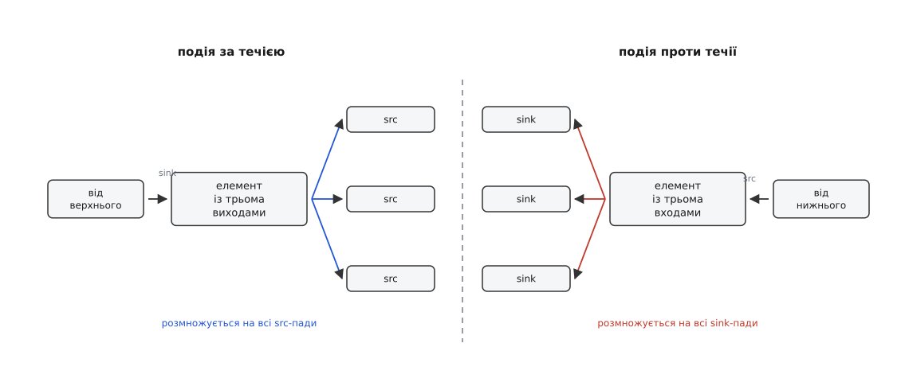
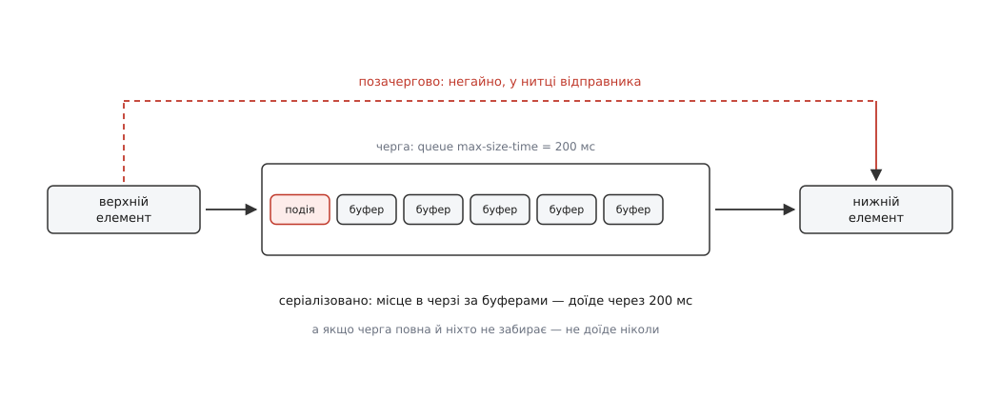
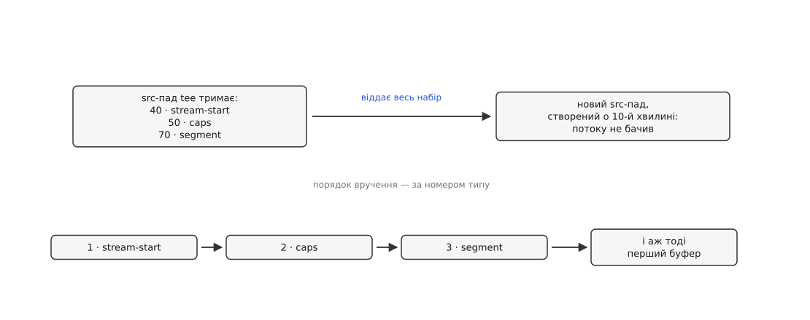
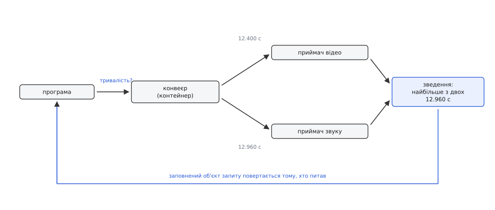
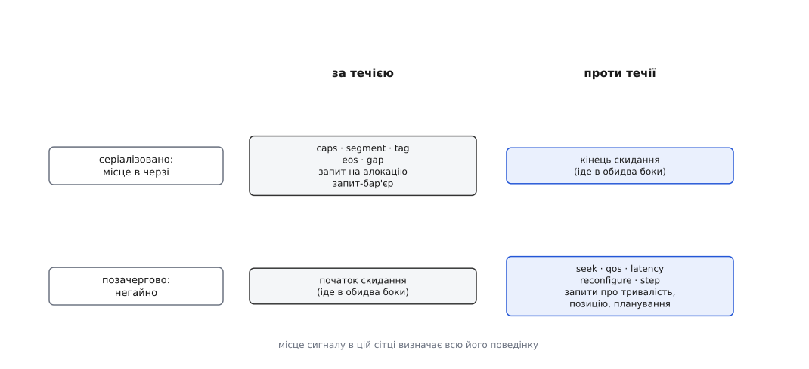

# Події й запити на падах: сигналізація вздовж конвеєра

<preknowlist>
- [Конвеєр: елементи, зв'язки й потік даних](book:media-vision/pipeline-model) — що таке елемент, як елементи складаються в ланцюг і як кадр іде від джерела до приймача.
- [Пади і з'єднання елементів](book:media-vision/pads-and-linking) — пад як точка з'єднання, напрямки src і sink, штовхання буфера в chain-функцію сусіда, зонди на паді.
- [Процеси й потоки](book:programming/process-vs-thread) — нитка виконує код незалежно від інших; кілька ниток працюють одночасно й бачать спільну пам'ять.
- [Ланцюжок обов'язків](book:programming/chain-of-responsibility) — звернення йде ланцюгом обробників, і кожен або опрацьовує його сам, або передає далі.
- [Підрахунок посилань](book:programming/reference-counting) — об'єкт живе, доки на нього є посилання; хто відпустив останнє, той і звільнив пам'ять.
</preknowlist>

Кадр, який іде конвеєром, — це масив байтів і мітка часу. Ані байти, ані мітка не кажуть, як розкласти ці байти в пікселі, від якого нуля відлічувати час і чи буде після цього кадру хоч один наступний. Усі три речі приймач мусить знати **раніше**, ніж візьме в руки перший буфер: інакше він або намалює кашу з правильних байтів, або покаже правильну картинку не в ту мить, або вічно чекатиме продовження, якого вже не буде.

У зворотний бік потрібне інше, але так само відсутнє в даних. Користувач тягне повзунок — конвеєр має дізнатися, що відтворення переїжджає на десяту секунду. Приймач не встигає малювати — декодер має дізнатися, що час спрощувати роботу. Програма малює шкалу — хтось має відповісти, скільки триває матеріал і де ми зараз.

Отже, крім кадрів, конвеєром мусить ходити ще щось: **факти про дані** й **питання про дані**. Питання, як їх передавати, здається дрібним технічним вибором. Насправді відповідь на нього визначає майже все, що видно ззовні: чому формат оголошують подією, а не викликом; чому перемотування спрацьовує миттєво навіть на забитому конвеєрі; чому гілка, підчеплена до `tee` посеред роботи, одразу знає формат; і чому запит про тривалість, надісланий у конвеєр, повертає число, якого не знає жоден окремий елемент.

## Чому не просто виклик у сусіда

Найпростіше, що спадає на думку: хай елемент кличе метод сусіда. `avdec_h264`, змінивши формат, викликав би в `videoconvert` щось на кшталт `set_format()`. Ця думка розбивається об дві різні перешкоди, і побачити їх варто до того, як з'явиться назва механізму.

**Перша перешкода — порядок.** Формат міняється не лише на початку: у потоці MPEG-TS роздільність може змінитися посеред трансляції, `decodebin` уміє переставити декодер на ходу. Виклик функції йде **повз** канал даних і виконується тієї миті, коли його зробили. А буфери в цю мить нікуди не поділися: вони лежать у чергах між елементами, і їх там може бути на пів секунди наперед. Приймач дізнався б про новий формат тоді, коли перед ним ще сотня кадрів старого, і розклав би їх за новою розкладкою. Факт про дані мусить прибути **точно між** останнім буфером, якого він не стосується, і першим, якого стосується, — а виклик такої гарантії не дає в принципі.

**Друга перешкода — адресат.** «Скільки триває матеріал» знає не сусід, а `qtdemux` через три елементи проти течії, який прочитав заголовок файлу. «Чи можна перемотати назад» знає `filesrc` — або не знає ніхто, якщо там `udpsrc`. Той, хто питає, не має ні покажчика на потрібний елемент, ні способу дізнатися, який саме елемент відповідає: конвеєр складають під час роботи, і `decodebin` може підставити геть інший декодер, ніж був учора. Питання мусить уміти **йти ланцюгом**, доки не знайдеться той, хто на нього відповість.

Обидві перешкоди мають ту саму форму: сигнал має рухатися **тими самими дротами, що й дані**, — падами, від сусіда до сусіда. Пад для цього годиться: він уже знає свого партнера й уже є тим місцем, де програма має право стати між двома елементами.

## Дві потреби — два механізми

Факт і питання відрізняються одним: питання потребує **відповіді назад**, факт — ні. Ця різниця тягне за собою все інше, тому в GStreamer це два різні об'єкти з різною механікою.

**Подія** (`GstEvent`, англ. *event*) — повідомлений факт або наказ. Відправник її віддає й іде далі; відповіді як такої немає — є лише ознака, чи хтось узагалі взяв її до рук. Подія може пройти десять елементів, може бути з'їдена першим-ліпшим, може перетворитися на іншу подію. Вона рухається **асинхронно** до того, хто її послав: серіалізовану подію віддає нитка потоку, і від'їхати вона може набагато пізніше за виклик.

**Запит** (`GstQuery`, англ. *query*) — питання з обов'язковою відповіддю. Викликач створює порожній об'єкт запиту, віддає його падові й **блокується**, доки хтось не впише туди відповідь і не поверне «так». Запит виконується **синхронно, у нитці того, хто питає**, і повертається з результатом або з відмовою.

Третя річ, яку легко сплутати з обома, — **повідомлення** (`GstMessage`). Воно теж сигналізує про подію, але йде не падами, а вбік, у чергу конвеєра, і призначене не сусідньому елементу, а програмі; порядку відносно кадрів у нього немає. Ця плутанина коштує годин налагодження, бо одна й та сама річ часто існує в обох виглядах — кінець потоку є і подією, і повідомленням, — і роблять вони різне ([шина повідомлень](book:media-vision/bus-and-messages) — черга, якою конвеєр говорить із програмою; повідомлення перетинає межу ниток, а події й запити лишаються всередині конвеєра).

## Перша вісь: куди йде сигнал

Пад має напрямок, дані течуть в один бік, і кожен сигнал теж має бік. Униз, **за течією** (*downstream*), ідуть факти про самі дані: почався потік, формат такий, час рахуємо звідси, тут дірка без даних, дані скінчилися. Угору, **проти течії** (*upstream*), ідуть накази й скарги: перемотай, переузгодь формат, я не встигаю, зміни темп.

Поділ не декоративний: саме напрямок задає **типову маршрутизацію** всередині елемента. Правило одне й дуже просте. Подія за течією, що прийшла на sink-пад, автоматично розсилається на **всі** src-пади елемента. Подія проти течії, що прийшла на src-пад, розсилається на **всі** sink-пади. Елемент, який нічого не знає про конкретний тип події, поводиться правильно **за замовчуванням** — саме тому в GStreamer можна дописати свій елемент, не знаючи всіх типів подій, які винайдуть після вас.



*Типовий маршрут задає напрямок події: елемент розмножує її на всі пади протилежного боку, нічого не знаючи про її зміст.*

Із цього правила прямо випливають наслідки, які інакше здаються сваволею.

**Наказ у розгалуженому конвеєрі стосується всіх.** У `tee` один sink-пад і кілька src-падів. Подія перемотування, послана в одну гілку, доходить до `tee`, той розсилає її на свій єдиний sink-пад — і вона йде до джерела. Джерело перемотується, і **всі** гілки поїхали на нову позицію. Перемотати одну гілку окремо неможливо не через недогляд, а тому, що дані в них спільні до розгалуження.

**Мультиплексор мусить думати сам.** У `matroskamux` кілька sink-падів і один src-пад. Наказ, що прийшов з виходу, типова логіка розішле на всі входи — і кожне джерело перемотається окремо. Для перемотування це саме те, що треба; для чогось на кшталт вибору доріжки — вже ні. Тому елементи зі складною топологією майже завжди перевизначають обробку подій.

**Скарга йде рівно тим шляхом, яким прийшли дані.** Приймач, який показав кадр із запізненням, шле проти течії подію якості обслуговування: наскільки спізнилися, на що чекаємо, яку частку реального часу з'їдає обробка одного буфера. Вона піднімається до першого, хто здатен зреагувати, — декодер пропустить кадри, які нічого по собі не лишають, масштабувальник перейде на дешевший алгоритм, джерело знизить роздільність. Так конвеєр саморегулюється, і саме тому скарга мусить іти проти течії ланцюгом, а не в програму: реагувати має той, хто виробляє забагато ([годинник і синхронізація](book:media-vision/clock-and-sync) — звідки приймач знає, що кадр запізнився, і що саме він пише в цю скаргу).

## Друга вісь: чи стояти в черзі з даними

Тепер найважливіше. Подія `CAPS` мусить стояти в черзі разом із буферами — інакше вона не втримає свого місця між старим і новим форматом. Але з тієї самої причини вона **застрягне** там, де застрягли буфери: у черзі на 200 мілісекунд вона доїде до виходу через ті самі 200 мілісекунд.

Для оголошення формату це правильно. Для скидання конвеєра — смертельно.

Уявімо, що користувач тягне повзунок. Перемотування починається з того, що конвеєр викидає все, що вже в дорозі: старі кадри після стрибка нікому не потрібні, а черги забиті ними вщент. Наказ «викидай усе» мусить дійти до кожного елемента **негайно** — і саме він не може стояти в черзі, яку сам і має розчистити. Гірше: черга, яка заповнилася, **блокує** нитку, що в неї пише, доки споживач не забере хоч щось. Наказ, поставлений у таку чергу, не рушить ніколи, бо звільнити її має він сам.

Звідси другий поділ, незалежний від першого. Сигнал буває **серіалізованим** (лат. *series* — ряд) — тоді він займає своє місце в потоці даних, іде під тим самим замком нитки, що й буфери, і зберігає точний порядок відносно них. Або **позачерговим** (*out-of-band* — «поза каналом») — тоді він доставляється **негайно, у нитці того, хто його послав**, обганяючи все, що зараз лежить у чергах.



*Одна й та сама черга: серіалізований сигнал доїде разом із даними, позачерговий — просто зараз, у нитці відправника.*

Порахуймо ціну цього вибору.

**Умова.** Конвеєр `udpsrc ! queue ! rtph264depay ! avdec_h264 ! queue ! autovideosink` із двома чергами по 200 мс кожна. Приймач саме чекає на годинник, щоб показати кадр, до якого лишилося 40 мс. Користувач натиснув перемотування.

```
позачергове скидання (як воно є):
  наказ від програми до джерела             ≈ 0 мс   (виклик проходить конвеєр напряму)
  черги розчищено, нитки розблоковано       ≈ 0 мс
  реакція користувача                       ≈ 0 мс

якби скидання було серіалізованим:
  чекаємо, доки спорожніє перша черга        = 200 мс
  чекаємо, доки спорожніє друга черга        = 200 мс
  чекаємо, доки приймач покаже кадр у руках  =  40 мс
  разом                                      = 440 мс

а якщо приймач стоїть у стані паузи:
  приймач не забирає з черги      → черга не порожніє
  черга повна                     → наказ у неї не влазить
  наказ мав би її розчистити      → чекаємо на самих себе  = ∞
```

Останній рядок і є справжня причина, чому початок скидання зроблено позачерговим. Не швидкість — вона приємний наслідок, — а те, що серіалізований варіант дає взаємне блокування на паузі, тобто в найпоширенішому стані плеєра.

Скидання через це складається з **двох** сигналів. Перший, позачерговий, наказує всім негайно кидати роботу й відмовляти всім, хто ще принесе дані; після нього нитки конвеєра гарантовано не сидять у жодній черзі. Другий, серіалізований, каже «можна знову працювати» — і він **мусить** бути серіалізованим, бо позначає точку, від якої дані приймаються, і не має права обігнати перший буфер після стрибка. Повний розбір перемотування, разом із тим, чому воно завжди йде парою й що робить кожна половина, — окрема тема ([перемотування і скидання конвеєра](book:media-vision/seeking-and-flush)).

> 🔧 **Навіщо це.** Дві осі дають готовий діагностичний прийом. Якщо ваш сигнал «доходить, але пізно» — він серіалізований і стоїть у черзі; шукати треба розмір черг, а не помилку. Якщо він «доходить негайно, але не в тому місці потоку» — він позачерговий, і використовувати його для оголошення чогось про дані не можна. Третій варіант — «не доходить узагалі» — майже завжди означає, що між вами й адресатом стоїть елемент, який з'їв подію, не передавши далі.

## Тип події — це число з прапорцями

Дві осі й ознака липкості вкладені прямо в числове значення типу події. Молодший байт — прапорці, старші — порядковий номер:

```c
#define GST_EVENT_MAKE_TYPE(num, flags)  (((num) << 8) | (flags))

GST_EVENT_TYPE_UPSTREAM      = 1 << 0
GST_EVENT_TYPE_DOWNSTREAM    = 1 << 1
GST_EVENT_TYPE_SERIALIZED    = 1 << 2
GST_EVENT_TYPE_STICKY        = 1 << 3
GST_EVENT_TYPE_STICKY_MULTI  = 1 << 4

GST_EVENT_FLUSH_START  = MAKE_TYPE ( 10, BOTH)
GST_EVENT_FLUSH_STOP   = MAKE_TYPE ( 20, BOTH | SERIALIZED)
GST_EVENT_STREAM_START = MAKE_TYPE ( 40, DOWNSTREAM | SERIALIZED | STICKY)
GST_EVENT_CAPS         = MAKE_TYPE ( 50, DOWNSTREAM | SERIALIZED | STICKY)
GST_EVENT_SEGMENT      = MAKE_TYPE ( 70, DOWNSTREAM | SERIALIZED | STICKY)
GST_EVENT_TAG          = MAKE_TYPE ( 80, DOWNSTREAM | SERIALIZED | STICKY | STICKY_MULTI)
GST_EVENT_EOS          = MAKE_TYPE (110, DOWNSTREAM | SERIALIZED | STICKY)
GST_EVENT_GAP          = MAKE_TYPE (160, DOWNSTREAM | SERIALIZED)
GST_EVENT_QOS          = MAKE_TYPE (190, UPSTREAM)
GST_EVENT_SEEK         = MAKE_TYPE (200, UPSTREAM)
GST_EVENT_RECONFIGURE  = MAKE_TYPE (240, UPSTREAM)
```

Читати цю таблицю варто не як перелік, а як перевірку правил на міцність. Обидва скидання позначені `BOTH` — вони мають право йти в обидва боки, бо перемотування народжується в програмі й спускається до джерела, а джерело розсилає скидання вниз. Початок скидання — єдиний із двох без прапорця серіалізації, і це та сама причина, що вище. Усе, що описує дані, — за течією й серіалізоване. Усе, що є наказом, — проти течії й без серіалізації, бо наказ має діяти негайно, а не через півсекунди.

Номер, зсунутий на вісім бітів, здається просто способом уникнути збігів. Але саме він задає **порядок**, і це стає суттєвим одразу.

## Липкі події: пад, який пам'ятає

Погляньмо на прапорець `STICKY`. Він стоїть рівно на тих подіях, які описують **чинний стан потоку**, а не окрему подію в ньому: початок потоку з його ідентифікатором, формат, система координат часу, теги.

Потреба в них видно з динамічного конвеєра. `tee` роздає живий потік, і о десятій хвилині роботи програма чіпляє до нього нову гілку — почати запис у файл. Новий пад народжується посеред потоку. Оголошення формату проїхало десять хвилин тому, початок відліку часу — теж. Якщо новоприбулому нічого не сказати, він отримає перший буфер «без документів»: байти є, розкладка невідома, від чого рахувати мітку — невідомо.

Тому пад **запам'ятовує** останню липку подію кожного типу й тримає її в себе. Щойно з'являється новий партнер, пад віддає йому весь збережений набір — і аж тоді пропускає перший буфер. Новоприбулий бачить рівно те саме, що бачив би, якби стояв тут від початку.



*Липкі події живуть на паді, а не в потоці: гілка, підчеплена посеред роботи, отримує їх усі перед своїм першим буфером.*

Порядок відтворення тут не байдужий: формат не має сенсу до того, як оголошено початок потоку, а система координат часу — до формату. Порядок, у якому пад віддає збережене, збігається з порядком номерів типів: 40, 50, 70, 80, 110. У нинішньому коді його задає окрема таблиця відповідності, а не саме число, але послідовність та сама, що й у нумерації, — і вона обрана свідомо, з кроком у десятки, щоб між уже наявними типами можна було вставити нові.

Із цього механізму випливають три речі, з якими стикається кожен, хто пише елемент або перебудовує конвеєр на ходу.

**Буфер без оголошеного формату не пройде.** Спроба штовхнути буфер у пад, на якому ще не осіла подія формату, дає помилку — не тому, що хтось параноїк, а тому, що приймач фізично не має чим цей буфер розкласти. Класичне `Sticky event misordering` у журналі означає рівно це: елемент віддав дані раніше, ніж домовленість про них.

**Невдало віддану подію пад не забуває.** Якщо партнер відмовився її прийняти — типово тому, що зараз скидає дані, — подія лишається збереженою, а пад дістає позначку «є неврученe». Перед наступним буфером він спробує знову. Тому після скидання конвеєр не втрачає формат: його ніхто й не викидав, просто вручення відклали.

**Кінець скидання чистить не все.** Разом із дозволом працювати далі з пада злітає ознака кінця потоку й система координат часу — саме те, що після стрибка стало неправдою. Формат і початок потоку лишаються: розкладка пікселів від перемотування не змінилася. Через це після скидання **обов'язково** має прийти нова система координат часу, інакше приймач рахуватиме мітки від старого нуля й покаже кадри в минулому.

> 🔧 **Навіщо це.** Липкі події — готовий інструмент діагностики, а не лише внутрішня механіка. Зонд на паді може будь-якої миті спитати, які липкі події там лежать, і дістати чинний формат та поточну систему координат часу без жодного втручання в елементи. На цьому стоїть половина вимірювальних зондів: щоб перевести мітку буфера в час від початку відтворення, потрібна саме збережена на паді система координат.

## Запит: об'єкт, у який вписують відповідь

Подія летить в один бік. Запит мусить принести відповідь, і зроблено це найпрямішим способом, який тільки можна вигадати: запит — **змінюваний об'єкт**, який передають сусідові, а той вписує відповідь просто в нього.

```c
GstQuery *q = gst_query_new_duration (GST_FORMAT_TIME);

if (gst_pad_peer_query (sinkpad, q)) {          /* блокує до відповіді */
  gint64 dur;
  gst_query_parse_duration (q, NULL, &dur);
  g_print ("тривалість: %" GST_TIME_FORMAT "\n", GST_TIME_ARGS (dur));
}
gst_query_unref (q);
```

Виклик синхронний: він повертається тоді, коли хтось у ланцюгу відповів або коли всі відмовилися. Типова обробка запиту так само проста, як типова обробка події: елемент, який не знає цього типу, пересилає його **своїми внутрішніми зв'язками** — з sink-пада на src-пад і далі — і віддає першу успішну відповідь. Так питання проходить конвеєр, доки не натрапить на того, хто знає.

Але буває й інакше — і саме тут ховається найцікавіше. Питання «скільки триває матеріал», задане конвеєрові, обробляє не окремий елемент, а **контейнер**. Він не пересилає його одному сусідові: він опитує **всі приймачі** всередині й **зводить** відповіді, беручи найбільшу. Для конвеєра з відео й звуком, чиї доріжки скінчаться в різні моменти, це єдина правильна відповідь: матеріал триває стільки, скільки триває найдовша доріжка. Так само зведенням, тільки за іншим правилом, обчислюється сумарна затримка конвеєра: там складають внески вздовж кожної гілки й перетинають отримані вікна ([затримка й буферизація](book:media-vision/latency-and-buffering) — звідки береться внесок кожного елемента й чому спільне число мусить бути одне на весь конвеєр).

Синхронність тягне за собою вимогу, про яку легко забути: **запит обробляють у чужій нитці**. Ваша програма питає позицію з головного циклу, а елемент у цю мить декодує кадр у своїй нитці потоку. Отже, обробник запиту мусить читати стан під замком і **не має права чекати на дані**. Обробник, який усередині відповіді чекає, доки нитка потоку щось доробить, дає взаємне блокування рівно так само, як серіалізоване скидання на паузі.

Друга пастка практичніша. Запит про позицію на конвеєрі, який ще не дійшов до стану паузи, чесно провалюється: приймач ще не отримав системи координат часу, тож переводити мітку йому нема в що. Це не помилка й не збій — це відсутність відповіді, і програма мусить її передбачити ([стани конвеєра](book:media-vision/states-lifecycle) — чому саме в паузі елементи вперше мають дані, з яких можна щось порахувати).



*Запит — це не пара «питання-відповідь», а один об'єкт, який дорогою наповнюють: назад повертається він сам, уже із заповненими полями.*

## Коли запит мусить стояти в черзі

Прапорець серіалізації є й у запитів, і на перший погляд це дивно: питання ж синхронне, воно й так виконується просто зараз. Але два запити з нього таки потребують місця в потоці — і кожен зі своєї причини.

**Домовленість про пам'ять.** Перш ніж почати виробляти буфери, елемент питає споживача, як йому буферизувати: який пул той може надати, якого розміру буфери потрібні, скільки їх щонайменше, яке вирівнювання, які метадані споживач розуміє. Питання це має сенс лише **щодо чинного формату**: пул під кадри 1920×1080 не годиться під 640×480. Отже, запит мусить іти **після** оголошення формату й **до** першого буфера — тобто мати точне місце в потоці, а не проскочити повз чергу. Що саме сторони узгоджують і як із цього виходить передача кадру без копіювання, розібрано окремо ([буфери й пам'ять](book:media-vision/buffers-and-memory)).

**Запит-бар'єр.** Елемент, який роздав нижнім елементам буфери зі свого пулу, не має права цей пул знищити, доки хтось унизу ще тримає бодай один. Дізнатися про це можна єдиним способом: пустити за течією питання, яке повертається **тільки тоді, коли все, що вже в дорозі, оброблено**. Таке питання за побудовою мусить стояти в черзі останнім і чекати, доки перед ним не спорожніє все. Відповідь тут неінформативна — цінний сам момент повернення. Запит працює як бар'єр: не «скажи мені щось», а «дай знати, коли все влежалося».

Обидва випадки показують межу поділу з попередньої осі. Серіалізація — це не властивість «події проти запиту», а властивість **сигналу**: якщо сигнал стосується конкретного місця в потоці даних, він мусить у цьому потоці й стояти, ким би він не був.



*Дві незалежні осі дають чотири чверті, і місце сигналу в цій сітці визначає геть усю його поведінку.*

## Що з усього цього мусить робити елемент

Елемент бере участь у сигналізації двома функціями, які ставить на свої пади: одна для подій, одна для запитів. Обидві мають ту саму форму — «або обробити самому, або передати далі», — і обидві мають типову реалізацію, яку треба **кликати**, а не заміщати.

```c
static gboolean
my_sink_event (GstPad *pad, GstObject *parent, GstEvent *event)
{
  MyFilter *self = MY_FILTER (parent);

  switch (GST_EVENT_TYPE (event)) {
    case GST_EVENT_SEGMENT:
      /* запам'ятовуємо систему координат часу для себе —
         і ОБОВ'ЯЗКОВО пускаємо подію далі: вона потрібна не лише нам */
      gst_event_copy_segment (event, &self->segment);
      break;

    case GST_EVENT_FLUSH_STOP:
      /* після скидання наш внутрішній стан недійсний */
      my_filter_reset (self);
      break;

    case GST_EVENT_CUSTOM_DOWNSTREAM:
      if (gst_event_has_name (event, "my-marker")) {
        my_filter_handle_marker (self, event);
        gst_event_unref (event);       /* з'їли — самі й звільняємо */
        return TRUE;
      }
      break;

    default:
      break;
  }

  /* усе інше — типовій обробці: вона розішле подію на всі src-пади */
  return gst_pad_event_default (pad, parent, event);
}
```

У цих двадцяти рядках сидять чотири правила, кожне з яких коштує окремого дня налагодження, якщо його порушити.

**Липку подію не можна ковтати мовчки.** Перехопили формат чи систему координат часу для власних потреб — передайте далі. Елемент, який залишив оголошення формату собі, робить неробочим усе, що стоїть нижче: у сусіда на паді не осяде формат, і його перший же буфер розіб'ється об помилку впорядкування.

**Незнайому подію передають, а не відкидають.** Типова обробка робить рівно це. Елемент, який на `default` мовчки повертає `TRUE`, стає чорною дірою: скарги знизу не доходять до джерела, наказ на переузгодження формату не доходить до перетворювача, і конвеєр поводиться незрозуміло без жодної помилки в журналі.

**Власність рахують уважно.** Функція, яка передала подію далі, більше нею не володіє. Функція, яка обробила подію сама, зобов'язана її звільнити. Забуте звільнення в обробнику, що спрацьовує на кожен кадр, — рівномірний повільний витік пам'яті, який видно лише через години роботи.

**Успіх означає не те, що здається.** Повернене «так» каже: «хтось узяв цю подію в роботу», а не «сталося те, чого ви хотіли». Наказ перемотати може повернути «так» просто тому, що його прийняв демультиплексор, — а фактично стрибок ще навіть не почався. Дізнатися, чи він удався, можна лише з того, що потече конвеєром далі.

Усі точні сигнатури, повний перелік типів подій і запитів із їхніми прапорцями, конструктори, розбирачі й функції пада, якими це все посилають, зібрано окремо: [довідка з подій і запитів на падах](book:media-vision/events-and-queries/api-events-queries.md) — таблиці типів із номерами й напрямками, парні `gst_event_new_*` / `gst_event_parse_*`, різниця між надсиланням у пад і в елемент, а також те, які запити на що перевіряють.

## Втрутитися, не переписуючи нікого

Лишається останній хід, який робить усю цю механіку доступною ззовні. Зонд на паді бачить не лише буфери: типи зонда розрізняють події за течією, події проти течії, запити за течією й запити проти течії. Отже, будь-який сигнал можна **перехопити з програми**, не чіпаючи жодного елемента.

Спостерігати цим зручно, але цінніше інше — зонд може **відповісти замість елемента**. Код повернення «оброблено» каже конвеєрові, що далі передавати не треба; для запиту це означає, що відповідь уже вписано вашою рукою. Так дописують підтримку того, чого елемент не вміє: підсунути власний пул буферів, збрехати про підтримку перемотування, підмінити відповідь про затримку. Механіка самих зондів, разом із блокувальними, розібрана в темі про [пади і з'єднання](book:media-vision/pads-and-linking); тут важливий лише той факт, що вони працюють на всіх чотирьох чвертях сітки.

Робочий інструмент, який друкує кожну подію та кожен запит на вибраному паді разом із ниткою, у якій той пройшов, і його місцем відносно буферів — а також показує, як власна серіалізована подія тримає своє місце в черзі, поки позачергова її обганяє, — зібрано окремо: [зонд, що показує всю сигналізацію пада](book:media-vision/events-and-queries/proj-event-tracer.md).

Складене докупи, це пояснює, чому елементи GStreamer вдається з'єднувати, нічого не знаючи один про одного. По одному дроту йдуть три різні вантажі: дані, факти про дані й питання про дані. Дані несе штовхання буфера, факти — події, питання — запити; і на кожен вантаж є типова поведінка, яка робить правильну річ мовчки. Новий елемент має право не знати жодного типу події, винайденого після нього, — і все одно поводитися коректно, бо єдине, що від нього вимагається за замовчуванням, — передати далі те, чого він не зрозумів.
