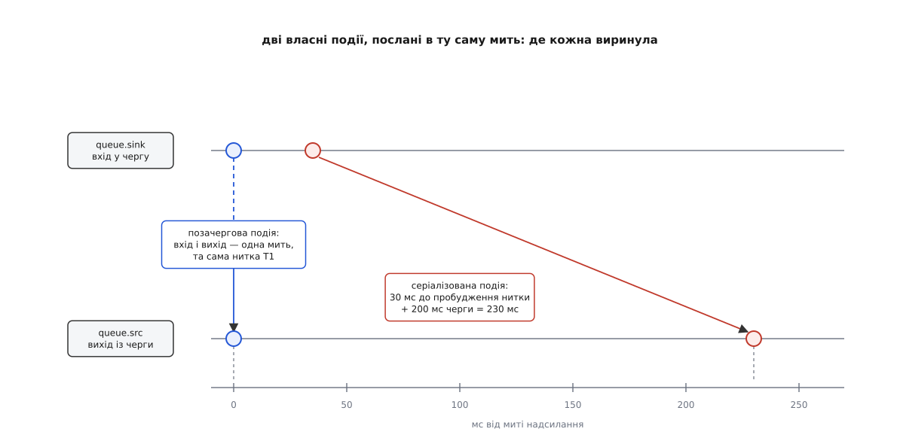

# ⚙️ Трасувальник пада: кожен сигнал разом із ниткою й місцем у потоці

Коли конвеєр поводиться незрозуміло, питання майже завжди одне: **що саме проходить крізь оцей пад і коли**. Готового інструмента для цього немає — `GST_DEBUG=GST_EVENT:6` вивалює мегабайти рядків з усього конвеєра одразу, і в них бракує найважливішого: у якій нитці сигнал пройшов і скільки буферів устигло проїхати перед ним. Далі — програма на сотню з чимось рядків, яка вішає зонд на вибраний пад і друкує по одному рядку на кожну подію та кожен запит. Тим самим інструментом ми потім **виміряємо**, наскільки позачергова подія обганяє серіалізовану в черзі на 200 мс, і насамкінець змусимо зонд **відповісти на запит замість елемента**.

## Що має бути в рядку

Корисний рядок трасування — це п'ять колонок, і кожна відповідає на своє питання.

**Час** — монотонний, від старту програми, у мілісекундах. Абсолютний час не потрібен: цінні лише різниці між рядками.

**Точка спостереження** — своє ім'я для кожного пада, бо один зонд не каже нічого. Змістовним трасування стає тоді, коли той самий сигнал видно у двох місцях і можна порівняти, що між ними змінилося.

**Нитка** — та, у якій обробник фактично виконався. Це найдешевший спосіб побачити, де конвеєр міняє виконавця, і водночас попередження самому собі: усе, до чого дотягнеться цей обробник, треба захищати замком.

**Напрям і серіалізованість** — місце сигналу в сітці двох осей. Дві короткі позначки, які одразу кажуть, чого від нього чекати: серіалізований стоятиме в чергах, позачерговий пройде негайно.

**Номер останнього буфера** — місце сигналу **відносно даних**. Без цієї колонки трасування показує лише час, а нам треба знати, де саме між кадрами сигнал опинився.

Із напрямком є каверза, на якій ламається кожен перший саморобний трасувальник. Макрос `GST_EVENT_IS_DOWNSTREAM` каже, куди подія **має право** йти, а не куди вона йде. У `GST_EVENT_FLUSH_START` і в усіх типах `CUSTOM_BOTH` увімкнено обидва біти напрямку — і програма, яка довіриться макросу, напише «вниз» про сигнал, що піднімається вгору. Справжній напрям знає лише **тип зонда**: біт `GST_PAD_PROBE_TYPE_EVENT_UPSTREAM` виставлено тоді й лише тоді, коли сигнал справді йде проти течії. Те саме із запитами: у `GST_QUERY_DURATION` теж обидва біти. Тому напрям беремо з `info`, а серіалізованість — таки з типу сигналу: вона його справжня властивість, а не обставина подорожі.

## Куди чіпляти: обидва боки однієї черги

Найкорисніша пара точок у GStreamer — sink-пад і src-пад того самого `queue`. Між ними стоїть єдина річ, і ця річ робить рівно те, що нас цікавить: тримає дані й міняє нитку ([потоки виконання й черги](topic:media-vision/threads-and-queues) — чому саме черга є місцем розриву ниток). Усе, що видно на вході й не видно на виході (або видно пізніше й уже в іншій нитці), — це прямий вимір поведінки черги.

Конвеєр для дослідів:

```
videotestsrc num-buffers=150
  ! video/x-raw,width=320,height=240,framerate=30/1
  ! queue max-size-time=200000000 max-size-buffers=0 max-size-bytes=0
  ! fakesink sync=true
```

Джерело **не живе** — воно виробляє кадри так швидко, як може. Приймач із `sync=true` забирає їх за годинником, тридцять на секунду. Різниця темпів робить головне: черга завжди повна по вінця, у ній постійно лежить рівно 200 мс даних, а нитка джерела здебільшого спить усередині неї, чекаючи на місце. Два інші обмежувачі вимкнено нулями, щоб час лишився єдиним мірилом: типові 200 буферів і 10 МБ на іншій роздільності чи іншому темпі спрацювали б раніше за час, і черга тримала б уже не 200 мс, а скільки вийде.

## Програма

Далі — один файл `trace-signals.c`, поданий шматками в тому порядку, у якому вони в ньому лежать.

```c
/* trace-signals.c — усе, що проходить крізь пад, одним рядком на сигнал.
 *
 *   gcc trace-signals.c -o trace-signals $(pkg-config --cflags --libs gstreamer-1.0)
 */
#include <gst/gst.h>

typedef struct {
  const gchar *tag;        /* як звати цю точку спостереження */
  guint64      buffers;    /* скільки буферів уже пройшло крізь неї */
} Point;

static gint64      t_start;      /* монотонний час старту, мкс */
static GMutex      names_lock;
static GHashTable *names;        /* GThread* → «T1», «T2», … */
static guint       names_seq;

static gint64
ms_now (void)
{
  return (g_get_monotonic_time () - t_start) / 1000;
}

/* Коротке ім'я нитки: перша, що сюди зайшла, стає T1, друга — T2 і далі.
   Голий покажчик GThread* нічого не каже оку, а «T2» видно одразу. */
static const gchar *
thread_tag (void)
{
  GThread *self = g_thread_self ();
  gchar *name;

  g_mutex_lock (&names_lock);
  name = g_hash_table_lookup (names, self);
  if (name == NULL) {
    name = g_strdup_printf ("T%u", ++names_seq);
    g_hash_table_insert (names, self, name);
  }
  g_mutex_unlock (&names_lock);
  return name;
}
```

Сам зонд. Він друкує **одним** викликом `g_print` — це не косметика: обробник виконується в різних нитках одночасно, і рядок, зібраний із трьох викликів, у виводі порветься навпіл чужим рядком.

```c
/* Ширини в printf рахують БАЙТИ, а не літери, тож «%-6s» на кирилиці не
   вирівнює нічого. Тому кириличні колонки подано вже однакової довжини,
   а ширину задано лише латинським. */
static void
line_out (const Point *p, const gchar *kind, const gchar *dir,
          const gchar *ser, const gchar *name, const gchar *extra)
{
  g_print ("%6" G_GINT64_FORMAT " мс | %-10s | %-3s | %s %s %s | %-22s | буфер #%-4"
           G_GUINT64_FORMAT "%s\n",
           ms_now (), p->tag, thread_tag (), kind, dir, ser, name, p->buffers, extra);
}

static GstPadProbeReturn
trace_cb (GstPad *pad, GstPadProbeInfo *info, gpointer user_data)
{
  Point *p = user_data;
  GstPadProbeType t = GST_PAD_PROBE_INFO_TYPE (info);
  const gchar *dir;

  /* Буфери лише рахуємо: якби ми їх друкували, рядки із сигналами потонули б
     у тридцяти рядках на секунду, а ще зонд почав би сам гальмувати конвеєр. */
  if (t & (GST_PAD_PROBE_TYPE_BUFFER | GST_PAD_PROBE_TYPE_BUFFER_LIST)) {
    p->buffers++;
    return GST_PAD_PROBE_OK;
  }

  /* Напрям — із типу зонда, а не з прапорців сигналу: у скидання
     й у всіх типів CUSTOM_BOTH увімкнено обидва біти напрямку. */
  dir = (t & (GST_PAD_PROBE_TYPE_EVENT_UPSTREAM |
              GST_PAD_PROBE_TYPE_QUERY_UPSTREAM)) ? "вгору" : "вниз ";

  if (t & (GST_PAD_PROBE_TYPE_EVENT_DOWNSTREAM |
           GST_PAD_PROBE_TYPE_EVENT_UPSTREAM |
           GST_PAD_PROBE_TYPE_EVENT_FLUSH)) {
    GstEvent *ev = GST_PAD_PROBE_INFO_EVENT (info);      /* позичений, не наш */
    const GstStructure *s = gst_event_get_structure (ev);
    gchar extra[64] = "";
    gint64 sent;

    /* Наші власні мітки несуть у собі мить надсилання — звідси й вимір. */
    if (s != NULL && gst_structure_has_name (s, "tracer-mark") &&
        gst_structure_get_int64 (s, "sent-ms", &sent))
      g_snprintf (extra, sizeof extra, "   ← у дорозі %" G_GINT64_FORMAT " мс",
                  ms_now () - sent);

    line_out (p, "подія ", dir,
              GST_EVENT_IS_SERIALIZED (ev) ? "сер." : "поз.",
              GST_EVENT_TYPE_NAME (ev), extra);
    return GST_PAD_PROBE_OK;
  }

  if (t & (GST_PAD_PROBE_TYPE_QUERY_DOWNSTREAM |
           GST_PAD_PROBE_TYPE_QUERY_UPSTREAM)) {
    GstQuery *q = GST_PAD_PROBE_INFO_QUERY (info);

    /* Запит проходить зонд ДВІЧІ: з бітом PUSH — дорогою по відповідь,
       з бітом PULL — назад, уже із заповненими полями. */
    line_out (p, (t & GST_PAD_PROBE_TYPE_PULL) ? "запит←" : "запит→", dir,
              GST_QUERY_IS_SERIALIZED (q) ? "сер." : "поз.",
              GST_QUERY_TYPE_NAME (q), "");
    return GST_PAD_PROBE_OK;
  }
  return GST_PAD_PROBE_OK;
}
```

Постановка зонда — один виклик, і вся суть у масці типів:

```c
static void
watch (GstElement *elem, const gchar *padname, const gchar *tag)
{
  GstPad *pad = gst_element_get_static_pad (elem, padname);
  Point *p = g_new0 (Point, 1);

  p->tag = tag;
  gst_pad_add_probe (pad,
      GST_PAD_PROBE_TYPE_BUFFER | GST_PAD_PROBE_TYPE_BUFFER_LIST |
      GST_PAD_PROBE_TYPE_EVENT_BOTH | GST_PAD_PROBE_TYPE_EVENT_FLUSH |
      GST_PAD_PROBE_TYPE_QUERY_BOTH,
      trace_cb, p, g_free);           /* g_free звільнить Point разом із зондом */
  gst_object_unref (pad);
}
```

`GST_PAD_PROBE_TYPE_EVENT_BOTH` — це лише «за течією або проти», **без скидання**: `GST_PAD_PROBE_TYPE_EVENT_FLUSH` стоїть окремим бітом і в жодну зі зручних комбінацій не входить. Забути його — означає під час першого ж перемотування дивитися в трасування, де раптово нічого немає.

## Дві власні події, послані в ту саму мить

Тепер вимір. Ми пускаємо в конвеєр дві власні події поспіль, з однаковим вмістом і різницею в одному-єдиному прапорці: `GST_EVENT_CUSTOM_DOWNSTREAM` серіалізована, `GST_EVENT_CUSTOM_DOWNSTREAM_OOB` — ні. Обидві несуть у своїй структурі мить надсилання, тож трасувальник сам порахує, скільки кожна була в дорозі.

```c
static GstEvent *
mark (GstEventType type)
{
  return gst_event_new_custom (type,
      gst_structure_new ("tracer-mark", "sent-ms", G_TYPE_INT64, ms_now (), NULL));
}

static gboolean
send_marks (gpointer data)
{
  GstElement *pipeline = data;

  g_print ("\n--- %" G_GINT64_FORMAT " мс: шлемо дві власні події поспіль ---\n",
           ms_now ());
  gst_element_send_event (pipeline, mark (GST_EVENT_CUSTOM_DOWNSTREAM));
  gst_element_send_event (pipeline, mark (GST_EVENT_CUSTOM_DOWNSTREAM_OOB));
  return G_SOURCE_REMOVE;
}
```

Обидві події віддано конвеєрові одним і тим самим викликом — а далі їхні шляхи розходяться вже всередині першого ж елемента. Конвеєр як контейнер пересилає подію за течією своїм **джерелам**; базове джерело серіалізовану подію кладе у свій список відкладених і пускає її потім, зі своєї нитки потоку, точно перед наступним буфером. Позачергову воно штовхає в пад **негайно, просто в нитці того, хто викликав**. Черга завершує поділ: серіалізовану вона кладе в себе разом із буферами, позачергову — проштовхує зі свого виходу тієї ж миті, не заглядаючи у вміст.

Тому в трасуванні виходить чотири рядки, і кожен на своєму місці:

```
--- 1500 мс: шлемо дві власні події поспіль ---
  1500 мс | queue.sink | T1  | подія  вниз  поз. | custom-downstream-oob  | буфер #45   ← у дорозі 0 мс
  1500 мс | queue.src  | T1  | подія  вниз  поз. | custom-downstream-oob  | буфер #39   ← у дорозі 0 мс
  1530 мс | queue.sink | T2  | подія  вниз  сер. | custom-downstream      | буфер #45   ← у дорозі 30 мс
  1730 мс | queue.src  | T3  | подія  вниз  сер. | custom-downstream      | буфер #45   ← у дорозі 230 мс
```



*Той самий момент надсилання, та сама структура всередині — і 230 мс різниці, що їх дає один прапорець у типі.*

Числа варто прочитати уважно, бо вони кажуть більше, ніж «одна швидша».

**Колонка нитки.** Позачергова подія пройшла обидві точки в `T1` — у нитці головного циклу, тобто в нитці того, хто її послав. Вона нікому нічого не передавала, вона просто пройшла конвеєр як звичайний виклик функції. Серіалізована зайшла в чергу з `T2` (нитка джерела) і вийшла з неї в `T3` (власна нитка черги). Це і є розрив: черга — місце, де сигнал міняє виконавця. Самі мітки роздає наша ж таблиця за порядком першої появи, тож у вашому прогоні номери можуть роз'їхатися — важить не значення, а те, що воно **змінилося** між входом і виходом.

**Колонка буфера.** На вході серіалізована подія стояла за сорок п'ятим буфером; на виході — теж за сорок п'ятим. Вона не обігнала жодного кадру й жодного не пропустила вперед: її місце в потоці збереглося точно, а це рівно те, заради чого серіалізація існує. Позачергова ж виринула на виході після тридцять дев'ятого — шість кадрів, які лежали в черзі, вона просто обійшла.

**Колонка часу.** 230 мс — це 200 мс черги плюс 30 мс на те, щоб нитка джерела прокинулася: вона спала всередині забитої черги, і відкладену подію змогла пустити лише тоді, коли приймач забрав чергового кадра й звільнив місце. Ці зайві 30 мс — не похибка виміру, а чесна частина ціни: серіалізований сигнал чекає не тільки черги, а й нитки, яка має його віддати.

> 🔧 **Навіщо це.** Ті самі шість кадрів пояснюють, чому позачерговою подією не можна оголошувати нічого **про дані**. Скажімо, ви позначаєте нею «далі йде інший ракурс камери». Приймач отримає позначку за шість кадрів до того, як прийде перший кадр нового ракурсу, — і шість кадрів старого запише як новий. Ціна помилки росте з розміром черг: на конвеєрі з буферизацією в дві секунди «трохи раніше» перетворюється на шістдесят кадрів не в тому місці.

## Зонд, який відповідає замість елемента

Досі зонд лише дивився. Але код повернення `GST_PAD_PROBE_HANDLED` (з'явився у версії 1.6) каже конвеєрові: сигнал оброблено, далі не передавай. Для запиту це означає найцікавіше — **відповідь уже вписано вашою рукою**, і той, хто питав, дістане `TRUE`.

Перевіримо це на запиті про тривалість. `videotestsrc` тривалості не знає й ніколи не знатиме: у його сегменті вона так і лишається невизначеною, тож запит чесно провалюється по всьому ланцюгу. Зонд це виправляє однією вставкою.

```c
/* Зонд, що ВІДПОВІДАЄ замість елемента: перехоплює запит про тривалість,
   вписує в нього десять секунд і закриває питання. */
static GstPadProbeReturn
answer_duration (GstPad *pad, GstPadProbeInfo *info, gpointer user_data)
{
  GstQuery *query = GST_PAD_PROBE_INFO_QUERY (info);
  GstFormat format;

  if (GST_PAD_PROBE_INFO_TYPE (info) & GST_PAD_PROBE_TYPE_PULL)
    return GST_PAD_PROBE_OK;                  /* це вже дорога назад */
  if (GST_QUERY_TYPE (query) != GST_QUERY_DURATION)
    return GST_PAD_PROBE_OK;

  gst_query_parse_duration (query, &format, NULL);
  if (format != GST_FORMAT_TIME)
    return GST_PAD_PROBE_OK;                  /* у байтах не відповідаємо */

  gst_query_set_duration (query, GST_FORMAT_TIME, 10 * GST_SECOND);
  /* НЕ звільняємо: об'єкт запиту належить тому, хто питав. */
  return GST_PAD_PROBE_HANDLED;
}

static void
ask_duration (GstPad *pad)
{
  GstQuery *query = gst_query_new_duration (GST_FORMAT_TIME);
  gint64 dur;

  if (gst_pad_query (pad, query)) {            /* синхронно, у нашій нитці */
    gst_query_parse_duration (query, NULL, &dur);
    g_print ("тривалість: %" GST_TIME_FORMAT "\n", GST_TIME_ARGS (dur));
  } else {
    g_print ("тривалість: ніхто не відповів\n");
  }
  gst_query_unref (query);                     /* створили ми — нам і звільняти */
}

static gboolean
duration_demo (gpointer data)
{
  GstPad *qsrc = data;
  gulong id;

  g_print ("\n--- питаємо тривалість у живого конвеєра ---\n");
  ask_duration (qsrc);

  id = gst_pad_add_probe (qsrc, GST_PAD_PROBE_TYPE_QUERY_UPSTREAM,
                          answer_duration, NULL, NULL);
  g_print ("--- те саме питання із зондом-відповідачем ---\n");
  ask_duration (qsrc);
  gst_pad_remove_probe (qsrc, id);

  return G_SOURCE_REMOVE;
}
```

У виводі різниця видна не лише в останньому рядку:

```
--- питаємо тривалість у живого конвеєра ---
  2500 мс | queue.src  | T1  | запит→ вгору поз. | duration               | буфер #66
  2500 мс | queue.sink | T1  | запит→ вгору поз. | duration               | буфер #72
  2500 мс | queue.sink | T1  | запит← вгору поз. | duration               | буфер #72
  2500 мс | queue.src  | T1  | запит← вгору поз. | duration               | буфер #66
тривалість: ніхто не відповів

--- те саме питання із зондом-відповідачем ---
  2500 мс | queue.src  | T1  | запит→ вгору поз. | duration               | буфер #66
тривалість: 0:00:10.000000000
```

Чотири рядки в першому випадку — це не помилка й не дубль. Запит перетинає **кожен** пад двічі: з бітом `PUSH` — дорогою вгору по відповідь, з бітом `PULL` — назад. А падів на шляху два: спершу src-пад черги, куди ми питання поставили, потім її ж sink-пад, яким черга переслала питання вище. У другому випадку рядок один: наш зонд відповів на самому першому кроці, конвеєр далі нічого не пересилав, і зворотного проходу теж не було.

Тут ховається різниця у володінні, на якій ловляться всі. Подію чи буфер, на які ви відповіли `HANDLED`, ви **зобов'язані звільнити самі** — конвеєр віддав вам володіння разом із обробкою. Запит натомість **ніколи не ваш**: його виділив і звільнить той, хто питав. `gst_query_unref` у зонді — це передчасне звільнення живого об'єкта й падіння через кадр-два; воно виглядає симетричним до події, а насправді протилежне ([підрахунок посилань](topic:programming/reference-counting) — чому «звільнив зайвий раз» ламається не там, де сталося).

## Що лишилося: зібрати конвеєр

Останній шматок файлу нічого нового не пояснює, але без нього програма не запуститься. Варто помітити в ньому одне: `gst_element_link_filtered` фільтр **не забирає** — його треба звільнити самому. Такі дрібниці володіння в GStreamer коштують не менше за архітектурні рішення.

```c
static gboolean
on_bus (GstBus *bus, GstMessage *msg, gpointer data)
{
  if (GST_MESSAGE_TYPE (msg) & (GST_MESSAGE_EOS | GST_MESSAGE_ERROR))
    g_main_loop_quit (data);
  return TRUE;
}

int
main (int argc, char *argv[])
{
  GstElement *pipeline, *src, *queue, *sink;
  GstCaps *caps;
  GstPad *qsrc;
  GMainLoop *loop;
  GstBus *bus;

  gst_init (&argc, &argv);
  t_start = g_get_monotonic_time ();
  g_mutex_init (&names_lock);
  names = g_hash_table_new (NULL, NULL);

  pipeline = gst_pipeline_new ("tracer");
  src   = gst_element_factory_make ("videotestsrc", NULL);
  queue = gst_element_factory_make ("queue", NULL);
  sink  = gst_element_factory_make ("fakesink", NULL);
  g_assert (src != NULL && queue != NULL && sink != NULL);

  g_object_set (src, "num-buffers", 150, NULL);
  g_object_set (queue, "max-size-time", (guint64) (200 * GST_MSECOND),
                       "max-size-buffers", (guint) 0,
                       "max-size-bytes", (guint) 0, NULL);
  g_object_set (sink, "sync", TRUE, NULL);

  gst_bin_add_many (GST_BIN (pipeline), src, queue, sink, NULL);
  caps = gst_caps_from_string ("video/x-raw,width=320,height=240,framerate=30/1");
  if (!gst_element_link_filtered (src, queue, caps) ||
      !gst_element_link (queue, sink))
    g_error ("конвеєр не зв'язався");
  gst_caps_unref (caps);              /* фільтр передано БЕЗ володіння */

  watch (queue, "sink", "queue.sink");
  watch (queue, "src",  "queue.src");
  qsrc = gst_element_get_static_pad (queue, "src");

  loop = g_main_loop_new (NULL, FALSE);
  bus = gst_element_get_bus (pipeline);
  gst_bus_add_watch (bus, on_bus, loop);
  gst_object_unref (bus);

  gst_element_set_state (pipeline, GST_STATE_PLAYING);
  g_timeout_add (1500, send_marks, pipeline);      /* черга вже повна */
  g_timeout_add (2500, duration_demo, qsrc);
  g_main_loop_run (loop);

  gst_element_set_state (pipeline, GST_STATE_NULL);
  gst_object_unref (qsrc);
  gst_object_unref (pipeline);
  g_main_loop_unref (loop);
  return 0;
}
```

## Те саме на Python, щоб перевірити за півхвилини

Коли треба просто подивитися, що коїться на паді, компіляція зайва. PyGObject дає той самий доступ до зондів, і повний трасувальник займає тридцять рядків.

```python
#!/usr/bin/env python3
import threading, time
import gi
gi.require_version('Gst', '1.0')
from gi.repository import Gst, GLib

Gst.init(None)
T0 = time.monotonic()
ms = lambda: int((time.monotonic() - T0) * 1000)

_names, _lock = {}, threading.Lock()
def tag():
    with _lock:
        return _names.setdefault(threading.get_ident(), 'T%d' % (len(_names) + 1))

sent_at, count = {}, {}

def trace(pad, info, point):
    t = info.type
    if t & (Gst.PadProbeType.BUFFER | Gst.PadProbeType.BUFFER_LIST):
        count[point] = count.get(point, 0) + 1
        return Gst.PadProbeReturn.OK

    up = t & (Gst.PadProbeType.EVENT_UPSTREAM | Gst.PadProbeType.QUERY_UPSTREAM)
    extra = ''
    if t & (Gst.PadProbeType.EVENT_DOWNSTREAM | Gst.PadProbeType.EVENT_UPSTREAM
            | Gst.PadProbeType.EVENT_FLUSH):
        obj, kind = info.get_event(), 'подія '
        ser = obj.type.get_flags() & Gst.EventTypeFlags.SERIALIZED
        if obj.type in sent_at:
            extra = '   ← у дорозі %d мс' % (ms() - sent_at[obj.type])
    else:
        obj = info.get_query()
        kind = 'запит←' if t & Gst.PadProbeType.PULL else 'запит→'
        ser = obj.type.get_flags() & Gst.QueryTypeFlags.SERIALIZED
    print('%6d мс | %-10s | %-3s | %-6s %-5s %-4s | %-22s | буфер #%-4d%s'
          % (ms(), point, tag(), kind, 'вгору' if up else 'вниз',
             'сер.' if ser else 'поз.', obj.type.get_name(),
             count.get(point, 0), extra))
    return Gst.PadProbeReturn.OK

pipeline = Gst.parse_launch(
    'videotestsrc num-buffers=150 '
    '! video/x-raw,width=320,height=240,framerate=30/1 '
    '! queue name=q max-size-time=200000000 max-size-buffers=0 max-size-bytes=0 '
    '! fakesink sync=true')

MASK = (Gst.PadProbeType.BUFFER | Gst.PadProbeType.BUFFER_LIST
        | Gst.PadProbeType.EVENT_BOTH | Gst.PadProbeType.EVENT_FLUSH
        | Gst.PadProbeType.QUERY_BOTH)
q = pipeline.get_by_name('q')
for name in ('sink', 'src'):
    q.get_static_pad(name).add_probe(MASK, trace, 'queue.' + name)

def send_marks():
    print('\n--- %d мс: шлемо дві власні події поспіль ---' % ms())
    for etype in (Gst.EventType.CUSTOM_DOWNSTREAM, Gst.EventType.CUSTOM_DOWNSTREAM_OOB):
        sent_at[etype] = ms()
        pipeline.send_event(Gst.Event.new_custom(etype,
                                                 Gst.Structure.new_empty('tracer-mark')))
    return False

loop = GLib.MainLoop()
bus = pipeline.get_bus()
bus.add_signal_watch()
bus.connect('message::eos', lambda *_: loop.quit())
pipeline.set_state(Gst.State.PLAYING)
GLib.timeout_add(1500, send_marks)
loop.run()
```

Одна відмінність тут не косметична, і про неї варто знати наперед: `print` у Python не атомарний так само, як `g_print`, а обробник виконується в трьох різних нитках. За великого потоку рядки іноді злипаються. Для розглядання це не заважає, для машинного розбору логу — заважає, і тоді пишіть у чергу, а друкуйте з однієї нитки.

## Пастки

**Обробник виконується в чужій нитці — завжди.** Це не виняток і не рідкість: серіалізовані сигнали приходять у нитці потоку, позачергові — у нитці того, хто їх послав, запити — у нитці того, хто питає. Отже, у зонді не можна чіпати нічого, що не захищено замком, і категорично не можна чіпати графічний інтерфейс: його треба передати в головний цикл. Наш `thread_tag` тримає таблицю під мьютексом саме тому, а не для краси.

**З обробника запиту не можна чекати на дані.** Запит синхронний: той, хто питав, стоїть і чекає на повернення. Якщо ваш обробник усередині чекає, доки нитка потоку щось доробить, а та нитка в цю мить стоїть у забитій черзі або сама впирається у ваш замок, конвеєр застигає намертво ([дедлок](topic:programming/deadlock) — чому взаємне очікування двох сторін не розсмоктується саме). Правило просте: у зонді на запит — тільки читання готового стану під коротким замком, жодного очікування.

**Володіння: подія і запит поводяться протилежно.** `GST_PAD_PROBE_INFO_EVENT` дає **позичений** покажчик — при `OK` і при `DROP` руками його чіпати не треба (у разі `DROP` подію звільнить сам пад). При `HANDLED` подія стає вашою, і звільнити її мусите ви. Запит же не ваш **ніколи**, за жодного коду повернення. Якщо подію треба зберегти довше за виклик обробника — `gst_event_ref`, інакше ви тримаєте покажчик на звільнену пам'ять.

**`HANDLED` без заповненої відповіді гірший за відмову.** Повернувши `HANDLED` на запит, ви пообіцяли, що в об'єкті лежить дійсна відповідь. Той, хто питав, дістане `TRUE` й прочитає те, що там було, — тобто сміття з порожнього запиту. Спершу пишемо відповідь, і аж тоді повертаємо `HANDLED`.

**Зонд на sink-паді бачить не те саме, що зонд на src-паді сусіда.** Спокуса вважати їх однією точкою велика — пади ж з'єднані, — але між ними стоїть **елемент**, і він має право з'їсти сигнал, породити власний або перерахувати наявний. Src-пад джерела віддає систему координат часу, якої не бачив жоден sink-пад у конвеєрі, бо джерело її вигадало саме. Додайте до цього ще три речі: сигнал проходить обидві точки **послідовно**, і перша може повернути `DROP` чи `HANDLED` — тоді друга просто нічого не побачить; запит, на який елемент відповідає власними силами, до дальшого пада не доїжджає взагалі; а якщо між точками черга, то це ще й різні нитки й різні моменти — рівно ті 230 мс, які ми щойно виміряли.

**Зонд, який друкує кожен буфер, міряє вже не той конвеєр.** Тридцять рядків на секунду в термінал коштують мілісекунд у нитці потоку, а на 4K-потоці — десятків мілісекунд. Тому лічильник буферів у нашій програмі рахує мовчки. Те саме стосується будь-якої важкої роботи в зонді: він стоїть **усередині** гарячого шляху, і все, що ви туди покладете, конвеєр оплатить із власного бюджету часу. Коли трасування починає впливати на те, що трасує, час переходити на графи конвеєра й рівні журналу ([діагностика конвеєра](topic:media-vision/pipeline-debugging) — коли який інструмент дешевший).

**Пад для зонда треба брати живим.** `gst_element_get_static_pad` віддає лише те, що є від народження елемента. Пади, які з'являються під час роботи — виходи демультиплексора, гілки `tee`, — існують не одразу, і зонд на них можна повісити тільки з обробника появи пада; спроба взяти їх наперед поверне `NULL`, і трасувальник тихо спостерігатиме за порожнечею ([пади і з'єднання](topic:media-vision/pads-and-linking) — статичні, запитні й динамічні пади й момент їхньої появи).
