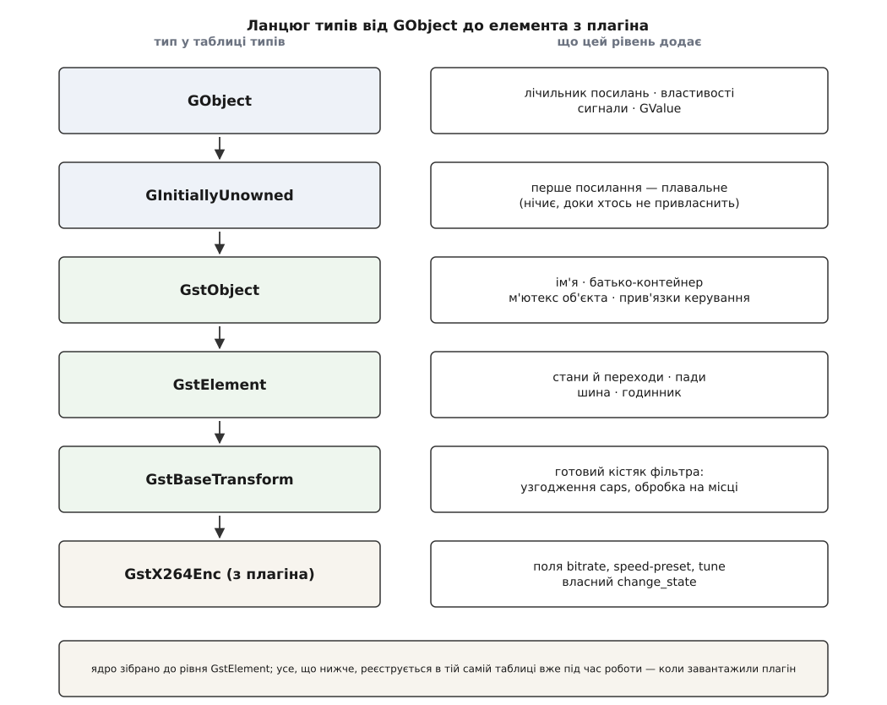
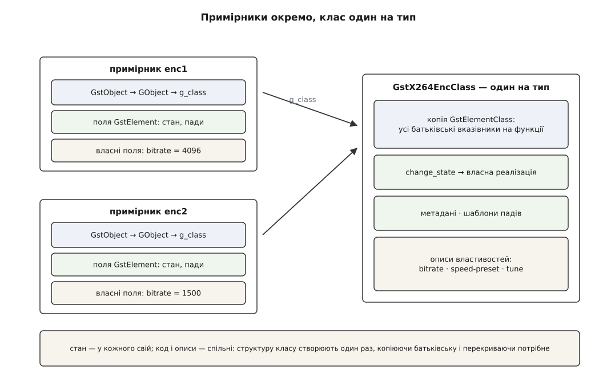
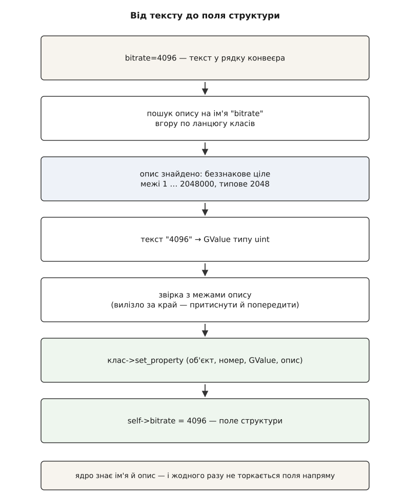
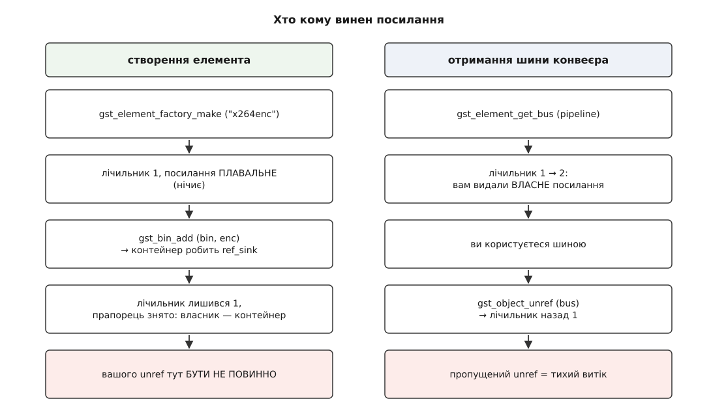

# GObject: об'єктна система, на якій стоїть GStreamer

<preknowlist>
- [Конвеєр: елементи, зв'язки й потік даних](topic:media-vision/pipeline-model) — що таке елемент і як із елементів складають конвеєр.
- [Спадкування](topic:programming/inheritance) — базовий і похідний тип, перевизначення поведінки в нащадку.
- [Таблиця віртуальних методів C++](topic:programming/virtual-dispatch-cpp) — як виклик через вказівник на функцію обирає реалізацію під час виконання.
- [Підрахунок посилань](topic:programming/reference-counting) — спільне володіння об'єктом через лічильник, звільнення на нулі.
- [Динамічне лінкування](topic:programming/dynamic-linking) — як бібліотека довантажується в процес під час роботи й що таке експортований символ.
</preknowlist>

Рядок `gst-launch-1.0 videotestsrc ! x264enc bitrate=4096 ! fakesink` виставляє швидкість потоку кодера. Дивина починається, щойно згадаєш, чим є `bitrate` насправді: полем у структурі `GstX264Enc`, яку оголошено у вихідному коді плагіна `libgstx264.so`. Ім'я поля живе тільки в тексті програми. Компілятор перетворює його на зсув у байтах від початку структури й забуває — у зібраному файлі немає ані рядка `"bitrate"`, ані запису про те, що це беззнакове ціле в межах від 1 до 2048000.

Додайте до цього, що ядро — `libgstreamer-1.0.so` — зібрано окремо й раніше, ніж цей плагін, і про його існування воно дізнається лише під час запуску, прочитавши [реєстр і завантаживши файл](topic:media-vision/plugin-model). Виходить, ядро мусить у чужій структурі, оголошення якої воно ніколи не бачило, знайти поле за іменем, поданим текстом; дізнатися його тип; перевірити межі; записати значення. Мовою C цього зробити не можна: у C немає жодного способу спитати структуру, які в неї поля.

Отже, під C підклали шар, який уміє. Він називається GObject і не належить GStreamer — це частина бібліотеки GLib, спільна для цілої родини проєктів. Але для GStreamer він не деталь реалізації, а форма: те, чим є елемент, як його налаштовують, як він сповіщає програму і коли його звільняють, визначає не GStreamer, а ця об'єктна система під ним.

## Чого саме потребує конвеєр

Перелічити «чого бракує C» абстрактно легко, але тут кожна потреба виростає з конкретної механіки конвеєра, і корисно бачити, з якої саме.

Почнімо з найпростішого. Конвеєр складається з елементів, які роблять зовсім різні речі: один читає файл, другий декодує H.264, третій малює у вікні. При цьому ядро переводить їх у стани, зв'язує пади, розсилає їм події — і робить це однаково для всіх. Отже, потрібен спільний тип «елемент» із набором операцій, які кожен реалізує по-своєму. Це звичайний поліморфізм, і в C його роблять руками: структура з вказівниками на функції. Проблема не в самій ідеї, а в тому, що ця таблиця має бути **спільною для ядра й плагіна**, зібраних окремо, — тобто її розкладка стає частиною двійкового інтерфейсу, і кожен плагін мусить якось отримати від ядра «заготовку» батьківської таблиці, щоб перекрити в ній лише те, що йому потрібно.

Далі — налаштування. Елемент має ручки: `location`, `bitrate`, `sync`, `latency`. Ставити їх доводиться не тільки з C-коду, а й із текстового рядка конвеєра, і з Python, і з файлу конфігурації. Це означає, що кожна ручка мусить мати **ім'я, тип і межі, доступні під час роботи програми** — інакше немає з чого перевіряти й нема куди писати.

Третя потреба — сповіщення в інший бік. Демультиплексор дізнається про наявність доріжок лише тоді, коли розбере заголовок контейнера, і аж тоді може створити вихідні пади. Програма мусить якось про це почути. Простий вказівник на функцію-обробник у структурі елемента тут не годиться: слухачів може бути кілька, підписуватися й відписуватися вони хочуть у довільний момент, а робити це має вміти й код на Python, у якого немає жодної C-функції, аби записати її адресу в поле.

Четверта — час життя. Один і той самий елемент одночасно тримають: контейнер, у який його додали; ваш код, що зберіг вказівник; внутрішня нитка, що саме зараз викликає його метод. Хто з них звільняє пам'ять — питання не стилю, а корупції купи.

І остання, найважча: усе це має працювати **через межу окремо зібраних файлів**, а описи ручок і сигналів мають бути придатні для читання чужими мовами, які про заголовки C нічого не знають.

Жодну з цих потреб не задовольняє мова. Кожну з них задовольняє система типів, що живе під час виконання — реєстр, у якому типи, їхні родоводи, їхні ручки та їхні сигнали описані **даними**, а не лише кодом. GObject — саме такий реєстр. Як він з'явився й чому GStreamer узяв готове замість власного винаходу — [історія об'єктної системи в C](topic:media-vision/gobject-basics/hist-gobject-birth.md): вона народилася всередині GTK як `GtkObject`, а окремою бібліотекою стала аж із виходом GTK+ 2.0 у березні 2002 року.

## GType: тип як запис у таблиці, зроблений під час роботи

Основа всього — число. Кожен тип отримує **GType**: ціле, що є ключем у глобальній таблиці типів процесу. Не рядок, не структура — саме число, бо порівнювати типи доводиться на кожному приведенні вказівника, і це має коштувати один такт.

За числом у таблиці лежить опис: ім'я типу рядком, GType батька, розмір структури примірника, розмір структури класу, вказівники на функції ініціалізації класу й примірника, перелік реалізованих інтерфейсів. Тип **реєструють викликом** — тобто це відбувається під час роботи програми, а не під час компіляції:

```c
GType
gst_my_filter_get_type (void)
{
  static gsize type = 0;
  if (g_once_init_enter (&type)) {
    GType t = g_type_register_static_simple (GST_TYPE_ELEMENT,
        "GstMyFilter",
        sizeof (GstMyFilterClass), (GClassInitFunc) gst_my_filter_class_init,
        sizeof (GstMyFilter),      (GInstanceInitFunc) gst_my_filter_init, 0);
    g_once_init_leave (&type, t);
  }
  return type;
}
```

Руками так майже ніхто не пише — це розгортає макрос `G_DEFINE_TYPE`, — але дивитися варто на розгорнуту форму, бо в ній видно суть. Тип **не існує**, поки цей код не виконали. Ідентифікатор типу — не константа, відома лінкувальнику, а значення, яке з'явиться колись під час роботи; тому в коді ви бачите не `GST_TYPE_MY_FILTER` як число, а макрос, що розкривається у виклик `gst_my_filter_get_type ()`.

Інакше й бути не могло. Плагін завантажують у процес, який уже працює, і його типи мусять з'явитися в тій самій таблиці, що й типи ядра, — з правильним посиланням на батьківський тип із ядра. Статична таблиця, зшита під час компіляції, цього не витримала б: ядро не знає наперед ані переліку плагінів, ані їхніх типів.

Родовід у таблиці зберігається не одним посиланням на батька, а **повним ланцюгом предків** у вигляді масиву. Тому перевірка «чи є цей об'єкт елементом» не ходить угору по ланцюгу, а звіряє один запис за глибиною — і теж коштує копійки. Це важливо, бо саме така перевірка стоїть у кожному макросі приведення типу.



*Кожен наступний рівень — окремо зареєстрований тип; конкретний елемент із плагіна доростає до вершини цього ланцюга вже під час роботи програми.*

## Дві структури: клас окремо, примірник окремо

Тепер до того, як тип виглядає в пам'яті. GObject розділяє об'єкт надвоє, і це розділення пояснює майже все інше.

**Структура класу** існує в одному екземплярі на тип. У ній лежить те, що однакове для всіх об'єктів цього типу: вказівники на віртуальні методи, метадані елемента, шаблони падів, перелік описів властивостей. **Структура примірника** існує на кожен об'єкт і містить його власний стан.

Обидві збудовані за одним правилом: **перше поле — структура батька цілком**, не вказівник на неї, а вбудована копія розкладки.

```c
struct _GstElement {
  GstObject     object;        /* батьківська структура — першим полем */

  GRecMutex     state_lock;
  GstState      current_state;
  GstState      pending_state;
  GList        *pads;
  ...
};

struct _GstElementClass {
  GstObjectClass parent_class; /* батьківський клас — першим полем */

  GstMetadata   *metadata;
  GList         *padtemplates;

  /* віртуальні методи */
  GstPad             * (*request_new_pad) (GstElement *e, GstPadTemplate *t,
                                           const gchar *name, const GstCaps *caps);
  GstStateChangeReturn (*change_state)    (GstElement *e, GstStateChange transition);
  gboolean             (*send_event)      (GstElement *e, GstEvent *event);
  ...
};
```

Стандарт C гарантує, що адреса структури збігається з адресою її першого поля. Отже, вказівник на `GstMyFilter` — це водночас дійсний вказівник на `GstElement`, на `GstObject` і на `GObject`: одна й та сама адреса, читана крізь різні «вікна». Ніякої магії, ніякого зсуву — усе спадкування тримається на цій одній властивості розкладки структур.

Зв'язок між двома половинами — одне поле. Найперше поле найпершої структури в ланцюгу (`GTypeInstance`) — це `g_class`, вказівник на структуру класу. Тому з будь-якого об'єкта можна дістати його клас, з класу — його GType, а з GType — усе, що записано в таблиці типів.



*Два елементи одного типу — це дві структури стану й один спільний клас; виклик віртуального методу йде через `g_class`, тому обидва об'єкти виконують той самий код.*

Найцікавіше — як клас **успадковує** реалізації. Структуру класу створюють один раз, ліниво, коли треба перший об'єкт цього типу. Створення відбувається у три кроки: виділити пам'ять розміром зі структуру класу нащадка; **скопіювати туди структуру батьківського класу цілком**; викликати `class_init` нащадка. Копіювання приносить усі батьківські вказівники на функції; `class_init` перезаписує ті з них, що нащадок робить по-своєму:

```c
static void
gst_my_filter_class_init (GstMyFilterClass * klass)
{
  GstElementClass *element_class = GST_ELEMENT_CLASS (klass);

  /* після копіювання тут лежить реалізація GstElement; замінюємо своєю */
  element_class->change_state = gst_my_filter_change_state;

  gst_element_class_set_static_metadata (element_class,
      "My filter", "Filter/Effect/Video", "Приклад", "Автор <a@example.org>");
}
```

Отже, «успадкований метод» — це буквально байти, скопійовані з батьківського класу. А виклик `parent_class->change_state (element, transition)` усередині власної реалізації — не мовна конструкція, а звертання до збереженої копії батьківського класу. Через це в GStreamer діє тверде правило: [перехід стану](topic:media-vision/states-lifecycle) майже завжди мусить дійти до батьківської реалізації, бо саме вона робить обов'язкову роботу `GstElement` — інакше пади не заведуть свої нитки, а конвеєр зависне на переході.

> 🔧 **Навіщо це.** Коли `gst-inspect-1.0` друкує рядок «Object Hierarchy» від `GObject` до вашого елемента, він друкує не документацію, а фактичний ланцюг, за яким зібрано структуру класу. Читаючи його, ви одразу бачите, звідки в елемента взялися властивості, яких ви не оголошували: `qos` і `sync` у нащадка `GstBaseSink`, `num-buffers` у нащадка `GstBaseSrc`. Шукати їх треба в документації базового класу, а не конкретного елемента — у самому елементі їх немає.

## Властивість — не поле, а описаний доступ

Тепер повернімося до `bitrate=4096` і закриємо початкову загадку.

Ручка елемента — не поле структури, а **властивість**: пара «прочитати/записати» плюс окремий об'єкт-опис, який зветься `GParamSpec`. Опис містить ім'я, короткий і довгий людський текст, тип значення, найменше й найбільше допустимі значення, значення за замовчуванням і прапорці. Створюють його в `class_init` і кладуть у клас:

```c
g_object_class_install_property (gobject_class, PROP_BITRATE,
    g_param_spec_uint ("bitrate", "Bitrate", "Bitrate in kbit/sec",
        1, 2048000, 2048,
        G_PARAM_READWRITE | G_PARAM_STATIC_STRINGS |
        GST_PARAM_MUTABLE_PLAYING));
```

Із цього моменту в таблиці типів **є дані про поле**, яких у C бути не могло. Саме їх читає `gst-inspect-1.0`, і його вивід — просто надрукований опис:

```
  bitrate             : Bitrate in kbit/sec
                        flags: readable, writable, changeable in NULL, READY,
                               PAUSED or PLAYING state
                        Unsigned Integer. Range: 1 - 2048000 Default: 2048
```

Доступ до самого поля йде через **дві функції на весь клас**, а не через функцію на кожну властивість:

```c
static void
gst_x264_enc_set_property (GObject * object, guint prop_id,
    const GValue * value, GParamSpec * pspec)
{
  GstX264Enc *self = GST_X264_ENC (object);

  switch (prop_id) {
    case PROP_BITRATE:
      self->bitrate = g_value_get_uint (value);
      break;
    default:
      G_OBJECT_WARN_INVALID_PROPERTY_ID (object, prop_id, pspec);
      break;
  }
}
```

Одна функція для властивостей різних типів потребує **універсального контейнера для значення** — інакше її сигнатуру не написати. Це `GValue`: структура з полем GType і об'єднанням для самого значення. Вона й дає ту саму динамічну типізацію, якої в C немає: значення завжди подорожує разом зі своїм типом, тому його можна перевірити, надрукувати чи перетворити, не знаючи наперед, що там.

Тепер увесь шлях від тексту до поля видно повністю. Парсер рядка конвеєра бачить `bitrate=4096`. Він бере клас елемента й шукає в ньому опис на ім'я `"bitrate"` — пошук іде вгору по ланцюгу класів, тому властивість базового класу знайдеться так само. З опису він дізнається тип — беззнакове ціле — і перетворює текст `"4096"` на `GValue` цього типу. Далі GObject звіряє значення з межами опису (вийшло за край — притисне до межі й попередить), кладе його у `GValue` і викликає `set_property` класу з номером властивості. Аж там значення потрапляє в поле структури.



*Ядро жодного разу не звертається до поля напряму — воно оперує лише іменем, описом і типізованим значенням, тому працює з елементом, чиїх заголовків ніколи не бачило.*

Прапорці в описі заслуговують окремої уваги, бо GStreamer додав до них свої. GObject знає `READABLE`, `WRITABLE`, `CONSTRUCT_ONLY` — тобто чи можна читати, писати й чи лише при створенні. Цього мало для конвеєра, який працює: питання не тільки «чи можна писати», а **«коли можна писати»**, бо частина ручок бере участь в узгодженні формату й після старту потоку не міняється безпечно. Тому GStreamer завів власні прапорці у відведених для розширення бітах: `GST_PARAM_MUTABLE_READY`, `GST_PARAM_MUTABLE_PAUSED`, `GST_PARAM_MUTABLE_PLAYING` — до якого стану включно властивість можна міняти на ходу — і `GST_PARAM_CONTROLLABLE` — чи має сенс керувати нею як кривою в часі. Саме ці прапорці друкує рядок «changeable in…» у виводі вище.

> 🔧 **Навіщо це.** Правило «читай рядок flags, перш ніж писати властивість на ходу» рятує від халепи, яку важко зловити. Властивість без `MUTABLE_PLAYING` міняють із вашої нитки, поки [нитка потоку](topic:media-vision/threads-and-queues) саме обробляє кадр за старим значенням; результат — від тихого ігнорування зміни до запису пікселів у буфер невідповідного розміру. Якщо прапорця немає, ручку міняють, опустивши елемент у нижчий стан, або ставлять елемент, який робить це коректно.

Опис властивості потрібен ще для однієї речі — сповіщення про зміну. Коли значення міняється, GObject випускає сигнал `notify` із деталлю на ім'я властивості, тож `"notify::bitrate"` дає підписку саме на цю ручку. А це вже наступний механізм.

## Сигнали: підписка замість вказівника на функцію

Демультиплексор створює вихідні пади лише тоді, коли розбере заголовок, — а це вже під час роботи конвеєра. Комусь треба про це сказати. Механізм для таких сповіщень — **сигнали**, і вони теж описані даними в таблиці типів, а не полем у структурі.

Сигнал оголошують у `class_init`, і опис включає ім'я, тип, до якого він належить, тип поверненого значення й типи аргументів:

```c
gst_element_signals[SIGNAL_PAD_ADDED] =
    g_signal_new ("pad-added", G_TYPE_FROM_CLASS (klass),
        G_SIGNAL_RUN_LAST, G_STRUCT_OFFSET (GstElementClass, pad_added),
        NULL, NULL, NULL,
        G_TYPE_NONE, 1, GST_TYPE_PAD);
```

Підписка виглядає буденно — `g_signal_connect (demux, "pad-added", G_CALLBACK (on_pad_added), user_data)`, — але робить те, чого вказівник на функцію не дає. Обробників можна почепити скільки завгодно, і кожен зі своїми даними; знятий обробник більше не викликається; підписатися можна з мови, у якої немає C-функції, бо прив'язка підставить свою перехідну.

Механіка виклику варта одного абзацу, бо пояснює вартість. Аргументи сигналу передають масивом `GValue` — інакше система, яка не знає сигнатури наперед, не змогла б їх ані перевірити, ані передати чужій мові. Перетворення цього масиву на звичайний C-виклик робить окрема функція-перекладач, **маршалер** (англ. *marshal* — «шикувати, впорядковувати»). Коли маршалер не вказано, GObject бере універсальний, що збирає виклик на льоту за описом типів. Це працює для будь-якої сигнатури — і коштує помітно більше за прямий виклик.

Звідси випливає практичне правило GStreamer. Сигнал — механізм для подій, які трапляються рідко: з'явився пад, змінився стан, надійшло повідомлення. На гарячому шляху, де подія — кожен кадр, сигнали не використовують. Тому в `appsink` властивість `emit-signals` типово вимкнено, а замість підписки радять ставити структуру зі зворотними викликами: [міст між конвеєром і власним кодом](topic:media-vision/appsink-appsrc) віддає кадри прямим викликом функції, і різниця на тридцяти кадрах за секунду вже видима.

Друга особливість — нитка. Обробник сигналу виконується **синхронно, у тій самій нитці, що випустила сигнал**: емісія — це просто виклик усіх під'єднаних функцій одна за одною. Для `pad-added` це означає, що ваш код виконується в нитці, яка саме розбирає потік, і поки він працює, розбір стоїть. Саме тому GStreamer не доставляє помилки й кінець потоку сигналами: для них є [шина повідомлень](topic:media-vision/bus-and-messages), яка перекладає повідомлення в нитку головного циклу програми. Сигнал і шина — не два стилі того самого, а два різні контракти щодо ниток.

Окремий різновид — **сигнали-дії**: сигнал, підписуватися на який не треба, бо він не сповіщає, а виконує. `g_signal_emit_by_name (appsrc, "push-buffer", buf, &ret)` виглядає як подія, а насправді є викликом методу. Такий обхідний шлях існує заради прив'язок: метод, оголошений як сигнал, автоматично видно в Python і Rust, тимчасом як звичайна C-функція `gst_app_src_push_buffer` потребувала б окремої роботи в кожній прив'язці.

Конкретні сигнатури, прапорці, деталі та правила володіння аргументами зібрано окремо — [поверхня GObject, з якою працюють у GStreamer](topic:media-vision/gobject-basics/api-gobject-surface.md).

## Час життя: лічильник і плавальне посилання

Елемент одночасно тримають контейнер, ваш код і внутрішні нитки. GObject розв'язує це найпростішим із надійних способів — **лічильником посилань**: `g_object_ref` збільшує, `g_object_unref` зменшує, на нулі об'єкт розбирають і звільняють. GStreamer дає ті самі дії під своїми іменами, `gst_object_ref` і `gst_object_unref`, — вони роблять те саме плюс перевірку типу.

Але поверх лічильника є другий механізм, який плутає майже кожного, хто починає, — **плавальне посилання** (англ. *floating reference*).

Проблема, з якої воно виросло, суто практична. Свіжостворений об'єкт має лічильник 1. Ви додаєте його в контейнер — контейнер, як власник, теж мусить узяти посилання, і лічильник стає 2. Але вам сам об'єкт більше не потрібен, тож ви маєте віддати своє. Отже, кожне створення в C виглядало б як три рядки замість двох, і забутий третій рядок означав би витік у геть звичайному коді.

Розв'язок: перше посилання позначають прапорцем «плавальне» — тобто нічиє. Хто перший захоче стати власником, викликає `gst_object_ref_sink`: якщо посилання плавальне, він просто знімає прапорець і **привласнює** його, не збільшуючи лічильника; якщо не плавальне — бере звичайне нове посилання. Так контейнер, приймаючи об'єкт, або підбирає нічийне посилання, або чесно бере своє, і в обох випадках баланс сходиться.

```c
GstElement *enc = gst_element_factory_make ("x264enc", NULL);
/* лічильник 1, посилання плавальне — нічиє */

gst_bin_add (GST_BIN (pipeline), enc);
/* контейнер зробив ref_sink: лічильник 1, власник — конвеєр */

/* власного посилання ви не брали — unref тут БУДЕ помилкою */
```



*Дві різні угоди в одному API: одні виклики забирають ваше посилання, інші видають нове — і саме на цій межі виникають майже всі витоки та подвійні звільнення.*

Симетричний випадок — виклики, що **віддають** посилання. `gst_element_get_bus` не позичає шину, а повертає нове посилання, яке ви зобов'язані звільнити; те саме роблять `gst_element_get_static_pad`, `gst_bin_get_by_name`, `gst_pad_get_current_caps`. Пропущений `gst_object_unref` тут не падає й не псує даних — він просто не дає звільнити конвеєр. У програмі, що перезапускає конвеєр сотні разів, це виглядає як повільне зростання пам'яті без жодного видимого винуватця.

Правило, що покриває обидва випадки, коротке: дивіться в документації на позначку передавання. `transfer full` — посилання ваше, ви його віддаєте `unref`. `transfer none` — вам його позичили, чіпати не можна. `transfer floating` — воно нічиє, і перший, хто додасть об'єкт у контейнер, стане його власником. Ці позначки — не коментарі для людей, а машинні анотації, які читає генератор прив'язок; звідси й береться коректне керування пам'яттю в Python і Rust.

## GstObject поверх GObject — і виняток, що обходить його стороною

GStreamer не використовує GObject голим. Між ним і елементом стоїть власний шар — **GstObject**, і в ньому лежить те, що потрібне всім речам у конвеєрі, а не тільки елементам.

Це ім'я об'єкта (звідси `videotestsrc0` у повідомленнях і в графах налагодження), вказівник на батька — контейнер, до якого річ належить, — власний м'ютекс на об'єкт і прив'язки керування, якими значення властивості можна вести кривою в часі. Родовід тут такий: `GObject` → `GInitiallyUnowned` → `GstObject` → `GstElement`. Середня ланка — це і є той тип GLib, чиї примірники народжуються з плавальним посиланням; GStreamer у версії 1.0 перевів `GstObject` на нього замість власної реалізації тієї самої ідеї, що жила в гілці 0.10.

А тепер найважливіше про межі цієї конструкції: **буфер із кадром не є GObject**.

Причина — ціна. Об'єкт GObject несе на собі вказівник на клас, таблицю даних, механізм властивостей із пошуком за іменем, механізм сигналів і перевірки типів на кожному приведенні. Створення й знищення такого об'єкта коштує сотні тактів. Тепер помножте це на потік 1080p60, де за секунду народжується й гине шістдесят буферів, кожен зі своїми метаданими, а поруч ходять події й caps. Об'єктна система, чудова для десятка елементів, які живуть годинами, стала б головним споживачем процесора для мільйонів короткоживучих речей.

Тому для них у GStreamer є окремий, навмисно бідний тип — **GstMiniObject**. У ньому є лічильник посилань, тип, функції копіювання й звільнення — і більше нічого: ні властивостей, ні сигналів, ні батька, ні імені. На ньому збудовано `GstBuffer`, `GstCaps`, `GstEvent`, `GstQuery`, `GstSample`. Бідність дає ще одну властивість, яку в GObject було б важко зробити: із лічильника прямо виводиться право на запис — буфер можна міняти на місці лише тоді, коли посилання на нього єдине, а інакше його спершу копіюють. Саме на цьому тримається [передача кадру без копіювання](topic:media-vision/buffers-and-memory).

Тип у міні-об'єкта все-таки є — його реєструють у тій самій таблиці типів як тип-коробку, щоб буфер міг подорожувати всередині `GValue` і бути видимим із прив'язок. Але це реєстрація заради сумісності, а не участь в об'єктній системі.

Отже, лінія проходить рівно там, де змінюється частота подій: **усе, що живе довго й має ручки, — GObject; усе, що народжується на кожен кадр, — міні-об'єкт**. Плутанина між цими двома світами дає найтиповішу помилку новачка в C: `g_object_unref (buffer)` замість `gst_buffer_unref (buffer)` — виклик, який мовчки псує чужу пам'ять, бо в буфері немає ані вказівника на клас, ані лічильника там, де їх шукає GObject.

## Опис, що годує все інше

Лишилося замкнути коло. Ми почали з того, що ядро мусить працювати з кодом, якого не бачило. Тепер видно, що воно й не працює з кодом — воно працює з **описом**: типом у таблиці, ланцюгом предків, переліком описів властивостей, переліком сигналів, шаблонами падів. Код за цим описом викликається вже опосередковано.

Цей опис читається програмно, а не лише очима. Клас віддає перелік своїх властивостей, таблиця типів — перелік сигналів типу, і з цього будується будь-який інспектор елементів. `gst-inspect-1.0` — саме така програма, і в ній немає жодного знання про конкретні елементи; те саме вміє зробити ваша програма на півтори сотні рядків — [власний інспектор елемента](topic:media-vision/gobject-basics/proj-inspect-element.md), який перелічує ручки, межі й сигнали будь-якого елемента в системі. Тому в GStreamer головна документація елемента — не сторінка в мережі, а вивід інспектора на тій машині, де стоїть саме ваша збірка з саме тими версіями плагінів.

Той самий опис виходить і за межі процесу. Сканер читає заголовки й анотації передавання з коду C та складає з них машинний опис бібліотеки, з якого прив'язки до інших мов будуються **без ручної роботи**: Python бачить властивості як атрибути, сигнали — як підписки, а позначки `transfer` перетворюються на правильні `ref`/`unref` під капотом. Цю техніку — [виклик рідного коду з іншої мови](topic:programming/foreign-function-interface) — у світі GLib оформили як окремий проєкт у 2008 році, і саме завдяки їй код на Python, Rust чи Vala розмовляє з GStreamer тими самими поняттями, що й C: `element.set_property("bitrate", 4096)` — це той самий пошук опису й та сама перевірка меж, що й у розібраному вище шляху.

Ось у чому справжня угода. GStreamer заплатив за GObject багатослівністю C-коду, зайвими тактами на кожній перевірці типу й окремою бідною системою для того, що ходить на кожному кадрі. Купив він за це одну властивість, без якої конвеєра просто не було б: **бібліотека описує себе сама**, тому ядро керує елементами, про які нічого не знало, коли його збирали, а програма будує конвеєр із рядка тексту, отриманого з файлу конфігурації в день запуску.
