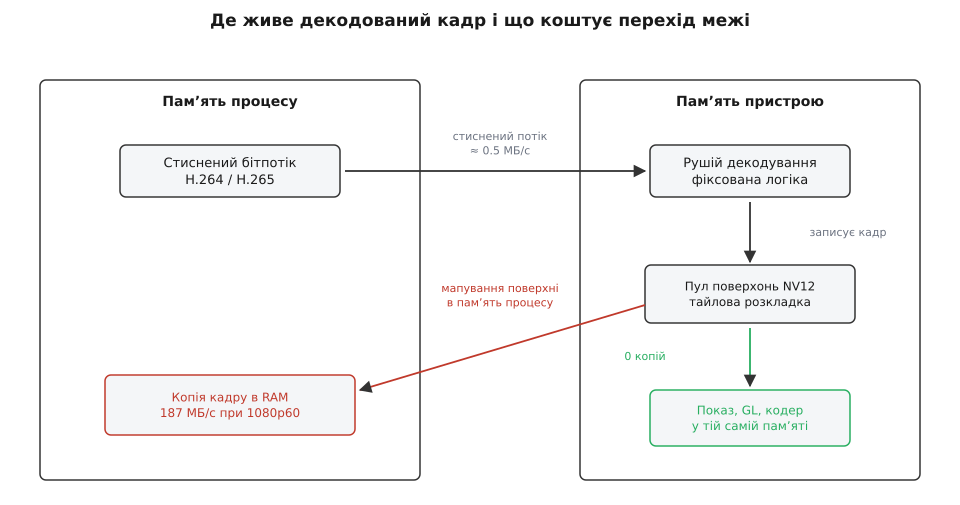
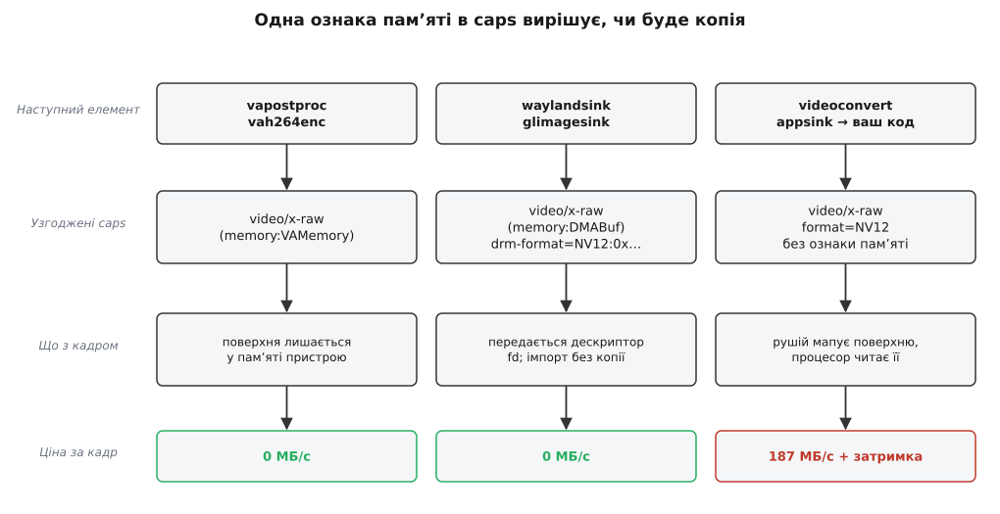
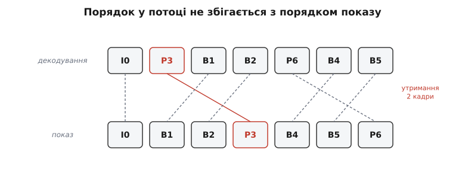

# Апаратне декодування: VA-API, NVDEC, V4L2, MediaCodec

<preknowlist>
- [Конвеєр: елементи, зв'язки й потік даних](book:media-vision/pipeline-model) — що таке елемент, як буфери течуть від джерела до споживача.
- [Узгодження caps](book:media-vision/caps-negotiation) — як сусідні елементи домовляються про формат, перш ніж піде хоч один кадр.
- [Буфери й пам'ять](book:media-vision/buffers-and-memory) — буфер як набір шматків пам'яті, пул буферів, хто буфером володіє.
- [H.264: NAL-одиниці, SPS/PPS і ключові кадри](book:algorithms/h264-nal-structure) — з чого складається бітпотік і де в ньому лежать параметри послідовності.
- [Міжкадрове стиснення](book:algorithms/inter-frame) — опорні кадри, P- і B-кадри, чому декодер мусить тримати попередні картинки.
- [Формати пікселів і буферів зображення](book:algorithms/pixel-formats) — NV12, площини яскравості й кольору, крок рядка.
- [Ядро й простір користувача](book:unix-linux/kernel-and-userspace) — межа привілеїв і системний виклик як єдиний прохід крізь неї.
- [DMA і відображення буферів у ядрі](book:unix-linux/dma-and-buffers) — пристрій пише в пам'ять сам, повз процесор.
</preknowlist>

Порахуймо, що взагалі відбувається під час декодування відео. Кадр 1920×1080 у форматі NV12 — це площина яскравості на 1920·1080 байтів плюс удвічі менша площина кольору:

```
розмір кадру = 1920 · 1080 · 1.5 = 3 110 400 Б ≈ 3.11 МБ
при 60 к/с   = 3.11 · 60         ≈ 187 МБ/с
```

Це лише **запис** готового кадру — жодних обчислень. А обчислення теж є, і чималі: для кожного блоку 16×16 треба взяти опорний блок із раніше декодованого кадру, зсунути його з точністю до чверті пікселя (напівпіксельні позиції рахує шестивідвідний фільтр, чвертні — усереднення сусідніх), додати обернене перетворення залишку, а потім пройтися деблокувальним фільтром по всіх межах 4×4. Кожен із цих кроків читає й пише пам'ять. Потік читань з опорних кадрів того самого порядку, що й запис: разом виходить близько чотирьохсот мегабайтів на секунду безперервного трафіку лише для одного потоку 1080p60.

Універсальне ядро процесора вміє це робити — але робить дорого: кожна операція проходить через вибірку інструкції, кеш і планувальник, а фільтр, який у кремнії коштує кілька вентилів, у коді коштує десяток тактів. Тому в кожному сучасному чипі — від телефона до серверної відеокарти — стоїть окремий блок фіксованої логіки, який уміє рівно одне: розбирати бітпотік знайомого стандарту і викладати з нього кадри. У книжці про залізо цей блок розібраний окремо — [апаратний кодек H.264](book:communications/h264-hardware-codec) описує, з яких ступенів він складається і чому кожен з них зроблений саме так.

Але сам кремній тут не головне. Головний його наслідок для конвеєра такий: **декодований кадр народжується не там, де живе ваша програма**, — і вся будова елементів апаратного декодування в GStreamer випливає з цього одного факту.

## Кадр народжується поза вашою пам'яттю

Рушій декодування — самостійний пристрій на шині. Він має власний доступ до пам'яті і власне уявлення про те, як ця пам'ять розкладена. Коли він завершує кадр, кадр лежить у ділянці, яку процесор або взагалі не бачить у своєму адресному просторі, або бачить через відображення, читання з якого коштує так дорого, що дешевше було б декодувати програмно.

Тому апаратний декодер віддає не масив пікселів, а **посилання** на кадр: числовий ідентифікатор поверхні (VA-API), покажчик у пам'яті пристрою (NVDEC), індекс буфера в черзі драйвера (V4L2), непрозорий об'єкт системної служби (MediaCodec). Спільне в усіх чотирьох — назва посилається на щось, чого у вашому процесі немає.



*Усередину межу перетинає тонкий струмок стисненого потоку, назовні — товстий потік готових кадрів. Тому вигідно, щоб кадр межі взагалі не перетинав.*

Ця асиметрія — головний важіль. Стиснений потік 1080p при розумній якості — це десь 4–8 Мбіт/с, тобто менш ніж мегабайт на секунду; переслати його в пристрій нічого не коштує. Готові кадри — 187 МБ/с в один бік. Якщо конвеєр збудований так, що кадр повертається в пам'ять процесу тільки щоб піти назад у пристрій на показ, ви заплатили за перетин межі двічі й не отримали нічого.

> 🔧 **Навіщо це.** Коли на восьмиядерному ноутбуці «апаратно прискорений» конвеєр з'їдає ядро процесора цілком, декодування тут ні до чого: цей час іде на копіювання кадрів туди-сюди. Шукати треба не швидший декодер, а місце, де кадр вивалюється в пам'ять процесу.

## Чотири API — дві осі, а не чотири світи

На перший погляд VA-API, NVDEC, V4L2 і MediaCodec — чотири незіставні світи. Насправді вони розкладаються по двох питаннях, і відповіді на ці питання визначають усе інше.

**Питання перше: хто розбирає бітпотік.** Декодування ділиться на дві дуже різні роботи. Перша — синтаксичний розбір: прочитати заголовки, ентропійно розкодувати коефіцієнти, зрозуміти, які кадри опорні. Друга — власне відновлення пікселів: компенсація руху, обернене перетворення, деблокування. Друга робота регулярна й ідеально лягає в кремній. Перша — послідовна, з розгалуженнями, і в кремнії дорога.

Ранні рушії робили обидві роботи самі: їм віддавали потік байтів, вони віддавали кадри. Такий інтерфейс називають **stateful** — пристрій сам тримає стан послідовності, сам знає, які кадри опорні, сам вирішує, коли можна віддати наступний. Пізніші рушії (особливо мобільні) звузили себе до другої роботи: розбір потоку виносять у програму, а пристроєві на кожен кадр подають уже готову структуру параметрів — таблиці квантування, список опорних поверхонь, зсуви зрізів. Це **stateless**-інтерфейс.

**Питання друге: чим представлено вихід.** Або непрозорим дескриптором усередині однієї підсистеми (тоді передати кадр кудись іще можна тільки через цю ж підсистему), або файловим дескриптором спільного буфера, який розуміє все ядро, або взагалі об'єктом іншого процесу.

**VA-API** — інтерфейс, який Intel почав проєктувати 2007 року (перший чорновик Джонатан Біан написав ще в грудні 2006-го, перший випуск — 2008-й) як заміну обмеженому XvMC і як unix-відповідник DirectX Video Acceleration. Він stateful за духом, але параметризований: програма подає структури `VAPictureParameterBuffer`, `VASliceParameterBuffer` і сирі байти зрізів, тобто розбір заголовків усе ж лежить на боці програми, а ентропійне декодування — на пристрої. Вихід — `VASurfaceID`, ідентифікатор поверхні в контексті драйвера. Реалізація драйвера окрема від інтерфейсу: `iHD` для Intel, `radeonsi` для AMD через Mesa, є навіть шар над NVIDIA. Це і є причина довголіття VA-API: інтерфейс один, драйверів багато.

**NVDEC** — назва самого блоку в чипах NVIDIA; програмний доступ до нього дає NVDECODE API з Video Codec SDK. Тут stateful-модель у найчистішому вигляді: ви віддаєте байти потоку, отримуєте зворотний виклик на готовий кадр, а кадр лежить у пам'яті CUDA. Через це NVDEC природно зчіплюється з обчисленнями на тій самій відеокарті й неприродно — з усім іншим. На Tegra (Jetson) NVIDIA пішла іншим шляхом: там той самий блок виставлений як драйвер V4L2, а кадри живуть у власному типі пам'яті NVMM.

**V4L2** тут — не «інтерфейс вебкамери», а модель **пам'ять-у-пам'ять**. Сама підсистема [V4L2 в ядрі Linux](book:unix-linux/v4l2-video-devices) — це загальний спосіб описати будь-який відеопристрій вузлом `/dev/videoN` з чергами буферів і набором керуючих викликів; декодер — окремий різновид такого пристрою, який нічого не знімає, а лише перетворює. Драйвер відкриває дві черги буферів, `OUTPUT` (звідти пристрій читає — тобто туди ви кладете стиснений потік) і `CAPTURE` (туди пристрій пише готові кадри). Назви здаються переставленими, поки не згадати, що вони дані з погляду пристрою. Ядро Linux описує два різні профілі такого декодера: **stateful**, де прошивка сама розбирає потік і сама повідомляє про зміну формату подією, і **stateless**, де програма розбирає потік і подає параметри кадру через механізм запитів (Request API), а драйвер лише запускає кремній. Другий профіль зробили саме для дешевих SoC, чиї рушії не мають прошивки-парсера. Оскільки на цьому боці межі живе драйвер ядра, кадр природно представлений як буфер, який легко перетворити на спільний дескриптор.

**MediaCodec** — інтерфейс Android, і головна його особливість не в моделі декодування, а в тому, що декодер працює в **іншому процесі**. Ваша програма спілкується з ним через прив'язку, а буфери або мапляться у вашу пам'ять (тоді за це платите), або взагалі не мапляться: ви створюєте `Surface`, і декодер пише кадри прямо в чергу композитора, а ви їх ніколи не бачите. Другий режим швидкий, але й обмежувальний — кадр, який ви не бачите, ви не можете обробити.

Історія того, чому в Unix-світі замість одного інтерфейсу склалося кілька конкурентних, — окремий сюжет: [як Linux отримав чотири API замість одного](book:media-vision/hardware-decode-elements/hist-acceleration-apis.md) розповідає про XvMC, VDPAU, XvBA, про те, хто кого мав заміняти і чому жоден не переміг остаточно. Конкретний контракт V4L2-декодера — послідовність викликів, узгодження форматів на двох чергах, подія зміни роздільності — розписаний у [довіднику з інтерфейсу V4L2 mem2mem](book:media-vision/hardware-decode-elements/api-v4l2-m2m.md).

### Як це виглядає в конвеєрі

GStreamer ховає всі чотири за елементами з однаковою поведінкою, але з різних плагінів:

| платформа | плагін | елемент для H.264 | тип пам'яті на виході |
|---|---|---|---|
| Intel/AMD, Linux | `va` | `vah264dec` | `memory:VAMemory`, `memory:DMABuf` |
| NVIDIA, десктоп | `nvcodec` | `nvh264dec` | `memory:CUDAMemory` |
| SoC, stateful | `video4linux2` | `v4l2h264dec` | `memory:DMABuf` |
| SoC, stateless | `v4l2codecs` | `v4l2slh264dec` | `memory:DMABuf` |
| Android | `androidmedia` | `amcviddec-*` | залежить від режиму |
| Jetson | `nvvideo4linux2` | `nvv4l2decoder` | `memory:NVMM` |

Кілька дрібниць, які варто знати наперед. Ім'я елемента Android невідоме заздалегідь: плагін читає `/etc/media_codecs.xml` пристрою і породжує фабрики за іменами кодеків цього конкретного телефона, тому в конвеєрі жорстко прописати `amcviddec-…` не вийде. Старіший плагін `vaapi` (`vaapih264dec`) і новіший `va` (`vah264dec`) — це дві незалежні реалізації того самого VA-API; змішувати їхні елементи в одному конвеєрі не можна, бо вони по-різному тримають дисплей і пул поверхонь. І stateless-елементи `v4l2codecs` збудовані на спільній бібліотеці `libgstcodecs`, яка тримає стан H.264, H.265, VP8 і VP9 у просторі користувача — та сама бібліотека обслуговує кілька різних бекендів, бо розбір потоку від заліза не залежить.

## Ознака пам'яті в caps — як конвеєр дізнається, що кадр чужий

Конвеєр домовляється про формат через caps — але `video/x-raw, format=NV12, width=1920` описує лише **що** в кадрі, а не **де** він лежить. Двом сусіднім елементам цього замало: один віддає ідентифікатор поверхні VA, другий чекає масив байтів, і на цьому все стало б.

Розв'язок — **ознака пам'яті** (`GstCapsFeatures`): дужковий додаток до назви типу, який каже, у якому представленні прийде буфер.

```
video/x-raw(memory:VAMemory)   поверхня VA, процесор її не бачить
video/x-raw(memory:DMABuf)     файловий дескриптор спільного буфера ядра
video/x-raw(memory:GLMemory)   текстура в контексті GL
video/x-raw                    звичайні байти в пам'яті процесу
```

Найцікавіша з них — друга. [Спільний буфер ядра (DMA-BUF)](book:unix-linux/dma-buf) — це механізм, яким одна підсистема ядра віддає іншій володіння шматком пам'яті пристрою у вигляді звичайного файлового дескриптора: його можна передати іншому процесу, імпортувати в графічний драйвер, віддати кодерові. Саме він робить можливим ланцюг «декодер → композитор» без єдиної копії, і саме тому `memory:DMABuf` стоїть у списку раніше за простий `video/x-raw`.

Ознака — повноцінна частина caps, і саме тому вона бере участь у звичайному узгодженні. Декодер виставляє на своєму виході **впорядкований список**: спершу найдешевший для себе варіант, останнім — простий `video/x-raw`. Далі спрацьовує звичайна механіка: сусід перетинає цей список зі своїми можливостями, і перемагає перший спільний варіант.



*Один і той самий декодер поводиться по-різному залежно від того, хто стоїть за ним: сусід, який розуміє чужу пам'ять, дістає кадр даром; сусід, який не розуміє, змушує рушій витягти кадр у пам'ять процесу.*

Це пояснює найчастішу несподіванку. Ви ставите `vah264dec`, бачите в журналі, що елемент справді підключився, — а завантаження процесора не падає. Причина в тому, що далі стоїть `videoconvert` або `appsink`, які про `memory:VAMemory` нічого не знають. Узгодження чесно спускається до останнього спільного варіанта — простого `video/x-raw`, — і декодер зобов'язується перед кожним кадром відобразити поверхню в пам'ять процесу. Технічно він викликає `vaDeriveImage` або копіює через `vaGetImage`; практично це ті самі 187 МБ/с, тільки читаних із пам'яті, яка часто не кешується процесором. Апаратний декодер працює, прискорення немає.

Тому правило звучить так: **апаратне декодування має сенс рівно доти, доки весь ланцюг за декодером говорить тією ж мовою пам'яті**. `vah264dec ! vapostproc ! vah265enc` — кадр не покидає пристрій жодного разу. `vah264dec ! videoconvert ! autovideosink` — покидає й повертається.

## NV12 — це ще не розкладка

Є пастка на рівень глибша. Припустимо, обидва сусіди домовилися на `memory:DMABuf`, дескриптор передано без копії, споживач імпортував його як текстуру — і на екрані сміття або смуги.

Причина в тому, що `format=NV12` описує **семантику** — дві площини, одна яскравість, друга — почергові компоненти кольору вдвічі рідше по обох осях. Про фізичну розкладку байтів у пам'яті це не каже майже нічого. Рушій декодування рідко пише лінійно: він працює блоками, тому вигідно класти сусідні блоки поруч (тайлова розкладка), а часто ще й стискати вміст без втрат, щоб зекономити трафік шини. Той самий NV12 у пам'яті Intel, AMD і Mali розкладений трьома різними способами.

У світі DRM цю розкладку описують **модифікатором** — 64-бітним числом, у якому закодовано виробника й конкретну схему. GStreamer починаючи з 1.24 узгоджує модифікатор явно: з'явився формат-заглушка `DMA_DRM` і окреме поле caps, у якому колірний формат і модифікатор ідуть парою.

```
video/x-raw(memory:DMABuf), format=DMA_DRM,
    drm-format=NV12:0x0100000000000002, width=1920, height=1080
```

До цього обидві сторони мовчазно припускали лінійну розкладку — і на деяких зв'язках воно роками ламалося тихо й незрозуміло. Тепер несумісні розкладки не узгоджуються взагалі: конвеєр або знаходить спільний модифікатор, або чесно падає в лінійний варіант із копією.

> 🔧 **Навіщо це.** Якщо ви віддаєте кадр у власний код через дескриптор і збираєтеся читати пікселі самі — обов'язково перевірте модифікатор. Тайлова поверхня, прочитана як лінійна, дає характерну картинку з переплутаними квадратами; це не збій декодера, це ваше хибне припущення про пам'ять.

## Пул поверхонь: чому декодер завмирає

Апаратний декодер не може виділяти пам'ять на кожен кадр: поверхні мусять бути фізично неперервні, вирівняні під вимоги рушія, а часто ще й зареєстровані в його таблицях. Тому він виділяє **пул** фіксованого розміру на старті й далі крутить кадри по колу.

Розмір пулу диктує стандарт. H.264 вимагає тримати в буфері декодованих картинок стільки кадрів, скільки може знадобитися як опорні; стеля залежить від рівня потоку. Для рівня 4.0 таблиця стандарту дає `MaxDpbMbs = 32768`, а кадр 1920×1080 — це `120 × 68 = 8160` макроблоків:

```
MaxDpbFrames = min(32768 / 8160, 16)
             = min(4.01, 16)
             = 4 кадри
```

Отже, чотири поверхні пул мусить тримати тільки для опорних кадрів. Плюс поверхня, у яку зараз пишеться поточний. Плюс ті, що вже віддані далі й ще не повернулися. Декодер додає запас, але запас скінченний — типово одиниці кадрів.

Звідси випливає механіка, від якої найчастіше «зависає» конвеєр із апаратним декодером. Поверхня повертається в пул лише тоді, коли **останній** охочий відпустив буфер. Якщо за декодером стоїть `queue` на 200 буферів, вона спокійно набере в себе всі поверхні пулу, декодер не знайде вільної й **зупиниться**. Ззовні це виглядає як зупинка на десятому-двадцятому кадрі без жодного повідомлення про помилку. Те саме дає `appsink`, з якого ваш код забирає кадри повільніше, ніж вони приходять, і тримає посилання на кілька останніх.

Лікування пряме й випливає з причини:

```
... ! vah264dec ! queue max-size-buffers=2 max-size-bytes=0 max-size-time=0 \
    ! appsink max-buffers=2 drop=true sync=false
```

Черга обмежена двома буферами — вона фізично не може виїсти пул. `appsink` з `drop=true` викидає старий кадр замість того, щоб чекати; для живого відео це правильний обмін, бо кадр, який ви не встигли обробити, вже застарів. І будь-яке посилання на буфер, яке ваш код тримає «про запас», треба відпускати одразу після використання — інакше ви тримаєте не копію картинки, а дефіцитний ресурс пристрою.

## Три джерела затримки

Затримку апаратного декодера люблять називати одним числом, але вона складається з трьох різних доданків із різними причинами й різними важелями.

**Перший доданок — перевпорядкування, і він взагалі не від заліза.** Якщо в потоці є B-кадри, порядок у бітпотоці не збігається з порядком показу: щоб показати B-кадр, треба спершу декодувати наступний за часом опорний кадр.



*Кадр P декодується раніше двох B-кадрів, які показуються перед ним, тож декодер мусить утримувати готові кадри, перш ніж почати їх віддавати.*

Скільки саме кадрів декодер має право утримувати, записано в самому потоці — у наборі параметрів послідовності є `max_num_reorder_frames`. Декодер зобов'язаний його дотримуватися: віддати кадр раніше він не може, бо порушить порядок. При двох кадрах затримки і 30 к/с це рівно `2 / 30 = 66.7 мс`, і жодне апаратне прискорення цього не зменшить. Прибрати можна тільки на боці **кодера** — потоком без B-кадрів (у H.264 це базовий профіль або явна заборона B-кадрів).

**Другий доданок — конвеєризація самого рушія.** Кремній працює ступенями, і поки він добиває один кадр, наступний уже проходить попередні ступені. Це дає затримку порядку одного кадру й у документації зазвичай не описується. Важелів тут немає, та й розмір невеликий: 33 мс при 30 к/с.

**Третій доданок — усе, що ви побудували навколо.** Пул, черги, буфер джитера мережевого джерела. Це найбільший доданок і єдиний, яким ви керуєте повністю.

**Бюджет затримки: RTSP-камера 1080p30, H.264 з двома B-кадрами, конвеєр за замовчуванням**

```
буфер джитера (rtpjitterbuffer latency=200)  = 200.0 мс
перевпорядкування 2 кадри при 30 к/с         =  66.7 мс
конвеєризація рушія ≈ 1 кадр                 =  33.3 мс
queue на 4 буфери перед показом              = 133.3 мс
------------------------------------------------------
разом                                        = 433.3 мс
```

Помітно, що доданок від заліза — тридцять три мілісекунди з чотирьохсот тридцяти. Якщо потік перекодувати без B-кадрів, буфер джитера опустити до 40 мс і обмежити чергу одним буфером, той самий конвеєр дає близько ста мілісекунд — і вирішальними виявилися налаштування, а не вибір декодера. Про те, як ці доданки складаються в конвеєрі й як GStreamer рахує сумарну затримку сам, ідеться в темі [затримка й буферизація](book:media-vision/latency-and-buffering).

## Коли апаратний декодер програє

Він не завжди виграє, і корисно знати, за яких умов.

**Мало пікселів.** На потоці 640×480 накладні витрати на передачу параметрів у драйвер і синхронізацію можуть перевищити виграш; програмний декодер на одному ядрі впорається з десятками таких потоків.

**Багато потоків.** Рушій декодування — один або два на чип, і вони діляться між усіма клієнтами. Вісім ядер процесора масштабуються, один рушій — ні. У задачах на кшталт відеостіни з шістнадцяти камер апаратний декодер може стати вузьким місцем там, де програмний не став би.

**Формат поза списком.** Апаратний блок вміє рівно те, що в ньому зашито: конкретні профілі, конкретну глибину, конкретне субдискретування. 10-бітне 4:2:2 або екзотичний профіль часто просто не підтримуються, і елемент відмовиться домовлятися. Це не збій, а нормальна поведінка: `decodebin3` тоді просто вибере наступний за рангом елемент, тобто програмний.

**Пошкоджений потік.** Це найнеприємніша відмінність. Програмні декодери десятиліттями вчилися приховувати помилки: втратили зріз — домалювали з сусіднього кадру, поїхав опорний — показали хоч щось. Апаратні рушії значно суворіші: побачивши невідповідність, вони або віддають зіпсований кадр, або зупиняють декодування до наступного ключового кадру. На поганому радіоканалі це видно одразу — програмний декодер деградує плавно, апаратний зривається шматками.

## Як побачити, що сталося насправді

Головне питання після запуску завжди одне: чи справді кадр залишився в пристрої. Відповідь дає узгоджений формат, а не назва елемента.

Найшвидший спосіб — попросити конвеєр показати домовленості. Змінна `GST_DEBUG_DUMP_DOT_DIR` змушує GStreamer вивалити граф конвеєра, у якому на кожному з'єднанні написано повні узгоджені caps разом із ознакою пам'яті:

```sh
GST_DEBUG_DUMP_DOT_DIR=/tmp gst-launch-1.0 \
    filesrc location=in.mp4 ! qtdemux ! h264parse ! vah264dec ! \
    queue max-size-buffers=2 ! fakesink
dot -Tpng /tmp/*PLAYING*.dot -o graph.png
```

Якщо на виході декодера стоїть `video/x-raw(memory:VAMemory)` — кадр лишився в пристрої. Якщо просто `video/x-raw` — десь далі стоїть елемент, який не вміє інакше, і копія вже відбувається. Той самий висновок дає рівень журналу `GST_DEBUG=GST_CAPS:5`, тільки багатослівніше. Ширший набір прийомів діагностики зібрано в темі [діагностика конвеєра](book:media-vision/pipeline-debugging).

Друге питання — чи вибрався той елемент, на який ви розраховували. `decodebin3` розставляє кандидатів за **рангом**, і апаратні декодери зазвичай мають ранг `primary + 1`, тобто виграють у програмних. Але встановлений плагін ще не означає працездатний драйвер: `vah264dec` з'явиться в реєстрі тільки якщо libva змогла відкрити пристрій. Перевірка одна:

```sh
gst-inspect-1.0 vah264dec | head -20     # чи є елемент у реєстрі
vainfo                                    # чи бачить libva рушій і які профілі
```

Третє питання — де саме гине продуктивність, якщо копія все-таки є. Це вже вимагає коду: треба взяти буфер на виході конвеєра й подивитися, з якого типу пам'яті він складається. [Невелика програма, яка доводить відсутність копії](book:media-vision/hardware-decode-elements/proj-verify-zero-copy.md) робить це на C: будує конвеєр, читає ознаки узгоджених caps, перевіряє тип кожного шматка пам'яті в буфері й окремо міряє, скільки коштує мапування — щоб різниця між «нуль копій» і «копія на кожному кадрі» була не здогадкою, а числом.

Апаратний декодер швидкий не тому, що швидко рахує, а тому, що не рухає кадр. Щойно кадр рушив через межу адресних просторів, дорогими стають байти, а не інструкції, — і вибір декодера перестає щось означати.
