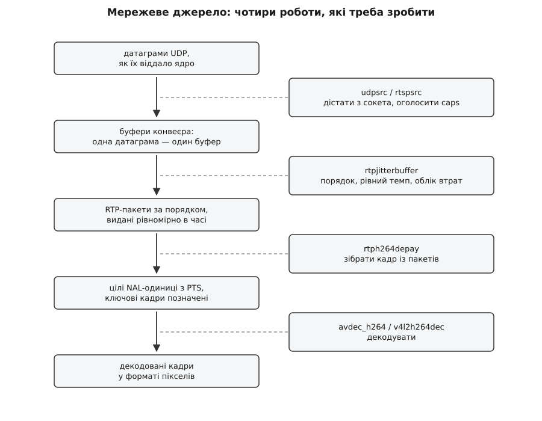
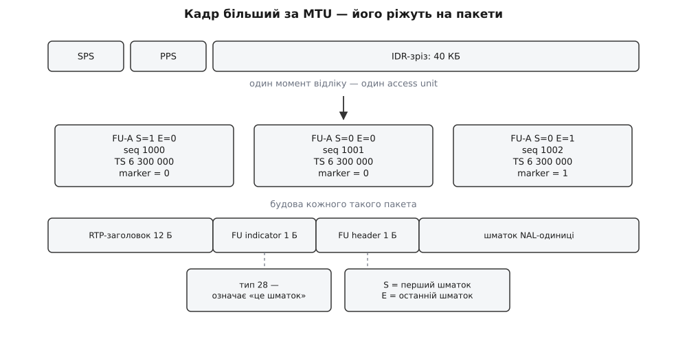
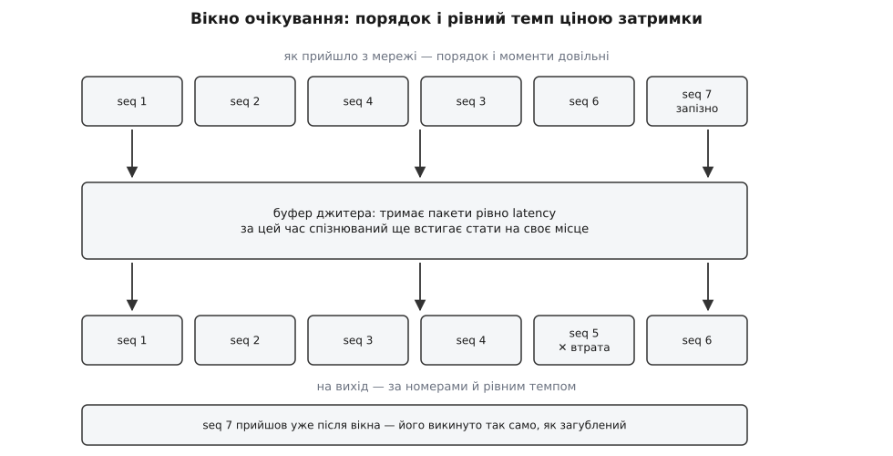
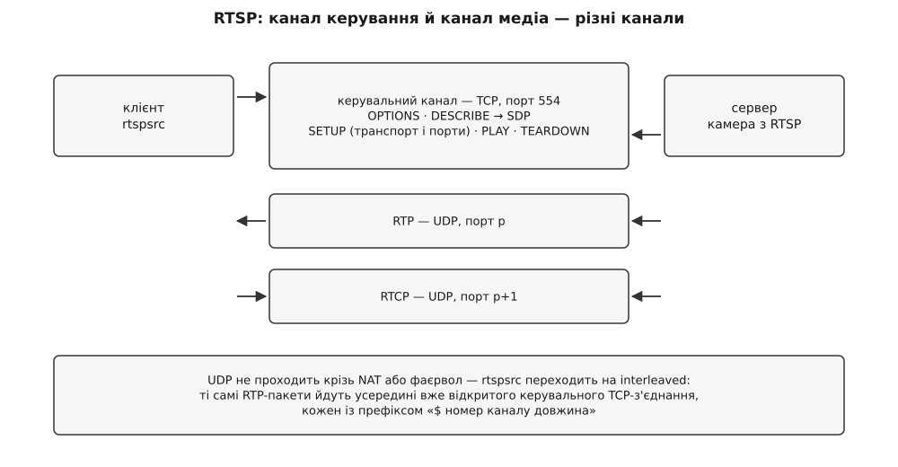

# Мережеві джерела: RTSP, UDP і депейлоадинг RTP

<preknowlist>
- [Конвеєр: елементи, зв'язки й потік даних](book:media-vision/pipeline-model) — що таке елемент, пад і буфер і як дані течуть від джерела до стоку.
- [Узгодження caps](book:media-vision/caps-negotiation) — два елементи з'єднуються лише тоді, коли зійшлися на спільному описі формату.
- [Пади і з'єднання елементів](book:media-vision/pads-and-linking) — статичні пади й пади, що з'являються на ходу, та сигнал `pad-added`.
- [Годинник, мітки часу й синхронізація](book:media-vision/clock-and-sync) — PTS, базовий час і те, як стік чекає до моменту показу.
- [Семантика датаграми UDP](book:programming/udp-datagram-semantics) — датаграма може загубитися, здублюватися й прийти не в тому порядку, зате межі повідомлення зберігаються.
- [RTP і RTCP](book:communications/rtp-rtcp) — заголовок медіапакета: номер, мітка часу, SSRC, тип корисного навантаження.
- [RTSP і SDP](book:communications/rtsp-sdp) — керування сеансом і текстовий опис потоку, який сервер віддає у відповідь на DESCRIBE.
- [H.264: NAL-одиниці, SPS/PPS і ключові кадри](book:algorithms/h264-nal-structure) — з чого складається закодований потік і чому декодер без SPS/PPS не стартує.
</preknowlist>

Візьмімо конвеєр, який точно працює: `filesrc ! qtdemux ! h264parse ! avdec_h264 ! autovideosink`. Тепер замінімо перший елемент на `udpsrc port=5600` — і не запрацює нічого. Не тому, що бракує якоїсь опції: між файлом і сокетом ламаються чотири мовчазні припущення, на яких стоїть усе, що йде далі по конвеєру.

Файл віддає **байти на замовлення**: скільки попросили, стільки й прочитали, і завжди ті самі. Сокет віддає **датаграми, коли вони прийдуть**: одна може загубитися назавжди, дві можуть помінятися місцями, третя прийде двічі.

Файл дає **суцільний потік**, у якому елемент `h264parse` сам знаходить межі кадрів. Сокет дає **порізані шматки**, і жоден із них не є ні кадром, ні його початком — то фрагмент, вирваний із середини.

Файл **сам розповідає про себе**: контейнер MP4 усередині має заголовок із кодеком, роздільністю, частотою кадрів. Датаграма не має нічого — це просто купка байтів, і ядро не додає до неї ні типу, ні опису.

І нарешті: файл **не має власного часу**. Його можна читати вдесятеро швидше або вдесятеро повільніше — від цього нічого не зіпсується. Мережеве відео йде в реальному часі: воно жива подія, і конвеєр не має права ні прискорити його, ні відмотати назад.

Отже, мережеве джерело — це не «`filesrc`, тільки з мережі». Це вузол, який мусить **відновити чотири втрачені властивості**: дати даним тип, дати їм порядок і рівний темп, скласти з фрагментів цілі кадри й проставити їм час.

Дві з цих робіт мають власні назви, і вони винесені в заголовок. Розкидані в часі моменти приходу пакетів називають **джитером** (англ. *jitter* — дрижання, тремтіння); складання кадру назад із пакетів — **депейлоадингом** (від англ. *payload* — корисне навантаження: з пакета знімають обгортку й дістають те, що всередині). GStreamer не робить усього цього одним елементом — на кожну роботу є свій, і саме тому мережева частина конвеєра завжди довша, ніж очікуєш.



*Чотири роботи, розкладені по елементах: сокет дає буфери й тип, буфер джитера — порядок і рівний темп, депейлоадер — цілі кадри з мітками часу, декодер — пікселі. Кожен наступний елемент безпорадний, якщо попередній не зробив свого.*

## Чому взагалі UDP, якщо він губить

Перше питання, яке виникає у програміста, що звик до мережі: навіщо мучитися з утратами, якщо TCP усе це вже розв'язав? Відповідь у тому, що TCP розв'язав **іншу задачу**.

TCP гарантує, що байт номер N буде доставлений і буде доставлений перед байтом N+1. Ціна гарантії — час: щоб замінити втрачений сегмент, треба помітити втрату (це щонайменше один зайвий обмін) і дочекатися повтору (це ще один шлях туди-назад). На лінку з круговою затримкою 80 мс одна втрата коштує понад 160 мс. І поки цей повтор летить, **усе, що прийшло після нього, лежить у ядрі й не віддається програмі** — бо TCP зобов'язаний віддавати байти строго по порядку. Один загублений сегмент зупиняє потік цілком.

Для завантаження файлу це правильний вибір: краще на секунду довше, ніж із дірою. Для живого відео — навпаки. Кадр, який спізнився на 160 мс, уже нікому не потрібен: момент, коли його треба було показати, минув. Гірше того — за ці 160 мс приїхали наступні три кадри, і вони цілком придатні, але лежать заблоковані заради одного померлого.

Звідси й вибір: **у живому відео втрата дешевша за чекання**. Тому медіа возять поверх UDP, який не гарантує нічого й тому нічого не блокує. Кожна датаграма летить сама по собі; загубилася — на здоров'я, наступна прийде вчасно.

Але UDP не дає й нічого корисного. У датаграмі немає ні номера, ні часу, ні відомостей про те, чиє це й що це. Тому поверх UDP кладуть RTP — тонкий заголовок, який додає рівно те, чого бракує для медіа, і жодного зайвого байта. Це не «ще один транспорт»: RTP не гарантує доставки й не керує швидкістю, він лише **підписує** кожен шматок так, щоб приймач міг усе розкласти назад.

## Що насправді видає сокет

`udpsrc` робить одну просту річ: читає з UDP-сокета й на кожну прочитану датаграму видає один буфер GStreamer. Тут стає в пригоді властивість UDP, якої немає в TCP: **датаграма зберігає свої межі**. Скільки байтів відправник поклав в одну датаграму, стільки їх і прийде одним шматком — ядро не склеїть дві сусідні й не розріже одну. Тому `udpsrc` не потребує жодного кадрування: межі пакетів йому дає сам протокол.

Розмір датаграми диктує MTU. Якщо RTP-пакет виходить більший за MTU шляху, його поріже вже рівень IP — і це погано непропорційно: [фрагментація IP](book:communications/mtu-and-fragmentation) означає, що втрата **одного** фрагмента вбиває **всю** датаграму, бо зібрати її ядро вже не зможе. Тому пейлоадери за замовчуванням ріжуть під приблизно 1400 байтів корисного навантаження, з запасом на заголовки IP, UDP і RTP. У самого `udpsrc` є властивість `mtu` (типово 1492) — це не обмеження на відправника, а підказка, під який максимальний розмір готувати приймальний буфер.

Далі — головна пастка. `udpsrc` не знає, **що** він прочитав. У сокеті немає типу; є лише байти. А конвеєр GStreamer без опису формату не з'єднається: наступний елемент мусить дізнатися, з чим має справу, ще до того, як потече перший буфер. Тому caps доводиться **оголошувати рукою**:

```sh
gst-launch-1.0 -v \
  udpsrc port=5600 caps="application/x-rtp,media=video,clock-rate=90000,encoding-name=H264,payload=96" \
  ! rtpjitterbuffer latency=50 \
  ! rtph264depay \
  ! h264parse \
  ! avdec_h264 \
  ! autovideosink sync=false
```

Кожне поле в цьому рядку — не формальність, а відповідь на конкретне питання наступних елементів. `media=video` і `encoding-name=H264` кажуть, який саме депейлоадер підходить. `clock-rate=90000` — це частота, у якій рахує мітку часу RTP; без неї неможливо перевести мітку в наносекунди конвеєра. `payload=96` — номер із динамічного діапазону, яким відправник позначив цей формат; якщо в нього стоїть 97, а ви написали 96, елементи далі трактуватимуть пакети за чужим описом: у кращому разі депейлоадер одразу поскаржиться, у гіршому мовчки видаватиме сміття.

> 🔧 **Навіщо це.** Три чверті випадків «чорне вікно й нічого не відбувається» на приймачі відеолінку — це саме розбіжність у цьому рядку caps. Перевіряють її не гаданням, а `gst-launch-1.0 udpsrc port=5600 ! fakesink dump=true`: якщо байти сиплються, лінк живий, і проблема в описі. Другий байт RTP-заголовка, обрізаний до семи молодших бітів, — це і є `payload`; перших дванадцяти байтів кожної датаграми досить, щоб прочитати і номер, і мітку часу.

Один рядок caps — це, по суті, вручну переписаний фрагмент SDP-опису, який у повноцінному сеансі приймач дістає від сервера сам. Звідси й уся різниця між голим сокетом і RTSP: у другому випадку ці поля приходять по дроту разом із потоком.

## Заголовок RTP — рівно те, чого бракує

Дванадцять байтів на початку кожного пакета несуть чотири речі, і кожна з них потрібна котромусь із наступних елементів.

**Порядковий номер** — 16 бітів, зростає на одиницю з кожним пакетом. Це єдиний спосіб помітити, що пакет загубився або прийшов не по черзі: даних про це в UDP немає.

**Мітка часу** — 32 біти, рахує в одиницях `clock-rate`; для відео це майже завжди 90 000 тиків на секунду. Мітка стоїть не «коли пакет надіслано», а **коли кадр було знято**. Тому всі пакети одного кадру несуть **однакову** мітку — і саме за нею депейлоадер розуміє, що п'ять пакетів поспіль належать до одного зображення.

**Біт marker** — один-єдиний біт, який у відеоформатах означає «це останній пакет кадру». Без нього довелося б чекати на пакет із наступною міткою часу, тобто затримувати кожен кадр на один пакет.

**SSRC** — випадковий 32-бітний ідентифікатор джерела. Якщо в один порт сиплються два потоки, розрізнити їх можна тільки за ним.

Решта — типи корисного навантаження, розширення, список джерел, що змішалися, — потрібна не тут; [про будову RTP і його супутник RTCP](book:communications/rtp-rtcp) є окрема стаття, і те, як приймач рахує втрати й повідомляє про них назад, описано там. Для конвеєра важливо інше: **RTP описує пакет, але нічого не знає про кодек**. Правило, за яким кадр H.264 ріжеться на пакети, живе не в RTP, а в окремому документі — форматі корисного навантаження.

## Депейлоадер: як кадр збирають назад

Закодований кадр H.264 — це кілька NAL-одиниць, а ключовий кадр легко важить десятки кілобайтів. У датаграму влазить близько 1400 байтів. Отже, комусь треба вміти різати, а комусь — склеювати, і робити це узгоджено. Правила для H.264 задає RFC 6184 (травень 2011 року; він замінив ранішій RFC 3984), для H.265 — RFC 7798, для motion JPEG — свій документ, і так для кожного кодека окремо.

Головних випадків три, і кожен з'явився як відповідь на конкретну незручність.

**Мала NAL-одиниця йде як є.** Влазить у пакет — кладемо цілою, без жодної обгортки. Найпростіший і найчастіший випадок.

**Кілька дрібних складають в один пакет.** SPS і PPS — це десятки байтів; посилати кожен окремою датаграмою означає платити 40 байтів заголовків за 20 байтів даних. Тому їх пакують разом у пакет-агрегат STAP-A, який має тип 24 і всередині несе кілька NAL-одиниць із префіксами довжини.

**Велика ріжеться на шматки.** Тип 28, FU-A: перший байт каже «це фрагмент», другий несе два прапорці — `S` (початок вихідної NAL-одиниці) і `E` (кінець) — плюс тип тієї NAL-одиниці, яку ріжуть. Приймач збирає шматки від `S` до `E`, відновлює заголовок вихідної NAL-одиниці й дістає її цілою.



*Однакова мітка часу зв'язує пакети в один кадр, номери дають порядок усередині нього, marker закриває кадр. Два службові байти FU-A кажуть, чи цей шматок перший і чи він останній.*

`rtph264depay` виконує зворотну операцію й дорогою робить іще чотири речі, без яких далі нічого не поїде.

Він **збирає NAL-одиниці** зі шматків і, якщо на виході стоїть `stream-format=byte-stream`, ставить перед кожною стартовий код `00 00 00 01` — той самий, який шукає `h264parse`.

Він **переводить мітку часу RTP у PTS конвеєра**. Мітка RTP — це 32-бітний лічильник із довільним початком, який на частоті 90 кГц переповнюється приблизно раз на тринадцять годин (4 294 967 296 ÷ 90 000 ≈ 47 722 с); PTS — це наносекунди від початку відтворення. Переведення робить не депейлоадер сам, а базовий клас разом із буфером джитера, і саме там ховається більшість проблем із синхронізацією.

Він **витягає SPS і PPS із caps**. У полі `sprop-parameter-sets` SDP-опису параметри кодування лежать у base64; депейлоадер вставляє їх у потік перед першим кадром. Ось чому потік із RTSP часто починає показувати відразу, а той самий потік, узятий голим `udpsrc` без цього поля, мовчить, доки відправник не пришле черговий ключовий кадр із параметрами всередині.

І він **помічає розрив**. Якщо номер пакета стрибнув, а `S` так і не прийшов, зібраний кадр буде битий. За замовчуванням депейлоадер віддасть його як є — і ви побачите класичне «розповзання зеленими квадратами». Властивість `wait-for-keyframe=true` каже мовчати до наступного цілого ключового кадру, а `request-keyframe=true` — ще й попросити відправника прислати ключовий кадр негайно (запит іде вгору по конвеєру й через RTCP доходить до камери, якщо вона таке вміє).

Складання шматка за шматком виглядає простим, доки не спробувати написати це самому: там і переповнення лічильника, і пакети, що прийшли після кінця свого кадру, і агрегати всередині фрагментів. [Розбір збирання FU-A з нуля, робочим кодом і з пастками](book:media-vision/network-sources/proj-fu-a-reassembly.md) винесено окремо: там і машина станів приймача, і те, чому не можна довіряти прапорцю `E` як єдиній ознаці кінця.

## Буфер джитера: скільки чекати на спізнюваного

Депейлоадер вимагає пакетів у правильному порядку — інакше він просто не складе кадру. Мережа такого не обіцяє. Значить, між сокетом і депейлоадером мусить стояти щось, що переставляє пакети назад.

Переставити можна лише те, що вже маєш. Отже, буфер мусить **зачекати**: притримати пакет 1000, доки не з'ясується, чи прийде 999. Скільки чекати? Це і є єдине справжнє рішення в усій темі мережевих джерел, і всі інші налаштування — похідні від нього.

`rtpjitterbuffer` формулює його одним числом — властивістю `latency` (типово 200 мс). Читати її треба так: **кожен пакет виходить із буфера рівно на `latency` пізніше за момент, коли він мав вийти**. Це не «максимум», не «до», а стала затримка, яку елемент додає всьому потоку. Натомість він отримує право чекати: пакет, який спізнився менше ніж на `latency`, ще встигне стати на своє місце, і потік вийде цілим.



*Вікно очікування виправляє перестановку й згладжує нерівний темп, але не творить чудес: те, що прийшло після вікна, для конвеєра нічим не відрізняється від загубленого.*

Звідси прямо випливає компроміс, який доводиться вирішувати щоразу. Велике `latency` рятує пакети, що йдуть кружними шляхами, — і додає затримки. Мале `latency` дає живу картинку — і оголошує втраченим усе, що трохи спізнилося. Для оператора дрона, який керує апаратом по картинці, 150 мс уже відчутні, а 400 мс роблять керування небезпечним; для запису з камери спостереження півсекунди не помітить ніхто, зате кожен урятований пакет — це кадр без артефактів.

> 🔧 **Навіщо це.** Число не вгадують, а міряють. `rtpjitterbuffer` віддає властивість `stats` зі структурою, де є `num-pushed`, `num-lost`, `num-late`, `num-duplicates`. Схема налаштування така: поставити свідомо велике `latency` (скажімо, 500 мс), погнати потік хвилин десять, подивитися, скільки пакетів позначено як `late`, і зменшувати, доки їхня частка не почне рости. Значення, за якого `num-late` ще нуль, і є природною межею цього лінка.

Кілька властивостей стають зрозумілими лише на тлі цього компромісу.

`drop-on-latency` (типово `false`) стосується поведінки при заторі. Коли даних приходить більше, ніж встигає забирати конвеєр, буфер росте понад `latency`. Типова поведінка — рости й далі, накопичуючи затримку; з `drop-on-latency=true` елемент викидає найстаріші пакети, тримаючи розмір фіксованим. Для живого лінка це майже завжди правильніше: краще втратити старе, ніж повільно, непомітно набрати секунду відставання, від якої вже ніяк не оговтатися.

`do-lost` (типово `false`) вмикає повідомлення про втрату: коли вікно на пакет минуло й він так і не прийшов, буфер посилає вниз по конвеєру службову подію `GstRTPPacketLost`. Подія — це не буфер із даними, а сигнал, який іде тим самим шляхом, що й дані, і по черзі з ними, тож наступний елемент дізнається про дірку рівно в тому місці потоку, де вона утворилася; [механіка подій і запитів у конвеєрі](book:media-vision/events-and-queries) розібрана окремо. Депейлоадер, який цю подію бачить, знає, що дірка вже стала фактом, і може не мовчати про биту одиницю. Без цієї події він здогадується про розрив лише за стрибком номера — а це не те саме, бо стрибок він побачить із запізненням.

`do-retransmission` дає буферові право попросити повтор конкретного пакета (RFC 4588 описує, як такий повтор возять окремим потоком). Це виглядає як зрада ідеї «краще втратити, ніж чекати», але суперечності немає: повтор має сенс саме тоді, коли `latency` **і так більше** за круговий час лінка. Якщо ви вже погодилися чекати 200 мс, а обмін туди-назад займає 30 мс, то втрачений пакет цілком встигає прилетіти вдруге всередині вже оплаченої затримки. Працює це, звісно, лише якщо повтори вміє відправник.

`mode` визначає, звідки береться час на виході. Мітки RTP лічить кварц камери, а конвеєр живе за годинником приймача, і ці два кварци розходяться. Розбіжність у скромні тридцять мільйонних долей при 30 кадрах на секунду дає зайвий або пропущений кадр приблизно раз на чверть години — а буфер, який росте, накопичує цю різницю мовчки. Режим `slave` (типовий) вимірює розбіжність і повільно підтягує до неї свою шкалу, тому потік не «набігає» і не «відстає». Режим `synced` іде далі й бере відповідність між шкалою RTP і абсолютним часом зі звітів RTCP — це єдиний спосіб чесно синхронізувати два потоки з **різних** камер. Режими `none` і `buffer` вимикають цю механіку зовсім і потрібні там, де за час відповідає щось інше.

Як вибрати число з виміряного джитера й чому просте «максимум мінус мінімум» дає завелику відповідь — [розібрано з арифметикою окремо](book:media-vision/network-sources/math-jitter-latency.md): там і згладжена оцінка джитера з RFC 3550, і те, як розподіл затримок перетворюється на криву «частка втрат проти вікна очікування».

## RTSP: канал, який розповідає, що взагалі йде

Голий `udpsrc` вимагає, щоб ви знали все наперед: порт, кодек, частоту, номер payload, а ще щоб хтось на тому кінці вже почав слати. Камера так не працює. Вона стоїть і чекає, доки її попросять, — і сама розповість, що вміє. Механізм цієї розмови й називають RTSP.

Ключ до розуміння — те, що **RTSP не возить відео**. Це окремий канал керування, звичайне текстове TCP-з'єднання на порт 554, у якому відбувається коротка розмова: `OPTIONS` (що ти вмієш), `DESCRIBE` (опиши потік — і сервер віддає SDP), `SETUP` для кожного потоку (домовляємося про транспорт і порти), `PLAY` (починай), `TEARDOWN` (кінець). Саме медіа після цього тече геть іншим шляхом — власними UDP-портами, і керувальне з'єднання про нього нічого не знає, тільки тримається живим.



*Керування й медіа розділені навмисно: керування має бути надійним, тому TCP; медіа має бути свіжим, тому UDP. Коли UDP не проходить, медіа заганяють у вже відкрите керувальне з'єднання.*

Для конвеєра це має два прямі наслідки.

**Перший: `rtspsrc` сам знає caps.** Відповідь на `DESCRIBE` — це SDP, а в SDP є рядки `m=video 0 RTP/AVP 96` і `a=rtpmap:96 H264/90000`, а часто ще й `a=fmtp:96 sprop-parameter-sets=...`. Тобто рівно ті поля, які з голим `udpsrc` ви набивали руками. Тому рядок запуску з RTSP коротший, і в ньому нема чого переплутати:

```sh
gst-launch-1.0 -v \
  rtspsrc location=rtsp://192.168.1.64:554/Streaming/Channels/101 latency=100 \
  ! rtph264depay ! h264parse ! avdec_h264 ! autovideosink sync=false
```

**Другий: пади `rtspsrc` з'являються не одразу.** Скільки потоків у сеансі й якого вони типу, стає відомо аж після `DESCRIBE` — тобто вже після переходу конвеєра в `PAUSED`. Тому в елемента немає готових вихідних падів: він створює їх на ходу й повідомляє сигналом `pad-added`. У командному рядку це ховає `gst-launch`, а в програмі доводиться з'єднувати руками — [саме та ситуація, задля якої існують пади, що з'являються на ходу](book:media-vision/pads-and-linking). Через це ж `rtspsrc` часто ставлять перед `decodebin`, який сам розбереться і з кількістю потоків, і з кодеками.

Усередині `rtspsrc` — не один елемент, а зібраний на ходу підконвеєр: пара `udpsrc` на RTP і RTCP для кожного потоку, `udpsink` для звітів назад і повний менеджер сеансу `rtpbin`, у якому й сидять ті самі буфери джитера. Тому властивість `latency` в `rtspsrc` — це просто `latency` внутрішнього буфера джитера, і компроміс за нею той самий. Типове її значення — **2000 мс**, і воно свідомо велике: це число для перегляду запису з сервера через інтернет, а не для керування апаратом. Для лінка в межах кімнати чи борта його ставлять у 50–200 мс, інакше отримують дві секунди відставання картинки при цілком здоровій мережі.

RTCP у цій схемі виконує три роботи, і жодна не є зайвою. Звіти відправника дають відповідність «мітка RTP ↔ абсолютний час», без якої не звести два потоки докупи. Звіти приймача розповідають серверові про втрати й джитер — на це спираються камери, що вміють знижувати бітрейт. І сам факт регулярного обміну тримає відкритими дірки в NAT, які інакше закрилися б за десятки секунд тиші. Тому `do-rtcp=false` вимикають тільки свідомо й лише тоді, коли зворотного каналу фізично немає.

Останнє, що робить `rtspsrc` без запитань, — **обирає транспорт**. Властивість `protocols` перелічує дозволені: UDP, багатоадресний UDP і TCP; типово дозволені всі. Елемент пробує UDP, і якщо за `timeout` (типово 5 секунд) у порт не прилетіло нічого, перемикається на TCP — на так званий interleaved-режим, коли RTP-пакети їдуть усередині вже відкритого керувального з'єднання, кожен із коротким префіксом «долар, номер каналу, довжина». Виглядає це як магія самолікування, а насправді — точний діагноз: між вами й камерою стоїть NAT або фаєрвол, який не пускає вхідні UDP-датаграми.

> 🔧 **Навіщо це.** Коли картинка з камери «то є, то нема», перший діагностичний хід — примусово зафіксувати транспорт: `protocols=udp` покаже, чи UDP взагалі проходить, `protocols=tcp` дасть стабільну картинку через NAT ціною затримки й чутливості до заторів. Якщо з `udp` тиша, а з `tcp` усе добре — проблема не в GStreamer і не в камері, а в мережі між ними.

## Звідки береться затримка

Затримка живого відео — не властивість якогось одного елемента, а сума внесків, і майже кожен доданок керований. Порахуймо її для типового лінка з камери на дроні.

**Умова: H.264 1080p, 30 кадрів на секунду, канал із круговою затримкою 40 мс, `rtpjitterbuffer latency=100`, декодер без B-кадрів, стік із `sync=true`.**

```
знімання й кодування (камера)      ≈  33 мс   один кадровий інтервал
черга відправника й ефір           ≈  20 мс   половина кругової затримки
буфер джитера                      = 100 мс   рівно властивість latency
депейлоадер                        ≈   0 мс   віддає, щойно побачив marker
декодер, без B-кадрів              ≈  10 мс   один кадр у роботі
стік, sync=true                    ≈  33 мс   чекає до свого моменту показу
                                   ────────
разом                              ≈ 196 мс
```

У цій сумі один доданок відрізняється від решти: **буфер джитера — єдиний, який ви ставите числом**. Усі інші диктує залізо або кодек. Тому налаштування затримки живого відео майже завжди зводиться до одного питання: наскільки можна опустити `latency`, не почавши сипати артефактами.

Два доданки варті окремого слова.

**Декодер із B-кадрами додає більше, ніж здається.** Двонапрямлений кадр посилається на майбутній, тому декодер мусить тримати кілька кадрів у роботі, перш ніж віддати перший, — і затримка зростає на розмір цього вікна перевпорядкування. Тому кодери для живих лінків B-кадри просто вимикають; профіль `baseline` їх і не має зовсім.

**Стік із `sync=true` додає повний кадровий інтервал і легко додає більше.** Стік показує буфер тоді, коли час конвеєра дорівнює PTS буфера, — тобто чесно відтворює темп відправника. Якщо десь на шляху PTS порахувалися з запасом, стік чесно цей запас відпрацює. Класичний `sync=false` прибирає весь цей доданок, показуючи кадр щойно він прийшов; ціна — рваний темп на нерівному потоці, бо стік більше не згладжує нічого. Для оператора, який керує апаратом, це зазвичай правильний обмін; для запису — ні. Механіка того, як конвеєр збирає ці внески в одну цифру й повідомляє її сам собі, — [окрема тема про затримку й буферизацію](book:media-vision/latency-and-buffering).

## Що ламається і чому

Майже кожна поломка мережевого джерела — це одна з чотирьох робіт, яка не зробилася. Знаючи це, діагноз ставлять швидко.

**Тип не оголошено.** `udpsrc` без `caps` не з'єднається ні з чим: наступний елемент не має з чого зрозуміти формат, і конвеєр падає з «not negotiated» або зупиняється ще до першого буфера. Те саме, але хитріше, — `payload` чи `clock-rate`, які не збігаються з тим, що шле відправник: помилки нема, картинки теж.

**Пакети не доїжджають до конвеєра взагалі.** Якщо ядро приймає датаграми швидше, ніж їх забирає `udpsrc`, приймальний буфер сокета переповнюється, і ядро мовчки викидає надлишок. Ознака — рівні втрати, що ростуть із бітрейтом, і зростання лічильника `RcvbufErrors` у `netstat -su`. Лікується збільшенням `buffer-size` (це прямо `SO_RCVBUF`) і, як правило, ще й перенесенням важкої обробки з потоку джерела.

**Багатоадресний потік не приходить.** `udpsrc` з груповою адресою типово сам приєднується до групи (`auto-multicast=true`), але на машині з кількома інтерфейсами ядро мусить знати, на якому саме, — інакше запит IGMP піде не туди. Це властивість `multicast-iface`. Механіка приєднання й самі групові адреси — у статті про [багатоадресну розсилку](book:programming/multicast-and-discovery).

**Кадри не складаються.** Зелені квадрати й «розповзання» означають, що депейлоадер віддав биту одиницю. Причина майже завжди мережева, а не програмна, але наслідки прибирають на боці приймача: `wait-for-keyframe=true` мовчатиме до цілого ключового кадру, `request-keyframe=true` попросить його негайно. Якщо втрати систематичні, розумніше витратитися на надлишковість — [пряме виправляння помилок для потокового відео](book:communications/fec-channel-coding) саме про це.

**Картинка стартує з великим запізненням.** Без SPS і PPS декодер не може почати, тому чекає першого ключового кадру. З RTSP їх приносить SDP; із голим UDP — тільки сам потік, і тоді все залежить від того, як часто відправник повторює параметри. У пейлоадера GStreamer за це відповідає `config-interval`, і значення `-1` означає «слати перед кожним ключовим кадром».

**Затримка повільно росте.** Це не джитер, а розбіжність кварців: відправник виробляє трохи більше кадрів за секунду, ніж споживає приймач, і різниця накопичується в буфері. Правильна відповідь — режим підстроювання в буфері джитера (`mode=slave`, і він типовий), а швидка — `drop-on-latency=true`, щоб буфер викидав старе замість рости.

## Одна вимога, розкладена на елементи

Мережеве джерело в GStreamer виглядає як довгий ланцюг там, де файлове джерело обходиться одним елементом. Довжина ця не випадкова: мережа забирає в потоку чотири властивості, і кожну доводиться повертати окремо, окремим елементом, за окрему ціну.

Ціна майже завжди одна й та сама — **затримка**. Порядок купується вікном очікування. Цілі кадри купуються тим, що депейлоадер тримає шматки, доки не збереться повний. Синхронність двох потоків купується підстроюванням під спільний час. Навіть надійність, якщо її раптом захотіти, купується тим самим вікном, усередині якого встигає прилетіти повтор. Тому в мережевому конвеєрі немає «правильних налаштувань узагалі»: є лише свідомо вибрана точка на прямій між свіжістю картинки й її цілістю, і вся інженерія тут — у тому, щоб цю точку вибрати з виміряних чисел, а не з чужого прикладу в інтернеті.

Повний перелік властивостей, полів caps і рядків транспорту, які цю точку задають, зібрано окремо — [контракт мережевих елементів](book:media-vision/network-sources/api-network-source-elements.md) — щоб не тримати таблиці в голові й не гадати над значеннями за замовчуванням.
