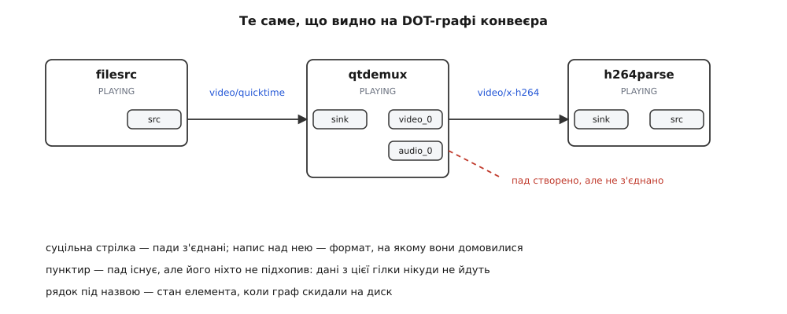
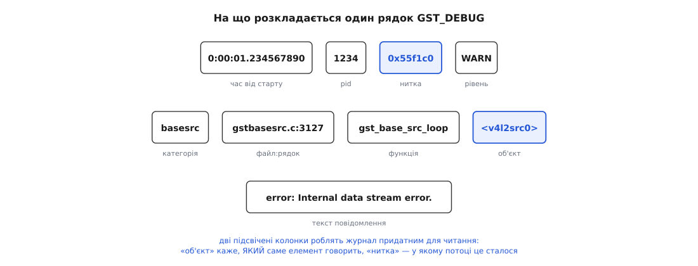
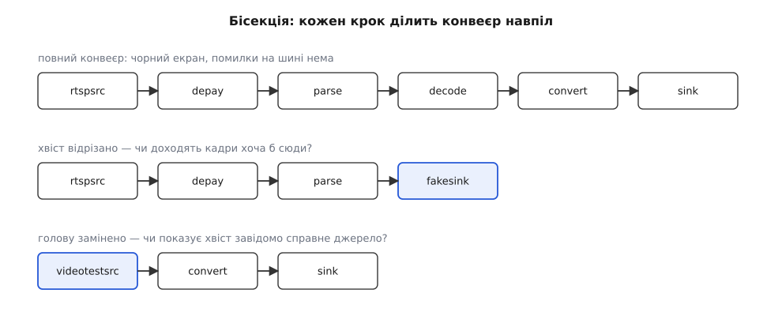

# Діагностика конвеєра: графи, рівні журналу, типові затики

<preknowlist>
- [Конвеєр: елементи, зв'язки й потік даних](topic:media-vision/pipeline-model) — що таке елемент, як із них складається граф і хто в ньому проштовхує дані.
- [Пади і з'єднання елементів](topic:media-vision/pads-and-linking) — пад як точка приєднання; сталі, запитні й динамічні пади, які з'являються вже під час роботи.
- [Узгодження caps](topic:media-vision/caps-negotiation) — як сусідні елементи домовляються про формат і чому домовленість може не вийти.
- [Стани конвеєра й переходи між ними](topic:media-vision/states-lifecycle) — NULL, READY, PAUSED, PLAYING; що таке преролл і чому перехід буває асинхронним.
- [Шина повідомлень](topic:media-vision/bus-and-messages) — канал, яким конвеєр повідомляє програму про помилки, попередження й досягнуті стани.
- [argv, оточення й що успадковує дитина](topic:unix-linux/argv-and-environment) — змінні середовища: як вони потрапляють у процес, бо весь механізм діагностики керується саме ними.
</preknowlist>

Конвеєр зібрано, стан виставлено в `PLAYING`, функція повернулася без помилки. Процес живий, пам'ять на місці, процесор завантажений на нуль відсотків — і на екрані чорнота. Жодного винятку, жодного рядка в терміналі, жодної підказки.

Звичний рефлекс — зупинити програму під зневаджувачем і подивитися стек — тут дає порожнечу. У головному потоці висить цикл подій. В одному з чужих потоків — очікування на умовній змінній усередині `gst_pad_push`. У другому — `poll` на сокеті. Формально все справне: ніхто не впав, ніхто не зациклився. Просто нічого не рухається.

Так виглядає більшість несправностей у GStreamer, і це не недбалість бібліотеки, а прямий наслідок її будови. Варто розібрати цей наслідок до кінця, бо з нього випливає весь спосіб пошуку.

## Чому конвеєр не вміє «падати»

Три властивості конвеєра змовляються проти звичних звичок налагодження.

**Перше: результат виклику й результат дії розведені в часі.** Коли програма робить `gst_element_set_state(pipeline, GST_STATE_PLAYING)`, вона не наказує — вона подає заявку. Функція повертає `GST_STATE_CHANGE_ASYNC`, що дослівно означає «я почав, перехід триває, спитай пізніше». Справжня відмова — файл не відкрився, камера зайнята, кодек не знайдено — станеться за одиниці мілісекунд, уже після повернення, всередині чужого потоку. Повертати її нікуди: викликач давно пішов далі. Тому вона летить на шину повідомленням `ERROR`. Програма, яка шину не слухає, законним чином не бачить нічого — і має рацію, що в неї «немає помилок»: помилка є, її просто нема кому взяти.

**Друге: граф, який виконується, — не той граф, що написаний у коді.** Елементи на кшталт `decodebin`, `uridecodebin`, `rtspsrc` не мають вихідних падів у момент створення. Вони їх **відрощують**, коли розберуться, що саме тече крізь них: побачив демультиплексор у контейнері доріжку H.264 — створив пад із такими caps, побачив AAC — створив другий. Код при цьому не описує з'єднання, він описує **обіцянку** з'єднати, коли пад з'явиться. Якщо обробник цієї події промахнувся — скажімо, підключив лише перший пад і проігнорував другий, — граф у пам'яті виявиться іншим, ніж граф у голові автора. Прочитати його з вихідного тексту неможливо в принципі.

**Третє: дані рухає не той потік, що їх запитував.** Кожне джерело або кожна `queue` заводить власну нитку виконання (див. [потоки в Linux](topic:unix-linux/threads-as-tasks)), і буфер від камери до екрана проходить крізь кілька таких ниток. Стек будь-якої з них показує, де вона зараз спить, але не показує, **чому вона спить** і хто мав би її розбудити.

З цих трьох властивостей випливає, що діагностика конвеєра — це не читання стека, а **відновлення трьох невидимих зрізів**:

- Яка зараз **форма** графа і на яких форматах він з'єднаний? — на це відповідає скинутий на диск граф.
- Що відбувалося, **в якому порядку** і в якій нитці? — на це відповідає журнал.
- Де **зараз** стоять дані і в якому стані елементи? — на це відповідають шина, стани й запити.

Жоден із трьох інструментів не замінює двох інших: вони відповідають на різні питання. Затик у конвеєрі майже завжди має вигляд «одне з трьох питань лишилося без відповіді», і половина роботи — здогадатися, яке саме.

## Зріз перший: форма графа

Конвеєр уміє намалювати сам себе. За змінною середовища `GST_DEBUG_DUMP_DOT_DIR` бібліотека кладе в указану теку опис свого графа мовою `dot` — текстовий формат, який пакет Graphviz перетворює на картинку:

```sh
mkdir -p /tmp/dots
GST_DEBUG_DUMP_DOT_DIR=/tmp/dots gst-launch-1.0 filesrc location=a.mp4 ! decodebin ! autovideosink
dot -Tsvg /tmp/dots/*PLAYING_PAUSED.dot -o graph.svg
```

Дві дрібниці, на яких спотикаються всі: **теку GStreamer не створює сам** — якщо її нема, дампу просто не буде, і жодного попередження теж; і **збірка бібліотеки має бути з увімкненою діагностикою** (`--enable-gst-debug`, типова умова для звичайних пакунків дистрибутивів, але не для деяких урізаних вбудованих збірок).

Утиліта `gst-launch-1.0` скидає граф сама на кожній зміні стану, тому в теці з'являється кілька файлів із промовистими іменами: `...NULL_READY.dot`, `...READY_PAUSED.dot`, `...PAUSED_PLAYING.dot`. Це важливіше, ніж здається: граф на переході `READY → PAUSED` — це граф **до** того, як динамічні пади встигли з'явитися, а граф на `PAUSED → PLAYING` — уже після. Різниця між двома файлами показує, що саме доростив `decodebin`.

Усередині власної програми граф скидають вручну — макросом, у момент, який здається підозрілим:

```c
GST_DEBUG_BIN_TO_DOT_FILE_WITH_TS(GST_BIN(pipeline),
                                  GST_DEBUG_GRAPH_SHOW_ALL,
                                  "after-pad-added");
```

Другий аргумент — набір бітових прапорців `GstDebugGraphDetails`: `SHOW_MEDIA_TYPE` (1) підписує ребра типом даних, `SHOW_CAPS_DETAILS` (2) — повними caps із усіма полями, `SHOW_NON_DEFAULT_PARAMS` (4) — зміненими властивостями елементів, `SHOW_STATES` (8) — станом кожного елемента; `SHOW_ALL` — це просто 15, тобто всі чотири разом. Варіант `_WITH_TS` дописує до імені файлу часову мітку, тож повторні виклики не затирають один одного, і виходить серія знімків. Обидва макроси в збірці без діагностики розкриваються в порожнечу — тому їх не треба обкладати умовною компіляцією.

> 🔧 **Навіщо це.** Скидання графа з обробника `pad-added` і з обробника помилки на шині — найдешевша страховка, яку можна поставити один раз і забути. Коли на робочому пристрої за тиждень роботи конвеєр одного разу розсипався, у теці лежатиме картинка **того самого моменту**, і не доведеться відтворювати несправність.

### Що саме читати на графі

Картинка виглядає як ланцюжок прямокутників, і спокуса — просто переконатися, що вона схожа на задум. Насправді на ній є три речі, заради яких усе й затівалося.



*З'єднані пади сполучені суцільною стрілкою, а напис над нею — той формат, на якому вони домовилися. Пад, від якого йде пунктир у порожнечу, створено, але не підхоплено: гілка існує й нікуди не веде.*

**Перша річ — підпис на ребрі.** Це не декорація: це остаточний результат [узгодження caps](topic:media-vision/caps-negotiation), уже зафіксований. Якщо на ребрі стоїть повністю визначений формат із розміром, частотою кадрів і розкладкою пікселів — сторони домовилися. Якщо ребро підписане розлогим переліком варіантів або взагалі `ANY`, значить, домовленість ще попереду, і граф зняли зарано.

**Друга річ — пад без ребра.** Він малюється, але від нього нікуди не йде лінія. Це і є найчастіша несправність динамічного графа: пад народився, сигнал `pad-added` спрацював, а обробник його не підключив — бо перевіряв назву пада за застарілим шаблоном, бо вийшов після першої доріжки, бо не впорався з другим викликом. Дані з такої гілки нікуди не течуть, і за мить це виллється у зовсім іншу помилку в іншому місці графа.

**Третя річ — рамка в рамці.** Складені елементи (`decodebin`, `rtspsrc`, `playbin`) на графі розкриваються: усередині великої рамки видно те, що вони собі побудували, а на межі рамки — пади-примари, які просто переадресовують дані назовні. Це єдиний спосіб побачити, який декодер підібрався насправді: не «якийсь H.264», а конкретно `avdec_h264` чи `nvh264dec`.

І окремо — те, чого на графі **немає**. Якщо в ланцюжку між декодером і стоком порожньо, а очікувався перетворювач кольорового простору, то його справді нема, і саме тут за секунду впаде узгодження форматів.

## Зріз другий: журнал

Граф — це знімок. Він не каже, як конвеєр до цього стану дійшов і в якій послідовності. Для цього є друга система: власний журнал бібліотеки, який пишеться в стандартний потік помилок (див. [стандартні потоки](topic:unix-linux/standard-streams)) і вмикається однією змінною середовища:

```sh
GST_DEBUG=3 gst-launch-1.0 ...
```

Число — це **рівень докладності**, від 0 (мовчати) до 9 (вивалювати навіть шістнадцяткові дампи пам'яті). Рівні не рівноцінні за призначенням, і саме тому їх варто розрізняти не за номером, а за характером:

- **1–2** — те, що зламалося або майже зламалося: фатальні помилки й попередження. Стільки вмикають **завжди**, це майже безкоштовно.
- **4–5** — рідкі події налаштування: створення елементів, переходи станів, узгодження форматів. Тут живе відповідь на 90% питань «чому воно не запустилося».
- **6–7** — те, що трапляється **на кожен буфер**. Один кадр — кілька десятків рядків.

Останній пункт — не просто зауваження про обсяг. Запис у журнал — це форматування рядка й запис у файл на кожен буфер, і на рівні 6 конвеєр реального часу перестає встигати за власним джерелом. Кадри починають дропатися, `queue` переповнюються, з'являються помилки, яких без журналу не було. Несправність, що зникає, щойно її почали дивитися, — класика саме цього роду.

Тому глобальний рівень вище за 4 ставити не варто взагалі. Замість цього рівень задають **прицільно, за категоріями**:

```sh
GST_DEBUG=2,GST_CAPS:5,qtdemux:6 gst-launch-1.0 ...
```

Читається це так: усім категоріям рівень 2, категорії `GST_CAPS` — 5, категорії `qtdemux` — 6. Категорія — це або внутрішня підсистема ядра (`GST_CAPS` — узгодження форматів, `GST_PADS` — з'єднання й проштовхування, `GST_STATES` — переходи станів, `GST_EVENT` — події), або ім'я самого елемента, яке кожен плагін реєструє для себе. Шаблони працюють: `video*:5` вмикає все, що починається з `video`. Повний перелік змінних, рівнів і корисних категорій зібрано окремо — [шпаргалка з діагностичних змінних середовища](topic:media-vision/pipeline-debugging/api-gst-debug.md).

Виводом теж керують змінними: `GST_DEBUG_FILE=/tmp/gst.log` відправляє журнал у файл замість терміналу (у шаблоні імені працюють `%p` — pid і `%r` — випадкове число, щоб паралельні процеси не били один одного), а `GST_DEBUG_NO_COLOR=1` вимикає керівні послідовності кольору, без чого файл журналу нечитабельний у редакторі й погано стискається.

### Анатомія рядка

Рядок журналу має сталу будову, і два його поля роблять усю різницю між «стіна тексту» і «зрозуміло, хто винен».



*Підсвічені колонки — ті, заради яких журнал узагалі варто читати: «об'єкт» називає конкретний примірник елемента, а «нитка» дозволяє розділити переплетені між собою потоки виконання.*

Поле **об'єкта** в кутових дужках — це ім'я примірника, а не типу: `<v4l2src0>`, `<queue3>`, `<sink>`. У конвеєрі з двома камерами й трьома чергами без нього годі зрозуміти, котра саме черга переповнилася. Поле **нитки** — шістнадцятковий ідентифікатор потоку. Рядки різних ниток у файлі перемішані, бо пишуться в реальному часі; відфільтрувавши журнал за одним ідентифікатором, дістаєш послідовну історію однієї гілки конвеєра, де причина стоїть перед наслідком.

Звідси й практичний спосіб роботи з великим журналом: не читати його підряд, а звузити. Спочатку знайти перший рядок рівня `ERROR` або `WARN`, узяти з нього ім'я об'єкта й ідентифікатор нитки, а тоді витягнути з файлу лише рядки з цією ниткою — і читати назад від помилки, доки не стане видно, з чого все почалося.

## Зріз третій: стан і рух

Третє питання — «де зараз дані» — має найкоротшу й найкориснішу відповідь у всій діагностиці, і сховане воно в стані конвеєра.

Стан `PAUSED` за домовленістю означає: **стік уже отримав перший буфер і тримає його напоготові**. Саме тому перехід у `PAUSED` асинхронний — конвеєр не може оголосити його завершеним, доки дані фізично не дійдуть від джерела до стоку. Наповнення цієї домовленості називають прероллом (англ. *preroll* — «прокрутити наперед»), а завершення переходу конвеєр оголошує повідомленням `ASYNC_DONE` на шині.

З цього випливає діагностичне правило, вартніше за десяток інших: **конвеєр застряг у `PAUSED` — значить, перший буфер не дійшов до стоку**. Не «щось не так із виводом», не «не той кодек», а рівно це: між джерелом і стоком є місце, де перший кадр зупинився. Далі лишається знайти це місце, і граф зі зрізу першого показує, куди дивитися.

Значення, яке повертає `gst_element_set_state`, теж саме собою є діагнозом, і його варто розрізняти:

- `GST_STATE_CHANGE_SUCCESS` — перехід уже завершено;
- `GST_STATE_CHANGE_ASYNC` — почато, чекай `ASYNC_DONE` на шині;
- `GST_STATE_CHANGE_NO_PREROLL` — джерело **живе** (камера, мікрофон, мережевий потік), прероллу не буде за визначенням: дані існують тільки в реальному часі, наперед їх узяти нізвідки;
- `GST_STATE_CHANGE_FAILURE` — не вийшло, причина вже на шині.

Третій випадок ловить велику кількість програм. Код чекає на `ASYNC_DONE` після переходу в `PAUSED`, а від живого джерела воно не прийде ніколи — і програма висить не через несправність, а через власне очікування неможливого.

Помилка на шині несе дві частини, і друга важливіша за першу. У повідомленні `ERROR` лежить структура `GError` із текстом для людини — і **зневаджувальний рядок**, у якому записано файл із номером рядка, ім'я функції та повний шлях до елемента в графі. Перша частина каже «Internal data stream error» — фраза, яка не означає нічого. Друга каже, що о `gstqtdemux.c:6073` у функції `gst_qtdemux_loop` елемент `/GstPipeline:pipeline0/GstQTDemux:qtdemux0` зупинив потік із причиною `not-linked (-1)`. Програма, яка друкує лише перший текст, викидає всю інформацію й лишає собі назву.

Готовий діагностичний слухач шини — з друком обох частин, автоматичним скиданням графа при помилці й сторожовим таймером на застрягання в `PAUSED` — розібрано окремо: [спостерігач шини, що сам збирає докази](topic:media-vision/pipeline-debugging/proj-bus-watch-diagnostics.md).

## Типові затики й механізм кожного

Далі — несправності, які трапляються найчастіше. Читати їх варто не як перелік симптомів, а як чотири різні механізми: граф не склався, формат не узгодився, дані стоять, дані йдуть не так. Симптом на екрані в усіх чотирьох випадках однаковий — нічого не видно; розрізняє їх тільки те, який зріз конвеєра відповість першим.

### Граф не склався

**Код потоку `not-linked (-1)`.** Елемент штовхнув буфер у пад, до якого нічого не приєднано, дістав відмову й зупинив потік. Виглядає це так:

**Умова: у файлі є звукова доріжка, обробник `pad-added` підключив лише відео.**

```
ERROR: from element /GstPipeline:pipeline0/GstQTDemux:qtdemux0: Internal data stream error.
Additional debug info:
../gst/isomp4/qtdemux.c(6073): gst_qtdemux_loop ():
/GstPipeline:pipeline0/GstQTDemux:qtdemux0:
streaming stopped, reason not-linked (-1)
```

Ключове тут — що **скаржиться демультиплексор, а не той елемент, який винен**. Демультиплексор чесно робив свою роботу і вперся в непідключений пад. Дивитися треба на граф: там буде пад `audio_0` із пунктиром у порожнечу. Лікується або підключенням другої гілки, або чесним `fakesink` на неї, якщо звук справді не потрібен.

**Елемента не знайдено.** `gst_element_factory_make` повертає `NULL`, а `gst-launch` каже «no element "avdec_h264"». Причина майже завжди одна: потрібного пакунка плагінів у системі нема (`gst-plugins-bad`, `gst-plugins-ugly`, `gstreamer1.0-libav`) або реєстр не бачить теки з плагінами. Перевіряють це так:

```sh
gst-inspect-1.0 avdec_h264          # є елемент? з якого плагіна? які caps на падах?
gst-inspect-1.0 | wc -l             # скільки елементів реєстр узагалі бачить
GST_DEBUG=GST_REGISTRY:5 gst-inspect-1.0 2>&1 | head -40   # звідки він їх бере
```

Окремий випадок — коли елемент є, але автоматичний добірник його не взяв: `decodebin` вибирає за рангом плагіна, і апаратний декодер із нижчим рангом програє програмному. Це видно на графі і ніде більше.

### Формат не узгодився

**Код потоку `not-negotiated (-4)`.** Перетин множин caps між двома сусідами виявився порожній: одна сторона вміє те, чого друга не приймає, і спільної підмножини немає.

**Умова: камера віддає стиснений MJPEG, а конвеєр просить сирі пікселі, не поставивши між ними декодера.**

```sh
gst-launch-1.0 v4l2src ! video/x-raw,width=1280,height=720 ! xvimagesink
```

```
ERROR: from element /GstPipeline:pipeline0/GstV4l2Src:v4l2src0: Internal data stream error.
Additional debug info:
../sys/v4l2/gstv4l2src.c(1069): gst_v4l2src_create ():
/GstPipeline:pipeline0/GstV4l2Src:v4l2src0:
streaming stopped, reason not-negotiated (-4)
```

Щоб побачити не наслідок, а сам момент невдалого перетину, вмикають категорію узгодження:

```sh
GST_DEBUG=2,GST_CAPS:5 gst-launch-1.0 v4l2src ! video/x-raw,width=1280,height=720 ! xvimagesink 2>&1 | grep -i "intersect\|EMPTY"
```

У журналі буде видно обидві множини й порожній результат їх перетину. Три причини покривають майже всі випадки на практиці. Перша — жорсткий фільтр caps у рядку конвеєра, який просить формат, якого джерело не вміє: діагноз одразу дає `gst-inspect-1.0 v4l2src` разом із `v4l2-ctl --list-formats-ext`, що перелічує справжні можливості камери. Друга — бракує перетворювача: `videoconvert`, `audioconvert ! audioresample`, `videoscale` дописуються в ланцюжок і роблять перетин непорожнім ціною процесорного часу. Третя, найпідступніша, — розбіжність не у форматі пікселів, а в **типі пам'яті**: апаратний декодер віддає кадр як `video/x-raw(memory:DMABuf)` чи `video/x-raw(memory:NVMM)`, а наступний елемент розуміє лише звичайну системну пам'ять. Формально типи пікселів збігаються, перетин усе одно порожній, бо додаток у дужках — теж частина caps. Тут потрібен спеціальний перехідник (`nvvidconv`, `vaapipostproc`, `glupload`), а не звичайний `videoconvert`.

> 🔧 **Навіщо це.** Прапорець `-v` у `gst-launch-1.0` друкує остаточні caps на кожному з'єднанні у міру їх узгодження. Порівняння цього виводу з очікуванням — найшвидша перевірка з усіх можливих: якщо рядок із потрібним з'єднанням у виводі так і не з'явився, узгодження до нього просто не дійшло.

### Дані є, але не рухаються

**Тупик на розгалуженні.** Елемент `tee` роздає той самий буфер усім своїм вихідним падам **послідовно й у тій самій нитці**: віддав першій гілці, дочекався повернення, віддав другій. Якщо перша гілка з якоїсь причини не повертає керування — її стік чекає на годинник, або далі стоїть повна `queue`, — то виклик не завершується, і друга гілка не дістає нічого. Друга гілка застигає, а разом із нею й перша, якщо вони десь сходяться. Конвеєр стоїть намертво без єдиної помилки, і це саме [дедлок](topic:programming/deadlock) у чистому вигляді: два учасники чекають один одного по колу.

Ліки — поставити `queue` одразу після кожного вихідного пада `tee`. Черга заводить власну нитку на своєму вихідному паді, тому виклик у гілку повертається негайно, щойно буфер покладено в чергу, і гілки перестають тримати одна одну.

```sh
gst-launch-1.0 videotestsrc ! tee name=t \
  t. ! queue ! videoconvert ! autovideosink \
  t. ! queue ! x264enc ! mp4mux ! filesink location=out.mp4
```

**Черга переповнена.** Типова `queue` тримає до 200 буферів, до 10 МБ або до однієї секунди даних — що настане першим — і після цього **блокує** того, хто в неї пише, доки читач не забере. Це нормальна поведінка потоку з протитиском, а не несправність: черга сповільнює швидкого писаря до темпу повільного читача. Несправністю це стає, коли читач не читає взагалі — наприклад, його стік так і не перейшов у `PLAYING`. Симптом на журналі рівня 5 — повторюване `queue is full`; симптом на графі — заповнена черга безпосередньо перед підозрілим елементом. Властивість `leaky` дозволяє натомість викидати найстаріші (`downstream`) або найновіші (`upstream`) буфери — прийнятний вибір для живого відео, де свіжий кадр цінніший за повноту, і неприйнятний для запису у файл.

**Стік не в потрібному стані.** Елемент, доданий у конвеєр після того, як той уже поїхав, лишається в `NULL`, доки йому явно не синхронізують стан із батьківським (`gst_element_sync_state_with_parent`). Він не приймає буферів, тобто поводиться точно як забита черга, — і в журналі про це нема ні слова, бо з погляду бібліотеки нічого поганого не сталося.

**Стік чекає на майбутнє.** Стік із увімкненою синхронізацією тримає буфер до моменту, який записаний у міткові часу цього буфера. Якщо мітки поламані — джерело віддає час зі свого власного нуля, а конвеєр рахує від годинника, — стік чесно чекає, іноді години. Перевірка займає один запуск: `sync=false` у стоку вимикає очікування, і якщо картинка з'явилася миттєво, справа не в даних, а в мітках часу й [синхронізації](topic:media-vision/clock-and-sync).

### Дані рухаються, але не так

**Кадри зникають.** Коли стік розуміє, що буфер прийшов пізніше за свій час, він його викидає і надсилає вгору по конвеєру подію `QoS`, а на шину — повідомлення того ж роду з числом викинутих буферів. Побачити це можна прапорцем `-m` у `gst-launch-1.0` (друкує всі повідомлення шини) або власним обробником. Причина завжди одна — якийсь елемент не встигає, — але винний не обов'язково стік: між джерелом і стоком міг стояти перетворювач, що робить масштабування на процесорі в один потік.

**Затримка наростає.** Кожен елемент, який тримає дані, оголошує свою затримку у відповідь на запит `LATENCY`, а конвеєр сумує їх уздовж шляху й розсилає загальне значення, щоб стоки знали, наскільки зсувати відтворення. Виміряти реальну затримку по елементах допомагає вбудований спостерігач:

```sh
GST_DEBUG=GST_TRACER:7 GST_TRACERS="latency(flags=pipeline+element)" \
  gst-launch-1.0 rtspsrc location=rtsp://cam/stream ! decodebin ! autovideosink
```

Якщо ж затримка не просто велика, а **росте з часом**, механізм інший: споживач стабільно повільніший за виробника, і різниця накопичується в чергах, доки ті не впруться в межу. Різниця між сталою та наростальною затримкою — це різниця між налаштуванням буферів і нестачею продуктивності, і плутати їх дорого; докладніше — у темі про [затримку й буферизацію](topic:media-vision/latency-and-buffering).

**Пам'ять росте.** Черга без обмежень (`max-size-buffers=0 max-size-bytes=0 max-size-time=0`) — це запрошення з'їсти всю пам'ять, щойно споживач відстане. Другий частий випадок — програма, яка бере буфери з `appsink` і забуває їх звільнити, через що пул буферів не може перевикористати пам'ять. На такий випадок є окремий спостерігач, який на виході переліком показує всі об'єкти GStreamer, що лишилися живими:

```sh
GST_DEBUG=GST_TRACER:7 GST_TRACERS=leaks gst-launch-1.0 videotestsrc num-buffers=100 ! fakesink
```

## Метод: різати конвеєр навпіл

Усі перелічені механізми мають спільну незручність: симптом виявляється не там, де причина. Тому найдієвіший прийом — не вгадувати, а **звужувати підозрюваного вдвічі за крок**.



*Відрізаний хвіст перевіряє голову, замінена голова перевіряє хвіст. Після двох запусків половина конвеєра завідомо поза підозрою.*

**Крок перший — відрізати хвіст.** Замість справжнього стоку ставиться `fakesink`, який приймає що завгодно і нічого не робить:

```sh
gst-launch-1.0 rtspsrc location=rtsp://cam/stream ! rtph264depay ! h264parse \
  ! fakesink dump=false sync=false silent=false -v
```

Якщо в термінал побігли рядки про отримані буфери — голова конвеєра здорова, і винна друга половина. Якщо нічого не побігло — далі різати саму голову: прибрати `h264parse`, потім `rtph264depay`, доки не лишиться саме джерело. `sync=false` тут принципове: без нього `fakesink` чекатиме на годинник і сплутає «даних немає» з «даних ще не час».

**Крок другий — замінити голову.** Замість справжнього джерела ставиться завідомо справний генератор:

```sh
gst-launch-1.0 videotestsrc ! videoconvert ! autovideosink
```

Побачив кольорові смуги — хвіст конвеєра здоровий, і проблема в джерелі або у форматі, який воно віддає. Не побачив — справа взагалі не в медіа: не той вивід, немає доступу до дисплея, не встановлений плагін виводу.

**Крок третій — порівняти з `gst-launch-1.0`.** Той самий ланцюжок, зібраний командним рядком, працює, а в програмі — ні. Це найінформативніший з усіх можливих результатів: він означає, що конвеєр правильний, а неправильна його **обв'язка** — прапорець стану, необроблений `pad-added`, непрослухана шина, елемент, доданий надто пізно. Різниця між двома випадками — рівно код програми, і шукати треба вже там.

Проміжний оглядач `identity` дозволяє поставити «щуп» усередину конвеєра, не розрізаючи його:

```sh
... ! identity name=probe silent=false ! ...
```

Кожен буфер, що проходить крізь нього, друкується з розміром і мітками часу. Місце, де рядки припиняються, і є місцем зупинки даних.

> 🔧 **Навіщо це.** Бісекція перетворює нескінченне «щось не працює» на скінченне число запусків: конвеєр із дванадцяти елементів локалізується за чотири кроки. Це єдина техніка з усіх тут, яка не вимагає розуміти несправність наперед, — тому з неї варто починати, а не закінчувати нею.

## Чому діагностика вбудована в саму бібліотеку

Усі три зрізи конвеєра дає сама бібліотека, а не зовнішній інструмент, і це не історична випадковість. Зовнішній зневаджувач бачить процес як набір ниток і ділянок пам'яті; форми графа він не бачить, бо графа як такого в пам'яті немає — є розсипані об'єкти зі вказівниками один на одного. Профілювальник бачить, скільки часу згоріло у функціях; він не скаже, що дві сторони не змогли домовитися про формат, бо для нього це просто повернення `-4` з функції.

Знання про те, **що означає** відсутність ребра між двома падами, є тільки всередині GStreamer. Тому весь механізм — і скидання графа, і категорії журналу, і спостерігачі — живе в самій бібліотеці й керується змінними середовища: єдиним каналом, яким можна щось сказати вже запущеній чужій програмі, не маючи ні її вихідного коду, ні можливості її перезібрати.
