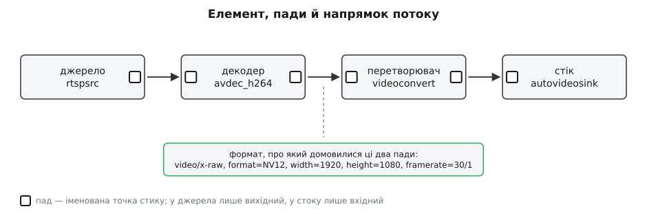
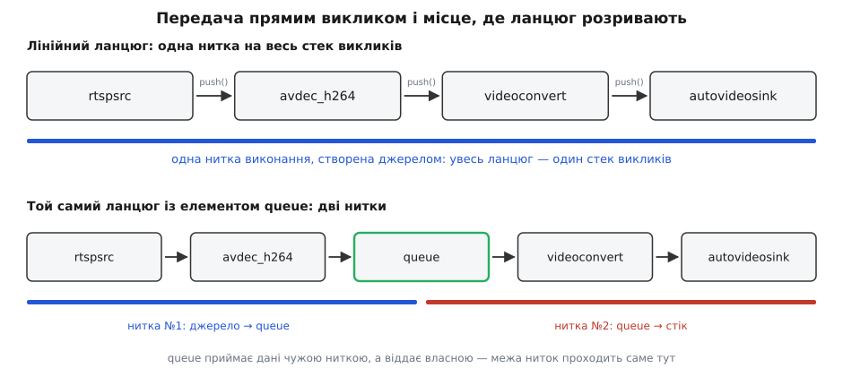
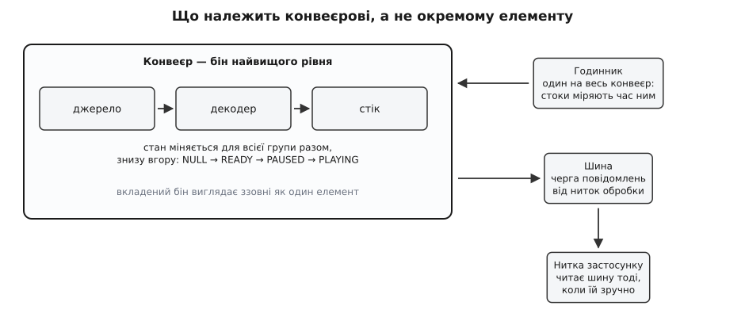

# Конвеєр: елементи, зв'язки й потік даних

<preknowlist>
- [Процеси й потоки](book:programming/process-vs-thread) — що таке нитка виконання і чому дві нитки просуваються одночасно.
- [Черга: FIFO і кільцевий буфер](book:algorithms/queue-fifo) — буфер, у який пишуть з одного кінця, а читають з іншого.
- [Підрахунок посилань](book:programming/reference-counting) — спільне володіння шматком пам'яті без копіювання.
- [Формати пікселів і буферів зображення](book:algorithms/pixel-formats) — I420, NV12, RGB: як кадр укладено в пам'ять і скільки байтів він займає.
</preknowlist>

## Задача, яку не пишуть однією програмою

Камера на даху віддає відео по мережі. Треба показати його у вікні. Робіт тут кілька, і всі різні: прийняти UDP-пакети, зібрати з них порції відеопотоку, розібрати заголовки H.264, розпакувати кадри, перевести кольори у формат, який приймає відеокарта, віддати на екран — тридцять разів на секунду, рівно, без ривків і без накопичення.

Написати під це одну програму цілком реально. Наступного тижня приходить друга задача: та сама камера, але не на екран, а у файл. Потім третя: файл із диска на екран. Потім та сама камера, тільки кодек не H.264, а H.265. Кожна задача сама по собі проста, і кожна відрізняється від сусідньої однією ланкою.

**Скільки різних програм вимагає такий підхід.**

```
джерел (файл, USB-камера, RTSP, екран, тест-генератор, UDP)   6
контейнерів (MP4, Matroska, MPEG-TS, сирий потік)             4
кодеків (H.264, H.265, VP9, MJPEG, AV1)                       5
призначень (вікно, файл, мережа)                              3

програм «під випадок»:  6 · 4 · 5 · 3 = 360
самостійних частин:     6 + 4 + 5 + 3 =  18
```

Різниця між добутком і сумою — це і є вся мотивація. Вісімнадцять написаних частин або триста шістдесят написаних програм, причому наступний кодек додає до першого числа одиницю, а до другого — сімдесят два.

Арифметика тут точно та сама, що змусила Unix зробити ставку на дрібні програми, які складаються в ланцюг: [малі програми, що складаються](book:unix-linux/unix-philosophy) — там показано, чому покриття задач росте як степінь кількості частин, тоді як праця росте лінійно. Але просто взяти звідти готове рішення — байтовий канал між процесами — не вийде, і причин дві. Одна стосується формату стику, до неї дійдемо. Другу видно одразу, і вона глибша.

## Обробник мусить бути живим, а не викликом

Найприродніший спосіб порізати задачу на частини — функції: `decode(файл) → кадри`, `convert(кадри) → інші кадри`. Для медіа це не працює, і не через дрібниці.

Перше — обсяг. Півтори години 1080p у сирому вигляді, які «повертає» уявний `decode`, важать близько пів терабайта. Такого значення просто немає де розмістити.

Друге — кінця може не бути взагалі. Камера віддає кадри, доки її не вимкнуть. Функція, яка повертає результат, за визначенням мусить колись завершитися; тут завершуватися нема від чого.

Третє — обробка має пам'ять. Декодер H.264 тримає кілька вже розпакованих кадрів як опорні: наступний кадр описано не сам по собі, а різницею від них. Викинути цей стан між викликами не можна, а тягати його зовні як параметр — означає розпакувати назовні внутрішню будову декодера, тобто зруйнувати саме ту незалежність частин, заради якої все затівалося.

Четверте — темп диктує не той, хто виробляє, а той, хто споживає. Екран приймає кадр раз на 33 мілісекунди; файл на диску проковтне все, що дадуть. Функція, яка виробляє результат цілком, не має способу дізнатися про це й пригальмувати.

Отже, одиницею системи не може бути виклик. Нею мусить бути **довгоживучий обробник**, у який дані подають шматками, який між шматками тримає свій стан і який працює рівно так швидко, як його встигають слухати. Такий обробник у GStreamer називають **елементом** (element — складова частина); усередині це об'єкт, створений один раз і живий увесь час, поки триває робота.

Далі все випливає з того, що елементів багато й вони не знають один про одного. Кожен має бути **чорною скринькою з іменованими точками стику**: щось приймає з одного боку, щось віддає з іншого, а як саме — його приватна справа. Точку стику називають **падом** (pad — контактний майданчик, за аналогією з майданчиком під ніжку мікросхеми на платі).

Три звичні ролі елементів — не три різні сорти об'єктів, а прямий наслідок того, які пади в елемента є. Немає жодного вхідного пада — елемент може лише виробляти дані, і це **джерело** (source): читання з файлу, захоплення з камери, генератор тестової картинки. Немає вихідного — елемент може лише споживати, і це **стік** (sink): вікно, звукова карта, запис у файл, відправлення в мережу. Є і ті, і ті — елемент **перетворює**: розпаковує, змінює формат кольору, ділить контейнер на потоки, з'єднує потоки назад у контейнер.



*Елемент — чорна скринька з іменованими падами; роль елемента цілком визначається тим, які пади в нього є.*

Сам елемент програма не конструює — вона просить його в системи за назвою: `gst_element_factory_make("avdec_h264", NULL)`. За назвою стоїть фабрика, за фабрикою — плагін, за плагінами — реєстр, що складається під час встановлення бібліотек. Це та сама схема, що й у будь-якій [плагінній архітектурі](book:programming/plugin-architecture): ядро не знає жодного кодека поіменно, зате знає, як спитати про потрібний. Як влаштовано реєстр і чому елемент з'являється в системі просто від того, що поруч поклали `.so`-файл, розібрано окремо — [модель плагінів](book:media-vision/plugin-model).

Налаштовують елемент **властивостями**: `latency=200`, `location=rtsp://…`, `sync=true`. Властивість — не поле структури, а іменована пара «прочитати/записати» з описом типу й меж, тому її можна виставити з текстового рядка, не компілюючи нічого. Це дає [об'єктна система GObject](book:media-vision/gobject-basics), на якій стоїть уся бібліотека; звідти ж беруться сигнали, якими елемент сповіщає програму про події.

## Стик: чому «просто байти» тут не працюють

Тепер до першої відкладеної причини. У Unix стик між програмами — потік байтів, які людина читає як текст, і цього досить: рядок сам себе описує. Кадр себе не описує ніяк.

**Той самий шматок пам'яті — три різні зображення.**

```
3 110 400 байтів — це:
  1920 × 1080, NV12  (1.5 байта на піксель)   → 3 110 400
  1440 ×  720, RGB   (3 байти на піксель)     → 3 110 400
   960 ×  540, RGBA  (4 байти на піксель)     → 2 073 600  ← не збігається
```

Перші два рядки дають байт у байт однаковий блок. Ніщо в самих байтах не підказує, який із них правильний: сирий кадр — це прямокутна табличка чисел без жодного заголовка. Мало того, елемент, який його прийняв, мусить знати ще й частоту кадрів (інакше нема від чого рахувати час), і порядок площин, і чи повний діапазон яскравості, і колірну матрицю.

Звідси перша вимога до стику: **пад мусить нести опис того, що через нього тече**. Такий опис у GStreamer називають **caps** (від capabilities — можливості): ім'я типу плюс набір іменованих полів, наприклад `video/x-raw, format=NV12, width=1920, height=1080, framerate=30/1`.

Друга вимога жорсткіша й не така очевидна. Цей опис **не можна зафіксувати заздалегідь**. Коли програма будує ланцюг для RTSP-камери, вона ще не знає ні роздільності, ні кодека, ні частоти: усе це з'ясується з заголовків потоку через частку секунди після з'єднання. Тому пади не просто мають формат — вони **домовляються** про нього під час запуску, перебираючи те, що вміє віддавати один і що приймає інший. Механіку цієї домовленості — від шаблонів падів до перетину множин і перевибору формату на льоту — розібрано в темі [узгодження caps](book:media-vision/caps-negotiation), а те, як пади створюються, іменуються й з'єднуються (зокрема ті, що з'являються лише тоді, коли демультиплексор побачив у файлі другу звукову доріжку), — у темі [пади і з'єднання](book:media-vision/pads-and-linking).

Тепер видно, чому байтовий канал сюди не переносять. Канал передає вміст; стик тут мусить передавати вміст **разом із контрактом на нього** — і контракт цей узгоджується під час роботи, а не пишеться в коді.

## Як кадр насправді переїжджає до сусіда

Слово «потік даних» підказує картинку з буфером між елементами: один пише, другий вичитує. Це не так, і саме тут ховається найважливіша властивість усієї моделі.

Коли елемент має готовий кадр, він викликає `gst_pad_push()` на своєму вихідному паді. Функція знаходить пад, до якого його під'єднали, і **прямо викликає його функцію обробки**.

```c
/* елемент, у якого готовий кадр, віддає його вниз: */
GstFlowReturn ret = gst_pad_push (self->srcpad, buf);

/* усередині gst_pad_push, стиснуто до суті: */
GstPad *peer = GST_PAD_PEER (pad);              /* пад, до якого нас з'єднали */
return peer->chainfunc (peer, parent, buf);     /* прямий виклик сусіда */

/* а це — те, що сусід зареєстрував як свою обробку: */
static GstFlowReturn
my_filter_chain (GstPad *pad, GstObject *parent, GstBuffer *buf)
{
  MyFilter *self = MY_FILTER (parent);
  /* ... обробити buf ... */
  return gst_pad_push (self->srcpad, buf);      /* і далі, наступному */
}
```

Наслідок разючий: **увесь ланцюг виконується як один стек викликів**. Джерело викликає обробку демультиплексора, той — обробку декодера, той — обробку перетворювача, той — обробку стоку; коли стік намалював кадр, керування розкручується назад тим самим стеком до джерела. Ніякої черги, ніякого планувальника, ніякого перемикання контексту: передача кадру сусідові коштує стільки, скільки коштує виклик функції за вказівником.

Сам кадр при цьому не копіюють. Через пади передають вказівник на **буфер** (GstBuffer) — обгортку над шматком пам'яті з лічильником посилань і мітками часу. Чому саме так, а не копією, видно з арифметики.

**Скільки коштувала б одна зайва копія кадру.**

```
кадр 1920×1080 у форматі NV12:
  площина яскравості  1920 · 1080 = 2 073 600 Б
  площина кольору     1920 ·  540 = 1 036 800 Б
  разом                           = 3 110 400 Б ≈ 2.97 МіБ

при 30 кадрах на секунду:
  3 110 400 · 30 = 93 312 000 Б/с ≈ 89 МіБ/с   ← на КОЖНУ копію

ланцюг із п'яти ланок, якби кожна копіювала:
  89 · 5 ≈ 445 МіБ/с чистого memcpy на один потік
```

Для одного потоку в 1080p це вже помітна частка смуги пам'яті; для чотирьох камер у 4K — вирок. Тому кадр мандрує ланцюгом як вказівник, а право його змінювати регулює [лічильник посилань](book:programming/reference-counting): поки на буфер посилається лише один власник, елемент може писати в нього на місці; щойно посилань більше — писати не можна, треба спершу відщепити свою копію. Звідки береться пам'ять під буфер, хто її виділяє й як кадр доїжджає від камери до відеокарти взагалі без жодного дотику центрального процесора — у темі [буфери й пам'ять](book:media-vision/buffers-and-memory).

## Хто крутить педалі

У ланцюзі з викликів немає власного двигуна. Хтось мусить викликати перший `push` — і робити це знову й знову.

Цей хтось — джерело. Коли конвеєр готується до роботи, він активує пади елементів, і на вихідному паді джерела з'являється **задача** (GstTask) — окрема нитка виконання, яка в циклі виробляє порцію даних і штовхає її вниз. Один такий цикл прокручує ланцюг цілком. Режим, у якому дані штовхають згори вниз, називають **push**; він у GStreamer основний, і саме в нього пади переходять під час активації за замовчуванням.

Є й дзеркальний режим — **pull**. Тут двигун стоїть унизу: елемент викликає `gst_pad_pull_range()` на своєму вхідному паді й просить у сусіда згори конкретний діапазон байтів. Так працюють там, де джерело вміє випадковий доступ, а споживач сам вирішує, куди стрибати: розбирач контейнера, який читає з файлу таблиці зміщень і одразу перескакує в потрібне місце. Режим не задають зверху — його з'ясовують пади під час активації: спершу пробують той, що потрібен споживачеві, і відступають до push, якщо джерело випадкового доступу не вміє.

## Нитки — властивість топології, а не елемента

З того, що передача кадру — це виклик функції, випливає річ, яку легко проґавити й через яку потім довго дивуються.

**Лінійний ланцюг цілком виконується в одній нитці.** Джерело, розбирач, декодер, перетворювач, стік — усі вони працюють по черзі всередині одного стеку, який прокручує нитка, створена джерелом. Це має два боки. Хороший: дані не мандрують між нитками, тож на шляху кадру не потрібен жоден замок. Поганий: поки стік малює кадр, декодер простоює, хоча ядер у машині вісім.

Щоб частини ланцюга запрацювали одночасно, стек викликів треба десь **розірвати**. Саме це й робить елемент `queue`. На вхідному паді в нього звичайна функція обробки — сусід згори штовхає туди кадри й одразу повертається. На вихідному паді в нього власна задача, тобто **власна нитка**, яка витягає кадри зі списку й штовхає далі вниз. Ланцюг, у якому стоїть `queue`, виконується вже двома нитками: до черги — однією, після черги — другою.



*Кожен `queue` — це не просто буфер, а межа між нитками: до нього працює одна нитка, після нього починається інша.*

Звідси всі практичні правила щодо `queue`, які інакше виглядають забобонами. Після `tee`, що роздвоює потік, черга потрібна на кожній гілці: без неї обидві гілки крутить одна нитка, і гілка, що пише у файл, гальмуватиме гілку, що малює на екран, а за невдалого збігу вони й зовсім заклиняться, чекаючи одна одну. Після демультиплексора черга потрібна на кожному потоці: відео й звук інакше йтимуть по черзі однією ниткою, і достатньо звуковому стоку затриматися на десяту частку секунди, щоб зупинилося декодування відео.

> 🔧 **Навіщо це.** Коли конвеєр «підвисає» на старті або гілка відео йде ривками, першим ділом дивляться не на кодек, а на топологію: скільки в ній ниток і чи не змушено дві незалежні роботи ділити одну. Один доданий `queue` у правильному місці лікує це надійніше за будь-які налаштування декодера — але кожна така черга додає до затримки рівно стільки, скільки в ній устигає накопичитися даних, тож ставлять їх точково, а не всюди.

## Чому конвеєр не захлинається

Модель із прямими викликами дарує ще одну властивість, за яку в інших системах доводиться боротися окремо.

Якщо стік не встигає, він просто не повертається зі своєї функції обробки, доки не намалює кадр. Отже, не повертається й декодер, і розбирач, і джерело — нитка стоїть у глибині стеку й чекає. Виробник фізично не може випередити споживача, бо виробник і споживач — це один і той самий виклик. **Протитиск** тут не механізм, а побічний ефект способу передачі; загальну ідею й те, коли її доводиться будувати руками, розібрано окремо: [протитиск](book:algorithms/backpressure).

Там, де ланцюг розірвано чергою, протитиск доводиться відтворювати явно — і `queue` це робить. Він тримає три межі одночасно й блокує вхід, щойно спрацює будь-яка з них: 200 буферів, 10 мегабайтів або одна секунда даних за замовчуванням. Для живого джерела блокувати не можна — камера не пригальмує, пакети просто загубляться десь у ядрі; тому в черги є режим `leaky`, у якому вона свідомо викидає найстаріші (або найновіші) кадри замість того, щоб зупиняти потік. Це класична пара [виробник–споживач](book:programming/producer-consumer), тільки з правом програти повільному споживачеві частиною даних.

Зворотний зв'язок ходить і у вигляді значень. `gst_pad_push()` повертає код: `GST_FLOW_OK` — усе добре; `GST_FLOW_FLUSHING` — конвеєр зупиняють, кидай роботу; `GST_FLOW_EOS` — унизу вже нікому приймати; `GST_FLOW_NOT_LINKED` — цей пад нікуди не веде; `GST_FLOW_ERROR` — сталася біда. Елемент, що штовхав дані, зобов'язаний повернути цей код своєму верхньому сусідові, і так до самого джерела, яке на першому ж не-`OK` зупиняє свою задачу. Помилка тут — не виняток, а значення, що піднімається ланцюгом угору.

## Падами тече не лише вміст

Якби через пади ходили самі кадри, стик був би трубою. Але труби мало: елементам треба ще й розмовляти.

Разом із даними, у тому самому порядку, вниз ідуть **події**: `STREAM_START` — почався потік; `CAPS` — ось узгоджений формат, далі буде саме такий; `SEGMENT` — ось як переводити мітки часу буферів у час відтворення; `EOS` — дані скінчилися. Порядок тут значущий: подія `CAPS` стоїть у потоці перед першим буфером нового формату, тому елемент нижче дізнається про зміну роздільності рівно тоді, коли надійде перший кадр у новій роздільності, — ні раніше, ні пізніше.

Угору, проти течії, ходять інші події. `SEEK` — перемотати; `RECONFIGURE` — я змінив свої вимоги, домовтеся про формат заново; `QOS` — повідомлення від стоку про те, що кадри приходять запізно, і декодерові варто щось прискорити або пропустити. Останнє й робить показ живим: стік не мовчки викидає запізнілі кадри, а каже про це вгору, і декодер, який уміє, пропускає ті кадри, від яких не залежать наступні.

Крім подій є **запити**, на які відповідають негайно: скільки триває матеріал, де ми зараз, які формати ти взагалі приймаєш, яка в тебе затримка. Запит іде ланцюгом, доки хтось не зможе відповісти.

Тобто пад — не отвір для байтів, а маленький протокол: дані, події в обидва боки й синхронні запити. Через це ланцюг GStreamer і не зводиться до Unix-каналу, хоча виріс із тієї самої ідеї.

## Конвеєр як об'єкт, а не як малюнок

Слово «конвеєр» досі означало картинку: елементи, з'єднані стрілками. Але **конвеєр** (pipeline) у GStreamer — це справжній об'єкт, і в нього є обов'язки, яких не може мати жоден окремий елемент.

Почати треба з проміжної речі. Елемент, який містить у собі інші елементи й назовні виглядає як один елемент, називають **біном** (bin — скринька, ящик). Бін має власні пади, які насправді є «привидами» падів елементів усередині: те, що з'єднують ззовні, потрапляє прямо на внутрішню ланку. Це дає композицію будь-якої глибини: готовий вузол із п'яти елементів вставляють у чужий ланцюг як одну деталь, і той, хто вставляє, не мусить знати про його нутрощі. Саме так влаштовані готові вузли на кшталт `playbin` чи `uridecodebin`, які самі добирають потрібні декодери під те, що приїхало.

Конвеєр — це бін найвищого рівня, і додатково він відповідає за три речі, які **за природою спільні** для всієї групи й не можуть належати комусь одному.

**Стан.** Елементи не запускають поодинці: конвеєр переводить усю групу через сходинку станів `NULL → READY → PAUSED → PLAYING`, причому переходи розсилає знизу вгору — спершу стокам, потім тим, хто вище. Порядок не примха: якщо перевести в роботу джерело раніше, ніж стік, перші кадри приїдуть нікуди. Стан `PAUSED` існує окремо від `PLAYING` саме тому, що перед показом треба довести до стоку перший кадр і на ньому зупинитися, — інакше час старту стрибав би на випадкову величину. Механіка переходів, попереднє наповнення і те, звідки береться асинхронна відповідь на зміну стану, — у темі [стани конвеєра](book:media-vision/states-lifecycle).

**Годинник.** У конвеєрі всі стоки міряють час одним і тим самим годинником, і вибирає його конвеєр. Без спільного годинника звук і відео розповзуться: два стоки, що йдуть кожен своїм лічильником, розійдуться на секунду за годину роботи навіть за розбіжності в частках проміле. Кожен буфер несе мітку часу, конвеєр запам'ятовує момент старту, і стік показує кадр не тоді, коли той приїхав, а тоді, коли настане його час. Як мітки перетворюються на моменти показу — у темі [годинник і синхронізація](book:media-vision/clock-and-sync).

**Шина.** Обробка живе в нитках, створених задачами, а програма — у своїй. Нитці обробки не можна ні торкатися інтерфейсу користувача, ні зупинятися й чекати, поки програма щось вирішить. Тому все, що елемент хоче сказати назовні — помилку, попередження, зміну стану, кінець потоку, — він кладе повідомленням у **шину**, а програма забирає його зі своєї нитки, коли їй зручно. Шина — єдиний безпечний місток між обробкою й застосунком, і саме через неї програма дізнається, що камера відпала. Докладніше — [шина повідомлень](book:media-vision/bus-and-messages).



*Стан, годинник і шина належать конвеєрові, а не елементам: кожна з цих трьох речей за природою спільна для всієї групи.*

## Де в цій моделі береться затримка

Тепер можна назвати місця, у яких зникає час, — і виявиться, що всі вони прямо випливають зі сказаного.

Живе джерело мусить зібрати цілий кадр, перш ніж віддати його далі; це вже один кадровий інтервал. Приймач мережевого потоку навмисно тримає паузу, щоб дочекатися пакетів, які прийшли не по порядку. Декодер із двобічним передбаченням тримає кілька кадрів, бо показувати їх треба не в тому порядку, у якому вони приїхали. Кожна черга — це стільки затримки, скільки в ній зараз лежить даних. І нарешті стік свідомо чекає до належного моменту за годинником замість того, щоб малювати одразу.

Ці затримки не складають на око — їх **питають**. Конвеєр розсилає запит `LATENCY`, кожен елемент дописує до відповіді свою, і конвеєр повідомляє стокам одне спільне число: на скільки треба відсунути показ, щоб найповільніша гілка встигала. Тому в правильно налаштованому конвеєрі звук і відео однаково запізнюються, а не розсинхронізовуються.

**Звідки беруться приблизно 300 мілісекунд у типовому перегляді RTSP-камери.**

```
оголошують свою затримку:
  джерело: пакетує цілий кадр при 30 к/с      33 мс
  rtpjitterbuffer: latency=200 за замовчуванням  200 мс
  декодер: тримає 2 кадри для переупорядкування   66 мс
                                              ──────
  конвеєр роздає стокам                        299 мс

фактично додається понад те:
  дані, що лежать у чергах на момент показу    ~20 мс
                                              ──────
  від об'єктива до пікселя                    ~320 мс
```

Дві третини цього числа — одна властивість одного елемента. Знизити її можна, але не безкоштовно: чим коротша пауза на прийомі, тим більше пакетів вважатимуться загубленими просто тому, що спізнилися. Це і є головний обмін у цій моделі, і розібрано його в темі [затримка й буферизація](book:media-vision/latency-and-buffering); звідки взагалі береться розкид часу приходу пакетів — у темі [джитер](book:communications/jitter).

## Рядок, що описує конвеєр

Оскільки елемент береться за назвою, а властивість виставляється з тексту, увесь ланцюг можна записати одним рядком — і саме так його зазвичай спершу пробують:

```sh
gst-launch-1.0 rtspsrc location=rtsp://192.168.1.90/stream latency=200 \
  ! rtph264depay ! h264parse ! avdec_h264 \
  ! videoconvert ! video/x-raw,format=I420 \
  ! queue ! autovideosink sync=true
```

Знак `!` тут — з'єднання двох сусідніх елементів, `ключ=значення` — властивість, а вкраплення `video/x-raw,format=I420` — не елемент, а **обмеження на стик**: воно нічого не робить із даними, лише звужує те, про що дозволено домовитися падам. Повний опис цієї маленької мови — іменовані елементи, посилання на конкретний пад через крапку, розгалуження через `tee` — зібрано окремо: [синтаксис опису конвеєра](book:media-vision/pipeline-model/api-gst-launch-syntax.md).

Цей рядок — інструмент перевірки, а не спосіб писати програми. У ньому нема ні обробки помилок, ні реакції на пади, що з'являються під час роботи, ні доступу до кадрів із власного коду. Як зібрати той самий ланцюг руками, підписатися на шину й коректно все погасити — показано в окремому розборі: [перший конвеєр у коді](book:media-vision/pipeline-model/proj-first-pipeline.md). Як забрати кадри з конвеєра у свій код або, навпаки, подати туди свої — у темі [appsink і appsrc](book:media-vision/appsink-appsrc).

## Що ця модель коштує

Плата за розкладання на елементи однакова скрізь, де систему збирають із незалежних частин, і тут вона має три конкретні обличчя.

Ланцюг може не зібратися, і причина буде не в коді, а в домовленості: сусіди не знайшли спільного формату, і конвеєр стає з помилкою `not-negotiated`, хоча кожен елемент окремо справний. Ланцюг може заклинити, і причина буде не в елементі, а в топології: дві гілки після `tee` без черг чекають одна одну. Ланцюг може працювати ідеально й давати пів секунди затримки, і причина буде розмазана по п'яти місцях, жодне з яких саме по собі не винне.

Спільне в цих трьох бідах те, що жодну не видно в коді елемента. Конвеєр — це маленька розподілена система всередині одного процесу: незалежні частини, домовленість про контракт під час роботи, кілька ниток і спільний час. Через це його й діагностують не покроковим відлагоджувачем, а тими самими засобами, якими дивляться на розподілені системи, — знімком графа, журналом переходів і замірами на межах; про це — [діагностика конвеєра](book:media-vision/pipeline-debugging).

Звідки взялася сама ця модель і чому вона виглядає саме так — з дослідницького проєкту кінця дев'яностих і з оглядки на чужі помилки — розказано окремо: [як народився GStreamer](book:media-vision/pipeline-model/hist-gstreamer-birth.md).
