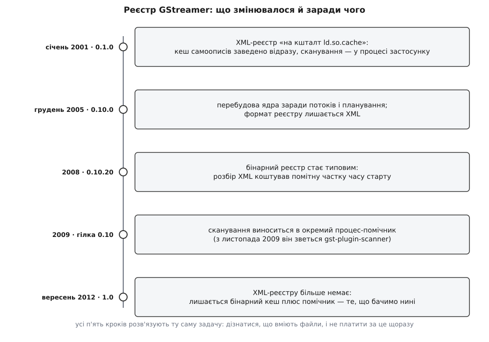

# 📜 Звідки взялася модель плагінів GStreamer

Нинішня конструкція — ядро без кодеків, окремі файли-плагіни, кеш їхніх самоописів і окремий процес, що ці файли обнюхує, — складалася двадцять із гаком років, і майже кожна її частина з'явилася як відповідь на конкретну біду, а не як задум архітектора. Тут — хто ці біди мав, коли й що саме вирішив.

## Медіа в Лінуксі 1999 року

Щоб зрозуміти задум, треба уявити, з чим мав справу той, хто в 1999-му хотів програти на Лінуксі відеофайл. Формати сипалися один за одним: MPEG-1 для відеодисків, MP3, MPEG-2 для DVD, RealPlayer, Sorenson у трейлерах Apple, MPEG-4, а невдовзі TrueMotion VP3. Кожен програвач ніс власний набір декодерів усередині себе. Хочеш нового формату — чекай нової версії програвача; хочеш той самий декодер у своєму застосунку — копіюй код.

Вільна відповідь на це визрівала майже одночасно й у кількох місцях: aRts (1999), mplayer і Xine (2000), FFmpeg (2000), VLC (2001). Усі, крім одного, розв'язували задачу «зробити добрий програвач». GStreamer від початку розв'язував іншу — «зробити те, з чого програвачі складають».

## Ерік Вальтінсен і дослідницький конвеєр в Орегоні

Проєкт заснував 1999 року Ерік Вальтінсен (Erik Walthinsen) — у ту пору людина з Орегонського інституту післядипломної освіти (Oregon Graduate Institute, OGI), і сліди цього досі лежать у сирцях: заголовки найстаріших файлів ядра підписані «Copyright (C) 1999,2000 Erik Walthinsen <omega@cse.ogi.edu>». Ядро ідей прийшло з тамтешнього дослідницького проєкту, де медіа вже описували як конвеєр обробки. За переказом самого Вальтінсена задум склався в літаку; це спогад, а не документ, і приймати його варто саме так.

Версія 0.0.1 вийшла в червні 1999-го, а перший публічний випуск — 0.0.9 — датують 31 жовтня 1999 року з оголошенням у списках розсилки GNOME. Тут потрібна чесна засторога: цю дату наводять зведені хроніки проєкту, а первинного листа в архіві `gnome-announce-list` за жовтень 1999-го немає — тож статус у неї «загальноприйнято, первинного підтвердження не знайдено». Випуск був не для користувачів, а для тих, хто прийде подивитися код.

## Що взяли з DirectShow, а що відкинули

Готовий зразок такої системи на той час був один — DirectShow від Microsoft, що вийшов у травні 1996-го під ім'ям ActiveMovie. Він робив рівно те, що потім робитиме GStreamer: різав складне завдання на елементарні кроки-фільтри, кожен фільтр мав вхідні й вихідні контакти (pins), а програма будувала з них граф і запускала.

З DirectShow узяли три речі, і всі три живі досі. Перша — сама ідея графа з окремих елементів замість монолітного програвача. Друга — контакти як типовані точки стику, бо саме вони дають змогу питати «а це можна з'єднати?», не створюючи об'єктів. Третя, найважливіша для нашої теми, — глобальний реєстр фільтрів із числом переваги (merit), яким менеджер графа впорядковує кандидатів, коли добирає ланцюжок автоматично. У GStreamer це число зветься `rank`, і роль у нього та сама: не дозвіл, а черга спроб.

Відкинули те, що прив'язувало DirectShow до Windows: реєстр операційної системи як сховище описів, COM як спосіб знаходити й створювати об'єкти, і взагалі уявлення, що каталог фільтрів — це справа системи. Для переносної бібліотеки все це не годилося, і реєстр довелося робити своїм. Далі саме цей реєстр і буде головним героєм.

## «Slipstream», січень 2001: реєстр як ld.so.cache

Перший великий випуск 0.1.0 з іменем «Slipstream» оголосили 11 січня 2001 року (лист у поштовому архіві датовано 10 січня — різниця часових поясів, не суперечність). Оголошення підписали Ерік Вальтінсен, Вім Тайманс і Річард Боултон, і в переліку властивостей стоїть фраза, яка пояснює всю подальшу конструкцію: динамічно завантажувані плагіни описані через «an XML registry, similar to ld.so.cache».

Порівняння вибрано не для краси. `ld.so.cache` — це кеш динамічного компонувальника: система один раз обходить теки з бібліотеками, запам'ятовує, яка бібліотека де лежить, і потім кожен запуск програми користується готовим списком замість повторного обходу. Автори GStreamer узяли цю ідею й посилили: їм замало знати, **де** лежить файл, треба знати, **що він уміє** — які елементи в ньому, які формати вони беруть, який у них ранг. Так з'явився кеш самоописів, і разом із ним — усі його вічні болячки, бо кеш за визначенням є другим джерелом правди, яке може розійтися з першим.

Варто оцінити, наскільки рано це сталося. Задум «плагіни описують себе, ядро кешує описи, автопідбір працює з кешем» стоїть уже в першому публічному релізі 2001 року. Усе, що відбувалося далі, — не зміна задуму, а двадцять років боротьби з його ціною.

> 🔧 **Навіщо це.** Знання про походження тут має пряму експлуатаційну користь: якщо реєстр — родич `ld.so.cache`, то й хвороби в нього родинні. Застарілий кеш, який показує неправду про наявні файли; тека, яку забули додати до шляху пошуку; дві копії однієї бібліотеки, з яких виграє випадкова. Хто вже налагоджував «чому підхопилася не та `.so`», той упізнає всі симптоми реєстру GStreamer з першого погляду — механізм, який їх породжує, той самий. Точна механіка пошуку й підміни описана в [динамічному лінкуванні](book:programming/dynamic-linking).

## Вім Тайманс і друге ядро

Вім Тайманс (Wim Taymans) приєднався невдовзі після 0.1.0 і скоро став головним автором ядра — за оцінкою 2010 року він вів проєкт десять із його одинадцяти років. Внесок його стосується саме тієї частини, яка робить модель плагінів придатною до вжитку: планування виконання, робота з потоками, узгодження форматів, стани конвеєра.

Історія тут не героїчна, а звичайна для вільних проєктів. Ерік Вальтінсен утратив інтерес до проєкту приблизно 2002–2003 років; Вім теж вигорів улітку 2003-го й повернувся, коли постало питання руба: або GStreamer працюватиме до виходу GNOME 2.6, або в робочому столі буде щось інше. Обіцянку виконали — GNOME 2.6 у квітні 2004-го вийшов із гілкою 0.8.

Потім сталося те, що великі перебудови взагалі уможливлює: гроші. Nokia з 2004–2005 років тихо фінансувала купу проєктів вільного ПЗ, серед них і роботу над гілкою 0.9/0.10, а Жульєн Мутт заснував Fluendo (січень 2004) — першу консалтингову компанію навколо GStreamer. Саме тому перебудова 0.9, яку почали зливати в березні 2005-го, пішла незвично швидко й уже в грудні 2005-го дала 0.10.0. Далі гілка 0.10 прожила сім років і саме на ній визріли всі зміни реєстру.

## Реєстр: від XML до бінарного кешу

Тепер друга лінія — як змінювався сам кеш. Її часто переказують спрощено: мовляв, у 0.10 був повільний XML, а в 1.0 зробили бінарний реєстр із окремим сканером. Це неправда в обох половинах, і справжня послідовність цікавіша.

*Обидві ключові зміни — бінарний формат і окремий процес — сталися всередині гілки 0.10; випуск 1.0 лише прибрав старий шлях.*

XML тримався від 0.1.0 до кінця 0.8 і далі в 0.10. Розплата була проста: щоб дізнатися, що є в системі, застосунок мусив розібрати текстовий документ на кілька сотень кілобайтів — і робити це при кожному старті. Для програвача на робочому столі це дратувало, для приладу, що вмикається за секунду, було неприйнятно.

Бінарний формат спершу з'явився як необов'язковий, а типовим став у випуску 0.10.20 (2008): у переліку змін так і записано — «Use the binary registry by default», поруч із виправленнями невирівняного доступу до пам'яті й додаванням контрольних сум. Ці сусідні рядки багато говорять про ціну рішення: бінарний кеш читається швидко саме тому, що його відображають у пам'ять і йдуть по ньому вказівниками, а за це доводиться самому стежити за вирівнюванням і псуванням даних, чого текстовий формат не вимагав.

## Чому сканування вигнали з процесу

Швидке читання кешу не рятувало від другої халепи, значно неприємнішої. Коли кеш не збігається з диском, ядро мусить **відкрити** підозрілий файл і виконати його `plugin_init` — тобто запустити у власному адресному просторі чужий код, зібраний невідомо ким і невідомо коли. Плагін, що впав під час ініціалізації, забирав із собою застосунок. Не медіафайл зламав програвач — його зламало саме опитування «а що в тебе всередині».

Виносити цю роботу в окремий процес почав Ян Шмідт (Jan Schmidt): комміт із промовистою назвою «registry: Add registry helper phase 1» датований березнем 2009-го, друга фаза навчила помічника приймати список файлів і віддавати результати асинхронно, щоб не бігати між процесами по одному. У листопаді 2009-го помічника перейменували на `gst-plugin-scanner` і поклали в окрему теку, версійовану разом із бібліотекою. Усе це — гілка 0.10, за три роки до 1.0.

Розв'язок класичний: породжений процес має свій адресний простір, тож його падіння батька не зачіпає, а батько дізнається про біду зі статусу завершення дитини — механіка описана в [семантиці fork](book:unix-linux/fork-semantics). Побічний виграш виявився не менш цінним, ніж основний: якщо чужий код усе одно виконують в окремому процесі, то файл, на якому помічник помер, можна позначити непридатним і більше до нього не повертатися.

До того ж 2009 року з'явився ще один шматок цієї конструкції — оголошення залежностей плагіна від зовнішніх файлів, тек і змінних середовища. Знадобився він плагінам-обгорткам: такий плагін сам по собі не змінюється, зате змінюється те, що він загортає, і без явної залежності ядро не мало як помітити, що перелік доступних елементів застарів.

А от випуск 1.0 (24 вересня 2012 року) щодо реєстру зробив лише останній крок — прибрав старий XML-шлях. Те, що маємо сьогодні, побудовано в 0.10 і в 1.0 просто лишилося єдиним.

## good, bad, ugly: юридична геологія

Третя лінія — поділ плагінів на набори, і тут причини взагалі не технічні. Наборів у нинішньому вигляді чотири, з'явилися вони починаючи з гілки 0.9 (2005), а назви трьох із них — пряма цитата з фільму Серджо Леоне «Il buono, il brutto, il cattivo» 1966 року, відомого українською як «Хороший, поганий, злий». Дрібниця, яка добре показує, як легко в перекладі губиться порядок: італійський оригінал перелічує доброго, потворного й лихого, англійська назва міняє двох останніх місцями, і саме за англійським порядком названі набори GStreamer.

Офіційні описи розводять їх за двома вимірами. `base` — невеликий сталий набір, що покриває всі типові ролі елементів і йде в ногу з ядром; його дистрибутив може пакувати без роздумів. `good` — плагіни доброї якості з бажаною ліцензією: LGPL на сам плагін і LGPL або сумісна на бібліотеку під ним. `ugly` — код такої самої доброї якості й із правильною поведінкою, але з проблемами розповсюдження: не та ліцензія на бібліотеку під ним або широко відомі патентні претензії на сам формат. `bad` — усе, чому чогось бракує: рев'ю, документації, тестів, живого супровідника чи просто широкого вжитку.

Дивіться на межу між `good` і `ugly` уважно: технічної різниці між ними немає жодної. Декодер у `ugly` не гірший і не повільніший — його просто небезпечно класти в дистрибутив, бо на алгоритм є чинні патенти або на бібліотеку під ним висить умова, яку пакувальник не може виконати. Це поділ на **юридичні пласти**, і саме тому він виживає роками, тоді як технічні класифікації в проєктах змінюються щоп'ять років. Що саме означають ці умови й чому вони не складаються між собою, розібрано в темах [ліцензії відкритого коду](book:programming/open-source-licenses) та [патенти на ПЗ і патентні пули](book:programming/software-patents-and-pools).

Практичний наслідок поділу видно кожному, хто ставив Лінукс: свіжа система відтворює Ogg і не відтворює DVD, поки не доставиш окремий пакунок. Це не технічна межа фреймворку, а лінія, проведена юристами дистрибутива.

## Обгортка над FFmpeg і чому вона зветься libav

Окремо від усіх чотирьох наборів стоїть плагін-обгортка над FFmpeg — один файл, який виводить назовні десятки декодерів чужої бібліотеки. Логіка та сама, що й із поділом: величезну кількість форматів дешевше отримати, загорнувши готову бібліотеку, ніж переписуючи кожен кодек у своєму стилі, — а юридичний ризик при цьому лишається зосередженим в одному місці, яке пакувальник умикає або вимикає цілком.

Ім'я модуля розповідає окрему історію. До 2012 року він звався `gst-ffmpeg`. Потім у самій FFmpeg стався розкол, від неї відгалузилася Libav, і в циклі 1.0 модуль перейменували на `gst-libav`. Libav згодом згасла, обгортку давно збирають проти FFmpeg — а ім'я лишилося, як лишаються сліди давніх розколів у назвах пакунків. Що взагалі відбувається під час такого розходження гілок, розібрано у [форку й апстримі](book:programming/fork-and-upstream).

## Що з цього лишилося

Три лінії, які тут розплетено, зійшлися в те, що бачить сучасний користувач `gst-inspect-1.0`. Граф із елементів і контактів із числом переваги — спадок DirectShow, перетлумачений під переносну бібліотеку. Кеш самоописів — свідома калька з `ld.so.cache`, закладена ще 2001 року, разом із усіма клопотами другого джерела правди. Бінарний формат і окремий процес-сканер — дві плати за цей кеш, унесені в 2008 і 2009 роках, коли стало ясно, скільки коштує розбирати XML на старті й наскільки небезпечно виконувати чужий код у себе. І чотири набори плагінів — не інженерна ієрархія якості, а карта юридичних ризиків, застигла в іменах тек.
