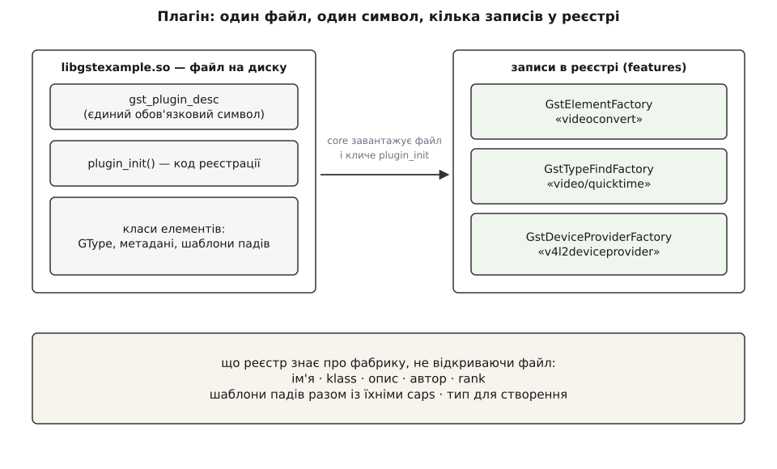
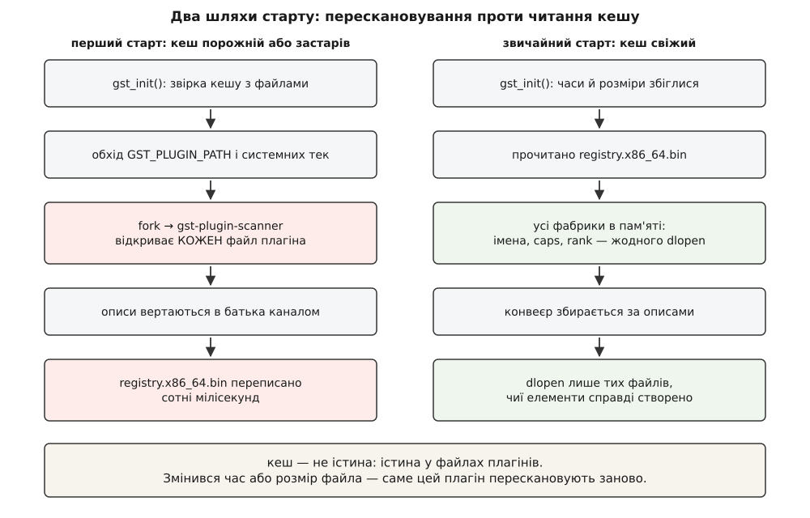
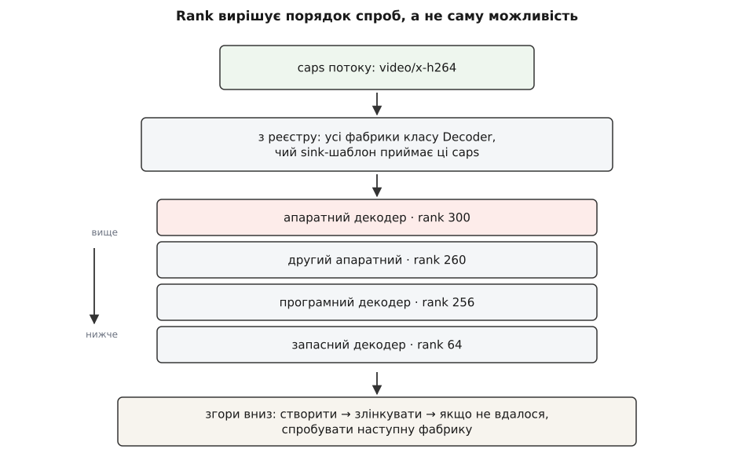

# Модель плагінів і реєстр елементів

<preknowlist>
- [Конвеєр: елементи, зв'язки й потік даних](book:media-vision/pipeline-model) — що таке елемент і як із елементів складається конвеєр.
- [Пади і з'єднання елементів](book:media-vision/pads-and-linking) — пад як точка входу-виходу елемента, напрямок і зв'язування.
- [Узгодження caps](book:media-vision/caps-negotiation) — caps як машинний опис формату даних на паді.
- [Плагіни / точки розширення](book:programming/plugin-architecture) — навіщо систему розширюють окремими модулями замість правок у ядрі.
- [Динамічне лінкування](book:programming/dynamic-linking) — як бібліотека довантажується в процес під час виконання і що таке експортований символ.
</preknowlist>

Команда `gst-launch-1.0 filesrc location=movie.mp4 ! decodebin ! autovideosink` показує відео. Дивна річ у цьому та, що в бібліотеці `libgstreamer-1.0.so` — тій самій, яку збирають із ядра проєкту, — немає жодного рядка про H.264, про контейнер MP4 і про те, як малювати кадр у вікні. Ядро вміє рахувати мітки часу, вести стани, передавати буфери між падами й розсилати повідомлення шиною. Воно не вміє нічого з того, заради чого команду взагалі запускають.

Отже, увесь корисний код лежить деінде. Питання, з якого починається все інше: як ядро дізналося, що на цій машині є щось на ім'я `decodebin`, і як воно знайшло серед сотень чужих файлів саме той, що вміє H.264.

## Чому корисний код мусить бути назовні

Ядро не може містити кодеки не з міркувань смаку, а через чотири незалежні причини, кожної з яких досить.

Формати з'являються після фреймворку. AV1 стандартизували 2018 року — на два десятиліття пізніше за перші версії GStreamer. Якби підтримка форматів жила в ядрі, кожен новий кодек означав би новий випуск ядра й перезбирання всього, що на нього спирається.

Далі — право. Декодер H.264 роками був обтяжений патентними ліцензіями, і дистрибутив, який пакує ядро як LGPL-бібліотеку, не міг покласти поруч код із іншими юридичними умовами. Розділення на файли — це водночас розділення на пакунки, які пакувальник вмикає або вимикає окремо.

Третя причина — апаратура. Код, що звертається до апаратного декодера через VA-API чи V4L2, має сенс лише там, де цей апарат є, і тягне за собою бібліотеки виробника. На машині без відповідного заліза він марний і шкідливий.

Четверта — розмір. Збірка для камери на вбудованому процесорі містить п'ять-шість потрібних елементів. Ядро, у яке вкомпільовано все на світі, туди просто не влізе.

Спільний висновок один: код, який знає конкретний формат чи конкретне залізо, живе в окремих файлах, що їх можна додати, прибрати чи замінити, не чіпаючи ядра. Такий файл і називають плагіном (англ. *plug in* — «встромити»). Але щойно код виноситься назовні, з'являється нова проблема, і решта цієї теми — про неї: ядро тепер **не знає, що воно має**.

## Плагін як файл: один символ і одна функція

Фізично плагін — це звичайна спільна бібліотека: `libgstvideoconvert.so` на Linux, `.dll` на Windows, `.dylib` на macOS. Ніякого особливого формату немає, і завантажують її тими самими засобами операційної системи, що й будь-яку іншу бібліотеку.

Особливе в ній лише одне: вона зобов'язана експортувати **один умовлений символ** — структуру-дескриптор. Ядро шукає її двома заходами. Спершу воно виводить ім'я символу з імені файла: відкидає префікс `lib`/`libgst`/`gst`, бере частину до крапки, замінює дефіси підкресленнями і складає `gst_plugin_<name>_get_desc` — функцію, що повертає дескриптор. Якщо такої нема, ядро шукає символ на просте ім'я `gst_plugin_desc`. Дві форми потрібні, бо в статичній збірці (де всі плагіни вкомпільовано в застосунок) однакове ім'я `gst_plugin_desc` у двох плагінах зіштовхнулося б; ім'я, виведене з файла, унікальне.

Дескриптор заповнює один макрос:

```c
static gboolean
plugin_init (GstPlugin * plugin)
{
  return gst_element_register (plugin, "myfilter", GST_RANK_NONE,
      GST_TYPE_MY_FILTER);
}

GST_PLUGIN_DEFINE (GST_VERSION_MAJOR, GST_VERSION_MINOR,
    myfilter,                          /* коротке ім'я плагіна */
    "Приклад власного фільтра",
    plugin_init, "1.0", "LGPL", "myplugins", "https://example.org")
```

Дивіться, чого в дескрипторі **немає**. У ньому немає переліку елементів. Немає жодного слова про формати, які плагін обробляє. Є версія ядра, під яке його зібрано, ліцензія, ім'я пакунка, походження — і вказівник на `plugin_init`. Усе, що плагін насправді вміє, стає відомим лише тоді, коли `plugin_init` виконали. А виконати її можна, тільки завантаживши файл у процес.

Це і є те вузьке місце, з якого виростає решта конструкції.



*Файл не описує себе ззовні: перелік того, що в ньому є, з'являється тільки після виконання коду всередині нього.*

## Фабрика: опис, який можна розглядати, нічого не створивши

Виклик `gst_element_register` у прикладі вище створює **фабрику елемента** — окремий об'єкт, що описує клас елементів, але не є елементом. Різниця тут не термінологічна, а несуча.

Щоб зібрати конвеєр для невідомого наперед потоку, треба **порівняти кандидатів**: цей декодер приймає H.264, той — VP9, третій приймає H.264, але тільки з апаратного буфера. Якби єдиним способом дізнатися про елемент було його створити, то вибір із сорока кандидатів коштував би сорока створених об'єктів — з відкриттям пристроїв, виділенням буферів і запуском потоків усередині. Тому опис відділено від примірника: фабрика — це паспорт, і читати паспорт дешево.

Що саме в паспорті. Ім'я, за яким елемент замовляють (`videoconvert`, `h264parse`). Метадані: людська назва, рядок `klass` на кшталт `Codec/Decoder/Video`, опис, автор. Шаблони падів — які пади елемент матиме, у який бік, чи вони є завжди, чи з'являються за потребою, і головне — **які caps ці пади оголошують**. І число `rank`, про яке трохи далі. Плюс, звісно, тип, який треба створити, коли справа таки дійде до створення.

Усе це фабрика витягає з класу елемента, а клас заповнює себе сам під час ініціалізації:

```c
static GstStaticPadTemplate sink_template =
GST_STATIC_PAD_TEMPLATE ("sink", GST_PAD_SINK, GST_PAD_ALWAYS,
    GST_STATIC_CAPS ("video/x-h264, stream-format=(string)byte-stream"));

static void
gst_my_filter_class_init (GstMyFilterClass * klass)
{
  GstElementClass *ec = GST_ELEMENT_CLASS (klass);

  gst_element_class_set_static_metadata (ec,
      "Мій фільтр", "Filter/Effect/Video",
      "Робить із кадром щось корисне", "Ім'я <mail@example.org>");
  gst_element_class_add_static_pad_template (ec, &sink_template);
}
```

Ключове слово тут — `static`: і шаблони, і метадані відомі ще до того, як з'явиться бодай один об'єкт. Саме тому їх можна забрати з класу й покласти в реєстр — а потім користуватися ними, коли класу в пам'яті немає взагалі.

Фабрика елемента — найважливіший, але не єдиний вид записів, які створює `plugin_init`. Поруч живуть розпізнавачі типів (вони за першими байтами потоку кажуть, що це за контейнер), постачальники пристроїв (перелічують камери й звукові карти), трасувальники, динамічні типи для caps. Спільна назва для всіх — **фічі** (англ. *feature* — «властивість, риса»), і реєстр працює з ними однаково.

> 🔧 **Навіщо це.** Коли пишете власний елемент, метадані й шаблони падів здаються формальністю, яку заповнюють абияк. Насправді це єдине, що про ваш елемент побачить система автопідбору: неправильні caps у шаблоні — і `decodebin` ніколи вас не вибере, хоча елемент цілком робочий, бо відсіє вас ще до створення. Рядок `klass` теж не декоративний: із нього виводиться категорія, за якою фабрику шукають у переліках.

## Скільки коштує чесна відповідь

Тепер порахуймо, у що обходиться дізнатися все про всі плагіни чесним способом — відкриваючи кожен файл.

**Умова: типова десктопна збірка з наборами base, good, bad, ugly і обгорткою над FFmpeg — близько 250 файлів плагінів і приблизно 1700 фабрик елементів.**

```
відкрити один плагін: dlopen, релокації символів,
plugin_init із реєстрацією типів у об'єктній системі   ≈ 1.2 мс
усі 250 файлів                    = 250 · 1.2 мс       ≈ 300 мс
прочитати готовий бінарний опис усіх фіч (≈ 2 МБ)      ≈ 5 мс
різниця на КОЖНОМУ запуску процесу = 300 − 5           ≈ 0.3 с
```

Числа тут — порядок величини, а не виміряна константа: на повільному вбудованому процесорі з повільною пам'яттю різниця виходить у кілька разів більша. Але висновок від точності не залежить. Триста мілісекунд перед першим кадром — це помітна пауза; і платить її не одна програма, а кожен процес, що бодай торкнувся GStreamer, включно з дрібними утилітами, які викликають `gst_init` заради двох елементів.

Гірше за час те, що така схема **завантажує в адресний простір застосунку весь чужий код**: драйвери виробника, обгортки над бібліотеками з сумнівною якістю, експериментальні плагіни. І робить це не тому, що вони потрібні, а лише щоб спитати «а ти взагалі хто».

Обидві біди мають одну причину — опис доступний тільки разом із кодом. Розв'язок теж один: описи треба один раз добути й **зберегти окремо від коду**.

## Реєстр: кеш самоописів

Реєстр — це збережений на диску злиток усього, що ядро дізналося про фічі, коли востаннє відкривало плагіни. Лежить він як звичайний файл кешу:

```
~/.cache/gstreamer-1.0/registry.x86_64.bin
```

Суфікс із назвою процесорної архітектури — не прикраса. Домашню теку буває змонтовано на кілька машин різної архітектури, а вміст реєстру походить із зібраного під конкретну архітектуру коду; окремий файл на архітектуру знімає це зіткнення. Шлях перекривається змінною середовища `GST_REGISTRY` — головно для тестів і для образів із незмінною кореневою файловою системою.

Формат бінарний і навмисно простий для читання суцільним блоком: сотні кілобайтів рядків і чисел, які треба розкласти по структурах, а не розібрати як розмітку. Це важливо: сенс усієї витівки в тому, щоб старт коштував одиниці мілісекунд.

Що потрапляє в реєстр: для кожного файла — його шлях, час зміни й розмір; для кожної фічі всередині — ім'я, тип фічі, метадані, шаблони падів разом із їхніми caps у текстовому вигляді, rank. Тобто рівно те, що дозволяє **порівнювати кандидатів**, не маючи в пам'яті ані байта їхнього коду.

Найважливіше правило цієї конструкції формулюється однією фразою: **істина — у файлах плагінів, реєстр — лише кеш**. Кеш заводить друге джерело правди й тим самим — обов'язок його узгоджувати; звідси всі дивні поведінки, які трапляються далі.



*Дорогий шлях проходять лише тоді, коли щось на диску змінилося; звичайний старт не відкриває жодного плагіна.*

## Як кеш звіряють із дійсністю

Під час `gst_init` ядро читає реєстр, а тоді обходить теки з плагінами: спершу шляхи з параметра `--gst-plugin-path`, далі `GST_PLUGIN_PATH`, далі `GST_PLUGIN_SYSTEM_PATH`, а якщо остання не задана — типові системні теки. Для кожного знайденого файла воно порівнює час зміни й розмір із записом у кеші. Збіглося — запис вважається чинним, файл не чіпають. Не збіглося або запису немає — цей плагін доведеться відкрити насправді.

І ось тут постає незручне питання. Відкрити означає виконати чужий код у своєму процесі. Серед двохсот п'ятдесяти файлів рано чи пізно трапиться такий, що падає на ініціалізації — через відсутній драйвер, несумісну версію залежності, звичайну ваду. Якщо це станеться в процесі застосунку, впаде застосунок — і впаде на старті, ще нічого не зробивши, з незрозумілим для користувача наслідком.

Тому перескановування винесено в **окремий процес**: ядро запускає програму-помічника `gst-plugin-scanner`, вона відкриває підозрілі файли в себе, збирає описи фіч і повертає їх батьківському процесу каналом. Падіння помічника батько бачить як звичайне завершення дочірнього процесу з сигналом і живе далі; файл, на якому помічник помер, позначають у реєстрі як непридатний, щоб не наступати на ті самі граблі щоразу. Механіка тут — класична: [окремий процес як межа збою](book:unix-linux/fork-semantics) (породження дочірнього процесу дає незалежний адресний простір, тож його падіння не зачіпає батька, а батько дізнається про це зі статусу завершення).

Поведінку перемикають дві змінні середовища. `GST_REGISTRY_FORK=no` вимикає помічника й скановує в самому процесі — корисно, коли треба зловити плагін відлагоджувачем, і шкідливо в бою. `GST_REGISTRY_UPDATE=no` забороняє оновлювати реєстр узагалі: беремо кеш як є.

> 🔧 **Навіщо це.** На пристрої з кореневою файловою системою лише для читання типова халепа виглядає так: реєстр записати нікуди, тому кожен процес щоразу перескановує всі плагіни, і кожен запуск додає ті самі сотні мілісекунд. Правильне лікування — зібрати реєстр на етапі складання образу, покласти файл поруч із плагінами, вказати на нього `GST_REGISTRY` і поставити `GST_REGISTRY_UPDATE=no`. Старт стає передбачуваним, а заразом зникає ризик, що на пристрої в полі раптом запуститься сканування.

## Ліниве завантаження: коли файл нарешті відкривають

Тепер видно, що відбувається за звичним рядком коду:

```c
GstElement *parser = gst_element_factory_make ("h264parse", NULL);
```

Ядро шукає в реєстрі — у пам'яті, без диска — фічу з іменем `h264parse`. Знаходить фабрику й дивиться, чи завантажено плагін, якому вона належить. Якщо ні — саме зараз, і тільки зараз, файл відкривають, виконують його `plugin_init`, і фабрика в пам'яті заміщається «повноцінною», з живим типом усередині. Далі за цим типом створюють об'єкт.

Наслідок простий і дуже приємний: конвеєр із восьми елементів відкриває вісім-десять файлів, а не двісті п'ятдесят. Це те саме [ліниве завантаження](book:programming/lazy-loading) — ресурс дістають у момент першого справжнього звертання, а не наперед, — доведена до логічного кінця: наперед відомо все, крім коду.

Реєстр при цьому працює як [локатор служб](book:programming/service-locator): застосунок називає рядкове ім'я, а не тип, і отримує готовий об'єкт, нічого не знаючи ні про файл, ні про бібліотеку, ні про виробника. Ціна тієї ж природи, що й у будь-якого локатора: помилку в імені видно тільки під час виконання, і виглядає вона як `NULL` замість елемента.

## Rank: політика вибору, вбудована в опис

Пошук за іменем — простий випадок: ім'я назвали, фабрику знайшли. Цікавіше, коли імені не назвали зовсім. `decodebin` отримує потік невідомого змісту й мусить сам добрати ланцюжок елементів; тут і вмикається все, заради чого реєстр збирали.

Алгоритм такий. Розпізнавачі типів кажуть, що на вході за формат. Далі з реєстру беруть усі фабрики потрібної категорії (декодери, розбирачі, демультиплексори) — категорію виводять із того самого рядка `klass`. Потім список проріджують за caps: у фабрики беруть шаблон приймального пада й перевіряють, чи перетинається він із caps наявного потоку. Той, що не перетинається, відкидають, **не завантажуючи файла**. Уцілілих упорядковують за `rank` і пробують згори вниз: створити, злінкувати, спробувати перевести конвеєр далі; не вийшло — наступний.

`rank` — просто ціле число з чотирма іменованими орієнтирами:

```
GST_RANK_NONE       =   0    не братимуть автоматично
GST_RANK_MARGINAL   =  64    візьмуть, коли нема кращого
GST_RANK_SECONDARY  = 128    цілком придатний
GST_RANK_PRIMARY    = 256    брати першим
```

Число задає автор плагіна під час реєстрації, і значення в нього рівно одне: **порядок спроб**. Rank не забороняє й не дозволяє — елемент із нульовим рангом чудово створюється на ім'я вручну, його просто ніколи не запропонує автопідбір.



*Числа тут ілюстративні: у конкретній збірці ранги інші, і саме тому їх передбачають не з голови, а запитом до реєстру.*

Ось як цей запит виглядає в коді — спершу відбір за категорією й мінімальним рангом, потім проріджування за caps, потім упорядкування:

:::tabs
```c
GList *cands = gst_element_factory_list_get_elements (
    GST_ELEMENT_FACTORY_TYPE_DECODER | GST_ELEMENT_FACTORY_TYPE_MEDIA_VIDEO,
    GST_RANK_MARGINAL);

GstCaps *caps = gst_caps_from_string ("video/x-h264");
GList *fit = gst_element_factory_list_filter (cands, caps, GST_PAD_SINK, FALSE);
fit = g_list_sort (fit, gst_plugin_feature_rank_compare_func);

for (GList *l = fit; l != NULL; l = l->next) {
  GstPluginFeature *f = GST_PLUGIN_FEATURE (l->data);
  g_print ("%-18s rank %u\n", gst_plugin_feature_get_name (f),
      gst_plugin_feature_get_rank (f));
}

gst_plugin_feature_list_free (fit);
gst_plugin_feature_list_free (cands);
gst_caps_unref (caps);
```
```py
import gi
gi.require_version("Gst", "1.0")
from gi.repository import Gst

Gst.init(None)

cands = Gst.ElementFactory.list_get_elements(
    Gst.ELEMENT_FACTORY_TYPE_DECODER | Gst.ELEMENT_FACTORY_TYPE_MEDIA_VIDEO,
    Gst.Rank.MARGINAL)

caps = Gst.Caps.from_string("video/x-h264")
fit = Gst.ElementFactory.list_filter(cands, caps, Gst.PadDirection.SINK, False)

for f in sorted(fit, key=lambda f: f.get_rank(), reverse=True):
    print("%-18s rank %u" % (f.get_name(), f.get_rank()))
```
:::

Жоден із цих рядків не відкриває плагіна: усе, що потрібно для відповіді, вже лежить у реєстрі.

Rank мінливий не тільки на етапі збірки. Застосунок може переставити його перед побудовою конвеєра викликом `gst_plugin_feature_set_rank`, а користувач — узагалі ззовні, змінною `GST_PLUGIN_FEATURE_RANK`, де перелічують пари «фіча — новий ранг». Це не милиця, а передбачений спосіб вирішувати те, що з коду плагіна вирішити не можна.

> 🔧 **Навіщо це.** Апаратні декодери часто реєструються з рангом нижчим за програмні, і це свідомо: апаратний шлях виграє в навантаженні на процесор, але програє в передбачуваності — на частині драйверів він падає, псує кадри або не тягне певних профілів. Тому типова збірка обирає безпечне, а продукт, що знає своє залізо, піднімає ранг потрібного декодера й отримує апаратний шлях, не переписуючи ані рядка логіки конвеєра. Що саме дає апаратний шлях і чим за нього платять — [апаратне декодування](book:media-vision/hardware-decode-elements): окрема родина елементів поверх VA-API, NVDEC, V4L2 та MediaCodec, зі своєю моделлю пам'яті, де кадр лишається у відеопам'яті й доступ до нього з процесора коштує дорого.

## Плоский простір імен і чужі теки

Імена фіч — глобальні. Немає простору імен пакунка, немає префікса плагіна: `h264parse` — це просто `h264parse`, і в цілому реєстрі така фіча може бути одна. Коли під час сканування натрапляють на другу фічу з тим самим іменем, попередній запис із реєстру прибирають, а новий стає на його місце.

З плоского простору імен випливає найпідступніша проблема експлуатації. Ви додали до `GST_PLUGIN_PATH` теку зі складання свого проєкту — а в ній лежить стара копія системного плагіна, зібрана півроку тому. Формально все справне: файл знайдено, дескриптор на місці, фічі зареєстровано. Фактично ваш застосунок працює зі старим декодером, а системний, оновлений, мовчки витіснено. Симптом — «на моїй машині баг, у колеги нема», причина — порядок обходу тек.

Звідси проста дисципліна: у `GST_PLUGIN_PATH` тримають **тільки власні плагіни**, а не копію системної теки. І перевіряють не здогадками, а `gst-inspect-1.0`, який показує для кожної фічі, з якого саме файла її взято.

## Межа сумісності: версія важливіша за ліцензію

Перше, що ядро робить з дескриптором завантаженого плагіна, — звіряє версії. Правило коротке: старша цифра версії має збігатися точно, а молодша в плагіні не сміє перевищувати молодшої в ядрі. Плагін, зібраний під 1.20, чудово працює з ядром 1.24; плагін, зібраний під 1.24, у ядрі 1.20 не запуститься — його просто не зареєструють.

Асиметрія тут не примха. Гілка 1.x тримає сумісність уперед: усе, що плагін використовував у 1.20, лишається на місці й у 1.24. Зворотного зобов'язання нема — плагін із 1.24 міг узяти функцію, якої в 1.20 фізично немає, і з'ясувалося б це вже після завантаження, помилкою розв'язання символів. Тому перевірку роблять до, за числами з дескриптора.

Практично це виглядає найгірше з можливих способів: **тихо**. Плагін не з'являється в переліку, елемент «не знайдено», а причина — рядок у журналі відлагодження рівня warning, який ніхто не читає. Класика — застосунок із власними плагінами, зібраний під одну версію системної бібліотеки й запущений на дистрибутиві з іншою. Про те, як витягти таку причину назовні, — [діагностика конвеєра](book:media-vision/pipeline-debugging): рівні журналу, категорії й спосіб побачити, що саме ядро думало під час складання конвеєра.

Поруч у дескрипторі стоїть ліцензія, і з нею все інакше. Ядро звіряє рядок зі списком відомих (`LGPL`, `GPL`, `MPL`, `BSD`, `MIT/X11`, `Proprietary`, `unknown` і ще кілька), але невідоме значення завантаженню **не заважає** — його лише позначають попередженням у журналі. Коментар у самому коді ядра каже про це прямо: перевіряти ліцензії — не його робота. Поле призначене пакувальникам і збиральним системам, а не для примусу під час виконання. Коли примус таки потрібен — наприклад, продукт має право постачати лише плагіни з певних наборів — є окремий важіль, `GST_PLUGIN_LOADING_WHITELIST`, що обмежує коло файлів, які взагалі дозволено завантажувати.

Із ліцензіями пов'язаний і поділ плагінів на набори, який часто читають неправильно. `base` — базовий мінімум, без якого нічого не працює. `good` — плагіни під LGPL, які підтримують і які пройшли рев'ю. `ugly` — код цілком доброї якості, але з проблемами розповсюдження: патенти, ліцензії. `bad` — усе, що ще не дотягує до рівня `good` за тестами, документацією чи оглядом коду. Окремо стоїть обгортка над FFmpeg. Поділ говорить про **супровід і юридичний статус, а не про технічні можливості**: механіка завантаження в усіх чотирьох наборах абсолютно однакова, і плагін із `bad` реєструється рівно тими самими кроками, що й із `base`. Історія цього поділу — і взагалі того, звідки взялася сама модель плагінів у GStreamer, — у вставці [народження моделі плагінів](book:media-vision/plugin-model/hist-plugin-model.md): проєкт починався 1999 року з дослідницького конвеєра в Орегонському інституті (Erik Walthinsen) з оглядом на DirectShow, а нинішній бінарний реєстр із окремим процесом-сканером прийшов на зміну повільнішій схемі гілки 0.10.

## Як дивитися на реєстр руками

Реєстр — не чорна скринька, і майже кожна халепа розв'язується трьома командами.

```
gst-inspect-1.0                       # усі плагіни й фічі, які бачить ядро
gst-inspect-1.0 h264parse             # усе про одну фабрику: caps, властивості, rank
gst-inspect-1.0 -b                    # файли, позначені як непридатні
```

Вивід про одну фабрику — це буквально вміст реєстрового запису плюс те, що додалося після завантаження: шлях до файла, версія, ліцензія, набір, ранг, шаблони падів із повними caps, властивості елемента. Якщо `gst-inspect-1.0 <ім'я>` каже «No such element or plugin», то елемента не існує **з погляду ядра**, і далі перевіряють по черзі: чи є файл там, куди дивиться ядро; чи не суперечать версії; чи не потрапив плагін у непридатні; чи не застряг кеш.

Останній випадок вартий окремої згадки, бо виглядає він містично. Кеш звіряють за часом зміни й розміром файла — а це не хеш умісту. Якщо система збірки поклала новий файл, зберігши час зміни, і розмір випадково збігся, ядро вважатиме запис чинним і працюватиме зі старим описом. Лікування грубе, зате надійне: видалити файл реєстру й дати йому зібратися заново.

## Що з цього виходить

Уся конструкція виростає з одного протиріччя. Опис плагіна фізично живе в його коді — інакше він розійшовся б із дійсністю. Але користуватися описом треба **до** того, як код завантажено, — інакше кожен старт коштує сотень мілісекунд і тягне в процес усе чуже, що є на машині. Реєстр — це і є розв'язок: описи один раз добувають чужими руками в окремому процесі, кладуть у бінарний кеш і далі відповідають із нього, а справжній код відкривають поштучно, коли елемент таки створюють.

Ціна розв'язку — друге джерело правди, і всі знайомі болячки GStreamer є формою її сплати. «Елемента не знайдено» — реєстр не побачив файла або відкинув його за версією. «Обрався не той декодер» — ранги розклалися не так, як хотілося. «Після оновлення все зламалося» — кеш розійшовся з диском. Знаючи, що саме кешують, коли звіряють і чим звіряють, кожен із цих симптомів читається за хвилину, а не за вечір.

Точні імена функцій, змінних середовища й полів, до яких доводиться звертатися в такій розмові з реєстром, зібрані окремо: [реєстр і фабрики: довідка інтерфейсу](book:media-vision/plugin-model/api-registry.md). А якщо потрібно не читати реєстр, а поповнити його своїм елементом — покроково зібраний робочий плагін лежить у вставці [власний плагін від нуля](book:media-vision/plugin-model/proj-own-element.md).
