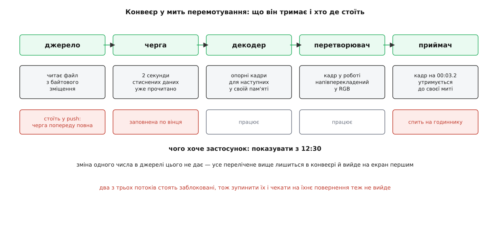
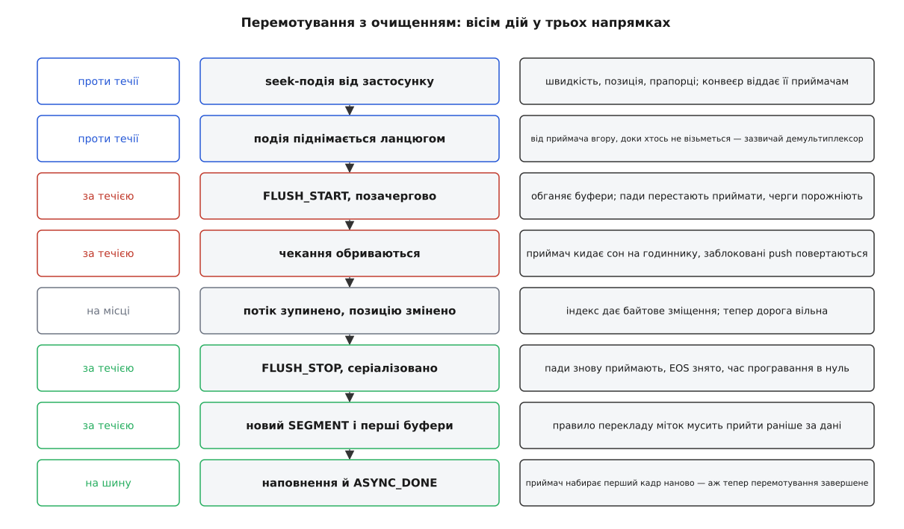
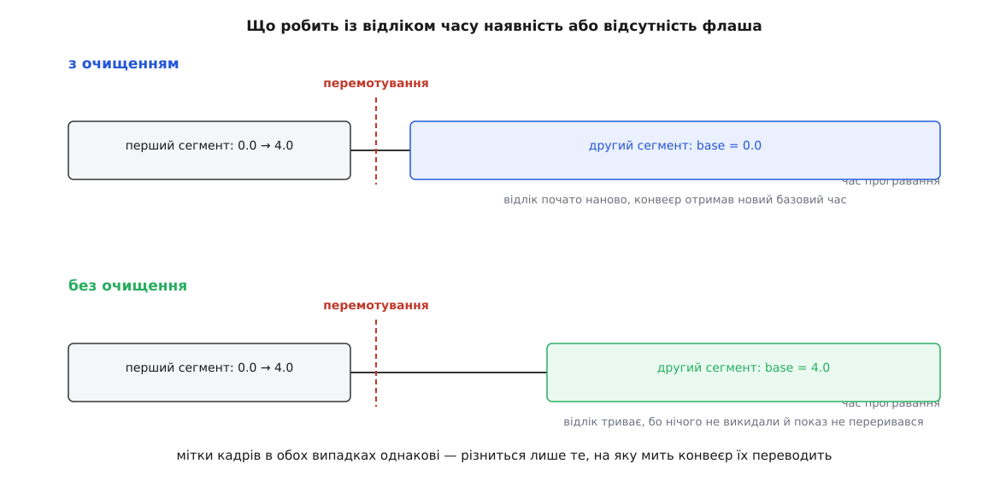
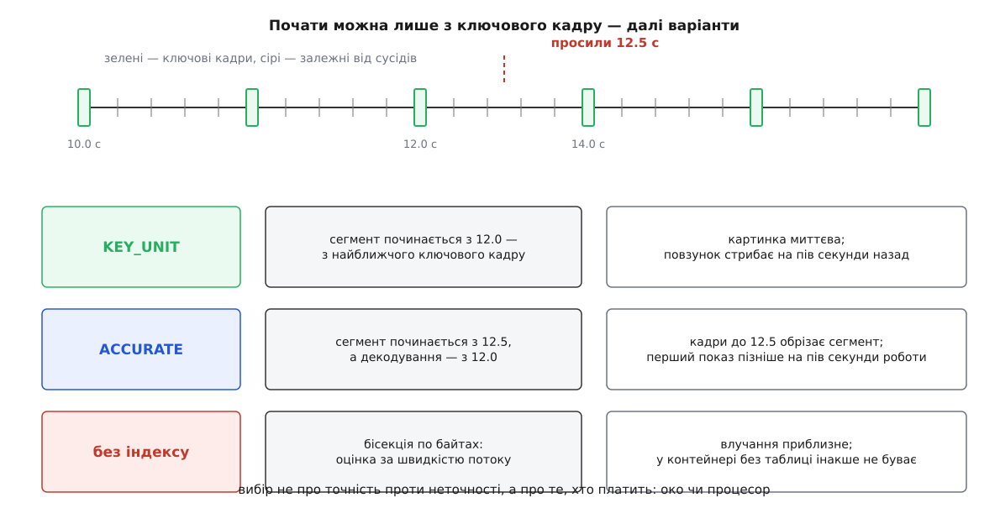

# Перемотування і скидання конвеєра: seek-події та флаш

<preknowlist>
- [Конвеєр: елементи, зв'язки й потік даних](topic:media-vision/pipeline-model) — ланцюг елементів, у якому дані течуть від джерела до приймача.
- [Пади і з'єднання елементів](topic:media-vision/pads-and-linking) — дані й події входять в елемент і виходять із нього через пади; пад має власний стан і може перестати приймати.
- [Події й запити на падах](topic:media-vision/events-and-queries) — окремий канал сигналів уздовж конвеєра: одні йдуть за течією, інші проти, одні в черзі з буферами, інші поза чергою.
- [Стани конвеєра й переходи між ними](topic:media-vision/states-lifecycle) — PAUSED, попереднє наповнення, асинхронний перехід і втрата стану.
- [Годинник, мітки часу й синхронізація потоків](topic:media-vision/clock-and-sync) — час програвання, базовий час і сегмент як правило перекладу міток буфера в мить показу.
- [Потоки виконання й черги](topic:media-vision/threads-and-queues) — де конвеєр міняє потік і чому чергу можна переповнити так, що той, хто пише в неї, зупиняється.
- [Шина повідомлень: події й помилки конвеєра](topic:media-vision/bus-and-messages) — як конвеєр звітує застосункові про те, що сталося всередині.
- [Міжкадрове стиснення](topic:algorithms/inter-frame) — ключовий кадр самодостатній, решта кадрів спираються на сусідів і без них не розгортаються.
</preknowlist>

## Скільки роботи ховається за повзунком

Користувач тягне повзунок програвача на 12:30 і відпускає. З погляду програми це одне число. З погляду конвеєра — ні, і варто побачити чому, перш ніж розбирати механізм.

Погляньмо, що конвеєр тримає в собі в ту мить, коли надходить прохання. Джерело вже прочитало з файлу шматок навколо тієї позиції, де відтворення йде зараз, і поклало його в чергу. Черга тримає близько двох секунд стисненого потоку. Декодер тримає у своїй пам'яті опорні кадри, без яких наступні кадри не розгорнути. Перетворювач кольору тримає кадр, який саме зараз перекладає з YUV у RGB. Приймач тримає готовий кадр із міткою 00:03.2 і спить на годиннику, чекаючи його миті.

І це ще не все. Крім даних, у конвеєрі живуть потоки виконання, і двоє з трьох стоять заблоковані. Потік джерела зупинився всередині виклику, яким штовхає буфер у чергу: черга повна, місця немає, і він чекатиме, доки місце звільниться. Потік приймача спить на годиннику. Вони не в циклі, який можна перервати прапорцем; вони стоять у чеканнях, які скінчаться самі лише тоді, коли ланцюг попереду знову зрушить.



*Перемотування зачіпає не одне число позиції в джерелі, а стан кожного елемента ланцюга й місце, у якому стоїть кожен потік.*

Тепер спробуймо наївне: скажімо джерелу читати з іншого зміщення у файлі. Джерело слухняно прочитає новий шматок — але спершу воно мусить повернутися з блокування, тобто дочекатися, доки черга звільниться, тобто доки приймач покаже все, що вже накопичено. Секунда чи дві очікування. А коли новий шматок нарешті пройде ланцюгом, перед ним на екран вийдуть усі старі кадри, бо вони стоять у черзі попереду. Користувач побачить те саме місце, що й було, потім стрибок; декодер спробує розгорнути перший кадр із нової позиції за старими опорними кадрами й видасть кольорову кашу; приймач порівняє мітку 12:30 зі своїм часом програвання, який дійшов до 00:03, і вирішить, що кадр прийшов на дванадцять хвилин раніше строку — тож чесно засне на дванадцять хвилин.

Звідси й береться справжня форма задачі. Перемотування — це **узгоджене скидання стану всього ланцюга**: викинути дані, що в польоті, вивільнити потоки з блокувань, змінити позицію, наново оголосити правило перекладу міток часу і лише потім пустити дані. Порядок цих дій не довільний, і саме він становить механізм, який далі розбираємо.

## Прохання йде проти течії

Перше питання: кому взагалі адресувати перемотування.

Позицію вміє змінювати не будь-хто. Приймач її не знає — він бачить лише мітки на буферах, які до нього приходять. Декодер не знає теж: він розгортає те, що дали. Знає той, хто **дістає** дані: демультиплексор, який прочитав таблицю індексів контейнера й може сказати, на якому байті лежить кадр для 12:30, або джерело, коли матеріал такий, що позиція обчислюється просто.

Отже, прохання мусить дійти до одного з верхніх елементів. Але застосунок ззовні не знає, який саме елемент у цьому конвеєрі здатен перемотувати: конвеєр може бути зібраний із десятка елементів, а може складатися з одного `playbin`, усередині якого схована ціла конструкція. Тому seek-подія (англ. *seek* — «шукати, дошукуватися») влаштована так: застосунок віддає її конвеєру, конвеєр за замовчуванням передає її **приймачам**, а кожен приймач штовхає її **проти течії** — від елемента до елемента вгору, доки хтось не візьметься.

Вибір приймачів як точки входу не випадковий. Приймач — кінець гілки; піднімаючись від кінців усіх гілок, подія гарантовано обійде весь конвеєр, хоч би скільки в нього було розгалужень. Рухаючись від джерела вниз, вона б цього не дала: розгалуження треба було б обходити окремо, та й адресат сидить якраз угорі.

Той, хто взявся, повертає «так», і ця відповідь піднімається назад до застосунку як результат виклику. Читати її треба буквально: **«прохання прийнято до виконання»**, а не «кадр із нової позиції вже на екрані». Робота на цьому щойно починається.

Що це значить практично: перемотування може бути відхилене цілком законно. Ланцюг із живою камерою відхилить його завжди — у камери немає минулого, з якого можна читати. Мережевий потік без можливості позиціювання відхилить теж. Перш ніж малювати повзунок, застосунок питає конвеєр окремим запитом, чи взагалі можливе перемотування й у яких межах; той самий запит дає тривалість матеріалу.

Далі всередині ланцюга прохання ще й **перекладається**. Демультиплексор отримав seek у шкалі часу; сам він файлу не читає, читає джерело, і воно розуміє тільки байти. Тому демультиплексор бере свою таблицю індексів, знаходить байтове зміщення й посилає **власну** seek-подію вгору — уже в байтах. Так одне прохання застосунку перетворюється на ланцюжок прохань, кожне у своїй одиниці виміру.

> 🔧 **Навіщо це.** Звідси випливає перший практичний висновок про діагностику: коли перемотування «не працює», питання не в тому, чи правильна позиція, а в тому, **чи знайшовся охочий**. Найчастіші причини відмови — конвеєр іще не дійшов до PAUSED (демультиплексор ще не прочитав таблицю індексів, тобто перекладати час у байти нема чим), формат запиту не той (просите байти там, де елемент розуміє лише час) або джерело за своєю природою не позиціюється.

## Чому спершу треба розчистити дорогу

Хай прохання дійшло до демультиплексора. Він знає, з якого байта читати. Що заважає просто змінити позицію й читати далі?

Заважає те, що читання виконує не той потік, який приніс подію. Подія прийшла з потоку застосунку, а дані ланцюгом штовхає окремий потік — той самий, що стоїть заблокований у черзі. Змінювати позицію під ним небезпечно: він у будь-яку мить може прокинутися й потягти дані зі старого місця, змішавши старе з новим. Отже, перед зміною позиції потік треба **зупинити** й дочекатися, доки він вийде з роботи.

А вийти він не може — він стоїть у черзі, і його чекання скінчиться лише тоді, коли приймач покаже накопичене. Це може бути секунда, а може й ніколи: у конвеєрі на паузі приймач не показує нічого взагалі, тож потік простоїть там довіку.

Отже, потрібен спосіб **обірвати всі чекання одразу**, не питаючи в них дозволу. Саме це й робить флаш (англ. *flush* — «змити, спорожнити»), і робить його парою подій, а не однією.

**FLUSH_START** іде за течією й **не стає в чергу з буферами**. Це принципово: якби вона чекала своєї черги за двома секундами даних у черзі, вона б застрягла разом із ними, а суть її саме в тому, щоб їх обігнати. Кожен пад, якого вона досягла, переходить у стан «флашний»: відтепер будь-яка спроба штовхнути в нього буфер миттєво повертає відмову замість того, щоб чекати. Черги викидають уміст і будять того, хто спав на них у чеканні місця. Приймач кидає сон на годиннику, не показавши кадр, який тримав.

Через мілісекунди картина змінюється радикально: жодне чекання не триває, потік джерела повернувся з відмовою, піднявся зі своєї робочої функції й став; дорога вільна. Тепер демультиплексор бере в руки потік, змінює позицію й готує новий сегмент.

**FLUSH_STOP** іде за течією **в черзі з даними** — і саме тому вона друга. Її роль дзеркальна: зняти з падів флашний стан, щоб дані знову приймалися. Але зняти його треба **після** того, як усе старе викинуто, і **до** того, як піде перший новий буфер. Серіалізована подія стоїть у потоці даних на своєму місці, тож ця межа виходить сама собою: усе, що перед нею, — старе, усе, що після, — нове.

Ось звідки береться пара, а не одна подія. Перша обриває чекання поза чергою, друга проводить межу в черзі. Між ними лежить проміжок, у якому конвеєр гарантовано не рухає даних, — єдине вікно, у яке безпечно втиснути зміну позиції.



*Кожен рядок — окрема дія, і кожна відбувається у своєму напрямку; спроба переставити їх місцями ламає одну з гарантій, на яких тримається решта.*

FLUSH_STOP несе ще одну важливу дію, про яку далі буде окрема розмова: разом зі зняттям флашного стану вона скидає відлік часу програвання.

## Що флаш викидає, а що переживає його

Слово «скинути» надто загальне, тому перелічімо межу точно — від неї залежить, які пастки взагалі можливі.

**Флаш викидає** буфери в чергах і всередині елементів; напівзібрані дані в парсерах і мультиплексорах; чекання приймача на годиннику; накопичений стан кінця потоку — і власне позначку «потік скінчився» на падах, і повідомлення про кінець, які ще не дійшли застосункові; чинний сегмент, тобто правило перекладу міток. Останнє означає, що після FLUSH_STOP **новий сегмент обов'язково прийде перед першим буфером** — без нього мітки нема куди відображати.

**Флаш не чіпає** станів елементів: конвеєр, який грав, лишається в PLAYING, відкриті пристрої лишаються відкритими, потоки лишаються тими самими. Не чіпає він і узгодженого формату: caps, домовлені раніше, після перемотування чинні далі, і переговори наново не запускаються, якщо матеріал у новій позиції той самий. Це логічно: перемотування змінює **позицію**, а не природу даних.

Скидання позначки кінця потоку варте окремого наголосу, бо на ньому стоїть найчастіша пастка. Коли файл дограв до кінця, по конвеєру пройшла подія про кінець потоку, і вона липка: вона лишилася на падах як чинний стан. Пад із такою позначкою нових буферів не прийме: за домовленістю після кінця потоку даних більше не буває. Тому перемотування **без** флаша після кінця файлу нічого не оживить: позицію змінено, дані пішли, а пади їх не беруть. Оживляє саме флаш, бо він цю позначку знімає. Звідси правило, яке в коді програвачів виглядає загадково, доки не знаєш причини: перемотування після кінця відтворення завжди робиться з флашем.

## Що стає з відліком часу

Тепер до найтоншого місця. Кадр із міткою 12.540 має вийти на екран у мить, яку приймач обчислює з мітки, сегмента й базового часу. Перемотування рве цю арифметику навпіл, і полагодити її можна двома різними способами — залежно від того, чи був флаш.

Нагадаю форму зв'язку: приймач переводить мітку буфера в час програвання за сегментом, віднімаючи початок сегмента й додаючи накопичене попередніми сегментами, а потім додає базовий час, щоб дістати момент за спільним годинником. Час програвання за задумом **не стрибає**: це вісь, на якій зустрічаються всі гілки конвеєра, і зламати її монотонність не можна, бо тоді розсипеться синхронність звуку й зображення.

**Перемотування з очищенням** дозволяє собі найпростіший хід: почати відлік наново. Разом із FLUSH_STOP конвеєр отримує вказівку скинути час програвання в нуль, обчислює новий базовий час і роздає його всім елементам. Новий сегмент починається з нової позиції, а накопичене в ньому — нуль. Це коректно саме тому, що попереднього руху вже не існує: усе, що було, викинуто, і жодна гілка не має даних зі старої осі.

**Перемотування без очищення** так не може: старі дані нікуди не поділися, вони й далі йдуть на екран. Новий сегмент мусить стати в чергу **за** ними, тобто його накопичене дорівнює тому часу програвання, на якому обірветься попередній сегмент. Вісь триває без розриву — і саме через це відтворення не переривається жодною паузою.

**Приклад: куди потрапить кадр із міткою 12.540 після перемотування на 12.500 с.** Відтворення йшло від початку файлу, встигло програти чотири секунди.

```
до перемотування:  segment.start = 0.000   segment.base = 0.000   rate = 1.0
                   running_time  = 4.000 с

з очищенням (FLUSH):
   усе в польоті викинуто, running_time скинуто в нуль
   новий сегмент:  start = 12.500   base = 0.000
   running_time  = (12.540 − 12.500) / 1.0 + 0.000 = 0.040 с
   base_time     = показ годинника в мить FLUSH_STOP

без очищення:
   усе в польоті дограється, running_time триває
   новий сегмент:  start = 12.500   base = 4.000
   running_time  = (12.540 − 12.500) / 1.0 + 4.000 = 4.040 с
   base_time     = незмінний
```

Мітка на буфері в обох випадках однакова — 12.540. Різниця тільки в тому, на яку мить конвеєр її переводить, і цю різницю цілком задають два числа сегмента.



*Сегмент — єдине місце, де перемотування взагалі позначається на часі; мітки кадрів воно не переписує.*

Повний розбір алгебри сегмента, включно зі зворотним ходом і ланцюжком сегментів, зібрано в [окремій розгортці формул](topic:media-vision/clock-and-sync/math-running-time.md) — там показано, чому час програвання лишається монотонним за будь-яких перемотувань.

## Ключовий кадр: чому «точно на 12:30» коштує дорого

Досі ми мовчки припускали, що з будь-якого місця файлу можна почати показувати. Для стисненого відео це неправда, і саме звідси беруться прапорці точності, які інакше виглядають набором примх.

Стиснений потік складається з кадрів двох родів. Ключовий кадр самодостатній: у ньому є все зображення, і розгорнути його можна, нічого не знаючи про сусідів. Решта кадрів зберігають лише різницю відносно сусідів — самі по собі вони порожні. Ключові кадри ставлять рідко, бо вони важкі: типово раз на одну-дві секунди, у трансляціях іноді раз на кілька секунд.

Отже, попросили 12.5 с — а декодувати можна лише з 12.0 с, де стоїть найближчий ключовий кадр. Виникає вибір, і GStreamer віддає його застосункові прапорцями seek-події.

**Прив'язатися до ключового кадру.** Демультиплексор пересуває початок сегмента на 12.0 і віддає дані звідти. Картинка з'являється негайно, ціною пів секунди неточності: повзунок стрибне назад, і при швидкому «шкрябанні» по стрічці це видно. Для перегляду це найкращий режим — око не помічає різниці в пів секунди, зате чекати не доводиться.

**Вимагати точність.** Початок сегмента лишається на 12.5, але декодувати демультиплексор усе одно починає з 12.0. Кадри, розгорнуті між 12.0 і 12.5, обрізає сегмент: мітка, що лежить до його початку, означає «цей буфер сегментові не належить», і приймач його не покаже. Тобто декодер робить роботу, результат якої свідомо викидається, — і саме в цьому ціна. Для двосекундної відстані між ключовими кадрами це десятки кадрів; для трансляції з ключовим кадром раз на десять секунд — сотні.

**Обрати бік прив'язки.** Окремі прапорці кажуть, куди саме прив'язуватися: до найближчої межі перед проханням, після нього чи просто до найближчої. Це дрібниця для програвача й важлива річ для монтажу, де «не раніше за цю мить» — жорстка вимога.

І окремий випадок — **коли індексу немає взагалі**. [Контейнер](topic:communications/media-container) `MP4` носить таблицю позицій — окремий блок, у якому для кожного кадру записано зміщення й мітку часу, — і демультиплексор просто дивиться в неї. Транспортний потік `MPEG-TS`, знятий із ефіру чи з відеореєстратора, такої таблиці не має: у ньому немає нічого, що переводило б час у зміщення. Тоді елемент оцінює зміщення за середньою швидкістю потоку, стрибає туди, дивиться, які мітки часу знайшлися, і повторює, звужуючи проміжок, — тобто робить звичайну [бісекцію](topic:algorithms/binary-search) по файлу. Результат наближений за побудовою, і жодні прапорці точності цього не змінять.



*Вибір прапорця — це вибір, хто заплатить за проміжок між проханням і найближчим ключовим кадром: око неточністю чи процесор зайвим декодуванням.*

> 🔧 **Навіщо це.** У системі відеоспостереження, де кожен кадр — окремий JPEG, ключовий кадр стоїть скрізь, і точне перемотування безкоштовне. Щойно ви переводите ту саму систему на H.264 із ключовим кадром раз на 250 кадрів, точне перемотування починає коштувати десять секунд декодування на кожен клац по стрічці — і це не поламка, а прямий наслідок стиснення. Лікують не пришвидшенням декодера, а частішими ключовими кадрами на боці записувача.

## Приймач мусить наповнитися наново

Флаш спорожнив конвеєр — отже, приймач більше не тримає кадру, який може показати. А стан PLAYING означає рівно те, що приймач віддає кадри за годинником. Виходить суперечність: конвеєр формально грає, а грати нема чим.

GStreamer розв'язує її прямо: приймач **утрачає стан**. Ціль лишається PLAYING, але фактично він відкочується в PAUSED і повторює попереднє наповнення — чекає першого буфера з нової позиції, щоб знову мати що показувати. Застосунок бачить це на шині як пару повідомлень: спершу «почався асинхронний перехід», потім «наповнення завершене».

Звідси головне правило для того, хто керує перемотуванням із коду: **перемотування завершене не тоді, коли виклик повернув «так», а тоді, коли на шині з'явилося повідомлення про завершення наповнення**. До цієї миті позиція конвеєра ще стара, тривалість може бути невідома, а спроба зробити знімок кадру дасть попередній кадр.

Із цього ж випливає й приємне: перемотування чудово працює в PAUSED. Конвеєр порожніє, джерело віддає перший кадр з нової позиції, приймач його наповнює й показує. Саме так влаштоване «шкрябання» повзунком у відеоредакторі: конвеєр стоїть у PAUSED, кожен рух повзунка — окреме перемотування з флашем, і на екрані щоразу свіжий кадр, хоча відтворення не йде.

А от перемотування **без** флаша в PAUSED поводиться протилежно очікуванням: воно стає в чергу за даними, які стоять у приймачі, що вже наповнився, — а вони не зрушать, доки конвеєр не піде в PLAYING. Виклик просто зависне до того часу. Це не поламка, а прямий наслідок того, що черга без флаша нікуди не діває даних.

## Перемотування без очищення й безшовна склейка

Якщо флаш такий зручний, навіщо взагалі існує варіант без нього? Через звук.

Флаш робить конвеєр порожнім, і між останнім старим кадром та першим новим виникає розрив: приймач звуку лишається без даних на час наповнення. У динаміку це чутно як клац або провал. Для перемотування на нове місце це нормально — користувач і сам чекає стрибка. Для завдань, де потік має тривати без жодного шва, це неприйнятне.

Класичний випадок — зациклювання. Треба грати фрагмент від 10 до 20 секунди по колу, без паузи на переході. Розв'язок такий: перемотування робиться з прапорцем сегментного відтворення, який каже конвеєру «дійшовши до кінця цього шматка, **не оголошуй кінець потоку**, а надішли повідомлення на шину». Застосунок ловить це повідомлення й одразу шле наступне перемотування — знову на 10 секунду, знову без флаша. Новий сегмент стає в чергу за поточним, накопичений час програвання переходить далі, конвеєр жодної миті не буває порожнім. Слухач не чує переходу взагалі.

Друга причина існування безфлашного варіанта — зміна швидкості на ходу. Перемотування, що змінює лише швидкість, не має жодного приводу викидати дані: позиція та сама, напрямок той самий, змінюється тільки темп. Із версії 1.18 для цього є окремий прапорець миттєвої зміни швидкості: подія без флаша, без зміни позиції й без зміни напрямку, після якої нова швидкість застосовується негайно, без спорожнення конвеєра.

Точний перелік прапорців, типів позиції, сигнатур і повідомлень, разом із тим, які комбінації взагалі допустимі, зібрано в [довідці інтерфейсів перемотування](topic:media-vision/seeking-and-flush/api-seek.md).

## Швидкість, зворотний хід і трюкові режими

Швидкість подорожує в тій самій seek-події, що й позиція, і осідає в полі сегмента. Далі вона діє сама собою: приймач ділить відстань від початку сегмента на модуль швидкості, тож на подвійній швидкості дві секунди матеріалу займають секунду реального часу. Жодного окремого механізму «прискорення» в конвеєрі немає — є одне число в сегменті.

Від'ємна швидкість влаштована хитріше, ніж здається. Просто «читати файл задом наперед» не вийде: кадр, що спирається на попередній, без нього не розгортається. Тому демультиплексор ріже матеріал на групи від ключового кадру до ключового, віддає кожну групу **вперед**, як завжди, а декодер, розгорнувши її, віддає кадри **у зворотному порядку**. Знак швидкості в сегменті каже приймачеві відлічувати від протилежного краю, і показ іде назад. Ціна: щоб показати одну секунду задом наперед, треба декодувати цілу групу й тримати її в пам'яті. Тому зворотний хід на високій роздільності важчий за прямий у рази.

Ту саму проблему з іншого боку розв'язують трюкові режими, що з'явилися у версії 1.6. Їхня ідея — не декодувати те, чого однаково не буде видно. Прапорці кажуть верхнім елементам: розгортати лише ключові кадри; або розгортати ключові й ті, що спираються тільки на минуле, пропускаючи двонапрямлені; або взагалі не подавати звук, бо на восьмикратній швидкості він усе одно ні до чого. Для перегляду на швидкості 16× це різниця між плавним рухом і слайд-шоу з пропусками.

## Скидання стану у власному елементі

Усе описане накладає зобов'язання й на елементи, які ви пишете самі. Елемент, що тримає бодай якийсь стан між буферами — напівзібраний кадр, лічильник, історію міток часу, — мусить цей стан скинути на флаші, інакше після перемотування він змішає старе з новим.

Реагують на це в обробнику подій вхідного пада, і місце реакції визначається тим, що ми вже знаємо про кожну з двох подій.

```c
static gboolean
my_filter_sink_event (GstPad *pad, GstObject *parent, GstEvent *event)
{
  MyFilter *self = MY_FILTER (parent);

  switch (GST_EVENT_TYPE (event)) {
    case GST_EVENT_FLUSH_START:
      /* прийшла поза чергою, буфери ще в дорозі:
         тут можна лише розблокувати власні чекання, чіпати дані ще рано */
      g_atomic_int_set (&self->flushing, TRUE);
      my_filter_wake_up_waiters (self);
      break;

    case GST_EVENT_FLUSH_STOP:
      /* серіалізована: усе старе вже позаду, нове ще не пішло —
         єдина безпечна мить, щоб викинути накопичене */
      GST_OBJECT_LOCK (self);
      my_filter_drop_accumulated (self);          /* напівзібраний кадр, історія */
      gst_segment_init (&self->segment, GST_FORMAT_UNDEFINED);
      self->need_segment = TRUE;                  /* далі чекаємо на новий */
      GST_OBJECT_UNLOCK (self);
      g_atomic_int_set (&self->flushing, FALSE);
      break;

    case GST_EVENT_SEGMENT:
      /* нове правило перекладу міток; без нього мітки буферів безадресні */
      GST_OBJECT_LOCK (self);
      gst_event_copy_segment (event, &self->segment);
      self->need_segment = FALSE;
      GST_OBJECT_UNLOCK (self);
      break;

    default:
      break;
  }

  return gst_pad_event_default (pad, parent, event);
}
```

Прибирання стоїть на FLUSH_STOP, а не на FLUSH_START, з тієї самої причини, з якої ці події розділені: у мить FLUSH_START дані ще в дорозі, і потік обробки, можливо, саме зараз пише в те, що ви зібралися звільняти. Робота FLUSH_START — обірвати чекання, більше нічого. Робота FLUSH_STOP — прибрати, бо тепер точно ніхто не пише.

Друге зобов'язання видно з третьої гілки: елемент, який зберігає в себе сегмент, мусить перечитати його наново після кожного перемотування. Елемент, що кешував сегмент раз на початку роботи, після першого ж перемотування переводитиме мітки за застарілим правилом — і кадри посиплються з дивними затримками або зникнуть зовсім.

Робочий приклад керування перемотуванням із боку застосунку — з очікуванням на завершення наповнення, точним і швидким варіантами та безшовною петлею — зібрано у вставці [перемотування з коду: чекання, точність і петля](topic:media-vision/seeking-and-flush/proj-seek-driver.md).

## Де це найчастіше застрягає

Кожен характерний симптом тепер читається як порушення однієї конкретної ланки.

**Виклик перемотування повертає відмову.** Ніхто в ланцюгу не взявся. Три звичайні причини: конвеєр іще не дійшов до PAUSED, тож демультиплексор не встиг прочитати індекс; джерело живе й минулого не має; формат прохання не той, який елемент розуміє. Перевіряється це запитом про можливість перемотування — він же скаже й межі, у яких воно дозволене.

**Перемотування «спрацювало», але картинка стара.** Застосунок повірив поверненому «так» і одразу пішов питати позицію чи знімати кадр. Треба було дочекатися повідомлення про завершення наповнення на шині.

**Після кінця файлу перемотування ні на що не впливає.** Позначка кінця потоку на падах не знята, тому нові буфери не приймаються. Лікує прапорець флаша — і тільки він.

**Програма зависає намертво під час перемотування.** Перемотування з флашем виконується в потоці того, хто його викликав, і всередині чекає, доки звільниться потік обробки. Викликати його з обробника даних того самого конвеєра — з функції обробки буфера чи із зонда на паді — означає чекати самому на себе, тобто [взаємне блокування](topic:programming/deadlock). Правильно: із потоку застосунку або з обробника шини.

**Після перемотування картинка сиплеться або мітки часу дивні.** Хтось у ланцюгу не скинув свого стану на FLUSH_STOP або працює за старим сегментом. Якщо ланцюг зібрано лише зі стандартних елементів, підозра падає на власні зонди на падах, які кешували сегмент.

**Позиція після перемотування не та, що просили.** Спрацювала прив'язка до ключового кадру. Якщо потрібна точність — прапорець точності, і разом із ним готовність платити декодуванням; якщо потрібна швидкість — лишити прив'язку й пересунути повзунок до того, що конвеєр реально показує.

**Конвеєр із власним джерелом не перемотується взагалі.** Джерело, у яке дані подає ваш код, не має ні файлу, ні індексу, тож перемотування воно виконати не може, доки ви самі не візьметеся: воно сигналізує вам про прохання й чекає, що ви подасте дані з нової позиції. Не обробили сигнал — прохання відхилено, і це правильна поведінка, а не хиба.

Коли щось із цього трапляється, найкоротший шлях до причини — питати в тому ж порядку, у якому працює механізм: чи прохання взагалі кимось прийнято; чи дійшов флаш до всіх, тобто чи спорожнів конвеєр; чи прийшов новий сегмент перед буферами; чи завершилося наповнення. Три перші питання відповідають трьома різними симптомами, а четверте — тим, що конвеєр мовчить, хоч усе інше начебто сталося.
