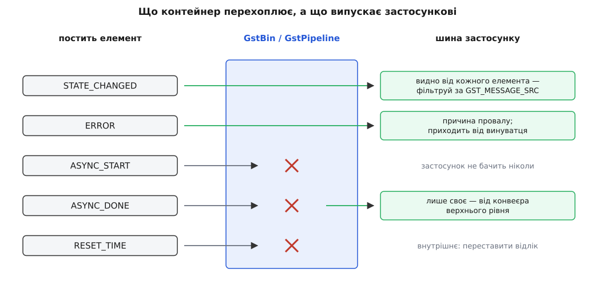

# 📋 Контракт станів: функції, коди повернення й повідомлення шини

Це структурна довідка по тій частині API GStreamer, якою застосунок керує станом конвеєра: два виклики, три перелічення, п'ять повідомлень і жменя макросів. Тримати її під рукою варто через те, що майже кожен затик зі станами — це або неправильно прочитаний код повернення, або очікування повідомлення, якого в цій версії бібліотеки взагалі не буває.

Усе нижче стосується GStreamer 1.x і звірене із заголовками `gstelement.h` та `gstmessage.h` гілки `main`, документацією проєкту й документом плану `part-states.md`. Там, де контракт відрізняється від 0.10, це позначено окремо: саме на цих місцях спотикаються приклади зі старих статей і відповідей на форумах.

## Перелічення

### GstState: чотири стани

| Константа | Число | Що вже зайнято |
|---|---|---|
| `GST_STATE_VOID_PENDING` | 0 | не стан, а позначка «очікуваного стану немає»; саме її кладуть у `pending`, коли перехід завершено |
| `GST_STATE_NULL` | 1 | нічого: щойно створений або вже прибраний елемент |
| `GST_STATE_READY` | 2 | пристрої відкрито, бібліотеки завантажено; потоків немає, дані не рухаються |
| `GST_STATE_PAUSED` | 3 | пади активні, потоки запущені, дані дійшли до приймача й стоять там |
| `GST_STATE_PLAYING` | 4 | приймачі віддають дані назовні за годинником |

Числа тут не декоративні: стани впорядковані за зростанням готовності, і на цьому порядку побудовані всі макроси переходів.

### GstStateChange: перехід як пара станів

Перехід не має власного лічильника — його значення складається з двох станів, спакованих в одне ціле по три біти:

```
GST_STATE_TRANSITION(cur, next) = (cur << 3) | next

READY(2) → PAUSED(3):  (2 << 3) | 3 = 16 | 3 = 19
розбір назад:
  GST_STATE_TRANSITION_CURRENT(19) = 19 >> 3  = 2  → READY
  GST_STATE_TRANSITION_NEXT(19)    = 19 & 0x7 = 3  → PAUSED
```

Звідси й числа всіх шести переходів — їх ніхто не задавав вручну:

| Константа | Обчислення | Число | Хто що робить на цьому переході |
|---|---|---|---|
| `GST_STATE_CHANGE_NULL_TO_READY` | `(1<<3)\|2` | 10 | відкрити пристрій, зайняти ексклюзивні ресурси |
| `GST_STATE_CHANGE_READY_TO_PAUSED` | `(2<<3)\|3` | 19 | базовий клас активує пади й запускає потоки; починається попереднє наповнення |
| `GST_STATE_CHANGE_PAUSED_TO_PLAYING` | `(3<<3)\|4` | 28 | роздано базовий час, приймачі відпускають дані |
| `GST_STATE_CHANGE_PLAYING_TO_PAUSED` | `(4<<3)\|3` | 35 | приймачі знову тримають дані; час програвання відкладено |
| `GST_STATE_CHANGE_PAUSED_TO_READY` | `(3<<3)\|2` | 26 | базовий клас зупиняє потоки й вимикає пади |
| `GST_STATE_CHANGE_READY_TO_NULL` | `(2<<3)\|1` | 17 | закрити пристрій, віддати все зайняте |

Крім цих шести, від версії 1.14 перелічення містить чотири «переходи на місці» — `GST_STATE_CHANGE_NULL_TO_NULL` (9), `READY_TO_READY` (18), `PAUSED_TO_PAUSED` (27), `PLAYING_TO_PLAYING` (36). Вони виникають, коли зміну стану просять там, де елемент уже стоїть, і додані рівно для того, щоб `switch` по переходах міг назвати їх поіменно, а компілятор не скаржився на неповний перелік. Змістовної роботи на них елемент не робить — гілка `default`.

Ще один макрос відповідає за правило «через сходинку не стрибають»:

```
GST_STATE_GET_NEXT(cur, pending) = cur + sign(pending − cur)

із NULL(1) просять PLAYING(4):  1 + sign(3) = 2 → READY
із PLAYING(4) просять NULL(1):  4 + sign(−3) = 3 → PAUSED
```

Тобто наступний стан завжди відрізняється від поточного рівно на одну сходинку, а напрямок дає знак різниці. Один виклик `set_state` розгортається в стільки переходів, скільки сходинок між станами.

### GstStateChangeReturn: чотири відповіді

| Константа | Число | Що сталося | Що зобов'язаний зробити застосунок |
|---|---|---|---|
| `GST_STATE_CHANGE_FAILURE` | 0 | перехід провалився | опустити конвеєр у `GST_STATE_NULL` і взяти причину з повідомлення `ERROR` |
| `GST_STATE_CHANGE_SUCCESS` | 1 | стан досягнуто до повернення виклику | нічого, можна працювати далі |
| `GST_STATE_CHANGE_ASYNC` | 2 | перехід почався й завершиться пізніше | дочекатися `ASYNC_DONE` від конвеєра або `gst_element_get_state()` із таймаутом; до того не питати тривалість, формат чи розмір кадру |
| `GST_STATE_CHANGE_NO_PREROLL` | 3 | успіх, але в `PAUSED` елемент даних не даватиме | **не чекати нічого**: `ASYNC_DONE` не буде ніколи; ознака живого джерела |

Дві пастки в читанні цих кодів. Перша: провалом є **тільки** `FAILURE`, тож перевірка виду `if (ret != GST_STATE_CHANGE_SUCCESS) { /* помилка */ }` неправильна — вона оголосить помилкою і нормальний асинхронний перехід, і живий конвеєр. Друга: `FAILURE` дорівнює нулю, а `SUCCESS` — одиниці, тому звичка писати `if (!ret)` спрацьовує тут випадково й ламається на будь-якому іншому перелічені GStreamer; пишіть порівняння з константою.

## Дві функції, якими керує застосунок

```c
GstStateChangeReturn gst_element_set_state (GstElement  *element,
                                            GstState     state);

GstStateChangeReturn gst_element_get_state (GstElement  *element,
                                            GstState    *state,
                                            GstState    *pending,
                                            GstClockTime timeout);
```

`gst_element_set_state()` задає **ціль**, а не факт: він проводить елемент по всіх проміжних переходах і повертає керування, щойно стане зрозуміло, чим справа скінчилася або що вона триватиме далі сама. Обидві функції працюють і на окремому елементі, і на конвеєрі — конвеєр є елементом, і зміна його стану означає зміну стану всіх дітей усередині.

`gst_element_get_state()` — єдиний спосіб спитати «де ми зараз насправді». Обидва вихідні вказівники можна передати як `NULL`, якщо потрібне лише повернене значення.

**Що лежить у вихідних параметрах після повернення:**

| Повернено | `*state` | `*pending` |
|---|---|---|
| `SUCCESS` | досягнутий стан | `GST_STATE_VOID_PENDING` |
| `NO_PREROLL` | досягнутий стан | `GST_STATE_VOID_PENDING` |
| `ASYNC` | стан, у якому елемент зараз | стан, до якого він іде |
| `FAILURE` | значення непевні — читайте шину | те саме |

**Таймаут** — звичайний `GstClockTime` у наносекундах, і три його значення варто розрізняти:

| Значення | Поведінка |
|---|---|
| `0` | не блокувати; миттєвий знімок поточного стану — те, що треба для опитування з циклу подій |
| `N * GST_SECOND` | чекати не довше за `N` секунд; повернення `ASYNC` після цього означає «не встиг», а не «провалився» |
| `GST_CLOCK_TIME_NONE` | чекати без обмеження часу |

`GST_CLOCK_TIME_NONE` — це `(GstClockTime) -1`, тобто максимальне беззнакове 64-бітове число, а не «нуль часу». На конвеєрі з мережевим джерелом такий виклик легко перетворюється на вічне зависання застосунку: якщо сервер мовчить, попереднє наповнення не завершиться ніколи й нікого це не турбує. У програмі з вікном давайте скінченний таймаут, а справжнє завершення ловіть на шині.

Дві поведінки, які легко проґавити. Перша: якщо остання зміна стану провалилася, `gst_element_get_state()` повертатиме `FAILURE` на кожному виклику **доти, доки не почнеться нова** зміна стану, — код помилки залипає навмисно, щоб його не можна було прогледіти. Друга: після провалу пусті `pending` і `next` знімаються (усередині це робить `gst_element_abort_state()`), і елемент лишається там, куди встиг дійти, — не там, звідки вирушив.

> 🔧 **Навіщо це.** Ні `set_state`, ні `get_state` не можна викликати з потоку обробки — ні з `handoff`, ні з проби на паді, ні з ланцюжкової функції елемента. Перехід чекає на зупинку потоків, а виклик уже виконується в одному з них: потік чекає сам на себе, і це [взаємне блокування](topic:programming/deadlock) без жодного шансу розв'язатися. Документація GStreamer каже про ці функції прямо: виклик із потоку обробки у багатьох ситуаціях спричинить дедлок. Правильний спосіб перекласти роботу на інший потік дає сам GStreamer:
>
> ```c
> void gst_element_call_async (GstElement              *element,
>                              GstElementCallAsyncFunc  func,
>                              gpointer                 user_data,
>                              GDestroyNotify           destroy_notify);
> ```
>
> Функцію `func` викличуть з окремого потоку пулу, і вже звідти міняти стан безпечно.

### Мінімальний робочий виклик

Один допоміжний виклик, який чесно обробляє всі чотири коди й повертає правду про те, чи стан досягнуто:

```c
#include <gst/gst.h>

static gboolean
await_state (GstElement *pipeline, GstState want)
{
  GstBus *bus = gst_element_get_bus (pipeline);
  GstStateChangeReturn ret = gst_element_set_state (pipeline, want);
  gboolean ok = FALSE;

  switch (ret) {
    case GST_STATE_CHANGE_SUCCESS:
      ok = TRUE;                    /* стан уже досягнуто */
      break;

    case GST_STATE_CHANGE_NO_PREROLL:
      ok = TRUE;                    /* живий конвеєр: ASYNC_DONE не буде ніколи */
      break;

    case GST_STATE_CHANGE_ASYNC: {
      /* єдиний ASYNC_DONE, який доходить сюди, — від самого конвеєра */
      GstMessage *msg = gst_bus_timed_pop_filtered (bus, 5 * GST_SECOND,
          GST_MESSAGE_ASYNC_DONE | GST_MESSAGE_ERROR);

      if (msg == NULL) {
        g_printerr ("перехід не завершився за 5 с — конвеєр застряг\n");
      } else {
        ok = (GST_MESSAGE_TYPE (msg) == GST_MESSAGE_ASYNC_DONE);
        if (!ok) {
          GError *err = NULL;
          gchar *dbg = NULL;
          gst_message_parse_error (msg, &err, &dbg);
          g_printerr ("%s: %s (%s)\n",
              GST_OBJECT_NAME (GST_MESSAGE_SRC (msg)),
              err->message, dbg ? dbg : "без подробиць");
          g_clear_error (&err);
          g_free (dbg);
        }
        gst_message_unref (msg);
      }
      break;
    }

    case GST_STATE_CHANGE_FAILURE:
      break;                        /* причина приїде окремим ERROR */
  }

  if (!ok)                          /* єдина коректна реакція на невдачу */
    gst_element_set_state (pipeline, GST_STATE_NULL);

  gst_object_unref (bus);
  return ok;
}
```

Виклик із цього боку виглядає так:

```c
GstElement *pipeline = gst_parse_launch (
    "filesrc location=movie.mkv ! decodebin ! autovideosink", NULL);

if (await_state (pipeline, GST_STATE_PAUSED)) {
  gint64 dur;
  /* тільки тепер тривалість справді відома */
  if (gst_element_query_duration (pipeline, GST_FORMAT_TIME, &dur))
    g_print ("тривалість: %" GST_TIME_FORMAT "\n", GST_TIME_ARGS (dur));

  await_state (pipeline, GST_STATE_PLAYING);   /* коштує майже нічого */
}

gst_element_set_state (pipeline, GST_STATE_NULL);   /* обов'язково перед unref */
gst_object_unref (pipeline);
```

Два місця варті окремої уваги. Перехід у `NULL` виконується синхронно: виклик поверне керування лише тоді, коли всі потоки справді зупинені, — тому саме він, а не деструктор, є точкою, де конвеєр віддає пристрої. І він потрібен навіть після провалу: `gst_object_unref()` над конвеєром у `PLAYING` лишає по собі відкриті пристрої й живі потоки.

## Повідомлення шини, що стосуються станів

Керування станами розділене між поверненим значенням і [шиною повідомлень](topic:media-vision/bus-and-messages) — окремою чергою, якою конвеєр звітує застосункові з власних потоків. Повернене значення каже, чи прохання прийнято; шина каже, що з нього вийшло. Але не кожне повідомлення про стани призначене застосункові, і це джерело половини непорозумінь.

| Тип | Хто постить | Чи доходить до застосунку | Розбір |
|---|---|---|---|
| `GST_MESSAGE_STATE_CHANGED` | кожен елемент після кожного завершеного переходу | так, від **усіх** елементів | `gst_message_parse_state_changed()` |
| `GST_MESSAGE_ASYNC_START` | елемент, що почав асинхронний перехід | **ні** — контейнер перехоплює його; функції розбору не існує | — |
| `GST_MESSAGE_ASYNC_DONE` | елемент, що завершив асинхронний перехід | лише те, яке постить **конвеєр верхнього рівня** | `gst_message_parse_async_done()` |
| `GST_MESSAGE_RESET_TIME` | елемент, що просить переставити відлік | практично ніколи — внутрішнє | `gst_message_parse_reset_time()` |
| `GST_MESSAGE_ERROR` | будь-який елемент, у якого не вийшло | так | `gst_message_parse_error()` |
| `GST_MESSAGE_STATE_DIRTY` | — | застаріле, не використовується | — |

Формулювання про `ASYNC_START` узято з самої документації типу: це повідомлення застосункові не передається й слугує лише для внутрішнього обміну. Тому цикл, що чекає `ASYNC_START` як ознаки початку переходу, чекатиме вічно. Ознака початку — це `ASYNC`, повернений із `set_state()`, і нічого іншого.

Так само чітко описано `ASYNC_DONE`: застосунок отримає його **тільки від конвеєра верхнього рівня**. Дитячі повідомлення контейнер збирає й гасить, а своє постить тоді, коли асинхронних дітей не лишилося. Практичний висновок приємний: якщо ви взяли шину в конвеєра, будь-який `ASYNC_DONE`, що з неї вийшов, стосується конвеєра цілком, і перевіряти джерело не треба.



*Перехоплення — не примха: ASYNC_START і RESET_TIME адресовані контейнерові, а не програмі, і застосунок реагує лише на те, що перетнуло цю межу.*

### Розбір STATE_CHANGED

```c
void gst_message_parse_state_changed (GstMessage *message,
                                      GstState   *oldstate,
                                      GstState   *newstate,
                                      GstState   *pending);
```

```c
case GST_MESSAGE_STATE_CHANGED: {
  GstState old_state, new_state, pending;

  /* цих повідомлень багато — від кожного елемента;
     стан конвеєра описує лише те, що постив сам конвеєр */
  if (GST_MESSAGE_SRC (msg) != GST_OBJECT (pipeline))
    break;

  gst_message_parse_state_changed (msg, &old_state, &new_state, &pending);
  g_print ("конвеєр: %s → %s (попереду %s)\n",
      gst_element_state_get_name (old_state),
      gst_element_state_get_name (new_state),
      gst_element_state_get_name (pending));
  break;
}
```

Третій параметр — найкорисніший і найчастіше зайво пропущений. Коли `pending` дорівнює `GST_STATE_VOID_PENDING`, елемент дійшов туди, куди його просили, і зупинився. Коли там стоїть якийсь стан, це повідомлення про **проміжну** сходинку: попросили `PLAYING`, а зараз доповіли про `NULL → READY` із `pending = PLAYING`, і попереду ще два переходи. Застосунок, який реагує на «конвеєр у READY», не глянувши в `pending`, робить висновки посеред дороги.

Імена станів для журналу дають три функції, і плутати їх не варто:

```c
const gchar * gst_element_state_get_name               (GstState             state);
const gchar * gst_element_state_change_return_get_name  (GstStateChangeReturn state_ret);
const gchar * gst_state_change_get_name                 (GstStateChange       transition);  /* від 1.14 */
```

### ASYNC_DONE і час програвання

```c
void gst_message_parse_async_done (GstMessage   *message,
                                   GstClockTime *running_time);
```

Разом із фактом завершення повідомлення несе час програвання, на якому конвеєр зупинився після наповнення. Для першого переходу в `PAUSED` там зазвичай стоїть `GST_CLOCK_TIME_NONE` — відліку ще не існує; після перемотування там буде позиція, з якої відтворення продовжиться. Що таке час програвання й чим він відрізняється від показу годинника — тема [годинника й синхронізації](topic:media-vision/clock-and-sync): це показ спільного годинника мінус базовий час, тобто той час, який конвеєр реально провів у `PLAYING`.

### ERROR — єдине джерело причини

```c
void gst_message_parse_error         (GstMessage *message,
                                      GError    **gerror,
                                      gchar     **debug);
void gst_message_parse_error_details (GstMessage       *message,
                                      const GstStructure **structure);
```

`GstStateChangeReturn` не має жодного поля під причину — там лише чотири константи. Усе, що пояснює провал, живе в повідомленні: `gerror->domain` і `gerror->code` дають машинну класифікацію (`GST_RESOURCE_ERROR_BUSY`, `GST_STREAM_ERROR_DECODE`, `GST_CORE_ERROR_NEGOTIATION` і подібні), `gerror->message` — текст для людини, `debug` — рядок із файлом і номером рядка в коді елемента. `GST_MESSAGE_SRC (msg)` називає винуватця, і в довгому конвеєрі це половина діагнозу.

Обидва повернені шматки належать викликачеві: `g_clear_error (&err)` і `g_free (debug)`. Пропущене звільнення `debug` — тиха, але певна витечка на кожній помилці, а помилки в мережевих конвеєрах ідуть чергами.

## Втрата стану

```c
void gst_element_lost_state (GstElement *element);
```

Це єдина функція станів, яку викликає не застосунок, а сам елемент — точніше, майже завжди базовий клас приймача після [перемотування з очищенням](topic:media-vision/seeking-and-flush), коли з конвеєра викинуто все, що там було, і наповнювати доводиться заново.

Що вона робить, крок за кроком:

1. якщо остання зміна стану провалилася — не робить нічого;
2. постить `ASYNC_START` (внутрішнє, застосунок його не побачить);
3. якщо поточний стан вищий за `PAUSED`, опускає його до `PAUSED`;
4. записує цей стан одразу в `GST_STATE`, `GST_STATE_NEXT` і `GST_STATE_PENDING`;
5. ставить `GST_STATE_RETURN` у `GST_STATE_CHANGE_ASYNC`;
6. сповіщає слухачів про зміну стану.

Наслідок четвертого й п'ятого кроків саме той, задля якого все затівалося: `gst_element_get_state()` знову відповідає `ASYNC`, тобто система чесно каже «конвеєр не готовий», доки наповнення не повториться. Ціль (`GST_STATE_TARGET`) при цьому не змінюється — конвеєр сам повернеться в `PLAYING`, коли перший буфер із нового місця дійде до приймача. Базового часу функція не чіпає.

> **Різниця з 0.10 — тут спотикаються найчастіше.** У 0.10 і функція, і повідомлення несли прапорець нового базового часу: були `gst_element_lost_state_full (element, gboolean new_base_time)`, `gst_message_new_async_start (src, gboolean new_base_time)` і `gst_message_parse_async_start (msg, gboolean *new_base_time)`. У 1.0 дві функції злилися в одну `gst_element_lost_state()` (це прямо записано в документі переходу на 1.0), а прапорець із `ASYNC_START` зник разом із функцією розбору: скидання відліку переїхало в окреме повідомлення `GST_MESSAGE_RESET_TIME`, яке несе `running_time` і адресоване конвеєрові. Тож код із мережі, що розбирає `new_base_time` з `ASYNC_START`, не просто застарілий — він не збереться проти 1.x.

## Макроси доступу до полів

Стани елемента лежать у полях структури `GstElement`, і п'ять макросів — це просто іменований доступ до них:

| Макрос | Поле | Що означає |
|---|---|---|
| `GST_STATE(elem)` | `current_state` | де елемент є **зараз** |
| `GST_STATE_NEXT(elem)` | `next_state` | наступна сходинка, на яку він саме йде |
| `GST_STATE_PENDING(elem)` | `pending_state` | стан, якого ще треба досягти в цій зміні |
| `GST_STATE_TARGET(elem)` | `target_state` | куди його зрештою просили |
| `GST_STATE_RETURN(elem)` | `last_return` | код останньої зміни стану |

Різниця між `NEXT`, `PENDING` і `TARGET` видно на одному прикладі: конвеєр у `NULL`, попросили `PLAYING`. Поки триває перший перехід, `GST_STATE` дорівнює `NULL`, `GST_STATE_NEXT` — `READY`, `GST_STATE_PENDING` — `PLAYING`, `GST_STATE_TARGET` — теж `PLAYING`. Після втрати стану ціль лишається `PLAYING`, а поточний стан і очікуваний стають `PAUSED` — саме тому пара `TARGET` і `PENDING` розрізняє «куди хотіли зрештою» й «куди йдемо цим кроком».

Це прямий доступ до полів без жодного замка. Читати їх безпечно всередині `change_state` і в журнальних повідомленнях; будувати на них логіку застосунку — ні: значення може змінитися між двома вашими рядками, бо міняє його інший потік. Чесне запитання про стан ззовні — тільки `gst_element_get_state()`. Загальний бік цієї обережності — [потокова безпека](topic:programming/thread-safety): будь-яке поле, до якого дотягується живий потік обробки, є спільним.

## vfunc change_state

```c
struct _GstElementClass {
  /* ... */
  GstStateChangeReturn (*change_state) (GstElement    *element,
                                        GstStateChange transition);
  GstStateChangeReturn (*set_state)    (GstElement    *element,
                                        GstState       state);
  GstStateChangeReturn (*get_state)    (GstElement    *element,
                                        GstState      *state,
                                        GstState      *pending,
                                        GstClockTime   timeout);
  void                 (*state_changed)(GstElement    *element,
                                        GstState       oldstate,
                                        GstState       newstate,
                                        GstState       pending);
};
```

Елемент перевизначає `change_state` — і майже ніколи `set_state` чи `get_state`: ті два реалізують сам протокол станів, і замінювати їх означає переписувати автомат.

```c
static void
my_filter_class_init (MyFilterClass *klass)
{
  GstElementClass *ec = GST_ELEMENT_CLASS (klass);
  ec->change_state = GST_DEBUG_FUNCPTR (my_filter_change_state);
}
```

`GST_DEBUG_FUNCPTR` реєструє ім'я функції для журналу — без нього в трасуванні буде гола адреса.

**Правило звернення до предка** (chain-up) складається з трьох частин, і кожна ловить свій клас помилок:

| Що | Правило | Чому саме так |
|---|---|---|
| порядок | на переходах угору своя робота **перед** викликом предка, на переходах униз — **після** | предок активує пади й запускає потоки вгору, зупиняє їх і вимикає пади вниз; ресурс мусить існувати до появи потоку й пережити його зникнення |
| провал предка | `if (ret == GST_STATE_CHANGE_FAILURE) return ret;` одразу після виклику | далі йде код прибирання, якому нема чого прибирати, і код, що спирається на активні пади |
| код повернення | повертати те, що повернув предок, а замінювати лише вгору за шкалою певності | віддати `SUCCESS` там, де предок сказав `ASYNC`, означає збрехати контейнерові про готовність |

Останній рядок таблиці має одне важливе застосування. Живе джерело мусить перетворити `SUCCESS` предка на `NO_PREROLL` — і рівно на двох переходах:

```c
ret = GST_ELEMENT_CLASS (parent_class)->change_state (element, transition);
if (ret == GST_STATE_CHANGE_FAILURE)
  return ret;

if (self->is_live &&
    (transition == GST_STATE_CHANGE_READY_TO_PAUSED ||
     transition == GST_STATE_CHANGE_PLAYING_TO_PAUSED))
  ret = GST_STATE_CHANGE_NO_PREROLL;

return ret;
```

Обидва переходи ведуть у `PAUSED`, а `NO_PREROLL` — це твердження саме про `PAUSED`: «я туди прийшов, але даних там не буде». На переходах у `PLAYING`, `READY` чи `NULL` цей код не має сенсу.

Якщо ж елемент не встигає зробити свою частину на місці, він повертає `ASYNC` і зобов'язується завершити справу пізніше — цією парою функцій:

```c
GstStateChangeReturn gst_element_continue_state (GstElement          *element,
                                                 GstStateChangeReturn ret);
void                 gst_element_abort_state    (GstElement          *element);
```

`gst_element_continue_state()` фіксує стан і рухає елемент до наступного очікуваного; `gst_element_abort_state()` ставить `FAILURE` й розбудить усіх, хто чекав. Обидві викликають із потоку елемента, тримаючи його замок стану. І про помилку мало повернути `FAILURE` — треба ще пояснити її застосункові, для чого й існує макрос `GST_ELEMENT_ERROR`:

```c
GST_ELEMENT_ERROR (self, RESOURCE, OPEN_READ,
    ("Не вдалося відкрити %s", self->device),   /* текст для людини */
    ("open() дав %s", g_strerror (errno)));     /* подробиці для журналу */
```

Він сам збирає `GError` із доменом і кодом, додає файл із рядком і постить `GST_MESSAGE_ERROR` на шину. Без нього застосунок отримає провал без причини й не матиме звідки її взяти.

## Як контейнер збирає відповіді дітей

Контейнер перемикає дітей по черзі й повертає один код на всіх. Правило згортання просте й має чіткий порядок переваги:

| Що трапилося серед дітей | Що поверне контейнер |
|---|---|
| хоч один `FAILURE` | `FAILURE` |
| немає `FAILURE`, є хоч один `NO_PREROLL` | `NO_PREROLL` |
| немає ні `FAILURE`, ні `NO_PREROLL`, є `ASYNC` | `ASYNC` |
| усі `SUCCESS` | `SUCCESS` |

Найцікавіший рядок — другий: `NO_PREROLL` переважає `ASYNC`. Змішаний конвеєр, де камера жива, а накладений логотип читається з файлу, віддасть застосункові `NO_PREROLL`, і це правильна відповідь — чекати `ASYNC_DONE` в такому конвеєрі не можна, живе джерело його не дасть.

Перший рядок має неприємну зворотну сторону, записану в документі плану прямо: коли контейнер повернув `FAILURE`, частина дітей могла перейти успішно. Дізнатися, хто саме де опинився, можна лише обійшовши дітей і спитавши кожного через `gst_element_get_state()`. На практиці цим займаються рідко: дешевше опустити весь конвеєр у `NULL` і зібрати його наново.

## Суміжне: елементи, що не слухаються батька

Дві функції, без яких не обходиться жоден конвеєр, який добудовують під час роботи:

```c
gboolean gst_element_set_locked_state       (GstElement *element,
                                             gboolean    locked_state);
gboolean gst_element_is_locked_state        (GstElement *element);
gboolean gst_element_sync_state_with_parent (GstElement *element);
```

Замкнений елемент ігнорує зміни стану, що йдуть від контейнера, — це спосіб тримати гілку вимкненою всередині живого конвеєра. `gst_element_sync_state_with_parent()` робить протилежне: підтягує щойно доданий елемент до стану батька. Без неї елемент, доданий у конвеєр, що вже грає, залишиться в `NULL` — типова причина «додав, а воно мовчить».

## Що коли з'явилося

| Версія | Зміна |
|---|---|
| 1.0 | `gst_element_lost_state_full()` злилася з `gst_element_lost_state()`; з `ASYNC_START` зник `new_base_time` разом із `gst_message_parse_async_start()`; з'явилося `GST_MESSAGE_RESET_TIME` із `running_time` |
| 1.14 | у `GstStateChange` додано чотири переходи «на місці»; з'явилася `gst_state_change_get_name()` |

Позначка про статус свідчень: усі сигнатури, числа перелічень і формулювання про видимість повідомлень звірені з поточними заголовками GStreamer (`gstelement.h`, `gstmessage.h`) і офіційною документацією; числа переходів (10, 19, 28, 35, 26, 17) обчислені за макросом `GST_STATE_TRANSITION` і в заголовку записані саме як вирази, а не як готові константи.
