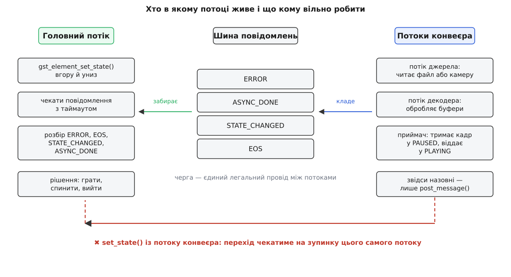
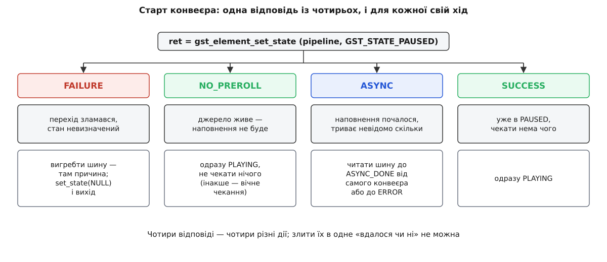

# ⚙️ Керування конвеєром із коду: стани разом із шиною

Близько двохсот рядків мовою C, які роблять те, що в підручниках зазвичай зводять до двох викликів: піднімають конвеєр із NULL у PLAYING, доводять його до кінця потоку й акуратно опускають назад. Та сама програма запускає й файл, і камеру — не через прапорець у командному рядку, а тому, що чесно розбирає всі чотири можливі відповіді на прохання змінити стан і для кожної робить різне. Нижче — повний текст програми частинами, які склеюються в один файл, з поясненням, чому кожна частина саме така, а далі — пастки, у які падають ті, хто скоротив цей код до «поставив PLAYING і побіг».

Мова тут не з вибору, а з обмеження: [GStreamer](book:media-vision/pipeline-model) — бібліотека, написана мовою C поверх GObject, і керування станами живе саме там. Обгортки для інших мов лише переносять ті самі виклики й ті самі правила, тому дивитися варто на первісний вигляд.

## Чому драйвер — це цикл, а не послідовність викликів

Спокуса написати `set_state(PLAYING); ... ; set_state(NULL);` виникає з думки, що конвеєр — це функція, яку викликають. Насправді конвеєр — це кілька живих потоків виконання, які працюють паралельно з тим, хто їх запустив.

Розділення обов'язків тут жорстке. Потоки конвеєра тягнуть буфери від джерела до приймача; вони й тільки вони торкаються даних. Головний потік не бачить жодного буфера — він володіє скінченним автоматом станів і має право просити переходи. Між цими двома світами є рівно один легальний провід — [шина повідомлень](book:media-vision/bus-and-messages): потоки конвеєра кладуть у неї записки, головний потік їх забирає.



*Шина розв'язує потоки в часі: той, хто кладе повідомлення, не чекає, доки його прочитають.*

Звідси і форма програми. Головний потік не може просто стояти й чекати результату переходу, бо результат приїде саме тією чергою, яку він перестав читати. Отже, драйвер мусить бути циклом: забрав повідомлення — розібрав — вирішив, що робити зі станом — забрав наступне. Усе інше — деталі цього циклу.

## Що тримає драйвер

```c
/* state-driver.c — керований життєвий цикл конвеєра GStreamer.
 *
 * збірка:
 *   cc state-driver.c -o state-driver $(pkg-config --cflags --libs gstreamer-1.0)
 * файл:
 *   ./state-driver "filesrc location=clip.mp4 ! decodebin ! videoconvert ! autovideosink"
 * камера:
 *   ./state-driver "v4l2src device=/dev/video0 ! videoconvert ! autovideosink"
 */
#include <gst/gst.h>

typedef struct {
  GstElement *pipeline;  /* конвеєр, яким керуємо */
  GstBus     *bus;       /* його шина: окреме посилання, яке ми зобов'язані віддати */
  gboolean    is_live;   /* джерело живе → попереднього наповнення не буде ніколи */
  gboolean    quit;      /* цикл має завершитися */
  gboolean    failed;    /* завершуємося через помилку, а не через кінець потоку */
} Driver;
```

Структура невелика, але кожне поле в ній з'явилося з конкретної потреби.

`pipeline` і `bus` тримаємо поруч, бо шина потрібна в кожній функції драйвера, а діставати її щоразу заново — це щоразу нове посилання, яке треба щоразу віддавати; один раз узяти й один раз віддати надійніше.

`is_live` — не декорація. Живість джерела не видно ні з опису конвеєра, ні з імені елемента: `rtspsrc` може бути й живим, і ні, залежно від сервера. Єдине місце, де конвеєр каже про це прямо, — відповідь на перехід у PAUSED, і цю відповідь треба запам'ятати, бо далі поведінка програми від неї залежить.

`quit` і `failed` розділено навмисно. Вийти можна з двох причин — потік скінчився або щось зламалося, — і код завершення процесу має їх розрізняти. Злиття цих двох прапорців в один дає програму, яка мовчки повертає нуль після аварії.

## Розбір одного повідомлення

```c
/* Розібрати одне повідомлення. Викликається ЛИШЕ з головного потоку —
   тому тут вільно чіпати стан конвеєра. */
static void
handle_message (Driver *d, GstMessage *msg)
{
  switch (GST_MESSAGE_TYPE (msg)) {

    case GST_MESSAGE_ERROR: {
      GError *err = NULL;
      gchar  *dbg = NULL;

      gst_message_parse_error (msg, &err, &dbg);
      g_printerr ("ПОМИЛКА від «%s»: %s\n", GST_MESSAGE_SRC_NAME (msg), err->message);
      if (dbg)
        g_printerr ("  подробиці: %s\n", dbg);
      g_clear_error (&err);
      g_free (dbg);

      d->failed = TRUE;
      d->quit = TRUE;
      break;
    }

    case GST_MESSAGE_WARNING: {
      GError *err = NULL;
      gchar  *dbg = NULL;

      gst_message_parse_warning (msg, &err, &dbg);
      g_printerr ("попередження від «%s»: %s\n", GST_MESSAGE_SRC_NAME (msg), err->message);
      g_clear_error (&err);
      g_free (dbg);
      break;                       /* конвеєр живий — не виходимо */
    }

    case GST_MESSAGE_EOS:
      g_print ("потік дійшов кінця\n");
      d->quit = TRUE;
      break;

    case GST_MESSAGE_STATE_CHANGED:
      /* діти звітують сюди теж; нас цікавить лише сам конвеєр */
      if (GST_MESSAGE_SRC (msg) == GST_OBJECT (d->pipeline)) {
        GstState old_state, new_state, pending;

        gst_message_parse_state_changed (msg, &old_state, &new_state, &pending);
        g_print ("конвеєр: %s → %s%s\n",
                 gst_element_state_get_name (old_state),
                 gst_element_state_get_name (new_state),
                 pending == GST_STATE_VOID_PENDING ? "" : " (є ще незавершене)");
      }
      break;

    case GST_MESSAGE_CLOCK_LOST:
      /* елемент, що давав годинник, зник; новий вибирається лише
         на переході в PLAYING — тож зробимо цей перехід примусово */
      g_print ("годинник утрачено — перевибираємо\n");
      gst_element_set_state (d->pipeline, GST_STATE_PAUSED);
      gst_element_set_state (d->pipeline, GST_STATE_PLAYING);
      break;

    case GST_MESSAGE_APPLICATION:
      /* записка від потоків конвеєра до нас — про це далі */
      if (gst_message_has_name (msg, "app-stop"))
        d->quit = TRUE;
      break;

    default:
      break;
  }
}
```

Розбір ERROR виглядає багатослівним, але коротшим бути не може. `gst_message_parse_error` віддає дві речі й обидві у власність: `GError` із коротким людським текстом і рядок подробиць із назвою файлу та рядком у сирцях плагіна. Перший показують користувачеві, другий — у журнал; обидва треба звільнити, інакше кожна помилка коштує вам кілька сотень байтів пам'яті назавжди. `GST_MESSAGE_SRC_NAME` дає ім'я винуватця й безпечний навіть тоді, коли джерела в повідомленні немає, — без нього довелося б писати перевірку на порожній вказівник.

Розділення ERROR і WARNING — не формальність. Попередження означає «сталося щось не те, але потік іде далі»: не знайшовся кодек субтитрів, не вдалося прочитати мітку. Програма, яка гасить конвеєр на кожному попередженні, падає на цілком робочих файлах.

Найважливіший рядок у всьому розборі — перевірка `GST_MESSAGE_SRC (msg) == GST_OBJECT (d->pipeline)` у гілці STATE_CHANGED. Контейнер пропускає повідомлення дітей на застосункову шину, тож на конвеєрі з десяти елементів кожен перехід дає десять записок, і в них немає ніякого порядку, бо перемикання йде своїм чином, а не тим, у якому їх зручно читати. Стан самого конвеєра змінюється рівно один раз — тоді, коли останній із дітей закінчив, — і саме це повідомлення несе відповідь на питання «а де ми зараз». Без перевірки джерела програма реагує на проміжні стани окремих елементів і поводиться незрозуміло: наприклад, вважає, що конвеєр уже в PLAYING, коли туди дійшов лише приймач.

Гілка CLOCK_LOST — єдине місце, де драйвер міняє стан не з власної волі. Годинник конвеєра дає котрийсь із елементів, найчастіше звуковий приймач; якщо цей елемент зникає з конвеєра на ходу, годинника більше немає. Новий вибирається тільки на переході в PLAYING, тому лікування точно таке, як записано: спуститися на щабель і піднятися назад. Виглядає як хитрощі, але іншого способу перевибрати годинник у чинному API немає.

## Два способи почекати

```c
/* Забрати все, що вже лежить на шині, і нічого не чекати.
   Потрібно після провалу: причина вже надіслана й лежить там. */
static void
drain_bus (Driver *d)
{
  GstMessage *msg;

  while ((msg = gst_bus_pop (d->bus)) != NULL) {
    handle_message (d, msg);
    gst_message_unref (msg);
  }
}

/* Дочекатися завершення попереднього наповнення, не гублячи решти повідомлень.
   TRUE — наповнення завершилося; FALSE — помилка, кінець потоку або таймаут. */
static gboolean
wait_for_async_done (Driver *d, GstClockTime limit)
{
  gint64 deadline = g_get_monotonic_time () + limit / GST_USECOND;

  for (;;) {
    gint64 left_us = deadline - g_get_monotonic_time ();
    GstMessage *msg;

    if (left_us <= 0) {
      g_printerr ("наповнення не завершилося за відведений час\n");
      return FALSE;
    }

    msg = gst_bus_timed_pop_filtered (d->bus, left_us * GST_USECOND, GST_MESSAGE_ANY);
    if (msg == NULL)
      continue;                    /* час вийшов — вирішить перевірка вгорі */

    if (GST_MESSAGE_TYPE (msg) == GST_MESSAGE_ASYNC_DONE &&
        GST_MESSAGE_SRC (msg) == GST_OBJECT (d->pipeline)) {
      gst_message_unref (msg);
      return TRUE;
    }

    handle_message (d, msg);
    gst_message_unref (msg);

    if (d->quit)                   /* ERROR або EOS прилетіли раніше за наповнення */
      return FALSE;
  }
}
```

`drain_bus` існує через дрібницю, яка коштує людям годин: коли зміна стану провалилася, функція повертає саму лише ознаку провалу — без слова про причину. Причина в цю мить уже лежить на шині окремим повідомленням, і якщо програма піде звідси прямо на вихід, вона надрукує «не вдалося» і не скаже, що саме. Тому після кожного провалу шину треба вигребти — не чекаючи нічого нового, бо нового вже й не буде.

`wait_for_async_done` — те місце, де більшість прикладів із мережі помиляється. Природно написати `gst_bus_timed_pop_filtered (bus, timeout, GST_MESSAGE_ASYNC_DONE)` і чекати саме на потрібне повідомлення. Так робити не можна: цей виклик **відкидає** все, що не збіглося з фільтром, і повідомлення про помилку, яке прилетіло замість завершення наповнення, зникне безслідно. Програма чекатиме до таймауту, а потім скаже «конвеєр не наповнився», хоча насправді там давно лежала точна діагностика.

Тому фільтр тут `GST_MESSAGE_ANY`, а розбір — свій: усе, що не є очікуваним ASYNC_DONE від самого конвеєра, іде у звичайний обробник. Так помилка під час наповнення дає негайний і зрозумілий вихід, а не мовчазне чекання.

Термін чекання рахуємо не таймаутом одного виклику, а власним строком за монотонним годинником. Причина проста: до нас може прийти десяток чужих повідомлень, і якби кожен виклик чекав повний таймаут заново, загальне чекання розтяглося б у стільки разів, скільки повідомлень надійшло. `g_get_monotonic_time` вимірює час у мікросекундах і не зсувається, коли системний годинник переводять, — для строків годиться саме він, а не час доби.

## Старт: чотири відповіді — чотири ходи



*Три з чотирьох відповідей означають «усе гаразд», але роблять із них три різні речі.*

```c
int
main (int argc, char *argv[])
{
  Driver d = { NULL, NULL, FALSE, FALSE, FALSE };
  GError *err = NULL;
  GstStateChangeReturn ret;
  int rc = 0;

  gst_init (&argc, &argv);

  if (argc < 2) {
    g_printerr ("вжиток: %s \"<опис конвеєра>\"\n", argv[0]);
    return 2;
  }

  d.pipeline = gst_parse_launch (argv[1], &err);
  if (d.pipeline == NULL) {
    g_printerr ("конвеєр не зібрано: %s\n", err ? err->message : "причина невідома");
    g_clear_error (&err);
    return 2;
  }
  if (err != NULL) {               /* зібрався, але не без зауважень */
    g_printerr ("зауваження при зборі: %s\n", err->message);
    g_clear_error (&err);
  }

  d.bus = gst_element_get_bus (d.pipeline);

  /* Крок 1: у PAUSED — і лише тут стає видно, з чим ми маємо справу. */
  ret = gst_element_set_state (d.pipeline, GST_STATE_PAUSED);

  switch (ret) {
    case GST_STATE_CHANGE_FAILURE:
      g_printerr ("перехід у PAUSED провалився\n");
      drain_bus (&d);              /* причина вже на шині */
      rc = 1;
      goto teardown;

    case GST_STATE_CHANGE_NO_PREROLL:
      g_print ("джерело живе: наповнення не буде — не чекаємо нічого\n");
      d.is_live = TRUE;
      break;

    case GST_STATE_CHANGE_ASYNC:
      g_print ("наповнення триває — чекаємо ASYNC_DONE\n");
      if (!wait_for_async_done (&d, 10 * GST_SECOND)) {
        rc = 1;
        goto teardown;
      }
      g_print ("наповнено: конвеєр у PAUSED\n");
      break;

    case GST_STATE_CHANGE_SUCCESS:
      g_print ("PAUSED досягнуто одразу\n");
      break;
  }

  /* Наповнення (якщо воно було) дало відповіді, яких до нього не існувало. */
  if (!d.is_live) {
    gint64 duration = -1;

    if (gst_element_query_duration (d.pipeline, GST_FORMAT_TIME, &duration))
      g_print ("тривалість: %" GST_TIME_FORMAT "\n", GST_TIME_ARGS (duration));
    else
      g_print ("тривалість невідома — потік без кінця\n");
  }
```

Перший крок нагору робимо не до PLAYING, а до PAUSED — і це навмисно. Проміжна зупинка потрібна тому, що саме на ній конвеєр уперше відповідає на питання, якого йому більше ніхто не поставить: наповнюватися він буде чи не буде. Стандартний `gst-launch-1.0` побудований точно так само: спершу PAUSED, розбір відповіді, потім PLAYING.

Тепер по гілках.

**FAILURE.** Провал не повертає конвеєр туди, звідки він вирушив: частина елементів устигла перейти й тримає відкриті пристрої. Тому дорога звідси одна — вигребти шину заради причини й іти на спуск до NULL. Ніяких «спробуємо ще раз із того самого місця»: місця, з якого пробувати, більше немає.

**NO_PREROLL.** Конвеєр каже: перехід удався, але даних у PAUSED не буде — джерело живе. Це означає, що ASYNC_DONE не прилетить ніколи, і програма, яка на нього чекає, зависне назавжди. Тому тут єдина дія — запам'ятати живість і йти далі, не чекаючи нічого.

**ASYNC.** Перехід почався й триває невідомо скільки. Ось тут чекання доречне, і саме тут потрібен строк: файл на мережевому диску або камера, що не відповідає, можуть не наповнитися ніколи, а програма, яка не має терпіння, мусить мати таймаут. Десять секунд — величина з практики, не із стандарту; для локального файлу вистачає й одної, для RTSP-джерела за поганим каналом мало й тридцяти.

**SUCCESS.** Конвеєр уже в PAUSED. Так відповідають короткі ланцюги, де немає чого наповнювати.

> 🔧 **Навіщо це.** Саме розбір усіх чотирьох відповідей робить одну програму придатною і для файлу, і для камери, і для мережевого потоку. Альтернатива — окремі гілки коду під кожен вид джерела й налаштування «це камера», яке рано чи пізно виставлять неправильно, після чого програма чекатиме наповнення від того, хто ніколи не наповнюється. Конвеєр і так знає про себе все потрібне; питання лише в тому, чи ви його слухаєте.

Запит тривалості наприкінці — не прикраса, а те, заради чого чекання й було потрібне. До наповнення тривалість файлу невідома нікому: щоб її знати, треба прочитати заголовок, а щоб прочитати заголовок, дані мусять пройти ланцюгом. Саме тому запит стоїть після ASYNC_DONE і саме тому його не роблять для живого джерела — у камери тривалості немає в принципі, і чесна відповідь тут — не нуль, а «питання не має сенсу».

## PLAYING і головний цикл

```c
  /* Крок 2: у PLAYING. ASYNC тут — не біда: доводити перехід до кінця
     буде цикл нижче, а нам чекати нема потреби. */
  ret = gst_element_set_state (d.pipeline, GST_STATE_PLAYING);
  if (ret == GST_STATE_CHANGE_FAILURE) {
    g_printerr ("перехід у PLAYING провалився\n");
    drain_bus (&d);
    rc = 1;
    goto teardown;
  }

  /* Крок 3: живемо, поки шина не скаже інакше. */
  while (!d.quit) {
    GstMessage *msg = gst_bus_timed_pop_filtered (d.bus, 100 * GST_MSECOND,
                                                  GST_MESSAGE_ANY);
    if (msg == NULL) {
      /* сюди потрапляємо десять разів на секунду: місце для власної
         періодичної роботи — опитати позицію, оновити вікно, глянути прапорці */
      continue;
    }

    handle_message (&d, msg);
    gst_message_unref (msg);
  }

  if (d.failed)
    rc = 1;

teardown:
  /* Крок 4: униз до NULL — і лише потім віддавати посилання. */
  gst_element_set_state (d.pipeline, GST_STATE_NULL);
  gst_object_unref (d.bus);
  gst_object_unref (d.pipeline);

  return rc;
}
```

Перехід у PLAYING перевіряємо лише на провал, і це свідома асиметрія. Тут немає нічого, чого варто було б дочекатися: якщо конвеєр відповів «триває», перехід дійде до кінця сам, а повідомлення про це прийде в цикл, який уже крутиться. Чекати тут — це чекати заради того, щоб одразу почати чекати ще раз.

Таймаут у сто мілісекунд у циклі — не спосіб економити процесор, а точка входу для решти програми. Виклик із таймаутом спить, доки не з'явиться повідомлення, і не крутить процесор дарма; коли ж час виходить, керування повертається нам, і ми можемо зробити свою періодичну роботу — намалювати повзунок, опитати позицію, глянути, чи не натиснув користувач «стоп». Без таймауту (тобто з нескінченним чеканням) програма з графічним вікном застигла б між кадрами.

Порядок трьох рядків прибирання — не смаковий. Спершу конвеєр опускається в NULL: цей перехід зупиняє потоки, вимикає пади й закриває пристрої, і поки він не завершився, у пам'яті конвеєра ще хтось живе. Лише після цього посилання можна віддавати. Спроба знищити конвеєр не в NULL закінчується критичним попередженням у консоль і незакритою камерою: рушій прямо каже, що елемент треба було спершу перевести в NULL, а вже тоді відпускати останнє посилання.

Шину віддаємо окремо, бо `gst_element_get_bus` віддав нам **нове** посилання. Правило GObject тут просте й безжальне: узяв — віддай. Пропущений `gst_object_unref (d.bus)` — найтихіший витік у цьому коді, бо жодного симптому, крім повільного росту пам'яті в програмі, що перезапускає конвеєр сотні разів.

## Збірка й що видно на екрані

**Збірка й запуск на файлі.**

```text
$ cc state-driver.c -o state-driver $(pkg-config --cflags --libs gstreamer-1.0)
$ ./state-driver "filesrc location=clip.mp4 ! decodebin ! videoconvert ! autovideosink"
наповнення триває — чекаємо ASYNC_DONE
конвеєр: NULL → READY
конвеєр: READY → PAUSED
наповнено: конвеєр у PAUSED
тривалість: 0:00:14.976000
конвеєр: PAUSED → PLAYING
потік дійшов кінця
конвеєр: PLAYING → PAUSED
конвеєр: PAUSED → READY
конвеєр: READY → NULL
```

Видно все, про що йшлося: перехід у PAUSED повернув «триває», ASYNC_DONE прийшов уже після READY → PAUSED, тривалість стала відома лише після нього, а спуск дав три окремі переходи вниз.

**Та сама програма на камері.**

```text
$ ./state-driver "v4l2src device=/dev/video0 ! videoconvert ! autovideosink"
джерело живе: наповнення не буде — не чекаємо нічого
конвеєр: NULL → READY
конвеєр: READY → PAUSED
конвеєр: PAUSED → PLAYING
```

Тут інша гілка старту, тривалості немає, EOS не буде ніколи — вихід лише за Ctrl+C або за помилкою. Жодного прапорця «це камера» в командному рядку не було: різницю програма дізналася від самого конвеєра.

## Пастки

**Зміна стану з обробника даних вішає програму намертво.** Проба на паді, зворотний виклик [appsink](book:media-vision/appsink-appsrc), сигнал від елемента — усе це виконується в потоці конвеєра. Виклик `gst_element_set_state` униз чекає, доки потоки конвеєра зупиняться; якщо його зроблено з одного з цих потоків, потік чекає на власну зупинку — і не дочекається ніколи. Документація GStreamer каже про це прямо: виклик зміни стану просто з потоку даних дає [взаємне блокування](book:programming/deadlock) в багатьох ситуаціях, бо перехід може вимагати зупинки того самого потоку, з якого його викликано.

Правильний хід — записка головному потокові:

```c
static GstPadProbeReturn
on_buffer (GstPad *pad, GstPadProbeInfo *info, gpointer user_data)
{
  Driver *d = user_data;
  static guint frames = 0;         /* проба одна — статичний лічильник тут доречний */

  if (++frames < 300)
    return GST_PAD_PROBE_OK;

  /* НЕ gst_element_set_state (...), а повідомлення на шину */
  gst_element_post_message (d->pipeline,
      gst_message_new_application (GST_OBJECT (d->pipeline),
          gst_structure_new_empty ("app-stop")));

  return GST_PAD_PROBE_REMOVE;     /* більше нас не турбувати */
}
```

Повідомлення типу APPLICATION існує саме для цього — воно нічого не значить для рушія й повністю віддане застосункові. Головний цикл забере його зі шини, гілка `GST_MESSAGE_APPLICATION` виставить `quit`, і стан зміниться там, де це дозволено. Ім'я структури мусить починатися з латинської літери, а далі містити лише літери, цифри й кілька службових знаків (`/-_.:+`): перевірка імені в GStreamer пропускає тільки їх, і структура з кириличною назвою просто не створиться.

**`get_state` із нескінченним таймаутом — найдорожчий рядок у програмі.** Виклик `gst_element_get_state (pipeline, NULL, NULL, GST_CLOCK_TIME_NONE)` блокує потік, доки перехід не завершиться. Написати його спокусливо: виглядає як чесне «дочекайся, поки конвеєр справді буде готовий». Але тут дві біди відразу.

Перша: перехід може не завершитися ніколи. Мережеве джерело мовчить, [caps](book:media-vision/caps-negotiation) не узгодилися, ланцюг обірвався посередині — наповнення не настане, і чекання буде вічним. Друга, гірша: доки головний потік стоїть у цьому виклику, шину не читає ніхто. Повідомлення про помилку, яке пояснює, що саме сталося, спокійно лежить у черзі — і не буде прочитане, бо той, хто мав його прочитати, чекає на подію, якої вже не станеться. Програма виглядає як така, що зависла без причини, хоча причина є й лежить за метр.

Звідси правило: чекати треба на шині, а не на стані. Чекання на шині чує і завершення, і помилку; чекання на стані — тільки завершення. Якщо `get_state` усе-таки потрібен (наприклад, щоб дізнатися поточний стан без блокування), давайте йому нульовий таймаут — тоді він відповість негайно тим, що знає, і не чіпатиме нікого.

**Провал вимагає спуску до самого низу.** Спокуса після невдалого переходу в PAUSED спробувати ще раз або перейти в READY і піднятися звідти велика — а робити так не можна. Контейнер перемикає дітей по черзі; коли один із них відмовив, попередні вже перейшли й тримають ресурси, а наступні не чіпалися взагалі. Конвеєр після провалу — суміш елементів у різних станах, і жоден із них не знає про це. Єдина точка, у якій усі елементи гарантовано однакові, — NULL, і саме туди треба спуститися перед будь-якою наступною дією.

**Вузький фільтр шини мовчки з'їдає решту.** `gst_bus_timed_pop_filtered` і `gst_bus_pop_filtered` не «пропускають повз» те, що не збіглося з маскою, — вони це **викидають**. Код `pop_filtered (bus, GST_MESSAGE_ERROR | GST_MESSAGE_EOS)` у циклі виглядає економно й працює доти, доки не знадобиться ASYNC_DONE або STATE_CHANGED: їх уже не буде, бо їх викинув попередній оберт циклу. Тому в головному циклі фільтр має бути `GST_MESSAGE_ANY`, а розбирати треба своїм `switch`. Вузький фільтр доречний лише там, де решта справді більше не потрібна, — наприклад, у самому кінці, коли конвеєр уже гаситься.

**Стеження за шиною без головного циклу не спрацьовує жодного разу.** Замість власного циклу шину можна читати через `gst_bus_add_watch` — це зручніше, коли програма й так має [цикл подій](book:programming/event-loop) GLib, наприклад через графічний інтерфейс:

```c
static gboolean
on_bus_message (GstBus *bus, GstMessage *msg, gpointer user_data)
{
  Driver *d = user_data;

  handle_message (d, msg);
  if (d->quit)
    g_main_loop_quit (d->loop);    /* до Driver додано поле GMainLoop *loop */

  return TRUE;                     /* TRUE — стежити далі */
}

/* у main — замість власного циклу з gst_bus_timed_pop_filtered: */
  guint watch_id = gst_bus_add_watch (d.bus, on_bus_message, &d);

  d.loop = g_main_loop_new (NULL, FALSE);
  g_main_loop_run (d.loop);        /* без цього рядка обробник не викличеться ніколи */

  g_source_remove (watch_id);
  g_main_loop_unref (d.loop);
```

Стеження за шиною — це джерело подій у головному циклі GLib, і без запущеного циклу воно просто ніколи не дійде до виконання. Симптом класичний: обробник написано, повідомлення на шину надходять, а всередину не потрапляє жодне. Другий бік тієї самої монети — не блокувати головний потік нічим довгим, доки цикл працює: усе, що блокує його, глушить і шину.

**Запис у файл, обірваний спуском у NULL, дає нечитний файл.** Якщо конвеєр не показує, а пише — через `mp4mux`, `matroskamux`, будь-який пакувальник, — то просто опустити його в NULL мало. Пакувальник дописує заголовок і покажчик кадрів **на кінці потоку**, і без сигналу «кінець» він цього не зробить: у файлі лишиться тіло без змісту, і жоден програвач його не відкриє. Правильне завершення виглядає так:

```c
  /* лише для конвеєра, що пише файл */
  GstMessage *last;

  gst_element_send_event (d.pipeline, gst_event_new_eos ());

  last = gst_bus_timed_pop_filtered (d.bus, 5 * GST_SECOND,
                                     GST_MESSAGE_EOS | GST_MESSAGE_ERROR);
  if (last)
    gst_message_unref (last);

  gst_element_set_state (d.pipeline, GST_STATE_NULL);
```

Подія кінця потоку йде ланцюгом за течією даних і доходить до пакувальника; той дописує що треба й передає EOS далі, аж до шини. Ось тут вузький фільтр доречний — після цієї миті нас справді більше нічого не цікавить, а п'ять секунд строку рятують від вічного чекання, якщо десь усередині щось зламалося.

**Спуск у NULL, який не повертається.** Якщо програма застигла саме на `set_state (pipeline, GST_STATE_NULL)`, то якийсь потік конвеєра стоїть у блокуючому читанні — з сокета, з пристрою, з файлу на мережевому диску, — і зупинити його неможливо, доки читання не поверне керування. Лікується це не в драйвері, а в конвеєрі: мережевим елементам виставляють таймаути (`rtspsrc` має `timeout`, `tcpclientsrc` — власні межі), а джерела, що вміють, переводять у неблокуючий режим. Побачити, який саме елемент тримає програму, найпростіше графом конвеєра й журналом рушія — це окрема тема [діагностики конвеєра](book:media-vision/pipeline-debugging).
