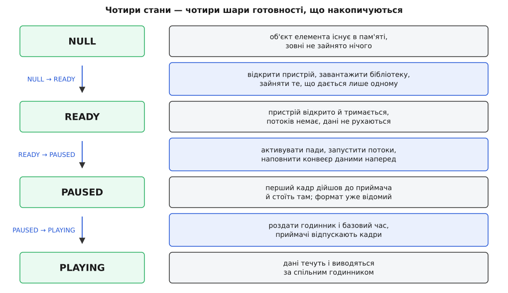
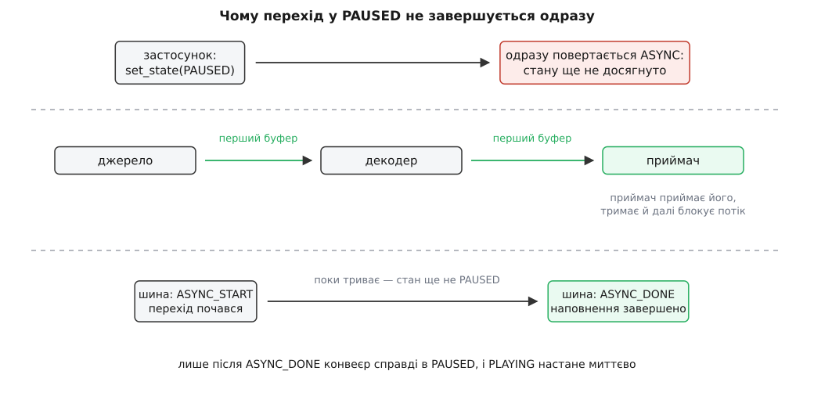
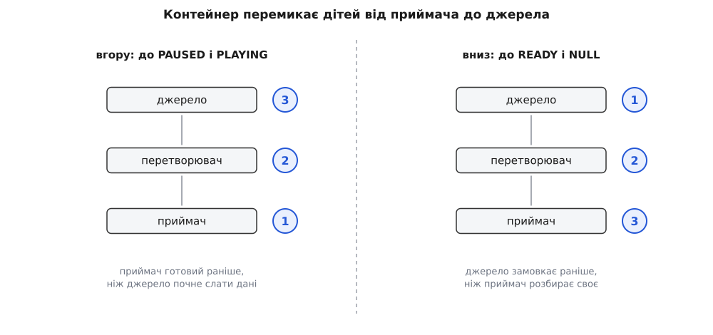

# Стани конвеєра й переходи між ними

<preknowlist>
- [Конвеєр: елементи, зв'язки й потік даних](topic:media-vision/pipeline-model) — конвеєр складається з елементів, з'єднаних у ланцюг; дані йдуть від джерела до приймача.
- [Пади і з'єднання елементів](topic:media-vision/pads-and-linking) — дані входять в елемент і виходять із нього через пади; пад можна ввімкнути й вимкнути.
- [Шина повідомлень: події й помилки конвеєра](topic:media-vision/bus-and-messages) — конвеєр не звітує поверненим значенням, а надсилає застосункові повідомлення окремою чергою.
- [Годинник, мітки часу й синхронізація потоків](topic:media-vision/clock-and-sync) — спільний годинник і базовий час, від яких відлічують момент показу кадру.
- [Скінченний автомат](topic:programming/state-machine) — система з переліченими станами й дозволеними переходами; чого немає в переліку переходів, того не буває.
- [Процес і потік](topic:programming/process-vs-thread) — потік як окрема лінія виконання, що працює паралельно з тим, хто його запустив.
</preknowlist>

## Чому «увімкнути» — це не одна дія

Завдання виглядає простим: показати картинку з камери. Ланцюг короткий — джерело, декодер, приймач, — і хочеться, щоб у нього була одна кнопка «пуск». Але перелічімо чесно, що мусить статися між натисканням і першим кадром на екрані.

Хтось має відкрити пристрій `/dev/video0`. Пристрій один, і поки його тримає ця програма, іншій він не дістанеться. Хтось має підвантажити бібліотеку декодера — можливо, разом із драйвером відеокарти. Хтось має домовитися про формат: камера вміє кілька, декодер розуміє не всі. Хтось має виділити пам'ять під кадри — а щоб знати їхній розмір, треба спершу знати формат, тобто домовитися. Хтось має запустити потоки, які штовхатимуть дані ланцюгом. І лише коли все це готове, з'являється сенс у питанні «а в яку саме мить показати цей кадр» — питанні про годинник.

Дії з цього списку коштують дуже по-різному й тримаються по-різному довго. Підвантажена бібліотека — дешево, і її не шкода тримати хоч усю роботу програми. Відкритий пристрій — дорого й ексклюзивно: поки програма стоїть на паузі, камера все одно зайнята нею, і сусідній застосунок бачить помилку «пристрій зайнято». Запущений потік — це жива нитка виконання, яку не можна просто забути: її треба зупинити, і зупинити раніше, ніж зникне пам'ять, у яку вона пише.

Звідси головне. Готовність конвеєра — не «так чи ні», а кілька шарів, що накопичуються один на одному, причому кожен наступний спирається на попередній: не домовившись про формат, не виділиш буфер потрібного розміру; не відкривши пристрій, не дізнаєшся, які формати він узагалі вміє. Ці шари й перелічені в GStreamer як стани елемента, а рух між ними — як переходи.

## Чотири шари готовності

Станів рівно чотири, і кожен відповідає на питання «що вже зайнято й що вже рухається».

**NULL** — початок. Об'єкт елемента створено, він займає трохи пам'яті процесу, і більше нічого: жодного відкритого пристрою, жодного потоку, жодного байта даних. У цей самий стан елемент повертається перед знищенням; тому знищити конвеєр, не провівши його через NULL, означає лишити по собі відкриті пристрої.

**READY** — усе, що не залежить від конкретного потоку даних, уже зайнято. Пристрій відкрито, бібліотеку завантажено, ексклюзивні ресурси в руках. Але дані не рухаються й формат ще не узгоджено: у READY елемент лише *здатен* піти далі. Практичний сенс цього стану саме такий — тримати за собою пристрій, поки програма ще не готова показувати.

**PAUSED** — потоки запущено, пади активовано, дані вже пішли ланцюгом і дійшли до приймача, де й зупинилися. Формат до цієї миті вже узгоджено, бо узгодження [caps](topic:media-vision/caps-negotiation) відбувається на самому початку руху даних, а не раніше. Це стан, у якому конвеєр повністю налаштований і чекає лише команди.

**PLAYING** — те саме, що PAUSED, з єдиною відмінністю: приймачі більше не тримають дані, а віддають їх назовні за годинником, а живі джерела починають виробляти нові дані. Для більшості елементів усередині ланцюга — фільтрів, перетворювачів, декодерів — між PAUSED і PLAYING немає жодної різниці: вони обробляють те, що приходить, і не дивляться на годинник. Різниця стосується двох кінців ланцюга.



*Кожен стан — це шар зайнятих ресурсів; перехід угору доливає шар, перехід униз знімає його. Тому «зупинити» — це не одна дія, а стільки дій, скільки шарів треба зняти.*

> 🔧 **Навіщо це.** Розділення на READY і PAUSED — не формальність, а спосіб керувати ексклюзивністю. Програма, що показує кілька камер по черзі, тримає неактивні конвеєри в READY: пристрій уже відкрито, тож перемикання займає мілісекунди замість сотень мілісекунд на відкриття. А програма, що має віддавати камеру сусідньому застосунку, мусить опускати конвеєр аж до NULL — у READY пристрій усе ще її.

## Через сходинку не перестрибнути

Прохання «стань PLAYING» до елемента в NULL не виконується одним стрибком. GStreamer проводить елемент через усі проміжні стани по черзі: NULL → READY, READY → PAUSED, PAUSED → PLAYING. Інакше й бути не може: щоб запустити потік, потрібен відкритий пристрій, а щоб віддавати кадри за годинником, потрібен уже наповнений конвеєр.

Це має два наслідки, які видно в роботі щодня.

Перший: переходів як окремих подій рівно шість — три вгору й три вниз, — і саме на них, а не на станах, елемент виконує роботу. Стан — це «де ми є», перехід — «що зробити». Тому в коді плагіна ніколи не пишуть «що робити в PAUSED», а пишуть «що зробити на READY → PAUSED».

Другий, важливіший: один виклик зміни стану може провалитися посередині. Якщо `/dev/video0` зайнято, конвеєр не подолає навіть перший перехід; якщо пристрій відкрився, але формат ніхто не зміг узгодити, він застрягне на другому. Із самого лише повернення функції ви не дізнаєтеся, де саме зупинилися й чому: там буде тільки ознака провалу. Справжня причина приїде окремим повідомленням про помилку [шиною](topic:media-vision/bus-and-messages), і без читання шини діагностика конвеєра неможлива в принципі.

## PAUSED — не пауза, а готовність до першого кадру

Назва PAUSED збиває з пантелику, бо натякає на кнопку «пауза» в програвачі. Насправді це стан, у якому конвеєр робить найбільше роботи.

Погляньмо, чому він мусив з'явитися. Хай приймач починає віддавати кадри одразу, щойно отримав команду грати. Перший кадр треба ще прочитати з файлу, розібрати заголовок, узгодити формат, виділити буфери, декодувати — це десятки мілісекунд, а для мережевого джерела й сотні. Отже, між командою «грай» і першим зображенням буде видима пауза, і чим складніший ланцюг, тим вона довша. Гірше: тривалість файлу, справжня роздільність картинки, наявність звукової доріжки стають відомі лише після того, як дані реально пройшли ланцюгом. Програма, що хоче показати повзунок із тривалістю *до* початку відтворення, не має звідки взяти цю тривалість.

Обидві проблеми знімає той самий хід: провести дані ланцюгом *заздалегідь* і зупинити їх перед самим виходом. Приймач приймає перший буфер, не віддає його назовні, а тримає й блокує потік, який його приніс. Формат уже узгоджено, буфери вже виділено, декодер уже прогрітий — лишилося тільки відпустити. Цей етап у GStreamer зветься preroll (англ. *pre-roll* — «прокрутити наперед»); далі називатимемо його попереднім наповненням.

Тепер перехід PAUSED → PLAYING коштує стільки, скільки коштує зняти блокування — тобто майже нічого. Саме тому програвачі перемотують і стартують миттєво: уся дорога робота вже зроблена в PAUSED.

Але за це доведеться заплатити чесністю в іншому місці. Скільки триває попереднє наповнення, заздалегідь не знає ніхто: це залежить від диска, від мережі, від складності потоку. Змусити застосунок стояти й чекати всередині виклику неможливо — застосунок має малювати вікно й слухати користувача. Тому виклик зміни стану **повертається одразу**, ще до того, як стан насправді досягнуто, і повідомляє: «прийнято, триває». Про справжнє завершення конвеєр звітує окремим повідомленням шиною.



*Між поверненням виклику й фактичним досягненням стану лежить проміжок, у якому конвеєр уже не в READY, але ще не в PAUSED. Усе, що застосунок робить у цьому проміжку, він робить із конвеєром у невизначеному стані.*

Проміжок обрамлений парою повідомлень: перше сповіщає, що почався перехід із невідомою тривалістю, друге — що наповнення завершене й стан справді досягнуто. Застосунок або чекає другого повідомлення на шині, або питає стан явно, з таймаутом чи без нього; обидва шляхи описані разом із сигнатурами у вставці [що саме викликати: функції станів, коди повернення й повідомлення](topic:media-vision/states-lifecycle/api-state-api.md) — там зібрано контракт цієї частини GStreamer, від переліку переходів до розбору повідомлення про зміну стану.

## Чотири можливі відповіді на прохання змінити стан

Оскільки «прийнято, триває» — законна відповідь, простого «вдалося / не вдалося» вже не досить. GStreamer розрізняє чотири випадки, і кожен із них означає для застосунку іншу поведінку.

**Успіх** — стан досягнуто, і після повернення виклику конвеєр справді там, куди його просили. Так відповідають переходи, у яких нема чого чекати: відкриття пристрою, зупинка, звільнення.

**Асинхронно** — перехід почався і завершиться пізніше. Це нормальна відповідь на перехід у PAUSED для файлу чи мережевого потоку. Ставитися до неї як до успіху — типова помилка: конвеєр ще не готовий, і питання «яка тривалість файлу» в цю мить дасть невідомість.

**Без попереднього наповнення** — окрема відповідь, яку варто читати як «успіх, але наповнення не буде ніколи». Про неї далі.

**Провал** — перехід не вдався. Тут важлива дрібниця, на якій спотикаються: провал не повертає конвеєр туди, звідки він вирушив. Частина елементів могла перейти успішно, і в них лишилися відкриті пристрої й запущені потоки. Тому єдина коректна реакція на провал — опустити конвеєр до NULL, а причину прочитати з повідомлення про помилку.

## Живі джерела: коли наповнити наперед неможливо

Тепер повернімося до камери, з якої почали, і спробуймо застосувати до неї попереднє наповнення. Камера віддає кадр, кадр іде ланцюгом, приймач тримає його і блокує потік. Минає п'ять секунд, користувач тисне «грай» — і на екрані з'являється те, що було п'ять секунд тому. Далі камера віддає наступний кадр, знятий щойно, і в потоці утворюється розрив у п'ять секунд.

Причина в природі джерела. Файл віддає дані на вимогу: скільки попросили, стільки й дав, і те, що лежить на диску, не псується від чекання. Камера й мікрофон виробляють дані в темпі реального часу і не мають «наступного кадру» на запит — вони мають лише той, що знімається зараз. Такі джерела називають живими (англ. *live source*), і наповнити конвеєр наперед вони не можуть за означенням: дані, наповнені наперед, до моменту показу вже застаріють.

Тому живе джерело в PAUSED просто не виробляє нічого — його потік зупиняється в очікуванні PLAYING. І щоб решта системи це знала, на переходах у PAUSED воно відповідає окремим кодом «без попереднього наповнення». Конвеєр збирає відповіді дітей і передає цей код застосункові.

З цього випливає ціла низка речей, які інакше виглядають як загадкові поламки.

Конвеєр із живим джерелом ніколи не надішле повідомлення про завершення наповнення в PAUSED — застосунок, що на нього чекає, зависне назавжди. Правильна поведінка: побачивши код «без наповнення», не чекати нічого, а йти прямо в PLAYING.

PAUSED для живого конвеєра не зберігає даних: поки він стоїть, кадри з камери просто не існують. Це не «пауза», а «стоп із збереженням налаштувань» — саме тому в програмах для камер кнопка паузи або вимкнена, або означає «показувати останній кадр», а не «продовжити з того самого місця».

І нарешті, живість джерела змінює вибір годинника: живий конвеєр бере годинник самого джерела, бо саме воно диктує темп. Так само живість — головна причина, з якої конвеєр мусить рахувати власну [затримку й буферизацію](topic:media-vision/latency-and-buffering): відкладати показ рівно настільки, щоб найповільніша гілка встигала.

## Порядок обходу: чому спершу приймач

Конвеєр — це контейнер, і зміна його стану означає зміну стану кожного елемента всередині. Порядок тут не довільний.

Уявімо, що конвеєр переводить дітей у PAUSED у порядку від джерела до приймача. Джерело оживає першим і починає штовхати буфери в наступний елемент, який ще в READY: пади там не активовані, приймати нікому. У кращому разі буфер відкидається з помилкою, у гіршому — гине потік. Отже, порядок мусить бути протилежний: спершу той, хто приймає, потім той, хто віддає.

Тому вгору контейнер перемикає дітей **від приймачів до джерел**: коли черга доходить до джерела, весь ланцюг попереду вже готовий прийняти дані. Униз — рівно навпаки, **від джерел до приймачів**: спершу замовкає той, хто виробляє, і тільки потім розбирає своє господарство той, хто споживає.



*Правило одне й те саме в обидва боки: той, хто приймає дані, існує довше за того, хто їх віддає.*

Якщо ланцюг розгалужений, «від приймачів до джерел» означає обхід у зворотному топологічному порядку — кожен елемент перемикається після всіх, кому він щось віддає.

## Усередині елемента: де виділяти й де звільняти

Той самий порядок «споживач живе довше» повторюється на один рівень нижче — усередині окремого елемента. Плагін описує свою реакцію на переходи однією функцією, яка отримує позначку переходу й мусить викликати таку саму функцію базового класу. І от розташування власного коду відносно цього виклику визначає, працюватиме елемент чи падатиме випадковими збоями.

Базовий клас робить у цій функції головне: на переходах угору активує пади й запускає потоки, на переходах униз зупиняє потоки й вимикає пади. Тобто саме він створює й прибирає тих, хто торкатиметься ресурсів елемента.

Звідси правило виводиться саме собою. Ресурси, потрібні потоку, мають існувати ще до того, як потік з'явиться, — отже, власна робота на переходах угору робиться **перед** викликом базового класу. Звільняти ресурси можна лише тоді, коли жоден потік їх уже не читає, — отже, власна робота на переходах униз робиться **після** виклику базового класу.

```c
static GstStateChangeReturn
my_filter_change_state (GstElement *element, GstStateChange transition)
{
  MyFilter *self = MY_FILTER (element);
  GstStateChangeReturn ret;

  /* угору — своє ПЕРЕД базовим класом: потоків ще немає */
  switch (transition) {
    case GST_STATE_CHANGE_NULL_TO_READY:
      if (!my_filter_open_device (self))
        return GST_STATE_CHANGE_FAILURE;
      break;
    case GST_STATE_CHANGE_READY_TO_PAUSED:
      my_filter_reset_stream_state (self);
      break;
    default:
      break;
  }

  ret = GST_ELEMENT_CLASS (parent_class)->change_state (element, transition);
  if (ret == GST_STATE_CHANGE_FAILURE)
    return ret;

  /* униз — своє ПІСЛЯ базового класу: потоки вже зупинені */
  switch (transition) {
    case GST_STATE_CHANGE_PAUSED_TO_READY:
      my_filter_free_stream_buffers (self);
      break;
    case GST_STATE_CHANGE_READY_TO_NULL:
      my_filter_close_device (self);
      break;
    default:
      break;
  }

  return ret;
}
```

Зверніть увагу на симетрію переліків: що зайнято на переході вгору, те звільняється на дзеркальному переході вниз. Ресурси, прив'язані до конкретного потоку даних — буфери, стан декодера, розібрані заголовки, — живуть між READY → PAUSED і PAUSED → READY. Ресурси, прив'язані до пристрою, живуть між NULL → READY і READY → NULL. Порушення цієї симетрії дає найнеприємніший клас помилок: елемент, який працює один раз і не працює вдруге, бо щось із першого запуску лишилося недоприбраним.

Пастка, у яку тут падають найчастіше, — доступ до спільних даних елемента з обох боків: із функції зміни стану та з потоку обробки. Поки потік живий, будь-яке поле, яке він читає, є спільним, і його не можна ні звільняти, ні перезаписувати без замка. Саме тому базовий клас зупиняє потоки *перед* тим, як віддати керування вашому коду прибирання: після повернення з нього спільного доступу вже немає й замки не потрібні. Загальний бік цієї проблеми — [безпека щодо потоків](topic:programming/thread-safety).

## Втрачений стан: коли конвеєр сам вертається назад

Досі стан змінював лише застосунок. Але є ситуація, у якій конвеєр змінює його сам.

Хай іде відтворення, і користувач перетягує повзунок. Перемотування з очищенням викидає з конвеєра все, що там було: старі буфери викидаються, потоки розблоковуються, черги спорожняються. Після цього конвеєр порожній — рівно так само, як був порожній до попереднього наповнення. Отже, приймач знову мусить дочекатися першого буфера з нового місця, перш ніж зможе показувати за годинником.

GStreamer описує це прямо: елемент **утрачає стан**. Формально його ціль лишається PLAYING, але фактично він відкочується в PAUSED і повторює попереднє наповнення — з тими самими двома повідомленнями на шині, що й при звичайному переході. Застосунок бачить сповіщення «почався перехід», далі «наповнення завершене», і лише після другого має право вважати, що перемотування добігло кінця. Механіка самої перемотувальної події й того, що саме очищає конвеєр, — окрема тема: [перемотування та скидання конвеєра](topic:media-vision/seeking-and-flush).

Тут же ховається відповідь на питання, чому перемотування взагалі можливе лише з PAUSED або PLAYING. Подія перемотування йде конвеєром проти течії даних, а рухатися їй є чим лише тоді, коли пади активні й потоки запущені — тобто починаючи з PAUSED.

## Що робить із часом перехід PAUSED ↔ PLAYING

Лишилася одна річ, без якої картина неповна: чому пауза не ламає синхронізації.

Кожен буфер несе мітку часу в шкалі потоку, а приймач мусить перевести її в момент за спільним годинником. Робиться це через базовий час: **час програвання** (англ. *running time*) — це показ годинника мінус базовий час, і саме він порівнюється з мітками буферів. Час програвання за задумом дорівнює тому часу, який конвеєр реально провів у PLAYING.

Тепер зрозуміло, що мають робити переходи. На PLAYING → PAUSED конвеєр запам'ятовує, скільки часу програвання накопичено. Годинник далі йде — його ніхто не зупиняє, — але конвеєр більше не рахує цих секунд своїми. На PAUSED → PLAYING конвеєр наново обчислює базовий час так, щоб час програвання продовжився з відкладеного значення, і роздає цей базовий час усім елементам. Секунди, проведені в паузі, просто випадають зі шкали.

Два випадки скидають час програвання в нуль: перехід у READY і перемотування з очищенням. Обидва означають одне й те саме — попереднього руху більше не існує, шкалу заводимо заново. Через це, до речі, повідомлення про початок переходу після втрати стану окремо позначає, що базовий час буде новий: приймачі мусять викинути свій попередній відлік, а не продовжити його.

> 🔧 **Навіщо це.** Звідси випливає правило, яке рятує від дивних симптомів: у живому конвеєрі не користуйтеся PAUSED як паузою. Годинник камери не зупиняється, дані за час паузи не існують, а після повернення в PLAYING базовий час перерахується — тож звук і відео зійдуться, але шматок часу пропаде безслідно. Якщо потрібна справжня пауза з подальшим продовженням, її дає не стан конвеєра, а запис у файл чи буфер перед показом.

## Де це найчастіше застрягає

Усе описане складається в невеликий набір симптомів, кожен з яких тепер читається однозначно.

**Конвеєр застряг у переході в PAUSED і мовчить.** Попереднє наповнення не завершується, бо перший буфер не дійшов до приймача. Причин дві: даних узагалі немає (файл порожній, мережеве джерело мовчить) або формат не узгодився і ланцюг обірвався посередині. Перше видно з відсутності будь-яких повідомлень, друге — з повідомлення про помилку узгодження.

**Виклик переходу в NULL не повертається.** Перехід униз чекає, доки зупиняться потоки, а потік стоїть у блокуючому читанні з пристрою чи сокета. Доти, доки читання не поверне керування, зупинити його ніяк. Саме тому мережеві елементи мають таймаути: без них зупинка конвеєра залежить від чужого сервера.

**Зміна стану з обробника даних вішає програму намертво.** Прохання змінити стан чекає на зупинку потоків, а виконується воно всередині одного з цих потоків, який тепер чекає сам на себе — класичне [взаємне блокування](topic:programming/deadlock). Реакція на подію в конвеєрі має ставити прапорець або надсилати повідомлення, а міняти стан має інший потік.

**Після провалу конвеєр поводиться дивно.** Частина елементів лишилася у вищому стані з відкритими ресурсами. Лікування одне: опустити до NULL і почати спочатку.

**Перезапуск того самого конвеєра дає інший результат, ніж перший запуск.** Десь порушена симетрія «зайняв угору — звільнив униз»: щось із попереднього прогону не скинулося на переході в READY.

Складений із цих шматків правильний цикл керування виглядає компактно, але має кілька обов'язкових деталей — читання шини паралельно зі зміною станів, окрему гілку для кожної з чотирьох відповідей, коректне завершення. Робочий приклад із поясненням кожного рядка зібрано у вставці [керування конвеєром із коду: стани разом із шиною](topic:media-vision/states-lifecycle/proj-state-driver.md).
