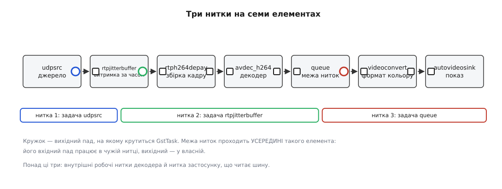
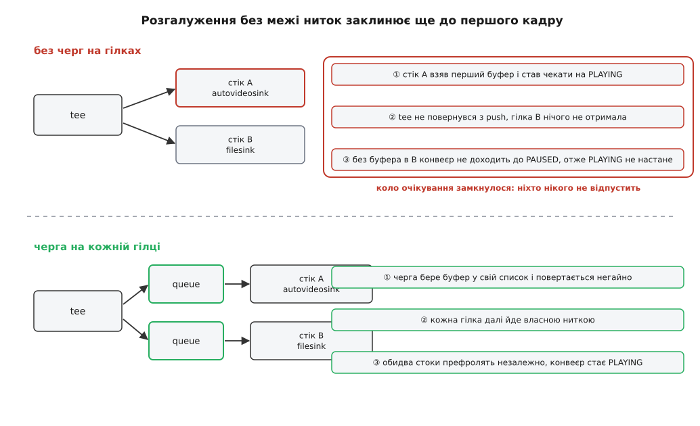
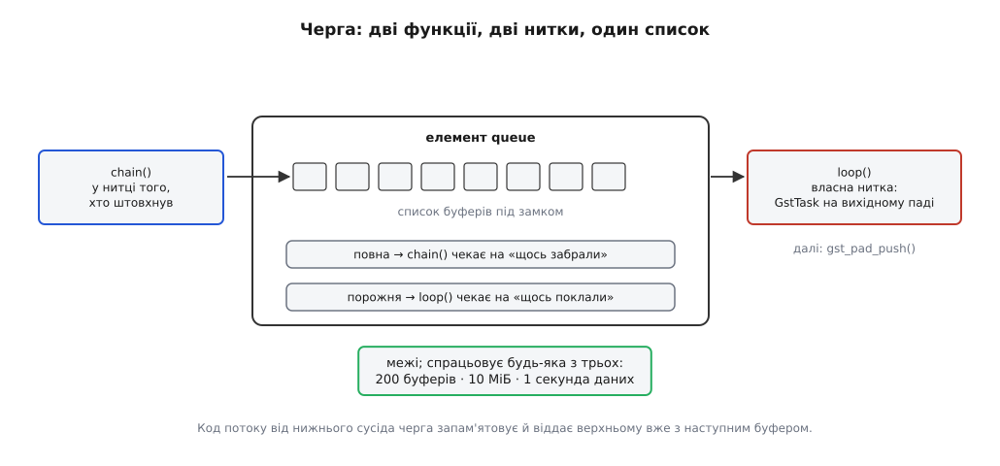
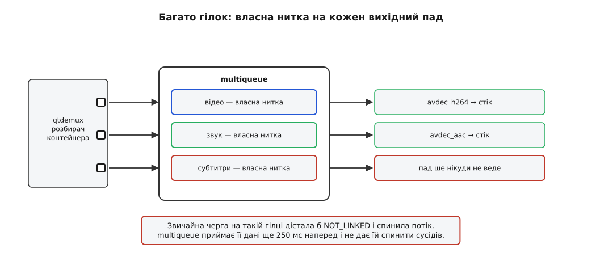

# Потоки виконання й черги: де конвеєр міняє потік

<preknowlist>
- [Конвеєр: елементи, зв'язки й потік даних](topic:media-vision/pipeline-model) — елемент, пад, і головне: передача буфера вниз є прямим викликом функції сусіда.
- [Процеси й потоки](topic:programming/process-vs-thread) — що таке нитка виконання, звідки в неї власний стек і чому дві нитки просуваються одночасно.
- [Черга: FIFO і кільцевий буфер](topic:algorithms/queue-fifo) — структура, у яку кладуть з одного кінця й забирають з іншого.
- [Виробник і споживач](topic:programming/producer-consumer) — обмежений буфер між двома нитками, з блокуванням на порожньому й на повному.
- [Протитиск](topic:algorithms/backpressure) — як повільний споживач гальмує швидкого виробника й що буває, коли загальмувати його нічим.
- [Дедлок](topic:programming/deadlock) — коло очікування, у якому кожен чекає на іншого й ніхто не рушить.
- [Перегони даних і замки](topic:programming/data-races-locks) — навіщо серіалізувати доступ до спільного стану.
</preknowlist>

## Один рядок різниці між роботою й зависанням

Два описи конвеєра. Різниця — одне слово, повторене двічі:

```sh
# зависає, не показавши жодного кадру
gst-launch-1.0 videotestsrc ! tee name=t \
  t. ! autovideosink \
  t. ! jpegenc ! multifilesink location=f%05d.jpg

# працює
gst-launch-1.0 videotestsrc ! tee name=t \
  t. ! queue ! autovideosink \
  t. ! queue ! jpegenc ! multifilesink location=f%05d.jpg
```

Перший ланцюг друкує «Setting pipeline to PAUSED» і замовкає назавжди. Другий малює картинку й пише файли. При цьому `queue` не робить із даними рівно нічого: не чіпає ні формату, ні вмісту, ні міток часу; кожен буфер виходить із неї байт у байт таким, яким зайшов.

Отже, слово змінило не дані, а щось інше — те, чого в описі конвеєра взагалі не написано. Воно змінило **кількість ниток, які виконують цей ланцюг, і місце межі між ними**. І з'ясовується, що опис конвеєра — це водночас і план розпаралелення, просто написаний непрямо: топологія тут і є розкладом ниток.

Далі — звідки цей розклад береться, як його прочитати з рядка, чому в наведеному прикладі без `queue` виходить не сповільнення, а саме мертве зависання, і скільки коштує кожна поставлена межа.

## Нитка з'являється на паді, а не в елементі

Основа тут одна й дуже проста: коли елемент віддає готовий буфер униз, він **прямо викликає функцію обробки** сусіднього пада. Не кладе в буфер, не сигналить, не будить — викликає, як звичайну функцію за вказівником.

Наслідок цього для ниток жорсткий і однозначний. Функція обробки (`chain`) виконується в тій нитці, яка її покликала, а покликав її сусід згори, чию функцію теж хтось покликав. Тобто **весь лінійний ланцюг живе в одній нитці** — тій, що зробила найперший виклик. Це не оптимізація й не деталь реалізації: інакше просто не буває, коли передача даних є викликом.

Звідси наступне питання: а хто робить найперший виклик? Нитка мусить звідкись узятися.

Береться вона з **задачі** (GstTask) — об'єкта, який крутить у циклі одну функцію. Задача не належить елементові; вона належить **паду**. Коли конвеєр переходить із `READY` у `PAUSED`, він активує пади своїх елементів, і на цьому кроці кожен пад вирішує, ким він буде: пасивною функцією обробки, яку смикатиме сусід, чи **циклом**, який сам себе крутить. Пад, що обрав цикл, просить у системи нитку й починає в ній безкінечно викликати свою функцію циклу, доки задачу не поставлять на паузу або не зупинять.

Правило, з якого читається вся мапа ниток конвеєра, звучить так: **нитка є рівно там, де є пад із циклом**. Усе решта — виклики всередині чужої нитки.

Хто типово має такий пад:

- **Джерело в режимі push.** Задача сидить на його вихідному паді: цикл читає порцію з камери чи з мережі й штовхає вниз. Це найзвичніший випадок.
- **Розбирач у режимі pull.** Тут задача — на **вхідному** паді, що з першого разу спантеличує. `qtdemux`, з'єднаний із `filesrc`, сам вирішує, який шматок файлу йому потрібен: його цикл смикає `gst_pad_pull_range()` вгору, розбирає прочитане й штовхає вниз. Верхній сусід при цьому взагалі не має власної нитки — він лише відповідає на запити.
- **Черга.** Вхідний пад — звичайна функція обробки, вихідний — цикл із власною ниткою. Саме тому черга і є межею.
- **Елемент, який віддає дані за часом, а не за приходом.** `rtpjitterbuffer` тримає пакети й випускає їх тоді, коли настав їхній момент, — це подія від таймера, а не від сусіда, тож без власної нитки такий елемент неможливий.

І окремо — нитки, яких у цій мапі не видно, хоч вони справжні: внутрішні робітники декодера (`avdec_h264` за замовчуванням бере стільки ниток, скільки в машині ядер, і ділить між ними кадри або смуги), нитка кільцевого буфера звукового стоку, нитки драйвера апаратного декодера. Вони не належать жодному падові, і конвеєр про них нічого не знає.



*Межа ниток проходить не між елементами, а всередині того елемента, який має задачу: його вхідний пад працює в чужій нитці, вихідний — у власній.*

**Скільки ниток виконує звичайне відтворення файлу.**

```
filesrc ! qtdemux ! h264parse ! avdec_h264 ! videoconvert ! autovideosink

цикл на вхідному паді qtdemux (pull із filesrc)          1
внутрішні нитки avdec_h264 (за кількістю ядер, тут 4)     4
нитка застосунку з головним циклом, що читає шину         1
                                                        ───
                                                          6
```

З шести ниток **дані ланцюгом веде лише одна**. Розпакування, перетворення кольору й показ ідуть послідовно в ній, один за одним, як три виклики в одному стеку.

Так було не завжди, і теперішня простота дісталася дорого: у версіях 0.8 конвеєром керував окремий підключний планувальник із співпрограмами, який вирішував, кого коли виконувати, — від нього відмовилися на користь моделі «задача живе на паді». Чому саме, і що з тим планувальником було не так, розказано окремо: [як GStreamer позбувся планувальника](topic:media-vision/threads-and-queues/hist-scheduler-removal.md).

Мапу ниток конкретного конвеєра не треба вгадувати — її можна надрукувати, повісивши на кожен пад пробу, яка виводить назву пада разом з ідентифікатором нитки: [як побачити власні нитки конвеєра](topic:media-vision/threads-and-queues/proj-thread-map.md).

## Замок потоку: чому елемент не пише замків

Якщо код елемента виконують чужі нитки, і в різні моменти різні, виникає природне побоювання: чи не доведеться кожному авторові елемента розставляти замки навколо власного стану? Декодер тримає опорні кадри, розбирач — недочитаний заголовок; два одночасні виклики це знищили б.

Не доведеться, і причина в тому, що гарантію дає сам пад. Коли через вхідний пад проходить буфер або **серіалізована** подія, ядро бібліотеки бере **замок потоку** цього пада (`GST_PAD_STREAM_LOCK`) і тримає його весь час виклику. Замок рекурсивний, тож повторний вхід із тієї самої нитки не заклинить.

З цього одного механізму випливають три різні речі.

Перша: **в одному вхідному паді одночасно є щонайбільше одна нитка**. Елемент може спокійно тримати стан у своїх полях і не думати про паралельність — по його даних завжди йде рівно один потік. Побічно це й пояснює, чому елемент із кількома вхідними падами (мікшер, мультиплексор) складніший за звичайний: там паралельність справжня, по одній нитці на кожен пад, і синхронізувати їх мусить сам елемент.

Друга: **порядок даних і подій непорушний**. Подія `CAPS` серіалізована, тож вона не може обігнати буфери, які вже в дорозі, — новий формат оголошується рівно перед першим кадром у цьому форматі. Те саме з `SEGMENT` і `EOS`. Серіалізація тут не побічний ефект, а сенс: [події й запити на падах](topic:media-vision/events-and-queries) саме тим і поділені на серіалізовані й ні, чи мусять вони дочекатися своєї черги в потоці даних.

Третя, і найцікавіша: **зупинити нитку, яка застрягла, звичайною подією неможливо**. Якщо стік чекає на годинник, а черга — на вільне місце, вони тримають замок потоку. Серіалізована подія стане в чергу за ними й не дійде ніколи. Тому подія `FLUSH_START` навмисно **не серіалізована**: вона не бере замка, обганяє всі дані й позначає пади як «скидаємо». Усі очікування — на умовній змінній черги, на годиннику стоку, на порожньому джерелі — прокидаються, повертають `GST_FLOW_FLUSHING`, і нитки виходять зі стеку. А ось парна їй `FLUSH_STOP` серіалізована, тобто вона **не пройде, поки нитка справді не вийшла**, — і це якраз потрібна гарантія: коли скидання завершилося, у ланцюзі точно нікого немає. Механіку перемотування, побудовану на цій парі, розібрано в темі [перемотування і скидання](topic:media-vision/seeking-and-flush).

> 🔧 **Навіщо це.** Майже кожне «конвеєр не хоче вимикатися» — це нитка потоку, що застрягла в очікуванні, якого ніхто не скинув. Тому штатне гасіння живого конвеєра починають не з `set_state(NULL)`, а з `gst_element_send_event(pipeline, gst_event_new_flush_start())`: спершу випустити нитки зі стеку, потім міняти стан. Якщо ж застрягання сталося у **вашому** елементі, з нього треба виходити на прапорець скидання самотужки — ядро розбудить умовну змінну лише тоді, коли це його власна умовна змінна.

## Навіщо різати ланцюг

Одна нитка на весь ланцюг має відчутну перевагу: дані нікуди не мандрують, кадр від початку до кінця живе в кеші того самого ядра, а протитиск виходить сам собою — виробник фізично не може випередити споживача, бо це один і той самий виклик.

Ціна теж очевидна. Поки стік малює кадр, декодер простоює. Порахуймо, скільки це коштує.

**Пропускна здатність ланцюга з однією ниткою і з двома.**

```
робота на один кадр 1080p:
  декодування     12 мс
  перетворення     4 мс
  показ            5 мс

одна нитка:   12 + 4 + 5 = 21 мс на кадр  → стеля  47 к/с
дві нитки (черга після декодера):
  ланка А (декодування)          12 мс
  ланка Б (перетворення + показ)  9 мс
  темп задає повільніша: max(12, 9) = 12 мс → стеля  83 к/с
```

Це класична конвеєризація: темп визначає не сума ланок, а найповільніша з них. Але тут же видно й межу цієї вигоди — **затримка окремого кадру не зменшилася**. Кадр так само проходить усі 21 мс роботи, ще й додатково чекає в черзі. Розрізання ланцюга підвищує пропускну здатність і не покращує відгук; на цьому обмані ловляться, коли ставлять черги «щоб швидше», а отримують ту саму частоту кадрів і на пів секунди пізніший показ.

Друга причина різати важливіша за швидкість, і вона не про продуктивність узагалі.

## Розгалуження: межа заради життєздатності

Повернімося до `tee` без черг — і розберімо, чому там саме зависання, а не просто гальмування.

`tee` роздає буфер гілкам **послідовно**: викликає функцію обробки першої гілки, дочекується повернення, потім другої. Іншого способу в моделі прямих викликів немає.

Тепер згадаймо, що робить стік при переході в `PAUSED`. Він мусить показати, що готовий: прийняти перший буфер, притримати його й доповісти конвеєрові «я на місці» — це [префрол](topic:media-vision/states-lifecycle). Прийнявши буфер, стік **блокується всередині своєї функції обробки** й чекає на `PLAYING`.

Складаємо. Перший буфер іде в гілку A, стік A бере його й засинає до `PLAYING`. Функція обробки не повернулася — отже, `tee` не рушив далі, і гілка B не отримала нічого. Стік B не префролив, а конвеєр оголошує `PAUSED` досягнутим лише тоді, коли префролили **всі** стоки. Значить, `PLAYING` не настане. Значить, стік A не прокинеться. Коло замкнулося ще до першого показаного кадру.



*Черга на гілці розриває коло не тим, що додає пам'яті, а тим, що функція обробки повертається негайно, не чекаючи на споживача.*

Черга рятує саме тому, що її функція обробки нікого не чекає: узяла буфер у список, розбудила власну нитку, повернулася. `tee` одразу віддає буфер другій гілці, обидва стоки префролять кожен у своїй нитці, конвеєр стає `PLAYING`, обидва прокидаються.

Той самий механізм, тільки з іншим приводом, працює після демультиплексора. Відео й звук — дві незалежні гілки з одного розбирача; без черг їх крутить одна нитка, по черзі. Досить звуковому стокові на десяту частку секунди затриматися на записі в звукову карту — і рівно на цей час зупиняється декодування відео. А оскільки обидва стоки ще й чекають кожен свого моменту за годинником, така конструкція заклинює й у `PLAYING`: відео чекає, поки відпустить звук, звук чекає на свій час, який настане після відео.

Третій привід — **живе джерело з повільним споживачем**. Камера віддає кадри за власним генератором і загальмувати не вміє. Якщо в тій самій нитці за нею стоїть детектор, якому на кадр треба 45 мс при кадровому періоді 33 мс, `v4l2src` просто не встигає забирати кадри з драйвера, і драйвер починає перезаписувати найстаріші. Межа ниток тут не пришвидшує детектор — вона дає джерелу змогу забирати кадри вчасно, а перевитрату часу перекладає на чергу, яка вже сама вирішує, чекати їй чи викидати.

> 🔧 **Навіщо це.** Практичне правило, з якого варто починати будь-яку топологію: **черга після кожного `tee` на кожній гілці, черга після кожного вихідного пада демультиплексора, черга одразу за живим джерелом, якщо далі стоїть щось повільне**. Усе решта — за виміром, а не за звичкою: кожна зайва межа коштує затримки й пам'яті, а «черга про всяк випадок» після кожного елемента дає конвеєр, у якому дванадцять ниток товчуться навколо одного потоку 720p.

## Черга зсередини

Тепер варто відкрити чергу, бо майже все, що з нею роблять на практиці, стає очевидним із її будови.

Усередині — те, що зазвичай і буває на межі двох ниток: список під замком і дві умовні змінні. Одна означає «щось поклали», друга — «щось забрали».

```c
/* спрощена до суті, але справжня логіка queue */

static GstFlowReturn
queue_chain (GstPad *pad, GstObject *parent, GstBuffer *buf)
{
  GstQueue *q = GST_QUEUE (parent);          /* виконується в НИТЦІ ВЕРХНЬОГО сусіда */

  g_mutex_lock (&q->qlock);
  while (queue_is_full (q) && !q->flushing) {
    q->waiting_del = TRUE;
    g_cond_wait (&q->item_del, &q->qlock);   /* доки нижня нитка не забере */
  }
  if (q->flushing) {                          /* прокинулися через FLUSH_START */
    g_mutex_unlock (&q->qlock);
    gst_buffer_unref (buf);
    return GST_FLOW_FLUSHING;
  }
  gst_queue_array_push_tail (q->queue, buf); /* власність буфера перейшла черзі */
  g_cond_signal (&q->item_add);              /* розбудити власну нитку */

  GstFlowReturn ret = q->srcresult;          /* що ОСТАННЄ сказали знизу */
  g_mutex_unlock (&q->qlock);
  return ret;                                /* це почує верхній сусід */
}

static void
queue_loop (GstPad *pad)                     /* крутиться у ВЛАСНІЙ нитці */
{
  GstQueue *q = GST_QUEUE (gst_pad_get_parent (pad));

  g_mutex_lock (&q->qlock);
  while (queue_is_empty (q) && !q->flushing)
    g_cond_wait (&q->item_add, &q->qlock);
  if (q->flushing) {
    g_mutex_unlock (&q->qlock);
    gst_pad_pause_task (pad);
    return;
  }
  GstBuffer *buf = gst_queue_array_pop_head (q->queue);
  g_cond_signal (&q->item_del);              /* нагорі звільнилося місце */
  g_mutex_unlock (&q->qlock);

  q->srcresult = gst_pad_push (q->srcpad, buf);
  if (q->srcresult != GST_FLOW_OK)
    gst_pad_pause_task (pad);                /* далі нема куди — спиняємо нитку */
}
```



*Уся межа ниток — це дві функції з різних боків одного списку: одна нікого не чекає, доки є місце, друга спить, доки нема даних.*

Із цих двадцяти рядків читається все подальше.

**Черга блокує вхід, а не росте безмежно.** Заповненість міряється трьома лічильниками одночасно, і вхід зупиняється, щойно спрацює **будь-який** із них: 200 буферів, 10 МіБ або 1 секунда даних за замовчуванням. Три різні міри потрібні тому, що жодна поодинці не годиться: у секунді 4K-відео вміщається 250 МіБ, а в секунді звуку — 176 КіБ; лічильник буферів захищає пам'ять, лічильник часу — затримку. Кожну межу можна вимкнути нулем, і `max-size-buffers=0 max-size-bytes=0 max-size-time=0` дає чергу без стелі — швидкий спосіб перетворити витік темпу на витік пам'яті.

**Протитиск через межу зберігається, але стає ступінчастим.** Доки в черзі є місце, верхня нитка не гальмує зовсім; коли місця нема — вона гальмує повністю. Замість плавного зв'язку виходить перемикач із мертвою зоною завглибшки в цілу чергу.

**Код помилки приходить із запізненням на один буфер.** Функція обробки повертає нагору не результат цього штовхання, а `srcresult` — те, чим нижній сусід відповів **минулого разу**. Інакше й бути не може: у момент, коли верхній сусід віддає буфер, той ще навіть не рушив униз. Тому після межі ниток `GST_FLOW_ERROR` доходить до джерела на крок пізніше, і по-справжньому про помилку застосунок дізнається не з коду повернення, а з [шини повідомлень](topic:media-vision/bus-and-messages).

**Черга вміє свідомо втрачати.** Властивість `leaky` дозволяє їй замість блокування викидати найстаріший (`downstream`) або відкидати новоприбулий (`upstream`) буфер. Для живого джерела це часто єдиний правильний вибір: утрати все одно будуть, питання лише в тому, де саме — у драйвері камери, який перезапише невідомо що, чи в черзі, яка викине найстаріше й лишить споживачеві найсвіжіше. Що це робить із затримкою й чому «додав чергу — попередження зникло» буває найгіршим із можливих рішень, розібрано в темі [затримка й буферизація](topic:media-vision/latency-and-buffering).

**Чергу видно ззовні.** Лічильники `current-level-buffers`/`-bytes`/`-time` читаються будь-коли, а сигнали `overrun` і `underrun` спрацьовують на межах. Одного погляду на рівень зазвичай досить, щоб зрозуміти, хто в конвеєрі повільний: черга, що стабільно повна, показує на споживача під нею; черга, що стабільно порожня, — на виробника над нею.

## Коли черги замало: multiqueue

Проста черга має вбудоване припущення: її вихідний пад кудись веде. Якщо `gst_pad_push` повертає `GST_FLOW_NOT_LINKED`, її нитка стає на паузу, і потік у цій гілці припиняється.

Для автодобору елементів це припущення хибне. `decodebin` розбирає файл поступово: розбирач оголошує доріжку, під неї добирається декодер, застосунок під'єднує вихід — і все це відбувається **тоді, коли дані вже течуть**. У проміжку між «пад з'явився» і «пад під'єднали» гілка нікуди не веде, і звичайна черга на ній зупинила б розбирач, а разом із ним і сусідні доріжки, які вже нормально працюють.

Тому там стоїть `multiqueue`: не одна черга з двома падами, а набір черг у спільному елементі, по парі падів на кожен потік, **і власна нитка на кожному вихідному паді**.



*Одна непід'єднана гілка не має права спиняти сусідні — саме заради цього, а не заради обсягу, і зроблено окремий елемент.*

Три відмінності роблять цей елемент іншою річчю, а не «чергою на кілька входів».

**Непід'єднана гілка не фатальна.** `multiqueue` не спиняє нитку на `NOT_LINKED`, а приймає дані такої гілки ще на 250 мс наперед (`unlinked-cache-time`) — рівно щоб дожити до моменту, коли пад під'єднають, і не перетворити нормальну затримку в добиранні на аварію.

**Гілки не розбігаються.** Дані з різних доріжок у контейнері лежать із перекосом: секунда звуку може бути записана значно раніше за відповідне відео. Якщо дозволити кожній гілці бігти власним темпом, стоки не зведуть їх докупи. Тому `multiqueue` вирівнює гілки — за розміром черг, а з увімкненим `sync-by-running-time` — прямо за часом відтворення.

**Межі на кожну чергу малі.** 5 буферів, 10 МіБ, 2 секунди — проти 200 буферів у звичайної черги. Черг тут багато, і кожна множиться на кількість доріжок; водночас `multiqueue` вміє тимчасово розширювати ту чергу, якій бракує, щоб брак в одній гілці не спиняв решту. Як цим користується автодобір, розібрано в темі [автодобір елементів](topic:media-vision/autoplug-decodebin).

Поруч живе ще й `queue2` — теж межа ниток, але створена для іншого: вона накопичує дані для мережевого відтворення, вміє скидати їх на диск і повідомляє застосункові про рівень наповнення. Її сенс не в паралельності, а в буферизації, тож її місце — у темі [затримки й буферизації](topic:media-vision/latency-and-buffering).

## Що коштує межа

Кожна поставлена межа знімає одну проблему й купує кілька менших. Розписати їх варто чесно, бо саме з них складається різниця між конвеєром, який працює на стенді, і конвеєром, який працює на об'єкті.

**Затримка.** Скільки даних лежить у черзі — стільки й затримки вона додає. Це не побічний ефект, а її призначення: черга поглинає нерівність темпів, а поглинати нерівність можна лише запасом.

**Пам'ять.** Стеля черги — це стеля її апетиту, і вона рахується в кадрах. Одна секунда 1080p у NV12 — це близько 89 МіБ; черга з типовими межами перед декодером стримається лічильником байтів, а після декодера легко з'їсть свою десятку мегабайтів на трьох кадрах.

**Мандри між ядрами.** Кадр, виготовлений на одному ядрі, а спожитий на іншому, тягне за собою вимивання кеша: 3 МіБ даних не вміщаються в жоден кеш першого рівня, і другому ядру вони приїжджають із пам'яті. Плюс власне [перемикання контексту](topic:programming/context-switch) на кожному переході. Для дрібних буферів (звук, метадані) ця плата легко перевищує виграш від паралельності.

**Втрата наскрізної картини.** Поки ланцюг живе в одній нитці, його стек — це і є ланцюг: `bt` у налагоджувачі показує, хто кого викликав, від джерела до стоку. Після межі стек обривається на черзі, і зв'язок «хто кого чекає» доводиться відновлювати по кількох стеках одразу. Тому діагностика конвеєра з багатьма нитками спирається не на покроковий налагоджувач, а на журнал із номером нитки в кожному рядку й на знімок графа — про це в темі [діагностика конвеєра](topic:media-vision/pipeline-debugging).

**Розмноження ниток.** Найпідступніша плата, бо вона не видно на одному потоці.

**Скільки ниток дає восьмикамерна система.**

```
на одну камеру:
  усередині rtspsrc (RTP, RTCP, керівний зв'язок, буфер джитера)   ~4
  власні черги в топології (після депейлоадера й після декодера)     2
  внутрішні нитки avdec_h264 (обмежено max-threads=2)                2
                                                                  ────
                                                                     8

вісім камер:                8 · 8  =  64 нитки
на чотириядерній машині:    64 / 4 =  16 ниток на ядро
```

Шістдесят чотири нитки самі по собі не смертельні — вони майже весь час сплять. Смертельним стає інше: коли машина перевантажується, планувальник роздає час усім потроху, і кожна межа ниток перетворюється на місце, де кадр чекає на своє вікно. Затримка росте не там, де бракує обчислень, а там, де їх ділять. Тому в багатопотокових системах кількість меж тримають під контролем свідомо, а декодерам явно обмежують `max-threads` замість того, щоб лишати «за кількістю ядер» на восьми екземплярах одночасно.

## Нитка застосунку — не нитка потоку

Досі йшлося про нитки всередині конвеєра. Але є ще одна, з якої все починається: нитка застосунку, що збудувала конвеєр і крутить головний цикл.

Плутанина між нею й нитками потоку дає найдовші сеанси нерозуміння, бо код виглядає однопотоковим. Ось де вони насправді стикаються:

- **Сигнали елементів.** `pad-added` від розбирача приходить із нитки розбирача. `new-sample` від `appsink` — із нитки того, хто штовхнув буфер. Обробник, який ви написали в застосунку, виконується **не** в нитці застосунку.
- **Проби на падах.** Функція проби викликається просто посеред `gst_pad_push` — у нитці потоку, з узятим замком потоку.
- **Своя нитка, що подає дані.** Коли застосунок сам штовхає буфери в `appsrc`, його власна нитка **стає** ниткою потоку на весь час виклику й тягне ланцюг до першої черги. Про обидва боки цього містка — у темі [appsink і appsrc](topic:media-vision/appsink-appsrc).

З цього випливають три заборони, і всі три — з механіки, а не з обережності.

**Не тримати нитку потоку.** Поки ваш обробник `new-sample` рахує щось важке, конвеєр над ним стоїть. Якщо там ще й чекання на мережу — стоїть, скільки чекатимете.

**Не чіпати інтерфейс користувача.** Віконні бібліотеки вимагають своєї нитки, і виклик із чужої дає падіння в найгіршому місці. Правильний шлях — покласти повідомлення в [шину](topic:media-vision/bus-and-messages), звідки застосунок забере його зі своєї нитки; шина для того й існує.

**Не міняти стан конвеєра з нитки потоку.** Ось цей випадок вартий розбору, бо він виглядає цілком безневинно:

```c
/* так робити НЕ можна: проба виконується в нитці потоку */
static GstPadProbeReturn
on_eos_probe (GstPad *pad, GstPadProbeInfo *info, gpointer user_data)
{
  GstElement *pipeline = user_data;
  gst_element_set_state (pipeline, GST_STATE_NULL);   /* дедлок */
  return GST_PAD_PROBE_OK;
}
```

Перехід у `NULL` зобов'язаний зупинити всі задачі й **дочекатися**, поки кожна нитка потоку вийде з роботи. Одна з тих ниток — та, що зараз стоїть у цій пробі й чекає на повернення з `set_state`. Вона чекає на себе.

Ліки прості: винести дію в іншу нитку. Для цього є `gst_element_call_async()` (у свіжих версіях — `gst_call_async()`), який бере нитку з внутрішнього пулу й виконує ваш зворотний виклик уже поза потоком:

```c
static void
stop_pipeline (GstElement *pipeline, gpointer user_data)
{
  gst_element_set_state (pipeline, GST_STATE_NULL);   /* уже в чужій нитці — безпечно */
}

static GstPadProbeReturn
on_eos_probe (GstPad *pad, GstPadProbeInfo *info, gpointer user_data)
{
  gst_element_call_async (GST_ELEMENT (user_data), stop_pipeline, NULL, NULL);
  return GST_PAD_PROBE_OK;
}
```

> 🔧 **Навіщо це.** Просте правило, що знімає майже всі такі зависання: у зворотному виклику, який прийшов із конвеєра, дозволено лише **швидко взяти дані й піти**. Усе, що зупиняє, перебудовує, перемотує або чекає, — через `gst_element_call_async()` або через повідомлення на шині, яке розбере головний цикл. Якщо ж вам справді потрібен свій замок і в обробнику, і в коді застосунку, беріть його завжди в одному порядку відносно операцій із конвеєром: класичне взаємне блокування «ваш замок ↔ замок потоку» ловиться потім тижнями.

## Хто дає нитки і як їх приборкати

Задача не створює нитку сама — вона бере її з **пулу задач** (GstTaskPool). Типовий пул — це звичайний `GThreadPool` без обмеження кількості, який повторно використовує нитки, що звільнилися. Тому створення черги не означає створення нитки з нуля щоразу, а зупинена задача повертає нитку в пул.

Пул можна підмінити своїм, і момент для цього чітко визначений. Перед стартом кожної задачі елемент кладе на шину повідомлення `STREAM_STATUS` типу `CREATE`, і в ньому лежить сам об'єкт задачі. Перехопивши це повідомлення **синхронним** обробником (тобто просто в нитці, що його породила, до повернення керування), застосунок устигає викликати `gst_task_set_pool()` і підсунути власний пул. Далі йдуть повідомлення `ENTER` і `LEAVE` — вони приходять уже **зсередини самої нитки**, на її вході й виході, і саме там доречно виставляти пріоритет: політику планувальника задають для нитки, у якій перебувають. Це прямий шлях віддати звуковому стокові реальночасовий клас, коли решта конвеєра може почекати; що при цьому насправді відбувається в ядрі, — у темі [пріоритети, nice і реальночасові класи](topic:unix-linux/priority-nice-realtime).

Є й готовий обмежений пул — `GstSharedTaskPool` (з версії 1.20), який виконує задачі на заданій кількості ниток, за замовчуванням на одній. Спокуса застосувати його до конвеєра з багатьма камерами велика, але документація застерігає прямо, і застереження варте уваги: задачі падів **взаємозалежні** — одна чекає на іншу через чергу. Дві такі задачі на одній нитці дають гарантований дедлок, тільки цього разу не в топології, а в пулі.

Повний перелік того, що можна покрутити, — властивості й сигнали `queue`, `queue2` та `multiqueue`, функції керування задачею й пулом, повідомлення `STREAM_STATUS`, макроси замка потоку — зібрано окремо: [черги, задачі й пули ниток](topic:media-vision/threads-and-queues/api-queue-and-task.md).

## Мапа ниток як проєктне рішення

Топологія конвеєра — це не лише схема обробки, а й розклад ниток, і другого сенсу в ній рівно стільки ж, скільки першого. Порядок елементів вирішує, що з чим перетвориться; розставлені `queue` вирішують, що з чим виконуватиметься одночасно, хто на кого чекатиме й де накопичиться затримка.

Тому місце для межі варто обирати не за звичкою, а за трьома питаннями, кожне з яких прямо випливає з механіки.

Чи розгалужується тут потік? Якщо так, межа обов'язкова — і не заради швидкості, а тому, що послідовна роздача гілкам заклинює на префролі.

Чи стоїть по один бік межі щось, що не вміє чекати? Живе джерело, звуковий стік, мережевий приймач мають власний темп, нав'язаний зовні; тримати їх у спільній нитці з тим, хто може затриматися, — значить обміняти їхню роботу на чужу затримку.

Чи є тут дві важкі ланки, які справді можуть іти одночасно? Тоді межа купує пропускну здатність — і продає за це затримку одного кадру та пам'ять під запас.

Скрізь, де жодне з трьох питань не дає «так», межі краще не бути: одна нитка на ланцюг — не бідний варіант, а найдешевший із можливих, з безкоштовним протитиском, цілим стеком для налагодження й кадром, що не залишає свого ядра.
