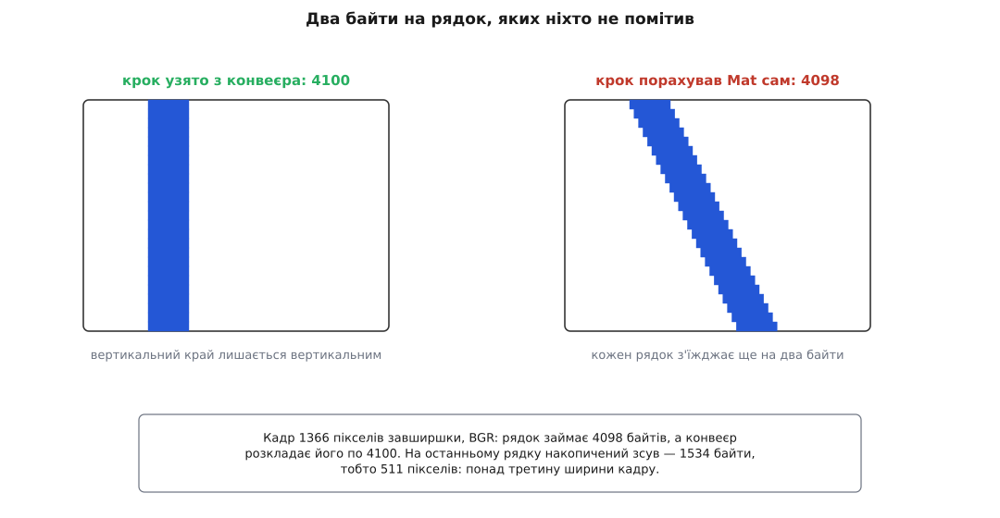
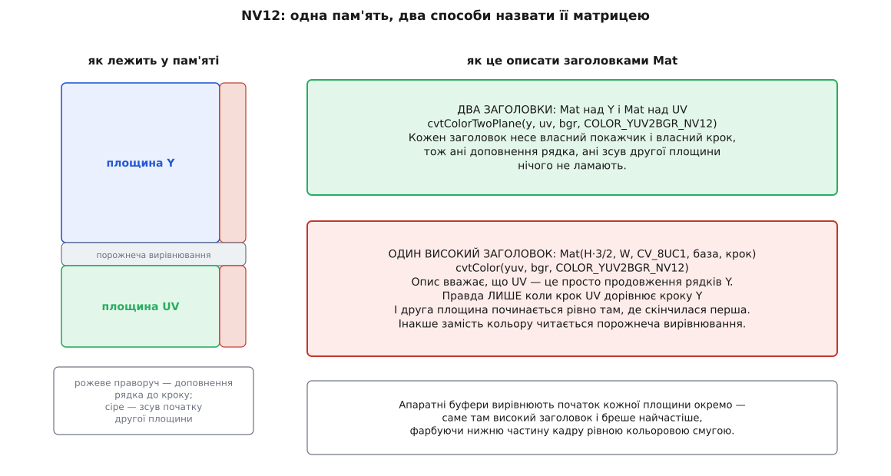
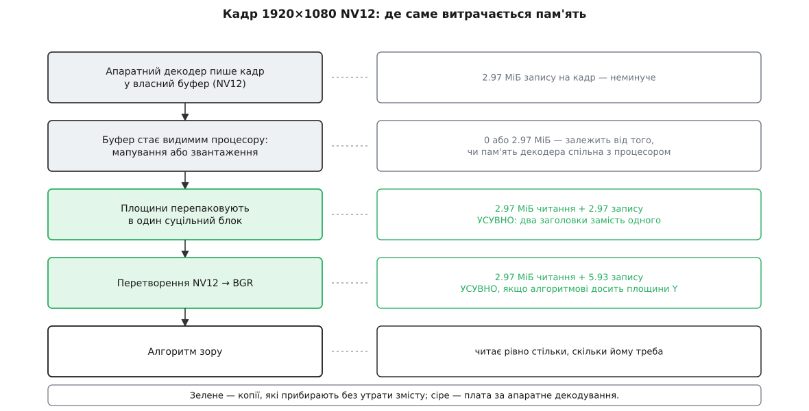

# Стик із відеоконвеєром: формати пікселів і передача кадру

<preknowlist>
- [cv::Mat: пам'ять, лічильник посилань і володіння](book:media-vision/mat-memory-model) — заголовок окремо від блока пікселів, поля `data` й `step`, лічильник посилань усередині блока.
- [Види без копії: ROI і заголовок над чужим буфером](book:media-vision/mat-views-no-copy) — заголовок над чужою пам'яттю нею не володіє й лічильника не має.
- [Формати пікселів і буферів зображення](book:algorithms/pixel-formats) — пакетне проти площинного, субдискретизація хроми, NV12/I420/YUY2, що таке рядковий крок.
- [Буфери й пам'ять: передача кадру без копіювання](book:media-vision/buffers-and-memory) — GstBuffer, пул буферів, мапування буфера в адресний простір процесу.
- [Вирівнювання даних у пам'яті](book:programming/memory-alignment) — навіщо адреси й розміри округлюють угору до степеня двійки.
</preknowlist>

Поки джерело кадрів — файл або веб-камера через стандартний бекенд, рядок `cap >> frame` не викликає жодних питань: у `frame` опиняється звичайна тривимірна матриця BGR, і далі йде звичайний код зору. Питання починаються, щойно між камерою й алгоритмом стає справжній конвеєр. Апаратний декодер віддає NV12, ширина кадру — 1366 пікселів, а буфер живе в пам'яті, яку виділив драйвер. Той самий код тоді або малює кольорову кашу з нахилом, або працює правильно, але з'їдає втричі більше пропускної здатності пам'яті, ніж мав би.

Обидві біди мають один корінь. Кадр у конвеєрі й `cv::Mat` — це два різні описи тих самих байтів, і описують вони різне. Стик між ними — не виклик однієї функції-перетворювача, а узгодження чотирьох незалежних речей: порядку компонент, рядкового кроку, розкладки площин і часу життя пам'яті. Кожну можна проґавити, і кожна ламається по-своєму: перша — кольорами, друга — геометрією, третя — сміттям у нижній частині кадру, четверта — падінням через пів години роботи.

## Що заголовок Mat здатен сказати про пам'ять

Заголовок `cv::Mat` описує пам'ять дуже небагатьма речами. Він має: покажчик на початок даних, кількість рядків і стовпців, тип елемента (глибина плюс кількість каналів) і крок `step[0]` — скільки байтів від початку одного рядка до початку наступного. Оце й уся модель картинки: **прямокутник рядків, у кожному рядку `cols` елементів підряд, у кожному елементі `channels` вибірок одного типу пліч-о-пліч, а рядки віддалені один від одного на `step[0]` байтів**.

З цієї моделі одразу випливають три обмеження, і саме вони породжують усе подальше.

Перше: канали лише пакетні. Компоненти одного пікселя лежать поруч. Заголовок не має слів, щоб сказати «синій канал ось тут, а червоний — за мегабайт звідси».

Друге: покажчик один. Одна база — і жодного способу повідомити, що друга частина зображення починається з іншої адреси.

Третє: усі рядки віддалені однаково, усі канали мають однаковий тип і однакову роздільність. Сказати «кольорових вибірок удвічі менше, ніж яскравісних» цією мовою неможливо.

А сирий кадр у конвеєрі порушує всі три щодня. NV12 — це дві площини за двома адресами, де кольорових вибірок учетверо менше, ніж яскравісних. Заголовок `cv::Mat` не може описати такий кадр чесно.

Тому OpenCV живе з обхідним маневром: кадр, якого вона не може описати чесно, вона описує **як щось інше, що випадково займає ті самі байти**. NV12 стає одноканальною матрицею з `H·3/2` рядків. Такий опис — не переклад, а вигадка, яка збігається з дійсністю лише за певних умов. Умов цих ніхто не перевіряє, і саме на них ламається найбільше кадрів.

> 🔧 **Навіщо це.** Помилка стику ніколи не вигулькує там, де її зробили. Ви бачите зелену смугу внизу кадру або нахил зображення — і йдете шукати ваду в алгоритмі. Розуміння того, що заголовок описує пам'ять лише чотирма числами, звужує пошук до цих чотирьох чисел, і діагноз ставиться за хвилину замість дня.

## Вісь перша: порядок компонент

`CV_8UC3` означає рівно «три байти без знака на піксель» — і нічого більше. Який з них синій, у типі не записано. Порядок компонент в OpenCV — знання, що йде поза даними: уся бібліотека, від `imread` до `imshow`, домовилася вважати трибайтовий піксель послідовністю **синій, зелений, червоний**. Конвеєр же свій порядок оголошує явно, рядком caps: `video/x-raw, format=RGB` — це справді RGB.

Тож коли елемент віддає RGB, а код читає його як BGR, не станеться нічого: типи збігаються, розміри збігаються, ніхто не помиляється. Просто в людей на кадрі будуть сині обличчя. Ця вада не падає й не попереджає, бо на рівні байтів помилки немає — є розбіжність двох домовленостей.

Чому саме BGR, а не всюдисущий RGB, — питання не риторичне: цей порядок дістався OpenCV у спадок від апаратури й форматів кінця дев'яностих, і його зафіксували ще до того, як бібліотека вийшла назовні. Розбір походження — у вставці [чому OpenCV читає піксель задом наперед](book:media-vision/frame-interop/hist-bgr-order.md): що тут документована історія, а що — усна традиція, яку переказують уже чверть століття.

Виправляють розбіжність двома способами, і вони нерівноцінні. Можна перекласти в себе: `cvtColor(src, dst, COLOR_RGB2BGR)` — прохід по всьому кадру з читанням і записом. А можна вимагати потрібний порядок від конвеєра, поставивши у caps `format=BGR`. Другий шлях кращий не тому, що коротший, а тому, що узгодження формату здатне зробити перетворення безкоштовним: якщо декодер уміє віддавати BGRx напряму, [узгодження caps](book:media-vision/caps-negotiation) обере саме цей варіант і жодного перетворення не станеться взагалі. Ваш `cvtColor` таку можливість відкинути не може ніколи — він виконається завжди.

Порядок компонент — найлегша з чотирьох осей: вада видима оком, а лікується одним словом у caps. Далі буде складніше.

## Вісь друга: рядковий крок

Найпростіший спосіб зробити `cv::Mat` над чужою пам'яттю виглядає так:

```cpp
cv::Mat frame(height, width, CV_8UC3, buffer_ptr);
```

Конструктор має п'ятий, необов'язковий параметр — крок. Не передали — береться `AUTO_STEP`, тобто `width · elemSize()`: припущення, що рядки лежать щільно, один за одним, без проміжків.

Конвеєр цього припущення не поділяє. GStreamer рахує крок за власним правилом: для більшості форматів початок кожного рядка вирівнюється вгору до чотирьох байтів. Для BGR це `ROUND_UP_4(width · 3)`, для площини Y у NV12 та I420 — `ROUND_UP_4(width)`. Правило дрібне, і для «круглих» ширин на кшталт 1920 воно не змінює нічого: 5760 уже кратне чотирьом. Але варто взяти ширину 1366 — і рядок починає жити своїм життям.

**Кадр 1366×768, формат BGR (три байти на піксель):**

```
корисних байтів у рядку   = 1366 · 3          = 4098
крок GStreamer            = ROUND_UP_4(4098)  = 4100
розбіжність за один рядок                     =    2 байти
накопичений зсув на 768-му рядку = 767 · 2    = 1534 байти
те саме в пікселях               = 1534 / 3   ≈  511 пікселів
```

Зсув росте рівно пропорційно номерові рядка — тому картинка не псується плямами, а перекошується: верх майже на місці, низ поїхав більш ніж на третину ширини кадру.



*Хибний крок не спотворює пікселі — він неправильно вгадує, де починається кожен рядок, і зсув накопичується згори вниз.*

Виправлення тривіальне — передати справжній крок п'ятим аргументом. Уся підступність у тому, що правильний і хибний виклики відрізняються однією комою, а хибний ще й коротший.

Вирівнювання до чотирьох байтів — м'який випадок. Апаратні буфери вирівнюють куди рішучіше: декодер або камера через V4L2 легко просять 64, 128 чи 256 байтів на початок рядка, бо так лягає їхній обмін із пам'яттю. Для ширини 1366 крок площини Y тоді стане 1408 замість 1366 — сорок два зайві байти в рядку. Ці кроки не вивести з caps: вони належать конкретному буферу й приїжджають разом із ним, у метаданих `GstVideoMeta`. Тому єдиний надійний спосіб узнати крок — спитати сам буфер, а не порахувати з ширини. Конкретні виклики, які це роблять, зібрано у вставці [контракт мапування кадру](book:media-vision/frame-interop/api-frame-map.md).

Тут варто помітити важливу несиметричність. **Коли OpenCV виділяє пам'ять сама, вона рядки ніколи не доповнює.** `Mat::create` бере один суцільний блок, у якому крок дорівнює `cols · elemSize()`; вирівнюється тільки початкова адреса блока — на 64 байти, як задає константа `CV_MALLOC_ALIGN`. Тобто ваш власний `Mat` майже завжди суцільний, а `Mat` над буфером конвеєра — майже завжди ні. Розрізняє їх метод `isContinuous()`, і половина швидких шляхів усередині OpenCV починається саме з цієї перевірки: якщо дані суцільні, кадр можна обробляти як один довгий одновимірний масив, без розриву на кожному рядку.

## Вісь третя: розкладка площин

Формати відрізняються не лише порядком байтів у пікселі, а й тим, чи взагалі всі байти кадру лежать в одному місці. За цією ознакою вони й розходяться з моделлю одного заголовка — хто далі, хто ближче.

**Пакетні формати з однією площиною** — найпростіший випадок. YUY2 (він же YUYV) кладе два пікселі в чотири байти: `Y0 U Y1 V`. Один блок, один крок, дві вибірки на піксель — отже, `CV_8UC2`, один заголовок і `cvtColor(src, dst, COLOR_YUV2BGR_YUY2)`. Тут модель `cv::Mat` описує пам'ять чесно, без жодних застережень.

**Напівплощинні формати** — уже розрив. NV12 має дві площини: суцільна Y розміром `W×H` і площина UV, де U і V чергуються, розміром `W×H/2` байтів. Дві адреси, два кроки, різна геометрія. Модель одного заголовка тут безсила, і виходів рівно два.

Чесний вихід — два заголовки: `Mat` над Y і `Mat` над UV, кожен зі своїм покажчиком і своїм кроком, а зводить їх докупи окрема функція:

```cpp
cv::Mat y(h, w, CV_8UC1, plane0, stride0);
cv::Mat uv(h / 2, w / 2, CV_8UC2, plane1, stride1);
cv::Mat bgr;
cv::cvtColorTwoPlane(y, uv, bgr, cv::COLOR_YUV2BGR_NV12);
```

`cvtColorTwoPlane` з'явилася в OpenCV саме для цього стику. Вона нічого не перепаковує: читає обидві площини там, де вони лежать, поважаючи їхні кроки, і одразу пише результат. Ані доповнення рядка, ані зсув початку другої площини їй не заважають.

Другий вихід — та сама вигадка, з якої ми почали: описати обидві площини **одним високим заголовком** із `H·3/2` рядків і одного каналу, а тоді покликати звичайний `cvtColor` із кодом `COLOR_YUV2BGR_NV12`. Перетворювач прочитає перші `H` рядків як Y, а решту — як чергування U і V. Цей опис працює, і працює швидко, але правдивий він лише за двох умов одночасно: крок площини UV мусить дорівнювати крокові Y, а сама UV мусить починатися рівно там, де скінчилася Y, тобто зі зсуву `stride · H`.



*Високий заголовок вважає другу площину продовженням рядків першої; апаратний буфер вирівнює початок кожної площини окремо й цю рівність руйнує.*

Коли умова про зсув порушується — а вона порушується саме на апаратних буферах, де початок кожної площини вирівнюють окремо, — високий заголовок починає читати як кольорові вибірки байти вирівнювання. Ті майже завжди однакові, тож нижня частина кадру вкривається рівною кольоровою смугою: класична зелена або рожева пляска, за якою впізнають цю ваду.

**Площинні формати** — найважчий випадок. I420 має три окремі площини: Y, U і V, кожна зі своїм покажчиком і кроком. Функції на три площини в OpenCV немає: коди `COLOR_YUV2BGR_I420` і `COLOR_YUV2BGR_YV12` чекають один суцільний буфер із `H·3/2` рядків. Отже, якщо площини I420 приїхали з незалежними кроками, у вас лишається два варіанти: або перепакувати їх у суцільний блок трьома циклами копіювання рядок за рядком, або попросити конвеєр віддавати NV12 чи одразу BGR. Другий варіант майже завжди кращий, і причина знову та сама: перетворення всередині конвеєра узгодження може прибрати, а ваш цикл копіювання — ні.

## Вісь четверта: час життя

Три попередні осі стосувалися того, **як** читати байти. Четверта — про те, **доки** їх узагалі можна читати, і саме вона дає найгірші вади: ті, що виживають усі тести й спрацьовують під навантаженням.

Буфер конвеєра стає доступним процесорові на час мапування. Ви його мапуєте, дістаєте покажчик, робите роботу, розмапуєте. Заголовок `Mat`, збудований над цим покажчиком, не володіє нічим: у нього немає лічильника посилань, бо лічильник живе всередині блока, який виділила OpenCV, а тут блок виділив не вона. Такий заголовок — **позика з терміном**, і термін цей записаний в іншій змінній, ніж сама позика. Система типів їх не пов'язує ніяк.

Звідси три помилки, що компілюються без жодного зауваження: покласти такий `Mat` у чергу до робочого потоку; повернути його з функції; зберегти як «останній кадр» у полі об'єкта. Усі три працюють у демонстрації й розвалюються під навантаженням — і розвалюються найпідступнішим із можливих способів. Конвеєр не звільняє буфери, а бере їх із пулу й пускає по колу. Тому після розмапування пам'ять нікуди не зникає — її **перезаписують наступним кадром**. Замість чесного падіння ви отримуєте кадр, зшитий із двох різних моментів часу, і жодного повідомлення про помилку.

Правило просте, як і має бути на такому стику: або заголовок помирає раніше за розмапування — тобто вся обробка синхронна, — або ви робите `clone()` і платите за копію свідомо. Третього немає, і будь-яка спроба вигадати третє впирається в те, що [заголовок над чужим буфером не має лічильника](book:media-vision/mat-views-no-copy) й дізнатися про смерть пам'яті не може.

## Скільки копій ви за це платите

Правильних шляхів через стик зазвичай кілька, і обирають між ними за ціною — а ціна стику міряється копіями кадру.

**Кадр 1920×1080 у NV12, потік 30 кадрів на секунду:**

```
розмір кадру NV12 = 1920 · 1080 · 3/2 = 3110400 байтів ≈ 2.97 МіБ
той самий кадр у BGR = 1920 · 1080 · 3 = 6220800 байтів ≈ 5.93 МіБ

одне читання кадру при 30 к/с = 2.97 · 30            ≈ 89 МіБ/с
перетворення NV12 → BGR: читання 2.97 + запис 5.93   ≈ 8.9 МіБ на кадр
те саме за секунду                                    ≈ 267 МіБ/с
```

На настільному процесорі з десятками гігабайтів на секунду це майже нічого. На одноплатнику, де вся пам'ять дає одиниці гігабайтів на секунду й ділиться між декодером, дисплеєм і вашим алгоритмом, чверть гігабайта на секунду за одне-єдине перетворення — уже помітна частка. І кожна **зайва** копія коштує стільки ж. Гірше того: потік такого обсягу проходить наскрізь через [кеш](book:programming/cache) і виносить із нього робочі дані алгоритму, тож платите ви не лише смугою пам'яті, а й промахами там, де їх раніше не було.



*Перепакування площин і перетворення кольору — саме ті дві копії, які найчастіше платять дарма.*

Розгляньмо звичайний шлях кадру й порахуймо, де копії неминучі, а де ні.

Декодер пише NV12 у свій буфер — неминуче, це і є декодування. Далі буфер має стати видимим процесорові: якщо пам'ять декодера спільна з процесорною, це просте мапування без копії, якщо ні — це справжнє звантаження через шину. Тут вибору у вас майже немає; є лише вибір узагалі не забирати кадр на процесор, а рахувати на тому ж пристрої — про це [бекенди й прискорення](book:media-vision/opencv-backends).

А ось два наступні етапи усувні обидва. Перепакування площин у суцільний блок потрібне рівно тоді, коли ви наполягли на високому заголовку; `cvtColorTwoPlane` знімає його цілком. Перетворення NV12 → BGR потрібне рівно тоді, коли алгоритмові справді потрібен колір.

І тут ховається найбільший безкоштовний виграш на всьому стику. Площина Y у NV12 — **це вже готове зображення в градаціях сірого**, повної роздільності, без жодного перетворення:

```cpp
cv::Mat gray(h, w, CV_8UC1, plane0, stride0);   // нуль копій, нуль перетворень
```

Детектори кутів і країв, оптичний потік, трекери, пошук маркерів, більшість каскадів і чимало нейромереж працюють саме по яскравості. Для них перетворення в BGR — це прочитати 2.97 МіБ, записати 5.93 МіБ, а тоді викинути дві третини записаного. Один рядок вище прибирає з ланцюга всю цю роботу.

## Назад у конвеєр

Зворотний напрямок — віддати оброблений `cv::Mat` у конвеєр через `appsrc` — має рівно ту саму пару варіантів: копія або позика.

Копія прямолінійна: виділити `GstBuffer` потрібного розміру й переписати в нього пікселі. Одна копія на кадр, зате жодних питань про час життя.

Позика цікавіша, бо вимагає розв'язати саме ту задачу, через яку падає наївний код у зворотний бік. Буфер, відданий у конвеєр, живе довше за вашу функцію: він мандрує елементами, можливо, чекає в черзі, можливо, помирає в іншому потоці. Отже, блок пікселів `Mat` мусить пережити буфер — і рівно на стільки, на скільки той протягне. Це і є те, для чого існує лічильник посилань:

```cpp
// Кадр іде в appsrc без копіювання пікселів: GstBuffer позичає блок Mat,
// а окремий заголовок на купі тримає цей блок живим, доки буфер не помре.
static void release_mat(gpointer p) { delete static_cast<cv::Mat*>(p); }

GstBuffer* wrap_mat(const cv::Mat& img)
{
    CV_Assert(img.isContinuous());              // інакше розмір ≠ вміст
    const gsize bytes = img.total() * img.elemSize();
    auto* keeper = new cv::Mat(img);            // копія заголовка: +1 до лічильника блока
    return gst_buffer_new_wrapped_full(
        GST_MEMORY_FLAG_READONLY,
        keeper->data, bytes,
        0, bytes,
        keeper, release_mat);
}
```

Копія заголовка не коштує нічого — пікселі не рухаються, зростає лише число в блоці. GStreamer покличе `release_mat`, коли зникне остання посилка на буфер; тоді заголовок помре, лічильник упаде, і блок звільниться самотужки. Ані ви, ані конвеєр не мусите знати, хто з вас останній, — за вас це знає лічильник.

Перевірка `isContinuous()` тут не формальність, а необхідність. `gst_buffer_new_wrapped_full` приймає **довжину**, а не крок: він вважає, що пікселі лежать суцільно від початку й до кінця. Заголовок із доповненими рядками або звичайний ROI цю умову порушує, і в конвеєр поїде чужа пам'ять із-поміж рядків.

Лишається дзеркальна пастка. Ви віддали суцільний буфер шириною 1366 у BGR — а наступний елемент, знаючи лише caps, порахує крок як 4100 і почне читати не там. Тому суцільний кадр «нестандартної» ширини треба супроводити метаданими зі справжніми кроками, або доповнити рядки самому, або просто тримати ширину кратною чотирьом. Повний робочий міст `appsink → cv::Mat → appsrc` з усіма цими подробицями — у вставці [міст між конвеєром і кодом без зайвих копій](book:media-vision/frame-interop/proj-zero-copy-bridge.md).

## Готовий шлях і його межа

Усе вищеописане OpenCV має вбудованим: `cv::VideoCapture` з бекендом `CAP_GSTREAMER` приймає рядок конвеєра, що закінчується елементом `appsink`, а `cv::VideoWriter` — рядок, що починається з `appsrc`. Усередині бекенд робить рівно те, про що йшлося: мапує кадр із урахуванням метаданих буфера, читає кроки кожної площини окремо й віддає вам `Mat`.

За замовчуванням він перетворює кадр у BGR. Якщо поставити `CAP_PROP_CONVERT_RGB` у нуль, він віддасть сирий формат — але **перепакованим у суцільний блок**: NV12 приїде як одноканальна матриця з `H·3/2` рядків без жодного доповнення. Саме це перепакування й робить високий заголовок безпечним у цьому шляху: бекенд уже зробив обидві умови істинними, заплативши за це копією.

Такого шляху цілком достатньо, коли конвеєр фіксований, споживач один, а BGR — це те, чого ви й хотіли. Він перестає бути достатнім, щойно вам потрібні мітки часу буфера, розгалуження конвеєра, керування затримкою або та сама відсутність зайвих копій: усе це живе на рівні буферів, куди `VideoCapture` доступу не дає. Тоді беруть [appsink і appsrc](book:media-vision/appsink-appsrc) напряму й отримують ті самі чотири осі під власним керуванням.

Ця межа підказує й загальний принцип, яким варто міряти будь-яке рішення на стику. Перетворення, записане у ваш код, виконається завжди — його не можна ані узгодити, ані скасувати. Перетворення, заявлене як вимога до конвеєра, узгодження або задовольнить безкоштовно (декодер уміє віддавати потрібне), або зробить найдешевшим доступним способом, або чесно провалиться під час запуску, коли ще нічого не працює. Тому потрібний формат оголошують у caps, а не виправляють після факту: тоді стик перестає бути шаром перекладу й стає контрактом, який або дотримано, або зламано вголос — і зламано в тому єдиному місці, де на це справді зручно дивитися.
