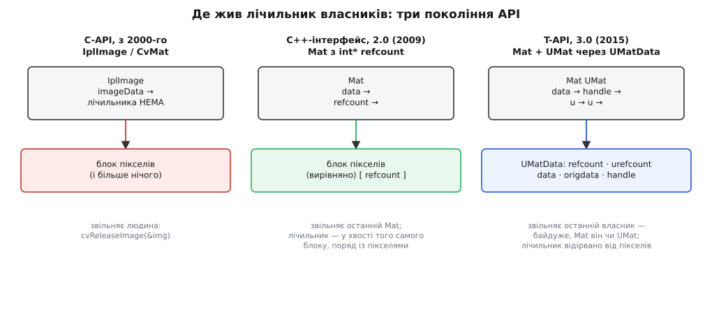

# 📜 Від `cvReleaseImage` до `UMatData`: як OpenCV вчилася володіти пікселями

Лічильник посилань усередині `cv::Mat` — не архітектурна елегантність із першого дня, а відповідь на конкретні аварії, які п'ятнадцять років збирали користувачі бібліотеки. Ця історія варта переказу, бо кожен крок мав свою причину, і причини ці досі проступають у теперішньому коді: у тому, чому лічильник живе в окремій структурі, чому в заголовка буває порожній покажчик власності й чому виріз із кадру — це значення, а не режим.

## Чужа структура, яку прийняли як свою

Перше зображення в OpenCV не було винаходом OpenCV. Довідник самої бібліотеки каже про це прямо: «The `IplImage` is taken from the Intel Image Processing Library, in which the format is native» — тип узято з Intel Image Processing Library (IPL), для якої він рідний, і OpenCV підтримує лише підмножину його можливих форматів. Проєкт починався в Intel наприкінці 1990-х (перша альфа показана на конференції CVPR 2000), тож логічно було не вигадувати свій контейнер, а взяти вже наявний у сусідньої бібліотеки.

Ціна цієї спадковості видно, щойно розгорнути структуру:

```c
typedef struct _IplImage
{
    int  nSize;              /* sizeof(IplImage) */
    int  ID;
    int  nChannels;
    int  alphaChannel;       /* ігнорується OpenCV */
    int  depth;
    char colorModel[4];      /* ігнорується OpenCV */
    char channelSeq[4];      /* ігнорується OpenCV */
    int  dataOrder;
    int  origin;
    int  align;              /* ігнорується; вживається widthStep */
    int  width;
    int  height;
    struct _IplROI *roi;     /* область інтересу — окремий об'єкт */
    struct _IplImage *maskROI;    /* мусить бути NULL */
    void  *imageId;               /* мусить бути NULL */
    struct _IplTileInfo *tileInfo;/* мусить бути NULL */
    int  imageSize;
    char *imageData;         /* ← самі пікселі */
    int  widthStep;          /* байтів на рядок */
    int  BorderMode[4];      /* ігнорується */
    int  BorderConst[4];     /* ігнорується */
    char *imageDataOrigin;   /* початок виділеного блоку */
}
IplImage;
```

Половина полів — баласт від чужої бібліотеки, який OpenCV ніколи не читала й вимагала тримати нульовим. Але для нашої історії важливе інше: **у структурі немає жодного лічильника**. Ні поля, ні покажчика, ні натяку на те, скільки людей зараз дивиться на `imageData`. Отже, знати, коли пікселі більше нікому не потрібні, могла тільки людина, що писала код.

Звідси випливав увесь стиль роботи: `cvCreateImage` виділяв заголовок і дані, `cvReleaseImage` звільняв і те, й те, а між ними програміст мусив тримати в голові повну карту власності.

## Три способи вистрелити собі в ногу

Ручне володіння не «складне взагалі» — воно ламається у трьох цілком конкретних місцях, і саме ці три місця врешті переписали модель пам'яті бібліотеки.

**Перше: подвійне звільнення через аліас.** `IplImage*` — звичайний покажчик, тож його вільно копіювали у структури, черги, поля класів. Дві змінні вказують на один заголовок; кожна гілка коду вважає себе власником; `cvReleaseImage` викликається двічі. Заголовний виклик тут навіть намагався допомогти: він приймав `IplImage**` і по звільненні записував нуль у *передану* змінну — а всі інші копії покажчика залишалися старими й тепер указували в звільнену пам'ять. Захист працював рівно на одну змінну зі скількох завгодно.

**Друге: витік на ранньому виході.** Функція виділяє три проміжні зображення, посередині перевіряє умову й повертає помилку — і мусить перед цим звільнити рівно ті, що вже створені. У C це давало класичний ланцюжок `goto cleanup`; у C++ до цього додавалися винятки, які проходять крізь ділянку між `cvCreateImage` і `cvReleaseImage` і не питають дозволу. Кожна така ділянка — витік на шість мегабайтів. Ідея [RAII](topic:programming/raii) тоді вже була загальним місцем C++, але C-API за визначенням не міг її дати: у ньому немає деструктора, який спрацює сам. Мова про [гарантії безпеки при винятках](topic:programming/exception-safety) з таким API просто не заходила — жодної гарантії не було.

**Третє: область інтересу як прихований стан.** Вирізати шматок зображення в C-API означало не створити новий об'єкт, а **перемкнути режим наявного**: `cvSetImageROI(img, rect)` виділяв структуру `roi` всередині заголовка, після чого всі функції обробляли лише прямокутник — доки хтось не покличе `cvResetImageROI`. Поруч жив `cvSetImageCOI` для вибору каналу, причому, як чесно попереджав довідник, більшість функцій COI не підтримували, тож канал доводилося копіювати в окреме зображення, обробляти й копіювати назад.

Наслідок передбачуваний. Функція, яка отримала `IplImage*`, не знала, чи не стоїть на ньому чужа ROI. Функція, яка ROI поставила й вилетіла з винятком, лишала її стояти назавжди. Дві частини коду не могли дивитися на два різні прямокутники одного зображення одночасно — прямокутник був один, глобальний для об'єкта. Вирізання, річ за суттю своєю **описова**, було реалізоване як **зміна стану**, і кожна така зміна ставала спільною власністю всього коду, що тримав цей покажчик.

## Напівкрок: лічильник, який був, але не працював на користувача

Цікаво, що лічильник у C-API таки з'явився — у матричному типі `CvMat`:

```c
typedef struct CvMat
{
    int type;
    int step;

    /* for internal use only */
    int* refcount;
    int hdr_refcount;

    union { uchar* ptr; short* s; int* i; float* fl; double* db; } data;
    int rows;
    int cols;
}
CvMat;
```

Коментар у заголовку — «for internal use only» — тут головний. Лічильник обслуговував внутрішні потреби бібліотеки (спільні дані між заголовками, які вона робила сама) і кілька явних функцій на кшталт `cvIncRefData`/`cvDecRefData`. Але зовнішній договір не змінився: користувач як створював `cvCreateMat`, так і звільняв `cvReleaseMat` руками, і жодна змінна не рахувала себе власником автоматично. Механізм був — а семантики володіння в типі не було, бо в C немає місця, куди її повісити: ані конструктора копії, ані деструктора.

Це і є межа, об яку впирався весь старий інтерфейс. Автоматичне керування пам'яттю — не бібліотечна функція, а властивість **типу**. Або мова дає точку, де тип реагує на копіювання й на кінець області видимості, або керувати доведеться людині.

## 2009: C++-інтерфейс і лічильник у хвості блоку пікселів

Офіційний журнал змін OpenCV описує другу мажорну версію короткою фразою, у якій сховано весь зміст переходу: «The brand-new C++ interface for most of OpenCV functionality (cxcore, cv, highgui) has been introduced. Generally it means that you will need to do less coding to achieve the same results; it brings **automatic memory management** and many other advantages». Там же зазначено, що старий інтерфейс зберігається й далі підтримується — ламати накопичений код ніхто не збирався.

Дата має дрібну розбіжність, яку варто назвати чесно: вікі-журнал змін самого проєкту датує 2.0 **вереснем 2009-го**, тоді як Вікіпедія пише «October 2009» (наступний реліз, 2.1, — квітень 2010-го). Різниця, найпевніше, між моментом оголошення і моментом появи архіву; для нашої історії суттєвий рік і те, що з цього моменту релізи пішли раз на пів року.

Механіка першої версії `cv::Mat` була простішою, ніж теперішня, і в цій простоті — своя краса. Лічильник був звичайним полем-покажчиком у заголовку:

```cpp
//! pointer to the reference counter;
// when matrix points to user-allocated data, the pointer is NULL
int* refcount;
```

А жив той `int` **у хвості того самого блоку, що й пікселі** — це видно з коду виділення в `matrix.cpp` гілки 2.4:

```cpp
size_t totalsize = alignSize(step.p[0]*size.p[0], (int)sizeof(*refcount));
data = datastart = (uchar*)fastMalloc(totalsize + (int)sizeof(*refcount));
refcount = (int*)(data + totalsize);
*refcount = 1;
```

Один `malloc` на все: пікселі, вирівнювання, і за ними чотири байти лічильника. Рішення ощадливе — жодного зайвого виділення, лічильник поруч із даними, звільнення однією операцією.

Тут же розв'язалися всі три давні болячки. Копія `Mat` стала дешевою й безпечною, бо конструктор копії робить `+1`, а деструктор `−1` — і виклик деструктора гарантує мова, хоч на нормальному виході, хоч на виняткові. Виріз перестав бути режимом: `img(cv::Rect(x, y, w, h))` створює **новий заголовок** із власними `rows`, `cols` і зсунутим `data`, тимчасом як старий заголовок не змінюється взагалі. Два шматки коду можуть тримати два різні прямокутники одного кадру й нічого один одному не зіпсувати — бо описи різні, а пікселі спільні. Слово «ROI» перетворилося з дієслова на іменник.

Коментар у заголовку показує і третій режим, який тут-таки з'явився: коли `Mat` лише накинуто на чужий буфер, `refcount` дорівнює `NULL` — заголовок є, володіння немає, деструктор не звільняє нічого. Це не недогляд, а свідома точка стику з рештою світу: захопленим кадром із драйвера чи з відеоконвеєра OpenCV не володіє.

## 2015: OpenCL відриває лічильник від пікселів

Наступний зсув спричинила не помилка користувачів, а нове залізо. У версії 3.0 (реліз 4 червня 2015-го) з'явився T-API — «transparent API… transparent GPU acceleration layer using OpenCL», зроблений, як зазначено в оголошенні, за контрактом і за підтримки AMD та Intel. Ідея T-API: той самий виклик функції працює або на процесорі, або на пристрої OpenCL, залежно від того, що доступно, і код користувача про це не знає. Носієм даних для пристрою став `cv::UMat` — тип-близнюк `Mat`, у якого «пікселі» можуть бути не адресою в оперативній пам'яті, а дескриптором буфера на пристрої.

І тут стара конструкція розвалюється буквально за одним рядком. Лічильник лежав **усередині блоку пікселів**, за адресою `data + totalsize`. Якщо блок пікселів — це пам'ять відеокарти, до якої процесор не має прямого доступу, то дописати туди `int` і атомарно його зменшувати з боку хоста неможливо. Мало того, той самий буфер може бути одночасно описаний і як `Mat` (погляд процесора), і як `UMat` (погляд пристрою), а спільний лічильник мусить бачити обох власників.

Відповідь — винести все, що стосується володіння, у окрему структуру на боці хоста. Так у 3.0 з'явився `UMatData`:

```cpp
const MatAllocator* prevAllocator;
const MatAllocator* currAllocator;
int urefcount;      // скільки UMat-заголовків
int refcount;       // скільки Mat-заголовків
uchar* data;        // адреса для процесора (може бути NULL)
uchar* origdata;    // початок виділеного блоку
size_t size;
int flags;
void* handle;       // дескриптор буфера пристрою
void* userdata;
int allocatorFlags_;
```

Поле `int* refcount` із `Mat` зникло, натомість заголовок став посилатися на керівний блок полем `UMatData* u`. Два лічильники замість одного — саме тому, що власників тепер два роди: `UMat::getMat`, який відображає буфер пристрою в звичайний `Mat`, робить `CV_XADD(&hdr.u->refcount, 1)`, тобто додає одного власника-процесорного, не чіпаючи рахунок пристроєвих. Блок пікселів помирає, коли зникає останній власник обох родів — і не раніше, навіть якщо процесорна сторона давно все відпустила.



*Три покоління: без лічильника й з ручним звільненням; лічильник у хвості блоку пікселів; лічильник у відірваному від пікселів керівному блоці, спільному для процесорного й пристроєвого поглядів.*

Це та сама траєкторія, якою C++ пройшов від «розумного покажчика з лічильником усередині об'єкта» до `shared_ptr` з окремим керівним блоком, і з тієї самої причини: щойно об'єкт може жити не там, де може жити службова інформація про нього, вони мусять роз'їхатися. Подробиці того, як T-API вирішує, де рахувати кадр, і що це коштує на стику з відеоконвеєром, — у темі [бекендів і прискорення](topic:media-vision/opencv-backends).

Побічний ефект переходу видно і в структурі коду: у 3.0 старий C-API нікуди не подівся, але переїхав в окремі заголовки (`opencv2/core/core_c.h` і подібні) з рекомендацією користуватися C++-інтерфейсом. Старе зображення з Intel IPL зробили гостем у власному домі.

## Хто це зробив

Тут варто бути точним, бо спокуса приписати такий поворот одній людині велика. Первинні джерела — журнали змін, оголошення релізів і сторінка історії проєкту — послідовно називають **організації й команди**, а не авторів: початок в дослідницькій ініціативі Intel наприкінці 1990-х, серед головних учасників — «optimization experts in Intel Russia» та команда Intel Performance Library; згодом підтримка з боку Willow Garage; з серпня 2012-го опіка над проєктом переходить до неприбуткової організації OpenCV.org; компанію Itseez, що вела основну розробку, Intel купує в травні 2016-го. T-API, як прямо сказано в оголошенні 3.0, зроблено за контрактом за підтримки AMD та Intel.

Персональне авторство в такому проєкті існує на рівні журналу комітів, а не на рівні «винаходу»: конкретні рядки `Mat::release` чи `UMatData` мають конкретних авторів, і їх видно в історії репозиторію, — але **ідея** підрахунку посилань не належить нікому з них (їй десятиліття, і в C++ вона тоді вже стандартизувалася), а **рішення** перевести бібліотеку на неї було рішенням команди, оформленим релізом. Розрізняти ці рівні варто завжди: ідея, реалізація, реліз і популяризація — чотири різні заслуги, і в історії техніки вони рідко належать тим самим людям.

## Що з цієї історії лишилося в теперішньому коді

Три сліди, кожен із яких пояснюється лише минулим.

Перший — `Mat` досі вміє бути заголовком без володіння (`u == NULL`). Це прямий нащадок світу, де зображення приходили ззовні у вигляді голого `char*`, і бібліотека мусила з ними працювати, не претендуючи на них.

Другий — керівний блок зветься `UMatData`, а не `MatData`, хоча ним користується й звичайний `Mat`, який жодного стосунку до OpenCL не має. Ім'я лишилося від того, хто прийшов першим і заради кого блок відокремили.

Третій — сама асиметрія, яка так дивує новачків: `Mat b = a;` не копіює пікселі, а `b = a.clone();` копіює. Це не витівка авторів, а фіксація тієї межі, по яку старий C-API дійшов і не зміг перейти: володіння мусило переїхати з голови програміста в тип, і єдиний спосіб зробити це в C++ — переозначити те, що робить знак присвоєння. Той, хто пам'ятає `cvReleaseImage(&img)` у кінці кожної гілки, вважає цю ціну сміховинно малою.
