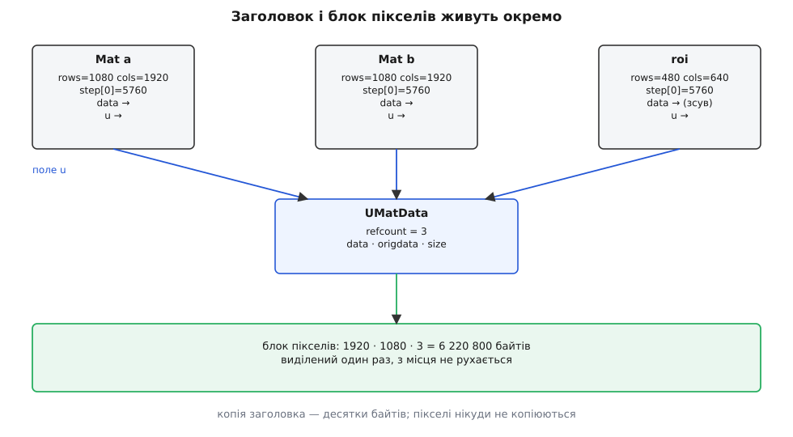
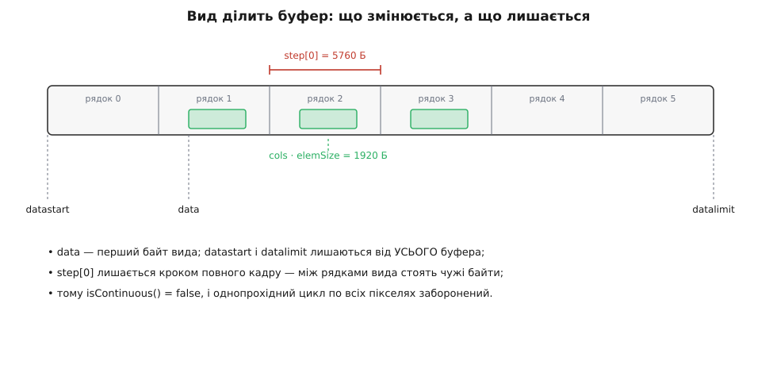
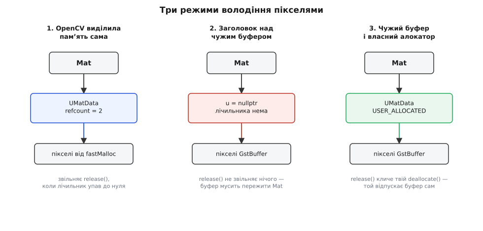

# cv::Mat: пам'ять, лічильник посилань і володіння

<preknowlist>
- [Підрахунок посилань](topic:programming/reference-counting) — спільний лічильник власників, який звільняє ресурс тоді, коли зникає останній із них.
- [shared_ptr і weak_ptr](topic:cpp-standards/shared-weak-ptr) — як C++ виражає спільне володіння: керівний блок окремо від об'єкта, атомарний лічильник усередині.
- [RAII](topic:programming/raii) — ресурс захоплюється в конструкторі й віддається в деструкторі, тож звільнення не можна забути.
- [Зображення як дані](topic:algorithms/image-as-data) — кадр це прямокутна сітка чисел, а не картинка; висота, ширина, кількість каналів.
- [Формати пікселів і буферів зображення](topic:algorithms/pixel-formats) — скільки байтів займає піксель, що таке крок рядка й чому площини бувають окремі.
- [Вирівнювання даних у пам'яті](topic:programming/memory-alignment) — чому адреса буфера буває кратна 16, 32 чи 64 байтам і що це дає процесорові.
- [std::atomic і порядок пам'яті](topic:programming/std-atomic) — атомарна операція читання-зміни-запису та її вартість.
</preknowlist>

Кадр Full HD у трьох байтах на піксель важить шість із чвертю мегабайтів. Тепер уявіть звичайний ланцюжок обробки: функція захоплення повертає кадр, наступна функція бере його як аргумент, третя робить із нього виріз, четверта кладе копію в чергу для показу. Якщо тип кадру поводиться як звичайне значення C++ — тобто копіюється побайтово при кожній передачі, — то на тридцяти кадрах за секунду ці чотири передачі коштують сімсот п'ятдесят мегабайтів на секунду самого лише `memcpy`. Пропускна здатність пам'яті скінченна, і обробка помре ще до першої згортки.

Очевидний вихід — передавати не кадр, а вказівник на нього. Але вказівник переносить проблему, а не розв'язує її: тепер хтось мусить пам'ятати, коли пікселі більше нікому не потрібні. Захопили кадр, віддали в чергу показу, а самі пішли по наступний — хто звільняє буфер? Якщо той, хто виділив, — черга показу отримає покажчик у вже звільнену пам'ять. Якщо той, хто останній використав, — доведеться домовлятися між незалежними шматками коду, а домовленості такого роду ламаються першою ж помилкою або першим же винятком.

`cv::Mat` існує саме як відповідь на цю дилему. Її розв'язок не оригінальний — це підрахунок посилань, — але спосіб, у який він вбудований у тип, породжує цілу низку наслідків, які регулярно ловлять людей зненацька: присвоєння, що не копіює; функція, яка змінила аргумент, переданий за значенням; виріз, що тримає при житті весь кадр; заголовок, який рівно нічого не звільняє. Усі ці несподіванки — прямі, передбачувані наслідки однієї конструкції, і варто розібрати її до дна.

## Заголовок окремо, пікселі окремо

Перше і головне: `cv::Mat` — це **не** буфер пікселів. Це маленька структура з полів, яка описує, **де** лежать пікселі та **як** їх читати. Пікселі лежать деінде — у власному блоці пам'яті, виділеному окремо.

Ось скорочений склад цієї структури (реальні поля, у порядку оголошення в `mat.hpp`):

```cpp
class Mat {
public:
    int flags;          // сигнатура, тип елемента, прапорець суцільності
    int dims;           // кількість вимірів (для зображення — 2)
    int rows, cols;      // висота й ширина (лише коли dims == 2)
    uchar* data;         // ← перший байт ЦЬОГО зображення
    const uchar* datastart;  // початок усього виділеного блоку
    const uchar* dataend;    // за останнім використаним байтом
    const uchar* datalimit;  // за останнім байтом блоку
    MatAllocator* allocator; // хто виділяв (0 — стандартний)
    UMatData* u;             // ← керівний блок із лічильником
    MatSize size;
    MatStep step;            // step[0] — байтів на рядок, step[1] — на піксель
};
```

Це десь сотня байтів. Скопіювати такий заголовок — операція, вартість якої не залежить від розміру зображення: кілька присвоєнь цілих чисел і покажчиків. Порівняйте з шістьма мегабайтами `memcpy` — різниця в п'ять порядків, і саме вона робить передавання кадрів дешевим.



*Три різні `Mat` (два повні кадри й один виріз) мають кожен свій набір полів, але дивляться в один і той самий блок пікселів через спільний керівний блок.*

Розділення на заголовок і дані — не примха, а необхідність. Щойно ми вирішили, що передавання має бути дешевим, з'явилася потреба мати **кілька описів однієї пам'яті**: повний кадр і виріз із нього — це різні `rows`, `cols` і різний `data`, але ті самі пікселі. Тримати геометрію всередині блоку пікселів було б неможливо, бо геометрій одночасно кілька. Отже, заголовок мусить бути окремим об'єктом. А щойно заголовків кілька, а блок один — постає питання, хто його звільняє.

## Лічильник, який робить копію дешевою

Відповідь: ніхто конкретно. Звільняє **останній**, а хто саме ним виявиться, вирішує лічильник.

Лічильник живе не в `Mat` і не в самому блоці пікселів, а в третьому об'єкті — `UMatData`. Це керівний блок: він тримає покажчик на дані, їхній розмір, прапорці походження і два цілі числа-лічильники. Заголовок `Mat` посилається на нього полем `u`.

Уся механіка вміщається у дві функції з `modules/core/src/matrix.cpp`:

```cpp
void Mat::addref()
{
    if( u )
        CV_XADD(&u->refcount, 1);
}

void Mat::release()
{
    if( u && CV_XADD(&u->refcount, -1) == 1 )
        deallocate();
    u = NULL;
    datastart = dataend = datalimit = data = 0;
    for(int i = 0; i < dims; i++)
        size.p[i] = 0;
}
```

Тут варто затриматися на трьох дрібницях, у кожній з яких є сенс.

**`CV_XADD` повертає СТАРЕ значення.** Це макрос над атомарним «додати й повернути попереднє» — `__atomic_fetch_add` у GCC та Clang, `_InterlockedExchangeAdd` у MSVC. Тому умова звільнення записана як `== 1`, а не `== 0`: якщо перед відніманням лічильник був одиницею, після нього він став нулем, і цей `Mat` — останній власник. Перевірити «чи став нуль» окремим читанням було б помилкою: між відніманням і читанням інший потік устиг би зробити своє віднімання, і блок звільнили б двічі.

**Перевірка `if( u )` — не захист від помилки, а робочий режим.** Заголовок без `u` цілком законний, і саме він дає третій режим володіння, до якого ми ще дійдемо.

**`release()` не просто зменшує лічильник — він знеструмлює заголовок.** Після нього `Mat` порожній: жодних покажчиків, нульовий розмір. Це та сама дисципліна, що й у `unique_ptr::reset` — стан після звільнення мусить бути очевидно недійсним, а не «майже дійсним».

Далі все, що бачить користувач, — це обгортки над цими двома викликами. Конструктор копіювання й присвоєння роблять `addref` для джерела, деструктор робить `release`. Присвоєння варте окремого погляду:

```cpp
Mat& Mat::operator=(const Mat& m)
{
    if( this != &m )
    {
        if( m.u )
            CV_XADD(&m.u->refcount, 1);
        release();
        flags = m.flags;
        // ... далі копіюються всі поля заголовка
    }
    return *this;
}
```

Порядок тут не випадковий: **спершу збільшити лічильник джерела, лише потім звільнити своє**. Якщо зробити навпаки, конструкція `a = a(cv::Rect(10, 10, 100, 100))` знищила б блок пікселів рівно перед тим, як на нього почав би вказувати новий заголовок. Це той самий інваріант, що й у `shared_ptr::operator=`, і в обох випадках його порушення дає помилку, яка не відтворюється на дрібних тестах.

> 🔧 **Навіщо це.** Кадр можна вільно повертати з функції, класти в `std::vector`, ставити в чергу між потоками й розкладати по структурах — усе це коштує копію заголовка. Оптимізації на кшталт «поверну вказівник, щоб не копіювати» тут не потрібні: вони нічого не заощаджують, зате повертають ту саму проблему власності, від якої `Mat` рятує.

Історія того, як OpenCV дійшла до цієї конструкції — через `IplImage` з ручним `cvReleaseImage`, через `int* refcount` просто в тілі `Mat` і аж до винесення лічильника в спільний із `UMat` керівний блок — розказана окремо: [звідки взявся Mat і що було до нього](topic:media-vision/mat-memory-model/hist-mat-vs-iplimage.md).

## Що з цього випливає щодня

Тепер найважливіше: **копіювання `Mat` не копіює пікселі**. Це не оптимізація, яку можна не помітити, — це семантика типу, і вона змінює зміст найзвичайнішого коду.

```cpp
cv::Mat a = cv::imread("frame.png");   // refcount = 1
cv::Mat b = a;                         // refcount = 2, пікселі ті самі
b.at<cv::Vec3b>(0, 0) = {0, 0, 255};   // змінилося і в a теж
```

Люди, які прийшли зі `std::vector`, читають третій рядок як зміну незалежної копії. Це не так: `a` і `b` — два описи однієї пам'яті, і запис через будь-який з них бачать обидва. Щоб отримати справді незалежні пікселі, треба сказати про це явно:

```cpp
cv::Mat c = a.clone();       // новий блок, refcount власний, дані скопійовано
cv::Mat d;
a.copyTo(d);                 // те саме, але d може перевикористати свій буфер
```

`clone()` завжди виділяє новий блок. `copyTo()` спершу питає приймача, чи його буфер уже підходить, — і тільки якщо ні, виділяє новий. Різниця між ними стає суттєвою в циклі по кадрах: `clone()` у циклі — це виділення й звільнення шести мегабайтів тридцять разів на секунду, `copyTo()` у той самий заздалегідь створений `Mat` — жодного виділення після першого кадру.

Друга щоденна пастка виникає, коли `Mat` передають у функцію.

```cpp
void spoil(cv::Mat m) {          // копія ЗАГОЛОВКА
    m.setTo(cv::Scalar(0));      // ← пише в пікселі виклику: видно зовні
    m = cv::Mat::zeros(4, 4, CV_8U);  // ← міняє лише локальний заголовок: НЕ видно
}
```

Обидва рядки виглядають як «змінюю `m`», але роблять протилежні речі. `setTo` пише **крізь** заголовок у спільні пікселі — цей ефект переживе повернення з функції. Присвоєння ж міняє **сам** локальний заголовок: він від'єднується від старого блоку (`release`) і приєднується до нового, а заголовок у місці виклику лишається як був. Правило, яке з цього випливає, просте: `Mat`, переданий за значенням, дає доступ на запис до чужих пікселів, але не дає змоги віддати назовні інше зображення.

Тому в самій OpenCV вхідні параметри оголошують як `const cv::Mat&` (або `cv::InputArray`), а вихідні — як `cv::Mat&` (або `cv::OutputArray`). Універсальні проксі-типи, якими бібліотека приймає й `Mat`, і `UMat`, і `std::vector`, — окрема тема: [InputArray й OutputArray](topic:media-vision/input-output-array).

І третій наслідок, найтихіший: **виріз тримає при житті весь кадр**. Заголовок вирізу посилається на той самий `UMatData`, отже, лічильник не впаде до нуля, доки живий виріз. Взяли з кадру 4K прямокутник 32×32 як шаблон і поклали в довгий список — і разом із кожним таким шаблоном у пам'яті лишається двадцять чотири мегабайти кадру. Ліки очевидні: `clone()` на вході в довге сховище. Механіка вирізів і заголовків над чужою пам'яттю розібрана окремо — [види без копії](topic:media-vision/mat-views-no-copy).

## create(): чому вихідний Mat перевиділяється не завжди

Кожна функція OpenCV, що пише результат у `Mat`, починається з виклику `create(rows, cols, type)` на приймачі. Логіка цього виклику — головна причина, чому конвеєр обробки не смітить у купі.

```cpp
void Mat::create(int _rows, int _cols, int _type)
{
    _type &= TYPE_MASK;
    if( dims <= 2 && rows == _rows && cols == _cols && type() == _type && data )
        return;                       // ← вже підходить: не робимо НІЧОГО
    // інакше: release(); ... виділити новий блок; addref();
}
```

Якщо приймач уже має буфер потрібного розміру й типу — виділення не буде. Тому типовий цикл виглядає так:

```cpp
cv::Mat frame, gray, blurred;
while (cap.read(frame)) {
    cv::cvtColor(frame, gray, cv::COLOR_BGR2GRAY);   // виділить один раз
    cv::GaussianBlur(gray, blurred, {5, 5}, 1.5);    // виділить один раз
    // ...
}
```

Перший кадр виділяє `gray` і `blurred`, решта кадрів пише в готові буфери. Оголосіть ті самі змінні **всередині** циклу — і кожен кадр коштуватиме дві пари «виділити-звільнити». На гарячому шляху відео це помітно.

У цієї ж механіки є зворотний бік, який ловить людей, коли вони пробують писати результат у виріз:

```cpp
cv::Mat canvas(1080, 1920, CV_8UC3, cv::Scalar::all(0));
cv::Mat corner = canvas(cv::Rect(0, 0, 640, 480));
cv::cvtColor(src, corner, cv::COLOR_BGR2GRAY);   // ← corner ВІДЧЕПИТЬСЯ від canvas
```

`cvtColor` просить у приймача один канал, а `corner` має три. Розміри збігаються, тип — ні, тож `create` звільняє посилання на `canvas` і виділяє `corner` окремий блок. Код виконається без жодної помилки, і в `canvas` нічого не з'явиться. Правильний шлях — зробити перетворення в окремий `Mat` і потім скопіювати його у виріз через `copyTo`, який пише крізь заголовок і нічого не перевиділяє, коли форма збігається.

## Геометрія буфера: data, step і суцільність

Щоб зрозуміти, чому виріз поводиться саме так, треба знати, як заголовок адресує пікселі. Адреса елемента `(y, x)` рахується прямо:

```
адреса(y, x) = data + y · step[0] + x · step[1]
step[1] = elemSize()   (байтів на піксель)
```

`step[0]` — це відстань між початками сусідніх рядків **у байтах**, і вона не зобов'язана дорівнювати `cols · elemSize()`. Коли пам'ять виділяє сама OpenCV, вона дорівнює: стандартний алокатор укладає рядки впритул, і `total = elemSize · cols · rows` байтів іде одним суцільним шматком. Але щойно з'являється виріз, ширина зменшується, а крок лишається кроком **батьківського** кадру — інакше виріз не потрапляв би в потрібні пікселі.



*Виріз змінює `data`, `rows` і `cols`, але не змінює ні `step[0]`, ні межі буфера — тому за його рядком одразу починаються чужі байти.*

Це пояснює й призначення трьох «граничних» покажчиків. `datastart` і `datalimit` описують **увесь** блок, а не поточний вид, і виріз успадковує їх від батька без змін. Такий вибір дає несподівано корисну властивість: за самим лише вирізом можна відновити, звідки його взяли. Саме це робить `Mat::locateROI`.

**Умова.** Кадр 1920×1080, тип `CV_8UC3`. Беремо виріз 640×480 з точки (x = 100, y = 50) і потім питаємо в нього, де він у батьківському кадрі.

```
elemSize   = 3 байти              (CV_8UC3: 3 канали по 1 байту)
step[0]    = 1920 · 3     = 5760 байтів
блок       = 5760 · 1080  = 6 220 800 байтів

roi.data     = datastart + 50 · 5760 + 100 · 3
             = datastart + 288 000 + 300
             = datastart + 288 300
roi.step[0]  = 5760                        ← не 640 · 3
roi.datastart, roi.datalimit — успадковані від кадру

зворотний хід (locateROI):
delta1 = data − datastart              = 288 300
ofs.y  = delta1 / step[0]              = 288 300 / 5760 = 50
ofs.x  = (delta1 − ofs.y · step[0]) / elemSize
       = (288 300 − 288 000) / 3       = 100

delta2  = dataend − datastart          = 6 220 800
minstep = (ofs.x + cols) · elemSize    = (100 + 640) · 3 = 2 220
height  = (delta2 − minstep) / step[0] + 1
        = (6 220 800 − 2 220) / 5760 + 1 = 1079 + 1 = 1080
width   = (delta2 − step[0] · (height − 1)) / elemSize
        = (6 220 800 − 6 215 040) / 3   = 1920
```

Виріз, який нічого не знає про свого батька, повернув його точний розмір і своє положення в ньому — самою лише арифметикою над покажчиками. Це і є плата за те, що межі буфера залишаються батьківськими.

Друга плата — втрата суцільності. Прапорець `CV_MAT_CONT_FLAG` у полі `flags` означає рівно одне: `step[0] == cols · elemSize()`, тобто в буфері немає проміжків між рядками, і всі пікселі лежать одним неперервним масивом. Метод `isContinuous()` читає цей прапорець, а не рахує щоразу. Для вирізу завширшки менше за батька він знятий — і саме тому реальний код обробки виглядає так:

```cpp
void addOffset(cv::Mat& m, int delta) {
    CV_Assert(m.type() == CV_8UC1);
    int rowsToScan = m.rows, colsToScan = m.cols;
    if (m.isContinuous()) {           // рядки стикаються —
        colsToScan *= rowsToScan;     // обходимо все одним циклом
        rowsToScan = 1;
    }
    for (int y = 0; y < rowsToScan; ++y) {
        uchar* p = m.ptr<uchar>(y);
        for (int x = 0; x < colsToScan; ++x)
            p[x] = cv::saturate_cast<uchar>(p[x] + delta);
    }
}
```

Цей прийом — «якщо суцільно, склей рядки в один рядок» — розсипаний по всій бібліотеці. Виграш не в кількості операцій, а в тому, що один довгий прохід дружніший до [кеша](topic:programming/cache) й векторизації, ніж 1080 коротких із перезапуском циклу. І ще: без перевірки `isContinuous()` цей самий цикл на вирізі поліз би в сусідні пікселі батька — мовчки, без жодного порушення доступу, бо пам'ять там законна.

## Три режими володіння

Тепер можна назвати повний набір станів, у яких буває `Mat`. Їх три, і різняться вони тим, що саме стоїть у полі `u`.



*Що звільняє пікселі, залежить від того, як `Mat` до них потрапив: через свій алокатор, через сирий покажчик або через чужий алокатор.*

**Режим перший — власна пам'ять.** `Mat` створено конструктором із розмірами, через `create`, `clone`, `imread` чи будь-яку функцію обробки. Поле `u` вказує на `UMatData`, лічильник працює, останній `release` звільняє блок. Це стан за замовчуванням, і в ньому `Mat` — повноцінний RAII-об'єкт: забути звільнити пам'ять неможливо.

**Режим другий — заголовок над чужим буфером.** Конструктор `Mat(rows, cols, type, void* data, size_t step = AUTO_STEP)` не виділяє нічого. Він просто записує чужий покажчик у поле `data` і лишає `u` нулем:

```cpp
uchar* raw = /* байти звідкись іззовні */;
cv::Mat view(1080, 1920, CV_8UC3, raw, 5760);
// view.u == nullptr; view.datastart == raw
```

Такий `Mat` не володіє нічим. Його `release()` бачить `u == nullptr`, не чіпає лічильника й не викликає `deallocate()` — заголовок просто обнуляється. Це навмисно: OpenCV не має жодного способу дізнатися, звідки взявся `raw` і чим його правильно звільняти. Уся відповідальність за час життя пам'яті лишається на вас — і саме тут народжується найпоширеніша аварія на стику з відео.

**Режим третій — чужий буфер, але через свій алокатор.** Проміжний варіант: `UMatData` є, лічильник працює, але дані виділяв не стандартний алокатор. Такий керівний блок несе прапорець `UMatData::USER_ALLOCATED`, і стандартна процедура звільнення в цьому разі не викликає `fastFree`:

```cpp
void deallocate(UMatData* u) const CV_OVERRIDE
{
    if(!u) return;
    CV_Assert(u->urefcount == 0);
    CV_Assert(u->refcount == 0);
    if( !(u->flags & UMatData::USER_ALLOCATED) )
    {
        fastFree(u->origdata);
        u->origdata = 0;
    }
    delete u;
}
```

Практична цінність режиму в тому, що `MatAllocator` — це віртуальний інтерфейс, і власна його реалізація може робити у своєму `deallocate` що завгодно: віддати буфер у пул, зняти відображення пам'яті, відпустити об'єкт чужої бібліотеки. Тобто третій режим — це спосіб **прив'язати чужий час життя до лічильника `Mat`**.

## Коли лічильника нема: кадр із конвеєра

Складіть докупи два факти — і аварія напрошується сама. Кадр із відеоконвеєра приходить у буфері, яким володіє конвеєр. Щоб не копіювати шість мегабайтів на кожному кадрі, ми будуємо над ним заголовок другим режимом. І цей заголовок нічого не тримає.

У GStreamer це виглядає так: [appsink](topic:media-vision/appsink-appsrc) віддає `GstSample`, з нього беруть `GstBuffer`, буфер відображають у пам'ять процесу викликом `gst_buffer_map` — і одержують покажчик, дійсний рівно доти, доки не викликано `gst_buffer_unmap` і доки живий сам зразок.

```cpp
cv::Mat grabFrame(GstAppSink* sink) {
    GstSample* sample = gst_app_sink_pull_sample(sink);
    GstBuffer* buf = gst_sample_get_buffer(sample);
    GstMapInfo mi;
    gst_buffer_map(buf, &mi, GST_MAP_READ);

    cv::Mat frame(1080, 1920, CV_8UC3, mi.data);   // заголовок без володіння

    gst_buffer_unmap(buf, &mi);
    gst_sample_unref(sample);                       // буфер може бути звільнений
    return frame;                                   // ← покажчик уже висячий
}
```

Компілятор мовчить, санітайзери мовчать, а на робочому конвеєрі функція повертає `Mat`, який дивиться у звільнену або вже перезаписану пам'ять. Найгірше в цій помилці те, що вона довго вдає працездатність: доки алокатор не віддав ту сторінку комусь іншому, у кадрі видно правильне зображення. Це класичне [звернення після звільнення](topic:cpp-standards/dangling-references), просто заховане за типом, який зазвичай усе робить сам.

Виходів рівно три, і вибір між ними — це вибір ціни.

**Скопіювати на вході.** `frame.clone()` перед `unmap` — одне копіювання кадру, після якого життя `Mat` знову цілком своє. Це чесна ціна, і для більшості завдань вона прийнятна: шість мегабайтів `memcpy` — це частки мілісекунди, і на тлі самої обробки їх часто не видно.

**Не випускати `Mat` за межі відображення.** Обробити кадр тут-таки, між `map` і `unmap`, і назовні віддати вже результат — гістограму, координати, маску. Копіювання немає взагалі, але вся обробка змушена жити всередині одного виклику, і жоден кадр не можна відкласти в чергу.

**Прив'язати час життя буфера до лічильника.** Третій режим володіння: власний `MatAllocator` створює `UMatData` навколо відображених байтів, а в його `deallocate` викликає `gst_buffer_unmap` і `gst_sample_unref`. Тоді останній `release` заголовка автоматично відпускає зразок конвеєра — і кадр можна класти в чергу, передавати між потоками й тримати скільки треба, не скопіювавши жодного байта. Робочий міст із цією прив'язкою, разом із перевіркою кроку рядка з `GstVideoInfo` і поведінкою під тиском черги, розібрано окремо: [appsink → cv::Mat без копіювання](topic:media-vision/mat-memory-model/proj-gst-frame-to-mat.md).

Дві застороги, без яких третій варіант перетворюється на іншу помилку. По-перше, крок рядка з конвеєра майже ніколи не дорівнює `width · elemSize`: відеокадри вирівнюють на 4 чи 16 байтів, тому `step` треба брати з `GstVideoInfo`, а не рахувати з ширини. По-друге, формат пікселів мусить збігатися насправді, а не за назвою: `Mat` з `CV_8UC3` над буфером NV12 не дасть ані помилки, ані картинки. Про відповідність форматів і про те, які з них узагалі можна відобразити в `Mat` без перетворення, — [стик із відеоконвеєром](topic:media-vision/frame-interop) і, з боку конвеєра, [буфери й пам'ять GStreamer](topic:media-vision/buffers-and-memory).

> 🔧 **Навіщо це.** Різниця між «клонуємо кожен кадр» і «прив'язуємо буфер до лічильника» на 1080p60 — це близько 750 МБ/с трафіку пам'яті. На настільній машині це терпимо, на одноплатнику з розділеною пам'яттю між процесором і графікою — це різниця між реальним часом і показом слайдів.

## Що атомарний лічильник не обіцяє

Лічильник атомарний, тож копіювати й знищувати заголовки в різних потоках безпечно: два потоки, які одночасно роблять `Mat b = a;` і `~Mat()`, не зіпсують лічильника й не звільнять блок двічі. Із цього регулярно роблять хибний висновок, що `Mat` «потокобезпечний». Ні. Атомарний лічильник захищає **себе**, і більше нічого.

Не захищене два.

**Самі пікселі.** Два заголовки на один блок — це два шляхи до тих самих байтів. Якщо один потік пише, а другий читає, це [гонка даних](topic:programming/atomicity-races) з невизначеною поведінкою, і лічильник тут ні до чого. Схема «продюсер віддає кадр, споживач читає» вимагає або передавання володіння без спільного доступу, або клонування, або зовнішньої синхронізації.

**Сам заголовок.** Один і той самий об'єкт `Mat`, який один потік присвоює, а другий читає, — теж гонка: поля заголовка звичайні, без атомарності. Спільним може бути **блок**, а не **змінна**. Правильна схема — у кожного потоку свій `Mat`, хай навіть усі вони вказують на одні пікселі.

Є ще одна тонкість, яку варто назвати чесно. Атомарний лічильник щоразу коштує: операція «читання-зміна-запис» на спільній кеш-лінії тягне за собою її захоплення й змушує інші ядра її анулювати. На копіюванні кількох кадрів це непомітно. На мільйоні дрібних `Mat` у гарячому циклі — цілком помітно, і саме тому в такому коді передають `const Mat&`, а не `Mat`: посилання не чіпає лічильника взагалі.

Друге ціле число в `UMatData` — `urefcount` — рахує заголовки `UMat`, тобто ті самі дані з боку прискорювача. Блок звільняється, лише коли обидва лічильники нульові; про цей другий бік — [бекенди й прискорення](topic:media-vision/opencv-backends).

## Хто насправді виділяє пам'ять

Наостанок — рівень нижче за `UMatData`. Стандартний алокатор просить пам'ять не в `operator new`, а у власної функції `fastMalloc`, яка бере в `malloc` трохи більше, ніж треба, і зсуває покажчик до межі, кратної `CV_MALLOC_ALIGN`. У сучасних збірках OpenCV це 64 байти — розмір кеш-лінії на більшості теперішніх процесорів.

Причин дві, і обидві практичні. Вирівняні на 32 чи 64 байти адреси дозволяють [векторним інструкціям](topic:programming/simd-vectorization) читати повний регістр однією операцією замість двох. І кожен рядок такого буфера починається на межі кеш-лінії, тож обробка сусідніх рядків у різних потоках не б'ється за одну лінію — не виникає хибного розподілу.

Оскільки алокатор — це віртуальний інтерфейс `MatAllocator`, його можна замінити: індивідуально (полем `Mat::allocator`) або глобально (`cv::Mat::setDefaultAllocator`). Найчастіший привід — пул буферів під відео: розміри кадрів однакові й наперед відомі, тож замість тисяч викликів `malloc`/`free` за хвилину роботи розумніше тримати кільце готових блоків і віддавати їх по колу. Загальна механіка таких алокаторів і їхні пастки описані окремо — [власні алокатори](topic:cpp-standards/custom-allocators); з боку OpenCV специфіка лише в тому, що ваш `deallocate` мусить самостійно видалити `UMatData` і поважати прапорець `USER_ALLOCATED`.

Повний перелік полів заголовка, конструкторів, прапорців `UMatData` й методів, що змінюють володіння, зібрано в довідковій вставці: [поля й виклики, що керують володінням](topic:media-vision/mat-memory-model/api-mat-ownership.md).

---

Усе розібране зводиться до однієї фрази, яку варто тримати в голові щоразу, коли в коді з'являється `cv::Mat`: це `shared_ptr` на блок байтів, до якого прикручено геометрію. Звідси й дешеве копіювання, і спільний запис, і виріз, що тримає кадр, і заголовок, який нічого не звільняє.

І звідси ж — два питання, які варто ставити будь-якому `Mat`, що потрапив до вас іззовні. Перше: **хто виділив цей блок** — OpenCV, чужа бібліотека чи ніхто (заголовок над сирим покажчиком)? Друге: **хто ще тримає на нього заголовок** — і чи не пише туди просто зараз? Відповіді на ці два питання вичерпують усе, що може піти не так із пам'яттю в OpenCV.
