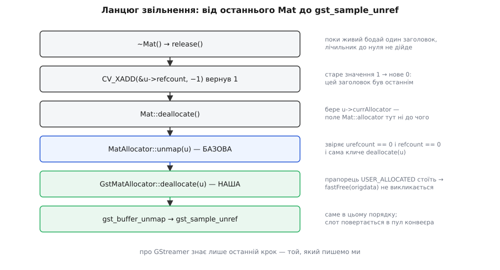
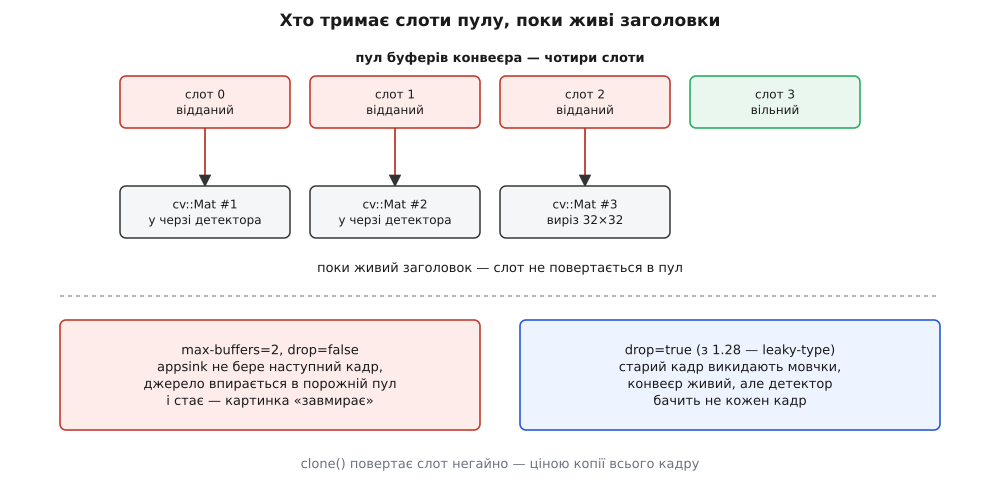

# ⚙️ Міст appsink → cv::Mat, яким кадр не копіюється

Тут три робочі версії однієї функції — узяти кадр із конвеєра GStreamer і віддати його решті програми як `cv::Mat`. Різняться вони одним-єдиним питанням: хто відповідає за те, щоб пікселі не зникли з-під заголовка. Саме через цю відповідальність перша версія коштує повну копію кадру, друга не коштує нічого, але замикає всю обробку в одному виклику, а третя не копіює нічого й водночас дозволяє покласти кадр у чергу до сусіднього потоку.

## Задача, у якій усе вирішує час життя

Конвеєр звичайний: камера, декодер, [appsink](topic:media-vision/appsink-appsrc) на виході. Формат BGR 1920×1080, тридцять кадрів за секунду. Далі — детектор в окремому потоці: цикл захоплення кладе кадри в чергу, потік детектора їх забирає й обробляє. Вимога до мосту рівно одна: `cv::Mat`, який дістався споживачеві, мусить лишатися чинним доти, доки споживач із ним не закінчить.

Ціна найпростішого розв'язку рахується в лоб:

```
кадр BGR 1920×1080  = 1920 · 1080 · 3        = 6 220 800 Б ≈ 6.22 МБ
копія = прочитати + записати                 ≈ 12.44 МБ трафіку шини на кадр
при 30 к/с          = 12.44 · 30             ≈ 373 МБ/с
при 60 к/с          = 12.44 · 60             ≈ 746 МБ/с
```

На настільному процесорі з пропускною здатністю пам'яті в десятки гігабайтів за секунду ці 373 МБ/с — кілька відсотків смуги, і про них можна не думати. На одноплатнику, де процесор ділить одну шину з відеоядром, це вже помітна частка всього, що машина встигає зробити з пам'яттю. Тому нижче й будуються три версії: не тому, що остання «правильна», а тому, що кожна купує свою властивість за свою ціну.

## Спільне: розкладка кадру береться з caps, а не з голови

Перш ніж будувати заголовок над чужими байтами, треба знати три числа: висоту, ширину й **крок рядка**. Перші два ще можна припустити з налаштувань конвеєра, третє — ні. Крок їде разом із кадром, і бере його звідти `GstVideoInfo`, розібраний із [узгоджених caps](topic:media-vision/caps-negotiation).

```cpp
// gstcvbridge.hpp — спільне для всіх трьох версій
#include <gst/gst.h>
#include <gst/app/gstappsink.h>
#include <gst/video/video.h>
#include <opencv2/core.hpp>
#include <opencv2/imgproc.hpp>
#include <memory>

// Формати, які лягають у cv::Mat без жодного перетворення.
static int cvTypeForVideo(GstVideoFormat fmt)
{
    switch (fmt) {
        case GST_VIDEO_FORMAT_BGR:       return CV_8UC3;
        case GST_VIDEO_FORMAT_RGB:       return CV_8UC3;  // ⚠ канали переставлені
        case GST_VIDEO_FORMAT_BGRA:
        case GST_VIDEO_FORMAT_BGRx:      return CV_8UC4;
        case GST_VIDEO_FORMAT_GRAY8:     return CV_8UC1;
        case GST_VIDEO_FORMAT_GRAY16_LE: return CV_16UC1;
        default:                         return -1;       // NV12, I420, YUY2 — окрема розмова
    }
}

struct FrameFormat {
    GstVideoInfo info;
    GstCaps*     caps   = nullptr;   // caps, для яких пораховано info
    int          cvType = -1;

    FrameFormat()  { gst_video_info_init(&info); }
    ~FrameFormat() { gst_caps_replace(&caps, nullptr); }
};

// Розбирає caps лише тоді, коли вони справді змінилися.
static bool refreshFormat(FrameFormat& ff, GstCaps* caps)
{
    if (ff.caps && gst_caps_is_equal(caps, ff.caps))
        return ff.cvType >= 0;
    if (!gst_video_info_from_caps(&ff.info, caps))
        return false;
    ff.cvType = cvTypeForVideo(GST_VIDEO_INFO_FORMAT(&ff.info));
    gst_caps_replace(&ff.caps, caps);   // тепер тримаємо власне посилання
    return ff.cvType >= 0;
}
```

Розбирати caps на кожному кадрі немає жодної причини: між кадрами вони майже завжди ті самі, а `gst_caps_is_equal` першою дією порівнює вказівники — і appsink зазвичай віддає той самий об'єкт. Тож у сталому режимі вся ця функція — одне порівняння двох адрес.

Конвеєр, з яким працюють усі три версії:

```
… ! videoconvert ! video/x-raw,format=BGR !
    appsink name=sink sync=false max-buffers=2 drop=true
```

Один рядок тут вартий окремої чесності. `videoconvert` перед `appsink` — це повне перетворення кадру, тобто прохід по всіх шести мегабайтах. Апаратні декодери віддають NV12, і якщо ви ставите `videoconvert`, щоб отримати BGR, то економія на копії в мосту вже втоплена в конвертері вище. Версія з алокатором окупається там, де джерело **вже** дає придатний формат: GRAY8 з промислової камери, BGR із `v4l2src`, — або там, де NV12 беруть у `Mat` як є. Про останній випадок — наприкінці, він найцікавіший.

## Версія 1: чесна копія

Найпростіший міст: відобразити буфер, побудувати над ним заголовок, скопіювати пікселі до себе, відпустити все чуже.

```cpp
// Повертає false, коли потік скінчився або кадр не придатний.
bool pullFrameCopy(GstAppSink* sink, FrameFormat& ff, cv::Mat& out)
{
    GstSample* sample = gst_app_sink_pull_sample(sink);   // наш: transfer full
    if (!sample)
        return false;                                     // EOS або зупинка

    bool ok = false;
    GstBuffer* buf  = gst_sample_get_buffer(sample);      // позичений у зразка
    GstCaps*   caps = gst_sample_get_caps(sample);        // позичений у зразка
    GstMapInfo mi;

    if (buf && caps && refreshFormat(ff, caps) &&
        gst_buffer_map(buf, &mi, GST_MAP_READ))
    {
        const int    h      = GST_VIDEO_INFO_HEIGHT(&ff.info);
        const int    w      = GST_VIDEO_INFO_WIDTH(&ff.info);
        const size_t stride = (size_t) GST_VIDEO_INFO_PLANE_STRIDE(&ff.info, 0);

        if (mi.size >= stride * (size_t) h) {
            cv::Mat view(h, w, ff.cvType, mi.data, stride);  // заголовок без володіння
            view.copyTo(out);                                 // ← єдина копія
            ok = true;
        }
        gst_buffer_unmap(buf, &mi);
    }
    gst_sample_unref(sample);
    return ok;
}
```

Три речі варті погляду.

**`copyTo(out)`, а не `clone()`.** Обидва дають незалежні пікселі, але `clone` щоразу виділяє новий блок, а `copyTo` спершу питає приймача, чи його буфер уже підходить за розміром і типом, і мовчки пише в наявний. У циклі по кадрах різниця — шість мегабайтів виділення й звільнення тридцять разів на секунду проти жодного виділення після першого кадру. Тому `out` і приходить параметром іззовні: він мусить пережити ітерацію.

**Перевірка `mi.size`.** Це не перестраховка. Розмір буфера й розкладка з caps приходять різними шляхами, і на зіпсованому потоці чи неправильно оголошених caps вони розходяться. Заголовок над буфером, коротшим за `stride · h`, — це готове читання за межами, яке ASan упіймає, а робочий конвеєр — ні.

**`gst_buffer_unmap` і `gst_sample_unref` є на кожному шляху виходу.** Забутий `unmap` не дає буферові повернутися в пул, і за кілька секунд джерело стане, бо йому нема куди писати; забутий `unref` — це шість мегабайтів на кадр, які не подінуться нікуди.

Після повернення з цієї функції `out` — звичайний `Mat` із власною пам'яттю: його можна класти в чергу, тримати годинами й передавати куди завгодно. Це чесна ціна за спокій, і в більшості завдань її варто заплатити не задумуючись.

## Версія 2: обробка всередині відображення

Копію можна прибрати цілком, якщо погодитися на обмеження: кадр не залишає меж виклику. Обробили тут-таки, віддали назовні результат — гістограму, маску, координати, — і чужі байти більше нікого не цікавлять.

Головна небезпека тут — забути `unmap` на якомусь із шляхів виходу, надто коли всередині може полетіти виняток. У C цю дисципліну тримають драбинкою `goto`, у C++ її тримає тип, чий знищувач і є `unmap` — звичайний [RAII](topic:programming/raii):

```cpp
// Відображення живе рівно стільки, скільки живе цей об'єкт.
class MappedFrame {
public:
    MappedFrame(GstBuffer* buf, const FrameFormat& ff) : buf_(buf)
    {
        if (!gst_buffer_map(buf_, &mi_, GST_MAP_READ))
            return;
        mapped_ = true;

        const size_t stride = (size_t) GST_VIDEO_INFO_PLANE_STRIDE(&ff.info, 0);
        const int    h      = GST_VIDEO_INFO_HEIGHT(&ff.info);
        if (mi_.size >= stride * (size_t) h)
            mat_ = cv::Mat(h, GST_VIDEO_INFO_WIDTH(&ff.info), ff.cvType, mi_.data, stride);
    }
    ~MappedFrame() { if (mapped_) gst_buffer_unmap(buf_, &mi_); }

    MappedFrame(const MappedFrame&)            = delete;   // відображення не копіюють
    MappedFrame& operator=(const MappedFrame&) = delete;

    bool           ok()  const { return mapped_ && !mat_.empty(); }
    const cv::Mat& mat() const { return mat_; }            // ПОСИЛАННЯ, не копія

private:
    GstBuffer* buf_    = nullptr;
    GstMapInfo mi_{};
    bool       mapped_ = false;
    cv::Mat    mat_;
};

struct SampleDeleter { void operator()(GstSample* s) const { gst_sample_unref(s); } };
using SamplePtr = std::unique_ptr<GstSample, SampleDeleter>;

bool processOneFrame(GstAppSink* sink, FrameFormat& ff)
{
    SamplePtr sample(gst_app_sink_pull_sample(sink));
    if (!sample)
        return false;

    GstBuffer* buf  = gst_sample_get_buffer(sample.get());
    GstCaps*   caps = gst_sample_get_caps(sample.get());
    if (!buf || !caps || !refreshFormat(ff, caps))
        return true;                       // кадр пропускаємо, цикл живе далі

    MappedFrame frame(buf, ff);
    if (frame.ok())
        detect(frame.mat());               // уся робота — тут і тільки тут

    return true;                           // ~MappedFrame → unmap; ~SamplePtr → unref
}
```

Копій нуль, дисципліна тримається сама. Але сказати треба чесно: `mat()` віддає посилання лише для того, щоб не спокушати, а не для того, щоб заборонити. Один рядок `cv::Mat kept = frame.mat();` усередині `detect` — і заголовок утік за межі відображення, бо копіювання заголовка коштує кілька присвоєнь і жодна перевірка часу компіляції його не помітить. Мова тут не рятує; рятує лише те, що кадр справді нікуди не треба відкладати.

Щойно з'являється черга — «захопили кадр, поклали, взяли наступний» — версія 2 не годиться за побудовою, і питання володіння повертається.

## Версія 3: власний алокатор, який тримає зразок

Потрібне таке: заголовок, який **сам** відпускає буфер конвеєра, коли зникає останній його власник. Це рівно те, що `Mat` уміє робити зі своєю пам'яттю, — треба лише підставити в механізм звільнення свою процедуру. Механізм відкритий: `cv::MatAllocator` — віртуальний інтерфейс, а `UMatData` несе прапорець, який каже «дані не мої, стандартним способом їх не звільняти».

### Ланцюг звільнення: куди саме вбудовується наш код

Перш ніж писати алокатор, треба точно знати, кого й у якому порядку кличе `release()`. Ланцюг у OpenCV 4.x такий:



*Наш код стоїть в останній ланці; усе, що вище, — готова машинерія OpenCV, і саме вона вирішує, коли цю ланку смикнути.*

Дві ланки посередині — джерело найпоширенішої помилки в саморобних алокаторах, тож випишімо їх дослівно з `modules/core/src/matrix.cpp`:

```cpp
void Mat::deallocate()
{
    if(u)
    {
        UMatData* u_ = u;
        u = NULL;
        (u_->currAllocator ? u_->currAllocator : allocator ?
         allocator : getDefaultAllocator())->unmap(u_);
    }
}

void MatAllocator::unmap(UMatData* u) const
{
    if(u->urefcount == 0 && u->refcount == 0)
    {
        deallocate(u);
    }
}
```

Читається це так: `Mat::deallocate` кличе **`unmap`**, а не `deallocate` алокатора. Базова реалізація `unmap` звіряє обидва лічильники й уже сама кличе `deallocate`. Отже, перевизначати треба `deallocate` і **не чіпати** `unmap` — інакше ланцюг обірветься на порожньому місці, і ваш звільняльник просто ніколи не викличеться. І друге: вибір алокатора йде через `u->currAllocator`, тобто через того, кого записали в `UMatData` при створенні, а не через поле `Mat::allocator`.

### Алокатор

```cpp
// Усе, що мусить пережити кадр і померти разом із ним.
struct MappedSample {
    GstSample* sample = nullptr;   // НАШЕ посилання на зразок
    GstBuffer* buffer = nullptr;   // позичений у зразка
    GstMapInfo map{};
};

class GstMatAllocator final : public cv::MatAllocator
{
public:
    // Цей перевантажений allocate ми кличемо самі, передавши відображені байти.
    cv::UMatData* allocate(int dims, const int* sizes, int type,
                           void* data0, size_t* step,
                           cv::AccessFlag, cv::UMatUsageFlags) const override
    {
        CV_Assert(data0 != nullptr);        // ми загортаємо чуже, а не виділяємо своє

        size_t total = CV_ELEM_SIZE(type);
        for (int i = dims - 1; i >= 0; --i) {
            if (step) {
                if (step[i] != CV_AUTOSTEP) { CV_Assert(total <= step[i]); total = step[i]; }
                else                        { step[i] = total; }
            }
            total *= sizes[i];
        }

        cv::UMatData* u = new cv::UMatData(this);   // → currAllocator = this, refcount = 0
        u->data = u->origdata = static_cast<uchar*>(data0);
        u->size = total;
        u->flags |= cv::UMatData::USER_ALLOCATED;   // ← без цього буде fastFree чужого вказівника
        return u;
    }

    bool allocate(cv::UMatData* u, cv::AccessFlag, cv::UMatUsageFlags) const override
    {
        return u != nullptr;                        // шлях UMat нам не потрібен
    }

    void deallocate(cv::UMatData* u) const override
    {
        if (!u) return;
        CV_Assert(u->urefcount == 0 && u->refcount == 0);

        auto* hold = static_cast<MappedSample*>(u->userdata);
        if (hold) {
            gst_buffer_unmap(hold->buffer, &hold->map);   // спершу закрити відображення…
            gst_sample_unref(hold->sample);               // …і аж потім відпустити зразок
            delete hold;
        }
        delete u;                                          // fastFree не кличемо — пам'ять чужа
    }
};

// Алокатор без стану — отже, один на процес.
static const GstMatAllocator& gstAllocator()
{
    static const GstMatAllocator instance;
    return instance;
}
```

Чотири рішення тут неочевидні, і кожне має причину.

**Прапорець `USER_ALLOCATED` обов'язковий.** Він потрібен не нашому коду — наш і так нічого не звільняє, — а всім іншим шляхам, якими цей `UMatData` може пройти. Стандартна процедура звільнення дивиться саме на нього:

```cpp
if( !(u->flags & UMatData::USER_ALLOCATED) )
{
    fastFree(u->origdata);
    u->origdata = 0;
}
```

Без прапорця `fastFree` дістане вказівник, якого `fastMalloc` ніколи не видавав, і спробує прочитати службове поле перед ним — тобто зіпсує байти конвеєра й порушить купу. Падіння станеться далеко звідси й на іншому кадрі.

**Порядок `unmap` → `unref` не переставляється.** Буфер живий, доки живий зразок, який тримає на нього посилання. Відпустили зразок першим — і `gst_buffer_unmap` дістає вже мертвий об'єкт.

**Обидва `allocate` оголошені `const`, тож алокатор не має стану.** Це не примха OpenCV: та сама сигнатура викликається з різних потоків, і алокатор із мутабельним полем «поточний кадр» розсипався б на другому потоці. Стан кадру живе там, де йому й місце, — у `UMatData`, по одному примірнику на кадр. Поле `userdata` — це просто `void*`, і знищувач `UMatData` його не чіпає, тож звільнити `MappedSample` мусимо ми самі.

**Сигнатури прив'язані до версії.** У гілці 4.x параметр доступу має тип `cv::AccessFlag`, у 3.4 на його місці стоїть звичайний `int`. Розбіжність у типі не дає жодного натяку на помилку — `override` просто не збереться, бо це вже інша віртуальна функція.

### Складання заголовка

```cpp
// Забирає володіння зразком. Порожній Mat означає «кадр не придатний».
cv::Mat matFromSample(GstSample* sample, FrameFormat& ff)
{
    SamplePtr guard(sample);                     // поки що зразок наш
    GstCaps*   caps = gst_sample_get_caps(sample);
    GstBuffer* buf  = gst_sample_get_buffer(sample);
    if (!caps || !buf || !refreshFormat(ff, caps))
        return {};

    auto hold = std::make_unique<MappedSample>();
    if (!gst_buffer_map(buf, &hold->map, GST_MAP_READ))
        return {};

    const int    h      = GST_VIDEO_INFO_HEIGHT(&ff.info);
    const int    w      = GST_VIDEO_INFO_WIDTH(&ff.info);
    const size_t stride = (size_t) GST_VIDEO_INFO_PLANE_STRIDE(&ff.info, 0);
    if (hold->map.size < stride * (size_t) h) {
        gst_buffer_unmap(buf, &hold->map);
        return {};
    }

    cv::Mat m(h, w, ff.cvType, hold->map.data, stride);   // заголовок без володіння…

    int    sizes[2] = { h, w };
    size_t steps[2] = { stride, CV_ELEM_SIZE(ff.cvType) };
    m.u = gstAllocator().allocate(2, sizes, ff.cvType, hold->map.data, steps,
                                  cv::ACCESS_RW, cv::USAGE_DEFAULT);

    hold->sample  = guard.release();   // з цієї миті зразок належить кадрові
    hold->buffer  = buf;
    m.u->userdata = hold.release();
    m.addref();                        // refcount 0 → 1: цей заголовок — перший власник

    return m;                          // …і ось він уже володіє: копіюйте, кладіть у чергу
}
```

Порядок останніх чотирьох рядків — не стиль, а безпека. Доки не заповнено `userdata`, зразок тримає `guard`, і будь-яке дострокове повернення відпустить його як слід. Щойно `userdata` заповнено — відповідальність перейшла до `UMatData`, і `guard` мусить розтиснутися **перед** цим, а не після.

`m.addref()` переводить лічильник із нуля в одиницю, бо конструктор `UMatData` ставить обидва лічильники в нуль, а заголовок у нас уже є. Далі все як завжди: копія `Mat` дає двійку, знищення — назад одиницю, а останній `release()` пройде весь ланцюг із малюнка вище й поверне слот конвеєрові.

**Поле `m.allocator` навмисно лишається порожнім.** Спокуса його заповнити «для симетрії» велика, а наслідок неприємний: `Mat::create` бере алокатор саме з цього поля й кличе `allocate` з `data0 == nullptr`, коли `Mat` треба перевиділити під новий розмір. Наш `allocate` такого не вміє — і не мусить, бо загортати нема чого. Тож `CV_Assert(data0 != nullptr)` там стоїть як сторож: він перетворює тиху безглуздість на голосну помилку в тому самому рядку, де її зробили. Загальні правила таких алокаторів — у темі про [власні алокатори](topic:cpp-standards/custom-allocators).

> 🔧 **Навіщо це.** Отриманий `Mat` поводиться як звичайний: його можна покласти у `std::deque`, віддати в інший потік, зробити з нього виріз. Різниця лише в тому, що останній із цих заголовків, помираючи, поверне слот у пул конвеєра. Ніхто зі споживачів не мусить знати, що всередині GStreamer, — і саме це робить міст придатним для великої програми, а не лише для демонстрації.

Що при цьому роблять `clone()` і виріз, варто сказати окремо, бо поведінка різна. `clone()` створює порожній `Mat`, у якого поле `allocator` нульове, тож `create` всередині нього піде до стандартного алокатора — і копія виходить із конвеєра назовсім. А от [виріз](topic:media-vision/mat-views-no-copy) посилається на той самий `UMatData`, тобто маленький прямокутник 32×32 тримає в оренді цілий кадр і разом із ним слот пулу.

## Пастки

### Заголовок, що пережив unmap

Найдорожча помилка в цій темі виглядає невинно й трапляється у версіях 1 і 2:

```cpp
// ✗ так не можна
cv::Mat grab(GstAppSink* sink, FrameFormat& ff) {
    SamplePtr sample(gst_app_sink_pull_sample(sink));
    GstBuffer* buf = gst_sample_get_buffer(sample.get());
    GstMapInfo mi;
    gst_buffer_map(buf, &mi, GST_MAP_READ);

    cv::Mat frame(1080, 1920, CV_8UC3, mi.data);   // заголовок нічого не тримає

    gst_buffer_unmap(buf, &mi);
    return frame;                                   // ← вказівник уже висячий
}
```

Компілятор мовчить, бо з погляду типів усе гаразд. Найгірше те, що воно **працює**. Кадр із системної пам'яті нікуди не подівся: сторінки на місці, читання не спричиняє жодного сигналу. Просто буфер повернувся в пул, пул віддав його джерелу, і джерело записало туди наступний кадр. Ви читаєте справжні пікселі — просто не ті. У продукті це виглядає як «детектор раз на кілька секунд бачить те, чого не було», і шукають таке тижнями. Це звичайне [звернення після звільнення](topic:cpp-standards/dangling-references), лише заховане за типом, який зазвичай усе робить сам.

Іронія в тому, що кадр з апаратного джерела поводиться милосердніше: на `unmap` відображення знімають, сторінки зникають з адресного простору, і та сама помилка дає негайне падіння з чіткою адресою. Найнеприємніший варіант — коли код працює на платі й «дивно поводиться» на робочому столі.

### Крок рядка, порахований із ширини

Конструктор `cv::Mat(h, w, type, data)` без п'ятого аргумента бере `step = w · elemSize`. Для 1920 пікселів BGR це 5760 — і випадково збігається зі справжнім кроком. Для іншої ширини не збігається:

```
GStreamer укладає рядок пакованого RGB так:
    stride = GST_ROUND_UP_4(width · 3)

ширина 1366:  1366 · 3 = 4098  →  ROUND_UP_4  =  4100
Mat порахував:                                    4098
розбіжність на рядок                            =    2 байти
на 100-му рядку зсув                = 100 · 2   =  200 байтів ≈ 66 пікселів
```

Картинка не падає й не б'ється — вона **скошується**, наростаючим зсувом до низу кадру. Тому крок береться з `GST_VIDEO_INFO_PLANE_STRIDE`, і тільки звідти. Дрібниця на майбутнє: OpenCV вимагає, щоб крок ділився на розмір одного каналу, і конструктор це перевіряє — для `CV_16UC1` з непарним кроком ви отримаєте виняток, а не тиху скісну картинку.

Ще точніший шлях — `gst_video_frame_map` замість `gst_buffer_map`: він бере крок із метаданих самого кадру, а не з caps, і не зливає площини в один блок. Коли кадр приходить від апаратного джерела або має власний `GstVideoMeta`, правильний саме він — про це докладно в темі про [буфери й пам'ять GStreamer](topic:media-vision/buffers-and-memory).

### NV12 під виглядом CV_8UC3

`Mat` не перевіряє формат — він вірить типу, який ви назвали. Заголовок `CV_8UC3` над буфером NV12 не дасть ані помилки, ані картинки: розміри «зійдуться» за арифметикою, а вміст буде сміттям, бо в NV12 [пікселі розкладені інакше](topic:algorithms/pixel-formats) — спершу вся площина яскравості, під нею вдвічі нижча площина кольору з переплетеними U та V.

Правильний спосіб взяти NV12 у `Mat` є, і копії він теж не потребує:

```cpp
const int    h  = GST_VIDEO_INFO_HEIGHT(&ff.info);
const int    w  = GST_VIDEO_INFO_WIDTH(&ff.info);
const size_t sy = (size_t) GST_VIDEO_INFO_PLANE_STRIDE(&ff.info, 0);

// Обидві умови мусять справдитися, інакше суцільного заголовка не буде:
CV_Assert(sy == (size_t) GST_VIDEO_INFO_PLANE_STRIDE(&ff.info, 1));   // кроки рівні
CV_Assert(GST_VIDEO_INFO_PLANE_OFFSET(&ff.info, 1) == sy * (size_t) h); // площини стикаються

cv::Mat nv12(h + h / 2, w, CV_8UC1, mi.data, sy);      // Y, а під ним UV
cv::cvtColor(nv12, bgr, cv::COLOR_YUV2BGR_NV12);        // ось тут і буде копія
```

Друга умова справджується не завжди: зміщення другої площини GStreamer рахує як `stride · GST_ROUND_UP_2(height)`, тож на непарній висоті між площинами з'являється зайвий рядок, і суцільний заголовок над обома площинами стає неправильним. Перевірка вартує двох порівнянь на зміну caps.

А тепер найкорисніший наслідок, заради якого це все й писалося. Детектори здебільшого працюють по яскравості, а площина Y у NV12 — це і є готове зображення у відтінках сірого. Отже:

```cpp
cv::Mat gray(h, w, CV_8UC1, mi.data, sy);   // площина Y як є: жодного перетворення
```

Ніякого `videoconvert`, ніякого `cvtColor`, ніякої копії — кадр із апаратного декодера потрапляє в обробку таким, яким вийшов. Разом із алокатором із версії 3 це і є справжній нуль копій від декодера до детектора. Які формати віддають різні джерела й що з ними ще можна зробити без перетворення — [стик із відеоконвеєром](topic:media-vision/frame-interop).

### Оренда пулу: чому конвеєр стає

Третя версія має ціну, і вона не в байтах, а в часі. Кадри конвеєра лежать не в купі, а в **пулі**: джерело чи декодер виділяє наперед кілька буферів і крутить їх по колу. Поки живий бодай один `Mat` над буфером, слот у пул не повертається.



*Черга кадрів у застосунку — це орендовані слоти конвеєра, і орендна плата стягується не пам'яттю, а зупинкою джерела.*

Порахуймо, скільки тут запасу:

```
пул декодера (типово)          = 4…16 буферів
черга детектора                = 8 кадрів
30 к/с → один кадр             = 33 мс
8 кадрів утримання             = 8 · 33 ≈ 266 мс оренди
```

Якщо пул на чотири буфери, а черга на вісім, конвеєр стане назавжди на п'ятому кадрі — не «сповільниться», а саме стане, бо джерелу нема куди писати. Захист тут двоступеневий і налаштовується властивостями самого appsink:

- `max-buffers` обмежує чергу всередині appsink; за замовчуванням він **нульовий**, тобто без обмеження — на живому джерелі це найкоротший шлях до з'їденої пам'яті;
- `drop=true` дозволяє викидати старі кадри замість того, щоб чекати. Від версії 1.28 цю властивість вважають застарілою — її замінює `leaky-type`, яка ще й дає обрати, кого викидати;
- `max-bytes` і `max-time` (з версії 1.24) обмежують ту саму чергу байтами й тривалістю.

Вибір між «стати» й «викинути кадр» — це вибір між затримкою й повнотою, тобто той самий [протитиск](topic:algorithms/backpressure), лише виражений двома властивостями елемента. А в коді правило просте: черга утримуваних кадрів мусить бути **коротшою за пул**, і будь-яке довге зберігання — у сховищі, у списку шаблонів, у знімку для налагодження — робиться через `clone()`, який повертає слот негайно.

Остання дрібниця про потоки. `deallocate` викличеться з того потоку, який останнім знищив свій `Mat`, — а це майже напевно не потік захоплення. Самі виклики GStreamer до цього готові, їхні лічильники атомарні; неготовим може виявитися ваш код, якщо `MappedSample` тягне за собою щось спільне без замка. Тримайте в ньому лише зразок, буфер і `GstMapInfo` — тоді питання [потокової безпеки](topic:programming/thread-safety) просто не виникає.

## Скільки це коштує і що обирати

| версія | копій на кадр | де може жити `Mat` | що ламається при помилці |
|---|---|---|---|
| `copyTo` | 1 (≈12.4 МБ трафіку) | будь-де й скільки завгодно | нічого |
| між `map` і `unmap` | 0 | лише в тілі виклику | висячий вказівник |
| власний алокатор | 0 | будь-де, але тримає слот пулу | зупинка конвеєра |

Накладні витрати третьої версії — два дрібні виділення на кадр (`UMatData` і `MappedSample`, разом менш як сотня байтів) плюс кілька атомарних операцій із лічильником. Проти 12.4 МБ трафіку шини це різниця в п'ять порядків, і саме тому механізм вартий тих сорока рядків коду.

Але порядок вибору зворотний до порядку викладу. Спершу питайте, скільки кадр мусить жити: якщо в межах одного виклику — беріть другу версію, вона найпростіша й нічого не орендує. Якщо кадр іде в чергу, а джерело файлове або мережеве й запас часу є — беріть першу, копія купує повну незалежність від конвеєра. Третя потрібна там, де збігається все одразу: кадр мусить пережити виклик, джерело живе, а пропускна здатність пам'яті вже стала вузьким місцем. Тоді — і лише тоді — варто платити не байтами, а уважністю до чужого пулу.
