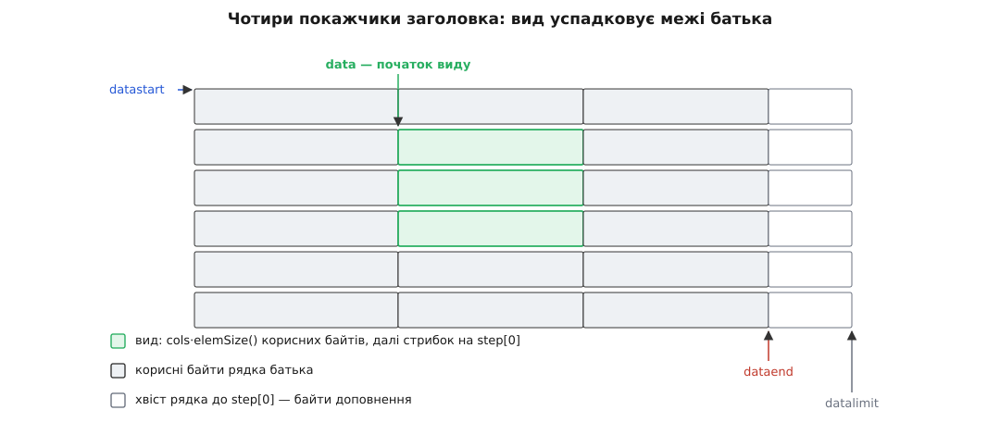
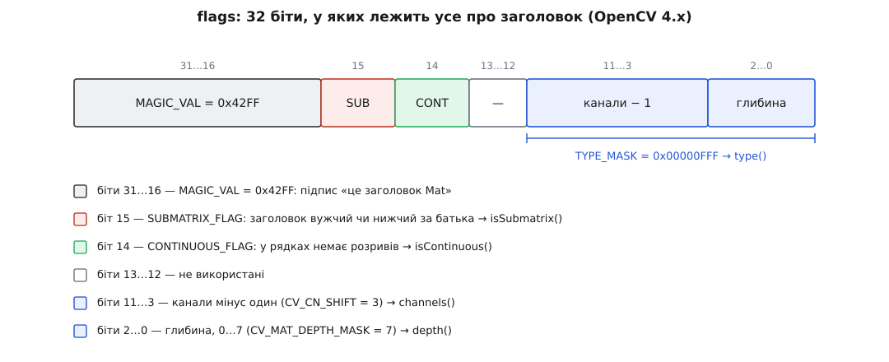

# 📋 Довідка: що в `cv::Mat` віддає вид, а що копію

Це перелік для звіряння: біля кожного виклику сказано, чи повертає він заголовок над уже наявними пікселями, чи виділяє новий блок, кому після цього належать байти й чи можна по результату бігти лінійно. Тримати такі подробиці в голові марно — їх звіряють, тому тут таблиці й сигнатури, а не розповідь.

Усе звірено з гілкою `4.x` OpenCV (`modules/core`: `mat.hpp`, `mat.inl.hpp`, `matrix.cpp`, `matrix_wrap.cpp`, `copy.cpp`). Де гілка `5.x` уже інша, сказано окремо.

<preknowlist>
- [cv::Mat: пам'ять і володіння](book:media-vision/mat-memory-model) — заголовок і блок пікселів живуть окремо, блок захищено лічильником посилань.
- [Зображення як дані](book:algorithms/image-as-data) — крок рядка й чому він буває більший за ширину.
- [Адреси й покажчики](book:programming/addresses-pointers) — арифметика над адресою байта.
</preknowlist>

## Три колонки, які повторюються всюди

**Що в результаті.**

| позначка | значення |
|---|---|
| **вид** | новий заголовок над ТИМИ САМИМИ байтами; ціна — кілька десятків байтів у стеку |
| **копія** | новий блок пам'яті й перенесення байтів; ціна пропорційна розміру |
| **за приймачем** | вирішує `create()` на приймачі: розмір і тип збіглися → запис у наявний буфер, розбіжність → новий блок |

**Володіння.**

| позначка | що в полі `u` | наслідок |
|---|---|---|
| **власне** | свій `UMatData`, `refcount == 1` | звичайний `cv::Mat`, звільнить себе сам |
| **спільне** | `u` батька, лічильник збільшено | блок живий, поки живий останній заголовок |
| **немає** | `u == nullptr` | час життя байтів визначає хтось інший; деструктор не звільнить нічого |

**Суцільність** — це відповідь на одне питання: чи `step[0] == cols · elemSize()`. Готова відповідь лежить у прапорці `isContinuous()`, і питати треба саме його, а не порівнювати числа руками: прапорець рахують за всіма вимірами, не лише за двома.

## Поля заголовка

| поле | тип | що в ньому |
|---|---|---|
| `flags` | `int` | глибина, кількість каналів і два прапорці — розкладка нижче |
| `dims` | `int` | скільки вимірів; для зображення — 2 |
| `rows`, `cols` | `int` | висота й ширина в пікселях; при `dims > 2` обидва дорівнюють −1 |
| `data` | `uchar*` | перший байт **цього** заголовка, не обов'язково блоку |
| `datastart` | `const uchar*` | перший байт усього блоку |
| `dataend` | `const uchar*` | кінець корисних байтів останнього рядка блоку |
| `datalimit` | `const uchar*` | кінець блоку разом із хвостом останнього рядка |
| `u` | `UMatData*` | службовий блок із лічильником; `nullptr` — володіння немає |
| `allocator` | `MatAllocator*` | нетиповий розподілювач або `nullptr` |
| `size` | `MatSize` | `size[i]` — розмір i-го виміру; `size()` віддає `Size(cols, rows)` |
| `step` | `MatStep` | `step[i]` — байтів на один крок по i-му вимірі |

Три покажчики-межі заповнює службова `finalizeHdr` при виділенні блоку:

```
datalimit = datastart + size[0] · step[0]              // з хвостом останнього рядка
dataend   = data + (rows − 1) · step[0] + cols · step[1]   // без хвоста
```



*`data` показує на початок виду, а `datastart`, `dataend` і `datalimit` вид успадковує від батька без змін — саме з цієї різниці `locateROI` відновлює, звідки вид вирізали.*

Дві дрібниці, на яких спотикаються:

- `elemSize()` нічого не обчислює з типу — він повертає `step[dims−1]`, тобто для двовимірної матриці буквально `step[1]`. Звідси й наслідок: заголовка з «переставленими» кроками в OpenCV не буває, бо крок по стовпцях за визначенням і є розмір елемента. Тому транспонування — завжди новий блок, а не вид.
- `step` перетворюється на число неявно (`m.step` дає `step[0]`), але лише поки `dims ≤ 2`; для багатовимірної матриці таке перетворення в збірці з перевірками спіймає `CV_DbgAssert`, а в звичайній тихо віддасть не те. Пиши `step[0]` явно.

## Біти `flags`



*Тип і обидва прапорці — це один `int`, тому «який тип» і «чи суцільний» коштують однаково: перевірки біта.*

```
enum { MAGIC_VAL  = 0x42FF0000, AUTO_STEP = 0,
       CONTINUOUS_FLAG = 1 << 14, SUBMATRIX_FLAG = 1 << 15 };
enum { MAGIC_MASK = 0xFFFF0000, TYPE_MASK = 0x00000FFF, DEPTH_MASK = 7 };
```

| виклик | як рахується | що віддає |
|---|---|---|
| `type()` | `flags & TYPE_MASK` | глибина разом із каналами: `CV_8UC3` тощо |
| `depth()` | `flags & DEPTH_MASK` | `CV_8U`=0, `CV_8S`=1, `CV_16U`=2, `CV_16S`=3, `CV_32S`=4, `CV_32F`=5, `CV_64F`=6, `CV_16F`=7 |
| `channels()` | `((flags & CN_MASK) >> 3) + 1` | від 1 до 512 |
| `isContinuous()` | `flags & CONTINUOUS_FLAG` | чи немає розривів між рядками |
| `isSubmatrix()` | `flags & SUBMATRIX_FLAG` | чи заголовок вужчий або нижчий за батька |

Реальні значення, які видно в налагоджувачі (усі — `CV_8UC3`, тобто `0x10`):

```
кадр 1920×1080, власний блок, рядки щільні   flags = 0x42FF4010   CONT
ROI 64×64 з нього                            flags = 0x42FF8010   SUBMAT
rowRange(0, 64) того самого кадру            flags = 0x42FFC010   CONT | SUBMAT
заголовок над буфером конвеєра, step = 4160  flags = 0x42FF0010   ані того, ані того
```

Останній рядок і є доказ, що обидва прапорці незалежні: буфер із доповненими рядками не суцільний, хоча підматрицею не є.

> 🔧 **Навіщо це.** `isSubmatrix()` не відповідає на питання «чи безпечно бігти лінійно» — на нього відповідає `isContinuous()`. Не плутай: підматриця може бути суцільною (`rowRange` суцільного батька), а не-підматриця може бути несуцільною (заголовок над вирівняним буфером).

**Версійна межа.** У `5.x` під глибину віддали п'ять бітів замість трьох (`CV_CN_SHIFT` став 5, `CV_CN_MAX` — 128), бо додалися типи `CV_16BF`, `CV_Bool`, `CV_64U`, `CV_64S`, `CV_32U`. `TYPE_MASK` лишився `0x00000FFF`, біти 14 і 15 — на місці, тож розкладка на малюнку чинна для обох гілок, а от межа між «глибиною» й «каналами» всередині цих дванадцяти бітів поїхала. Код, який виколупує канали власним зсувом на 3, у `5.x` мовчки бреше — тому й існують `channels()` та `depth()`.

## Запити про геометрію

| виклик | тип | що віддає |
|---|---|---|
| `rows`, `cols` | `int` | висота й ширина в пікселях |
| `size()` | `Size` | `Size(cols, rows)` — спершу ширина! |
| `size[i]` | `int` | розмір i-го виміру: `size[0]` — рядки, `size[1]` — стовпці |
| `total()` | `size_t` | скільки елементів у матриці; канали **не** враховуються |
| `total(a, b)` | `size_t` | добуток розмірів вимірів від `a` до `b` |
| `elemSize()` | `size_t` | байтів на елемент разом із каналами |
| `elemSize1()` | `size_t` | байтів на одне значення каналу |
| `step[0]`, `step[1]` | `size_t` | крок рядка й крок елемента в байтах |
| `step1(i)` | `size_t` | той самий крок, але в значеннях каналу, а не в байтах |

```
адреса пікселя (y, x) = data + y·step[0] + x·elemSize()
ptr<T>(y)             = (T*)(data + y·step[0])
elemSize()            = channels() · elemSize1()   (і водночас == step[1])
step1(i)              = step[i] / elemSize1()
корисних байтів у рядку = cols · elemSize()
```

Пастка тут одна, зате постійна: `total() · elemSize()` дорівнює розміру даних **лише для суцільного заголовка**. Для виду це число менше за відстань від `data` до останнього байта, і цикл на стільки байтів прочитає чужі рядки замість своїх.

## Конструктори над чужими даними

```cpp
Mat(int rows, int cols, int type, void* data, size_t step = AUTO_STEP);
Mat(Size size, int type, void* data, size_t step = AUTO_STEP);
Mat(int ndims, const int* sizes, int type, void* data, const size_t* steps = 0);
Mat(const std::vector<int>& sizes, int type, void* data, const size_t* steps = 0);
```

| параметр | що подавати |
|---|---|
| `rows` | висота в рядках |
| `cols` | ширина **в пікселях**, не в байтах |
| `type` | `CV_8UC3`, `CV_16UC1`, … — має відповідати домовленому формату кадру |
| `data` | адреса першого байта площини (не структури-кадру!) |
| `step` | байтів від початку рядка до початку наступного — беруть із метаданих кадру |
| `steps` | для n-вимірного: `ndims−1` кроків; останній крок завжди `elemSize()` |

Що конструктор робить із цими числами — дослівно з `matrix.cpp`:

```
step == AUTO_STEP (тобто 0)     → step := cols · elemSize()
CV_Assert(step >= cols · elemSize())         // кидає виняток, не мовчить
step % elemSize1() != 0         → CV_Error(BadStep, "Step must be a multiple of esz1")
CV_Assert(total() == 0 || data != nullptr)

u = nullptr;  allocator = nullptr             // володіння немає
datastart = data
datalimit = data + step · rows
dataend   = datalimit − step + cols · elemSize()
CONTINUOUS_FLAG ⟺ step == cols · elemSize()
```

Перевірки покривають рівно два випадки з чотирьох можливих, і знати, які саме, важливіше за самі перевірки:

| ситуація | що станеться |
|---|---|
| `step` менший за `cols·elemSize()` | `CV_Assert` кине виняток одразу |
| `step` не кратний `elemSize1()` | `CV_Error(BadStep)` одразу |
| `step` **більший** за справжній крок буфера | ніхто не помітить: картинка поїде навскіс, останні рядки — за межею буфера |
| буфер коротший, ніж `step · rows` | ніхто не помітить: `Mat` не знає, скільки байтів має буфер насправді |

Дві останні рядки — головна причина, чому крок беруть із метаданих кадру, а не вгадують.

| пастка | що насправді |
|---|---|
| `Mat(cv::Size(w, h), …)` | `Size` — це (ширина, висота), тобто `rows = h`, `cols = w`; переставиш — вихід за буфер |
| перевантаження з `const void*` немає | над сторінкою, відображеною лише для читання, все одно вийде `uchar* data` без `const`, і компілятор не заперечить проти запису |
| NV12, I420, будь-який площинний формат | площини мають кожна свій крок, іноді й свій блок — потрібен окремий заголовок на кожну; докладно в темі [стику з відеоконвеєром](book:media-vision/frame-interop) |
| копія такого заголовка | успадковує `u == nullptr`, тобто теж нічого не тримає: збережений «останній кадр» стає [висячим покажчиком](book:cpp-standards/dangling-references) |

## Виклики, що повертають вид

| виклик | результат | володіння | суцільність | примітки |
|---|---|---|---|---|
| `Mat(rows, cols, type, void*, step)` | заголовок над чужим блоком | **немає** | ⟺ `step == cols·elemSize()` | час життя байтів цілком поза OpenCV |
| `Mat(Size, type, void*, step)` | те саме | немає | те саме | `Size(ширина, висота)` |
| `Mat(ndims, sizes, type, void*, steps)` | те саме, n-вимірний | немає | ⟺ кроки щільні | останній крок завжди `elemSize()` |
| `m(cv::Rect(x, y, w, h))` | вид `h × w` | спільне | лише якщо взято всю ширину суцільного батька | межі перевіряє `CV_Assert`; ставить `SUBMATRIX_FLAG`, якщо вужче або нижче за батька |
| `m(Range r, Range c)` | те саме | спільне | те саме | `Range` напіввідкритий: `[start, end)`; `Range::all()` — увесь вимір |
| `m(const Range* ranges)` | вид у n вимірах | спільне | рідко | так само для `std::vector<Range>` |
| `m.row(y)` | `1 × cols` | спільне | **завжди `true`** | у заголовку з одним рядком розриву нема де взятися, хай яким буде `step[0]` |
| `m.col(x)` | `rows × 1` | спільне | `false` при `rows > 1` | найдорожчий вид у користуванні: ціла кеш-лінія на кожен елемент |
| `m.rowRange(a, b)` | `(b−a) × cols` | спільне | `true`, якщо батько суцільний | `rowRange(Range)` — те саме |
| `m.colRange(a, b)` | `rows × (b−a)` | спільне | `false`, поки це не вся ширина суцільного батька | |
| `m.diag(d)` | `len × 1`, `step[0] += elemSize()` | спільне | `false` | `d > 0` — над головною діагоналлю, `d < 0` — під нею; довжина обрізається меншим виміром |
| `m.reshape(cn)` | вид з іншими `cols` і `step[1]` | спільне | як у джерела | працює й на несуцільному, поки `cols · channels()` ділиться на `cn` |
| `m.reshape(cn, newRows)` | вид | спільне | як у джерела | зміна кількості рядків вимагає `isContinuous()`, інакше `CV_Error(BadStep)` |
| `m.reshape(cn, ndims, sizes)` | вид у n вимірах | спільне | як у джерела | те саме обмеження на зміну форми |
| `Mat(m)`, `m2 = m` | той самий заголовок | спільне | як у джерела | звичайне присвоєння: лічильник +1, пікселі на місці |

Два рядки варті окремого слова, бо саме на них будують швидкий код.

**`row(y)` суцільний завжди.** Прапорець рахують за розмірами: у заголовка з одним рядком наступного рядка немає, отже й розриву немає. Це не хитрість реалізації, а дозвіл: по одному рядку виду законно бігти лінійно навіть тоді, коли сам вид — вузька смуга посеред кадру.

**`reshape(cn)` без зміни кількості рядків не потребує суцільності.** Він міняє тільки `cols` і `step[1]`, а `step[0]` лишає як був. Тому ROI `64×64` типу `CV_8UC3` цілком законно перетворюється на вид `64×192` типу `CV_8U` — і кожен його рядок далі починається через ті самі 5760 байтів. А от `reshape(1, 1)` на тому самому ROI кине `CV_Error(BadStep)`: злити рядки в один можна лише там, де між ними немає дірок.

## Виклики, що повертають копію

| виклик | результат | володіння | суцільність | примітки |
|---|---|---|---|---|
| `m.clone()` | новий блок | власне, `refcount == 1` | **гарантована** | ущільнює вид: `step[0]` стає `cols·elemSize()` |
| `m.copyTo(dst)` | за приймачем | за приймачем | за приймачем | всередині `dst.create(розмір, тип)` — і вся поведінка звідти |
| `m.copyTo(dst, mask)` | за приймачем | за приймачем | за приймачем | якщо приймач перевиділили, його спершу заповнюють нулями, щоб під маскою не лишилося сміття; наявний буфер не чіпають |
| `m.convertTo(dst, rtype, α, β)` | за приймачем | за приймачем | за приймачем | кількість каналів **зберігається**: з `rtype` беруть лише глибину; при тій самій глибині й `α = 1, β = 0` зводиться до `copyTo` |
| `m.t()` | `MatExpr` → копія | за приймачем | так | обчислення викликає `cv::transpose`, а той створює приймач із переставленими розмірами — для неквадратного виду це завжди новий блок |
| `Mat::diag(const Mat& d)` (статичний!) | нова квадратна матриця | власне | так | не плутати з методом `m.diag(d)`, який дає вид |
| `Mat::zeros/ones/eye` | `MatExpr` | за приймачем | за приймачем | присвоєння йде через `create()`, тому на ROI зі збігом розміру й типу **заповнює батька** |
| `a + b`, `a.mul(b)`, `a.inv()` | `MatExpr` | за приймачем | за приймачем | те саме правило `create()` |

## Межа між ними: `create()`

Усе, що в таблиці вище позначено «за приймачем», вирішується трьома рядками з `matrix.cpp`:

```cpp
void Mat::create(int _rows, int _cols, int _type)
{
    _type &= TYPE_MASK;
    if( dims <= 2 && rows == _rows && cols == _cols && type() == _type && data )
        return;                       // ← нічого не робимо: пишемо в наявний буфер
    int sz[] = {_rows, _cols};
    create(2, sz, _type);             // ← відпускаємо старий блок, беремо новий
}
```

Збіг мусить бути точним за всіма чотирма умовами. Інша глибина, інша кількість каналів, різниця в один піксель — і заголовок відчіпляється від батьківського блоку, а помилки ніхто не покаже: з погляду `create()` усе відпрацювало як задумано.

Функції OpenCV дістаються до цього виклику не напряму, а через обгортку `OutputArray` — про неї окремо в темі [InputArray і OutputArray](book:media-vision/input-output-array). Один її механізм варто знати тут, бо він перетворює тиху помилку на голосну:

```cpp
inline _OutputArray::_OutputArray(Mat& m)
{ init(+MAT + ACCESS_WRITE, &m); }

inline _OutputArray::_OutputArray(const Mat& m)
{ init(FIXED_TYPE + FIXED_SIZE + MAT + ACCESS_WRITE, &m); }
```

Тимчасове значення не зв'язується з `Mat&`, тож воно піде в другий конструктор — із прапорцями `FIXED_TYPE` і `FIXED_SIZE`. А `_OutputArray::create()` перед тим, як пустити справу до `Mat::create()`, ці прапорці перевіряє:

```cpp
if(fixedType())
    CV_CheckTypeEQ(m.type(), CV_MAT_TYPE(mtype), "...");   // виняток, а не перевиділення
if(fixedSize())
    CV_CheckEQ(m.size[j], sizes[j], "...");
m.create(d, sizes, mtype);
```

Звідси практичне правило, яке коштує один символ у коді:

```cpp
// пастка: приймач — іменована змінна, тож перевиділення дозволене
cv::Mat roi = frame(cv::Rect(x, y, w, h));
cv::cvtColor(roi, roi, cv::COLOR_BGR2GRAY);      // тихо відчепиться від frame

// правило: приймач — безіменний вид
cv::cvtColor(gray, frame(cv::Rect(x, y, w, h)),  // три канали проти трьох — збіг,
             cv::COLOR_GRAY2BGR);                // результат лягає просто в кадр,
                                                 // а невідповідність кине виняток
```

Іменована змінна дозволяє перевиділення, безіменна — забороняє. Коли результат мусить лягти в батьківський кадр, пиши в тимчасовий вид: тоді розбіжність типу чи розміру стане винятком у місці помилки, а не навскісною картинкою через дві години.

## Володіння: `create`, `release`, `addref`, лічильник

```cpp
void Mat::addref()
{
    if( u )
        CV_XADD(&u->refcount, 1);
}

void Mat::release()
{
    if( u && CV_XADD(&u->refcount, -1) == 1 )
        deallocate();
    u = NULL;
    datastart = dataend = datalimit = data = 0;
    // і розміри в нулі
}
```

| виклик | над власним блоком | над чужим буфером (`u == nullptr`) |
|---|---|---|
| `addref()` | лічильник +1 | нічого |
| `release()` | лічильник −1, на нулі — звільнення; далі заголовок обнуляється | пам'ять не чіпає, але заголовок обнуляє |
| деструктор | те саме, що `release()` | те саме |
| `create(розмір, тип)` зі збігом | нічого | нічого |
| `create(розмір, тип)` без збігу | старий блок відпускають, беруть новий | зв'язок із чужим буфером мовчки рветься |

Єдина надійна перевірка володіння — `m.u != nullptr`. Ні `rows`, ні `step`, ні `isSubmatrix()` про це не кажуть нічого, і функція, що прийняла `const cv::Mat&`, розрізнити два роди заголовка не може взагалі.

**Про поле `refcount`.** У OpenCV 2.4 в класі був відкритий член `int* refcount` із промовистим коментарем у заголовку: лічильник, який дорівнює нулю, «when matrix points to user-allocated data». У 3.0 його прибрали разом із переходом на `UMatData`, спільний для `Mat` і `UMat`. Сьогодні той самий стан читають так:

```cpp
int refs = m.u ? m.u->refcount : 0;   // 0 означає «володіння немає»
```

Старі приклади з інтернету, де `if (m.refcount)`, просто не зберуться на 3.x і новіших — це надійна прикмета віку прикладу.

## Навігація по батькові

```cpp
void Mat::locateROI(Size& wholeSize, Point& ofs) const;   // dims ≤ 2, step[0] > 0
Mat& Mat::adjustROI(int dtop, int dbottom, int dleft, int dright);
```

`locateROI` нічого не пам'ятає окремо — він рахує з тих самих чотирьох покажчиків:

```
delta1 = data − datastart
delta2 = dataend − datastart

ofs.y  = delta1 / step[0]
ofs.x  = (delta1 − ofs.y·step[0]) / elemSize()

whole.height = (delta2 − (ofs.x + cols)·elemSize()) / step[0] + 1
whole.width  = (delta2 − step[0]·(whole.height − 1)) / elemSize()
```

Звідси три висновки, яких не видно з опису:

- Для заголовка над чужим буфером виклик теж законний: `datastart == data`, тож він віддасть `ofs = (0, 0)` і `whole = (cols, rows)`. Тобто «батько» тут — сам буфер, і `adjustROI` розсуне вид у його межах.
- Відповідь точна навіть тоді, коли рядки батька доповнені: `dataend` навмисно не включає хвіст останнього рядка, тому `whole.width` виходить у пікселях, а не з вирівнюванням.
- Після `release()` або присвоєння іншого заголовка ці покажчики зникають, і питати вже нічого.

`adjustROI` міняє **сам об'єкт** і повертає посилання на нього (`operator()` натомість повертає новий заголовок). Розсув обрізається межами батька — просити більше, ніж є, безпечно:

```cpp
cv::Mat face = frame(cv::Rect(x, y, w, h));
face.adjustROI(15, 15, 15, 15);        // по 15 рядів контексту, скільки батько дасть
```

Від'ємні аргументи звужують вид. Прапорець суцільності перераховують після кожного такого розсуву, тож `isContinuous()` лишається чинним.

## Мінімальна робоча програма

Найкоротший спосіб побачити всі відповіді одразу — надрукувати їх. Ця програма робить заголовок над «чужим» буфером із кроком декодувальника, бере з нього ROI, клонує його — і показує, чим ці три заголовки різняться.

```cpp
#include <opencv2/core.hpp>
#include <cstdio>
#include <vector>

static void describe(const char* name, const cv::Mat& m)
{
    cv::Size whole(0, 0);
    cv::Point ofs(0, 0);
    if (m.dims == 2 && m.data)
        m.locateROI(whole, ofs);

    std::printf("%-6s rows=%-4d cols=%-4d flags=0x%08x elemSize=%zu step[0]=%zu\n",
                name, m.rows, m.cols, (unsigned)m.flags, m.elemSize(), m.step[0]);
    std::printf("       isContinuous=%d isSubmatrix=%d u=%s refcount=%d\n",
                (int)m.isContinuous(), (int)m.isSubmatrix(),
                m.u ? "є" : "нема", m.u ? m.u->refcount : 0);
    std::printf("       whole=%dx%d ofs=(%d,%d) корисних байтів у рядку=%zu\n\n",
                whole.width, whole.height, ofs.x, ofs.y,
                m.cols * m.elemSize());
}

int main()
{
    const int W = 1366, H = 768, STRIDE = 4160;    // 1366·3 = 4098, вирівняно на 64
    std::vector<uchar> pool((size_t)STRIDE * H);   // «чужий» буфер

    cv::Mat frame(H, W, CV_8UC3, pool.data(), STRIDE);   // володіння немає
    cv::Mat roi   = frame(cv::Rect(100, 100, 64, 64));   // вид на вид
    cv::Mat owned = roi.clone();                         // власний блок

    describe("frame", frame);
    describe("roi",   roi);
    describe("owned", owned);
    return 0;
}
```

Вивід:

```
frame  rows=768  cols=1366 flags=0x42ff0010 elemSize=3 step[0]=4160
       isContinuous=0 isSubmatrix=0 u=нема refcount=0
       whole=1366x768 ofs=(0,0) корисних байтів у рядку=4098

roi    rows=64   cols=64   flags=0x42ff8010 elemSize=3 step[0]=4160
       isContinuous=0 isSubmatrix=1 u=нема refcount=0
       whole=1366x768 ofs=(100,100) корисних байтів у рядку=192

owned  rows=64   cols=64   flags=0x42ff4010 elemSize=3 step[0]=192
       isContinuous=1 isSubmatrix=0 u=є refcount=1
       whole=64x64 ofs=(0,0) корисних байтів у рядку=192
```

Чотири числа тут кажуть усе. `step[0]` у виду той самий, що в кадру, — рядки не суміжні. `u` порожній у обох перших заголовків: ROI успадкував не-володіння разом із рештою, тому зберігати його не можна, хоч він і виглядає як звичайний `cv::Mat`. `whole` у ROI показує весь кадр — вид пам'ятає батька. І лише `owned` має власний блок, лічильник і суцільні рядки.

## Симптом і поле, у яке дивитися

| що видно | куди дивитися | що це зазвичай |
|---|---|---|
| картинка їде навскіс | `step[0]` проти `cols·elemSize()` | крок узяли з ширини, а не з метаданих кадру |
| результат не з'явився в кадрі | адреса `data` до й після виклику | `create()` перевиділив буфер: не збіглися розмір, глибина або канали |
| псуються сусідні ділянки | `isContinuous()` | лінійний цикл по несуцільному виду |
| падає раз на кілька годин | `u == nullptr` | збережений заголовок над буфером, який уже повернули власникові |
| `CV_Error(BadStep)` | `reshape` або конструктор | зміна форми несуцільного виду або крок, не кратний `elemSize1()` |

Для `cv::UMat` і `cv::cuda::GpuMat` таблиці видів схожі, але межа копіювання пролягає інакше — між пам'яттю процесора й пристрою; про це в темі [бекендів і прискорення](book:media-vision/opencv-backends).
