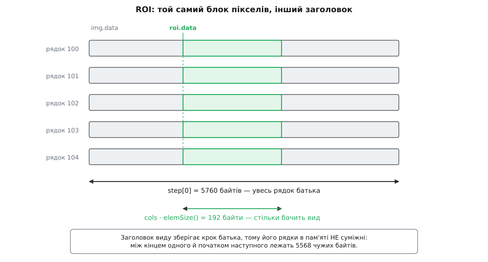
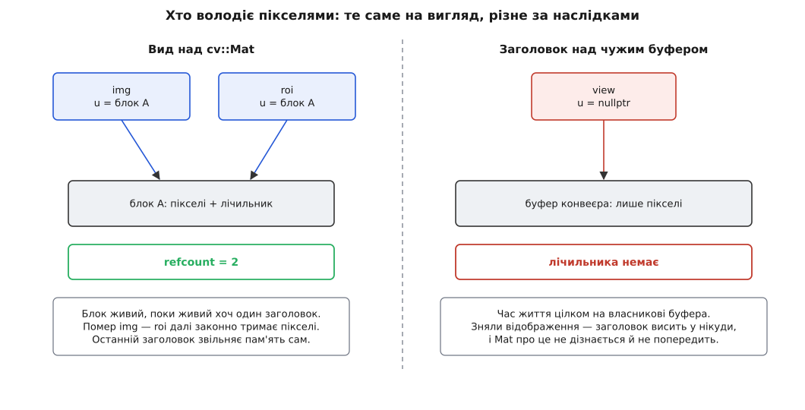
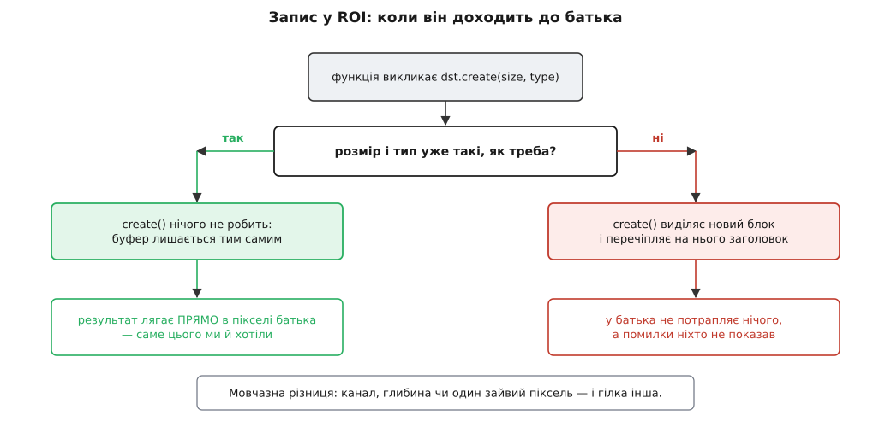

# Види без копії: ROI і заголовок над чужим буфером

<preknowlist>
- [cv::Mat: пам'ять і володіння](topic:media-vision/mat-memory-model) — Mat складається з невеликого заголовка й окремого блоку пікселів; присвоєння копіює заголовок, а не дані.
- [Адреси й покажчики](topic:programming/addresses-pointers) — що таке адреса байта й арифметика над покажчиком.
- [Зображення як дані](topic:algorithms/image-as-data) — растр у пам'яті й крок рядка: піксель шукають через `y·stride + x·bpp`, а не через ширину.
- [Формати пікселів](topic:algorithms/pixel-formats) — пакетні й площинні формати, скільки байтів займає піксель.
- [Підрахунок посилань](topic:programming/reference-counting) — спільне володіння через лічильник і хто звільняє блок останнім.
- [Кеш](topic:programming/cache) — кеш-лінія як найменша порція обміну з пам'яттю.
</preknowlist>

## Задача, у якій копія заважає

Детектор знайшов обличчя й повернув прямокутник `(x, y, w, h)` у кадрі. Треба його розмити — не окремо, а **в самому кадрі**, який далі піде в кодувальник і в мережу.

Найпростіший хід: вирізати прямокутник в окреме зображення, розмити, покласти назад. Три дії замість однієї, і середня з них — єдина потрібна. Дві інші коштують часу й, що гірше, створюють можливість помилитися: забув покласти назад — код працює, тести на розмитому шматку проходять, у мережу летить незмите обличчя. Помилка тиха, бо ніщо не зламалося.

Порахуймо й час. Кадр 1920×1080 у BGR8 — це 1920·1080·3 = 6 220 800 байтів, майже 6 МБ. Пропускна здатність пам'яті на одному потоці — у найкращому разі десятки гігабайтів за секунду; візьмімо оптимістичні 10 ГБ/с:

```
одне повне копіювання кадру = 6 220 800 Б / 10·10⁹ Б/с ≈ 0.62 мс
бюджет одного кадру при 30 к/с                          = 33 мс
```

Одна копія — два відсотки бюджету, дрібниця. Але конвеєр із п'яти-шести стадій, де кожна «про всяк випадок» бере собі копію, з'їдає вже десяту частину бюджету — і, що болючіше за самі мілісекунди, щоразу проганяє шість мегабайтів крізь кеш, витісняючи звідти все, з чим працювали сусідні стадії.

Отже, потрібне вміння **назвати прямокутник у вже наявній пам'яті**, не рухаючи жодного байта: щоб запис у цей прямокутник був записом у кадр, а не в його двійника. Саме це в OpenCV називають **видом** (англ. *view*) — і вся конструкція `cv::Mat` збудована так, щоб вид був можливий.

## Що робить вид можливим: крок живе окремо від ширини

Заголовок `cv::Mat` — це кілька десятків байтів опису: `rows`, `cols`, `flags` (тип і кілька прапорців), покажчик `data` на початок пікселів, покажчик `u` на службовий блок із лічильником посилань і масив `step`. Пікселі лежать деінде — у власному блоці пам'яті, на який заголовок лише вказує.

Ключове поле тут — `step[0]`: **скільки байтів від початку одного рядка до початку наступного**. Піксель шукають так:

```
адреса пікселя (x, y) = data + y·step[0] + x·elemSize()
```

де `elemSize()` — байтів на піксель (для BGR8 це 3). Зверни увагу, чого в цій формулі **немає**: ширини `cols`. Ширина каже, скільки пікселів у рядку **корисні**, а `step[0]` каже, де починається наступний рядок. Це два незалежні числа.

Незалежність придумали не заради видів. Спершу вона знадобилася тому, що залізо любить починати кожен рядок із «круглої» адреси — кратної 4, 16 чи 64 байтам, — і рядок доповнюють порожніми байтами, від чого `step[0]` виходить більшим за `cols·elemSize()`. Але щойно ці два числа розчеплено, з'являється друга можливість, набагато цікавіша за вирівнювання: **зменшити `cols`, лишивши `step[0]` без змін**. Тоді заголовок описує не весь растр, а вузьку смугу всередині нього. Зсунь ще й `data` — і смуга перетвориться на будь-який прямокутник.

Так виглядає вид: **той самий блок пікселів, інший заголовок над ним**.



*Вид зберігає крок батька, тож його рядки в пам'яті не суміжні — між ними лежить решта батьківського рядка.*

> 📜 Розчеплення кроку й ширини старше за `cv::Mat`: воно прийшло з `IplImage` — структури, успадкованої OpenCV від Intel Image Processing Library, де байтову довжину рядка тримало поле `widthStep`. Ділянку там задавали інакше: окремим полем `roi` у самому зображенні, яке вмикали викликом `cvSetImageROI`. Чому цей підхід виявився нежиттєздатним і чим його замінили в OpenCV 2.0 — [історія переходу від IplImage до Mat](topic:media-vision/mat-views-no-copy/hist-iplimage-roi.md).

## Як народжується ROI

Прямокутну ділянку беруть викликом `operator()` із прямокутником або парою діапазонів:

```cpp
cv::Mat frame = cv::imread("shot.png");            // 1920×1080, CV_8UC3

cv::Mat roi = frame(cv::Rect(100, 100, 64, 64));   // прямокутник
cv::Mat top = frame.rowRange(0, 64);               // смуга рядків
cv::Mat col = frame.col(500);                      // один стовпець
cv::Mat dia = frame.diag();                        // головна діагональ
```

Жоден із цих рядків не копіює пікселів. Кожен будує новий заголовок і повертає його за значенням — операція постійного часу, кілька десятків байтів запису в стек.

**Умова.** Кадр 1920×1080 BGR8 без доповнення рядків, ROI 64×64 у точці (100, 100).

```
elemSize()      = 3 байти               (B, G, R по байту)
frame.step[0]   = 1920 · 3   = 5760 байтів

roi.data        = frame.data + 100·5760 + 100·3
                = frame.data + 576000 + 300
                = frame.data + 576300

roi.rows        = 64
roi.cols        = 64
roi.step[0]     = 5760                  ← НЕ 64·3 = 192
```

Рядок `y` виду починається за адресою `roi.data + y·5760`, а корисних байтів у ньому — перші 192. Решта 5568 байтів рядка належать сусіднім ділянкам кадру, і вид їх просто перестрибує.

Зі `step[0] = 5760` при `cols = 64` випливає все інше в цій темі — і зручності, і пастки. Тримай це число в голові.

> 🔧 **Навіщо це.** Перше, що варто зробити з незнайомим `cv::Mat`, який прийшов ззовні, — надрукувати `m.cols`, `m.step[0]` і `m.elemSize()`. Якщо `step[0] > cols·elemSize()`, у руках або вид, або буфер із доповненими рядками, і будь-який код, що біжить по пам'яті лінійно, дасть навскісне сміття замість картинки.

## Запис у вид — це запис в оригінал

Спільний блок означає спільні пікселі в обидва боки. Розмиття ділянки кадру пишеться одним рядком:

```cpp
cv::Mat face = frame(cv::Rect(x, y, w, h));
cv::GaussianBlur(face, face, cv::Size(31, 31), 0);   // frame уже розмитий
```

Класти назад нічого не треба, бо нічого й не виймали. Проблема з початку теми зникає разом із двома зайвими копіюваннями.

Але тут-таки чигає пастка, з якої починається знайомство з `cv::Mat` майже в кожного. Порівняй чотири рядки:

```cpp
cv::Mat roi = frame(cv::Rect(10, 10, 100, 100));

roi = cv::Scalar(0, 0, 0);      // ЗАПОВНЮЄ: у frame з'явиться чорний квадрат
roi.setTo(cv::Scalar(0, 0, 0)); // те саме, лише явно

roi = patch;                    // ПЕРЕЧІПЛЯЄ: roi тепер дивиться на patch, frame цілий
patch.copyTo(roi);              // ЗАПИСУЄ: пікселі patch лягають у frame
```

Асиметрія не примха. `operator=` від скаляра нічого іншого й не може означати, окрім заповнення — скаляр не має власної пам'яті. А `operator=` від іншого `Mat` — це звичайне присвоєння заголовків: він копіює опис і збільшує лічильник чужого блоку, як і будь-де в C++, де присвоєння перечіпляє змінну на інше значення. Наслідок: `roi` перестає бути видом на кадр, а кадр лишається неторканим.

Той самий механізм робить безневинний на вигляд рядок неробочим:

```cpp
frame.row(0) = frame.row(5);        // НІЧОГО не станеться
frame.row(5).copyTo(frame.row(0));  // копіює рядок 5 у рядок 0
```

Ліворуч у першому рядку — безіменний тимчасовий заголовок, який отримує нове значення й одразу вмирає. Пікселі про це не дізналися. Правило просте й запам'ятовується назавжди: **щоб дані пройшли крізь вид, потрібен виклик, що пише в пам'ять** — `copyTo`, `setTo`, або функція OpenCV із цим видом як виходом.

## Суцільність: коли по видові можна бігти лінійно

Найшвидший обхід зображення — один цикл по всіх байтах підряд. Він законний лише тоді, коли байти справді лежать підряд. `cv::Mat` тримає для цього прапорець, і питати треба саме його:

```
суцільний ⟺ step[0] == cols · elemSize()

батько: 5760 == 1920·3 = 5760   → так, isContinuous() == true
ROI:    5760 ≠    64·3 =  192   → ні,  isContinuous() == false
```

`isContinuous()` каже **не** «батько був суцільний», а «в рядках **цього** заголовка немає розривів». Два випадки дають `true` навіть для виду: коли в ньому один рядок (розриву просто ніде взятися) і коли вид узяв рядки на всю ширину батька — `rowRange`, `row` — а батько сам був суцільний.

Звідси канонічний обхід, який працює й швидко, і правильно:

```cpp
void invert(cv::Mat& m)                      // CV_8UC3, на місці
{
    int rows = m.rows;
    int cols = m.cols * m.channels();        // байтів у рядку — корисних

    if (m.isContinuous()) {                  // весь блок — один довгий рядок
        cols *= rows;
        rows = 1;
    }

    for (int y = 0; y < rows; ++y) {
        uchar* p = m.ptr<uchar>(y);          // початок рядка y
        for (int i = 0; i < cols; ++i)
            p[i] = 255 - p[i];
    }
}
```

Тут `m.ptr<uchar>(y)` — це рівно `m.data + y·m.step[0]`, тобто рядковий доступ коректний завжди. А злиття всіх рядків в один — оптимізація, дозволена **лише** прапорцем суцільності. Код, що замість цього робить `m.data[i]` по `m.total()·m.channels()` байтів, на суцільному кадрі працює, а на ROI мовчки читає й псує сусідні ділянки зображення.

Та сама межа стосується `reshape()`. Перетлумачити 1080 рядків по 1920 пікселів як один рядок із 2 073 600 пікселів можна тільки тоді, коли між рядками немає дірок; над несуцільним видом `reshape()` зі зміною кількості рядків не мовчить і не копіює тишком, а кидає помилку. Це доброчесна поведінка: операція обіцяє нульову ціну, і замість того щоб потай порушити обіцянку, вона відмовляється.

## Вид пам'ятає, з чого його вирізали

Заголовок виду містить не лише `data`, а й `datastart` та `dataend` — межі **всього** блоку, а не своєї ділянки. З цих трьох чисел і кроку відновлюється позиція виду в батькові:

```cpp
cv::Size whole;      // розмір батьківського растра
cv::Point offset;    // де в ньому сидить roi

roi.locateROI(whole, offset);
// whole == (1920, 1080), offset == (100, 100)
```

Парна до неї `adjustROI(dtop, dbottom, dleft, dright)` розсуває вікно виду в межах батька — і саме тому вона існує. Згортковий фільтр над ділянкою потребує сусідніх пікселів за її краєм; узявши їх у батька замість того щоб домальовувати штучну рамку, фільтр дає на межі **справжній** результат, а не наближений:

```cpp
cv::Mat face = frame(cv::Rect(x, y, w, h));
face.adjustROI(15, 15, 15, 15);   // взяти по 15 рядів контексту з кадру
                                  // OpenCV сама обріже запит межами frame
```

Це та властивість, якої в копії немає в принципі: копія не знає, що було поруч, бо поруч у неї нічого немає.

## Час життя, коли батько — теж Mat

Вид, збудований із `cv::Mat`, бере з нього не тільки `data`, а й покажчик `u` на службовий блок, і збільшує лічильник посилань. Пікселі належать усім заголовкам порівну, і звільнить їх той, хто помре останнім.

```cpp
cv::Mat centralPatch()
{
    cv::Mat frame = grabFrame();                       // 1920×1080
    return frame(cv::Rect(860, 440, 200, 200));        // frame зараз помре
}                                                      // і це безпечно
```

Локальний `frame` виходить із області видимості, його деструктор зменшує лічильник з 2 до 1 — блок лишається живим, бо повернений вид на нього посилається. Викликач отримає коректні пікселі.

Ціна теж є, і про неї варто знати: цей вид **утримує весь кадр**. Двісті на двісті пікселів — 120 кілобайтів корисних даних — не дадуть звільнити шість мегабайтів. Складеш такі види в чергу з тридцяти елементів — і в пам'яті висять тридцять цілих кадрів, майже 190 МБ, хоча потрібні з них крихти. Коли вид треба зберігати надовго, а батько великий, `clone()` — не марнотратство, а економія.

## Другий рід виду: заголовок над чужим буфером

Досі блок пікселів належав самому OpenCV. Але формула адресації байдужа до того, хто виділив пам'ять, і `cv::Mat` має конструктор, який приймає готовий покажчик:

```cpp
cv::Mat view(rows, cols, CV_8UC3, ptr, step);
```

Він не виділяє нічого. Він заповнює заголовок і кладе в `u` порожній покажчик — цим позначено: **лічильника немає, володіння немає**. Деструктор такого `Mat` нічого не звільнить; `release()` нічого не зробить.



*Обидва — види без копії, але у володінні різні: ліворуч блок живе, поки живий хоч один заголовок; праворуч час життя цілком поза OpenCV.*

Різниця не видна ні з типу, ні з `rows`/`cols`/`step` — жодна функція, що приймає `const cv::Mat&`, не відрізнить одне від одного. Але наслідки протилежні. Заголовок без володіння живий рівно доти, доки живий буфер під ним, а про смерть буфера ніхто його не повідомить: там, де щойно був кадр, лежатимуть інші дані або взагалі сторінка зі знятим відображенням. Це звичайний [висячий покажчик](topic:cpp-standards/dangling-references), лише загорнутий у клас, що на вигляд керує пам'яттю сам.

Пастка навколо нього одна й дуже стійка: **копія заголовка успадковує і відсутність володіння**.

```cpp
class Detector {
    cv::Mat last_;                 // «останній кадр»
public:
    void onFrame(const cv::Mat& v) {
        last_ = v;                 // ПОМИЛКА, якщо v — вид на чужий буфер
        last_ = v.clone();         // правильно: власний блок із лічильником
    }
};
```

`last_ = v` виглядає як збереження кадру, а насправді зберігає адресу пам'яті, яку хвилину тому віддали назад конвеєру. Дефект живе тихо: більшість часу пам'ять ще не перевикористана, картинка ціла, і падає воно раз на кілька годин під навантаженням.

## Стик із відеоконвеєром

Саме заради цього конструктора все й затівалося. Декодований кадр приходить із конвеєра в його власному буфері — часто виділеному драйвером або пулом, іноді відображеному з пам'яті відеокарти. Копіювати його в `cv::Mat` означає щокадру платити ті самі шість мегабайтів; правильний шлях — накрити чужий буфер заголовком:

```cpp
GstVideoFrame vf;
if (!gst_video_frame_map(&vf, &info, buffer, GST_MAP_READ))
    return;

cv::Mat view(GST_VIDEO_FRAME_HEIGHT(&vf),
             GST_VIDEO_FRAME_WIDTH(&vf),
             CV_8UC3,
             GST_VIDEO_FRAME_PLANE_DATA(&vf, 0),
             GST_VIDEO_FRAME_PLANE_STRIDE(&vf, 0));   // крок — від конвеєра!

detect(view);                    // читаємо на місці, не скопіювавши байта

gst_video_frame_unmap(&vf);      // відображення знято: view тепер висячий
```

Три речі в цьому фрагменті вирішують справу.

**Крок беруть від конвеєра, а не рахують від ширини.** Декодувальники вирівнюють рядки — на 4, 16, 64 байти, а апаратні часом і на 128. У кадрі 1366×768 BGR8 корисних байтів у рядку 1366·3 = 4098, а декодувальник із вирівнюванням на 64 віддасть крок 4160. Підставиш `width·3` — і кожен наступний рядок зчитається на 62 байти раніше, ніж треба: картинка поїде навскіс приблизно на двадцять пікселів за рядок. Помилка в інший бік — узятий крок більший за справжній — гірша: останні рядки читатимуться вже поза буфером. Механіку доповнення рядків розібрано в темі [«зображення як дані»](topic:algorithms/image-as-data); тут важливо лиш одне: `step` — це вхідний параметр із метаданих кадру, а не обчислення.

**Тип має відповідати домовленому формату.** `CV_8UC3` — три байти на піксель поряд; для NV12 чи I420 такий заголовок безглуздий, бо там площини лежать окремо й мають кожна свій крок. Що робити з площинними форматами й як домовитися про формат із конвеєром — тема [стику з відеоконвеєром](topic:media-vision/frame-interop); про самі формати — [«формати пікселів»](topic:algorithms/pixel-formats).

**Заголовок мусить померти раніше за відображення.** `view` існує між `map` і `unmap`, і жоден його слід не повинен пережити цю пару. Якщо кадр треба лишити — `clone()`, свідомо й один раз.

> ⚙️ Повний робочий приклад — від витягання зразка з `appsink` до обробки ділянки на місці, з обробкою помилок і з тим, як цю конструкцію ламають: [проєкт «кадр із GStreamer у cv::Mat без копії»](topic:media-vision/mat-views-no-copy/proj-gst-mat-zero-copy.md).

Є ще одна асиметрія, яку легко проґавити. Відображення `GST_MAP_READ` дає пам'ять **тільки для читання** — а `cv::Mat::data` має тип `uchar*` без жодного `const`. Компілятор не заперечить проти запису; у кращому разі процес упаде на захищеній сторінці, у гіршому — тихо зіпсує буфер, який паралельно читає інша гілка конвеєра. Хочеш писати — відображай із `GST_MAP_WRITE`, і будь готовий, що буфер зі спільним володінням доведеться спершу зробити придатним для запису, а це вже може коштувати копії. Механіку буферів і пулів розібрано в темі [«буфери й пам'ять у конвеєрі»](topic:media-vision/buffers-and-memory).

І та сама діра ширша за GStreamer: **`const cv::Mat&` захищає заголовок, а не пікселі**. Функція, що прийняла кадр за константним посиланням, законно змінює зображення — мова цього не забороняє, бо константність не поширюється крізь покажчик `data`. Домовленість «не пишу у вхід» у OpenCV тримається дисципліною, а не типами; у сучасному C++ ту саму ідею невласницького вигляду виражають чесніше — див. [`std::span`](topic:cpp-standards/span-contiguous).

## Де ланцюг без копії тихо рветься

Функції OpenCV пишуть результат у вихідний аргумент, і майже кожна починає з виклику `dst.create(size, type)` — це частина загального механізму, яким бібліотека приймає вхід і віддає вихід через обгортки [InputArray і OutputArray](topic:media-vision/input-output-array). Уся поведінка запису в ROI визначається цим викликом.

`create()` дивиться, чи потрібні розмір і тип **уже** такі, як у заголовка. Якщо так — виходить негайно, нічого не робить, і функція пише в наявний буфер, тобто прямо в пікселі батька. Якщо ні — відпускає старий блок, виділяє новий і перечіпляє на нього заголовок. Помилки при цьому немає: з погляду `create()` все відпрацювало як задумано.



*Одна перевірка на збіг розміру й типу вирішує, чи дійде результат до батьківського кадру.*

Тому запис у ROI працює **тільки при точному збігу**:

```cpp
cv::Mat roi = frame(cv::Rect(0, 0, 64, 64));   // CV_8UC3

cv::blur(roi, roi, cv::Size(3, 3));            // збіг → пише в frame
cv::cvtColor(roi, roi, cv::COLOR_BGR2GRAY);    // 1 канал ≠ 3 → новий блок,
                                               // frame лишився кольоровим
```

Другий рядок не впаде й не попередить. Він просто перетворить `roi` на самостійне сіре зображення 64×64, а кадр не змінить. Розбіжність буває й тоншою за кількість каналів: інша глибина (`CV_8U` проти `CV_32F`), інший розмір на один піксель через `cv::Size` із заокругленням — наслідок той самий.

Те саме правило керує й `copyTo`:

```cpp
patch.copyTo(roi);   // пише в frame, ЯКЩО patch.size() == roi.size()
                     //               і patch.type() == roi.type()
```

За розбіжності `copyTo` не масштабує й не обрізає — він викликає `create()` на приймачі, і `roi` відривається від кадру.

Практична дисципліна з цього одна: **коли запис має дійти до батька, розмір і тип виходу задають явно й звіряють**. Найдешевший спосіб — тимчасовий `Mat` для проміжного результату й свідомий `copyTo` в ROI наприкінці, коли розміри вже точно збігаються.

> 🔧 **Навіщо це.** Помилка «розмиття не з'явилося в кадрі» майже завжди саме тут, а не в алгоритмі. Перевірка на один рядок: перед підозрілим викликом зберегти `void* before = roi.data`, після — порівняти. Адреса змінилася — `create()` перевиділив буфер, і зв'язок із кадром обірвано.

## Позитивний бік: смуги без замків

Спільна пам'ять зазвичай означає синхронізацію. Тут — не завжди. Два види на **неперетинні** ділянки одного кадру торкаються неперетинних байтів, тож писати в них можна одночасно й без жодного замка:

```cpp
const int nBands = 4;

cv::parallel_for_(cv::Range(0, nBands), [&](const cv::Range& r) {
    for (int b = r.start; b < r.end; ++b) {
        int y0 =  b      * frame.rows / nBands;
        int y1 = (b + 1) * frame.rows / nBands;

        cv::Mat band = frame.rowRange(y0, y1);          // вид, не копія
        cv::threshold(band, band, 128, 255, cv::THRESH_BINARY);
    }
});
```

Лічильник посилань атомарний, тож самі заголовки безпечно роздавати між гілками; пікселі ж захищені не блокуванням, а геометрією — кожна гілка працює зі своїм діапазоном рядків, і жоден байт не потрапляє під двох. Смуги по рядках зручні ще й тим, що межа між ними майже завжди припадає на різні кеш-лінії: рядок займає тисячі байтів, тож на шві ділиться щонайбільше одна лінія, і [хибне спільне використання](topic:programming/false-sharing) не встигає нашкодити.

Важлива умова: так можна ділити лише **поточкові** операції. Згортка, морфологія, будь-який фільтр із вікном на межі смуги побачить не сусідні рядки кадру, а штучну рамку, домальовану за краєм смуги, — і шви стануть видимі. Лікується це `adjustROI` або перекриттям смуг на радіус вікна: кожна гілка читає ширшу смугу, а пише лише у свою серцевину.

## Коли копія дешевша за вид

Вид безплатний у момент створення, але не безплатний у користуванні: несуцільність кадру платиться на кожному проході. Розмір плати цілком визначає геометрія ділянки.

**Умова.** Кадр 1920×1080 BGR8, `step[0] = 5760`, кеш-лінія 64 байти.

```
смуга на всю ширину, 1920×64:
  корисних байтів   = 5760 · 64            = 368 640
  кеш-ліній на рядок = 5760 / 64           = 90, усі повністю корисні
  зайвого читання                          ≈ 0

стовпець 1×1080:
  корисних байтів   = 3 · 1080             = 3 240
  кеш-ліній на рядок = 1                   (3 потрібні байти з 64)
  прочитано з пам'яті = 64 · 1080          = 69 120
  марно                                    ≈ 21×
```

Смуга по рядках — ідеальний вид: пам'ять читається суцільними ділянками, апаратний передвибірник (англ. *prefetcher*) вгадує наступну адресу. Вузький високий стовпець — навпаки: кожен рядок коштує цілої кеш-лінії, з якої використано три байти.

Звідси правило прикидки. Один прохід по будь-якому виду — просто роби вид. Кілька проходів по **вузькій та високій** ділянці — порахуй: 64×64 з кадру займають 12 288 байтів, копіювання їх коштує мікросекунди, зате всі подальші проходи йдуть по суцільній компактній пам'яті, що вміщується в L1. Тут `clone()` окупається з другого-третього проходу.

```cpp
cv::Mat patch = frame(cv::Rect(x, y, 64, 64)).clone();  // одна копія 12 КБ
for (int i = 0; i < 8; ++i)                             // вісім проходів
    heavyPass(patch);                                   // по суцільній пам'яті
patch.copyTo(frame(cv::Rect(x, y, 64, 64)));            // повернути результат
```

Зверни увагу на останній рядок: копію треба класти назад — рівно та зайва дія, від якої вид рятував. Тому вибір не «вид кращий за копію», а «вид, якщо проходів мало або ділянка широка; копія, якщо проходів багато й ділянка вузька».

Те саме міркування, до речі, стосується й прискорювачів: `cv::UMat` і `cv::cuda::GpuMat` теж уміють ROI, але межа копіювання там пролягає між пам'яттю процесора й пам'яттю пристрою, і ціна переходу зовсім інша — про це в темі [бекендів і прискорення](topic:media-vision/opencv-backends).

## Два питання до кожного Mat, що прийшов ззовні

Усі пастки вище — це два питання, на які відповіли неправильно.

**Хто володіє байтами?** Відповідь у полі `u`: не порожнє — блок під захистом лічильника, вид можна зберігати скільки завгодно; порожнє — час життя визначає хтось інший, і заголовок безпечний лише всередині відомого вікна. Звідси і висячий «останній кадр», і падіння після знятого відображення, і правило «зберігаєш — клонуй».

**Чи суцільні рядки?** Відповідь у порівнянні `step[0]` з `cols·elemSize()`, яке вже пораховане в прапорці `isContinuous()`. Суцільні — можна бігти лінійно, можна `reshape`; несуцільні — тільки по рядках, і кожен прохід платить за стрибки. Звідси і навскісна картинка від вгаданого кроку, і зіпсовані сусідні ділянки від наївного циклу, і арифметика вибору між видом та копією.

Обидві відповіді лежать у самому заголовку й дістаються трьома рядками друку. Питання лише в тому, щоб поставити їх до того, як код піде в роботу, а не після того, як він раз на дві години падає на бойовій машині.

> 📋 Повний перелік того, що саме повертає вид, а що копію, з сигнатурами й гарантіями кожного виклику — [довідка з видів cv::Mat](topic:media-vision/mat-views-no-copy/api-mat-views.md): конструктори над чужими даними, `Rect`/`Range`/`row`/`col`/`rowRange`/`colRange`/`diag`/`reshape`, поля `step`, `elemSize`, `datastart`, `dataend`, `flags`, а також `locateROI`, `adjustROI` й `isContinuous`.
