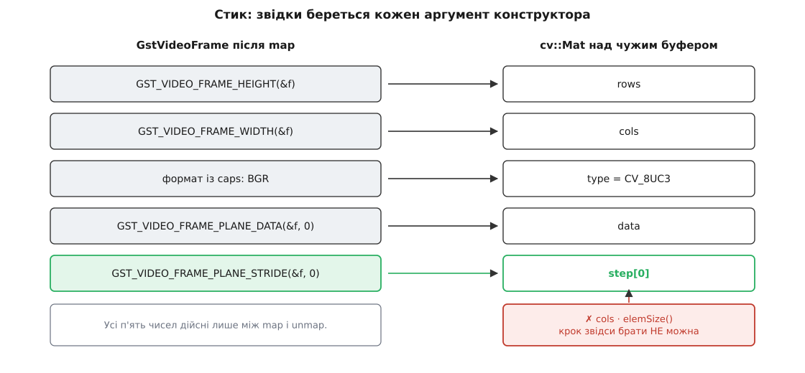
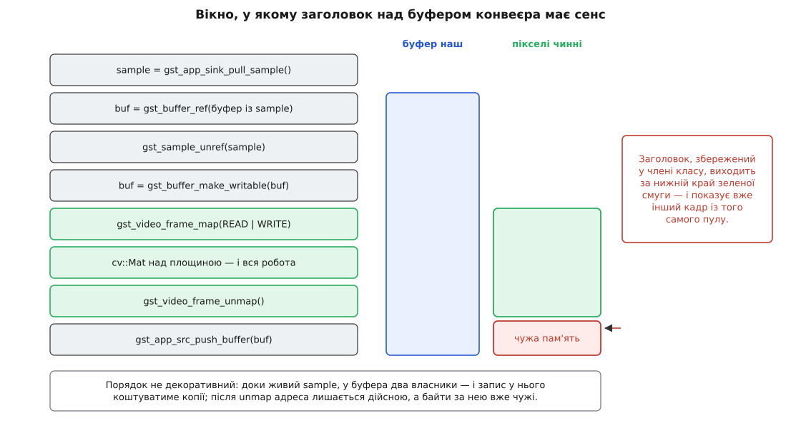
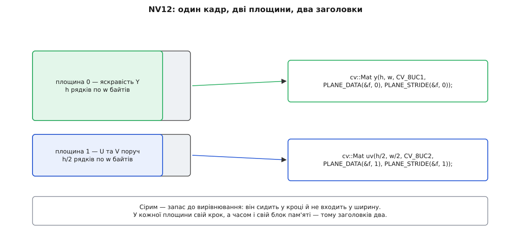

# ⚙️ Кадр GStreamer у cv::Mat: обробка на місці, нуль скопійованих байтів

Це робоча програма на C++: вона забирає кадр з `appsink`, накриває буфер конвеєра заголовком `cv::Mat`, замазує в ньому прямокутник — і віддає далі **той самий буфер**, у якому щойно малювала. Жоден піксель за весь цей шлях не переїжджає з місця на місце. Разом із кодом тут розібрано три способи зламати саме цю властивість, окремий варіант для NV12 і те, чого насправді коштує право писати в чужий кадр.

## Скільки коштує зайва обережність

Кадр 1280×720 BGR іде з камери далі — на екран, у файл, у мережу. По дорозі в ньому треба замазати прямокутник 440×240: номерний знак, обличчя, службовий напис. Звідки взявся прямокутник, тут не важливо — його дає детектор; важливо, що з ним роблять.

Наївний шлях пишеться сам собою й на вигляд розважливий: відобразити кадр на читання, накрити заголовком, **скопіювати в свій буфер** (бо в чужий писати страшно), розмити ділянку в копії, віддати далі копію. Порахуймо, скільки байтів рухається:

```
кадр 1280×720 BGR   = 1280 · 720 · 3 = 2 764 800 Б ≈ 2.76 МБ
ділянка 440×240 BGR = 440 · 240 · 3  =   316 800 Б ≈ 0.32 МБ

обережний шлях, на кадр:
  копія кадру у свій буфер  (прочитати + записати)   5.53 МБ
  розмиття ділянки          (прочитати + записати)   0.63 МБ
                                                     ────────
                                                     6.16 МБ

на місці, на кадр:
  розмиття ділянки          (прочитати + записати)   0.63 МБ

відношення = 6.16 / 0.63                            ≈ 9.8
при 30 к/с = 185 МБ/с проти 19 МБ/с
```

Дев'ять десятих усього руху пам'яті — перекладання кадру, про яке ніхто не просив. І платимо не самою лише шиною: копія проганяє крізь кеш майже три мегабайти й витісняє звідти все, з чим працює решта програми.

Щоб цього не робити, треба вміти дві речі: правильно **назвати чужу пам'ять своїм заголовком** і точно знати, **скільки цей заголовок живе**. Перше — арифметика, друге — порядок викликів.

## П'ять чисел, які треба перенести правильно

Конструктор `cv::Mat(rows, cols, type, data, step)` не виділяє пам'яті: він заповнює заголовок і залишає поле володіння порожнім. Усі п'ять аргументів мусять прийти з кадру, і жоден — з арифметики за іншими.



*`rows`, `cols` і `data` беруться очевидно; `type` — з формату, про який домовився конвеєр; `step` — тільки з кадру.*

Два з цих п'яти вимагають окремої уваги.

**`type` — це не здогад, а замовлення.** `CV_8UC3` має сенс лише тоді, коли в кадрі справді три байти на піксель поруч. Домовляються про це не в коді OpenCV, а фільтром caps у конвеєрі: `videoconvert ! video/x-raw,format=BGR ! appsink` — не опис того, що прийде, а вимога, без якої `appsink` погодиться на будь-що ([узгодження caps](topic:media-vision/caps-negotiation)).

**`step` приходить із кадру.** П'ятий аргумент має усталене значення `AUTO_STEP`, і воно означає «рядки щільні» — тобто `step = cols · elemSize()`. Кадр із відеоконвеєра щільним буває далеко не завжди: декодувальники вирівнюють початок кожного рядка на 16, 32, 64, а апаратні — і на 128 байтів, бо так люблять векторні інструкції й блоки прямого доступу до пам'яті ([вирівнювання даних](topic:programming/memory-alignment)). Справжній крок їде разом із кадром — у його метаданих, — і дістати його можна лише з відображення, макросом `GST_VIDEO_FRAME_PLANE_STRIDE`.

## Порядок володіння: чому sample відпускають найпершим

Між `appsink` і пікселями стоять чотири об'єкти з різними правилами: sample — ваш і потребує `unref`; буфер і caps усередині нього — позичені й живуть рівно стільки, скільки sample; відображення — існує між `map` і `unmap` ([міст appsink і appsrc](topic:media-vision/appsink-appsrc)).

Для програми, яка **читає** кадр, порядок майже байдужий. Для програми, яка в нього **пише**, він вирішує все, і ось чому: GStreamer дозволяє запис у буфер лише тоді, коли власник у буфера один. Доки живий sample, власників щонайменше двоє — sample і ви, — тож будь-яка спроба відобразити кадр на запис або провалиться, або тихо коштуватиме повної копії.

Звідси неочевидний хід: **узяти власне посилання на буфер і відпустити sample негайно**, ще до відображення. Після цього ви лишаєтеся єдиним власником, і право писати дістається безплатно.



*Зелена смуга — усе життя заголовка `cv::Mat`. Нижче за неї адреса лишається дійсною, а байти за нею вже належать наступному кадрові.*

Тонкість, яка робить цей порядок можливим: `gst_video_frame_map` теж бере посилання на буфер — але **після** того, як відображення вдалося. Тому перевірку «власник один» кадр проходить, доки ви ще справді єдиний власник. (Прапорець `GST_VIDEO_FRAME_MAP_FLAG_NO_REF` вимикає це посилання для випадків, коли час життя буфера ви гарантуєте самі — і саме щоб буфер лишався придатним до запису під час відображення.)

> 🔧 **Навіщо це.** Якщо кадр приходить із програмного декодера чи `videoconvert`, описаний порядок дає запис у кадр без жодної копії. Якщо ні — GStreamer однаково зробить копію сам, і програма лишиться правильною; зміниться тільки ціна. Тому перевіряти треба не коректність, а вартість: `gst_buffer_is_writable(buf) && gst_memory_is_writable(gst_buffer_peek_memory(buf, 0))` каже це двома читаннями лічильників, ще до того, як платити ([буфери й пам'ять конвеєра](topic:media-vision/buffers-and-memory)).

## Охоронець відображення й заголовок над площиною

Дві речі в цій програмі варто зробити один раз і більше про них не думати: зняття відображення й побудову заголовка. Обидві вкладаються в маленький клас, чий деструктор і є `unmap` — звичайний [охоронець області](topic:cpp-standards/scope-guard), тільки застосований до кадру.

```cpp
// gst_mat_inplace.cpp — кадр із appsink у cv::Mat, обробка на місці,
// той самий буфер далі в конвеєр.
//
//   g++ -O2 -std=c++17 gst_mat_inplace.cpp -o gst_mat_inplace \
//       $(pkg-config --cflags --libs gstreamer-1.0 gstreamer-app-1.0 \
//                                    gstreamer-video-1.0 opencv4)

#include <gst/gst.h>
#include <gst/app/gstappsink.h>
#include <gst/app/gstappsrc.h>
#include <gst/video/video.h>

#include <opencv2/imgproc.hpp>

#include <csignal>

static volatile sig_atomic_t g_stop = 0;
static void on_sigint (int) { g_stop = 1; }

/* Відображення, прив'язане до області видимості: unmap станеться сам —
   і на ранньому return, і на винятку з надр OpenCV. */
class MappedFrame {
public:
  MappedFrame (const GstVideoInfo *info, GstBuffer *buf, GstMapFlags flags)
      : ok_ (gst_video_frame_map (&f_, info, buf, flags)) {}

  ~MappedFrame () { if (ok_) gst_video_frame_unmap (&f_); }

  MappedFrame (const MappedFrame &)            = delete;   /* копії заборонені: */
  MappedFrame &operator= (const MappedFrame &) = delete;   /* unmap рівно один  */

  explicit operator bool () const { return ok_; }

  int width  () const { return GST_VIDEO_FRAME_WIDTH  (&f_); }
  int height () const { return GST_VIDEO_FRAME_HEIGHT (&f_); }

  const GstVideoFrame *get () const { return &f_; }   /* для решти макросів */

  /* Заголовок над площиною p. Розмір і тип задає викликач — лише він знає,
     про який формат домовився конвеєр. Крок береться з КАДРУ. */
  cv::Mat plane (guint p, int rows, int cols, int cvType) const
  {
    return cv::Mat (rows, cols, cvType,
                    GST_VIDEO_FRAME_PLANE_DATA (&f_, p),
                    (size_t) GST_VIDEO_FRAME_PLANE_STRIDE (&f_, p));
  }

private:
  GstVideoFrame f_ {};    /* оголошений ПЕРШИМ: map у списку ініціалізації */
  gboolean      ok_;      /* працює вже над готовим полем                  */
};
```

Метод `plane()` навмисно `const`, а `cv::Mat`, який він повертає, дозволяє запис. Це не недогляд, а чесне відображення того, як влаштований `cv::Mat`: константність до пікселів не доходить узагалі, і жодна сигнатура в OpenCV від запису у вхідне зображення не захищає ([коректність за const](topic:cpp-standards/const-correctness)). Право писати тут дає не тип, а прапорці відображення.

Сама обробка після цього — кілька рядків, і кожен із них пише прямо в кадр конвеєра:

```cpp
/* Замазує прямокутник ПРЯМО в кадрі конвеєра. */
static bool blur_region (const GstVideoInfo *info, GstBuffer *buf, cv::Rect r)
{
  MappedFrame f (info, buf, GST_MAP_READWRITE);
  if (!f)
    return false;

  cv::Mat bgr = f.plane (0, f.height (), f.width (), CV_8UC3);  /* без копії */

  r &= cv::Rect (0, 0, bgr.cols, bgr.rows);        /* обрізати межами кадру */
  if (r.width < 8 || r.height < 8)
    return true;

  cv::Mat roi = bgr (r);                           /* вид у виді, теж без копії */
  cv::GaussianBlur (roi, roi, cv::Size (0, 0), 9); /* пише В КАДР */
  cv::rectangle (bgr, r, cv::Scalar (0, 255, 0), 2);

  return true;
}   /* roi і bgr гинуть раніше за f — unmap робиться останнім */
```

Порядок знищення тут не випадковий, а виведений з порядку оголошення: `f` створено першим, тож знищено буде останнім, уже після обох заголовків. Якби охоронець стояв нижче, `unmap` відбувся б, доки `bgr` і `roi` ще живі, — і хоч ніхто б цього не помітив, у програмі з'явилася б мить, коли чинний на вигляд `cv::Mat` дивиться в зняте відображення.

Дрібниця, яка тут дістається задарма: розмиття всередині `roi` бере пікселі для країв **із самого кадру**, а не домальовує штучну рамку, — OpenCV для підматриці за усталеним `borderType` дивиться назовні ділянки. Тому шва по периметру замазаного прямокутника не видно, і жодних додаткових зусиль це не коштувало ([згортки й фільтри](topic:algorithms/convolution-filters)).

## Цикл: два конвеєри й один буфер між ними

```cpp
int main (int argc, char *argv[])
{
  gst_init (&argc, &argv);
  std::signal (SIGINT, on_sigint);

  GError *err = NULL;
  GstElement *pin = gst_parse_launch (
      "videotestsrc pattern=smpte is-live=true ! "
      "video/x-raw,format=BGR,width=1280,height=720,framerate=30/1 ! "
      "appsink name=out sync=false max-buffers=2 drop=true", &err);
  if (!pin) { g_printerr ("вхід: %s\n", err->message); return 1; }

  GstElement *pout = gst_parse_launch (
      "appsrc name=in format=time is-live=true ! "
      "videoconvert ! autovideosink sync=false", &err);
  if (!pout) { g_printerr ("вихід: %s\n", err->message); return 1; }

  GstAppSink *sink = GST_APP_SINK (gst_bin_get_by_name (GST_BIN (pin),  "out"));
  GstAppSrc  *src  = GST_APP_SRC  (gst_bin_get_by_name (GST_BIN (pout), "in"));

  gst_element_set_state (pout, GST_STATE_PLAYING);
  gst_element_set_state (pin,  GST_STATE_PLAYING);

  GstVideoInfo  info;
  GstCaps      *known  = NULL;      /* caps, для яких порахована info */
  guint64       frames = 0;

  while (!g_stop) {
    GstSample *sample = gst_app_sink_try_pull_sample (sink, 200 * GST_MSECOND);
    if (!sample) {
      if (gst_app_sink_is_eos (sink)) break;
      continue;                                    /* таймаут — просто чекаємо */
    }

    GstCaps *caps = gst_sample_get_caps (sample);  /* позичені в sample */
    if (!caps) { gst_sample_unref (sample); continue; }

    /* Розбирати caps щокадру немає причини: між кадрами вони ті самі. */
    if (!known || !gst_caps_is_equal (caps, known)) {
      if (!gst_video_info_from_caps (&info, caps)) {
        gst_sample_unref (sample);
        break;
      }
      gst_caps_replace (&known, caps);             /* тепер посилання наше */
      gst_app_src_set_caps (src, known);           /* далі йде той самий формат */
      g_printerr ("формат %s %d×%d, крок площини 0 — з кадру, не з ширини\n",
                  gst_video_format_to_string (GST_VIDEO_INFO_FORMAT (&info)),
                  GST_VIDEO_INFO_WIDTH (&info), GST_VIDEO_INFO_HEIGHT (&info));
    }

    /* Буфер беремо СОБІ й одразу відпускаємо sample: доки той живий,
       у буфера два власники — і запис у нього коштував би копії. */
    GstBuffer *buf = gst_buffer_ref (gst_sample_get_buffer (sample));
    gst_sample_unref (sample);

    /* Власник один — повернеться той самий буфер. Якщо чомусь не один,
       GStreamer зробить нам власний, і програма лишиться правильною. */
    buf = gst_buffer_make_writable (buf);

    if (!blur_region (&info, buf, cv::Rect (420, 240, 440, 240))) {
      gst_buffer_unref (buf);                      /* не відобразився — наш борг */
      continue;
    }

    if (gst_app_src_push_buffer (src, buf) != GST_FLOW_OK)
      break;                                       /* після push buf уже не наш */
    ++frames;
  }

  /* Спершу зупиняємо той конвеєр, який тримає чужі буфери. */
  gst_app_src_end_of_stream (src);
  gst_element_set_state (pout, GST_STATE_NULL);
  gst_element_set_state (pin,  GST_STATE_NULL);

  if (known) gst_caps_unref (known);
  gst_object_unref (sink);
  gst_object_unref (src);
  gst_object_unref (pin);
  gst_object_unref (pout);

  g_printerr ("кадрів: %" G_GUINT64_FORMAT "\n", frames);
  return 0;
}
```

Кадр, який ми віддали в другий конвеєр, і далі належить пулу першого: він повернеться туди аж тоді, коли `autovideosink` його відпустить. Пул скінченний, тож затримка на виході миттєво стає нестачею буферів на вході — саме тому `max-buffers=2 drop=true` на `appsink` тут не косметика, а умова, за якої перший конвеєр не стане. Якщо кадр треба тримати довше (черга, інший потік, запис на диск), економія обертається на свою протилежність, і чесніше зробити копію — але свідомо й в одному відомому місці.

## NV12: один кадр, два заголовки

Досі кадр був пакетним: три байти на піксель поруч. Апаратні декодери такого майже не віддають — їхній звичний вихід це NV12, де яскравість лежить окремою площиною, а колірність — другою, удвічі меншою за обома вимірами, з переплетеними U та V ([формати пікселів](topic:algorithms/pixel-formats)).

Один `cv::Mat` таку розкладку не описує, і не тому, що OpenCV чогось не вміє: у площин різні кроки й, узагалі кажучи, різні блоки пам'яті. Заголовків потрібно два.



*Площина яскравості — один байт на піксель; площина колірності — пара U,V на кожен квадрат 2×2, тобто два канали при вдвічі менших розмірах.*

```cpp
static bool blur_region_nv12 (const GstVideoInfo *info, GstBuffer *buf, cv::Rect r)
{
  MappedFrame f (info, buf, GST_MAP_READWRITE);
  if (!f)
    return false;

  const int w = f.width (), h = f.height ();

  cv::Mat y  = f.plane (0, h,     w,     CV_8UC1);   /* яскравість */
  cv::Mat uv = f.plane (1, h / 2, w / 2, CV_8UC2);   /* U та V поруч */

  /* Межі ділянки мусять бути парними: одна пара U,V накриває квадрат 2×2,
     тож непарний край просто нікуди покласти. */
  r &= cv::Rect (0, 0, w, h);
  r = cv::Rect (r.x & ~1, r.y & ~1, r.width & ~1, r.height & ~1);
  if (r.width < 8 || r.height < 8)
    return true;

  cv::Rect ruv (r.x / 2, r.y / 2, r.width / 2, r.height / 2);

  cv::Mat yr = y (r), uvr = uv (ruv);                /* два види, обидва в кадрі */
  cv::GaussianBlur (yr,  yr,  cv::Size (0, 0), 9);
  cv::GaussianBlur (uvr, uvr, cv::Size (0, 0), 4.5);
  return true;
}
```

Розмиття двоканальної колірності працює поканально, тобто U розмивається з U, а V — з V; це саме те, чого хочеться. Якщо ділянку треба не розмити, а знебарвити, замість другого виклику стоїть `uv(ruv).setTo(cv::Scalar(128, 128))` — сіре в NV12 це рівно 128 в обох каналах.

Коли ділянку треба справді **побачити** в кольорі — наприклад, згодувати детекторові, який чекає BGR, — площини зводить `cv::cvtColorTwoPlane`, яка для того й існує, що приймає дві окремі площини з незалежними кроками:

```cpp
cv::Mat bgr;
cv::cvtColorTwoPlane (y, uv, bgr, cv::COLOR_YUV2BGR_NV12);   /* тут копія неминуча */
```

А от популярний скорочений хід — накрити весь кадр **одним** заголовком заввишки `h·3/2` і покликати звичайний `cvtColor` — законний лише за двох умов, які треба перевіряти, а не припускати:

```cpp
/* усередині того самого відображення, поруч із побудовою y та uv */
const uchar *py = (const uchar *) GST_VIDEO_FRAME_PLANE_DATA   (f.get (), 0);
const uchar *pu = (const uchar *) GST_VIDEO_FRAME_PLANE_DATA   (f.get (), 1);
const int    sy =                 GST_VIDEO_FRAME_PLANE_STRIDE (f.get (), 0);
const int    su =                 GST_VIDEO_FRAME_PLANE_STRIDE (f.get (), 1);

bool one_block = (su == sy) && (pu == py + (size_t) sy * h);
```

Однакові кроки в обох площин, і колірність починається рівно там, де закінчилася яскравість, — лише тоді `cv::Mat(h * 3 / 2, w, CV_8UC1, py, sy)` описує кадр правильно. Інакше заголовок накриє чужу пам'ять між площинами й видасть смугасте сміття замість кольору. Дві перевірки замість одного припущення коштують нічого, а рятують від помилки, яка з'являється лише на певному залізі ([апаратне декодування](topic:media-vision/hardware-decode-elements)).

## Три способи це зламати

Усі три помилки мають спільну рису: жодна з них не падає одразу, і жодна не дає попередження при збірці.

### Заголовок, збережений у члені класу

```cpp
class MotionDetector {
  cv::Mat prev_;
public:
  void feed (const cv::Mat &frame)
  {
    if (!prev_.empty ()) {
      cv::Mat diff;
      cv::absdiff (prev_, frame, diff);
      report (cv::mean (diff)[0]);          /* середня зміна на піксель */
    }
    prev_ = frame;              /* ✗ копіює ЗАГОЛОВОК, не пікселі */
  //prev_ = frame.clone ();     /* ✓ власний блок із лічильником   */
  }
};
```

`frame` тут — заголовок над буфером конвеєра, і поле володіння в нього порожнє. Присвоєння копіює заголовок разом із цією порожнечею: `prev_` теж нічим не володіє, лічильника не збільшує й нічого не продовжує. Щойно відображення знято, а буфер повернувся в пул, `prev_.data` вказує на пам'ять, яку пул уже роздає наново — класичне [звернення після звільнення](topic:cpp-standards/dangling-references), тільки загорнуте в клас, який на вигляд керує пам'яттю сам.

Найгірше, що падіння не буде. Пул невеликий — чотири-шість буферів, — і вони ходять по колу. Симптом виглядає так: щоразу, коли колесо провертається на повний оберт, `prev_` і `frame` показують **на одну й ту саму пам'ять**, різниця виходить строго нульова, і детектор рівно на цьому кадрі не бачить руху взагалі. Між такими кадрами `prev_` показує не попередній кадр, а той, що зайняв слот пізніше, — тобто рух є там, де його не було. На порожньому стенді все чудово, під навантаженням результати «пливуть» без жодної закономірності.

Правило одне й без винятків: **усе, що переживає `unmap`, мусить володіти своїми байтами**. Перевіряється це одним рядком: ознака — порожнє поле `u`, той самий покажчик на службовий блок із лічильником, якого в заголовка над чужим буфером немає.

```cpp
static void must_own (const cv::Mat &m) { CV_Assert (m.u != nullptr); }
```

Той самий рядок доречний на межі потоку: `cv::Mat`, покладений у чергу для іншого потоку, — це та сама помилка, лише з довшим фітилем ([потокова безпека](topic:programming/thread-safety)).

### Крок, порахований від ширини

```cpp
cv::Mat wrong (h, w, CV_8UC3, ptr);   /* ✗ п'ятий аргумент — AUTO_STEP */
```

Пропущений п'ятий аргумент означає обіцянку «рядки щільні». Ось що з цієї обіцянки виходить на кадрі, який вирівняно на 64 байти:

```
кадр 1366×768 BGR, вирівнювання рядка на 64 байти

щільний рядок = 1366 · 3          = 4098 байтів
справжній крок = ⌈4098 / 64⌉ · 64 = 65 · 64 = 4160 байтів
запас на рядок = 4160 − 4098      = 62 байти

зсув на рядку 100 = 100 · 62      = 6200 байтів ≈ 1.5 рядка
зсув на рядку 700 = 700 · 62      = 43 400 байтів ≈ 10.4 рядка
```

Картинка їде навскіс, і що нижче — то більше. Помилка в інший бік страшніша: якщо крок 4160 вписати вручну, а кадр прийде щільним, останній рядок почнеться за зсувом `767 · 4160 = 3 190 720`, тоді як увесь буфер займає `768 · 4098 = 3 147 264` байти — початок цього рядка опиниться на 43 456 байтів за межею виділеної пам'яті ([невизначена поведінка](topic:programming/undefined-behavior) у найтихішому її вигляді).

Найпідступніше в цій помилці — що вона залежить від машини. Програмний декодер на робочому столі часто віддає щільні рядки, апаратний на платі — вирівняні. Код, у якому крок вгадано, поводиться як «на моїй машині працює» в найчистішому вигляді. Лікується це не уважністю, а тим, що крок ніколи не обчислюють: його **беруть** — з відображеного кадру, макросом.

### Запис у буфер, відображений на читання

```cpp
MappedFrame f (&info, buf, GST_MAP_READ);          /* тільки читання */
cv::Mat bgr = f.plane (0, f.height (), f.width (), CV_8UC3);

cv::rectangle (bgr, r, cv::Scalar (0, 0, 255), 2); /* ✗ компілятор мовчить */
```

Мовчить він тому, що `cv::Mat::data` має тип `uchar *` без жодного `const`, і жодного зв'язку з прапорцями відображення в типі немає. `const cv::Mat &` тут теж не рятує: він захищає заголовок, а не пікселі.

Далі поведінка розходиться залежно від того, звідки кадр.

**Системна пам'ять із пулу.** Запис проходить. Ви псуєте буфер, який вам дали почитати: він може бути опорним кадром декодера, який ще знадобиться для наступних кадрів, або тим самим буфером, що паралельно пішов у другу гілку після `tee`. Артефакт виглядає як «розмиття прилипло й тягнеться кілька кадрів», і шукають його в декодері, а не у своєму коді.

**Пам'ять пристрою або dmabuf.** Сторінки відображено з правами лише на читання — і перший же запис дає падіння з чіткою адресою. Це, як не дивно, найкращий із результатів: помилка знаходиться за хвилину. Гірший варіант того самого — коли запис проходить у тимчасове відображення, а `unmap` за прапорцем `GST_MAP_READ` не має причини повертати зміни пристрою: намальоване тихо зникає, і в кадрі, що поїхав у мережу, немає нічого.

Спільне тут те, що GStreamer навіть не мав нагоди заперечити. Уся перевірка права на запис відбувається в `map` — а ми його про запис не просили.

## Коли право писати коштує копії — і що тоді робити

Просити треба чесно, тобто `GST_MAP_READWRITE`. Тоді GStreamer перевірить дві речі: чи один власник у буфера й чи придатна до запису його пам'ять. Не сходиться — він зробить повну копію кадру, підмінить у буфері блок пам'яті й піде далі; результат правильний, ціна прихована. Причому платите ви двічі: пул, побачивши підмінений блок, більше не бере цей буфер в обіг, а звільняє його й наступного разу виділяє новий. Побачити такі копії можна окремою категорією журналу — `GST_DEBUG=GST_PERFORMANCE:5` пише рядок щоразу, коли елемент пішов повільним шляхом; порожній вивід означає, що кадр справді доїхав без копій.

Коли перевірка каже, що дешевого запису не буде, вибір із трьох.

**Писати в кадр, коли він справді ваш.** Це шлях із лістингів вище: власне посилання, ранній `unref` sample, `make_writable`. Працює для кадрів від `videoconvert`, `videotestsrc` і програмних декодерів — тобто для більшості того, що не приїхало прямо з драйвера.

**Тримати свій вихідний буфер.** Для апаратних кадрів запис коштуватиме копії завжди, тож краще зробити її самому — один раз, у видимому місці:

```cpp
GstBuffer *out = gst_buffer_new_allocate (NULL, GST_VIDEO_INFO_SIZE (&info), NULL);
{
  MappedFrame in  (&info, buf, GST_MAP_READ);
  MappedFrame dst (&info, out, GST_MAP_WRITE);
  in.plane (0, in.height (), in.width (), CV_8UC3)
      .copyTo (dst.plane (0, dst.height (), dst.width (), CV_8UC3));
}   /* далі малюємо вже у своїй пам'яті */
```

Розміри й тип обох заголовків тут походять з одного `GstVideoInfo` — і це не педантизм: `copyTo` за найменшої розбіжності мовчки перевиділяє приймач власною пам'яттю OpenCV, після чого в конвеєр піде щойно виділений, ніколи не заповнений буфер ([модель пам'яті cv::Mat](topic:media-vision/mat-memory-model)).

**Не писати взагалі.** Найдешевший вихід, про який згадують останнім: якщо робота — це аналіз, віддавайте далі не пікселі, а числа. Кадр відображається на читання, ваш код рахує координати, а малює їх окремий елемент конвеєра (`cairooverlay`, `textoverlay`), якому право на запис дістається законно й без вашої участі. Нуль копій, нуль питань про володіння — і в конвеєрі лишається одна відповідальна за кадр сторона замість двох.

## Скільки лишилося

Порахуймо, що коштує кадр у першій програмі, коли всі три помилки обійдено.

```
pull_sample, ref, unref, push_buffer   лічильники, не байти
gst_video_frame_map (системна пам'ять) ≈ 0
два заголовки cv::Mat                  ≈ 200 байтів у стек
GaussianBlur 440×240 (читання + запис)   0.63 МБ
рамка по периметру                     ≈ 0.005 МБ
──────────────────────────────────────────────────
трафік на кадр                         ≈ 0.64 МБ
при 30 к/с                             ≈ 19 МБ/с
```

Розмиття пораховано як одне читання плюс один запис ділянки: фільтр сепарабельний, але проміжна смуга між горизонтальним і вертикальним проходами тримається в кеші й до пам'яті не доходить.

Проти 185 МБ/с обережного варіанта — у дев'ять разів менше, і вся різниця складається з речей, яких у коді не видно: п'яти правильно перенесених чисел, одного раннього `unref` і однієї дужки, що закривається в потрібному місці.

Цікавіше інше: службових витрат у цьому кадрі не лишилося взагалі — усе, що рухається шиною, рухається заради самого розмиття. Далі здешевити можна тільки саму роботу, і це вже зовсім інший обмін. Зменшити ділянку вдвічі, розмити маленьку й розтягнути назад — це **більше** руху пам'яті (близько 0.95 МБ замість 0.64), зате ядро фільтра меншає вдвічі, а пікселів під ним — учетверо, тобто множень стає разів у вісім менше. Коли впирається шина, виграє перший варіант; коли процесор — другий. Але сам цей вибір з'являється лише тоді, коли з кадру прибрано копії, яких ніхто не замовляв.
