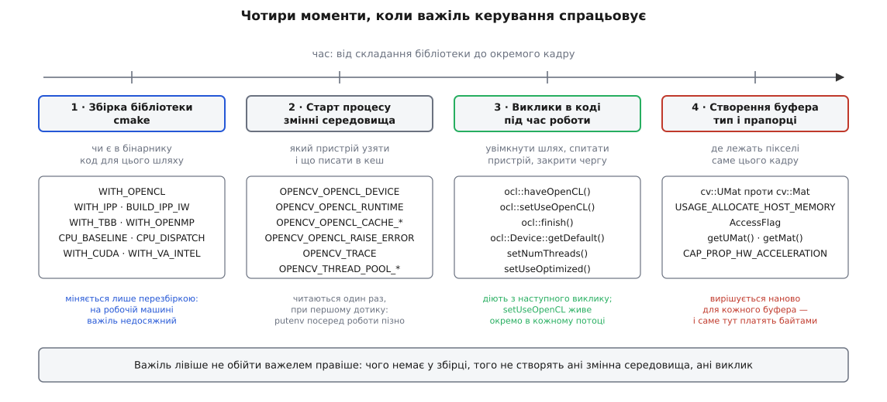

# 🔧 Важелі керування бекендами OpenCV: збірка, середовище, виклик, буфер

Це перелік місць, де взагалі можна вплинути на те, чим саме OpenCV рахуватиме ваш кадр, і згруповано його не за темами, а за **моментом спрацьовування** — бо саме момент вирішує, чи маєте ви ще шанс важелем скористатися. Параметр cmake діє раз і назавжди в готовому бінарнику; змінну середовища читають один раз, на першому дотику; виклик у коді міняє поведінку з наступного рядка; тип буфера вирішує долю одного-єдиного кадру. Важіль лівіше не обходиться важелем правіше: чого немає у збірці, того не створять ані змінна середовища, ані виклик.

Усі імена, значення й сигнатури нижче звірено з гілкою `4.x`.



*Що лівіше стоїть важіль, то ширша його дія і то раніше треба про нього подумати.*

## 1 · Збірка: що взагалі потрапить у бінарник

Параметри задають через `-D<ім'я>=<значення>` під час конфігурації. Стовпчик «типово» — значення за замовчуванням із кореневого `CMakeLists.txt`; там, де воно залежить від платформи, умову вказано.

| Параметр | Типово | Що вмикає |
|---|---|---|
| `WITH_OPENCL` | `ON`, крім Android і `CV_DISABLE_OPTIMIZATION`; недоступний на iOS/WinRT | увесь прозорий шлях: ядра `ocl_*`, простір імен `cv::ocl`, робочий `UMat` |
| `WITH_OPENCLAMDBLAS` | `ON` | clAmdBlas для матричних операцій |
| `WITH_OPENCLAMDFFT` | `ON` | clAmdFft для `dft` |
| `WITH_OPENCL_SVM` | `OFF` | спільна віртуальна пам'ять OpenCL |
| `WITH_IPP` | `ON` на x86/x86_64, крім MinGW | підмінені реалізації Intel IPP |
| `BUILD_IPP_IW` | `ON` на x86/x86_64, крім MinGW | збирати обгортки Integration Wrappers з джерел |
| `WITH_TBB` | `OFF` | `cv::parallel_for_` поверх Intel TBB |
| `WITH_OPENMP` | `OFF` | `cv::parallel_for_` поверх OpenMP |
| `WITH_PTHREADS_PF` | `ON`; параметр видно поза Windows, а також у MinGW | власний пул потоків на pthreads |
| `WITH_CUDA` | `OFF` | модулі `cv::cuda::*` — потрібен ще `opencv_contrib` |
| `WITH_CUDNN` | дорівнює `WITH_CUDA` | cuDNN для модуля `dnn` |
| `WITH_VA` | `ON` на x86-Linux | робота з `VADisplay` і `VASurfaceID` узагалі |
| `WITH_VA_INTEL` | `ON` на x86-Linux | взаємодія VA-API ↔ OpenCL: спільний контекст без копіювання |

Кожен із цих параметрів оголошено з приміткою `VERIFY HAVE_…`: наприкінці конфігурації CMake звіряє, чи ввімкнена опція справді дала відповідну ознаку, і повідомляє про розбіжність. Тому «я поставив `-DWITH_TBB=ON`» ще не означає «TBB підключено» — дивитися треба на підсумковий звіт, а не на командний рядок.

Рушіїв паралелізму може виявитися ввімкнено кілька; тоді вибір робиться всередині бібліотеки за фіксованим порядком, а який саме дістався вашій збірці, каже `opencv_version --threads`.

### Смуга наборів інструкцій

Два параметри розв'язують одну задачу — [векторні інструкції](book:programming/simd-vectorization) на процесорі — але з різних боків.

`CPU_BASELINE` — набір, який компілятор має право вживати **скрізь і без перевірок**. Код із ним потрапляє в кожну функцію безумовно, тож на машині без цих інструкцій бінарник просто впаде.

`CPU_DISPATCH` — набори, для яких обрані місця компілюються **окремими копіями**, а вибір копії робиться під час запуску за фактичними можливостями процесора. Дорожче за розміром файлу, зате один бінарник працює і на старій машині, і на новій.

| Архітектура | `CPU_BASELINE` | `CPU_DISPATCH` |
|---|---|---|
| x86_64 | `SSE3` | `SSE4_1;SSE4_2;AVX;FP16;AVX2;AVX512_SKX` |
| x86 (32 біти) | `SSE2` | `SSE4_1;SSE4_2;AVX;FP16` |
| AArch64 | `DETECT` | `NEON_FP16;NEON_BF16;NEON_DOTPROD` |

Окремий випадок — x86_64 на macOS: там базовим набором типово стоїть `DETECT`.

Крім переліків, обидва параметри розуміють особливі значення: `DETECT` — узяти те, що вміє машина, на якій іде збірка; `NATIVE` (він же `HOST`) — віддати рішення компіляторові через `-march=native`. Обидва роблять бінарник непереносним, тож у дистрибутивах їх не вживають, а в збірці «під себе» вони дають найбільше задарма.

### CUDA

| Параметр | Що означає |
|---|---|
| `WITH_CUDA` | вмикає модулі CUDA; типово `OFF` |
| `OPENCV_EXTRA_MODULES_PATH` | шлях до `opencv_contrib/modules` — від версії 4.0 модулі `cv::cuda::*` живуть саме там |
| `CUDA_ARCH_BIN` | «справжні» архітектури, під які компілювати двійковий код; підтримано запис `BIN(PTX)` |
| `CUDA_ARCH_PTX` | «віртуальні» архітектури, під які лишити проміжний код PTX |
| `CUDA_GENERATION` | покоління замість переліку чисел: `Fermi`, `Kepler`, `Maxwell`, `Pascal`, `Volta`, `Turing`, `Ampere`, `Lovelace`, `Hopper`, `Blackwell`, а також `Auto` (не для крос-компіляції); порожнє значення — збирати під усі |

Різниця між `ARCH_BIN` і `ARCH_PTX` практична: двійковий код працює одразу, а PTX драйвер докомпілює на місці під карту, невідому на час збірки, — повільно на старті, зате бінарник переживе наступне покоління заліза.

### Приклад конфігурації

```bash
cmake -S opencv -B build \
  -DOPENCV_EXTRA_MODULES_PATH=../opencv_contrib/modules \
  -DWITH_OPENCL=ON \
  -DWITH_IPP=ON -DBUILD_IPP_IW=ON \
  -DWITH_TBB=ON \
  -DCPU_BASELINE=SSE4_2 \
  -DCPU_DISPATCH="AVX;AVX2;AVX512_SKX" \
  -DWITH_VA=ON -DWITH_VA_INTEL=ON \
  -DWITH_CUDA=OFF
```

Що з цього вийшло, показує `cv::getBuildInformation()` — той самий текст, що й наприкінці конфігурації. Як улаштована сама збірка й чому модулі роз'їхалися по двох репозиторіях — [будова OpenCV: модулі, версії, як її збирають](book:media-vision/opencv-structure).

## 2 · Середовище: читається один раз, на першому дотику

Змінні середовища бібліотека читає через `cv::utils::getConfigurationParameterBool` і `…String`, а результат майже всюди зберігає у `static const`. Значення обчислюється при першому зверненні до відповідної підсистеми й більше не перечитується, тому виставляти змінну посеред роботи через `putenv` уже пізно: її треба задати **до запуску процесу**.

### Вибір рантайму й пристрою

| Змінна | Тип | Типово | Дія |
|---|---|---|---|
| `OPENCV_OPENCL_RUNTIME` | шлях до файлу або `disabled` | — | яку бібліотеку драйвера завантажити (`OpenCL.dll`, `libOpenCL.so`); значення `disabled` вимикає OpenCL цілком |
| `OPENCV_OPENCL_DEVICE` | рядок або `disabled` | — | яку платформу й пристрій обрати |

Формат `OPENCV_OPENCL_DEVICE` і зразки з коду вибору пристрою:

```
<платформа>:<CPU|GPU|ACCELERATOR|порожньо = GPU/CPU>:<назва пристрою>

AMD:GPU:             перший GPU платформи AMD
AMD:GPU:Tahiti       конкретний пристрій за назвою
:GPU|CPU:            будь-який GPU, а як його немає — CPU
'' = ':' = '::'      те саме, що й попереднє: типовий вибір
disabled             прозорий шлях не вмикати взагалі
```

Типи пристроїв комбінуються через `|`, порожні поля означають «будь-що». Це головний важіль для машини з двома прискорювачами: інтегроване ядро процесора й дискретна карта дають два різні пристрої, і типовий вибір далеко не завжди падає на той, який вам потрібен.

### Кеш скомпільованих ядер

Ядра OpenCL — це текст усередині бібліотеки, який драйвер компілює під час виконання, уже знаючи конкретний пристрій. Готові двійкові ядра лягають у кеш на диску.

| Змінна | Тип | Типово | Дія |
|---|---|---|---|
| `OPENCV_OPENCL_CACHE_ENABLE` | булева | `true` | вмикає кеш ядер |
| `OPENCV_OPENCL_CACHE_WRITE` | булева | `true` | дозволяє писати; `0` робить кеш лише для читання |
| `OPENCV_OPENCL_CACHE_LOCK_ENABLE` | булева | `true` | синхронізація між процесами через файли `.lock` |
| `OPENCV_OPENCL_CACHE_CLEANUP` | булева | `true` | прибирати старі записи самостійно |
| `OPENCV_OPENCL_CACHE_DIR` | тека | підтека `opencl_cache` у кеші OpenCV | де тримати кеш |
| `OPENCV_OPENCL_PROGRAM_CACHE` | число | `0` | обмеження на кількість програм у кеші; `0` — без обмеження |

Каталог обирається викликом `utils::fs::getCacheDirectory("opencl_cache", "OPENCV_OPENCL_CACHE_DIR")`. Два практичні наслідки: у контейнері, де файлова система лише для читання, перші кадри платитимуть за компіляцію **щоразу**, поки не вказати `OPENCV_OPENCL_CACHE_DIR` на змонтований том; а на мережевій файловій системі блокувальні файли — типове місце, де процес зависає на старті, і рятує `OPENCV_OPENCL_CACHE_LOCK_ENABLE=0`.

### Діагностика

| Змінна | Тип | Типово | Дія |
|---|---|---|---|
| `OPENCV_OPENCL_RAISE_ERROR` | булева | `false` | кинути виняток, якщо підготовка ядра не вдалася |
| `OPENCV_OPENCL_ABORT_ON_BUILD_ERROR` | булева | `false` | обірвати процес, якщо ядро не скомпілювалося |
| `OPENCV_OPENCL_VALIDATE_BINARY_PROGRAMS` | булева | `false` | перевіряти двійкові ядра, взяті з кешу |
| `OPENCV_OPENCL_BUILD_EXTRA_OPTIONS` | рядок | — | додаткові ключі компіляторові ядер |
| `OPENCV_TRACE` | булева | `false` | увімкнути внутрішнє трасування |
| `OPENCV_TRACE_LOCATION` | рядок | `OpenCVTrace` | ім'я файлу сліду (`${name}-$03d.txt`) |
| `OPENCV_TRACE_SYNC_OPENCL` | булева | `false` | чекати на завершення ядер під час трасування |
| `OPENCV_TRACE_DEPTH_OPENCV` | число | `1` | глибина вкладеності в сліді |
| `OPENCV_TRACE_MAX_CHILDREN` | число | `1000` | стеля кількості дочірніх записів |

> 🔧 **Навіщо це.** `OPENCV_OPENCL_RAISE_ERROR=1` — найцінніша змінна з усього переліку. Типово невдала спроба запустити ядро нічого не повідомляє: функція мовчки доробляє роботу процесорною гілкою, і зовні все правильно, тільки повільніше, ніж без прискорювача взагалі. Ця змінна перетворює тихий відкат на виняток із назвою функції, тож ви бачите не «щось не так зі швидкістю», а конкретне місце. Тримати її ввімкненою в бою не варто — на робочій машині це відмова там, де могла бути повільна, але правильна відповідь.
>
> Друга половина пари — `OPENCV_TRACE_SYNC_OPENCL=1`. Без неї слід міряє час **постановки ядра в чергу**, а не час обчислення, і всі рядки виглядають однаково дешевими.

### Поведінка буферів

| Змінна | Тип | Типово | Дія |
|---|---|---|---|
| `OPENCV_OPENCL_BUFFER_FORCE_MAPPING` | булева | `false` | завжди `clEnqueueMapBuffer` |
| `OPENCV_OPENCL_BUFFER_FORCE_COPYING` | булева | `false` | завжди `clEnqueueReadBuffer` / `clEnqueueWriteBuffer` |
| `OPENCV_OPENCL_ENABLE_MEM_USE_HOST_PTR` | булева | `true` | створювати буфер поверх наявної системної пам'яті |
| `OPENCV_OPENCL_ALIGNMENT_MEM_USE_HOST_PTR` | число | `4` | потрібне вирівнювання для попереднього |
| `OPENCV_OPENCL_BUFFERPOOL_LIMIT` | число | `1 << 27` на Intel, `0` інакше | скільки пам'яті тримає пул буферів |
| `OPENCV_OPENCL_HOST_PTR_BUFFERPOOL_LIMIT` | число | — | те саме для буферів над системною пам'яттю |
| `OPENCV_OPENCL_DEVICE_MAX_WORK_GROUP_SIZE` | число | `0` | штучно зменшити `maxWorkGroupSize` |
| `OPENCV_OPENCL_FORCE` | булева | `false` | запускати ядро навіть коли звичайні умови не виконані |
| `OPENCV_OPENCL_PERF_CHECK_BYPASS` | булева | `false` | те саме, коли не виконано умови за швидкодією |
| `OPENCV_OPENCL_DISABLE_BUFFER_RECT_OPERATIONS` | булева | `true` на Apple, `false` інакше | обхід для нерозривних завантажень |

Перша пара — готовий експеримент для інтегрованої графіки. Питання «чи справді тут відображення, а не прихована копія» не має теоретичної відповіді: залежить від драйвера й вирівнювання. Зате примусивши спочатку `FORCE_MAPPING=1`, а потім `FORCE_COPYING=1` і вимірявши обидва прогони, ви дізнаєтеся, що робить бібліотека сама і чи є з цього користь.

### Потоки

| Змінна | Тип | Типово | Дія |
|---|---|---|---|
| `OPENCV_FOR_THREADS_NUM` | число | `0` | кількість потоків для паралельних ділянок |
| `OPENCV_THREAD_POOL_ACTIVE_WAIT_PAUSE_LIMIT` | число | `16` | налаштування пулу на pthreads |
| `OPENCV_THREAD_POOL_ACTIVE_WAIT_WORKER` | число | `2000` | скільки робітник крутиться в активному очікуванні перед сном |
| `OPENCV_THREAD_POOL_ACTIVE_WAIT_MAIN` | число | `10000` | те саме для головного потоку |
| `OPENCV_THREAD_POOL_ACTIVE_WAIT_THREADS_LIMIT` | число | `0` | стеля кількості потоків в активному очікуванні |

Останні чотири стосуються **лише** власного пулу на pthreads: зі збіркою на TBB чи OpenMP вони не роблять нічого. Активне очікування означає, що потік між порціями роботи не засинає, а крутить цикл — на восьмиядерному сервері це виграш у затримці, на чотириядерному одноплатнику це відібрані в декодера такти.

### Відеовхід

| Змінна | Тип | Типово | Дія |
|---|---|---|---|
| `OPENCV_FFMPEG_CAPTURE_OPTIONS` | рядок | — | додаткові опції бекенду FFmpeg для `VideoCapture` |
| `OPENCV_FFMPEG_THREADS` | число | — | кількість потоків FFmpeg |
| `OPENCV_FFMPEG_DEBUG` | булева | `false` | повідомлення самого FFmpeg |
| `OPENCV_VIDEOIO_DEBUG` | булева | `false` | повідомлення `VideoCapture` і `VideoWriter` |
| `OPENCV_VIDEOIO_MSMF_ENABLE_HW_TRANSFORMS` | булева | `true` | апаратні перетворення (DXVA) у MediaFoundation |

## 3 · Виклики: перемикачі й запити під час роботи

### Прозорий шлях

```cpp
bool cv::ocl::haveOpenCL();              // чи знайдено бібліотеку драйвера (глобально)
bool cv::ocl::useOpenCL();               // чи ввімкнено шлях у ЦЬОМУ потоці
void cv::ocl::setUseOpenCL(bool flag);   // ввімкнути/вимкнути в ЦЬОМУ потоці
void cv::ocl::finish();                  // те саме, що Queue::getDefault().finish()
bool cv::ocl::haveSVM();
bool cv::ocl::haveAmdBlas();
bool cv::ocl::haveAmdFft();
void cv::ocl::getPlatfomsInfo(std::vector<cv::ocl::PlatformInfo>& platform_info);
```

Дві незручні дрібниці, за які регулярно платять годинами.

Перша: прапорець «вживати прозорий шлях» лежить у **потоковій пам'яті** (`CoreTLSData`), а не в глобальній змінній. `setUseOpenCL(false)` у головному потоці нічого не каже робітникам, створеним після цього, — кожен новий потік визначає своє значення сам. Тому «я вимкнув, а воно все одно рахує на прискорювачі» — це майже завжди потік, до якого виклик не дійшов.

Друга: у назві `getPlatfomsInfo` пропущено літеру. Це не помилка тексту, а справжня назва в заголовку, збережена задля сумісності.

### Пристрій

```cpp
static const cv::ocl::Device& cv::ocl::Device::getDefault();
static cv::ocl::Device        cv::ocl::Device::fromHandle(void* d);
```

Запити, які справді змінюють рішення:

| Виклик | Тип | Навіщо |
|---|---|---|
| `name()`, `vendorName()` | `String` | яке саме залізо обрано — єдиний надійний спосіб побачити, що обрано не те |
| `type()` | `int` | `TYPE_CPU = 1<<1`, `TYPE_GPU = 1<<2`, `TYPE_ACCELERATOR = 1<<3`, а також `TYPE_DGPU` і `TYPE_IGPU` — дискретна проти інтегрованої |
| `hostUnifiedMemory()` | `bool` | чи пам'ять фізично спільна з процесором |
| `globalMemSize()` | `size_t` | уся пам'ять пристрою |
| `maxMemAllocSize()` | `size_t` | стеля **одного** буфера — часто чверть попереднього |
| `localMemSize()`, `maxWorkGroupSize()` | `size_t` | межі, у які мусить укластися ядро |
| `maxComputeUnits()`, `maxClockFrequency()` | `int` | груба оцінка потужності |
| `hasFP64()`, `hasFP16()` | `bool` | без подвійної точності все на `CV_64F` тихо піде процесором |
| `imageSupport()`, `imageFromBufferSupport()` | `bool` | чи вміє пристрій образи OpenCL (`cl_image`) — від цього залежить `convertFromImage` |
| `image2DMaxWidth()`, `image2DMaxHeight()` | `size_t` | стеля розміру такого образа |
| `memBaseAddrAlign()` | `int` | вирівнювання, без якого відображення вироджується в копію |
| `extensions()`, `isExtensionSupported(name)` | `String`, `bool` | наявність `cl_intel_va_api_media_sharing` вирішує долю взаємодії з VA-API |
| `OpenCLVersion()`, `OpenCL_C_Version()`, `driverVersion()` | `String` | версії, за якими шукають відомі вади драйвера |
| `isIntel()`, `isAMD()`, `isNVidia()` | `bool` | обхідні шляхи під конкретного постачальника |

> 🔧 **Навіщо це.** `maxMemAllocSize()` — не те саме, що `globalMemSize()`, і саме на цьому розходженні падають піраміди й великі проміжні буфери. Пристрій із чотирма гігабайтами пам'яті часто не дає виділити одним шматком більше за гігабайт: перевірка розміру перед запуском ядра не проходить, і функція спокійно повертається на процесорну гілку. Зовні це виглядає як «на великих кадрах прискорення чомусь зникає».

Перелік усього, що видно, дає `PlatformInfo`: `name()`, `vendor()`, `version()`, `versionMajor()`, `versionMinor()`, `deviceNumber()`, `getDevice(Device&, int)`.

### Контекст і черга

```cpp
static cv::ocl::Context& cv::ocl::Context::getDefault(bool initialize = true);
static cv::ocl::Context  cv::ocl::Context::fromHandle(void* context);
static cv::ocl::Context  cv::ocl::Context::fromDevice(const cv::ocl::Device& device);
static cv::ocl::Context  cv::ocl::Context::create(const std::string& configuration);
void*             cv::ocl::Context::ptr() const;
size_t            cv::ocl::Context::ndevices() const;
cv::ocl::Device&  cv::ocl::Context::device(size_t idx) const;
bool              cv::ocl::Context::useSVM() const;
void              cv::ocl::Context::setUseSVM(bool enabled);

static cv::ocl::Queue& cv::ocl::Queue::getDefault();
const cv::ocl::Queue&  cv::ocl::Queue::getProfilingQueue() const;
void                   cv::ocl::Queue::finish();
void*                  cv::ocl::Queue::ptr() const;
bool                   cv::ocl::Queue::create(const cv::ocl::Context& c = cv::ocl::Context(),
                                              const cv::ocl::Device&  d = cv::ocl::Device());

void cv::ocl::attachContext(const cv::String& platformName, void* platformID,
                            void* context, void* deviceID);
```

`ptr()` віддає сирий описувач (`cl_context`, `cl_command_queue`) — це вихід у чужий код, який працює з OpenCL напряму. Зворотний вхід — `attachContext`: бібліотека починає жити в **уже наявному** контексті замість того, щоб створювати свій. Що таке контекст, черга команд і ядро — [OpenCL: контекст, черга команд, ядра й буфери](book:programming/opencl-compute-model); практичний наслідок простий: буфер належить контексту, і два різні контексти обмінюються даними лише через системну пам'ять, скільки б «взаємодії» не було в назвах функцій.

Секундомір на боці прискорювача:

```cpp
class cv::ocl::Timer {
public:
    Timer(const cv::ocl::Queue& q);
    void   start();
    void   stop();
    uint64 durationNS() const;
};
```

Конструктор бере чергу — саме на ній секундомір і міряє, тому передавати треба ту, у яку йде робота; окрему чергу з увімкненим профілюванням дає `Queue::getDefault().getProfilingQueue()`. Простіший і надійніший спосіб, який не залежить від профілювальних можливостей драйвера, — обгородити ділянку явним спорожненням черги:

```cpp
cv::ocl::finish();                                   // прибрати хвіст попередньої роботи
int64 t0 = cv::getTickCount();
cv::GaussianBlur(u_src, u_dst, {5, 5}, 1.5);
cv::ocl::finish();                                   // дочекатися саме цього ядра
double ms = (cv::getTickCount() - t0) * 1000.0 / cv::getTickFrequency();
```

### Процесорний бік

```cpp
void          cv::setNumThreads(int nthreads);   // 0 — послідовно; від'ємне — повернути типове
int           cv::getNumThreads();
int           cv::getNumberOfCPUs();
void          cv::setUseOptimized(bool onoff);
bool          cv::useOptimized();
bool          cv::checkHardwareSupport(int feature);
cv::String    cv::getHardwareFeatureName(int feature);
const cv::String& cv::getBuildInformation();
cv::String    cv::getVersionString();

bool       cv::ipp::useIPP();
void       cv::ipp::setUseIPP(bool flag);
cv::String cv::ipp::getIppVersion();
bool       cv::ipp::useIPP_NotExact();
void       cv::ipp::setUseIPP_NotExact(bool flag);
```

`setUseOptimized(false)` вимикає під час виконання і диспетчеризовані копії функцій, і підмінені реалізації — це важіль вимірювання, а не роботи: різниця «увімкнено проти вимкнено» показує, скільки процесорна збірка вже дає задарма.

`setUseIPP_NotExact` виділено окремо тому, що частина реалізацій IPP дає результат, який у межах округлення розходиться з еталонною гілкою. Типово такі функції не вживають; увімкнути їх — свідома угода «трохи швидше в обмін на неточну відповідність».

### Командний рядок

```
opencv_version                 версія бібліотеки
opencv_version --verbose       увесь cv::getBuildInformation()
opencv_version --opencl        платформи, пристрої й обраний типово (cv::dumpOpenCLInformation)
opencv_version --hw            виявлені набори інструкцій (cv::checkHardwareSupport)
opencv_version --hw=0          лише перелік доступних ознак
opencv_version --threads       рушій паралелізму й кількість активних потоків
```

## 4 · Типи й прапорці: доля конкретного буфера

### Прапорці доступу

```cpp
enum AccessFlag { ACCESS_READ  = 1 << 24, ACCESS_WRITE = 1 << 25,
                  ACCESS_RW    = 3 << 24, ACCESS_MASK  = ACCESS_RW,
                  ACCESS_FAST  = 1 << 26 };
CV_ENUM_FLAGS(AccessFlag)
```

Задум очевидний: попросити дані лише на читання — і після роботи їх не треба відсилати назад. Але в гілці `4.x` і `UMat::getMat`, і `Mat::getUMat` першою ж дією роблять `accessFlags |= ACCESS_RW`. Заявлений намір ігнорують, обмін відбувається в обидва боки, тож економію на цьому прапорці планувати не можна.

### Прапорці використання

```cpp
enum UMatUsageFlags {
    USAGE_DEFAULT                = 0,
    USAGE_ALLOCATE_HOST_MEMORY   = 1 << 0,
    USAGE_ALLOCATE_DEVICE_MEMORY = 1 << 1,
    USAGE_ALLOCATE_SHARED_MEMORY = 1 << 2,
    __UMAT_USAGE_FLAGS_32BIT     = 0x7fffffff
};
```

Приймають їх конструктори `UMat` (`UMat(rows, cols, type, usageFlags)`, `UMat(size, type, usageFlags)`, `UMat(ndims, sizes, type, usageFlags)`), метод `create` і `Mat::getUMat`. `USAGE_ALLOCATE_HOST_MEMORY` просить буфер, доступний і процесорові: на інтегрованій графіці це шлях до відображення замість копії, на дискретній карті — спосіб зробити повільно.

### Прапорці керівного блоку

```cpp
enum UMatData::MemoryFlag {
    COPY_ON_MAP          = 1,
    HOST_COPY_OBSOLETE   = 2,
    DEVICE_COPY_OBSOLETE = 4,
    TEMP_UMAT            = 8,
    TEMP_COPIED_UMAT     = 24,
    USER_ALLOCATED       = 32,
    DEVICE_MEM_MAPPED    = 64,
    ASYNC_CLEANUP        = 128
};
```

| Прапорець | Що означає |
|---|---|
| `HOST_COPY_OBSOLETE` | у системній пам'яті лежить застаріле; наступний доступ із процесора забере дані з пристрою |
| `DEVICE_COPY_OBSOLETE` | застаріле лежить на пристрої; наступне ядро дочекається відсилання |
| `TEMP_UMAT` | буфер створено тимчасово, поверх наявного системного |
| `TEMP_COPIED_UMAT` | те саме, але зі справжнім копіюванням; знищення тягне зворотну копію |
| `USER_ALLOCATED` | пам'ять чужа, бібліотека її не звільняє |
| `DEVICE_MEM_MAPPED` | пам'ять пристрою відображено, а не скопійовано |
| `COPY_ON_MAP` | відображення реалізовано копіюванням |
| `ASYNC_CLEANUP` | звільнення буфера відкладене, поза поточним викликом |

Значення `TEMP_COPIED_UMAT = 24` — це `8 | 16`, тобто воно **містить** `TEMP_UMAT`. Перевірка `flags & TEMP_UMAT` істинна для обох станів, і код, який на неї спирається, мусить це враховувати.

### Переходи між світами

```cpp
cv::UMat cv::Mat::getUMat(AccessFlag accessFlags,
                          UMatUsageFlags usageFlags = USAGE_DEFAULT) const;
cv::Mat  cv::UMat::getMat(AccessFlag flags) const;
void*    cv::UMat::handle(AccessFlag accessFlags) const;
void     cv::UMat::ndoffset(size_t* ofs) const;
```

| Виклик | Що дає | Ціна й інваріант |
|---|---|---|
| `Mat::getUMat` | заголовок `UMat` над тими самими даними | якщо `Mat` — [виріз усередині більшого буфера](book:media-vision/mat-views-no-copy), спершу на пристрій їде **весь батьківський кадр** |
| `UMat::getMat` | заголовок `Mat` із системною адресою | відображення або копія плюс блокування потоку до спорожнення черги; пересилання відбувається лише для **першого** заголовка `Mat` |
| `UMat::handle` | сирий `cl_mem` для чужого коду | `CV_Assert(u->refcount == 0)` — поки живий бодай один заголовок `Mat`, описувача не дістати; з `ACCESS_WRITE` системна копія одразу оголошується застарілою |
| `UMat::ndoffset` | зміщення виду в багатовимірному буфері | потрібне, коли сирий описувач віддають разом із координатами вирізу |

### Чужі буфери й чужі контексти

```cpp
void cv::ocl::convertFromBuffer(void* cl_mem_buffer, size_t step,
                                int rows, int cols, int type, cv::UMat& dst);
void cv::ocl::convertFromImage(void* cl_mem_image, cv::UMat& dst);
```

Обидві функції роблять заголовок `UMat` **над чужою пам'яттю**: буфер лишається чужим, бібліотека не знає, коли його звільнять, і не звільняє сама. Наслідок такий самий, як у `Mat` над сирим покажчиком, — заголовок може пережити дані, тож або обробляйте кадр тут-таки, або клонуйте. `convertFromImage` до того ж вимагає від пристрою підтримки образів (`imageSupport()`).

### VA-API

```cpp
cv::ocl::Context& cv::va_intel::ocl::initializeContextFromVA(VADisplay display,
                                                             bool tryInterop = true);
void cv::va_intel::convertToVASurface(VADisplay display, cv::InputArray src,
                                      VASurfaceID surface, cv::Size size);
void cv::va_intel::convertFromVASurface(VADisplay display, VASurfaceID surface,
                                        cv::Size size, cv::OutputArray dst);
```

Три речі, які тут ловлять на гарячому.

**Простори імен різні.** `initializeContextFromVA` живе в `cv::va_intel::ocl`, а обидві `convert…` — просто в `cv::va_intel`.

**Формати жорсткі.** З боку OpenCV це завжди `CV_8UC3` — BGR: `convertToVASurface` перевіряє тип джерела й збіг розмірів, `convertFromVASurface` створює приймач саме таким. З боку VA-API підтримано поверхні `VA_FOURCC_NV12` і `VA_FOURCC_YV12`; перетворення площин у BGR і назад робить сама функція. Чому декодер віддає саме NV12 і що це означає для розкладки байтів — [формати пікселів і буферів зображення](book:algorithms/pixel-formats).

**Взаємодія може мовчки не ввімкнутися.** При `tryInterop = true` функція шукає платформу з розширенням `cl_intel_va_api_media_sharing` і будує контекст із властивістю `CL_CONTEXT_VA_API_DISPLAY_INTEL`. Якщо розширення немає — або якщо ви самі передали `tryInterop = false` — повертається звичайний `Context::getDefault(true)`, і подальші виклики працюють через повільне копіювання. Помилки при цьому немає жодної. Перевірити стан можна єдиним способом: `Device::getDefault().isExtensionSupported("cl_intel_va_api_media_sharing")`.

### Апаратне декодування у `VideoCapture`

```cpp
cv::VideoCapture(const cv::String& filename, int apiPreference,
                 const std::vector<int>& params);
cv::VideoCapture(int index, int apiPreference, const std::vector<int>& params);
bool open(const cv::String& filename, int apiPreference,
          const std::vector<int>& params);
```

| Властивість | Значення | Дія |
|---|---|---|
| `CAP_PROP_HW_ACCELERATION` | `50` | тип апаратного прискорення (див. нижче) |
| `CAP_PROP_HW_DEVICE` | `51` | номер пристрою, коли їх кілька; нумерація залежить від типу прискорення |
| `CAP_PROP_HW_ACCELERATION_USE_OPENCL` | `52` | ненульове значення створює контекст OpenCL, прив'язаний до контексту прискорення декодера, — саме він робить читання просто в `UMat` дешевим |
| `VIDEOWRITER_PROP_HW_ACCELERATION` | `6` | те саме для `VideoWriter` |
| `VIDEOWRITER_PROP_HW_DEVICE` | `7` | |
| `VIDEOWRITER_PROP_HW_ACCELERATION_USE_OPENCL` | `8` | |

```cpp
enum VideoAccelerationType {
    VIDEO_ACCELERATION_NONE  = 0,   // програмна обробка
    VIDEO_ACCELERATION_ANY   = 1,   // будь-яке доступне, з відкатом на програмне
    VIDEO_ACCELERATION_D3D11 = 2,
    VIDEO_ACCELERATION_VAAPI = 3,
    VIDEO_ACCELERATION_MFX   = 4,   // libmfx: Intel Media SDK / oneVPL
    VIDEO_ACCELERATION_DRM   = 5    // Raspberry Pi 4
};
```

Усі три властивості позначено як **open-only**: задати їх можна лише вектором `params` у конструкторі чи в `open`, а `cap.set(...)` після відкриття не робить нічого й помилки не повертає. Читати ж їх можна будь-коли — і це єдиний спосіб дізнатися, що дісталося насправді. Що вміє віддати декодер із того боку — [апаратне декодування: VA-API, NVDEC, V4L2, MediaCodec](book:media-vision/hardware-decode-elements).

### Мінімальний робочий виклик

```cpp
#include <opencv2/core.hpp>
#include <opencv2/core/ocl.hpp>
#include <opencv2/imgproc.hpp>
#include <opencv2/videoio.hpp>
#include <cstdio>

int main()
{
    if (!cv::ocl::haveOpenCL())
        std::printf("бібліотеки драйвера немає — усе піде процесором\n");

    const cv::ocl::Device& d = cv::ocl::Device::getDefault();
    std::printf("%s | %s | спільна памʼять: %d | один буфер до %zu МБ\n",
                d.name().c_str(), d.OpenCLVersion().c_str(),
                (int)d.hostUnifiedMemory(), d.maxMemAllocSize() >> 20);

    cv::VideoCapture cap("in.mp4", cv::CAP_FFMPEG, {
        cv::CAP_PROP_HW_ACCELERATION,            cv::VIDEO_ACCELERATION_ANY,
        cv::CAP_PROP_HW_DEVICE,                  0,
        cv::CAP_PROP_HW_ACCELERATION_USE_OPENCL, 1
    });
    if (!cap.isOpened())
        return 1;
    std::printf("дісталося прискорення: %d\n",
                (int)cap.get(cv::CAP_PROP_HW_ACCELERATION));

    cv::UMat frame, gray, blurred;
    for (int i = 0; cap.read(frame); ++i)
    {
        cv::cvtColor(frame, gray, cv::COLOR_BGR2GRAY);
        cv::GaussianBlur(gray, blurred, {5, 5}, 1.5);

        if (i == 10)                       // перші кадри платять за компіляцію ядер
        {
            cv::ocl::finish();
            int64 t0 = cv::getTickCount();
            cv::GaussianBlur(gray, blurred, {5, 5}, 1.5);
            cv::ocl::finish();
            std::printf("розмиття: %.2f мс\n",
                        (cv::getTickCount() - t0) * 1000.0 / cv::getTickFrequency());
        }
    }
    return 0;
}
```

Кадр тут не покидає пам'яті прискорювача від декодера до кінця обробки: `CAP_PROP_HW_ACCELERATION_USE_OPENCL` віддає бібліотеці контекст декодера, а приймачем `read` стоїть `UMat`. Які формати при цьому можна віддати без перетворення — [стик із відеоконвеєром: формати пікселів і передача кадру](book:media-vision/frame-interop).

## Порядок перекриття

Важелі не рівноправні: кожен наступний діє лише в тому, що дозволив попередній.

1. `WITH_OPENCL=OFF` у збірці — функції `cv::ocl` лишаються заглушками, `UMat` компілюється, але завжди живе в системній пам'яті. Ознака: у `getBuildInformation()` рядок `OpenCL: NO`.
2. `OPENCV_OPENCL_RUNTIME=disabled` — бібліотеку драйвера не вантажать; `haveOpenCL()` дає `false`.
3. `OPENCV_OPENCL_DEVICE=disabled` — драйвер знайдено, пристрій не обрано.
4. `setUseOpenCL(false)` — шлях вимкнено, **але тільки в поточному потоці**.
5. Тип аргументу `Mat` замість `UMat` — умова на кшталт `_dst.isUMat()` не виконується, і гілку для прискорювача не розглядають узагалі.

## Діагностична драбина

Порядок дій, коли «прискорення не працює» або «стало гірше»:

1. `opencv_version --verbose` — чи є в збірці `OpenCL: YES`, IPP і рушій паралелізму. Немає — далі шукати нічого.
2. `opencv_version --opencl` — які платформи й пристрої видно і що обрано типово.
3. `opencv_version --hw` і `--threads` — чи використано набори інструкцій і скільки потоків реально роздано.
4. У програмі: `haveOpenCL()`, `useOpenCL()`, `Device::getDefault().name()` — і саме в тому потоці, який обробляє кадри.
5. `OPENCV_OPENCL_RAISE_ERROR=1` — тихий відкат на процесор стає винятком з іменем функції.
6. `OPENCV_TRACE=1` разом із `OPENCV_TRACE_SYNC_OPENCL=1` — слід із чесним часом замість часу постановки в чергу.
7. Два прогони, з `setUseOpenCL(false)` і без, після прогріву десятком кадрів — точна відповідь на питання, чи прискорювач узагалі щось дав.
