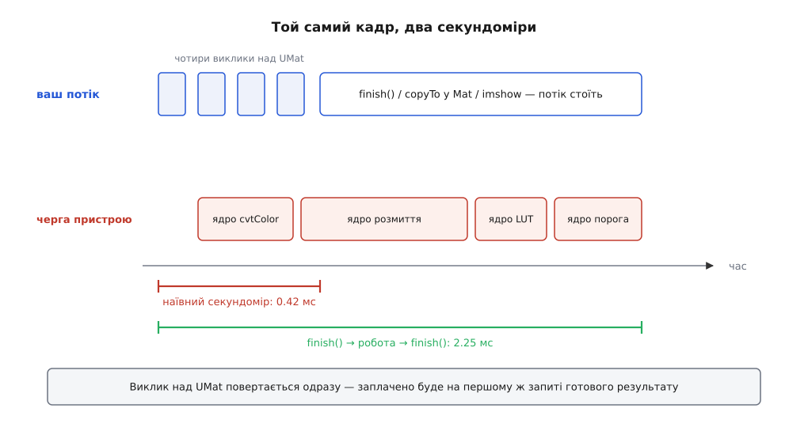
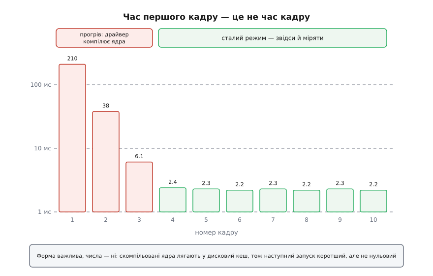

# ⚙️ Конвеєр на UMat, який не бреше про свій час

Це робоча програма на C++: вона проганяє той самий ланцюжок обробки кадру чотирма маршрутами, міряє кожен так, щоб число справді означало час кадру, і тут-таки друкує, скільки байтів за кадр перетнуло межу між системною пам'яттю й пам'яттю прискорювача. Потрібна вона тому, що звичайний секундомір навколо коду на `UMat` показує зовсім не те, що людина думає, — і рішення «прискорення не працює, вертаємо `Mat`» зазвичай ухвалюють на підставі числа, яке до кадру стосунку не має.

## Ланцюжок, на якому все видно

Беремо найкоротший ланцюжок, у якому стається все цікаве: **BGR → сірий**, **розмиття 5×5**, **крива яскравості поточково**, **поріг**. Три з чотирьох кроків — бібліотечні, у них є гілка для прискорювача. Четвертий, криву, ми напишемо власним циклом — і саме він створить у середині ланцюжка межу, якої в коді не видно.

Маршрути такі:

1. **усе на `Mat`** — межі не існує взагалі, це точка відліку;
2. **усе на `UMat`**, крива — бібліотечним `cv::LUT`, у якого гілка на пристрої є;
3. **усе на `UMat`**, крива — нашим циклом: кадр посеред ланцюжка їде на хост і назад;
4. **усе на `UMat`**, крива — власним ядром OpenCL: межа зникає знову.

Другий і третій маршрути рахують той самий результат і відрізняються рівно одним: скільки разів кадр перетнув межу. Четвертий показує, що робити, коли потрібної операції в бібліотеці немає й переписати крок нема на що.

## Три речі, через які секундомір бреше

**Перше — черга асинхронна.** Виклик над `UMat` ставить ядро в чергу команд і повертає керування; на цей момент результату ще немає. Секундомір навколо чотирьох таких викликів виміряє час постановки в чергу — десяті частки мілісекунди незалежно від роздільності кадру. Заплатите ви пізніше, на першому ж запиті готового результату, і виглядатиме це так, наче вся програма стоїть у `imshow`.



*Наївна дужка міряє постановку в чергу, чесна — роботу; різниця між ними на цій машині п'ятикратна.*

**Друге — перші кадри інші за всі наступні.** Ядра OpenCL живуть у бібліотеці вихідним текстом, а компілює їх драйвер під час виконання, уже знаючи конкретний пристрій. Перший виклик кожної функції платить за цю компіляцію.

**Третє — межі приховані.** Перетин не має свого імені у вашому коді: він народжується всередині `copyTo`, `getMat`, `imshow`, звернення до `.at<>()`. Тому байти, що перетнули шину, доводиться рахувати вручну — на кожному місці, де ви свідомо переходите з одного світу в другий.

Із цих трьох спостережень і складається каркас виміру: закривати чергу до й після, викидати кадри прогріву, рахувати перетини явно. Загальна дисципліна вимірювання, від якої тут нікуди не подітися — [мікробенчмарк: як не збрехати собі виміром](book:programming/microbenchmarking): прогрів, багато повторів, медіана замість середнього, той самий вхід для всіх варіантів.

## Каркас: секундомір, синхронізація, лічильник байтів

```cpp
// umat_boundaries.cpp — один ланцюжок, чотири маршрути, чесний вимір.
//
//   g++ -O2 -std=c++17 umat_boundaries.cpp -o umat_boundaries \
//       $(pkg-config --cflags --libs opencv4)

#include <opencv2/core.hpp>
#include <opencv2/core/ocl.hpp>
#include <opencv2/imgproc.hpp>

#include <algorithm>
#include <cstdint>
#include <cstdio>
#include <string>
#include <vector>

// Мілісекунди між двома відліками. Переводимо саме різницю: лічильник тіків
// росте від старту машини, і множити його на 1000.0 — втрачати молодші розряди.
static double msBetween(int64_t a, int64_t b)
{
    return (b - a) * 1000.0 / cv::getTickFrequency();
}

// Закрити чергу пристрою. Без цього виклику будь-яке число нижче — вигадка.
static void syncDevice()
{
    if (cv::ocl::useOpenCL())
        cv::ocl::finish();
}

// Скільки байтів і скільки разів кадр перетнув межу за один прохід.
struct Wall {
    long long up = 0, down = 0;
    int crossings = 0;

    void toDevice(const cv::Mat& m)
    { up   += (long long)m.total() * m.elemSize(); ++crossings; }

    void toHost(const cv::UMat& u)
    { down += (long long)u.total() * u.elemSize(); ++crossings; }

    long long total() const { return up + down; }
};

// Єдині два місця в програмі, де межу перетинають свідомо.
static void upload(const cv::Mat& src, cv::UMat& dst, Wall& w)
{
    src.copyTo(dst);            // Mat::copyTo у UMat — це upload у буфер пристрою
    w.toDevice(src);
}

static void download(const cv::UMat& src, cv::Mat& dst, Wall& w)
{
    src.copyTo(dst);            // UMat::copyTo у Mat — це download із буфера
    w.toHost(src);
}
```

`copyTo` тут не випадковий. Коли приймач — `UMat`, `Mat::copyTo` не робить проміжного заголовка й не відображає буфер у адресний простір процесу: він створює приймач потрібного розміру й віддає байти прямо в `upload` алокатора. Зворотний бік симетричний. Це найдешевший спосіб перейти межу, і — що важливіше для нас — єдине місце, де перехід можна порахувати.

## Кроки ланцюжка

Крива яскравості — одна таблиця на 256 значень, спільна для всіх маршрутів: інакше маршрути рахували б різне й порівнювати їх не було б сенсу.

```cpp
static uchar    g_curve[256];
static cv::UMat g_curveU;              // та сама таблиця для гілки на пристрої

static void buildCurve()
{
    for (int i = 0; i < 256; ++i) {
        double x = i / 255.0;
        double y = x * x * (3.0 - 2.0 * x);        // м'яка S-подібна крива
        g_curve[i] = cv::saturate_cast<uchar>(y * 255.0);
    }
    cv::Mat(1, 256, CV_8UC1, g_curve).copyTo(g_curveU);
}

// Крок, у якого гілки на прискорювачі немає за визначенням: наш власний цикл.
static void curveOnHost(const cv::Mat& src, cv::Mat& dst)
{
    CV_Assert(src.type() == CV_8UC1);
    dst.create(src.size(), src.type());
    for (int y = 0; y < src.rows; ++y) {
        const uchar* s = src.ptr<uchar>(y);
        uchar*       d = dst.ptr<uchar>(y);
        for (int x = 0; x < src.cols; ++x)
            d[x] = g_curve[s[x]];
    }
}
```

Той самий крок ядром OpenCL. Це найкоротший приклад того, як узагалі виглядає власне ядро в термінах OpenCV; що таке контекст, черга й глобальний розмір задачі, розібрано окремо — [OpenCL: контекст, черга команд, ядра й буфери](book:programming/opencl-compute-model).

```c
__kernel void applyCurve(__global const uchar* srcptr, int src_step, int src_offset,
                         __global uchar* dstptr, int dst_step, int dst_offset,
                         int dst_rows, int dst_cols,
                         __global const uchar* curve)
{
    int x = get_global_id(0);
    int y = get_global_id(1);
    if (x < dst_cols && y < dst_rows)
        dstptr[mad24(y, dst_step, x + dst_offset)] =
            curve[srcptr[mad24(y, src_step, x + src_offset)]];
}
```

Список параметрів ядра не довільний: його диктують помічники `KernelArg`. `ReadOnlyNoSize` розгортається у трійку «покажчик, крок, зсув», `WriteOnly` — у п'ятірку «покажчик, крок, зсув, рядки, стовпці», `PtrReadOnly` — в один покажчик. Порядок аргументів у ядрі мусить точно повторювати порядок помічників у `args`.

```cpp
static const char* kCurveSrc = R"CLC(
  ... текст ядра з попереднього блоку ...
)CLC";

static bool curveOnDevice(const cv::UMat& src, cv::UMat& dst)
{
    // Останній аргумент — ключ, під яким скомпільоване ядро ляже в дисковий кеш.
    // Змінили текст ядра — змініть і ключ, інакше ризикуєте дістати стару збірку.
    static const cv::ocl::ProgramSource prog("app", "curve", kCurveSrc, "curve-v1");

    cv::ocl::Kernel k("applyCurve", prog);
    if (k.empty())
        return false;                      // драйвер не зібрав — чесно кажемо про це

    dst.create(src.size(), src.type());
    k.args(cv::ocl::KernelArg::ReadOnlyNoSize(src),
           cv::ocl::KernelArg::WriteOnly(dst),
           cv::ocl::KernelArg::PtrReadOnly(g_curveU));

    size_t global[2] = { (size_t)src.cols, (size_t)src.rows };
    return k.run(2, global, nullptr, /*sync=*/false);
}
```

`sync = false` — навмисно: ядро йде в чергу й повертає керування, як і решта викликів у маршруті. Синхронізуватися ми будемо в одному місці й свідомо.

## Чотири маршрути

```cpp
using Route = void (*)(const cv::Mat& in, cv::OutputArray out, Wall& w);

// 1. Усе на Mat: межі не існує.
static void routeHost(const cv::Mat& in, cv::OutputArray out, Wall&)
{
    cv::Mat gray, blur, curved;
    cv::cvtColor(in, gray, cv::COLOR_BGR2GRAY);
    cv::GaussianBlur(gray, blur, {5, 5}, 1.5);
    curveOnHost(blur, curved);
    cv::threshold(curved, out, 128, 255, cv::THRESH_BINARY);
}

// 2. Усе на UMat: крива — бібліотечним LUT, у якого гілка на пристрої є.
static void routeDevice(const cv::Mat& in, cv::OutputArray out, Wall& w)
{
    cv::UMat uin, gray, blur, curved;
    upload(in, uin, w);                                   // єдиний перетин межі
    cv::cvtColor(uin, gray, cv::COLOR_BGR2GRAY);
    cv::GaussianBlur(gray, blur, {5, 5}, 1.5);
    cv::LUT(blur, g_curveU, curved);
    cv::threshold(curved, out, 128, 255, cv::THRESH_BINARY);
}

// 3. Те саме, але крива — нашим циклом: посеред ланцюжка з'являється межа.
static void routeSplit(const cv::Mat& in, cv::OutputArray out, Wall& w)
{
    cv::UMat uin, gray, blur, curved;
    upload(in, uin, w);
    cv::cvtColor(uin, gray, cv::COLOR_BGR2GRAY);
    cv::GaussianBlur(gray, blur, {5, 5}, 1.5);

    cv::Mat hblur, hcurved;
    download(blur, hblur, w);                             // тут потік зупиняється
    curveOnHost(hblur, hcurved);
    upload(hcurved, curved, w);

    cv::threshold(curved, out, 128, 255, cv::THRESH_BINARY);
}

// 4. Те саме, але крива — власним ядром: межа зникає знову.
static void routeKernel(const cv::Mat& in, cv::OutputArray out, Wall& w)
{
    cv::UMat uin, gray, blur, curved;
    upload(in, uin, w);
    cv::cvtColor(uin, gray, cv::COLOR_BGR2GRAY);
    cv::GaussianBlur(gray, blur, {5, 5}, 1.5);
    if (!curveOnDevice(blur, curved))
        cv::LUT(blur, g_curveU, curved);                  // запасний шлях, якщо ядра немає
    cv::threshold(curved, out, 128, 255, cv::THRESH_BINARY);
}
```

Різниця між другим і третім маршрутом — сім рядків, і в них немає жодного слова про шину.

## Прогін: чотири числа на кадр замість одного

```cpp
struct Report {
    std::string name;
    double enqueue = 0, compute = 0, deliver = 0, total = 0;
    Wall wall;
    cv::Mat result;
};

static double median(std::vector<double> v)
{
    if (v.empty()) return 0.0;
    std::sort(v.begin(), v.end());
    return v[v.size() / 2];
}

static Report bench(const std::string& name, Route route, bool onDevice,
                    const std::vector<cv::Mat>& frames, int warmup, int measured)
{
    Report r; r.name = name;
    std::vector<double> enq, cmp, dlv, tot;
    cv::Mat  mout;
    cv::UMat uout;

    for (int i = 0; i < warmup + measured; ++i) {
        const cv::Mat& in = frames[i % frames.size()];
        Wall w;

        syncDevice();                    // чужий хвіст у наше число не потрапить
        int64_t t0 = cv::getTickCount();

        if (onDevice) route(in, uout, w);
        else          route(in, mout, w);
        int64_t t1 = cv::getTickCount();   // усе поставлено в чергу; робота ще триває

        syncDevice();
        int64_t t2 = cv::getTickCount();   // а тепер точно скінчилася

        if (onDevice) download(uout, mout, w);   // доставка результату хостові
        int64_t t3 = cv::getTickCount();

        if (i >= warmup) {
            enq.push_back(msBetween(t0, t1));
            cmp.push_back(msBetween(t1, t2));
            dlv.push_back(msBetween(t2, t3));
            tot.push_back(msBetween(t0, t3));
            r.wall = w;
        }
    }

    r.enqueue = median(enq);  r.compute = median(cmp);
    r.deliver = median(dlv);  r.total   = median(tot);
    mout.copyTo(r.result);
    return r;
}
```

Розділення на чотири числа — не педантизм, а власне діагностика. **Постановка** каже, скільки часу ваш потік провів у бібліотеці; у чесно асинхронного маршруту вона майже нульова. **Рахунок** — це те, що додалося після закриття черги, тобто справжня робота прискорювача. **Доставка** — ціна того, що результат потрібен процесорові. Щойно стовпчик «постановка» роздувся, десь усередині маршруту є синхронна межа, і шукати її треба не профільником, а очима по коду.

Кадри зробимо синтетичні — щоб програму можна було запустити де завгодно й дістати повторюваний результат:

```cpp
static std::vector<cv::Mat> makeFrames(cv::Size sz, int n)
{
    std::vector<cv::Mat> v;
    cv::RNG rng(42);
    for (int i = 0; i < n; ++i) {
        cv::Mat f(sz, CV_8UC3, cv::Scalar(30, 30, 30));
        cv::circle(f, {300 + 90 * i, 540}, 260, cv::Scalar(210, 200, 190), -1);
        cv::rectangle(f, cv::Rect(900, 200 + 30 * i, 700, 500),
                      cv::Scalar(160, 170, 180), -1);
        cv::Mat noise(sz, CV_8UC3);
        rng.fill(noise, cv::RNG::UNIFORM, 0, 12);
        f += noise;
        v.push_back(f);
    }
    return v;
}

int main()
{
    buildCurve();

    std::printf("OpenCL: %s", cv::ocl::haveOpenCL() ? "є" : "немає");
    if (cv::ocl::haveOpenCL()) {
        const cv::ocl::Device& d = cv::ocl::Device::getDefault();
        std::printf(", пристрій: %s, спільна пам'ять із хостом: %s",
                    d.name().c_str(), d.hostUnifiedMemory() ? "так" : "ні");
    }
    std::printf("\n\n");

    std::vector<cv::Mat> frames = makeFrames({1920, 1080}, 8);

    struct { const char* name; Route fn; bool onDevice; } routes[] = {
        { "усе на Mat",              routeHost,   false },
        { "усе на UMat",             routeDevice, true  },
        { "UMat + процесорний крок", routeSplit,  true  },
        { "UMat + власне ядро",      routeKernel, true  },
    };

    std::printf("%-26s %8s %8s %8s %8s   %s\n", "маршрут",
                "постан.", "рахунок", "доставка", "разом", "через шину");

    std::vector<Report> reps;
    for (const auto& r : routes)
        reps.push_back(bench(r.name, r.fn, r.onDevice, frames, 10, 60));

    for (const auto& r : reps)
        std::printf("%-26s %8.2f %8.2f %8.2f %8.2f   %6.2f МБ / %d\n",
                    r.name.c_str(), r.enqueue, r.compute, r.deliver, r.total,
                    r.wall.total() / 1048576.0, r.wall.crossings);

    // Маршрути мусять давати ту саму картинку — інакше вимір ні про що.
    for (size_t i = 1; i < reps.size(); ++i)
        std::printf("розбіжність з першим маршрутом: %d пікселів (%s)\n",
                    cv::countNonZero(reps[i].result != reps[0].result),
                    reps[i].name.c_str());
    return 0;
}
```

Останній цикл — не формальність. Бенчмарк, який порівнює чотири маршрути, зобов'язаний спершу довести, що вони рахують одне й те саме; інакше ви порівнюєте швидкість двох різних програм. Кілька десятків розбіжних пікселів на межах — нормально: округлення у згортці на пристрої й на процесорі різні, і піксель, що стояв упритул до порога, може перекинутися. Тисячі розбіжних пікселів означають помилку в коді, а не в залізі.

## Як читати вивід

Числа нижче зняті на одній конкретній машині з інтегрованою графікою; ваші будуть інші, важать співвідношення, а не абсолютні значення.

```
маршрут                     постан.  рахунок доставка   разом   через шину
усе на Mat                     4.92     0.00     0.00     4.92     0.00 МБ / 0
усе на UMat                    0.42     1.83     0.51     2.76     8.29 МБ / 2
UMat + процесорний крок        2.61     0.28     0.49     3.38    12.43 МБ / 4
UMat + власне ядро             0.45     1.79     0.50     2.74     8.29 МБ / 2
```

Перший рядок — точка відліку. Другий показує весь виграш прозорого шляху: 4.92 проти 2.76 мс, тобто менш ніж удвічі. Це нормальний, а не поганий результат для інтегрованої графіки; обіцянки «у десять разів» беруться з розрахунків, у яких доставки немає.

Третій рядок — уся суть вставки. Обчислення там ті самі, що й у другому, а кадр повільніший, ніж у другому, і ледве швидший за чесний процесорний перший. Подивіться, куди подівся час: стовпчик «рахунок» майже спорожнів (на пристрої лишився один поріг), зате «постановка» виросла в шість разів. Ці шість разів — не робота, а очікування: `download` посеред маршруту зупиняє потік, доки прискорювач не доробить розмиття. Байти теж видно: 12.43 МБ проти 8.29 МБ і чотири перетини замість двох.

Четвертий рядок повертає все на місце. Крок лишився нашим, а межа зникла — бо зник перехід у світ `Mat`.

## Три способи впіймати тихий відкат

Тепер найважче: у виводі вище ми знали, де межа, бо самі її поставили. У чужому конвеєрі її ставить бібліотека — там, де в потрібної функції не знайшлося гілки для прискорювача або де ця гілка відмовилася працювати з вашим типом даних. Нічого не падає, результат правильний, кадр просто повільніший.

**Спосіб перший — прогнати той самий маршрут із вимкненим прозорим шляхом.**

```cpp
    cv::ocl::setUseOpenCL(false);
    Report off = bench("UMat, OpenCL вимкнено", routeDevice, true, frames, 3, 20);
    cv::ocl::setUseOpenCL(true);
```

Якщо `off.total` не відрізняється від маршруту з увімкненим OpenCL — на пристрої не було нічого. Якщо відрізняється мало — на пристрої була дрібниця, за яку ви заплатили доставкою. Лічильник байтів у цьому прогоні, до речі, покаже ті самі 8.29 МБ: він рахує наші наміри, а не шину, і при вимкненому OpenCL ті самі два «перетини» вироджуються у звичайне копіювання всередині системної пам'яті.

**Спосіб другий — спитати керівний блок, де тепер правда.** Поля `UMatData` доступні з коду, і після кожного кроку по них видно, хто цей крок виконав:

```cpp
static std::string where(const cv::UMat& u)
{
    if (!u.u) return "порожній";
    std::string s = u.u->handle ? "буфер пристрою є" : "буфера пристрою нема";
    s += u.u->data ? ", копія в системній є" : ", копії в системній нема";
    if (u.u->hostCopyObsolete())   s += "; свіжа — на пристрої";
    if (u.u->deviceCopyObsolete()) s += "; свіжа — на хості";
    return s;
}

static void probe(const cv::Mat& in)
{
    cv::UMat uin, gray, blur, curved;
    Wall w;
    upload(in, uin, w);
    cv::cvtColor(uin, gray, cv::COLOR_BGR2GRAY);
    std::printf("cvtColor → %s\n", where(gray).c_str());
    cv::GaussianBlur(gray, blur, {5, 5}, 1.5);
    std::printf("blur     → %s\n", where(blur).c_str());
    cv::LUT(blur, g_curveU, curved);
    std::printf("LUT      → %s\n", where(curved).c_str());
}
```

Крок, що справді відпрацював на пристрої, лишає по собі свіжу копію на пристрої: `handle` є, системної копії часто немає взагалі, стоїть позначка застарілості хостової копії. Процесорна ж гілка починається з `_src.getMat()` і закінчується записом у системну пам'ять — після неї в керівному блоці з'являється `data`, а свіжою оголошено саме її. Одне застереження: на залізі зі спільною пам'яттю, де буфер відображається в адресний простір процесу замість копіювання, картина розмита — там обидві «копії» є однією ділянкою, і прапорці не такі промовисті. На дискретній карті ознака працює надійно.

**Спосіб третій — вбудоване трасування.** Змінна середовища `OPENCV_TRACE=1` вмикає журнал усіх внутрішніх викликів; `OPENCV_TRACE_LOCATION` задає префікс файлів (типово `OpenCVTrace`), а `OPENCV_TRACE_SYNC_OPENCL=1` змушує бібліотеку синхронізувати чергу навколо запусків ядер, без чого час у журналі так само переїжджає, як і в наївному секундомірі.

```
OPENCV_TRACE=1 OPENCV_TRACE_SYNC_OPENCL=1 ./umat_boundaries
```

Кожен запуск ядра OpenCL лишає в журналі власний запис із назвою ядра. Немає запису для вашого кроку — не було й кроку на пристрої. Це найдорожчий спосіб (трасування саме собою сповільнює програму й роздуває файл), зате єдиний, що показує весь ланцюжок, а не одну точку.

## Як прибрати межу, коли її знайдено

Способів рівно три, і вони йдуть за спаданням лінощів.

**Знайти операцію, яка вже вміє.** Наша крива — рівно `cv::LUT`, у якого гілка для прискорювача працює, коли дані восьмибітні, а таблиця має 256 значень. Величезна частка «власних» поточкових кроків розкладається на наявні операції над `UMat`: арифметику, `compare`, `inRange`, `convertTo`. Кожна така заміна прибирає два перетини.

**Написати ядро.** Це наш четвертий маршрут: тридцять рядків, з яких десять — список параметрів. Своє ядро варто писати тоді, коли крок справді свій — власна модель шуму, нестандартна морфологія, зшивання каналів у чужий формат.

**Пересунути межу, а не прибрати.** Якщо процесорний крок неминучий — чужа бібліотека, послідовний алгоритм, робота не над пікселями, — його майже завжди можна переставити **в кінець** ланцюжка. Кадр тоді перетинає межу один раз, а не двічі; хвіст конвеєра після нього просто лишається на процесорі. Правило те саме, що й для всього прозорого шляху: важить не кількість кроків на кожному боці, а кількість переходів між боками.

## Скільки має коштувати крок, щоб пристрій його окупив

Просте міркування, яке рятує від переписування, що не окупиться. Порівняймо два числа для сірого кадру 1080p:

```
b = 1920 · 1080 = 2 073 600 Б ≈ 2.07 МБ

доставка кадру через PCIe 3.0 ×16 (практично ≈ 10 ГБ/с):
    b / S_шини = 2 073 600 / 10 000 000 000 ≈ 0.21 мс

поточковий крок на процесорі — прочитати кадр і записати кадр,
при пропускній здатності системної пам'яті ≈ 25 ГБ/с:
    2b / S_пам'яті = 4 147 200 / 25 000 000 000 ≈ 0.17 мс
```

Числа однакового порядку — і це не збіг. Поточкова операція нічим не зайнята, крім читання й запису пам'яті; доставка кадру теж. Обидві впираються в пропускну здатність, а шина й системна пам'ять різняться в рази, а не на порядки. Звідси залізний висновок: **одна поточкова операція ніколи не окупить власного переїзду**, хоч би яким швидким було ядро — ви заплатите за доставку більше, ніж заощадите на обчисленні.

Окупається інше — кількість обчислень на прочитаний байт і довжина ланцюжка. Розмиття 5×5 у розділюваному вигляді — це десять множень-додавань на піксель замість одного читання; тут прискорювач має що робити. А доставка ділиться на всі кроки, які кадр устиг пройти, не перетинаючи межі: у нашому другому маршруті одна доставка припадає на чотири кроки, у третьому — дві доставки на ті самі чотири кроки, з яких на пристрої лишилося три. Це й видно у виводі.

## Пастки

**Вимір без закриття черги.** Найпоширеніша: секундомір навколо викликів на `UMat` без `cv::ocl::finish()` показує час постановки в чергу. Симптом — підозріло стабільні десяті частки мілісекунди, які не залежать від роздільності кадру.

**Прогрів.** Перші кадри після старту повільніші на порядки, бо драйвер компілює ядра під конкретний пристрій. Скомпільовані двійкові ядра OpenCV кладе в дисковий кеш, тож другий запуск програми коротший — але після оновлення драйвера кеш недійсний, і все повторюється. Вимикати кеш (`OPENCV_OPENCL_CACHE_ENABLE=0`) варто лише тоді, коли ви налагоджуєте власне ядро.



*Три перші кадри — це компіляція ядер, а не обробка; міряти можна лише з четвертого.*

**`getUMat` на вирізі.** Якщо `Mat` — це прямокутник усередині більшого кадру, `getUMat` спершу розтягує його назад до цілого батьківського кадру й переганяє на пристрій усе. Виріз 64×64 із кадру 4K коштує пересилання цілого кадру. Правильно — завантажити кадр один раз і брати виріз уже на боці `UMat`: `u(cv::Rect(...))` там є звичайним заголовком зі зсувом. Механіку вирізів і те, чому заголовок не володіє пікселями, розібрано в темі [види без копії: ROI і заголовок над чужим буфером](book:media-vision/mat-views-no-copy).

**`imshow` усередині циклу виміру.** Показ кадру — це і доставка на хост, і очікування віконної системи. У виміряному циклі йому не місце; у робочому — показуйте кожен n-й кадр, а не кожен.

**Потоко-локальний прапорець.** `cv::ocl::setUseOpenCL(false)` діє тільки на потік, у якому його викликано: значення живе в пам'яті потоку. Вимкнули прозорий шлях у головному потоці, а обробку робите в робочому — там він і далі ввімкнений. Те саме навпаки: діагностичне вимкнення в робочому потоці не вплине на решту програми.

**Проміжні `UMat` усередині гарячого циклу.** Оголошуйте їх поза циклом і перевикористовуйте: буфер потрібного розміру вже виділений, і драйверові менше роботи. У прикладах вище вони всередині маршрутів навмисно — так видно ланцюжок, — але в робочому конвеєрі їм місце в структурі стану.

**Ключ кеша власного ядра.** Останній аргумент `ProgramSource` — це ім'я, під яким скомпільоване ядро лежить у кеші. Змінили текст ядра, лишивши старий ключ, — і можете дуже довго дивуватися, чому правка нічого не змінює.
