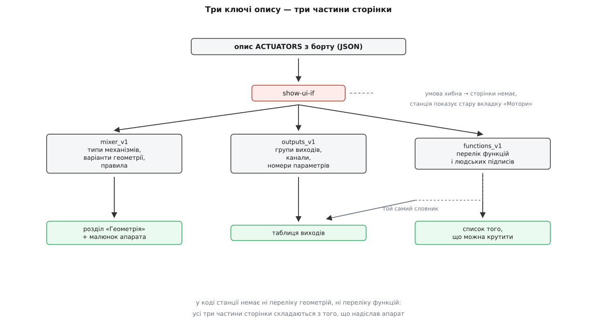
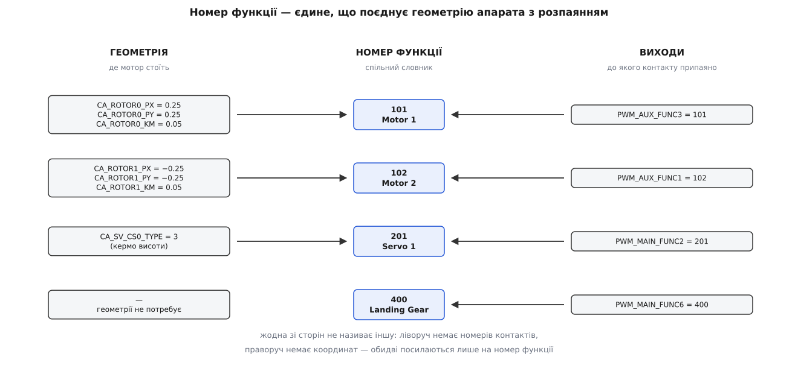
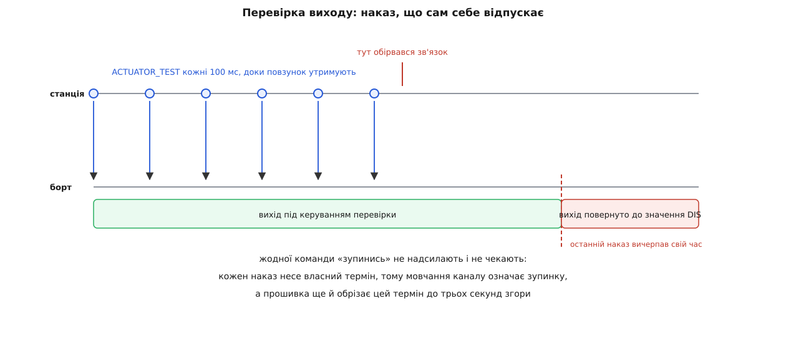

# Налаштування виконавчих механізмів: геометрія, виходи, перевірка

<preknowlist>
- [Відомості про компонент](topic:qgroundcontrol/component-information) — апарат сам надсилає станції описи себе окремими файлами; описів кілька видів, і доставляє їх один спільний механізм.
- [FactSystem](topic:qgroundcontrol/fact-system) — величина в застосунку живе як факт: значення плюс метадані (підпис, одиниці, межі, перелік варіантів).
- [Менеджер параметрів](topic:qgroundcontrol/parameter-manager) — параметри апарата вичитуються в застосунок і записуються назад поодинці; змінили факт — зміна пішла на борт.
- [Команди MAVLink](topic:communications/mavlink-commands) — команда з підтвердженням: сім числових аргументів і відповідь «прийнято» або «відмовлено».
- [Мікшер](topic:algorithms/motor-mixer) — бажані момент і тяга перетворюються на окреме число для кожного мотора.
- [Системи координат і одиниці](topic:communications/coordinate-frames-units) — тілофіксована система з віссю X уперед, Y управо, Z униз.
- [ESC-регулятор](topic:electronics/esc) — між платою й безколекторним мотором стоїть регулятор, що приймає сигнал уставки й крутить мотор.
- [Arming-перевірки](topic:programming/arming-checks) — апарат має два стани, готовий до руху (armed) і заблокований (disarmed), і в другому виходи навмисно не рухаються.
</preknowlist>

## Дві речі, яких станція не може знати

До застосунку під'єднали апарат. Щоб він полетів, автопілот мусить знати дві речі, яких немає в жодному датчику: **де стоїть кожен мотор** і **до якого контакту плати він припаяний**. Перше — фізика: щоб дати крен управо, треба зменшити тягу правих гвинтів, а які саме гвинти праві, видно лише з координат. Друге — історія збирання конкретного борту: паяв людина, і в неї були свої міркування, який дріт зручніше покласти.

Обидві речі неможливо виміряти й неможливо вгадати. Їх хтось мусить сказати — і сказати саме станція, бо вона єдине місце, де є людина, яка це знає.

Довгий час відповідь була іншою. У PX4 геометрія жила у **файлах мікшера** — текстових описах на кшталт `quad_x.main.mix`, які лежали в прошивці, а вибір рами при налаштуванні просто вибирав один із цих файлів. Модель зручна рівно доти, доки твоя рама є в переліку. Щойно вона трохи інша — гвинти зсунуті, додано серву нахилу, з'явилася зайва аеродинамічна поверхня — доводилося правити текстовий файл усередині прошивки й заново її збирати. Це історія, варта окремої розповіді: [від файлів мікшера до розподілу керування](topic:qgroundcontrol/actuator-config/hist-mixer-files.md) показує, чому конструкція, яка десять років усіх влаштовувала, за два випуски зникла.

У PX4 v1.13 з'явився **динамічний розподіл керування** (англ. *control allocation*): геометрія перестала бути файлом і стала набором звичайних параметрів, а у v1.14 стала єдиним способом — старі мікшери прибрали. Наслідок для станції прямий: якщо геометрія — це параметри, то хтось мусить дати людині їх редагувати. Причому не як тисячу рядків у таблиці параметрів із іменами `CA_ROTOR3_PY`, а як картинку апарата, де видно, що третій мотор ліворуч ззаду.

Так з'явилася сторінка налаштування виконавчих механізмів. Її задача формулюється одним реченням: **перетворити фізичну правду про апарат на числа в його параметрах і дати перевірити, що числа не брешуть.**

## Сторінки, якої немає в коді станції

Тепер придивімося до цієї задачі уважніше, бо в ній схована пастка.

Набір параметрів геометрії залежить від того, що це за апарат. У мультикоптера є ротори з координатами. У літака — аеродинамічні поверхні з типами й ефективностями. У конвертоплана додаються серви нахилу з кутовими межами. Кількість роторів — теж змінна: у квадрокоптера їх чотири, у гексакоптера шість, і в кожного свій набір параметрів `CA_ROTOR0_*`, `CA_ROTOR1_*` і так далі.

Намалювати таку сторінку наперед означає вписати у застосунок повний перелік того, яким буває апарат. І цей перелік застаріє того дня, коли в прошивці з'явиться новий тип поверхні або нова схема рами — а станція на планшеті лишиться торішня.

Розв'язок той самий, що й для описів параметрів: **опис сторінки їде з борту**. Серед видів метаданих, які апарат уміє про себе віддати, є вид `ACTUATORS` під номером 5, і це JSON-файл, який описує не значення, а **структуру**: які бувають механізми, які параметри їх задають, як їх групувати й підписувати. Доставляє його [підсистема відомостей про компонент](topic:qgroundcontrol/component-information) — тим самим шляхом, яким приїжджають описи параметрів і подій, з тим самим кешем і тими самими запасними адресами.

Опис має три обов'язкові ключі, і кожен відповідає на своє питання:

```
mixer_v1        чим апарат є фізично: типи механізмів, варіанти геометрії, правила
outputs_v1      куди все припаяно: групи виходів, канали, параметри кожного каналу
functions_v1    словник: які взагалі бувають функції та як їх звати людською мовою
```

Якщо бракує бодай одного — опис відкидається цілком, бо частково зібрана сторінка налаштування небезпечніша за її відсутність.

І є ще четвертий ключ, необов'язковий, `show-ui-if`. Це умова, за якої сторінку взагалі показувати. Апарат тим самим може сказати «зараз мене так не налаштовують» — і станція, замість вкладки виконавчих механізмів, покаже стару вкладку «Мотори» з простими повзунками. Той самий шлях спрацьовує, коли опису немає взагалі: у ArduPilot цієї підсистеми немає, і його користувач бачить стару вкладку. Тобто **навіть саме існування сторінки вирішує апарат, а не станція** — і це той рідкісний випадок, коли роздвоєння інтерфейсу є явним рішенням, а не наслідком недописаного коду.

Повний перелік ключів обох схем, номерів функцій і полів причетних команд винесено окремо: [контракт опису виконавчих механізмів](topic:qgroundcontrol/actuator-config/api-actuator-metadata.md) дає це таблицями, щоб не роздувати виклад.



*У коді станції немає ні переліку геометрій, ні переліку функцій: усе, що видно на сторінці, зібрано з того, що надіслав апарат.*

## Номер функції — єдина скріпа

Тепер найважливіше в усій конструкції, і воно неочевидне.

Здавалося б, геометрія й розпаяння мусять знати одне про одного: «мотор у координатах (0.25, 0.25) сидить на третьому контакті допоміжної колодки». Насправді жодна зі сторін іншу не називає. Між ними стоїть третя річ — **номер функції**.

Функція — це роль, яку хтось виконує, безвідносно до того, де він фізично сидить. У PX4 ролі пронумеровані наскрізно:

```
101 … 112     Motor 1 … Motor 12
201 … 215     Servo 1 … Servo 15
301 … 306     периферія, керована командою ззовні
400           шасі
401           парашут
430           захват
2000 …        спуск затвора камери
```

Геометрія каже: «Motor 1 стоїть отут і крутиться проти годинникової». Таблиця виходів каже: «третій контакт допоміжної колодки несе Motor 1». Перше речення не містить номера контакту, друге не містить координат. Поєднує їх лише число 101.



*Перепаяли дроти — правиться тільки права колонка; переставили мотори на рамі — тільки ліва; словник посередині не змінюється ніколи.*

З цього поділу випливають три речі, і всі три видно в роботі.

**Перепаяння не чіпає фізики.** Помінялися місцями два дроти — правляться два числа в таблиці виходів, а координати роторів лишаються правильними, бо мотори на рамі не рухалися.

**Апарат може мати механізм без геометрії.** Шасі чи захват не входять у жодне рівняння руху: у них немає координат, немає ефективності, вони просто мусять кудись бути припаяні. У переліку функцій вони є, у геометрії їх немає.

**Перевіряти можна роль, а не контакт.** Команда «крутни Motor 1» не потребує знання, де цей мотор сидить, — розбирається з цим прошивка. Саме тому команда перевірки в MAVLink зветься `MAV_CMD_ACTUATOR_TEST` і працює на рівні функцій, на відміну від старішої `MAV_CMD_DO_MOTOR_TEST`, яка адресувала мотор за номером.

Словник функцій, ключ `functions_v1`, живить одразу дві частини сторінки: із нього складається перелік у випадному списку кожного каналу й перелік того, що станція пропонує покрутити. Тому станція ніколи не має вшитого уявлення, що буває в апарата: додасть прошивка нову функцію — вона з'явиться в обох списках із людським підписом, і в коді застосунку не зміниться нічого.

## Геометрія: параметрів стільки, скільки скаже апарат

Ключ `mixer_v1` містить масив варіантів геометрії. Який із них чинний, вирішує окремий параметр (`CA_AIRFRAME`) — обраний варіант і задає, що показувати. Усередині варіанта — групи механізмів, і кожна група описана так:

```yaml
- actuator_type: 'motor'
  count: 'CA_ROTOR_COUNT'
  per_item_parameters:
      standard:
          position: [ 'CA_ROTOR${i}_PX', 'CA_ROTOR${i}_PY', 'CA_ROTOR${i}_PZ' ]
      extra:
        - name: 'CA_ROTOR${i}_KM'
          label: 'Direction CCW'
          function: 'spin-dir'
          show_as: 'true-if-positive'
```

Прочитаймо це так, як читає станція. Спершу вона бере значення факту `CA_ROTOR_COUNT` — скажімо, шість. Далі шість разів підставляє номер замість `${i}` й шукає в параметрах апарата факти `CA_ROTOR0_PX`, `CA_ROTOR1_PX` і так далі. Виходить шість рядків таблиці, у кожному по чотири поля. Змінили `CA_ROTOR_COUNT` на вісім — станція перебудувала таблицю на вісім рядків, не питаючи нікого.

Тобто гексакоптер для станції не є окремою сторінкою й навіть окремим варіантом: це той самий опис із іншим числом у лічильнику. **Кількість рядків інтерфейсу задається значенням параметра, а не кодом.**

Координати — метри в [тілофіксованій системі](topic:communications/coordinate-frames-units) X уперед, Y управо, Z униз, і відлічуються **від центра ваги, а не від польотного контролера**. Розрізнення не педантичне: у рівняннях моменту плече рахується саме від центра ваги, і плата рідко стоїть точно в ньому.

> 🔧 **Навіщо це.** Числа в цій таблиці — не підпис до картинки, вони йдуть у розрахунок безпосередньо: з координат і напрямку обертання борт складає матрицю, яка перетворює бажані момент і тягу на команди окремим моторам, і робить це при кожному ввімкненні. Помилка на десять сантиметрів у координаті дає постійний перекіс керування, який пілот відчує як апарат, що весь час хилиться в один бік, а автопілот компенсує зайвим інтегральним доданком. Що саме роблять із цими числами на борту — [розподіл керування по приводах](topic:algorithms/actuator-allocation).

Окремої уваги вартий рядок про напрямок обертання. У параметрах немає поля «напрямок»; є `CA_ROTOR${i}_KM` — коефіцієнт моменту, тобто скільки реактивного крутного моменту дає цей ротор на одиницю тяги. Гвинт, що крутиться в інший бік, створює момент протилежного знаку — тому напрямок обертання **є знаком цього коефіцієнта**, а не окремою величиною. Опис так і каже: показуй параметр як прапорець і став галочку, коли число додатне (`show_as: 'true-if-positive'`). Станція при цьому не знає ні що таке реактивний момент, ні чому знак означає напрямок; вона виконує вказівку «покажи як прапорець».

## Правила: коли один вибір переписує сусідні поля

Аеродинамічна поверхня описується трьома числами — наскільки вона впливає на крен, тангаж і рискання. Для керма висоти правильні значення відомі наперед: тангаж 1, крен 0, рискання 0. Просити людину набрати їх руками означає запрошувати помилку в місце, де правильна відповідь одна.

Вписати ж у станцію «якщо обрано кермо висоти — постав отакі три числа» не можна з тієї самої причини, з якої не можна вписати перелік геометрій: перелік типів поверхонь належить прошивці. Тому такі знання їдуть у тому ж описі, у розділі правил:

```yaml
- select_identifier: 'servo-type'
  apply_identifiers: ['servo-torque-roll', 'servo-torque-pitch', 'servo-torque-yaw']
  items:
    3:  # кермо висоти
      - { 'hidden': True, 'default': 0.0 }
      - { 'min': 0.0, 'max': 1.0, 'default': 1.0 }
      - { 'hidden': True, 'default': 0.0 }
```

Правило має **керівний параметр** (тут — тип поверхні) і перелік **керованих**. Значення керівного вибирає рядок таблиці, а той каже, що зробити з кожним керованим: сховати, обмежити, підставити усталене. Обрали кермо висоти — поля крену й рискання зникли з екрана й отримали нулі, поле тангажа лишилося видимим із межами від нуля до одиниці.

Робота станції зводиться до чотирьох дій: сховати або показати поле, увімкнути або вимкнути його, підтягнути значення в дозволені межі, підставити усталене. Ніякого знання про аеродинаміку в цьому коді немає.

Тут ховається наслідок, про який варто знати наперед: **правило не лише малює, воно пише**. Вибір у випадному списку типу поверхні змінює значення сусідніх параметрів, і ці зміни, як і будь-яка зміна факту, [йдуть на борт одразу](topic:qgroundcontrol/parameter-manager). Кнопки «застосувати» на цій сторінці немає, а отже, недороблене редагування — це вже стан апарата, а не чернетка.

## Малюнок як детектор брехні

Поруч із таблицею геометрії станція показує апарат згори. Малюнок не вибирається з набору готових картинок — він **малюється з тих самих фактів**: беруться координати всіх роторів, рахується охопний прямокутник, підбирається масштаб під розмір полотна, і далі кожен ротор стає колом, зафарбованим за напрямком обертання, з номером усередині, променем від центра й стрілкою обертання; збоку — покажчик осей.

Різниця між «намалювати» й «вибрати картинку» тут принципова. Набір картинок може покрити лише ті схеми рам, які хтось наперед намалював, — тобто рівно ту скриню, з якої тікали, відмовляючись від файлів мікшера. Малюнок із координат правильний для будь-якої геометрії, включно з несиметричною й щойно вигаданою.

І він виконує роботу, якої не виконує таблиця чисел. Переплутаний знак у `CA_ROTOR2_PY` у таблиці виглядає як мінус серед плюсів, тобто ніяк; на малюнку той самий мінус миттєво видно як мотор, що опинився не з того боку апарата. Ту саму послугу робить колір: два сусідні гвинти, що крутяться в один бік, у таблиці — два однакові знаки в стовпчику `KM`, на малюнку — дві однакові плями там, де очікується шахівниця.

## Виходи: канал, функція і група таймера

Ключ `outputs_v1` описує колодки: групу `MAIN`, групу `AUX`, шину UAVCAN. Усередині групи — підгрупи, усередині підгруп — канали, і кожен канал несе лише номер, за яким збираються імена його параметрів. Для третього каналу основної колодки це:

```
PWM_MAIN_FUNC3    яку функцію несе цей контакт
PWM_MAIN_DIS3     що подавати, доки апарат заблоковано
PWM_MAIN_MIN3     нижня межа робочого діапазону
PWM_MAIN_MAX3     верхня межа
PWM_MAIN_FAIL3    що подавати при спрацюванні аварійного режиму
```

Тобто рядок таблиці виходів — це п'ять звичайних фактів, і редактор цієї таблиці не є нічим особливим: це той самий редактор параметрів, тільки згрупований по-людськи, з переліком варіантів для першого поля, узятим із словника функцій.

Чотири інші значення варто розібрати, бо вони описують поведінку виходу **поза керуванням**. `DIS` — це те, що на контакті, доки апарат заблоковано: для мотора значення, при якому регулятор мовчить, для серви — безпечне положення. `MIN` і `MAX` — краї того діапазону, у який відображається керування від нуля до одиниці; ними ж підганяють різнокаліберні регулятори, щоб мотори рушали одночасно. `FAIL` — те, що подається, коли спрацював аварійний режим і керувати вже нема кому.

Свою логіку станція додає рівно в двох місцях, і обидва беруться з зіставлення двох списків. Перше: **та сама функція, призначена двічі**. Станція збирає множину вже призначених функцій, і повторне призначення в неї не потрапляє — рядок лишається, але роль дістається лише одному контакту. Друге: **функція з геометрії, не призначена нікуди**. Геометрія каже, що моторів шість, а в таблиці виходів знайшлося п'ять — і сторінка про це попереджає. Обидві перевірки можливі саме тут, бо станція — єдине місце, де геометрія й розпаяння видно одночасно.

Є ще одне обмеження, і воно не програмне, а апаратне. Виходи плати сидять на [апаратних таймерах](topic:programming/hardware-pwm), і таймер задає частоту всім своїм каналам разом. Тому вибір протоколу — звичайний PWM на 50 герц для серви, швидший PWM, OneShot чи цифровий DShot для регуляторів — робиться **на групу**, а не на канал. Опис це відображає підгрупами: канали одного таймера лежать в одній підгрупі, а окремий параметр підгрупи задає її протокол.

> 🔧 **Навіщо це.** Практичний висновок: серва й мотор в одній підгрупі — це майже завжди помилка збирання. Поставите групі 400 герц заради швидшої реакції регуляторів — серва, розрахована на 50, отримає імпульси вчетверо частіше й у кращому разі гріється, у гіршому смикається. Тому при розпаянні мотори тримають в одній групі, а серви в іншій, і саме тому таблиця виходів показує межі підгруп, а не рівний список контактів.

Крім призначення функцій, підгрупа може оголосити **підтримувані дії** — «пікнути», «увімкнути тривимірний режим», «задати напрямок обертання». Це вже не параметри, а разові накази регулятору, які прошивка передає йому [цифровим протоколом DShot](topic:electronics/dshot-protocol) — тим самим дротом, що й уставку, тільки послідовністю бітів замість ширини імпульсу, і тому регулятор може не лише слухати, а й відповідати. Станція надсилає команду `MAV_CMD_CONFIGURE_ACTUATOR` і не знає, що з нею робитимуть далі. Звідси й обережність: перелік дій приходить в описі, бо залежить від того, який протокол уміє ця колодка.

## Перевірка: наказ, що сам себе відпускає

Геометрія записана, виходи призначені. Усе це — твердження про світ, і жодне з них станція перевірити не може: вона не бачить ні рами, ні дротів. Перевірити може тільки людина, покрутивши кожен механізм і подивившись, що рухається.

Ця перевірка небезпечна за побудовою. Ми навмисно змушуємо мотор крутитися, стоячи над апаратом. І тут конструкція команди робить те, чого не робить жоден напис у документації.

Команда — `MAV_CMD_ACTUATOR_TEST`, номер 310. Її аргументи:

```
param1   значення: 0…1 для мотора, −1…1 для серви, NaN — відпустити
param2   термін утримання, секунди
param5   номер функції, яку крутити
```

Погляньмо, що робить із нею прошивка:

```cpp
if (isArmed() || (_safety.isButtonAvailable() && !_safety.isSafetyOff())) {
    return vehicle_command_ack_s::VEHICLE_CMD_RESULT_DENIED;
}
...
int timeout_ms = static_cast<int>(lroundf(cmd.param2 * 1000.f));

if (timeout_ms <= 0) {
    actuator_test.action = actuator_test_s::ACTION_RELEASE_CONTROL;
} else {
    actuator_test.timeout_ms = timeout_ms;
}

// enforce a timeout and a maximum limit
if (actuator_test.timeout_ms == 0 || actuator_test.timeout_ms > 3000) {
    actuator_test.timeout_ms = 3000;
}
```

Три рішення в п'ятнадцяти рядках, і кожне варте уваги.

**Відмова, якщо апарат готовий до руху або запобіжний перемикач не знято.** Перевірка виходів — операція столу, і прошивка не покладається на те, що станція про це пам'ятає.

**Термін обов'язковий.** Наказ не «увімкни», а «утримуй стільки часу»; після цього вихід сам повертається до значення `DIS`. Наказ із нульовим терміном означає «відпусти негайно».

**Термін обрізається згори трьома секундами.** Обрізає його прошивка — тобто сторона, яка крутить мотор, а не сторона, яка просить. Станція могла б попросити хвилину; борт цього не дасть.

Станція з цього боку робить одне: доки повзунок утримують, вона повторює команду, і за цим стежить сторожовий таймер зі сотою частки секунди:

```cpp
_watchdogTimer.setInterval(100);
_watchdogTimer.setSingleShot(false);
```

Разом виходить конструкція, яку варто назвати прямо: **це вимикач мертвої руки**. Схема, у якій перевірка вмикається однією командою й вимикається іншою, має очевидний поганий стан — обірваний канал між двома командами лишає мотор, що крутиться. Схема, у якій кожен наказ несе власний термін, такого стану не має: **мовчання каналу означає зупинку**. Це той самий принцип, що й у [сторожовому таймері](topic:programming/watchdog), лише розтягнутий через радіоканал: не «скажи, коли зупинитися», а «підтверджуй, що ще потрібно».



*Найгірше, що дає обрив зв'язку посеред перевірки, — це залишок невичерпаного терміну, і його стеля задана прошивкою.*

**Умова: станція просить утримання на 1 секунду й повторює наказ щосто мілісекунд; канал обривається одразу після чергового наказу.**

```
термін, який просить станція   = 1.0 с    = 1000 мс
обрізання прошивкою            = min(1000, 3000)  = 1000 мс
момент обриву                  = одразу після наказу
залишковий рух                 = 1000 − 0          = 1000 мс
```

Секунда обертання після втрати зв'язку. Якби станція просила десять секунд, стеля прошивки все одно звела б найгірший випадок до трьох.

Той самий прохід у робочому коді, без застосунку, — [клієнт перевірки виходів](topic:qgroundcontrol/actuator-config/proj-actuator-test-client.md): вичитати призначення функцій із параметрів, покрутити обране й коректно відпустити.

## Тисяча, якої немає в протоколі

Одна деталь у цій команді виглядає як помилка, а насправді є свідомим розширенням.

У MAVLink функції пронумеровані інакше, ніж у PX4: `MOTOR1` там дорівнює 1, і моторів шістнадцять, `SERVO1` дорівнює 33, і серв теж шістнадцять. Усе. Шасі, парашута, захвата, спуску камери в цьому переліку немає.

Станція надсилає в `param5` **не номер функції, а номер плюс тисячу**, а прошивка робить так:

```cpp
if (actuator_test.function < 1000) {
    // числа до тисячі — стандартна нумерація MAVLink
    ...
} else {
    actuator_test.function -= 1000;
}
```

**Умова: третій канал допоміжної колодки несе Motor 1, тобто `PWM_AUX_FUNC3 = 101`; людина тягне повзунок цього мотора.**

```
функція каналу                 = 101         (Motor 1 у нумерації PX4)
станція надсилає param5        = 101 + 1000  = 1101
прошивка бачить 1101 ≥ 1000    → віднімає тисячу
функція для виконання          = 1101 − 1000 = 101
```

Навіщо цей гак. Стандартна нумерація вміє адресувати тридцять дві речі — шістнадцять моторів і шістнадцять серв; нумерація PX4 адресує все, включно з шасі й захватом. Зсув на тисячу дає обом уміститися в одному полі без нового повідомлення: числа до тисячі читаються як стандартні, більші — як внутрішні.

Ціна теж очевидна: у цьому місці станція розмовляє **діалектом PX4**, а не чистим протоколом. Автопілот, що знає лише стандартну нумерацію, на число понад тисячу відповість «не підтримую». На практиці це не болить рівно тому, що сторінка виконавчих механізмів і так з'являється лише там, де прийшов опис, а описи цього виду сьогодні віддає PX4.

Межі повзунка, до речі, теж приходять описом і залежать від типу механізму:

```yaml
motor:
    actuator_testing_values: { min: 0, max: 1, default_is_nan: true }
servo:
    actuator_testing_values: { min: -1, max: 1, default: 0 }
```

Мотор ходить від нуля до одиниці, серва — від мінус одиниці до одиниці через нуль, бо в серви є два боки. Усталене значення мотора — не нуль, а NaN, тобто «відпустити керування»: спокій мотора — це вимкнений мотор, а не мотор із нульовою уставкою. У серви спокій — середина, тому там усталений нуль.

## Впізнати мотори, не гадаючи

Лишилася задача, яку описана схема робить розв'язною, але нудною: зіставити шість моторів на малюнку з шістьма контактами. Робити це перебором — покрутити, подивитися, виправити, повторити — довго й помилконебезпечно.

Станція вміє це напівавтоматично. Для мультикоптера на PWM-виходах вона по черзі розкручує кожен мотор на п'ятнадцять відсотків тяги й просить показати на малюнку, який саме заворушився. Коли всі показані, вона переставляє параметри функцій так, щоб порядок збігся з обраним:

```cpp
fact->setRawValue(_firstMotorsFunction + _selectedMotors[currentFunction - _firstMotorsFunction]);
```

Тут важливе те, **що саме** переставляється. Змінюються параметри `PWM_*_FUNC*`, тобто права колонка — розпаяння. Координати роторів не чіпаються взагалі.

Інакше й бути не може, і причина повертає нас до початку. Геометрія — твердження про фізичний світ: мотор справді висить у цій точці рами, і переписати це число означає збрехати про апарат. Розпаяння — довільна домовленість: який дріт на який контакт, вирішувала людина зі жмутом проводів у руках, і будь-яка перестановка тут однаково законна. Коли реальність не збігається з описом, правити треба **довільне, а не фізичне** — і вся напівавтоматика вміє правити рівно один бік.

Обмеження звідси теж зрозумілі: потрібен малюнок із позиціями, на які можна тицьнути (тобто мультикоптер), і потрібні виходи, чиї функції можна переписати параметром.

## Ціна конструкції

Кілька наслідків, які легше знати наперед, ніж виявити на столі з розібраним апаратом.

**Сторінка існує лише там, звідки прийшов опис.** Немає опису — немає сторінки, є стара вкладка «Мотори». Це не деградація до простішого вигляду тієї самої сторінки, а інша сторінка з іншими можливостями.

**Станція не перевіряє, що геометрія правдива.** Вона перевіряє лише узгодженість двох списків: чи всім функціям знайшлися контакти й чи не призначено одну функцію двічі. Що координати описують саме цю раму, не перевіряє ніхто й нічим, крім малюнка та ваших очей.

**Редагування пише одразу.** Кнопки «застосувати» немає, правило при виборі типу мовчки переписує сусідні параметри, і апарат уже в новому стані. Перерваного посередині редагування як окремого стану не існує — існує апарат, налаштований наполовину.

**Безпека тут шарувата, але не абсолютна.** Гвинти знімають, повзунки закриті окремим вмикачем і не рухаються самі, прошивка відмовляє готовому до руху апарату, термін наказу обрізаний трьома секундами, а мовчання каналу зупиняє мотор. Жодна з цих ліній не робить безпечним гвинт, що крутиться; вони роблять передбачуваним усе інше.

Виграш від усієї конструкції видно тоді, коли до застосунку під'єднують раму, якої на момент випуску застосунку ніхто не бачив: восьмимоторну, з нахилюваними двигунами, з поверхнею небаченого типу. Станція покаже її геометрію правильними полями, намалює її згори за координатами, дасть призначити виходи з переліку, у якому є новий тип, і дасть кожен механізм покрутити. Код станції при цьому не змінився й змінитися не міг: він не знає, що таке ротор, момент і кермо висоти. Він знає, як прочитати опис і показати те, що там написано.
