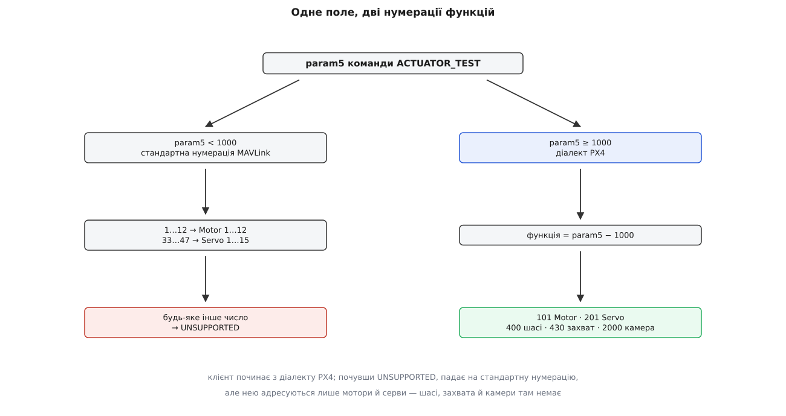

# ⚙️ Клієнт перевірки виходів: наказ, який доводиться повторювати

Ця програма під'єднується до плати, вичитує з її параметрів, який вихід яку роль несе, крутить обрану роль стільки, скільки її тримають, і відпускає — навіть тоді, коли сама аварійно завершилася. Писати її варто не заради заміни станції, а тому що наказ на перевірку виходу зроблено не так, як решту команд: майже скрізь у протоколі досить надіслати команду один раз і подивитися на підтвердження, а тут одноразова команда не робить нічого корисного. Доки цикл повторення не написано власними руками, вибір двох чисел — з якою частотою повторювати й на скільки просити утримання — виглядає формальністю. Щойно написано, стає видно, що добуток цих двох чисел міряється обертами гвинта після втрати зв'язку.

### Задача

Плата лежить на столі, гвинти зняті, живлення на регуляторах є. Треба зробити три речі.

Дізнатися, які ролі взагалі призначено виходам **цього** борту — бо крутити ми будемо роль («Motor 1»), а не контакт, і без переліку призначень немає з чого вибирати. Покрутити одну обрану роль на заданій частці тяги стільки секунд, скільки попросили. Відпустити так, щоб відпускання сталося на кожному шляху виходу з програми: за нормальним завершенням, за помилкою, за `Ctrl+C`, за винятком у середині циклу.

Кожна з трьох частин має свою перешкоду, і жодної з них не видно в описі протоколу.

Призначення лежать у звичайних параметрах `PWM_MAIN_FUNCn` і `PWM_AUX_FUNCn` — по одному на контакт. Але це цілі числа, а протокол параметрів має для значення рівно одне поле, і воно оголошене як `float`. Скільки саме контактів має плата, теж наперед невідомо.

Наказ на перевірку несе не «увімкни», а «утримуй стільки часу». Термін короткий, тому наказ доводиться повторювати — і повільний канал не має права збивати ритм цих повторень.

Відпускання — окрема команда, яка може не дійти. І воно не єдина лінія оборони: термін наказу спливає сам. Обидві лінії треба спроєктувати разом, бо вони страхують одна одну.

### Задум: п'ять рішень, які визначають усе

**Ціле число приїжджає не числом.** [Параметри в MAVLink](book:communications/mavlink-parameters) вичитуються поштучно — просиш ім'я, отримуєш повідомлення `PARAM_VALUE` зі значенням. Значення будь-якого типу їде в одному полі завширшки чотири байти, оголошеному як `float`, а справжній тип названо окремим полем. Тому для цілого параметра є два способи покласти його в це поле: перетворити число (101 → 101.0) або перекласти байти як є. PX4 вибрав другий і робить це буквально `memcpy` у своєму `mavlink_parameters.cpp`. Отже, клієнт мусить зробити дзеркальне: узяти чотири байти поля й прочитати їх як ціле, а не заокруглювати.

**Умова: третій канал допоміжної колодки несе Motor 1, тобто параметр `PWM_AUX_FUNC3` типу INT32 має значення 101.**

```
ціле 101 на дроті (молодший байт перший) = 65 00 00 00
ті самі чотири байти як float            = 101 · 2⁻¹⁴⁹ ≈ 1.41531·10⁻⁴³
наївне заокруглення                      = lround(1.41531e-43) = 0
висновок клієнта                         = «канал вимкнено»
```

Помилка не дає ані збою, ані попередження: програма чесно надрукує, що на платі нічого не призначено. Це те саме [подання чисел із рухомою комою](book:math/ieee754), у якому чотири байти діляться на знак, порядок і мантису, — просто тут ті самі біти читають як ціле зі знаком, і мале ціле опиняється в зоні денормалізованих значень, тобто майже нулем.

**Каналів стільки, скільки їх на цій платі, і перелік нізвідки не приходить.** Параметри виходів заводяться під конкретну плату: на одній є вісім основних і вісім допоміжних, на іншій — інакше. Питати можна лише за іменем, а на неіснуюче ім'я борт просто мовчить — окремої відповіді «немає такого параметра» протокол не має. Звідси спосіб: скласти перелік усіх імен, які взагалі можуть існувати (`PWM_MAIN_FUNC1`…`PWM_MAIN_FUNC16` і те саме для `PWM_AUX_`), послати всі запити разом, зібрати те, що відповіло, і після другого кола вважати мовчазні імена неіснуючими. Два кола потрібні не для краси: тридцять два запити поспіль можуть частково загубитися — [датаграма приходить цілою або не приходить зовсім](book:programming/udp-datagram-semantics), а буфер передавання на борту не безмежний.

**Наказ живе секунду, тому його повторюють.** Команда `MAV_CMD_ACTUATOR_TEST` бере уставку в `param1`, термін утримання в секундах у `param2` і номер функції в `param5`. Прошивка PX4 множить `param2` на тисячу, заокруглює й обрізає результат згори трьома секундами; нуль означає «відпустити». Тобто вихід сам повертається до свого знеструмленого значення, якщо наступний наказ не прийшов вчасно, і жодної команди «зупинись» для цього не треба. Клієнтові лишається вибрати два числа: період повторення *T* і термін одного наказу *H*.

**Умова: клієнт повторює наказ щосто мілісекунд і просить утримання на одну секунду; канал губить три відсотки датаграм, і втрати незалежні між собою.**

```
період повторення                  T = 100 мс
термін одного наказу               H = 1000 мс
стерпних утрат поспіль             ⌊H/T⌋ − 1     = 9
ймовірність десяти втрат поспіль   0.03¹⁰        ≈ 6·10⁻¹⁶
найгірший вибіг після обриву       H             = 1000 мс
```

Два останні рядки тягнуть у різні боки. Відношення *H*/*T* — це запас на втрати: скільки наказів поспіль можна загубити, перш ніж мотор зупиниться посеред справної перевірки. Сам термін *H* — це вибіг: скільки мотор ще крутитиметься після того, як зв'язок обірвався остаточно. Збільшуєш *H* — купуєш стійкість і платиш вибігом; зменшуєш — навпаки. Стеля в три секунди, яку ставить прошивка, лише обмежує найгіршу з можливих покупок; вибирати всередині цієї стелі однаково доводиться клієнтові. Секунда при сотні мілісекунд періоду — розумний вибір: втрата десяти датаграм поспіль на будь-якому робочому каналі неймовірна, а секунда обертання після обриву — стільки, скільки триває крок убік. Це та сама механіка, що в [сторожовому таймері](book:programming/watchdog), тільки перевернута: не «скажи, коли зупинитися», а «підтверджуй, що ще потрібно».

**Відпускання мусить бути неминучим, а не написаним наприкінці.** Термін наказу вже страхує від забутого відпускання, але страхує ціною секунди обертання. Тому відпускання прив'язують до **виходу з області видимості**, а не до останнього рядка функції: у C++ це деструктор, у Python — `__exit__`. Обидва спрацьовують і на `return` із середини, і на виняток, і на перерваний користувачем цикл. Це [прив'язка звільнення ресурсу до часу життя об'єкта](book:programming/raii): володіння виходом починається зі створення об'єкта й закінчується його знищенням, і між цими двома подіями немає шляху, яким можна вислизнути. І оскільки саме відпускання — теж датаграма, яка може загубитися, його шлють тричі поспіль: три втрати підряд перетворюють секунду вибігу на нуль із запасом.

**Відмова буває чотирьох сортів, і три з них лікуються по-різному.** Команда з підтвердженням дає у відповідь [`COMMAND_ACK` із кодом результату](book:communications/mavlink-commands), і читати цей код як «добре чи погано» означає викинути майже все, що в ньому сказано.

`DENIED` означає стан апарата: PX4 відмовляє, якщо апарат готовий до руху або якщо на платі є запобіжний перемикач і його не знято. Перевірка виходів — операція столу, і прошивка не покладається на те, що клієнт про це пам'ятає; [два стани апарата](book:programming/arming-checks) тут розділяють не «можна летіти» й «не можна», а «керує польотний контур» і «керуємо ми». Повторювати наказ після `DENIED` немає сенсу: доки людина не змінить стан, відповідь буде та сама.

`UNSUPPORTED` означає, що борт не зрозумів числа у `param5`. І саме тут нумерація функцій роздвоюється.



*Клієнт може спробувати обидві дороги, але друга адресує рівно тридцять дві речі — шасі, захват і спуск камери в неї не вміщуються.*

У самому MAVLink функції пронумеровані компактно: `MOTOR1` дорівнює одиниці й моторів шістнадцять, `SERVO1` дорівнює тридцяти трьом і серв теж шістнадцять. У PX4 нумерація власна й ширша: мотори з 101, серви з 201, шасі 400, захват 430, спуск камери з 2000. Щоб обидві вмістилися в одному полі, станція надсилає **номер функції PX4 плюс тисячу**, а прошивка бачить число понад тисячу й тисячу віднімає. Числа менші за тисячу вона тлумачить як стандартні: 1…12 переводить у мотори 101…112, 33…47 — у серви 201…215, а все інше відкидає з `UNSUPPORTED`.

Для клієнта звідси випливає драбинка: починати з діалекту PX4 (`1000 + функція`), а почувши `UNSUPPORTED`, один раз спробувати стандартний номер — але лише якщо функція взагалі має стандартний відповідник. Для шасі й захвата запасного ходу немає, і чесна відповідь тут — сказати про це й вийти, а не крутитися в циклі.

`TEMPORARILY_REJECTED` означає «зараз зайнятий» — це єдина відмова, яку варто просто перечекати наступним тактом.

Мовчання не означає нічого з переліченого. Підтвердження в MAVLink не несе номера наказу, на який відповідає, тож на повільному каналі відповідь на попередній наказ приходить уже під час наступного. Тому клієнт реагує не на одну відсутню відповідь, а на **смугу** мовчання: десять тактів поспіль без жодного `COMMAND_ACK` — це втрачений канал, а один пропущений — звичайна річ.

### Код

Головна мова тут — C++, і причина не в смаку. Код майже цілком складається з двох речей: робота з протоколом (пакування повідомлень, розбір байтового потоку, поля фіксованої довжини) і втримання рівного ритму повторень. Обидві дешевші там, де є типізовані структури згенерованих заголовків і деструктор, що спрацьовує сам; до того ж такий клієнт переносять у бортову тестову оснастку без переписування. Той самий прохід на `pymavlink` наведено поруч вкладкою: як разовий інструмент він зручніший, і робить він те саме.

C++-версії потрібні згенеровані заголовки MAVLink і сокет. Ця частина відрізняється між мовами настільки, що порівнювати нема чого: у Python усе нижче — це один виклик `mavutil.mavlink_connection`.

```cpp
// actuator_test.cpp — покрутити один вихід і коректно відпустити.
// g++ -std=c++17 -I<тека зі згенерованими заголовками> actuator_test.cpp -o actuator_test
#include <mavlink/common/mavlink.h>

#include <arpa/inet.h>
#include <sys/select.h>
#include <sys/socket.h>
#include <unistd.h>

#include <algorithm>
#include <chrono>
#include <cmath>
#include <cstdio>
#include <cstring>
#include <limits>
#include <map>
#include <string>
#include <thread>
#include <vector>

static constexpr uint8_t GCS_SYSID  = 255;                        // не збігатися з бортом!
static constexpr uint8_t GCS_COMPID = MAV_COMP_ID_MISSIONPLANNER;

static int64_t nowMs()
{
    using namespace std::chrono;
    return duration_cast<milliseconds>(steady_clock::now().time_since_epoch()).count();
}

class Link {
public:
    Link(const char *addr, uint16_t port)
    {
        _fd = ::socket(AF_INET, SOCK_DGRAM, 0);
        sockaddr_in me{};
        me.sin_family = AF_INET;
        me.sin_addr.s_addr = ::inet_addr(addr);
        me.sin_port = htons(port);
        ::bind(_fd, reinterpret_cast<sockaddr *>(&me), sizeof me);
    }
    ~Link() { if (_fd >= 0) ::close(_fd); }

    bool recv(mavlink_message_t &out, int waitMs)
    {
        if (!_queue.empty()) {                       // спершу віддаємо вже розібране
            out = _queue.front();
            _queue.erase(_queue.begin());
            return true;
        }
        timeval tv{waitMs / 1000, (waitMs % 1000) * 1000};
        fd_set rd;
        FD_ZERO(&rd);
        FD_SET(_fd, &rd);
        if (::select(_fd + 1, &rd, nullptr, nullptr, &tv) <= 0) {
            return false;
        }
        uint8_t buf[2048];
        sockaddr_in from{};
        socklen_t len = sizeof from;
        ssize_t n = ::recvfrom(_fd, buf, sizeof buf, 0,
                               reinterpret_cast<sockaddr *>(&from), &len);
        _peer = from;
        _peerKnown = true;

        mavlink_message_t msg;
        for (ssize_t i = 0; i < n; ++i) {            // в одній датаграмі буває
            if (mavlink_parse_char(MAVLINK_COMM_0, buf[i], &msg, &_status)) {
                _queue.push_back(msg);               // кілька повідомлень
            }
        }
        if (_queue.empty()) return false;
        out = _queue.front();
        _queue.erase(_queue.begin());
        return true;
    }

    void send(const mavlink_message_t &msg)
    {
        if (!_peerKnown) return;                     // адресу впізнаємо з першої датаграми
        uint8_t buf[MAVLINK_MAX_PACKET_LEN];
        uint16_t n = mavlink_msg_to_send_buffer(buf, &msg);
        ::sendto(_fd, buf, n, 0, reinterpret_cast<const sockaddr *>(&_peer), sizeof _peer);
    }

    bool waitHeartbeat(int timeoutMs)
    {
        const int64_t deadline = nowMs() + timeoutMs;
        mavlink_message_t msg;
        while (nowMs() < deadline) {
            if (!recv(msg, 200) || msg.msgid != MAVLINK_MSG_ID_HEARTBEAT) continue;
            mavlink_heartbeat_t hb;
            mavlink_msg_heartbeat_decode(&msg, &hb);
            if (hb.autopilot == MAV_AUTOPILOT_INVALID) continue;   // камера чи інша станція
            _targetSystem = msg.sysid;
            return true;
        }
        return false;
    }

    uint8_t targetSystem() const { return _targetSystem; }

private:
    int _fd = -1;
    sockaddr_in _peer{};
    bool _peerKnown = false;
    uint8_t _targetSystem = 0;
    mavlink_status_t _status{};
    std::vector<mavlink_message_t> _queue;
};
```

Розбір датаграми в циклі по всіх байтах, а не до першого зібраного повідомлення, — не педантизм: у одній датаграмі борт часто пакує кілька повідомлень поспіль, і клієнт, що зупиняється на першому, губить решту. Помітно це стає саме на підтвердженнях: `COMMAND_ACK` любить їхати причепом до серцебиття.

Тепер читання призначень. Тут і живе перетворення чотирьох байтів у ціле.

:::tabs
```cpp
// Ціле в PARAM_VALUE лежить БАЙТАМИ у полі float: борт кладе його memcpy,
// клієнт мусить прочитати дзеркально.
static int32_t paramToInt(const mavlink_param_value_t &pv)
{
    if (pv.param_type == MAV_PARAM_TYPE_REAL32) {
        return static_cast<int32_t>(std::lround(pv.param_value));
    }
    int32_t v = 0;
    std::memcpy(&v, &pv.param_value, sizeof v);
    return v;
}

static std::string paramName(const char id[16])
{
    char buf[17] = {};
    std::memcpy(buf, id, 16);        // поле фіксованої довжини, нуля може не бути
    return buf;
}

static void requestParam(Link &link, const std::string &name)
{
    char id[16] = {};
    std::memcpy(id, name.data(), std::min(name.size(), sizeof id));
    mavlink_message_t msg;
    mavlink_msg_param_request_read_pack(GCS_SYSID, GCS_COMPID, &msg,
                                        link.targetSystem(), MAV_COMP_ID_AUTOPILOT1,
                                        id, -1);     // −1 — шукати за іменем, не за індексом
    link.send(msg);
}

// Перелік каналів наперед невідомий: питаємо всі можливі, лишаємо ті, що відповіли.
static std::map<std::string, int> readOutputFunctions(Link &link, int maxChannels = 16)
{
    std::vector<std::string> wanted;
    for (const char *bank : {"PWM_MAIN_FUNC", "PWM_AUX_FUNC"}) {
        for (int ch = 1; ch <= maxChannels; ++ch) {
            wanted.push_back(std::string(bank) + std::to_string(ch));
        }
    }

    std::map<std::string, int> got;
    for (int round = 0; round < 2 && got.size() < wanted.size(); ++round) {
        for (const std::string &name : wanted) {
            if (!got.count(name)) requestParam(link, name);
        }
        const int64_t deadline = nowMs() + 1500;
        mavlink_message_t msg;
        while (nowMs() < deadline && got.size() < wanted.size()) {
            if (!link.recv(msg, 100) || msg.msgid != MAVLINK_MSG_ID_PARAM_VALUE) continue;
            mavlink_param_value_t pv;
            mavlink_msg_param_value_decode(&msg, &pv);
            const std::string name = paramName(pv.param_id);
            if (std::find(wanted.begin(), wanted.end(), name) != wanted.end()) {
                got[name] = paramToInt(pv);
            }
        }
    }
    return got;                                       // мовчазні імена просто не існують
}
```
```python
#!/usr/bin/env python3
"""actuator_test.py — покрутити один вихід і коректно відпустити."""
import struct, sys, time
from pymavlink import mavutil

mav = mavutil.mavlink
AUTOPILOT = mav.MAV_COMP_ID_AUTOPILOT1


def param_to_int(m):
    """Ціле в PARAM_VALUE лежить БАЙТАМИ у полі float: борт кладе його memcpy,
    pymavlink віддає те саме поле як число — байти доводиться повертати назад."""
    if m.param_type == mav.MAV_PARAM_TYPE_REAL32:
        return int(round(m.param_value))
    return struct.unpack('<i', struct.pack('<f', m.param_value))[0]


def param_name(m):
    v = m.param_id
    if isinstance(v, (bytes, bytearray)):
        v = v.decode('ascii', 'replace')
    return v.split('\x00', 1)[0]      # поле фіксованої довжини, нуля може не бути


def read_output_functions(link, max_channels=16):
    """Перелік каналів наперед невідомий: питаємо всі можливі,
    лишаємо ті, що відповіли."""
    wanted = ['%s%d' % (bank, ch)
              for bank in ('PWM_MAIN_FUNC', 'PWM_AUX_FUNC')
              for ch in range(1, max_channels + 1)]
    got = {}

    for _ in range(2):
        if len(got) == len(wanted):
            break
        for name in wanted:
            if name not in got:
                link.mav.param_request_read_send(
                    link.target_system, AUTOPILOT, name.encode(), -1)
        deadline = time.monotonic() + 1.5
        while time.monotonic() < deadline and len(got) < len(wanted):
            m = link.recv_match(type='PARAM_VALUE', blocking=True, timeout=0.1)
            if m is None:
                continue
            name = param_name(m)
            if name in wanted:
                got[name] = param_to_int(m)

    return got                        # мовчазні імена просто не існують
```
:::

Далі — один наказ і його вирок. Очікування підтвердження навмисно коротше за період повторення: підтвердження корисне, але ритм важливіший, і клієнт не має права спізнитися з наступним наказом через те, що чекав на відповідь про попередній.

:::tabs
```cpp
enum class Verdict { Accepted, Retry, Unsupported, Refused, Silence };

static void sendOrderRaw(Link &link, int param5, float value, float holdSec)
{
    mavlink_message_t msg;
    mavlink_msg_command_long_pack(GCS_SYSID, GCS_COMPID, &msg,
            link.targetSystem(), MAV_COMP_ID_AUTOPILOT1,
            MAV_CMD_ACTUATOR_TEST, 0,
            value,                        // param1 — уставка: 0…1 мотор, −1…1 серва, NaN — відпустити
            holdSec,                      // param2 — термін утримання, секунди
            0.f, 0.f,
            static_cast<float>(param5),   // param5 — кого крутити
            0.f, 0.f);
    link.send(msg);
}

static Verdict sendOrder(Link &link, int param5, float value, float holdSec, int waitMs = 60)
{
    sendOrderRaw(link, param5, value, holdSec);

    const int64_t deadline = nowMs() + waitMs;
    mavlink_message_t in;
    while (nowMs() < deadline) {
        if (!link.recv(in, 20) || in.msgid != MAVLINK_MSG_ID_COMMAND_ACK) continue;
        mavlink_command_ack_t ack;
        mavlink_msg_command_ack_decode(&in, &ack);
        if (ack.command != MAV_CMD_ACTUATOR_TEST) continue;
        switch (ack.result) {
        case MAV_RESULT_ACCEPTED:             return Verdict::Accepted;
        case MAV_RESULT_TEMPORARILY_REJECTED: return Verdict::Retry;
        case MAV_RESULT_UNSUPPORTED:          return Verdict::Unsupported;
        default:                              return Verdict::Refused;
        }
    }
    return Verdict::Silence;              // не «погано», а «поки що невідомо»
}

// Стандартна нумерація MAVLink адресує лише мотори й серви.
static int standardFunction(int px4Function)
{
    if (px4Function >= 101 && px4Function <= 112) return px4Function - 101 + 1;
    if (px4Function >= 201 && px4Function <= 215) return px4Function - 201 + 33;
    return -1;                            // шасі, захват, камера — запасного ходу немає
}
```
```python
ACCEPTED, RETRY, UNSUPPORTED, REFUSED, SILENCE = range(5)

_VERDICT = {mav.MAV_RESULT_ACCEPTED:             ACCEPTED,
            mav.MAV_RESULT_TEMPORARILY_REJECTED: RETRY,
            mav.MAV_RESULT_UNSUPPORTED:          UNSUPPORTED}


def send_order(link, param5, value, hold_s, wait=0.06):
    link.mav.command_long_send(
        link.target_system, AUTOPILOT,
        mav.MAV_CMD_ACTUATOR_TEST, 0,
        value,       # param1 — уставка: 0…1 мотор, −1…1 серва, NaN — відпустити
        hold_s,      # param2 — термін утримання, секунди
        0, 0,
        param5,      # param5 — кого крутити
        0, 0)

    if wait <= 0:
        return SILENCE
    deadline = time.monotonic() + wait
    while time.monotonic() < deadline:
        m = link.recv_match(type='COMMAND_ACK', blocking=True, timeout=0.02)
        if m is None or m.command != mav.MAV_CMD_ACTUATOR_TEST:
            continue
        return _VERDICT.get(m.result, REFUSED)
    return SILENCE                        # не «погано», а «поки що невідомо»


def standard_function(px4_function):
    """Стандартна нумерація MAVLink адресує лише мотори й серви."""
    if 101 <= px4_function <= 112:
        return px4_function - 101 + 1
    if 201 <= px4_function <= 215:
        return px4_function - 201 + 33
    return -1                             # шасі, захват, камера — запасного ходу немає
```
:::

Лишилося утримання. Тут головне не в тому, що написано в тілі циклу, а в тому, що відпускання винесене туди, звідки його не можна пропустити.

:::tabs
```cpp
class Hold {
public:
    Hold(Link &link, int function) : _link(link), _function(function) {}
    ~Hold() { release(); }                            // єдиний спосіб не забути

    Hold(const Hold &) = delete;
    Hold &operator=(const Hold &) = delete;

    Verdict tick(float value, float holdSec) { return sendOrder(_link, param5(), value, holdSec); }

    bool px4Dialect() const     { return _dialect; }
    bool standardPossible() const { return standardFunction(_function) > 0; }
    void fallBackToStandard()   { _dialect = false; }

    void release()
    {
        if (_released) return;
        _released = true;
        // Термін 0 борт перекладає на «відпустити»; NaN лишає вихід знеструмленим.
        // Тричі — бо сама датаграма відпускання теж може загубитися.
        for (int i = 0; i < 3; ++i) {
            sendOrderRaw(_link, param5(), std::numeric_limits<float>::quiet_NaN(), 0.f);
        }
    }

private:
    int param5() const { return _dialect ? 1000 + _function : standardFunction(_function); }

    Link &_link;
    int _function;
    bool _dialect = true;
    bool _released = false;
};

static int runTest(Link &link, int function, float value, double seconds)
{
    constexpr int   periodMs = 100;    // крок сторожового повторення
    constexpr float holdSec  = 1.0f;   // термін одного наказу

    Hold hold(link, function);
    int silence = 0;
    const int64_t stopAt = nowMs() + static_cast<int64_t>(seconds * 1000);
    int64_t next = nowMs();

    while (nowMs() < stopAt) {
        switch (hold.tick(value, holdSec)) {
        case Verdict::Accepted:
        case Verdict::Retry:
            silence = 0;
            break;
        case Verdict::Silence:
            if (++silence * periodMs > 1000) {        // смуга мовчання, не один пропуск
                std::fprintf(stderr, "борт мовчить понад секунду\n");
                return 1;
            }
            break;
        case Verdict::Unsupported:
            if (hold.px4Dialect() && hold.standardPossible()) {
                std::fprintf(stderr, "борт не знає діалекту PX4 — пробуємо стандартний номер\n");
                hold.fallBackToStandard();
                break;
            }
            std::fprintf(stderr, "функцію %d цим протоколом не адресувати\n", function);
            return 1;
        case Verdict::Refused:
            std::fprintf(stderr, "відмовлено: апарат armed або запобіжний перемикач не знято\n");
            return 1;
        }

        next += periodMs;                             // абсолютний розклад, без накопичення зсуву
        if (next < nowMs()) next = nowMs();
        std::this_thread::sleep_for(std::chrono::milliseconds(next - nowMs()));
    }
    return 0;                                          // ~Hold() відпустить сам
}
```
```python
class Hold:
    """Утримання одного виходу: володіння починається на вході в блок with
    і закінчується на виході з нього — будь-якому, зокрема через виняток."""

    def __init__(self, link, function):
        self.link, self.function = link, function
        self.dialect = True

    def param5(self):
        return 1000 + self.function if self.dialect else standard_function(self.function)

    def tick(self, value, hold_s):
        return send_order(self.link, self.param5(), value, hold_s)

    def __enter__(self):
        return self

    def __exit__(self, *exc):
        # Термін 0 борт перекладає на «відпустити»; NaN лишає вихід знеструмленим.
        # Тричі — бо сама датаграма відпускання теж може загубитися.
        for _ in range(3):
            send_order(self.link, self.param5(), float('nan'), 0.0, wait=0)
        return False


def run_test(link, function, value, seconds, period=0.1, hold_s=1.0):
    silence = 0
    stop_at = time.monotonic() + seconds
    nxt = time.monotonic()

    with Hold(link, function) as hold:
        while time.monotonic() < stop_at:
            verdict = hold.tick(value, hold_s)

            if verdict in (ACCEPTED, RETRY):
                silence = 0
            elif verdict == SILENCE:
                silence += 1
                if silence * period > 1.0:        # смуга мовчання, не один пропуск
                    print('борт мовчить понад секунду', file=sys.stderr)
                    return 1
            elif verdict == UNSUPPORTED:
                if hold.dialect and standard_function(function) > 0:
                    print('борт не знає діалекту PX4 — пробуємо стандартний номер',
                          file=sys.stderr)
                    hold.dialect = False
                else:
                    print('функцію %d цим протоколом не адресувати' % function,
                          file=sys.stderr)
                    return 1
            else:
                print('відмовлено: апарат armed або запобіжний перемикач не знято',
                      file=sys.stderr)
                return 1

            nxt = max(nxt + period, time.monotonic())  # абсолютний розклад, без зсуву
            time.sleep(max(0.0, nxt - time.monotonic()))

    return 0                                           # __exit__ відпустить сам
```
:::

Головна частина складається з двох звернень до вже написаного: показати перелік, коли функцію не назвали, і покрутити її, коли назвали. Наводимо її однією мовою, бо крім розбору аргументів у ній нічого немає, а в C++ те саме — ті самі дві гілки навколо `readOutputFunctions` і `runTest`.

```python
def function_name(f):
    """Людські підписи борт віддає окремим описом; клієнтові досить номерів."""
    if 101 <= f <= 112:
        return 'Motor %d' % (f - 100)
    if 201 <= f <= 215:
        return 'Servo %d' % (f - 200)
    return 'функція %d' % f if f else 'вимкнено'


def main(argv):
    link = mavutil.mavlink_connection(argv[1] if len(argv) > 1 else 'udpin:0.0.0.0:14550',
                                      source_system=255)
    link.wait_heartbeat()
    print('борт %d' % link.target_system)

    outputs = read_output_functions(link)
    if len(argv) < 3:
        order = lambda n: (0 if 'MAIN' in n else 1, int(n.split('FUNC')[1]))
        for name in sorted(outputs, key=order):
            f = outputs[name]
            if f:                             # нуль означає «вихід не задіяно»
                print('  %-16s = %-5d %s' % (name, f, function_name(f)))
        return 0

    function = int(argv[2])
    value = float(argv[3]) if len(argv) > 3 else 0.15
    seconds = float(argv[4]) if len(argv) > 4 else 3.0
    if function not in outputs.values():
        print('увага: функцію %d не призначено жодному виходу' % function, file=sys.stderr)

    print('крутимо %s на %.2f протягом %.1f с' % (function_name(function), value, seconds))
    return run_test(link, function, value, seconds)


if __name__ == '__main__':
    sys.exit(main(sys.argv))
```

На квадрокоптері з PX4, у якого мотори припаяно до допоміжної колодки, це друкує таке:

```
$ python3 actuator_test.py
борт 1
  PWM_MAIN_FUNC1   = 201   Servo 1
  PWM_AUX_FUNC1    = 102   Motor 2
  PWM_AUX_FUNC2    = 104   Motor 4
  PWM_AUX_FUNC3    = 101   Motor 1
  PWM_AUX_FUNC4    = 103   Motor 3
  PWM_AUX_FUNC5    = 400   функція 400

$ python3 actuator_test.py udpin:0.0.0.0:14550 101 0.15 3
крутимо Motor 1 на 0.15 протягом 3.0 с
```

Перевірка `function not in outputs.values()` — не прикраса. Прошивка приймає наказ на функцію, якої немає на жодному контакті, і чесно відповідає `ACCEPTED`: вона запам'ятовує уставку для ролі, а чи несе цю роль хоч один вихід, її не турбує. Без попередження людина крутить неіснуючий мотор і робить висновок, що згорів регулятор.

> 🔧 **Навіщо це.** Скрипт вартий місця в теці з інструментами поруч зі станцією. Коли повзунок на сторінці нічого не робить, він за пів хвилини каже, чия це біда: якщо в консоль друкується `DENIED` — відмовляє борт і треба зняти запобіжний перемикач; якщо `UNSUPPORTED` — не сходиться нумерація; якщо мовчання — не доходять датаграми; а якщо все прийнято, але нічого не крутиться, — питання до розпаяння й живлення регуляторів, а не до застосунку. І він дістає ті функції, яких сторінка не показує: борт без опису виконавчих механізмів лишає людину зі старою вкладкою «Мотори», а протокол при цьому працює як завжди.

### Складність і пастки

Обчислень тут немає взагалі: тридцять два коротких запити на початку й по одному повідомленню на кожні сто мілісекунд. Уся вартість — у затримці каналу, і саме вона визначає, скільки клієнт чекає на підтвердження. Пам'яті — на мапу з кількох десятків записів.

А ось перелік того, на чому ця програма ламається. Перший пункт не про програму.

**Гвинти не зняті.** П'ятнадцять відсотків тяги на моторі з надітим гвинтом — це не демонстрація, а травма. Усе інше в цьому переліку коштує часу; це коштує пальців.

**Ціле прочитано як число.** Найпідступніша помилка з усіх, бо мовчазна: значення 101 як `float` дає 1.4·10⁻⁴³, заокруглення дає нуль, і клієнт друкує, що на платі нічого не призначено. Дзеркальна помилка — записати параметр числом: `PARAM_SET` зі значенням `101.0` дає на борту біти `0x42CA0000`, тобто функцію 1120534528. Прошивка такої не знає, і контакт просто вмирає — без жодного повідомлення про помилку.

**Ім'я параметра взято як рядок.** Поле `param_id` — це рівно шістнадцять байтів [пакета фіксованої довжини](book:communications/mavlink-packet), і завершального нуля в ньому може не бути. Копіювати треба шістнадцять байтів у сімнадцятибайтовий буфер, а не покладатися на нуль. Дрібниця з іншого боку: `PWM_MAIN_FUNC16` — п'ятнадцять символів, тобто в поле воно вміщається із запасом рівно в один символ.

**Розбір датаграми до першого повідомлення.** Борт пакує в одну датаграму кілька повідомлень, і клієнт, який виходить із циклу на першому зібраному, губить решту. Помітно це стає на підтвердженнях: наказ проходить, а `COMMAND_ACK` «не приходить», хоча приїхав причепом до серцебиття тією ж датаграмою.

**Свій номер системи збігається з бортовим.** PX4 навмисно ігнорує команду, у якої відправник має той самий номер системи й компонента, що й він сам, — і пише про це в лог, якого ви не бачите. Наземна сторона традиційно бере 255; будь-яке число, відмінне від бортового, теж підійде.

**Термін наказу зроблено надто малим.** Прошивка бере `param2`, множить на тисячу й заокруглює: `0.0004` перетворюється на нуль, а нуль означає **відпустити**. Тобто нескінченно малий, але ненульовий термін тихо стає протилежністю наказу. Трохи більший `0.04` дає сорок мілісекунд утримання при періоді повторення сто — і мотор смикається замість того, щоб крутитися рівно.

**Відпускання написане останнім рядком функції.** Тоді воно не виконується на жодному шляху, який через цей рядок не проходить: `return` із середини, виняток, `Ctrl+C`. Термін наказу врятує, але ціною секунди обертання після кожної помилки — а помилки під час налагодження трапляються десятками. Відпускання, прив'язане до часу життя об'єкта, виконується завжди.

**Відмову лікують повтором.** `DENIED` не мине саме собою: доки апарат готовий до руху або запобіжний перемикач не знято, відповідь буде та сама. Спокуса «полагодити» це, вимкнувши перевірку запобіжника параметром `CBRK_IO_SAFETY = 22027`, існує, і на платах без фізичного перемикача це нормальний шлях; на платі з перемикачем це не полагодження, а знята огорожа.

**Вирок узято з одного підтвердження.** Підтвердження в MAVLink не називає, на який саме наказ відповідає, тож на повільному каналі `UNSUPPORTED` про попередній наказ приходить уже після того, як клієнт перейшов на іншу нумерацію, і драбинка переходів може почати стрибати. Тому переходи роблять один раз і незворотно, а мовчання рахують смугою.

**Одну роль призначено двом контактам.** Наказ адресує роль, тому обидва контакти зрушать одночасно, і перевірка не скаже, який із них який. Клієнт бачить це в тому самому переліку, який щойно прочитав, — двічі те саме число в правій колонці, — і саме тому перелік варто друкувати цілком, а не лише той рядок, що просили.

**Відпустили — але не туди, куди думали.** Відпускання не знеструмлює вихід, а повертає його до значення `DIS` — того, яке вихід тримає, доки апарат заблоковано. Якщо `DIS` виставлено неправильно (наприклад, узято від іншого регулятора), «відпустити» означає віддати [регуляторові](book:electronics/esc) уставку, від якої мотор продовжує крутитися. Тоді відпускання спрацювало ідеально, а гвинт обертається — і винна не команда перевірки, а параметр, який ніхто не перевіряв.

Чого ця програма свідомо не робить, теж варто назвати. Вона не бере людських підписів функцій — їх апарат віддає окремим описом, і без нього номери лишаються номерами. Вона не редагує призначень: перепаювання правиться записом у ті самі параметри, а це вже інша, набагато небезпечніша операція. Вона не вміє по черзі розкручувати мотори, щоб їх упізнати, бо для цього треба показати людині малюнок апарата, а малюнок будується з геометрії. І вона не питає, чи знято гвинти, — на це в неї немає жодного способу, і саме тому перший пункт переліку стоїть першим.
