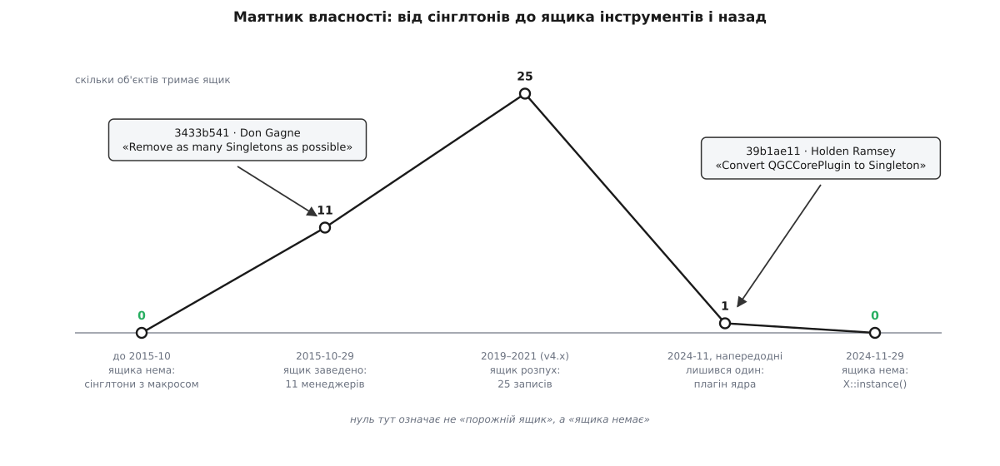

# 📜 Ящик інструментів, який з'явився й зник

Двічі за дев'ять років автори QGroundControl переписували те саме — спосіб, у який застосунок володіє своїми головними об'єктами, — і другого разу опинилися рівно там, звідки почали. Варте уваги тут не те, що робота виявилася круговою, а те, що обидва кроки розв'язували справжній біль, і біль щоразу був різний.

## Біль перший: об'єкт народжується не там, де треба

До жовтня 2015 менеджери станції були сінглтонами, і зроблено їх було парою макросів: `DECLARE_QGC_SINGLETON` у заголовку, `IMPLEMENT_QGC_SINGLETON` у реалізації. Макрос розгортався в статичний вказівник, метод `instance()` і — цікава подробиця — ще два вказівники, `_realInstance` і `_mockInstance`, разом із методом `setMockInstance()`. Тобто [сінглтон](book:programming/singleton) тут із самого початку мав дірку для тесту: тест міг підсунути замість справжнього менеджера [підставного](book:programming/test-doubles) — об'єкт із тим самим інтерфейсом, який відповідає завченими даними. Класична претензія «сінглтон не тестується» до цього коду не липла.

Липла інша, і вона записана в самому коді. Ось коментар над функцією, яку QGroundControl викликав на старті:

```
/// @brief We create all the non-ui based singletons here instead of allowing them to be created
///        randomly by calls to instance. The reason being that depending on boot sequence the
///        singleton may end up being creating on something other than the main thread.
void QGCApplication::_createSingletons(void)
```

Ось де насправді пекло. Сінглтон народжується від першого звернення — а хто звернеться першим, залежить від того, як цього разу склався запуск. Для звичайного об'єкта це байдуже. Для об'єкта Qt — ні: у нього є прив'язка до потоку. Таймери об'єкта цокають у тому потоці, де об'єкт створено; черга подій, у яку лягають сигнали з інших потоків, теж та сама. Якщо `MAVLinkProtocol` уперше запитає робітник біля серійного порту, розбирач протоколу оселиться в його потоці — і далі поводитиметься на пів пальця не так, як задумано, у спосіб, який не відтворюється двічі підряд.

Тому список створення вже існував — і був написаний руками, з коментарями про залежності:

```
    // No dependencies
    LinkManager* linkManager = LinkManager::_createSingleton();
    ...
    // Need MultiVehicleManager
    AutoPilotPluginManager* pluginManager = AutoPilotPluginManager::_createSingleton();
    ...
    // Needs everything!
    MAVLinkProtocol* mavlink = MAVLinkProtocol::_createSingleton();
```

І дзеркальний список знищення, з чесним заголовком «Take down singletons in reverse order of creation».

Ці два списки й були справжньою конструкцією. Вада не в них, а в тому, що вони не мали влади: поруч жив `instance()`, який створював об'єкт будь-коли й будь-де. Хто саме народиться першим, вирішував не список, а те, чий рядок коду виконався раніше. Одне джерело правди на папері, друге — у дії.

## 29 жовтня 2015: Don Gagne складає інструменти в один ящик

Комміт `3433b5417d62` від 29 жовтня 2015 має двоярусне повідомлення, у якому сказано і що зроблено, і замість чого:

> Remove as many Singletons as possible
>
> Instead us a Toolbox concept which hangs off of QGCApplication

Це 105 змінених файлів, і серед них два нових: `src/QGCToolbox.cc` і `src/QGCToolbox.h`. Ящик інструментів — звичайний об'єкт, що висить на `QGCApplication` і тримає одинадцять менеджерів полями: менеджер каналів, розбирач протоколу, менеджер апаратів, менеджер джойстиків, обробник повідомлень, звук, налаштування карти, менеджери плагінів прошивки й автопілота, систему фактів, домашню позицію.

Ключове — не поля, а конструктор. Він робить дві окремі речі, і саме в двох окремих проходах:

```
    _firmwarePluginManager  = new FirmwarePluginManager(app);
    _linkManager            = new LinkManager(app);
    _multiVehicleManager    = new MultiVehicleManager(app);
    _mavlinkProtocol        = new MAVLinkProtocol(app);
    // … решта

    _firmwarePluginManager->setToolbox(this);
    _linkManager->setToolbox(this);
    _multiVehicleManager->setToolbox(this);
    _mavlinkProtocol->setToolbox(this);
    // … решта
```

Спершу всі об'єкти просто виникають. Аж потім кожному дають ящик, у якому він знайде решту. Причина названа в заголовку базового класу `QGCTool`: «The prevents creating an circular dependencies at constructor time» — це рятує від циклічних залежностей на час конструювання.

Цикл тут не гіпотетичний. Розбирач протоколу мусить знати менеджер каналів, щоб отримати номер каналу для кожного з'єднання; менеджер каналів мусить знати розбирач, щоб з'єднати з ним сигнал даних нового каналу. Якби кожен питав своє в конструкторі, жодного порядку створення не існувало б — хто перший, тому й нема кого спитати. Розділення на «існує» й «підключений» знімає цикл повністю: у першому проході ніхто нікого не питає, у другому всі вже є.

Плата за це — правило, яке легко порушити й важко помітити: у конструкторі вказівник на ящик уже переданий, але **чіпати його ще не можна**. Правило довелося записати коментарем у заголовку, бо мова його не тримає.

Деструктор ящика — один явний перелік `delete` у зворотному порядку. Разом це дає три речі одразу: створення в одному місці, у визначеному порядку й гарантовано в головному потоці; знищення в момент, який видно очима; і вказівник на ящик як **справжній параметр**, який тесту можна підсунути інший.

## Чого це коштувало

Ящик не був упровадженням залежностей, хоч його часто так називають. [Упровадження залежностей](book:programming/dependency-injection) — це коли об'єкт отримує саме те, що йому потрібно, і за його оголошенням видно, від чого він залежить. Ящик віддає **все**, тому за оголошенням не видно нічого: метод, який приймає ящик, може дотягнутися до чого завгодно. Це [локатор служб](book:programming/service-locator) — реєстр, у якого питають «дай мені он те» за назвою. Залежність лишилася схованою, змінився тільки маршрут до неї.

Змінився й вигляд коду, причому не на краще:

```
qgcApp()->toolbox()->multiVehicleManager()->activeVehicle()->autopilotPlugin()
```

Чотири крапки поспіль — підручникове порушення [закону Деметри](book:programming/law-of-demeter): звертайся до сусіда, а не до сусідового сусіда. Кожна ланка цього ланцюга — це те, що не можна змінити, не переписавши виклик.

Автор це знав. У заголовку `QGCApplication.h`, просто над методом доступу до ящика, стоїть його власний рядок:

```
    // Still working on getting rid of this and using dependency injection instead for everything
    QGCToolbox* toolbox(void) { return _toolbox; }
```

Тобто ящик задумувався як пересадка, а не як станція призначення. Дійти до справжнього впровадження заважала конкретна стіна: половину об'єктів у застосунку створює не C++, а описи інтерфейсу, які роблять це самі, без аргументів конструктора. Протягнути вказівник крізь конструктор туди, де конструктор викликає не твій код, неможливо — і саме там ланцюжок «передай далі» щоразу впирався.

## Як ящик розпухав

Далі сталося те, що стається з будь-яким контейнером «для всього корисного». До версії 4.0 у ящику було вже двадцять п'ять записів: відеопідсистема, менеджер налаштувань, плагін ядра, дерево команд місії, менеджер тайлів карти, стеження за ADS-B, повітряний простір, запис MAVLink-логів — і ще кілька, обгорнутих в умовну компіляцію, бо існують не в кожній збірці.

Заголовок ящика став переліком усього, чим застосунок є. Кожен новий менеджер вимагав правки цього заголовка, а правка заголовка, який включають усі, перезбирає майже весь проєкт. Список залежностей перетворився на перепис населення — а перепис нічого не структурує.

## 29 листопада 2024: у ящику лишається одне

Протягом 2024 менеджери один за одним поверталися до доступу через `X::instance()`. Напередодні комміту `39b1ae11` у `QGCToolbox.h` лишався рівно **один** вказівник — на плагін ядра.

Комміт `39b1ae11c5babdcd52d8a4203694923cd4c5090e` авторства Holden Ramsey (HTRamsey), 29 листопада 2024, називається «Convert QGCCorePlugin to Singleton». Він чіпає 75 файлів і серед іншого прибирає `src/QGCToolbox.cc` (53 рядки) і `src/QGCToolbox.h` (50 рядків). Стіни винесли після того, як з ящика пішов останній мешканець.



*Крива не симетрична: назад маятник ішов не одним рухом, а через рік поштучних перетворень — комміт 2024 року лише прибрав порожню коробку.*

## Чому повернення не було поверненням

Сінглтон 2024 року — не той сінглтон, від якого тікали 2015-го. Сьогодні він виглядає так:

```cpp
Q_APPLICATION_STATIC(LinkManager, _linkManagerInstance);

LinkManager *LinkManager::instance()
{
    return _linkManagerInstance();
}
```

`Q_APPLICATION_STATIC` — макрос, який з'явився у Qt 6.3 (2022). Він створює об'єкт при першому зверненні, гарантує, що створення відбудеться рівно раз навіть при одночасному зверненні з кількох потоків, і — це головне — **прив'язує час життя об'єкта до об'єкта застосунку**: об'єкт знищується, коли `QCoreApplication` випромінює сигнал про власне знищення.

Порахуймо, що з цим стало з болючих пунктів 2015 року.

Створення при першому зверненні саме собою знімає [невизначений порядок ініціалізації статичних об'єктів](book:programming/cpp-static-init-order): доки ніхто не звернувся, нічого й не існує, а перше звернення завжди відбувається після старту застосунку. Це працювало й раніше — ця частина ніколи й не була проблемою.

Знищення — те, що раніше вимагало ручного списку в зворотному порядку, — тепер має визначений момент: не «десь після `main()` у порядку, який ніхто не обіцяв», а рівно тоді, коли гине об'єкт застосунку, поки цикл подій ще існує й черги ще можна прокрутити.

А ось прив'язка до потоку не зникла: об'єкт і досі народжується там, звідки його вперше запитали. Її зняли інакше — тим самим способом, що й 2015 року, тільки без ящика. У класів лишився окремий метод `init()`, який застосунок викликає з головного потоку на старті, у явному порядку:

```cpp
void LinkManager::init()
{
    _autoConnectSettings = SettingsManager::instance()->autoConnectSettings();
    // …
```

Це буквально другий прохід із конструктора ящика — «тепер, коли всі є, познайомтеся» — тільки викликаний не контейнером, а самим застосунком. Розділення «існує» й «підключений» пережило контейнер, у якому народилося.

## Що з цієї історії лишається

Маятник хитався щодо **контейнера**. Незмінними лишилися три вимоги, і саме вони, а не контейнер, були суттю обох кроків: порядок створення записаний явно і в одному місці; конструювання відокремлене від зв'язування; знищення настає у визначений момент, а не колись потім.

Ящик 2015 року був способом отримати все це власними руками — на Qt 5 і C++ тієї доби нічого готового не було. Макрос Qt 6.3 дає те саме безкоштовно від фреймворку. Коли ціна виконання вимоги падає до нуля, риштування, зведене колись, щоб цю ціну заплатити, перетворюється на чистий тягар — і зняти його не означає скасувати рішення. Це означає його оплату.

*Статус доказовості: підтверджено первинними даними репозиторію — обидва комміти, їхні дати, автори, повідомлення, склад змінених файлів і наведені фрагменти коду звірені через GitHub API та архівні знімки файлів на відповідних комітах і теґах `v4.x`.*
