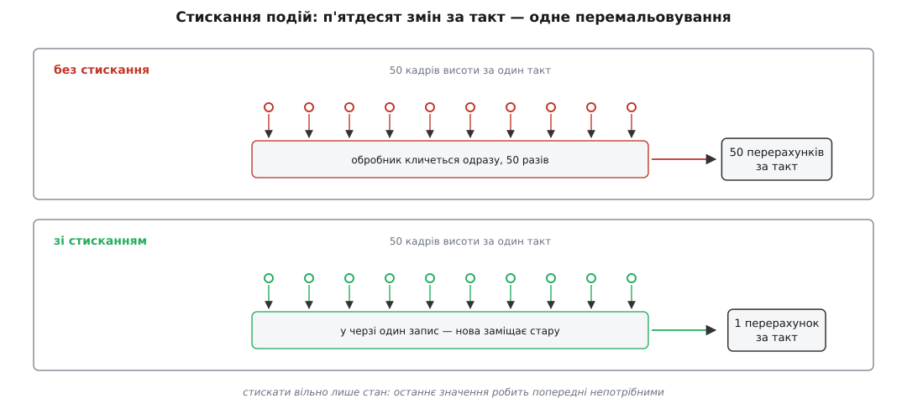

# ⚙️ Від байта до факта: конвеєр станції в одному файлі

Ось програма на C++, яка проводить число крізь усі ланки наземної станції — два джерела байтів, кадри, адресат, значення з одиницями, сповіщення «на екран» — і робить це без Qt, без бібліотеки MAVLink і взагалі без залежностей. Писати її варто не для того, щоб нею користуватися, а для того, щоб три пастки цього ланцюга показали себе числами у власному виводі: злиплі кадри, загублена дробова частина, лавина перемальовувань.

### Задача

Один файл, який робить п'ять речей і жодної зайвої.

Приймати байти від **двох** джерел одночасно — так, як вони й течуть: порціями довільної довжини, з розривом посеред кадру. Збирати з цих порцій кадри й відкидати биті. Вирішувати, якому апаратові кадр належить, і заводити апарат, якого ще не бачили. Класти число не в поле структури, а у **факт** — разом із одиницями й точністю, тримаючи нарізно те, що приїхало, і те, що показують. І, нарешті, сповіщати «екран» так, щоб потік у п'ятдесят кадрів за один такт не обернувся п'ятдесятьма перемальовуваннями.

П'ята вимога виглядає найдрібнішою. Вона окупиться перша.

### Задум: майже все тут «на кожне»

Одна думка тримає весь код: майже кожен стан у цьому ланцюгу не спільний, а **чийсь**.

**Стан розбору — на джерело.** Байт сам по собі не каже нічого: чи він початок кадру, чи довжина, чи сорок другий байт корисного навантаження, залежить від того, що було до нього. Тому [автомат, який збирає кадри зі стрічки](book:programming/stream-parser), мусить пам'ятати між викликами, де він зараз. А оскільки джерел два й порції від них перемежовуються, ця пам'ять мусить бути в кожного своя — інакше два потоки байтів пишуть в одну змінну.

**Стан значення — на апарат.** Висота 42.3 не існує сама по собі: вона чиясь. Кадр несе номер системи, і всі поля з нього лягають у той об'єкт, який цим номером володіє.

**Стан черги — на подію, а не на зміну.** Коли борт шле позицію п'ятдесят разів за такт, п'ятдесят сповіщень «висота змінилася» несуть рівно стільки ж новини, скільки одне останнє. Тому в черзі має бути **місце на подію**, і нова просто заміщає стару, доки її ніхто не забрав.

І одна річ навпаки мусить бути спільною й однією — **метадані**. Множник «міліметри → метри», кількість знаків після коми, назва для людини живуть в одному місці, а не розповзаються по обробниках і по коду екрана. Тоді додати одиниці — це змінити рядок у таблиці, а не полювати за діленнями на тисячу.

### Кадр і контрольна сума

Конверт беремо справжній — заголовок MAVLink v1: байт початку `0xFE`, довжина, номер по порядку, номер системи, номер компонента, номер повідомлення, корисне навантаження, два байти контрольної суми. Сама сума — CRC-16/MCRF4XX, той самий, що в MAVLink: рахується від байта довжини до кінця навантаження, початкове значення `0xFFFF`, фінального XOR немає. Набір повідомлень — навмисно іграшковий: серцебиття й висота. Про справжній конверт із усіма його полями є окрема розмова в темі [«Пакет MAVLink»](book:communications/mavlink-packet); про те, чому такий поліном ловить і поодинокі помилки, і пачки, — у темі [«CRC»](book:communications/crc).

```cpp
// збірка: g++ -std=c++17 -O2 byte_to_fact.cpp -o byte_to_fact
#include <cstdint>
#include <cstdio>
#include <cstddef>
#include <functional>
#include <memory>
#include <string>
#include <utility>
#include <vector>

constexpr uint8_t STX            = 0xFE;   // початок кадру
constexpr uint8_t COMP_AUTOPILOT = 1;
constexpr uint8_t MSG_HEARTBEAT  = 0;
constexpr uint8_t MSG_ALT        = 33;     // урізаний родич GLOBAL_POSITION_INT

// CRC-16/MCRF4XX: дзеркальний поліном 0x1021, старт 0xFFFF, без фінального XOR.
inline void crc_step(uint8_t b, uint16_t &crc) {
    uint8_t t = static_cast<uint8_t>(b ^ (crc & 0xFF));
    t = static_cast<uint8_t>(t ^ (t << 4));
    crc = static_cast<uint16_t>((crc >> 8) ^ (t << 8) ^ (t << 3) ^ (t >> 4));
}

// Зібрати кадр — потрібно лише для того, щоб було чим годувати розбирач.
std::vector<uint8_t> pack(uint8_t seq, uint8_t sys, uint8_t comp, uint8_t msg,
                          const std::vector<uint8_t> &payload) {
    std::vector<uint8_t> f{STX, static_cast<uint8_t>(payload.size()), seq, sys, comp, msg};
    f.insert(f.end(), payload.begin(), payload.end());

    uint16_t crc = 0xFFFF;
    for (size_t i = 1; i < f.size(); ++i) crc_step(f[i], crc);   // усе, крім STX
    f.push_back(static_cast<uint8_t>(crc & 0xFF));
    f.push_back(static_cast<uint8_t>(crc >> 8));
    return f;
}
```

Однієї деталі справжнього MAVLink тут свідомо немає: там у суму домішується ще й байт `CRC_EXTRA`, порахований з опису самого повідомлення. Завдяки йому сторона, у якої опис повідомлення інакший, не просто прочитає поля криво, а взагалі не збере кадр — розбіжність вилазить на контрольній сумі, а не в даних.

### Автомат, якому байдуже, де рвуться порції

Розбирач приймає по одному байту й повертає `true` лише тоді, коли кадр зійшовся цілком. Уся його пам'ять — у структурі `Parser`, і саме тому таких структур буде стільки, скільки джерел.

```cpp
struct Frame { uint8_t seq, sys, comp, msg, len; uint8_t payload[255]; };

struct Parser {                       // ОДИН такий на кожне джерело байтів
    enum Stage { WaitStx, Len, Seq, Sys, Comp, Msg, Payload, CrcLo, CrcHi };
    Stage    stage = WaitStx;
    Frame    f{};
    uint8_t  idx = 0;
    uint16_t crc = 0, crc_rx = 0;
    uint32_t good = 0, bad = 0;       // лічильники для демонстрації
};

bool feed(Parser &p, uint8_t b, Frame &out) {
    switch (p.stage) {
    case Parser::WaitStx:
        if (b == STX) { p.crc = 0xFFFF; p.stage = Parser::Len; }
        return false;
    case Parser::Len:  p.f.len  = b; crc_step(b, p.crc); p.idx = 0; p.stage = Parser::Seq;  return false;
    case Parser::Seq:  p.f.seq  = b; crc_step(b, p.crc); p.stage = Parser::Sys;  return false;
    case Parser::Sys:  p.f.sys  = b; crc_step(b, p.crc); p.stage = Parser::Comp; return false;
    case Parser::Comp: p.f.comp = b; crc_step(b, p.crc); p.stage = Parser::Msg;  return false;
    case Parser::Msg:  p.f.msg  = b; crc_step(b, p.crc);
                       p.stage = p.f.len ? Parser::Payload : Parser::CrcLo;      return false;
    case Parser::Payload:
        p.f.payload[p.idx++] = b; crc_step(b, p.crc);
        if (p.idx == p.f.len) p.stage = Parser::CrcLo;
        return false;
    case Parser::CrcLo:
        p.crc_rx = b; p.stage = Parser::CrcHi;
        return false;
    case Parser::CrcHi:
        p.crc_rx = static_cast<uint16_t>(p.crc_rx | (b << 8));
        p.stage  = Parser::WaitStx;
        if (p.crc_rx == p.crc) { out = p.f; ++p.good; return true; }
        ++p.bad;                       // сума не зійшлася — кадру не було
        return false;
    }
    return false;
}
```

Тут немає жодного припущення про те, як байти згруповані. Прийшло три байти — автомат просунувся на три кроки; прийшла тисяча — на тисячу. Розрив посеред кадру нічого не коштує, бо весь недобудований кадр лежить у `Parser` і чекає продовження скільки завгодно довго.

Зверніть увагу на `bad`. Коли сума не зійшлася, автомат знає рівно одне: цих байтів не було. Він не знає ані **чому**, ані **чиї** вони, — і на цьому незнанні виростає перша пастка.

### Черга, у якій нова подія заміщає стару

Найдрібніша деталь конвеєра — шина сповіщень, на яку спирається факт. Це мікроскопічний цикл подій: подія кладеться в чергу, а розсилаються всі накопичені разом наприкінці такту.

```cpp
// Стискання подій: ключ — той, хто повідомляє. Якщо його подія вже в черзі,
// нова ЗАМІЩАЄ стару, а не стає позаду неї.
class Bus {
public:
    void post(const void *who, std::function<void()> fn) {
        for (auto &e : _q)
            if (e.who == who) { e.fn = std::move(fn); ++_merged; return; }
        _q.push_back({who, std::move(fn)});
    }
    void drain() {                          // кінець такту: розсилаємо накопичене
        std::vector<Ev> batch;
        batch.swap(_q);                     // те, що обробники напостять зараз, поїде наступним тактом
        for (auto &e : batch) { e.fn(); ++_delivered; }
    }
    uint32_t merged() const    { return _merged; }
    uint32_t delivered() const { return _delivered; }
private:
    struct Ev { const void *who; std::function<void()> fn; };
    std::vector<Ev> _q;
    uint32_t _merged = 0, _delivered = 0;
};
```

`batch.swap(_q)` — не косметика. Обробник має право під час розсилки поставити нову подію; якщо розсилати просто з `_q`, така подія потрапить у той самий прохід, і два обробники, що штовхають один одного, зациклять такт. Після обміну все нове їде наступним тактом: коштує це однієї затримки, рятує від зациклення.

### Значення з паспортом

Факт — це число разом із усім, що про нього треба знати, щоб показати людині. Метадані спільні на всі однакові факти; сире значення — власне в кожного.

```cpp
struct Unit { const char *name; double perBase; };  // скільки базових одиниць в одній показаній

struct FactMeta {
    const char *name;       // назва для людини
    double      rawToBase;  // «сирі одиниці → базові»: мм → м це 0.001
    int         decimals;   // скільки знаків показувати
};

class Fact {
public:
    Fact(const FactMeta &m, Bus &bus) : _m(m), _bus(bus) {}

    void setRaw(int32_t raw) {           // рівно те, що приїхало в кадрі
        ++calls;
        if (raw == _raw) return;         // те саме число — новини немає
        _raw = raw;
        ++changes;
        _bus.post(this, [this] { if (onChanged) onChanged(*this); });
    }

    int32_t raw() const { return _raw; }
    double cooked(const Unit &u) const { return _raw * _m.rawToBase / u.perBase; }

    std::string display(const Unit &u) const {
        char buf[64];
        std::snprintf(buf, sizeof buf, "%.*f %s", _m.decimals, cooked(u), u.name);
        return buf;
    }
    const char *name() const { return _m.name; }

    std::function<void(Fact &)> onChanged;
    uint32_t calls = 0, changes = 0;     // лічильники лише для демонстрації
private:
    const FactMeta &_m;
    Bus            &_bus;
    int32_t         _raw = 0;
};
```

`setRaw` не кличе нікого напряму — він **стає в чергу**. Це і є [спостерігач](book:programming/observer) із затримкою на такт: той, хто змінює значення, не знає ні скільки в нього глядачів, ні коли вони прокинуться.

Друга важлива дрібниця — `if (raw == _raw) return;`. Серцебиття шле те саме число щосекунди, і кожне таке повідомлення без цієї перевірки будило б екран задарма.

### Апарат і маршрут

```cpp
int32_t le32(const uint8_t *p) {          // у дроті молодший байт перший
    uint32_t u = uint32_t(p[0]) | uint32_t(p[1]) << 8 |
                 uint32_t(p[2]) << 16 | uint32_t(p[3]) << 24;
    return static_cast<int32_t>(u);
}

const FactMeta ALT_META{"висота", 0.001, 1};   // сире — цілі міліметри зі знаком

struct Vehicle {
    Vehicle(uint8_t id, Bus &bus) : sysid(id), altitude(ALT_META, bus) {}

    void handle(const Frame &f) {
        switch (f.msg) {
        case MSG_ALT:
            if (f.len >= 4) altitude.setRaw(le32(f.payload));  // мм лишаються мм
            break;
        case MSG_HEARTBEAT:
            if (f.len >= 1) armed = (f.payload[0] & 0x80) != 0;
            break;
        default: break;                    // решту потоку свідомо не чіпаємо
        }
    }
    uint8_t sysid;
    bool    armed = false;
    Fact    altitude;
};

class Router {
public:
    explicit Router(Bus &bus) : _bus(bus) {}

    Vehicle *route(const Frame &f) {
        if (f.sys == 0) return nullptr;                        // службова адреса
        for (auto &v : _vehicles) if (v->sysid == f.sys) return v.get();
        // новий апарат заводить лише серцебиття автопілота: камера теж б'є серцем
        if (f.msg != MSG_HEARTBEAT || f.comp != COMP_AUTOPILOT) return nullptr;
        _vehicles.push_back(std::make_unique<Vehicle>(f.sys, _bus));
        Vehicle &v = *_vehicles.back();
        if (onNewVehicle) onNewVehicle(v);
        return &v;
    }
    const std::vector<std::unique_ptr<Vehicle>> &vehicles() const { return _vehicles; }
    std::function<void(Vehicle &)> onNewVehicle;
private:
    Bus &_bus;
    // unique_ptr, а не Vehicle за значенням: посилання на апарат мусить пережити
    // зростання вектора, а всередині Fact ще й лежить лямбда з [this]
    std::vector<std::unique_ptr<Vehicle>> _vehicles;
};
```

Порядок перевірок у `route` неочевидний, але кожна лінія в ньому зароблена. Нульовий номер системи — службовий, апаратом він не буває. Уже знайомий номер повертає наявний об'єкт, хай яке це повідомлення. І лише нове серцебиття **від компонента-автопілота** заводить новий апарат: підвіс і камера теж шлють серцебиття, і якби апарат заводило будь-яке з них, один дрон з'явився б у списку тричі.

### Складання й три сцени

```cpp
Unit g_shown{"фт", 0.3048};             // що обрав користувач; у станції це налаштування

void feed_bytes(Parser &p, Router &r, const uint8_t *b, size_t n) {
    Frame f;
    for (size_t i = 0; i < n; ++i)
        if (feed(p, b[i], f))
            if (Vehicle *v = r.route(f)) v->handle(f);
}

void feed_chunk(Parser &p, Router &r, const std::vector<uint8_t> &d) {
    feed_bytes(p, r, d.data(), d.size());
}

std::vector<uint8_t> alt_mm(int32_t mm) {
    uint32_t u = static_cast<uint32_t>(mm);
    return {uint8_t(u), uint8_t(u >> 8), uint8_t(u >> 16), uint8_t(u >> 24)};
}

int main() {
    Bus    bus;
    Router router(bus);
    Parser link[2];                     // ← стан розбору на КОЖНЕ джерело

    router.onNewVehicle = [](Vehicle &v) {
        v.altitude.onChanged = [&v](Fact &f) {
            std::printf("  екран: апарат %u   %s %s\n", unsigned(v.sysid),
                        f.name(), f.display(g_shown).c_str());
        };
    };

    const auto hbA  = pack(0, 1, COMP_AUTOPILOT, MSG_HEARTBEAT, {0x80});
    const auto altA = pack(1, 1, COMP_AUTOPILOT, MSG_ALT, alt_mm(42300));
    const auto hbB  = pack(0, 2, COMP_AUTOPILOT, MSG_HEARTBEAT, {0x00});
    const auto altB = pack(1, 2, COMP_AUTOPILOT, MSG_ALT, alt_mm(15000));

    // порції рвуться посеред кадру, а джерела чергуються — як воно й буває
    std::printf("акт 1 — два джерела, свій стан на кожне\n");
    feed_chunk(link[0], router, hbA);
    feed_chunk(link[1], router, hbB);
    feed_bytes(link[0], router, altA.data(), 6);                    // півкадру A
    feed_chunk(link[1], router, altB);                              // увесь кадр B
    feed_bytes(link[0], router, altA.data() + 6, altA.size() - 6);  // решта A
    bus.drain();
    std::printf("  апаратів: %zu   цілих кадрів: %u + %u\n",
                router.vehicles().size(), link[0].good, link[1].good);

    std::printf("акт 2 — ТІ САМІ байти в ОДИН спільний стан\n");
    Parser shared;
    Frame  f;
    int    got = 0;
    for (size_t i = 0; i < 6; ++i)            got += feed(shared, altA[i], f);  // півкадру A
    for (uint8_t b : altB)                    got += feed(shared, b, f);        // увесь кадр B
    for (size_t i = 6; i < altA.size(); ++i)  got += feed(shared, altA[i], f);  // решта A
    std::printf("  цілих кадрів: %d   зіпсованих: %u\n", got, shared.bad);

    std::printf("акт 3 — 50 кадрів висоти за один такт\n");
    Fact &alt = router.vehicles()[0]->altitude;
    const uint32_t c0 = alt.calls, ch0 = alt.changes;
    const uint32_t m0 = bus.merged(), d0 = bus.delivered();
    for (int i = 0; i < 50; ++i)
        feed_chunk(link[0], router,
                   pack(uint8_t(i), 1, COMP_AUTOPILOT, MSG_ALT, alt_mm(42300 + i * 10)));
    std::printf("  setRaw: %u   справжніх змін: %u   злито в черзі: %u\n",
                alt.calls - c0, alt.changes - ch0, bus.merged() - m0);
    bus.drain();
    std::printf("  сповіщень за такт: %u\n", bus.delivered() - d0);

    g_shown = Unit{"м", 1.0};           // користувач перемкнув одиниці
    std::printf("одиниці змінено — жодного нового байта з борту\n");
    for (const auto &v : router.vehicles())
        std::printf("  апарат %u   %s\n", unsigned(v->sysid),
                    v->altitude.display(g_shown).c_str());
}
```

Вивід:

```
акт 1 — два джерела, свій стан на кожне
  екран: апарат 2   висота 49.2 фт
  екран: апарат 1   висота 138.8 фт
  апаратів: 2   цілих кадрів: 2 + 2
акт 2 — ТІ САМІ байти в ОДИН спільний стан
  цілих кадрів: 0   зіпсованих: 1
акт 3 — 50 кадрів висоти за один такт
  setRaw: 50   справжніх змін: 49   злито в черзі: 48
  екран: апарат 1   висота 140.4 фт
  сповіщень за такт: 1
одиниці змінено — жодного нового байта з борту
  апарат 1   42.8 м
  апарат 2   15.0 м
```

Чотири числа тут варті погляду. **Нуль** цілих кадрів у другому акті — з тих самих байтів і в тому самому порядку, які щойно дали два. **49** справжніх змін із 50 викликів — перший кадр приніс те саме число, що вже лежало у факті. **48** злитих подій і **одне** сповіщення на такт. І `138.8 фт` поруч із `42.8 м` — те саме сире значення, показане двічі по-різному, без жодного нового байта з борту.

### Пастка перша: один стан на два джерела

Обидва перші акти згодували автоматам однаковий потік: пів кадру A, за ним увесь кадр B, за ним решта A. Уся різниця — скільки станів розбору за цим потоком стоїть. Ось що виходить, коли він один.

```
у стан лягло:  FE 04 01 01 01 21          ← заголовок A: чекаємо 4 байти навантаження
далі йдуть байти B:
   FE 04 01 02                            ← стали «навантаженням» кадру A
   01 21                                  ← стали «контрольною сумою» кадру A
сума не зійшлася  →  кадр A викинуто, автомат став на початок

решта B:   98 3A 00 00 C4 56              ← жодного 0xFE, автомат просто їх ковтає
решта A:   3C A5 00 00 C5 ED              ← те саме

підсумок:  цілих кадрів 0, битих 1, з двох живих кадрів не лишилося нічого
```

Шкода тут подвійна й обидві половини непомітні. Кадр A загинув від чужих байтів. Кадр B загинув **мовчки**: його заголовок з'їли як чуже навантаження, тож у лічильнику битих кадрів він навіть не з'явився — для програми його ніколи й не було.

Ще підступніша ця пастка тим, як вона виглядає ззовні. Кожне джерело окремо працює бездоганно; проблема з'являється, лише коли обидва активні одночасно, і росте з їхньою швидкістю. А коли [лічильник втрат](book:communications/sequence-numbering) починає стрибати на **обох** каналах разом і саме тоді, коли обидва працюють, — це майже певний підпис спільного стану розбору.

Найтиповіша спроба це полагодити не працює зовсім. М'ютекс навколо спільного розбирача прибирає перегони за пам'ять, але кадри однаково злипаються: два потоки байтів так само вливаються в один автомат, просто тепер по черзі. Полагодити тут можна лише поділом стану — рівно тому в бібліотеці MAVLink стан розбору лежить у масиві, індексованому **номером каналу**, а не в одному глобальному об'єкті. Настільна збірка тримає 16 таких комірок (на мікроконтролері їх чотири) — звідси й береться стеля на кількість одночасних з'єднань. Хто кому й куди роздає ці номери, розказано в темі [«Менеджер каналів»](book:qgroundcontrol/link-manager), а що станція робить із розібраними кадрами далі — у темі [«Маршрутизація за sysid і compid»](book:qgroundcontrol/message-routing).

### Пастка друга: одиниці, переведені цілими

Висота приїхала цілим числом міліметрів, показати її треба у футах з одним знаком. Спокуса перевести одразу, у той самий тип, велика — і рівно там зникає дробова частина.

**Умова: `relative_alt = 42300` мм, показ у футах, один знак після коми.**

```
сире значення                         = 42300        мм   (int32, як у кадрі)

ХИБНО — переводимо цілими:
  42300 / 1000                        = 42           м    (0.3 м зникло безслідно)
  −400  / 1000                        = 0            м    (ділення в C тне до нуля,
                                                           а не «вниз»: −0.4 → 0)

ПРАВИЛЬНО — сире лишається цілим, множник дробовий:
  42300 · 0.001                       = 42.3         м
  42.3 / 0.3048                       = 138.7795…    фт
  округлення за точністю факта        = 138.8        фт
```

Друга половина пастки помітна ще менше: зберегти **показане** замість сирого. Тоді перемикання одиниць нема з чого перерахувати, і зворотний хід уже не сходиться:

```
зберегли те, що на екрані             = 138.8        фт
назад у метри: 138.8 · 0.3048         = 42.30624     м   ≠ 42.3
```

Похибка мала, але вона накопичується з кожним оберненням і, головне, вона незворотна: округлення до показу — операція, що втрачає інформацію, і робити її треба **один раз, в останню мить**. Саме тому в коді вище `_raw` цілий і в міліметрах, а `cooked()` рахує від нього щоразу наново. Загальний бік цього — [переведення одиниць](book:math/unit-conversion) і [похибка дробових обчислень](book:math/float-arithmetic-error); коли ж дробових чисел не можна взагалі, живе [арифметика з фіксованою комою](book:programming/fixed-point) — той самий прийом «ціле плюс відомий масштаб», яким і є пара `_raw` + `rawToBase`.

Є в цій пастці й третій, найтихіший кут: **кількість знаків належить показаній одиниці, а не значенню**.

```
0.1 м    = 100 мм
0.1 фт   = 30.48 мм        ← той самий «один знак» утричі точніший
```

Один знак у метрах і один знак у футах — це різна правда про апарат. Коли метадані обіцяють точність, а одиниці перемикаються, обіцянка мусить перемикатися разом із ними.

> 🔧 **Навіщо це.** Той самий поділ на сире й зварене робить редактор параметрів можливим. Апарат присилає значення в своїх одиницях і опис до нього; станція будує факт, а елемент керування бере з метаданих і межі, і крок, і підпис. Ані обробник повідомлення, ані код екрана не знають назви жодного параметра — усе, що між ними, — це [модель факта](book:qgroundcontrol/fact-system).

### Пастка третя: стиснути те, чого стискати не можна

Стискання подій із третього акту виглядає безкоштовним виграшем, і для стану воно таким і є: висота, заряд, координата — це **останнє відоме**, і нове значення робить попереднє непотрібним. Викинути проміжні тут чесніше, ніж сумлінно перемалювати кожне й на цьому захлинутися.



*Вирішує не швидкість потоку, а те, що саме їде в черзі: у верхньому рядку кожна зміна — окрема подія, у нижньому всі вони зливаються в одну, бо в стану є тільки останнє значення.*

Пастка — у тому, що не все, що йде тим самим шляхом, є станом.

Підтвердження команди — **подія**: два підтвердження на дві команди не можна злити в одне, бо вони про різне. Натиск кнопки — подія: два натиски це два натиски. Запис у журнал телеметрії — теж подія: журнал пишуть, щоб потім відтворити політ, і стиснута історія перестає бути історією. Тому в станції запис у файл сидить **до** моделі фактів, поруч із розбирачем, а не після нього.

Правило просте: стискати вільно те, у чого попереднє значення нікому не потрібне, щойно прийшло нове. Усе інше — черга без стискання. Загальний бік цього розділення — [локальний протитиск](book:programming/backpressure-local) і [злиття однакових запитів](book:programming/request-coalescing).

І дві дрібні розтяжки поруч. Перевірка `raw == _raw` на дробових числах поводиться інакше, ніж очікується: `NaN` не дорівнює сам собі, тож факт із `NaN` сповіщатиме про «зміну» на кожному кадрі, хоч нічого не змінюється. А затримка на такт означає, що між приходом байта й перемальовуванням завжди є проміжок — для показу стану це непомітно, для секундоміра чи звукового сигналу вже ні.

### Пастка на зворотному ході: команда без підтвердження

Зворотний бік конвеєра коротший, але має протилежну властивість. Телеметрія втрачає кадр без наслідків: наступний прийде за двадцять мілісекунд. Команда втрачається **один раз і назавжди** — ніхто про це не скаже, бо мовчання каналу нічим не відрізняється від мовчання апарата.

Тому команда — не виклик, а маленький автомат із таймером. Сама посилка тут за дужками: вона така сама, як `pack` вище, тільки з номером команди й полем `confirmation` у навантаженні.

```cpp
struct Pending {
    uint16_t cmd;                 // яку команду чекаємо підтвердити
    uint8_t  tries    = 0;        // воно ж поле confirmation у кадрі
    uint64_t deadline = 0;        // коли вважати, що відповіді вже не буде
    bool     acked    = false;
    bool     failed   = false;
};

void tick(Pending &p, uint64_t now_ms) {
    if (p.acked || p.failed || now_ms < p.deadline) return;
    if (p.tries >= 3) { p.failed = true; return; }   // стільки ж дає QGroundControl
    send_command(p.cmd, p.tries);                    // confirmation = номер спроби
    ++p.tries;
    p.deadline = now_ms + 1000;                      // мс
}
```

Поле `confirmation` тут не формальність. Стандарт MAVLink описує його саме як лічильник повторів: перша посилка йде з нулем, кожен наступний повтор збільшує його на одиницю, і борт із цього числа бачить, що команда та сама, а не нова. Потреба в такому лічильнику береться з простої несиметричності: загубитися може не лише команда, а й **підтвердження на неї**. У другому випадку борт уже все виконав, а станція про це не знає й шле ще раз.

Звідси — вимога, яку легко проґавити. Повтори безпечні лише для команд, повторення яких нічого не міняє: перемкнути режим, задати частоту потоку, роззброїти. Команда «скинути вантаж» від повтору стає двома скиданнями, і жоден таймаут цього не виправить. Це загальна властивість, а не примха протоколу: [ідемпотентність](book:programming/idempotency) — умова, за якої повтор узагалі можна вважати безпечним, а [повтори з витримкою](book:programming/retries-backoff) — те, що з цієї умови виростає.

### Скільки це коштує

```
Frame                     = 5 полів + буфер 255 Б     = 260 Б
стан розбору на джерело   = Frame + позиція, сума, лічильники ≈ 280 Б
16 джерел одночасно       = 16 · 280                  ≈ 4.4 КБ
розбір                    = O(1) на байт, без жодного виділення пам'яті
копія кадру назовні       = 260 Б на КОЖЕН цілий кадр
пошук апарата             = O(кількість апаратів) на кадр
Bus::post                 = O(довжина черги) на виклик
                            → O(n²) на такт, якщо черга довга
```

Перші чотири рядки — причина, чому такий розбір ставлять на найгарячіший шлях без вагань: він не виділяє пам'яті й не має жодного циклу, довшого за один байт. П'ятий — перша річ, яку прибирають, коли кадрів багато: `out = p.f` копіює всі 255 байтів буфера, навіть якщо навантаження чотирибайтове. Останні два — приклад, як лінійний пошук живе довго й непомітно: доки апаратів двоє, а черга — десятки записів, він швидший за будь-яку таблицю; на тисячі записів у черзі той самий рядок стає квадратом.

### Чого тут немає

Цей конвеєр свідомо не вміє трьох речей, і кожна з них — окрема підсистема справжньої станції. Він не рахує втрат: поле `seq` розбирається й одразу забувається, тож дірка в нумерації проходить непоміченою. Він однопотоковий, а в станції читання з порту неминуче їде у власний потік, і кожна межа між потоками стає ще однією чергою — про це [модель потоків](book:qgroundcontrol/threading-model). І він приймає будь-який кадр, що зійшовся сумою, тоді як MAVLink v2 має ще й підпис, який треба перевіряти ключем, — [обробка MAVLink](book:qgroundcontrol/mavlink-handling) починається саме там, де закінчується цей файл.
