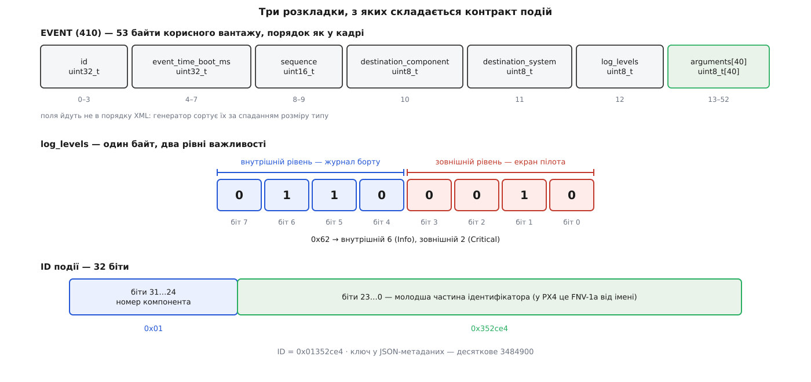

# 📋 Контракт інтерфейсу подій: чотири повідомлення, байт рівнів і форма метаданих

Довідка з того, чим саме обмінюються борт і станція, коли подія їде числом замість тексту: поля чотирьох повідомлень MAVLink разом із їхніми зсувами в кадрі, розкладка байта важливості, будова 32-бітового ідентифікатора й схема JSON-метаданих версії 2 з синтаксисом шаблону. Усі числа тут узято з `common.xml` протоколу MAVLink і зі схеми `validation/schema.json` бібліотеки `libevents` — двох файлів, за якими звіряються обидві сторони обміну. Довідка потрібна тоді, коли треба написати власний приймач, розібрати чужий бортовий журнал або зрозуміти, чому подія прилетіла, а тексту з неї не вийшло.

## Чотири повідомлення

Усі чотири позначені в описі протоколу тегом `<wip/>` — «робота триває». Позначка стосується не наявності, а обіцянок: генератори коду ці повідомлення роблять як звичайні (заголовок `mavlink_msg_event.h` є в стандартній C-бібліотеці), але поля формально ще можуть змінитися, тож спиратися на них там, де оновити обидві сторони одночасно неможливо, — ризиковано. Шле їх PX4; ArduPilot станом на сьогодні не шле нічого з цієї четвірки.

| ID | Ім'я | Хто надсилає | Кому | Вантаж, байтів | `CRC_EXTRA` |
| --- | --- | --- | --- | --- | --- |
| 410 | `EVENT` | компонент-джерело | широкомовно | 53 | 160 |
| 411 | `CURRENT_EVENT_SEQUENCE` | компонент-джерело | широкомовно | 3 | 106 |
| 412 | `REQUEST_EVENT` | приймач | адресно | 6 | 33 |
| 413 | `RESPONSE_EVENT_ERROR` | компонент-джерело | адресно | 7 | 77 |

«Вантаж» — довжина корисної частини без заголовка й контрольної суми; про будову самого кадру — [пакет MAVLink](topic:communications/mavlink-packet). `CRC_EXTRA` — байт, який домішується до контрольної суми й ловить розбіжність описів: якщо ваш `common.xml` не збігається з тим, із якого зібрано прошивку, кадр не пройде перевірки й до розбору просто не дійде. Звідки цей байт береться — [генерація коду з XML-опису MAVLink](topic:communications/mavlink-xml-codegen).

Зсуви в таблицях нижче — це порядок **у кадрі**, а не порядок в XML. Генератор переставляє поля за спаданням розміру типу: спершу всі чотирибайтові, потім двобайтові, потім однобайтові; масив стає в чергу за розміром свого елемента. Робиться це, щоб кожне поле лягло на власне вирівнювання й читалося з буфера без зсувань. Тому в `EVENT` ідентифікатор стоїть першим, хоч в описі він третій, а обидва байти адресата опинилися десятим і одинадцятим.



*Верхня смуга — порядок полів у кадрі; середня — той самий байт, прочитаний двома половинками; нижня — ідентифікатор, у якому старший байт вибирає простір імен.*

### `EVENT` (410)

| Зсув | Поле | Тип | Одиниці | Що означає |
| --- | --- | --- | --- | --- |
| 0–3 | `id` | `uint32_t` | — | ідентифікатор події, як він визначений у метаданих компонента |
| 4–7 | `event_time_boot_ms` | `uint32_t` | мс | час від увімкнення апарата на момент, коли подія сталася |
| 8–9 | `sequence` | `uint16_t` | — | порядковий номер події в цього компонента |
| 10 | `destination_component` | `uint8_t` | — | компонент, якого подія стосується; 0 — усі |
| 11 | `destination_system` | `uint8_t` | — | система, якої подія стосується; 0 — усі |
| 12 | `log_levels` | `uint8_t` | — | два рівні важливості, спаковані в один байт |
| 13–52 | `arguments[40]` | `uint8_t[40]` | — | значення аргументів, спаковані підряд |

Поля адресата тут навмисно названі `destination_*`, а не звичним для MAVLink `target_*`, і різниця не косметична. `target_*` означає «це повідомлення для вас, решта може не читати». Тут так не можна: **кожен** приймач мусить бачити всі події джерела, інакше він не помітить пропуску в нумерації. Тому події розсилаються широкомовно, а `destination_*` каже лише, кого подія найбільше обходить. Приймач, який відкидає події за цими полями, зламає собі виявлення втрат.

Час `event_time_boot_ms` — не час доставки, а час самої події на борту; він же слугує запасним сигналом перезавантаження, коли прапорець `RESET` загубився. Оскільки лічильник 32-бітовий і рахує мілісекунди, він обертається приблизно через 49.7 доби безперервної роботи:

```
2³² мс = 4294967296 мс = 4294967.296 с ≈ 49.71 доби
```

### `CURRENT_EVENT_SEQUENCE` (411)

| Зсув | Поле | Тип | Що означає |
| --- | --- | --- | --- |
| 0–1 | `sequence` | `uint16_t` | останній номер, який компонент уже видав |
| 2 | `flags` | `uint8_t` | бітове поле `MAV_EVENT_CURRENT_SEQUENCE_FLAGS` |

Три байти — і жодного поля адресата: повідомлення суто широкомовне. Періодичність протокол не задає, її обирає прошивка.

### `REQUEST_EVENT` (412)

| Зсув | Поле | Тип | Що означає |
| --- | --- | --- | --- |
| 0–1 | `first_sequence` | `uint16_t` | перший номер запитаного діапазону |
| 2–3 | `last_sequence` | `uint16_t` | останній номер запитаного діапазону, включно |
| 4 | `target_system` | `uint8_t` | система, у якої просимо |
| 5 | `target_component` | `uint8_t` | компонент, у якого просимо |

Діапазон замкнений з обох боків, тож `first_sequence == last_sequence` означає рівно одну подію. `first_sequence` цілком може бути **більшим** за `last_sequence` — це нормальний запит через обертання лічильника, а не помилка. На кожен номер із діапазону борт відповідає окремо: або `EVENT`, або `RESPONSE_EVENT_ERROR`. Це єдине повідомлення четвірки, яке шле станція.

### `RESPONSE_EVENT_ERROR` (413)

| Зсув | Поле | Тип | Що означає |
| --- | --- | --- | --- |
| 0–1 | `sequence` | `uint16_t` | номер, який просили і якого немає |
| 2–3 | `sequence_oldest_available` | `uint16_t` | найстаріший номер, що ще лежить у буфері борту |
| 4 | `target_system` | `uint8_t` | кому відповідь |
| 5 | `target_component` | `uint8_t` | кому відповідь |
| 6 | `reason` | `uint8_t` | причина з `MAV_EVENT_ERROR_REASON` |

`sequence_oldest_available` — це не просто діагностика, а точка, з якої приймачеві продовжувати. Кількість безповоротно втрачених подій рахується беззнаковою різницею, і саме беззнаковою, щоб обертання лічильника не давало від'ємних чисел:

```
втрачено = (uint16_t)(sequence_oldest_available − sequence)
```

## Два перелічувані типи

| Тип | Значення | Ім'я | Що означає |
| --- | --- | --- | --- |
| `MAV_EVENT_CURRENT_SEQUENCE_FLAGS` (бітова маска) | `1` (біт 0) | `..._RESET` | нумерація почалася спочатку — наприклад, апарат перезавантажився |
| `MAV_EVENT_ERROR_REASON` | `0` | `..._UNAVAILABLE` | запитаної події вже (або ще) немає |

По одному значенню в кожному — це не незавершеність, а точний розмір задачі. Прапорцям у `flags` немає про що говорити, крім скидання нумерації; відмові на запит немає причин, крім «немає». Значення `0` у полі `flags` при цьому цілком законне й означає «нічого особливого не сталося».

Обидва типи розширюватимуться, тож приймач мусить поводитися з ними так само, як з будь-яким перелічуваним типом MAVLink: **невідомий біт у масці ігнорувати, невідому причину помилки обробляти як «подія недоступна»**. Приймач, що падає або зупиняє розбір на незнайомому значенні, зламається від першого ж оновлення протоколу.

## Байт `log_levels`

Один байт везе два незалежні рівні важливості: один для екрана пілота, другий для бортового журналу.

```
log_levels = (внутрішній << 4) | зовнішній

внутрішній = log_levels >> 4      // рівень для журналу борту
зовнішній  = log_levels & 0x0F    // рівень для наземної станції
```

| Значення | Ім'я | Що означає |
| --- | --- | --- |
| 0 | `Emergency` | система непридатна до роботи |
| 1 | `Alert` | діяти негайно |
| 2 | `Critical` | відмова головної системи |
| 3 | `Error` | помилка в другорядній або резервованій системі |
| 4 | `Warning` | попередження про можливу майбутню помилку |
| 5 | `Notice` | незвичайна подія, що не є помилкою |
| 6 | `Info` | звичайне робоче повідомлення |
| 7 | `Debug` | подробиця для налагодження |
| 8 | `Protocol` | службова подія — людині **не показувати** |
| 9 | `Disabled` | вимкнено — не показувати й не записувати |

Значення 0…7 збігаються з `MAV_SEVERITY`, а той, своєю чергою, успадкував і числа, і назви від рівнів системного журналу RFC 5424. Збіг зроблено навмисно: подія й старий `STATUSTEXT` сходяться в одній стрічці, і приймачеві не треба нічого перекладати — досить узяти молодший піврядок.

Два останні значення шкали `MAV_SEVERITY` не має, і саме вони найчастіше стають несподіванкою. `Protocol` позначає подію, що є частиною службового обміну (наприклад, кроку калібрування): вона несе дані, а не повідомлення, і на екрані їй нема чого робити. `Disabled` вимикає запис зовсім. Приймач, який просто передає зовнішній рівень у показ повідомлень, вивалить на пілота обидва різновиди; тому перевірка «≥ 8 — не показувати» обов'язкова.

**Умова: подія `commander_arm_denied_calibrating` — пілотові критично, у журнал борту достатньо інформативно.**

```
зовнішній Critical = 2
внутрішній Info    = 6

log_levels = (6 << 4) | 2 = 0x60 | 0x02 = 0x62 = 98

назад:  0x62 >> 4   = 6   → Info      (журнал)
        0x62 & 0x0F = 2   → Critical  (екран)
```

## Ідентифікатор події

Тридцять два біти діляться на дві нерівні частини:

```
ID = (компонент << 24) | (молодша частина & 0x00FFFFFF)

компонент       = ID >> 24          // ключ у метаданих, простір імен
молодша частина = ID & 0x00FFFFFF   // ключ конкретної події всередині простору
```

Старший байт — не номер компонента MAVLink, а **номер простору імен у метаданих**; за домовленістю його беруть однаковим із номером компонента (для багатоекземплярних — із номером першого, скажімо `GIMBAL1`). Завдяки цьому байту події підвіса й події автопілота не змішаються навіть тоді, коли їх зведуть докупи — при розборі бортового журналу, де номера компонента поруч уже немає.

Молодші 24 біти протокол ніяк не обмежує: це просто число, і призначати його вільно кожному, хто пише свої метадані. У спільному просторі `common` бібліотеки `libevents` номери проставлені вручну й підряд — події калібрування там мають 1100, 1101, 1102, 1103. PX4 для власного простору обрав інший спосіб: рахувати номер із **імені** події 32-бітовим хешем FNV-1a і брати від нього молодші 24 біти. Обидва підходи законні; хеш просто знімає потребу вести реєстр номерів вручну.

:::tabs
```cpp
// Так це рахує прошивка: constexpr — тобто ще при компіляції,
// у двійковий образ потрапляє готова стала.
#include <cstdint>

constexpr uint32_t fnv1a32(const char *s, uint32_t h = 0x811c9dc5u)
{
    return *s ? fnv1a32(s + 1, (h ^ static_cast<uint8_t>(*s)) * 0x01000193u) : h;
}

constexpr uint32_t eventId(uint8_t component, const char *name)
{
    return (static_cast<uint32_t>(component) << 24) | (fnv1a32(name) & 0x00FFFFFFu);
}

static_assert(eventId(1, "commander_rtl") == 0x01352ce4u, "");
```
```python
# Так це рахує скрипт, що складає метадані при збиранні прошивки,
# і так само рахує будь-який інструмент, що читає бортовий журнал.
def fnv1a32(name: str) -> int:
    h = 0x811C9DC5
    for ch in name:
        h ^= ord(ch)
        h = (h * 0x01000193) & 0xFFFFFFFF
    return h


def event_id(component: int, name: str) -> int:
    return (component << 24) | (fnv1a32(name) & 0xFFFFFF)


assert event_id(1, "commander_rtl") == 0x01352CE4
```
:::

Множник `0x01000193` і початкове значення `0x811c9dc5` — це стандартні сталі 32-бітового FNV-1a; чому саме такі й чим FNV відрізняється від сусідів по класу — [некриптографічні хеш-функції](topic:algorithms/non-cryptographic-hash).

**Умова: подія `commander_rtl`, простір імен автопілота (компонент 1).**

```
FNV-1a("commander_rtl")  = 0x7a352ce4
молодші 24 біти          = 0x352ce4  = 3484900 (десяткове)
компонент 1 у старший байт= 0x01000000
ID                       = 0x01352ce4
```

Останнє число варте окремої уваги: **ключем у JSON-метаданих є десяткове подання молодшої частини**, а не повний ідентифікатор і не шістнадцяткове. Подію `commander_rtl` шукатимуть за рядком `"3484900"` у групі того простору імен, чий номер дорівнює `0x01`.

| Ім'я події | FNV-1a | Молодші 24 біти | Ключ у JSON | `ID` при компоненті 1 |
| --- | --- | --- | --- | --- |
| `commander_rtl` | `0x7a352ce4` | `0x352ce4` | `3484900` | `0x01352ce4` |
| `commander_arm_denied_calibrating` | `0x871f87d3` | `0x1f87d3` | `2066387` | `0x011f87d3` |

## Сорок байтів аргументів

| Правило | Значення |
| --- | --- |
| Порядок | той самий, що в масиві `arguments` метаданих |
| Заповнення | немає — кожен аргумент починається одразу після попереднього |
| Порядок байтів | молодший спершу (little-endian) |
| Вирівнювання | не гарантоване, читати треба копіюванням |
| Стеля | сума розмірів усіх аргументів ≤ 40 байтів |

| Тип | Байтів |
| --- | --- |
| `uint8_t`, `int8_t` | 1 |
| `uint16_t`, `int16_t` | 2 |
| `uint32_t`, `int32_t`, `float` | 4 |
| `uint64_t`, `int64_t` | 8 |
| перелічуваний тип | стільки, скільки має його базовий тип |

Відсутність заповнення — головна пастка цієї частини контракту. Подія з `uint8_t` і `float` займе 5 байтів, і `float` почнеться зі зсуву 1, тобто на непарній адресі. Читати його через приведення вказівника на архітектурі, яка не терпить невирівняного доступу, — готовий збій; про причину — [біти й порядок байтів](topic:programming/bits-bytes-endianness). Правильно так:

```c
/* значення float, що починається зі зсуву offset у ev.arguments */
float value;
memcpy(&value, ev.arguments + offset, sizeof value);
```

Хвіст масиву за останнім аргументом ніякого сенсу не має: борт його не заповнює осмислено, а приймач не читає. Довжина корисної частини визначається не полем у кадрі, а метаданими — розбирач додає розміри аргументів з опису й знає, де кінець.

## Метадані: JSON версії 2

Файл описів приїжджає з борту як один із видів [відомостей про компонент](topic:qgroundcontrol/component-information) — під кодом `COMP_METADATA_TYPE_EVENTS`; про сам формат — [JSON](topic:programming/json-format). Схема строга: `additionalProperties` скрізь заборонені, тож зайвий ключ — не «розширення», а помилка перевірки.

```json
{
  "version": 2,
  "components": {
    "1": {
      "namespace": "px4",
      "supported_protocols": ["health_and_arming_check"],
      "enums": {
        "navigation_mode_group_t": {
          "type": "uint32_t",
          "description": "Групи режимів польоту",
          "is_bitfield": true,
          "entries": {
            "1": { "name": "mode_group_0", "description": "Ручні режими" }
          }
        }
      },
      "event_groups": {
        "default": {
          "events": {
            "3484900": {
              "name": "commander_rtl",
              "message": "Returning to launch",
              "description": "Апарат повертається до точки зльоту.",
              "arguments": []
            }
          }
        }
      },
      "navigation_mode_groups": {
        "groups": { "0": [1, 2, 3] }
      }
    }
  }
}
```

| Ключ верхнього рівня | Тип | Обов'язковий | Що означає |
| --- | --- | --- | --- |
| `version` | ціле | так | рівно `2`; схема прямо забороняє інші значення |
| `components` | об'єкт | так | ключ — 8-бітовий номер простору імен рядком |
| `translation` | об'єкт | ні | супровідна структура для перекладених файлів |

| Ключ компонента | Тип | Обов'язковий | Що означає |
| --- | --- | --- | --- |
| `namespace` | рядок `^[a-z][a-z0-9_]*$` | так | ім'я простору імен: `common`, `px4`, `camera` |
| `enums` | об'єкт | ні | ключ — ім'я типу, обов'язково із суфіксом `_t` |
| `event_groups` | об'єкт | ні | ключ — ім'я групи `^[a-z][a-z0-9_]*$` |
| `supported_protocols` | масив рядків | ні | лише `"calibration"` і `"health_and_arming_check"` |
| `navigation_mode_groups` | об'єкт | ні | відповідність груп режимів польоту номерам `custom_mode` |

| Ключ перелічуваного типу | Тип | Обов'язковий | Що означає |
| --- | --- | --- | --- |
| `type` | рядок | так | базовий цілий тип, від `uint8_t` до `int64_t`; `float` не можна |
| `description` | однорядковий рядок | ні | опис типу |
| `is_bitfield` | булеве | ні | значення складаються з бітів, а не вибираються одне |
| `separator` | рядок | ні | чим склеювати кілька бітів при показі; типово `|` |
| `entries` | об'єкт | ні | ключ — значення десятковим рядком; всередині `name` і `description` |

| Ключ події | Тип | Обов'язковий | Що означає |
| --- | --- | --- | --- |
| `name` | рядок `^[a-zA-Z][a-zA-Z0-9_]*$` | так | ім'я події, унікальне в просторі імен |
| `message` | рядок 1…120 символів, без переносів | так | короткий однорядковий текст |
| `description` | рядок | ні | розлогий опис; переноси дозволені |
| `type` | рядок | ні | лише `"summary"` або `"append_health_and_arming_messages"` |
| `instance_arg_index` | ціле | ні | індекс аргументу, що вказує на номер екземпляра (яка саме IMU, яка батарея) |
| `arguments` | масив | ні | аргументи в порядку серіалізації |

| Ключ аргументу | Тип | Обов'язковий | Що означає |
| --- | --- | --- | --- |
| `name` | рядок `^[a-zA-Z][a-zA-Z0-9_]*$` | так | ім'я аргументу |
| `type` | рядок | так | базовий тип або ім'я перелічуваного типу з `enums` |
| `description` | рядок | ні | опис аргументу |

`navigation_mode_groups` має рівно один обов'язковий ключ — `groups`. Усередині нього ключ є **індексом групи** (нумерація з нуля, той самий індекс, що й номер біта в масці вражених режимів), а значення — масив номерів `custom_mode`, які до цієї групи належать. Це єдина ланка, що перекладає абстрактну «групу режимів» із події в конкретний режим польоту, тому без неї звіт готовності не має за що зачепитися.

> 🔧 **Навіщо це.** Дві помилки в цьому файлі не видно очима, але вони вбивають розбір повністю. Перша: ключ події записаний шістнадцятковим рядком або повним ідентифікатором замість десяткової молодшої частини — жодна подія не знайдеться, а причина виглядатиме як «метадані не доїхали». Друга: ім'я перелічуваного типу без суфікса `_t` — файл не пройде перевірку схеми ще на збиранні прошивки.

## Шаблон повідомлення й опису

І `message`, і `description` — не готові рядки, а шаблони. Підстановка аргументів іде за позицією, у синтаксисі, близькому до пітонівського, але з нумерацією **від одиниці**.

```
{ARG_IDX[:.NUM_DECIMAL_DIGITS][UNIT]}
```

| Запис | Що дає |
| --- | --- |
| `{1}` | перший аргумент як є; перелічуваний тип — назвою значення |
| `{2:.1}` | другий аргумент із одним знаком після коми |
| `{3m}` | третій аргумент як горизонтальна відстань |
| `{2:.1m/s}` | другий аргумент із одним знаком і як швидкість |

| Позначка | Величина |
| --- | --- |
| `m` | горизонтальна відстань у метрах |
| `m_v` | вертикальна відстань у метрах |
| `m^2` | площа в квадратних метрах |
| `m/s` | швидкість у метрах на секунду |
| `C` | температура в градусах Цельсія |

Позначка потрібна не для друку суфікса, а щоб приймач міг **перерахувати** число в ту систему одиниць, яку вибрав користувач. Тому горизонтальна й вертикальна відстані розрізняються, хоча обидві в метрах: у показі вони цілком можуть розійтися — милі по землі й фути по висоті. Розбирач за замовчуванням просто приписує `m` в обох випадках, а різницю використовує лише той застосунок, який підставив власний перетворювач одиниць.

| Тег | Що робить |
| --- | --- |
| `<profile name="[!]NAME">…</profile>` | показати вміст лише в профілі `NAME`; зі знаком `!` — у всіх, крім нього |
| `<a href="URL">…</a>` | посилання; без `href` за адресу править сам вміст |
| `<param>PARAM_NAME</param>` | згадка [параметра апарата](topic:qgroundcontrol/parameter-manager) |

Три правила про теги, кожне з яких колись когось спіймало. Вкладати теги **одного** типу не можна. Невідомий тег розбирач викидає **разом із вмістом** — тобто чуже розширення не забруднить рядок, але й тексту з нього не лишиться. Профілів у бібліотеці рівно два, `dev` і `normal`, і спроба поставити третій просто нічого не змінить.

Екранування зворотною похилою рискою потрібне трьом символам: `\\`, `\<` і `\{`. Усе інше проходить як є. Готовий рядок бібліотека обрізає з обох боків від пробілів.

## Що додатково вимагають групи `health` і `arming_check`

Група — просто мітка в метаданих, і приймач вільний робити з нею що завгодно, з одним обов'язком: **невідому групу не показувати**. Але дві групи мають додатковий контракт, без якого звіт готовності не збереться.

| Вимога | Деталі |
| --- | --- |
| Порядок серії | подія з `type: "summary"` групи `arming_check` → N подій-перевірок → подія з `type: "summary"` групи `health` |
| Обов'язкові аргументи перевірки | перший — маска вражених груп режимів (перелічуваний тип-бітове поле); другий — `uint8_t` номер вузла в масці станів |
| Перший біт маски вузлів | завжди має бути значення з іменем `none` |
| Оголошення підтримки | `"health_and_arming_check"` у `supported_protocols` компонента |
| Особливий тип події | `append_health_and_arming_messages` дописує до тексту всі поточні попередження й помилки; такій події першим аргументом іде режим |

Серія може приходити частинами, і приймач зводить їх докупи сам. Без оголошення в `supported_protocols` станція вважає, що протоколу немає, і не показує екран готовності взагалі — навіть якщо всі потрібні події справно летять.

## Мінімальний обмін

Запит на повтор — єдине, що приймач надсилає сам:

```c
#include <common/mavlink.h>

/* попросити в автопілота події з 43-го по 45-й номер включно */
mavlink_message_t msg;
mavlink_msg_request_event_pack(
        255, MAV_COMP_ID_MISSIONPLANNER,   /* наші sysid і compid */
        &msg,
        1, MAV_COMP_ID_AUTOPILOT1,         /* у кого просимо */
        43, 45);                           /* first_sequence, last_sequence */
```

Розбір заголовка події — усе, що потрібно, щоб вирішити долю кадру ще до звертання до метаданих:

```c
mavlink_event_t ev;
mavlink_msg_event_decode(&msg, &ev);

const uint8_t  ns_id    = (uint8_t)(ev.id >> 24);        /* простір імен у метаданих */
const uint32_t sub_id   = ev.id & 0x00FFFFFFu;           /* ключ події, десятковий */
const uint8_t  external = ev.log_levels & 0x0Fu;         /* рівень для людини */
const uint8_t  internal = (uint8_t)(ev.log_levels >> 4); /* рівень для журналу */

if (external >= 8) {
    return;   /* Protocol або Disabled — показувати нічого */
}
```

Далі вступає нумерація, і тут важить рівно один рядок — той, що робить порівняння номерів стійким до обертання лічильника:

```c
/* diff рахується в uint16_t, тому перехід 65535 → 0 обробляється сам собою */
const uint16_t diff = (uint16_t)(ev.sequence - expected_sequence);

if (diff == 0)                    accept(&ev);            /* та, на яку чекали */
else if (diff > UINT16_MAX / 2)   /* старіша: дублікат */ ;
else                              request_range(expected_sequence, ev.sequence - 1);
```

Порогом слугує половина кола, `32767`. Усе, що лежить у першій половині за очікуваним номером, вважається новішим; усе, що в другій, — старішим. Іншого способу впорядкувати циклічну шкалу немає, і саме тому діапазон у `REQUEST_EVENT` дозволено задавати «навиворіт».
