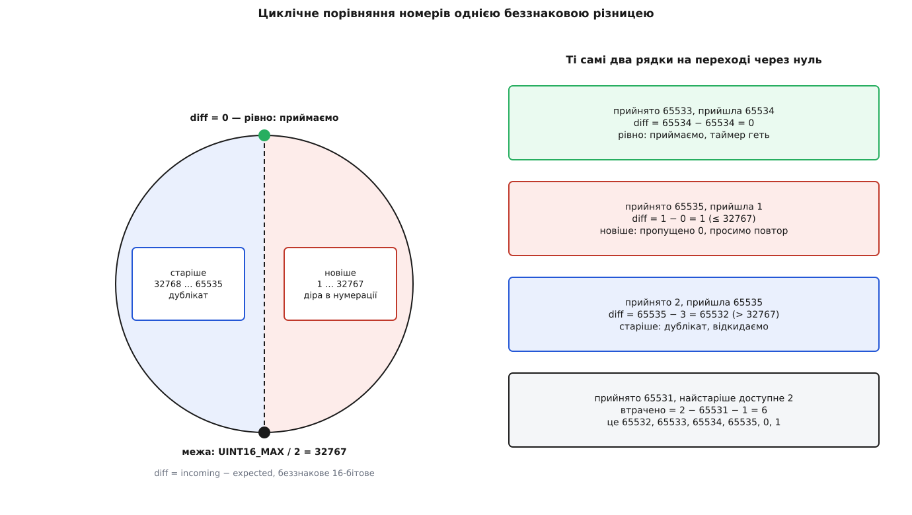

# ⚙️ Мінімальний приймач подій: одне число, один таймер, жодної загубленої події

Це двісті рядків на C++, які роблять роботу, неможливу для звичайного приймача повідомлень: вони знають не лише про події, що прийшли, а й про ті, що не прийшли. Усього й потрібно — один шістнадцятибітовий номер у пам'яті, одне беззнакове віднімання й таймер на сто мілісекунд; але кожна з цих трьох дрібниць не має простішої заміни, і код, який робить «майже так само», ламається на переході лічильника через нуль.

## Задача

Звичайний приймач телеметрії живе за правилом «показуй те, що прийшло». Для подій це правило дає неправду. Якщо подія «критично низький заряд» не долетіла, екран лишається чистим — і чистий екран пілот прочитає як «усе гаразд». Тиша й відсутність проблеми виглядають однаково, а означають протилежне.

Отже, задача формулюється навиворіт: **приймач мусить знати про кожну подію, зокрема й про ту, якої він не отримав**. Із цього випливають чотири обов'язки:

1. Виявити пропуск — у той момент, коли він стався, а не колись потім.
2. Попросити пропущене й дочекатися його, не пропустивши тим часом нове.
3. Коли пропущеного вже немає на борту — порахувати, скільки саме подій утрачено безповоротно, і сказати про це вголос.
4. Пережити перезавантаження апарата, після якого нумерація починається спочатку.

Умови, в яких це доводиться робити, роботи не полегшують. Канал не має підтверджень: MAVLink поверх телеметричного радіо — потік, у якому кадри просто зникають. Буфер подій на борту крихітний: усталене значення в PX4 — двадцять подій, далі найстаріша витісняється, і перезапитати її вже нічим. Номер події — `uint16_t`, тобто через кожні 65536 подій лічильник обертається. Апарат може перезавантажитися посеред роботи станції. І кожен компонент — автопілот, підвіс, камера — веде **власну** нумерацію, нічого не знаючи про сусідів.

Останнє одразу задає межу класу, який ми пишемо: **один примірник приймача на один компонент**. Спільний лічильник на двох джерелах давав би суцільні фальшиві пропуски, бо номери 7 від автопілота й 7 від камери — різні номери.

## Ідея

Уся машина тримається на одному інваріанті:

```
_latest — номер, до якого включно все вже доставлено нагору
          в правильному порядку і без дір
```

Кожен рядок коду або зберігає цей інваріант, або відновлює його після поламання. Прийшла подія з номером `_latest + 1` — інваріант розширюється на одиницю. Прийшла з більшим — розширити не можна, тож подію викидаємо й просимо ту, якої бракує. Прийшла з меншим — інваріант її вже покриває, це дублікат.

Три гілки, п'ять полів стану, один таймер на випадок, коли запит теж загубився. Усе інше — подробиці.

Вибір «викинути й перезапитати» замість «зберегти й дочекатися» — не лінощі, а свідома угода. Буфер переупорядкування коштує пам'яті, межі, витіснення й окремого стану «що робити, коли пропущене вже не приїде ніколи»; викидання коштує зайвого пробігу кількох пакетів. На потоці, де подій одиниці на секунду, друге дешевше з великим запасом. Це той самий компроміс, що й у [надійному обміні](book:communications/reliable-link) — доставці попри втрати через підтвердження, повтор і перезапит утраченого, — тільки зсунутий у бік простоти приймача.

## Чому віднімання, а не порівняння

Найтонше місце всієї програми — питання «який із двох номерів новіший». Спокуса відповісти `if (incoming > expected)` природна й хибна: номери циклічні, і після 65535 йде 0, який «менший» за все на світі.

Правильна відповідь спирається на властивість беззнакової арифметики: різниця двох `uint16_t` сама по собі циклічна й дає відстань за колом.

```cpp
enum class Cmp { older, equal, newer };

static Cmp compare(uint16_t expected, uint16_t incoming)
{
    if (expected == incoming) {
        return Cmp::equal;
    }
    const uint16_t diff = static_cast<uint16_t>(incoming - expected);
    return diff > UINT16_MAX / 2 ? Cmp::older : Cmp::newer;
}
```

Геометрично це виглядає так: усі 65536 номерів лежать на колі, очікуваний стоїть угорі, і півколо праворуч від нього — майбутнє, півколо ліворуч — минуле.



*Межа стоїть рівно посередині кола, тому «новіше» й «старіше» лишаються осмисленими на будь-якому номері, зокрема на переході через нуль.*

Тут варто зупинитися на приведенні типу. У C++ операнди дрібніші за `int` спершу підвищуються до `int` — це [просування цілих типів](book:programming/integer-promotion), — тож `incoming - expected` рахується у знаковому типі й для `incoming = 1`, `expected = 65535` дасть −65534. Саме зворотне приведення до `uint16_t` перетворює це число на 2, тобто на правильну відстань за колом. Механізм той самий, що в необережному коді дає [беззнакове переповнення](book:programming/unsigned-overflow), — тут він працює на нас, але лише доти, доки результат явно повертають у беззнаковий тип шістнадцяти бітів.

Межа `UINT16_MAX / 2` означає домовленість: діру більшу за 32767 подій приймач розпізнати не може й не намагається. Це не вада — на борту й так лежить двадцять подій, тож будь-який пропуск, більший за двадцять, однаково закінчиться відповіддю «немає».

> 🔧 **Навіщо це.** Помилки в циклічному порівнянні мають найгіршу властивість, яку може мати помилка: код працює місяцями й ламається рівно тоді, коли лічильник обернувся. PX4 закриває цю пастку зухвало — стартовим значенням `initial_event_sequence = 65535 - 10`. Нумерація починається за десять кроків до переповнення, тож **кожне** ввімкнення апарата проганяє приймач через обертання лічильника в перші секунди. Рідкісна помилка стає такою, що не помітити її неможливо.

## Каркас

Приймач нічого не знає про застосунок, у якому живе: він спілкується зі світом рівно через чотири зворотні виклики, які йому дають при народженні.

```cpp
#include <common/mavlink.h>

#include <cstdint>
#include <cstdio>
#include <functional>
#include <utility>

#define RX_TRACE(...) printf(__VA_ARGS__)      // слід виконання; у бібліотеці — порожній

class EventReceiver
{
public:
    struct Callbacks {
        std::function<void(const mavlink_request_event_t &)> send_request;
        std::function<void(int timeout_ms)>                  timer;    // <0 — вимкнути
        std::function<void(const mavlink_event_t &)>         deliver;
        std::function<void(int num_lost)>                    lost;
    };

    struct Stats { unsigned requests, duplicates, lost_total, reboots; };

    EventReceiver(Callbacks cb, uint8_t our_sysid, uint8_t our_compid,
                  uint8_t sysid, uint8_t compid)
        : _cb(std::move(cb)),
          _our_sysid(our_sysid), _our_compid(our_compid),
          _sysid(sysid), _compid(compid) {}

    void processMessage(const mavlink_message_t &msg)
    {
        if (msg.sysid != _sysid || msg.compid != _compid) {
            return;                     // цей примірник обслуговує один компонент
        }
        switch (msg.msgid) {
        case MAVLINK_MSG_ID_EVENT:                  onEvent(msg);   break;
        case MAVLINK_MSG_ID_CURRENT_EVENT_SEQUENCE: onCurrent(msg); break;
        case MAVLINK_MSG_ID_RESPONSE_EVENT_ERROR:   onError(msg);   break;
        default: break;
        }
    }

    Stats stats() const { return { _requests, _duplicates, _lost_total, _reboots }; }

    /* onTimeout() — тут же, у тілі класу; його показано разом із request()  */

private:
    /* Cmp і compare() — з попереднього блоку; onEvent, onCurrent, onError,
       request, checkReboot — теж члени цього ж класу                       */

    const Callbacks _cb;
    unsigned _requests{0}, _duplicates{0}, _lost_total{0}, _reboots{0};
    /* решта стану — нижче */
};
```

Далі всі методи й поля живуть у цьому ж тілі класу, тож `compare` видно з `onEvent` незалежно від порядку рядків.

Усі чотири виклики обов'язкові, і клас на це розраховує: він не перевіряє їх на порожність перед кожним звертанням. Бібліотека `libevents` тут обережніша й обгортає керування таймером умовою — але обережність такого штибу лише переносить помилку конфігурації з місця, де її видно, у місце, де приймач тихо перестає повторювати запити.

## Стан

Усе, що приймач пам'ятає понад лічильники:

```cpp
uint16_t _latest{};             // останній ПРИЙНЯТИЙ номер
bool     _has_sequence{false};  // чи є від чого рахувати
uint32_t _last_boot_ms{0};      // час від увімкнення останньої прийнятої події

bool     _has_current{false};
uint16_t _latest_current{};     // останній номер із широкомовного CURRENT_EVENT_SEQUENCE

uint8_t  _our_sysid, _our_compid;   // ми
uint8_t  _sysid, _compid;           // джерело
```

Кожне поле тут закриває конкретну діру, і жодне не є зайвим.

`_has_sequence` окремо від `_latest` потрібен тому, що **нуль — цілком законний номер події**. Позначити «ще нічого не бачили» нулем неможливо, найбільшим значенням — теж; єдиний чесний спосіб сказати «числа немає» — окремий прапорець. Він же вимикається при перезавантаженні апарата, і саме через нього приймач повертається в стан «беру за початок те, що прийде наступним».

`_has_current` і `_latest_current` тримають номер із широкомовного повідомлення. Без нього **остання** подія перед тишею лишилася б загубленою назавжди: пропуск виявляється лише тоді, коли приходить щось із більшим номером, а наступної події може не бути годинами. Регулярне «мій останній номер такий-то» перетворює тишу на перевірне твердження.

`_last_boot_ms` — страхувальник на випадок, коли прапорець перезавантаження загубився разом зі своїм пакетом.

Дрібниця, варта уваги: в оригінальній бібліотеці `libevents` поле `_latest_current_sequence` оголошене як `uint32_t`, хоча зберігає шістнадцятибітовий номер. Шкоди немає лише тому, що кожне його використання звужує значення назад до `uint16_t` у виклику `compare`. Тип, ширший за значення, — не запас міцності, а прихована залежність від того, що хтось нижче за течією не забуде звузити.

## Три гілки

```cpp
void onEvent(const mavlink_message_t &msg)
{
    mavlink_event_t ev;
    mavlink_msg_event_decode(&msg, &ev);

    checkReboot(ev.event_time_boot_ms);

    if (!_has_sequence) {               // перша подія від цього компонента
        _has_sequence = true;
        _latest = static_cast<uint16_t>(ev.sequence - 1);
    }

    switch (compare(static_cast<uint16_t>(_latest + 1), ev.sequence)) {
    case Cmp::older:                    // дублікат: інваріант його вже покриває
        RX_TRACE("  дублікат seq=%u\n", unsigned(ev.sequence));
        ++_duplicates;
        return;                         // таймер НЕ чіпаємо
    case Cmp::newer:                    // між _latest і ev.sequence зяє діра
        RX_TRACE("  пропуск: чекали %u, прийшла %u\n",
                 unsigned(uint16_t(_latest + 1)), unsigned(ev.sequence));
        request(static_cast<uint16_t>(_latest + 1));
        return;                         // саму подію викидаємо
    case Cmp::equal:
        break;
    }

    _latest       = ev.sequence;
    _last_boot_ms = ev.event_time_boot_ms;
    _cb.timer(-1);                      // очікуване прийшло — таймер більше не потрібен

    if (_has_current && compare(_latest, _latest_current) == Cmp::newer) {
        request(static_cast<uint16_t>(_latest + 1));   // борт попереду — просимо далі
    }

    if (ev.destination_system != _our_sysid && ev.destination_system != 0) {
        return;
    }
    if (ev.destination_component != _our_compid &&
        ev.destination_component != MAV_COMP_ID_ALL) {
        return;
    }

    _cb.deliver(ev);
}
```

Чотири місця в цьому методі виглядають довільними, а насправді кожне вимушене.

**Ініціалізація через `sequence - 1`.** Станція під'єдналася посеред польоту й почула номер 137. Це не сто тридцять сім утрачених подій, а перше, що вона взагалі почула. Ставимо `_latest = 136`, і подія 137 негайно проходить гілкою «рівно» — тобто інваріант заводиться порожнім і одразу розширюється на першу ж подію.

**Дублікат не вимикає таймера.** Гілка `older` повертається раніше, ніж виконання дійде до рядка `_cb.timer(-1)`, і це не випадковість. Уявімо: ми попросили подію 65528, таймер зведено, і тут приходить запізніла копія події 65527. Якби вона вимкнула таймер, повтор запиту вже не стався б ніколи, а очікувана подія так і не прийшла б. Дублікат не є доказом того, що канал працює на нашу користь.

**Прийняв — одразу проси наступну.** Після успішного прийняття приймач звіряється з широкомовним номером: якщо борт уже пішов далі, наступна подія проситься **негайно**, не чекаючи ста мілісекунд. Саме це перетворює відновлення діри з повільного крокування за таймером на суцільну серію запит-відповідь.

**Фільтр адресата — після обліку, а не до нього.** Більшість подій широкомовні, але деякі мають конкретного адресата. Спокуса відсіяти чужі на початку методу закінчується катастрофою: кожна чужа подія забрала б собі номер, і в нумерації утворилася б діра, якої насправді немає. Приймач нескінченно просив би подію, адресовану не йому, отримував би її, знову викидав — і не рухався б з місця. Тому облік ведеться для **всіх** подій, а фільтр стоїть в останньому рядку, перед самою видачею нагору.

## Запит і таймер

```cpp
void request(uint16_t sequence)
{
    mavlink_request_event_t req{};
    req.target_system    = _sysid;
    req.target_component = _compid;
    req.first_sequence   = sequence;
    req.last_sequence    = sequence;

    ++_requests;
    _cb.send_request(req);
    _cb.timer(100);      // не прийшло за 100 мс — попросимо ще раз
}

void onTimeout()
{
    RX_TRACE("  таймер: повторюємо запит\n");
    request(static_cast<uint16_t>(_latest + 1));
}
```

Повідомлення дозволяє просити діапазон, але ми завжди просимо рівно один номер: `first_sequence == last_sequence`. Причина в тому, що приймач і без діапазону вибирає серію на повній швидкості — кожна прийнята подія одразу тягне наступну, — а от помилитися з діапазоном легко: борт відповідає **окремим повідомленням на кожен номер**, тож запит на тисячу номерів — це тисяча пакетів у вузькому каналі за одне прохання.

Таймер тут одноразовий і має рівно два джерела: `request` його зводить, успішне прийняття очікуваної події гасить. Жодних інших місць бути не повинно, і саме симетрія цих двох дій робить машину скінченною.

## Коли відновити нічого

Буфер на борту вміщає двадцять подій — це звичайний [кільцевий буфер](book:algorithms/ring-buffer), у якому нове витісняє найстаріше. Якщо станція мовчала довше, ніж двадцять подій, запитане вже витіснено, і борт відповідає повідомленням про помилку з полем `sequence_oldest_available`.

```cpp
void onError(const mavlink_message_t &msg)
{
    mavlink_response_event_error_t err;
    mavlink_msg_response_event_error_decode(&msg, &err);

    if (err.target_system != _our_sysid || err.target_component != _our_compid) {
        return;                         // відповідь не нам
    }
    if (compare(static_cast<uint16_t>(_latest + 1), err.sequence) != Cmp::equal) {
        return;                         // відповідь не на той номер, якого ми чекаємо
    }

    const uint16_t num_lost =
        static_cast<uint16_t>(err.sequence_oldest_available - _latest - 1);
    _lost_total += num_lost;
    _cb.lost(num_lost);

    _latest = static_cast<uint16_t>(err.sequence_oldest_available - 1);
    request(static_cast<uint16_t>(_latest + 1));
}
```

Дві перевірки на початку — не формальність. Друга особливо: за той час, поки відповідь ішла каналом, потрібна подія могла надійти іншим шляхом, і тоді `_latest` уже посунувся. Прийняти застарілу відповідь означало б відкинути `_latest` назад і почати все спочатку — приймач просив би вже прийняте по колу.

Підрахунок утрачених знову спирається на циклічну арифметику й знову вимагає явного звуження. Найкраще це видно на числах із переходу через нуль:

```
_latest                   = 65531   (усе до нього включно доставлено)
sequence_oldest_available = 2       (найстаріше, що ще є на борту)

num_lost = uint16_t(2 − 65531 − 1) = uint16_t(2 − 65532)
         = 65536 + 2 − 65532 = 6

справді втрачено: 65532, 65533, 65534, 65535, 0, 1 — шість подій
```

Без приведення до `uint16_t` вираз лишився б у `int` і дав би −65530 — число, яке приймач передав би нагору як кількість утрачених подій.

Останні два рядки — стрибок. `_latest` ставиться так, щоб очікуваним став найстаріший доступний номер, і той негайно просять. Приймач визнає діру, каже про неї вголос і продовжує роботу з першого місця, де ще є ґрунт під ногами.

## Перезавантаження борту

Після перезавантаження апарат починає нумерацію з того самого `65535 - 10`, а `_latest` у приймача лишається там, де його застав розрив. Далі все залежить від того, куди саме потрапить нове коло щодо старого числа, — і обидва варіанти погані. Якщо нові номери лягли в ліве півколо, приймач вважатиме кожну подію дублікатом і мовчки викидатиме їх усі, назавжди. Якщо в праве — він побачить велетенську діру й проситиме події, яких на борту ніколи не було. Тому перезавантаження треба не переживати, а **помічати**.

Основний сигнал — прапорець у широкомовному повідомленні:

```cpp
void onCurrent(const mavlink_message_t &msg)
{
    mavlink_current_event_sequence_t cur;
    mavlink_msg_current_event_sequence_decode(&msg, &cur);

    if (cur.flags & MAV_EVENT_CURRENT_SEQUENCE_FLAGS_RESET) {
        _has_sequence = false;
        ++_reboots;
    }
    if (!_has_sequence) {
        _has_sequence = true;
        _latest = cur.sequence;     // не sequence − 1: цієї події ми не бачили й не побачимо
    }

    if (compare(_latest, cur.sequence) == Cmp::newer) {
        request(static_cast<uint16_t>(_latest + 1));
    }

    _has_current    = true;
    _latest_current = cur.sequence;
}
```

Асиметрія з подією варта окремого слова. Подія ініціалізує стан як `sequence - 1`, бо вона сама мусить бути прийнята. Широкомовне повідомлення ініціалізує як `sequence`, бо воно не є подією: подія з таким номером уже пролетіла повз нас, і просити її нема сенсу — ми щойно ввімкнулися, і все, що було до цієї миті, нас не стосується. Помилка на одиницю тут дала б зайвий запит при кожному з'єднанні.

Але прапорець їде в пакеті, а пакет губиться. Тому поруч стоїть страхувальник, що дивиться на час від увімкнення в самій події:

```cpp
void checkReboot(uint32_t boot_ms)
{
    if (_last_boot_ms == 0) {
        _last_boot_ms = boot_ms;
    }
    if (boot_ms + 10000 < _last_boot_ms && _last_boot_ms < UINT32_MAX - 60000) {
        RX_TRACE("  перезавантаження борту за часом (%u << %u)\n",
                 unsigned(boot_ms), unsigned(_last_boot_ms));
        _has_sequence = false;
        _has_current  = false;
        ++_reboots;
    }
}
```

Обидві межі в цій умові — про конкретні хибні спрацювання, і жодна не є магічним числом.

**Десять секунд запасу** потрібні тому, що події з минулого приходять постійно й законно: перезапитана подія 65528 несе час, менший за час уже прийнятої 65530. Без запасу кожне успішне відновлення діри виглядало б як перезавантаження апарата.

**Верхня межа `UINT32_MAX - 60000`** закриває власне переповнення лічильника мілісекунд — воно настає приблизно через 49 діб безперервної роботи. В останню хвилину перед обертанням `boot_ms + 10000` саме обертається й стає крихітним числом, тобто перша умова спрацювала б завжди. Тому в цю хвилину приймач просто утримується від судження.

## Стенд: прогін через переповнення лічильника

Чотири зворотні виклики — це чотири шви, і саме вони роблять приймач перевірним без каналу й без апарата: замість реальних дій підставляємо [дублери-шпигуни](book:programming/test-doubles), що лише записують факт виклику. Час теж стає керованим — таймер підмінено пустушкою, а його спрацювання стенд викликає рукою в потрібну мить. Повідомлення складаємо тією ж бібліотекою, якою їх складав би борт.

```cpp
/* збірка:
     git clone https://github.com/mavlink/c_library_v2
     c++ -std=c++17 -O2 -Wall -I c_library_v2 receiver.cpp -o receiver   */

namespace {

struct Log { unsigned delivered{}, requests{}, lost{}; } g;

mavlink_message_t packEvent(uint8_t sysid, uint8_t compid,
                            uint16_t sequence, uint32_t boot_ms)
{
    mavlink_event_t ev{};
    ev.id                    = 0x01352ce4;      // будь-яка подія з метаданих
    ev.event_time_boot_ms    = boot_ms;
    ev.sequence              = sequence;
    ev.log_levels            = 0x62;            // зовнішній Critical, внутрішній Info
    ev.destination_system    = 0;               // широкомовно
    ev.destination_component = MAV_COMP_ID_ALL;

    mavlink_message_t msg;
    mavlink_msg_event_encode(sysid, compid, &msg, &ev);
    return msg;
}

mavlink_message_t packCurrent(uint8_t sysid, uint8_t compid,
                              uint16_t sequence, uint8_t flags)
{
    mavlink_current_event_sequence_t cur{};
    cur.sequence = sequence;
    cur.flags    = flags;

    mavlink_message_t msg;
    mavlink_msg_current_event_sequence_encode(sysid, compid, &msg, &cur);
    return msg;
}

mavlink_message_t packError(uint8_t sysid, uint8_t compid, uint16_t sequence,
                            uint16_t oldest, uint8_t our_sysid, uint8_t our_compid)
{
    mavlink_response_event_error_t err{};
    err.target_system             = our_sysid;
    err.target_component          = our_compid;
    err.sequence                  = sequence;
    err.sequence_oldest_available = oldest;
    err.reason                    = MAV_EVENT_ERROR_REASON_UNAVAILABLE;

    mavlink_message_t msg;
    mavlink_msg_response_event_error_encode(sysid, compid, &msg, &err);
    return msg;
}

}  // namespace

int main()
{
    constexpr uint8_t kOurSys = 255, kOurComp = MAV_COMP_ID_MISSIONPLANNER;
    constexpr uint8_t kSys    = 1,   kComp    = MAV_COMP_ID_AUTOPILOT1;

    EventReceiver::Callbacks cb;
    cb.send_request = [](const mavlink_request_event_t &req) {
        ++g.requests;
        printf("  запит %u\n", unsigned(req.first_sequence));
    };
    cb.timer   = [](int /*ms*/) {};                 // час у стенді рухає onTimeout() рукою
    cb.deliver = [](const mavlink_event_t &ev) {
        ++g.delivered;
        printf("  прийнято seq=%u\n", unsigned(ev.sequence));
    };
    cb.lost = [](int n) {
        g.lost += unsigned(n);
        printf("  втрачено безповоротно %d\n", n);
    };

    EventReceiver rx(cb, kOurSys, kOurComp, kSys, kComp);

    // 1–2. звичайний хід. Борт стартує з 65535 − 10, тож перша подія — 65526
    rx.processMessage(packEvent(kSys, kComp, 65526, 30100));
    rx.processMessage(packEvent(kSys, kComp, 65527, 30250));

    // 3. подія «наперед»: 65528 і 65529 не долетіли
    rx.processMessage(packEvent(kSys, kComp, 65530, 30800));

    // 4. широкомовний номер підтверджує, що борт уже на 65530
    rx.processMessage(packCurrent(kSys, kComp, 65530, 0));

    // 5–7. борт віддає пропущене; кожна прийнята подія одразу тягне наступну
    rx.processMessage(packEvent(kSys, kComp, 65528, 30500));
    rx.processMessage(packEvent(kSys, kComp, 65529, 30640));
    rx.processMessage(packEvent(kSys, kComp, 65530, 30800));

    // 8. лічильник підходить до межі
    rx.processMessage(packEvent(kSys, kComp, 65531, 31200));

    // 9. новий пропуск — цього разу такий, що переживе обертання
    rx.processMessage(packEvent(kSys, kComp, 65534, 41000));

    // 10. відповіді немає: спрацював таймер
    rx.onTimeout();

    // 11. борт: цього вже немає, найстаріше доступне — 2 (номер уже за нулем)
    rx.processMessage(packError(kSys, kComp, 65532, 2, kOurSys, kOurComp));

    // 12. продовжуємо з найстарішого доступного
    rx.processMessage(packEvent(kSys, kComp, 2, 44300));

    // 13. запізніла копія події 1 — тепер це дублікат
    rx.processMessage(packEvent(kSys, kComp, 1, 44100));

    // 14. борт перезавантажився, а повідомлення з прапорцем RESET ми проґавили
    rx.processMessage(packEvent(kSys, kComp, 65526, 1200));

    const auto st = rx.stats();
    printf("\nдоставлено      %u\n", g.delivered);
    printf("запитів         %u\n", g.requests);
    printf("дублікатів      %u\n", st.duplicates);
    printf("втрачено        %u\n", g.lost);
    printf("перезавантажень %u\n", st.reboots);
    return 0;
}
```

Друк:

```
  прийнято seq=65526
  прийнято seq=65527
  пропуск: чекали 65528, прийшла 65530
  запит 65528
  запит 65528
  запит 65529
  прийнято seq=65528
  запит 65530
  прийнято seq=65529
  прийнято seq=65530
  прийнято seq=65531
  пропуск: чекали 65532, прийшла 65534
  запит 65532
  таймер: повторюємо запит
  запит 65532
  втрачено безповоротно 6
  запит 2
  прийнято seq=2
  дублікат seq=1
  перезавантаження борту за часом (1200 << 44300)
  прийнято seq=65526

доставлено      8
запитів         7
дублікатів      1
втрачено        6
перезавантажень 1
```

Кожне число тут перевіряється на пальцях, і чотири місця варті погляду.

**Подвійний запит 65528.** Перший — від події, що прийшла наперед; другий — від широкомовного повідомлення, яке незалежно виявило те саме відставання. Дублювання тут навмисне: два різні свідки бачать ту саму діру, і кожен має право попросити. Ціна — зайвий пакет; вигода — діра закривається навіть тоді, коли один зі свідків не долетів.

**Порядок «запит 65529, потім прийнято 65528».** Запит на наступний номер іде **до** видачі події нагору: секунда затримки в каналі коштує дорожче за мілісекунду затримки на екрані. Так серія відновлюється зі швидкістю каналу, а не таймера.

**Шість утрачених.** Це і є прогін через переповнення: `_latest` дійшов до 65531, найстаріше доступне на борту — 2, і між ними лежать 65532, 65533, 65534, 65535, 0, 1. Знакова арифметика дала б у цьому місці −65530.

**Дублікат seq=1.** Подія 1 таки долетіла — але вже після того, як приймач стрибнув на 2. Її номер лежить у лівому півколі, тож вона мовчки зникає, не зрушивши стану.

## Скільки це коштує

```
на одну подію     O(1): одне віднімання, одне порівняння
                  ні циклів, ні виділення пам'яті, ні пошуку

стан і лічильники 2 × uint16 + uint32 + 2 × bool + 4 × uint8 + 4 × unsigned
                  = 30 Б, з вирівнюванням 32 Б

чотири std::function
                  ≈ 4 × 32 Б = 128 Б — учетверо більше за весь стан;
                  у прошивці їх міняють на покажчики: 4 × 8 = 32 Б

один приймач      ≈ 160 Б; десяток компонентів — близько 1.6 КіБ

буфер переупорядкування, якого тут НЕМАЄ
                  N × sizeof(mavlink_event_t) ≈ N × 56 Б
                  плюс вставка з упорядкуванням, витіснення й межі

буфер на борту    20 подій (усталене в PX4) — жорстка стеля того,
                  що взагалі можна перезапитати
```

Два рядки в цій таблиці змінюють уявлення про програму. Перший — про `std::function`: чотири зворотні виклики важать більше, ніж уся логіка разом узята, і саме тому в бібліотеці, розрахованій і на борт, і на землю, цей вибір є свідомою поступкою зручності. Другий — останній: буфер на борту задає межу застосовності всієї схеми. Приймач відновить будь-яку діру, доки станція встигає попросити швидше, ніж борт витіснить подію. За двадцять подій на буфер і сто мілісекунд на запит це означає: канал може мовчати частками секунди й навіть секундами, але не хвилинами. Довша тиша закінчиться чесним «утрачено N» — і це рівно та поведінка, якої від приймача й хотіли: не вигадувати, а рахувати.

## Пастки

**Знакове порівняння номерів.** Найдорожча помилка з усіх можливих. Замінімо беззнакову різницю на «очевидне» `if (int(incoming) - int(expected) > 0)` і подивімося на перехід через нуль: `_latest = 65534`, очікуємо 65535, приходить подія 1 (тобто 65535 і 0 загубилися). Знакова різниця `1 − 65535 = −65534` менша за нуль — приймач вважає подію дублікатом і мовчки її викидає. Запит не надсилається, таймер не зводиться, `_latest` лишається на 65534. Далі так само відкидається кожна наступна подія: усі вони «менші». Не рятує й широкомовне повідомлення — воно порівнюється тим самим зламаним кодом. Станція глухне до перезавантаження апарата, а на екрані — чиста, спокійна тиша.

**Буферизація «наперед» без межі.** Викидати подію, що прийшла раніше за свою чергу, психологічно важко: вона ж уже тут. Але «збережу до з'ясування» тягне за собою цілу підсистему. Буфер треба чимось обмежити — інакше серія з великою дірою наповнює пам'ять подіями, які так і не дочекаються попередниці. Треба вирішити, що робити, коли пропущене виявиться назавжди втраченим: викинути весь запас чи віддати з дірою? Треба тримати порядок вставки, бо події приходять урозбрід. І треба не забути очистити буфер при перезавантаженні борту, інакше події старого польоту переплутаються з новими. Усе це — за виграш у кілька пакетів на каналі, де подій одиниці на секунду.

**Повтор запиту без вимикання таймера.** Уберімо `_cb.timer(-1)` з гілки «рівно» — і приймач, догнавши борт, продовжить кожні сто мілісекунд просити подію, якої ще не існує. Десять зайвих пакетів на секунду на кожен компонент у каналі, де смуга — найдефіцитніший ресурс. Симетрична помилка гірша: вимкнути таймер у гілці «дублікат». Тоді запізніла копія старої події гасить очікування свіжої, повтору не буде ніколи, і приймач зупиниться назавжди на першому ж запиті, відповідь на який загубилася. Правило просте: таймер зводить **лише** `request`, гасить **лише** успішне прийняття очікуваного.

**Фільтр адресата перед обліком.** Про це вже йшлося, але помилка настільки природна, що варта повторення: перевірка «чи це нам» мусить стояти між обліком і видачею, а не перед обліком. Інакше подія, адресована іншій станції, забирає собі номер і створює діру, яку неможливо закрити — борт віддаватиме ту саму подію, приймач щоразу її відкидатиме на вході.

**Один приймач на кілька компонентів.** Спокуса завести єдиний лічильник на апарат виглядає економією, а дає постійний потік фальшивих пропусків: автопілот і підвіс нумерують свої події незалежно, тож їхні номери чергуються довільно. Приймач витратить канал на запити подій, які ніхто не губив, і при цьому пропустить справжні втрати. Одиниця обліку — компонент, а не апарат.

**Довіра до чужої відповіді про помилку.** Обидві перевірки на початку `onError` захищають від одного й того самого: `_latest` рухається назад лише в цьому місці, і будь-яка помилка тут відкидає приймач у минуле. Відповідь на давно закритий запит, відповідь, адресована іншій станції, відповідь із номером, якого ми не просили, — кожна з них без перевірки означала б повторне вимагання вже прийнятого й новий «звіт про втрату» на порожньому місці.
