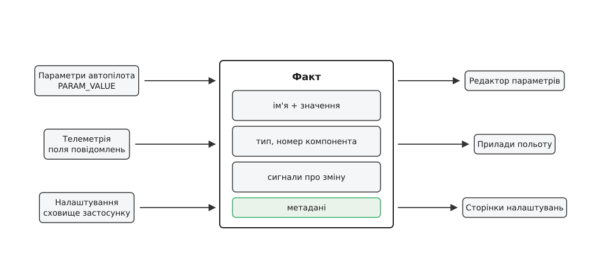
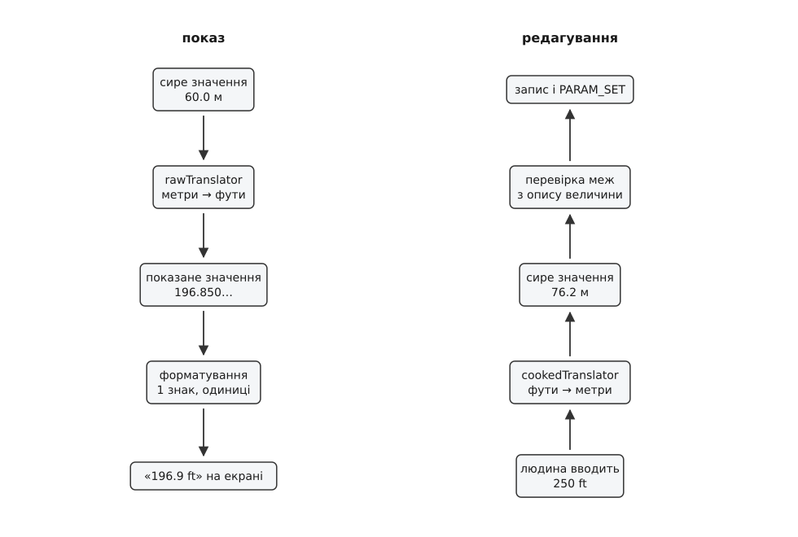
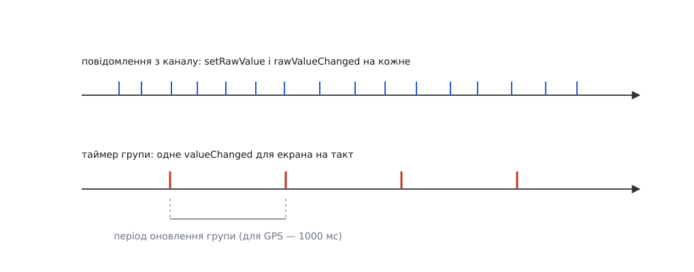

# FactSystem: факт, метадані й зв'язок зі станом

<preknowlist>
- [Протокол параметрів](book:communications/param-protocol) — як налаштування автопілота їздять каналом: вичитування списку, повідомлення `PARAM_VALUE` з іменем і числом, `PARAM_SET` на запис.
- [Пакет MAVLink](book:communications/mavlink-packet) — повідомлення це фіксований набір числових полів у наперед відомому порядку; ані імен, ані одиниць у самому пакеті немає.
- [Спостерігач](book:programming/observer) — об'єкт сповіщає підписників про зміну свого стану, нічого не знаючи про те, хто вони.
- [Прив'язка даних](book:programming/data-binding) — вираз в описі екрана перераховується сам, коли змінюється величина, від якої він залежить.
</preknowlist>

## Число прилітає без пояснень

З каналу приходить повідомлення `GPS_RAW_INT`. Серед його полів є `eph` — ціле без знаку, зараз воно дорівнює 110. Станція має показати пілотові рядок «HDOP 1.1». Між числом 110 і цим рядком лежать чотири окремі знання: що поле зветься HDOP, що його треба поділити на сто, що показувати варто з одним знаком після коми і що одиниць у цієї величини немає. Жодного з цих чотирьох знань у пакеті немає. У пакеті є 110.

З іншого боку те саме. Автопілот віддає параметр `RTL_RETURN_ALT` зі значенням 60.0. Щоб редактор параметрів був придатний до вжитку, він мусить знати: це висота, на яку апарат підійметься перед поверненням; вимірюється в метрах; від'ємною не буває; змінюється кроком 0.5; показується з одним знаком після коми; а якщо користувач вибрав фути, показати треба 196.9, а не 60.0. У повідомленні `PARAM_VALUE` є ім'я, число і код типу. Більше нічого.

І третє джерело, яке каналом узагалі не їде: власні налаштування застосунку — вибране джерело відео, система одиниць, адреса тайлового сервера. Вони лежать у сховищі налаштувань і мусять пережити перезапуск. Але на екрані вони виглядають рівно так само, як параметр: підпис, поле введення, підказка, перевірка меж.

Наївний шлях полягав би в тому, щоб кожен екран знав свої значення сам: тут ділимо на сто й підписуємо «HDOP», тут переводимо в фути й не пускаємо від'ємне. Цей шлях помирає з двох незалежних причин. Перша — арифметична: екранів десятки, значень тисячі, і те саме знання про ту саму величину доводиться повторювати в кожному місці, де вона з'являється. Друга — фатальніша: **повного списку значень немає на момент збирання застосунку**. Велика прошивка віддає понад тисячу параметрів, і завтрашня версія віддасть на десяток більше — з новими іменами, межами й описами, яких код станції ніколи не бачив. Екран, написаний під конкретний параметр, для цього десятка просто не існує.

Звідси випливає єдина конструкція, яка може працювати. Знання про величину має бути **окремими даними**, а не кодом екрана. Ці дані мають приїжджати разом із величиною або лежати поряд із нею. А сама величина має дійти до інтерфейсу в одному-єдиному вигляді — байдуже, чи прилетіла вона з автопілота, чи з поля телеметрійного повідомлення, чи зі сховища налаштувань, бо інакше «один вигляд» розсиплеться на три і ми повернемося до екранів, написаних під джерело.

Підсистему, що втілює цю конструкцію в QGroundControl, звуть FactSystem. Її завели одним комітом 9 грудня 2014 року, і опис коміту називає причину прямо: «New FactSystem — Allows parameter access from QML among other things» (запис у сховищі проєкту, автор Don Gagne). Тобто народилася вона саме тоді, коли інтерфейс станції переїжджав із рукотворних віконних форм на декларативний опис, — і питання «як віддати опису екрана тисячу параметрів, про які він нічого не знає» стало неминучим.



*Талія конструкції: скільки завгодно джерел ліворуч, скільки завгодно екранів праворуч, і рівно один вид об'єкта посередині.*

## Факт: ім'я, значення, сповіщення

Об'єкт, що стоїть у цій талії, зветься **фактом** (англ. *fact*, від лат. *factum* — зроблене; тут — ствердження, що величина з таким іменем має саме таке значення). Клас `Fact` тримає чотири речі й більше нічого:

```cpp
Fact::Fact(int componentId, const QString &name, FactMetaData::ValueType_t type, QObject *parent)
    : QObject(parent), _name(name), _componentId(componentId), _type(type)
{
    FactMetaData *const metaData = new FactMetaData(_type, this);
    setMetaData(metaData);
    _init();
}
```

Ім'я — це ключ. За ним факт знаходять у групі, під ним він поїде в `PARAM_SET`, і саме воно, а не позиція в якомусь масиві, зв'язує факт із його описом.

Номер компонента (`componentId`) відповідає на питання «чий це параметр». В одному апараті на шині сидять автопілот, камера, підвіс, і кожен має свій набір параметрів, у яких імена можуть збігатися. Для значень телеметрії, які ні до кого конкретно не належать, номер лишається `-1`.

Тип зберігається окремим полем, бо саме значення лежить у контейнері з динамічним типом. Це не лінощі: типів чотирнадцять — цілі зі знаком і без, від восьми до шістдесяти чотирьох бітів, два розміри дробових, рядок, булеве значення, тривалість у секундах. Заводити чотирнадцять класів факту немає сенсу, бо поводяться вони однаково; натомість клас один, а `_type` каже, у що приведене значення, коли його кладуть усередину.

Четверте, що є у факті, — це сповіщення про зміну. Факт успадковує механізм сигналів, тому будь-хто може підписатися на «це значення змінилося», а декларативний опис екрана може прив'язати до значення виразу, який перерахується сам. Через це факт мусить бути повноцінним об'єктом із властивостями, а не структурою з полями: властивість із сигналом зміни — це те, за що зачіпається прив'язка даних.

Повний перелік того, що факт віддає назовні (три десятки властивостей — від `valueString` до `enumStrings` і `valueEqualsDefault`), зібраний окремо: [контракт FactSystem](book:qgroundcontrol/fact-system/api-fact.md) перелічує властивості факту, ключі файлів метаданих і конструктори груп у вигляді довідкових таблиць — щоб не роздувати виклад тут.

## Метадані окремо від значення

Усе інше знання про величину живе в другому об'єкті — `FactMetaData`, на який факт тримає вказівник. Розділення тут не декоративне, і причина в ньому не одна.

Перша причина — **у часі**. Факт з'являється тієї миті, коли прилетіло значення. Опис може приїхати пізніше, приїхати неповним або не приїхати взагалі. Тому приєднання опису — окрема дія, `setMetaData()`, а факт без пристойного опису лишається робочим: він покаже голе число, і це чесно гірше, ніж із описом, але це не поламаний застосунок.

Друга причина — **у кількості**. Опис не належить конкретному екземпляру: він однаковий для параметра `RTL_RETURN_ALT` в усіх апаратах на цій прошивці й береться з бази, ключами до якої є прошивка та її версія. Прив'язавши опис до факту полями, ми змусили б себе тягати ту саму базу в кожен факт.

Усередині `FactMetaData` зібрано чотири різні за призначенням шари. Хто це — ім'я, підпис, короткий і довгий опис, категорія й група для впорядкування в редакторі. Як показувати — тип, одиниці сирі й показані, кількість знаків після коми, підписи перелічуваних значень (`enumStrings` разом із `enumValues`), підписи бітів для бітових масок, гранична довжина рядка. Що дозволено — мінімум і максимум, окремо м'якші межі для звичайного користувача, крок зміни, ознаки «лише читати» і «лише писати». Як поводитися — усталене значення, ознака «потрібне перезавантаження апарата», ознака «потрібне перезавантаження застосунку», ознака `volatile` для величин, які апарат міняє сам.

> 🔧 **Навіщо це.** Ознака «потрібне перезавантаження» — це не примітка в документації, а поле в описі параметра, тому станція вміє сама показати попередження після редагування саме тих параметрів, які без перезавантаження не подіють. Ознака `volatile` рятує від протилежної біди: значення, яке апарат крутить самотужки, не має підсвічуватися як «змінене користувачем і не збережене». Обидві поведінки з'являються без жодного рядка коду в екрані — досить, щоб прошивка позначила параметр у своєму описі.

Опис потрапляє у факт трьома дорогами, і варто знати, якою саме, бо від цього залежить, що робити, коли опису бракує.

**Дорога перша — файл, вшитий у застосунок.** Групи телеметрії описані звичайним JSON, який лежить у ресурсах збірки. Ось справжній фрагмент опису групи GPS:

```json
{
    "name":             "hdop",
    "shortDesc":        "HDOP",
    "type":             "double",
    "decimalPlaces":    1
},
{
    "name":             "lock",
    "shortDesc":        "GPS Lock",
    "type":             "uint32",
    "enumStrings":      "None,No Fix,2D Lock,3D Lock,3D DGPS Lock,3D RTK GPS Lock (float),3D RTK GPS Lock (fixed),Static (fixed)",
    "enumValues":       "0,1,2,3,4,5,6,7",
    "decimalPlaces":    0
}
```

Другий запис і є те місце, де число 3 перетворюється на слова «3D Lock»: пара `enumStrings` і `enumValues` каже, який підпис відповідає якому коду. Ніде в коді екрана цієї таблиці немає — вона в даних, і додати до неї новий тип фіксації означає дописати рядок у JSON.

**Дорога друга — опис параметрів прошивки.** Він великий (тисячі записів із довгими текстами) і залежить від того, що саме залито в апарат, тому вшити його «раз і назавжди» не можна. Застосунок бере його від служби інформації про компонент: якщо апарат уміє віддати власний файл опису, беруть його, і тоді опис гарантовано збігається з прошивкою; якщо не вміє — беруть базу, яку приніс [плагін прошивки](book:qgroundcontrol/firmware-plugin), і кладуть у кеш за іменем. Плагін прошивки — це той єдиний закуток застосунку, куди зведено все, чим PX4 відрізняється від ArduPilot: звідки брати описи параметрів, як звуться режими польоту, які повідомлення підтримані. Момент приєднання видно в менеджері параметрів прямо:

```cpp
fact = new Fact(componentId, parameterName, mavTypeToFactType(mavParamType), this);
FactMetaData *const factMetaData = _vehicle->compInfoManager()
        ->compInfoParam(componentId)->factMetaDataForName(parameterName, fact->type());
fact->setMetaData(factMetaData);
```

**Дорога третя — опис налаштувань застосунку.** Кожна група налаштувань має свій JSON того самого формату; звідти беруться усталені значення, межі й підписи для сторінок налаштувань.

Три дороги — один формат опису на кінці. Саме тому далі жоден екран не питає, звідки величина взялася.

## Сире й показане: два боки одного значення

Тепер найтонше місце конструкції. Значення в факті існує у двох виглядах одночасно, і плутати їх не можна.

**Сире значення** (`rawValue`) — це рівно те, що лежить у пам'яті апарата й летить у пакеті. Метри, радіани, соті долі градуса, коди станів. Саме воно піде назад у `PARAM_SET`, саме воно записується в журнал, саме на нього накладаються межі з опису.

**Показане значення** (`cookedValue`) — те, що бачить і вводить людина. Воно виходить із сирого перетворенням, яке лежить у описі:

```cpp
QVariant Fact::cookedValue() const { return _metaData->rawTranslator()(_rawValue); }
void Fact::setCookedValue(const QVariant &value) { setRawValue(_metaData->cookedTranslator()(value)); }
```

Перетворювачів **два**, і вони не дублюють один одного: `rawTranslator` веде вниз, до екрана, `cookedTranslator` — угору, від введеного людиною до того, що покласти в апарат. Пара потрібна саме тому, що перетворення не завжди зводиться до множення на сталу: перехід між градусами Цельсія й Фаренгейта має ще й зсув, і «поділити назад» тут не працює механічно. Тримаючи обидва напрямки явними функціями, підсистема гарантує, що редагування замикається: те, що людина ввела в своїх одиницях, лягає в апарат у його одиницях без здогадок на місці виклику.

Шарів перетворення теж два, і вони різні за природою.

**Вбудований шар** диктується самою величиною. Якщо в описі сказано, що сирі одиниці — соті долі градуса, або радіани, або нормована частка, то перетворення на градуси й відсотки не є вибором користувача: воно частина того, що ця величина означає. Такий перетворювач ставиться автоматично за рядком одиниць.

**Шар налаштувань застосунку** диктується людиною. Метри перетворюються на фути, метри за секунду — на кілометри за годину, милі за годину або вузли, градуси Цельсія — на Фаренгейти, грами — на кілограми чи фунти. Користувач перемикає систему одиниць одного разу в налаштуваннях — і змінюється показ **усіх** величин, у яких сирі одиниці метричні, бо перетворювач береться з опису, а опис спільний.

Важливий виняток, який економить години налагодження: якщо в описі є перелічувані значення або бітова маска, жодне перетворення не застосовується. І правильно: код стану GPS «3» — не кількість чогось, його не можна ані перевести в фути, ані поділити на сто.

Окремо варто розвести дві операції, які легко злипаються в голові. Множення на 1e-7, яким широта з `GPS_RAW_INT` перетворюється на градуси, — це **не** перетворювач опису. Це розбір протоколу, і робить його обробник повідомлення, перш ніж покласти число у факт:

```cpp
_latFact.setRawValue(gpsRawInt.lat * 1e-7);
```

Різниця принципова. Масштаб цілого поля — частина того, як протокол закодував величину; сирим значенням факту вважається вже розкодована широта в градусах. Перетворювач же працює над готовим сирим значенням і відповідає лише за показ. Змішавши їх, ми або поклали б у журнал напівоброблене число, або показали б людині щось, що ніколи не існувало.

**Умова: параметр висоти повернення, у якому сирі одиниці — метри, один знак після коми, крок 0.5, мінімум 0; користувач вибрав фути (1 фут = 0.3048 м рівно, за міжнародною угодою 1959 року).**

```
сире значення з апарата          = 60.0            м
rawTranslator (м → фути)         = 60.0 / 0.3048   = 196.850393…
показане значення                = 196.850393…     фути
знаків після коми: 1  →  рядок   = «196.9 ft»

людина вводить                   = 250             фути
cookedTranslator (фути → м)      = 250 × 0.3048    = 76.2   м
перевірка меж: 76.2 ≥ 0          → так
сире значення                    = 76.2
у канал                          → PARAM_SET(RTL_RETURN_ALT, 76.2)
```

І одразу пастка, що випливає з цієї ж арифметики. Рядок на екрані **округлений**, а сире значення — ні. Якщо людина візьме показане «196.9» і збереже його не міняючи, назад поїде 196.9 × 0.3048 = 60.02232 м — параметр зміниться, хоча користувач нічого не редагував. Живе це не в помилці коду, а в самій природі показу: округлення необоротне. Тому редактор і не переписує значення, доки поле справді не редагували.



*Два напрямки одного значення: вниз — показ, угору — редагування; перевірка стоїть на вході в сире значення, тобто на межі, за якою починається апарат.*

## Запис, перевірка й луна

Записати у факт — не те саме, що присвоїти полю. Дивімося, що насправді робить `setRawValue`:

```cpp
if (_metaData->convertAndValidateRaw(value, true, typedValue, errorString)) {
    bool changed = false;
    { QMutexLocker<QRecursiveMutex> locker(&_rawValueMutex);
        if (typedValue != _rawValue) { _rawValue = typedValue; changed = true; }
    }
    if (changed) { emit containerRawValueChanged(typedValue); emit rawValueChanged(typedValue); }
}
```

Дві перевірки поспіль, і кожна закриває свою дірку.

Перша — приведення й перевірка меж. Значення переводиться в оголошений тип і звіряється з мінімумом та максимумом з опису; якщо не пройшло, повертається текст помилки, а факт лишається недоторканим. Той самий метод доступний і з опису екрана: поле введення викликає перевірку по завершенню редагування, показує помилку й **лишає старе значення**. Тобто факт неможливо привести в недопустимий стан, а місце, де записано «що допустимо», одне — опис.

Друга — звірка з поточним значенням. Присвоєння того самого числа не міняє нічого й не породжує сигналів. Це не мікрооптимізація, а захист від луни, бо шлях запису замкнений у кільце: людина відредагувала → полетів `PARAM_SET` → апарат прийняв і у відповідь надіслав `PARAM_VALUE` із прийнятим значенням → менеджер параметрів кладе його назад у той самий факт. Без звірки кожен запис породжував би нескінченний обмін.

Але самої звірки мало, бо апарат може прийняти значення не точно таким, яким його надіслали (обрізати за своїми межами, округлити до свого типу). Тоді значення справді інше, зміна справді відбулася — і за звичайним шляхом факт негайно надіслав би це «нове» значення назад на борт. Тому для значень, що приходять з апарата, є окремі двері:

```cpp
/// Value coming from Vehicle. This does NOT send a containerRawValueChanged signal.
void containerSetRawValue(const QVariant &value);
```

Ось головна думка цього місця: **напрямок має значення**. Значення від людини і значення від апарата лягають в одне й те саме поле, але заходять різними дверима, бо наслідки в них протилежні — перше треба відправити на борт, друге вже звідти прийшло.

## Три сигнали для трьох споживачів

Сигналів у факту три, і кожен існує тому, що є споживач, якому інші два не годяться.

`valueChanged` несе **показане** значення й адресований інтерфейсу — тому й показане, що інтерфейс саме його виводить.

`rawValueChanged` несе **сире** значення й адресований логіці та журналові: тому, хто мусить бачити істину в одиницях апарата на кожну зміну.

`containerRawValueChanged` адресований **власникові** факту — тому, хто зобов'язаний щось зробити зі зміною назовні: надіслати `PARAM_SET`, записати в сховище налаштувань. Це той сигнал, який навмисно мовчить, коли значення прийшло з апарата.

Розділення на три дає ще одну властивість, без якої не працює наступний розділ: сигнали можна вмикати й глушити **незалежно**. Інтерфейс може отримувати оновлення рідше, ніж журнал, — і при цьому не втратити жодного значення, лише частину сповіщень.

## Група фактів і темп оновлення

Телеметрія приходить із темпом каналу, а не з темпом ока. Орієнтація апарата в потоці — це десятки повідомлень на секунду, і в кожному кілька полів. Якщо кожне таке значення штовхатиме інтерфейс, станція перемальовуватиметься сотні разів на секунду, показуючи людині рухи цифр, яких вона все одно не зчитає. При цьому просто відкидати значення не можна: журналові й логіці потрібні всі.

Розв'язок живе в контейнері фактів — `FactGroup`. Група створюється з двома речами: періодом оновлення в мілісекундах і файлом опису для своїх фактів.

```cpp
VehicleGPSFactGroup::VehicleGPSFactGroup(QObject *parent)
    : FactGroup(1000, ":/json/Vehicle/GPSFact.json", parent)
```

Коли період нульовий, факти сигналять негайно. Коли ненульовий — група при додаванні кожного факту глушить його сповіщення для інтерфейсу:

```cpp
fact->setSendValueChangedSignals(_updateRateMSecs == 0);
```

Далі механіка проста й акуратна. Заглушений факт при зміні не мовчить безслідно, а піднімає прапорець «я змінився»:

```cpp
void Fact::_sendValueChangedSignal(const QVariant &value) {
    if (_sendValueChangedSignals) { emit valueChanged(value); _deferredValueChangeSignal = false; }
    else                          { _deferredValueChangeSignal = true; }
}
```

А таймер групи раз на період проходить усі свої факти й випускає накопичене — по одному сповіщенню на факт і лише для тих, у кого прапорець піднято.

Зверніть увагу, чого тут **не** зроблено: `rawValueChanged` не глушиться ніколи. Значення оновлюється щоразу, коли прийшло повідомлення; притлумлено лише **сповіщення для інтерфейсу**. Дані не втрачаються — злипаються повідомлення про них. Тому журнал бачить кожен зразок, а екран — не частіше одного разу на період. Група GPS, наприклад, оновлює екран раз на секунду, і цього для координат більш ніж досить.

Там, де темп ока таки потрібен (налаштувальні сторінки, де людина крутить регулятор і має бачити реакцію негайно), група вміє перейти в живий режим: таймер зупиняється, глушники з фактів знімаються.

> 🔧 **Навіщо це.** Період оновлення — те перше, куди варто дивитися, коли станція «гальмує на телеметрії». Він задається однією константою в конструкторі групи й не потребує жодних змін в екранах: усі, хто підписаний на факти цієї групи, автоматично починають отримувати сповіщення рідше. І навпаки — прилад, що смикається, майже завжди означає, що його група стоїть у живому режимі там, де він не потрібен.

Групи ще й вкладаються одна в одну, і це те, як тисячі значень лишаються знаходжуваними. Усередині групи два словники — імена до фактів і імена до підгруп, тож звертатися можна складеним іменем, `getFact("gps.lock")`, а в описі екрана — крапковим ланцюжком на кшталт `vehicle.gps.lock.value`. Там, де кількість однотипних джерел наперед невідома (акумулятори, регулятори обертів), замість фіксованих полів стоїть список груп, який росте разом із тим, що звітує апарат.



*Злипання сповіщень: сире значення й журнал бачать кожен зразок, інтерфейс — один підсумок на такт таймера.*

## Три джерела — одна абстракція

Тепер видно, як усі три джерела з першого розділу входять в один і той самий об'єкт, і чому кожне з них потребує рівно однієї маленької деталі, специфічної для себе.

**Параметри апарата.** Менеджер параметрів створює факт, коли прилітає `PARAM_VALUE` з невідомим досі іменем, приєднує до нього опис і — єдина специфічна деталь — підписується на сигнал власника:

```cpp
connect(fact, &Fact::containerRawValueChanged, this, &ParameterManager::_factRawValueUpdated);
```

Далі все, що робить редагування параметра на будь-якому екрані станції, — це запис у факт; решта (черга, повтори, очікування підтвердження) належить менеджерові й описана окремо в [менеджері параметрів](book:qgroundcontrol/parameter-manager). Менеджер тримає словник «ім'я → факт», тому два різні екрани, що показують один параметр, отримують **той самий об'єкт** і не можуть розійтися в показаннях — класичний прийом, знаний як [карта тотожності](book:programming/identity-map).

**Телеметрія.** Об'єкт апарата тримає близько двох десятків груп фактів — окремо GPS, вітер, вібрація, температури, годинник, точки завдання, далекоміри, стан оцінювача, генератор, обороти двигунів. Специфічна деталь тут одна: обробник повідомлення, який розкладає поля пакета по фактах. Він же відповідає за домовленості протоколу: там, де MAVLink позначає «даних немає» максимальним значенням поля, обробник кладе у факт «не число», щоб на екрані з'явився прочерк, а не 655.35. Хто якою групою володіє й коли вона з'являється — у статті про [об'єкт апарата](book:qgroundcontrol/vehicle-object).

**Налаштування застосунку.** Спеціалізований факт налаштування читає початкове значення зі сховища при створенні, а зберігання робить підпискою на власний же сигнал:

```cpp
connect(this, &Fact::rawValueChanged, this, &SettingsFact::_rawValueChanged);
```

Тобто «збережи» тут не окрема дія, а наслідок зміни. Самі факти налаштувань створюються ліниво — при першому звертанні, бо їх сотні, а відкрита сторінка налаштувань чіпає одиниці. Що саме переживає перезапуск і де воно лежить — у статті про [збереження налаштувань](book:qgroundcontrol/settings-persistence).

Три джерела, три маленькі деталі, один тип об'єкта на виході. Саме це й було метою.

## Що з цього отримує екран

Тепер повернімося до того, з чого починали: як число стає рядком на екрані, і скільки коду для цього треба написати.

```qml
FactTextField {
    fact: controller.getParameterFact(-1, "RTL_RETURN_ALT")
}
```

Це весь опис. Поле бере з факту готовий рядок значення — вже переведений у вибрані одиниці, вже округлений до потрібного знака, вже з підписом одиниць; при завершенні редагування питає у факту, чи допустиме введене, і тільки тоді записує. Кнопка довідки поруч показує довгий опис із метаданих.

Причому **опис визначає не лише вміст, а й сам вигляд елемента керування**. Є перелічувані значення — доречний випадний список, який покаже слова замість кодів. Є бітова маска — доречний набір прапорців із підписами бітів. Тип булевий — галочка. Є мінімум, максимум і крок — можна дати повзунок. Стоїть ознака «лише читати» — не поле введення, а підпис. Через це редактор параметрів у станції не має жодного екрана «під параметр»: це загальна таблиця, яка для кожного рядка запитує в факту, яким елементом його показати. Підказка береться з короткого опису, підсвічування «змінено» — з порівняння з усталеним значенням, попередження про перезавантаження — з відповідної ознаки.

Наслідок, заради якого все й будувалося: **щоб новий параметр прошивки з'явився в станції з описом, межами й правильними одиницями, у станції не треба міняти нічого.** Досить, щоб прошивка принесла його опис. Це загальний прийом, не винахід цього застосунку, — [інтерфейс, породжений метаданими](book:programming/metadata-driven-ui) будують усюди, де набір величин не відомий наперед; а сам факт, який стоїть між даними й екраном, віддаючи екранові готове до показу й приймаючи введене, — це те, що в клієнтській архітектурі звуть [моделлю подання](book:programming/model-view-viewmodel).

Так само нічого не треба міняти в екранах, щоб додати власну групу телеметрії з власного MAVLink-повідомлення: пишеться клас групи, JSON з описом, обробник — і значення стає доступним усім елементам станції нарівні з рідними. Повний прохід цієї задачі — від повідомлення до показника — розібраний у [власній групі фактів](book:qgroundcontrol/fact-system/proj-custom-factgroup.md).

## Де ця конструкція болить

Розділення значення й опису дає силу, але має ціну, і ціна ця цілком конкретна.

**Опис — це локальна база, і вона старіє.** Коли в апараті прошивка новіша за ту, для якої станція має опис, параметр з'явиться в редакторі голим числом без пояснення й без меж. Прикро, але терпимо. Значно гірший інший випадок: опис є, але **неправильний** — з чужими межами або чужими одиницями. Тоді станція впевнено покаже неправду й ще й не пустить ввести правильне значення, бо воно «за межами». Через це вміння апарата віддавати власний опис — не косметика, а спосіб зробити опис завжди відповідним прошивці.

**Кожен факт — повноцінний об'єкт.** Тисяча параметрів — це тисяча об'єктів із сигналами плюс їхні описи. Звідси дві поведінки, які інакше виглядають дивно: факти параметрів створюються не наперед, а в міру надходження значень з апарата, а факти налаштувань — ліниво, при першому звертанні.

**Факти живуть в одному потоці.** Розбір каналу відбувається не там, де інтерфейс, тож обробник повідомлення не може смикати факт із чужого потоку напряму — значення передаються туди, де живуть факти. Це окрема тема: [модель потоків станції](book:qgroundcontrol/threading-model).

**Показане значення не можна ані писати в журнал, ані відправляти на борт.** Воно залежить від налаштування, яке людина перемкне завтра, — і журнал, записаний у футах, стане нечитним, а параметр, надісланий у футах, буде прийнятий як метри. Правило просте: назовні виходить тільки сире.

**Мовчазний запис того самого значення.** Присвоєння рівного значення не породжує сигналу взагалі. Тому індикатор «канал живий», побудований на сповіщеннях про зміну, гасне на нерухомому апараті — рахувати треба повідомлення, а не зміни значень.

Кожна з цих граблів — прямий наслідок того самого рішення: істина зберігається один раз у сирому вигляді, а все інше є її поданням. Власне, у цьому й головна думка підсистеми: FactSystem описує не так значення, як **знання про значення**. Екран станції — функція від цього знання, і саме тому станція вміє показати апарат, про який їй ніхто нічого не розповідав.
